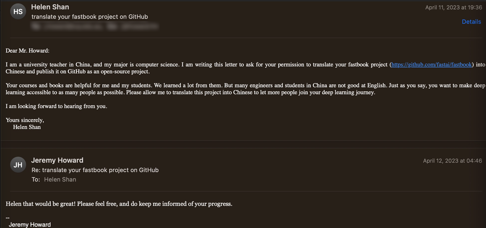

# 人人可学的深度学习

本项目是基于 Jeremy Howard 与 Sylvain Gugger 编写的「Deep Learning for Coders with fastai & PyTorch：Al Applications Without a PhD」一书的开源版 [Fastbook](https://github.com/fastai/fastbook) 的翻译项目，**感谢 [Jeremy Howard](https://jeremy.fast.ai) 对项目的授权与支持。**

- 感谢 **单博士**（ Helen Shan）对本项目的贡献，她承担了与 Jeremy Howard 的对接及主要翻译工作。
- 我本人负责代码技术与翻译内容优化及校对工作。

本书是传授深度学习快速实现的教程并包含工程代码。用于帮助那些有志挑战深度学习，但苦于没有深厚的工程或数学背景，及英文不是非常精通的朋友们。

很多人认为，想要利用深度学习取得很好的结果需要各种难以获取的资源，但是通过这本书您会发现这种想法是错误的。下表所列举的几项误解，即便是世界级的深度学习工作也是完全不需要的：

|     误解（很神秘但不需要）     |                     真相                     |
| :--------------------: | :------------------------------------------: |
|   大量专业数学知识   |         高中数学就足够了         |
|       海量数据       | 我们曾见过用不到50条的数据取得破纪录结果 |
| 大量昂贵的算力 |        你可以免费获得最先进的工作成果        |

记住，要想在机器学习上取的成功，你不需要任何特定的大学学习背景。许多在研究与工业领域取得的重大突破都是由那些没有博士学位的人取得的，例如：[“基于深度卷积生成对抗网络的无监督表示学习”](https://arxiv.org/abs/1511.06434)，在过去的10年这篇文章是最有影响力的论文之一，有超过5000次的引用，写这篇论文的作者亚历克·雷德福当时仅仅是一名大学生。即使在特思拉，他们尝试了一个终极挑战：制造一辆自动驾驶的汽车。首席执行管伊隆·马斯克曾说过：

**> 说白了，博士学位是不需要的。在某种程度上，所有的事情是对人工智能的深度理解，以及具备实施神经网络的能力，这是非常有用的（后者真的很难）。如果你只有本科学历请不要在意。**
>
如果您希望在深度学习上取得成功，需要做的事情是：把您在这本书里所学到的东西应用到项目中去，并坚持不懈！

**目录**

[第一章 开启深度学习之旅](./Smartbook_01_intro.ipynb)  (翻译并整理中)

[第二章 产品]()（未开始）

[第三章 数据伦理]()（未开始）

[第四章 mnist基础]()（未开始）

[第五章 基于宠物品种的图像分类]()（未开始）

[第六章 多标签分类]()（未开始）

[第七章 数据尺寸和测试数据增强]()（未开始）

[第八章 协同过滤]()（未开始）

[第九章 表格模型]()（未开始）

[第十章 自然语言处理]()（未开始）

[第十一章 数据处理中级API]()（未开始）

[第十二章 自然语言处理深潜]()（未开始）

[第十三章 卷积]()（未开始）

[第十四章 残差网络]()（未开始）

[第十五章 应用架构深入研究]()（未开始）

[第十六章 加速随机梯度下降]()（未开始）

[第十七章 基础神经网络]()（未开始）

[第十八章 类激活映射]()（未开始）

[第十九章 学习器]()（未开始）

[第二十章 总结思考]()（未开始）
