# 01_intro.ipynb

# 第一章 深度学习概论

## Your Deep Learning Journey

## 深度学习之旅

Hello, and thank you for letting us join you on your deep learning journey, however far along that you may be! In this chapter, we will tell you a little bit more about what to expect in this book, introduce the key concepts behind deep learning, and train our first models on different tasks. It doesn't matter if you don't come from a technical or a mathematical background (though it's okay if you do too!); we wrote this book to make deep learning accessible to as many people as possible.

您好，非常幸运可以参与到您的深度学习学习过程中来，当然也有可能您现在尚在起步阶段！ 在本章节，我们会告诉你一些关于对本书的预期，介绍深度学习背后的关键概念，以及不同的任务中去训练我们的第一个模型。如果你没有技术和数学背景没有关系（当然如果你已经这样做了，那是非常好的！）。通过这本书我们希望可以让尽可能多的人可以可以做深度学习方面的工作。

## Deep Learning Is for Everyone

## 大众的深度学习

A lot of people assume that you need all kinds of hard-to-find stuff to get great results with deep learning, but as you'll see in this book, those people are wrong. Here's a few things you absolutely don't need to do world-class deep learning:

很多人认为，你需要所有很难找到的东西才能在机器学习上取得很好的结果，然而在你读完本书后，你会发现那些人是不正确的。相对于世界级深度学习，有些事情你是绝对不需要做的：

|      Myth (don't need)      |                            Truth                             |
| :-------------------------: | :----------------------------------------------------------: |
|        Lots of math         |             Just high school math is sufficient              |
|        Lots of data         |  We've seen record-breaking results with <50 items of data   |
| Lots of expensive computers | You can get what you need for state of the art work for free |

|  神话（真相并非如此）  |                     真相                     |
| :--------------------: | :------------------------------------------: |
|   大量的数学专业知识   |         只需要高中的数学水平就可以了         |
|       海量的数据       | 我们可以用不到50条数据就可以看到突破行的结果 |
| 大量且昂贵的计算机算力 |        你可以免费获得最先进的工作成果        |

Deep learning is a computer technique to extract and transform data–-with use cases ranging from human speech recognition to animal imagery classification–-by using multiple layers of neural networks. Each of these layers takes its inputs from previous layers and progressively refines them. The layers are trained by algorithms that minimize their errors and improve their accuracy. In this way, the network learns to perform a specified task. We will discuss training algorithms in detail in the next section.

深度学习是一门对数据进行抽取与转换的计算机技术，从人类的语音识别到动物的图像分类，通过利用多层神经网络对一系列用例进行处理。每一层神经网络获取其前一层的结果，并对这些输入数据进行提炼处理。通过算法每一层训练以使得的他们的错误最小，并改进他们的处理精度。通过这种方法，网络学会了处理一个特定的任务。我们将在下一节介绍训练算法的细节。

Deep learning has power, flexibility, and simplicity. That's why we believe it should be applied across many disciplines. These include the social and physical sciences, the arts, medicine, finance, scientific research, and many more. To give a personal example, despite having no background in medicine, Jeremy started Enlitic, a company that uses deep learning algorithms to diagnose illness and disease. Within months of starting the company, it was announced that its algorithm could identify malignant tumors more accurately than radiologists.

深度学习具有健壮、柔性和简洁的特性。这也是我们相信它应该被应用于更多领域的原因，这包括社会学、物理、艺术、医学、金融、科学探索等众多学科。以杰里米为例，在没有任何医学背景下，他创建了一家名为Enlitic的公司，他希望公司可以利用深度学习算法去诊断疾病。公司成立几个月内，宣布它们的算法可以比放射科医师更准确的识别恶性肿瘤。

Here's a list of some of the thousands of tasks in different areas at which deep learning, or methods heavily using deep learning, is now the best in the world:

这里列示了不同领域中上千个在任务中的一部分，它们使用了深度学习或大量使用深度学习方法，是这个世界目前为止最好的：

- Natural language processing (NLP): Answering questions; speech recognition; summarizing documents; classifying documents; finding names, dates, etc. in documents; searching for articles mentioning a concept
- 自然语言处理（NLP）：问题回答；语音识别；文件汇总；文档分类；在文档中进行数据搜索等；搜索文章中提到的相关概念

- Computer vision: Satellite and drone imagery interpretation (e.g., for disaster resilience); face recognition; image captioning; reading traffic signs; locating pedestrians and vehicles in autonomous vehicles
- 计算机视觉：卫星与无人机图像理解（例如：防灾能力）；人脸识别；图像字幕；交通标识识别；在自动驾驶中定位行人与车辆

- Medicine:: Finding anomalies in radiology images, including CT, MRI, and X-ray images; counting features in pathology slides; measuring features in ultrasounds; diagnosing diabetic retinopathy
- 医学：查看各类放射性影像中的异常病理（包括CT，MRI和X光图像）；计算病理幻灯片中的特征；测量超声波特征数；诊断糖尿病视觉病变

- Biology:: Folding proteins; classifying proteins; many genomics tasks, such as tumor-normal sequencing and classifying clinically actionable genetic mutations; cell classification; analyzing protein/protein interactions
- 生物学：寻找蛋白质；蛋白质分类；基因任务处理，例如肿瘤标准测序和临床可诉的基因突变分类；细胞分类；分析蛋白质/蛋白质间的相互影响

- Image generation:: Colorizing images; increasing image resolution; removing noise from images; converting images to art in the style of famous artists
- 图像生成：图像着色；图像分辨率增强；噪影移除；模仿著名艺术家进行图像风格迁移

- Recommendation systems:: Web search; product recommendations; home page layout
- 推荐系统：网页搜索；产品推荐；主页布局

- Playing games:: Chess, Go, most Atari video games, and many real-time strategy games
- 打游戏：国际象棋，围棋，大多雅达利视频游戏和众多实时策略游戏

- Robotics:: Handling objects that are challenging to locate (e.g., transparent, shiny, lacking texture) or hard to pick up
- 机器人：挑战定位处理如透明，耀眼，缺乏质感或非常难以抓取的物体

- Other applications:: Financial and logistical forecasting, text to speech, and much more...
- 其它应用：金融与物流预测，文本转语音，等更多领域...

What is remarkable is that deep learning has such varied application yet nearly all of deep learning is based on a single type of model, the neural network.

深度学习被如此广泛的应用，这是一个非常卓越的成果。然而几乎所有的深度学习都是基于一种模型--神经网络。

But neural networks are not in fact completely new. In order to have a wider perspective on the field, it is worth it to start with a bit of history.

但神经网络并不是一个全新的概念，为了对这个领域有一个更深刻的认识，有必要对神经网络的历史做一个简短的说话。

## Neural Networks: A Brief History
## 神经网络简史

In 1943 Warren McCulloch, a neurophysiologist, and Walter Pitts, a logician, teamed up to develop a mathematical model of an artificial neuron. In their paper "A Logical Calculus of the Ideas Immanent in Nervous Activity" they declared that:

神经生理学专家沃伦·麦卡洛克与逻辑学专家沃尔特·皮茨在1943年合作开发了一个人工神经网络数学模型。在他们的论文“一种在神经活动中固有想法的逻辑计算“中提到：

> :Because of the “all-or-none” character of nervous activity, neural events and the relations among them can be treated by means of propositional logic. It is found that the behavior of every net can be described in these terms.
>
> ：由于神经处理具有“是或非”的活动特征，神经事件以及他们间的相互联系可以用命题逻辑的方法进行处理。发现可以利用这一特性来描述每一个网络的行为。

McCulloch and Pitts realized that a simplified model of a real neuron could be represented using simple addition and thresholding, as shown in <neuron>. Pitts was self-taught, and by age 12, had received an offer to study at Cambridge University with the great Bertrand Russell. He did not take up this invitation, and indeed throughout his life did not accept any offers of advanced degrees or positions of authority. Most of his famous work was done while he was homeless. Despite his lack of an officially recognized position and increasing social isolation, his work with McCulloch was influential, and was taken up by a psychologist named Frank Rosenblatt.

麦卡洛克和皮茨意识到可以利用简单的加法和阈值来表示一个真实神经元的一个简化模型，如下图<神经元>所示 。皮茨一直都是靠自学，在12岁的时候获得了剑桥大学提供了跟随伯特兰·罗素学习的机会。但他没有接受这个邀请。终生没有接受任何提供给他的高级学位和权威职位机会。他绝大多数著名的研究成果都是在他无家可归的情况下完成的。尽管他缺少权威官方认可的职位和日渐的社会隔离。但他与麦卡洛克的工作成果却有很大的影响力，并被美国著名的心理学家弗兰克·罗森布拉特采用。

<div style="text-align:center">
  <p align="center">
    
  </p>
  <p align="center">图：神经元</p>
</div>
Rosenblatt further developed the artificial neuron to give it the ability to learn. Even more importantly, he worked on building the first device that actually used these principles, the Mark I Perceptron. In "The Design of an Intelligent Automaton" Rosenblatt wrote about this work: "We are now about to witness the birth of such a machine–-a machine capable of perceiving, recognizing and identifying its surroundings without any human training or control." The perceptron was built, and was able to successfully recognize simple shapes.

罗森布拉特后面开发了具备学习能力的人工神经元。更重要的是，他得用这一原理构建了第一个设备：马克一号感知器。罗森布拉特在“智能机器人的设计”中对这一工作成果描述到：“我们见证了一个机器的诞生---这台机器在不需要人类对其进行训练与控制的情况下，具备对它的周围感知、辨认和识别能力”。被建造的感知器可以成功的辨认简单的形状。

An MIT professor named Marvin Minsky (who was a grade behind Rosenblatt at the same high school!), along with Seymour Papert, wrote a book called *Perceptrons* (MIT Press), about Rosenblatt's invention. They showed that a single layer of these devices was unable to learn some simple but critical mathematical functions (such as XOR). In the same book, they also showed that using multiple layers of the devices would allow these limitations to be addressed. Unfortunately, only the first of these insights was widely recognized. As a result, the global academic community nearly entirely gave up on neural networks for the next two decades.

麻省理工大学马文·明斯基教授（在同一所高中比罗森布拉特低一个年级）根据罗森布拉特的发明，与西蒙·派珀特合著了《感知器》一书（麻省理工出版）。他们认为一个单层装置不能学到东西，并对数学方程进行了评论（例如XOR）。在同一书中，他们认为这个装置利用多层可以解决这一局限性。不幸的是，只有第一个观点被广泛的承认。导致的结果，之后的20年全球高等院校几乎完全放弃了神经网络。

Perhaps the most pivotal work in neural networks in the last 50 years was the multi-volume *Parallel Distributed Processing* (PDP) by David Rumelhart, James McClellan, and the PDP Research Group, released in 1986 by MIT Press. Chapter 1 lays out a similar hope to that shown by Rosenblatt:

过去50年来，也许神经网络最关键的成果是由大卫·鲁梅尔哈特、詹姆斯·麦克莱伦，以及PDP的研究团队，在1986年通过麻省理工出版社发表的多卷***并行分布式处理***（PDP）。在第一章他们表达了与罗森布拉特相类似的期望。

> :People are smarter than today's computers because the brain employs a basic computational architecture that is more suited to deal with a central aspect of the natural information processing tasks that people are so good at. ...We will introduce a computational framework for modeling cognitive processes that seems… closer than other frameworks to the style of computation as it might be done by the brain.
>
> ：人类比当今的计算机更聪明，因为人脑具有一个基础的计算架构，这个架构更适合处理自然信息处理任务的核心部分，所以在自然信息处理任务这方面人类做的相当好。...我们将要介绍一个计算架构：模式认知处理。相比其它计算架构本架构好像更像是用大脑去处理任务。

The premise that PDP is using here is that traditional computer programs work very differently to brains, and that might be why computer programs had been (at that point) so bad at doing things that brains find easy (such as recognizing objects in pictures). The authors claimed that the PDP approach was "closer than other frameworks" to how the brain works, and therefore it might be better able to handle these kinds of tasks.

前提是，在使用PDP的过程中传统计算机程序工作方式与人脑有巨大差异。这也是为什么在识别图像中的目标时，计算机程序做的如此之差而人脑很容易的原因吧。作者们声称PDP方式相比其它架构更接近人脑的工作方式，因此这种方法可能更好的应对这些类型的工作。

In fact, the approach laid out in PDP is very similar to the approach used in today's neural networks. The book defined parallel distributed processing as requiring:

事实上，在PDP中使用的方式与当今使用的神经网络方式是非常相似的。在书中定义并行分布式处理需要满足如下条件：

1. A set of *processing units*
1. A *state of activation*
1. An *output function* for each unit
1. A *pattern of connectivity* among units
1. A *propagation rule* for propagating patterns of activities through the network of connectivities
1. An *activation rule* for combining the inputs impinging on a unit with the current state of that unit to produce an output for the unit
1. A *learning rule* whereby patterns of connectivity are modified by experience
8. An *environment* within which the system must operate


1. 一组*处理单元*
1. 一个*激活状态*
1. *每个单元有一个输出函数*
1. 单元间的*连接模式*
1. 通过连通性网络传播活动模式的*传播规则* 
1. 组合影响一个单元的输入和单元当前状态的*活动规则* ，从而生成该单元的输出
1. 一个*学习规则*，从而通过经验修改连通的模式
1. 系统必须运转在其中的一个*环境*

We will see in this book that modern neural networks handle each of these requirements.

我们在这本书中将会看到，神经网络模型涉及到上述所有要求。

In the 1980's most models were built with a second layer of neurons, thus avoiding the problem that had been identified by Minsky and Papert (this was their "pattern of connectivity among units," to use the framework above). And indeed, neural networks were widely used during the '80s and '90s for real, practical projects. However, again a misunderstanding of the theoretical issues held back the field. In theory, adding just one extra layer of neurons was enough to allow any mathematical function to be approximated with these neural networks, but in practice such networks were often too big and too slow to be useful.

20世纪80年代，大多数模型都构造了第二层神经元，因此避免了由明斯基和派珀特发现的问题（上面所提到的框架“单元间连通性模式”）。事实上，在80到90年代期间神经网络已经被广泛使用在真实项目中。然而，对理论问题的误解再次阻碍了这个领域的发展。理论上，只增加一个神经元扩展层就足以允许这些神经网络近似于任何数学函数，但实际上此类网络太大、太慢以至于无法使用。

Although researchers showed 30 years ago that to get practical good performance you need to use even more layers of neurons, it is only in the last decade that this principle has been more widely appreciated and applied. Neural networks are now finally living up to their potential, thanks to the use of more layers, coupled with the capacity to do so due to improvements in computer hardware, increases in data availability, and algorithmic tweaks that allow neural networks to be trained faster and more easily. We now have what Rosenblatt promised: "a machine capable of perceiving, recognizing, and identifying its surroundings without any human training or control."

虽然30年前研究人员已经证明要取提实践上好的表现，你需要使用更多的神经元层，这一原则只是在最近的10几年被广泛的认可与应用。现在神经网络最终发挥出它的潜力，这个要感谢多层的使用，加之计算机硬件的改进，数据可用性的增加，以及算法调整，使得神经网络可以更快与更容易的训练。现在我们实现了罗森布拉特的愿望：“一台机器在不需要人类对其进行训练与控制的情况下，具备对它的周围感知、辨认和识别能力”。

This is what you will learn how to build in this book. But first, since we are going to be spending a lot of time together, let's get to know each other a bit…

这就是你在这本书中将要学习如何去构造的内容。但首先，我们需要一起花费些时间增进对彼此的稍许了解...

## Who We Are

## 我们是谁

We are Sylvain and Jeremy, your guides on this journey. We hope that you will find us well suited for this position.

我们的名字叫西尔维亚和杰里米，是您本次历程的向导。我们希望您能认为我们是称职的。

Jeremy has been using and teaching machine learning for around 30 years. He started using neural networks 25 years ago. During this time, he has led many companies and projects that have machine learning at their core, including founding the first company to focus on deep learning and medicine, Enlitic, and taking on the role of President and Chief Scientist of the world's largest machine learning community, Kaggle. He is the co-founder, along with Dr. Rachel Thomas, of fast.ai, the organization that built the course this book is based on.

杰里米使用并教授机器学习已经有近30年的时间。他在25年前就已经开始使用神经网络。在此期间，他主导了很多公司和项目的机器学习核心工作，包括创建了名为Enlitic的公司，这是第一个专注与深度学习和医疗的公司，并且担任了世界上最大的机器学习社区Kaggle的首席科学家与总裁的职位。他与雷切尔·托马斯博士是fast.ai的联合创始人，这个组织是本书形成的基石。

From time to time you will hear directly from us, in sidebars like this one from Jeremy:

你将一次次的听到来自我们的声音，例如这一次在侧边栏内杰里米的话：

> J: Hi everybody, I'm Jeremy! You might be interested to know that I do not have any formal technical education. I completed a BA, with a major in philosophy, and didn't have great grades. I was much more interested in doing real projects, rather than theoretical studies, so I worked full time at a management consulting firm called McKinsey and Company throughout my university years. If you're somebody who would rather get their hands dirty building stuff than spend years learning abstract concepts, then you will understand where I am coming from! Look out for sidebars from me to find information most suited to people with a less mathematical or formal technical background—that is, people like me…
>
> 杰：嗨..大家好，我是杰里米！你可能会有兴趣知道我并没有任何正式的技术教育。我没有很高的学历只是硕士毕业，主修哲学。我对做真实的项目非常感兴趣，而不是理论研究，所以在我的整个大学学习期间，我的全职工作是在一家名为“麦肯锡”的管理咨询公司。如果你是一个更喜欢动手做一些东西而不想花费太多的时间学习抽象的概念，你可能会理解我的经历。关注侧边栏中我的信息，这更适合那些像我一样缺少数学与正式技术背景的人...

Sylvain, on the other hand, knows a lot about formal technical education. In fact, he has written 10 math textbooks, covering the entire advanced French maths curriculum!

西尔维亚,从别一方面了解一些正式的技术教育。事实上，他已经定了10本学习教科书，覆盖了整个高级法国数学课程！

> S: Unlike Jeremy, I have not spent many years coding and applying machine learning algorithms. Rather, I recently came to the machine learning world, by watching Jeremy's fast.ai course videos. So, if you are somebody who has not opened a terminal and written commands at the command line, then you will understand where I am coming from! Look out for sidebars from me to find information most suited to people with a more mathematical or formal technical background, but less real-world coding experience—that is, people like me…
>
> 西：不像杰里米，我没有花费太多年的时间在编写代码与应用机器学习算法。而是最近通过观看杰里米的fast.ai课程视频才进入了机器学习世界。所以如果你还没有打开一个终端并在命令行上编写命令，你将会理解我的经历！留意侧边栏内我的信息，这更适合那些像我一样具有丰富的数学知识或正式技术背景，但缺少实际代码编写经验的人...

The fast.ai course has been studied by hundreds of thousands of students, from all walks of life, from all parts of the world. Sylvain stood out as the most impressive student of the course that Jeremy had ever seen, which led to him joining fast.ai, and then becoming the coauthor, along with Jeremy, of the fastai software library.

fast.ai这门课程已经被成千上万个来自世界各地各个年龄段的学生所学习，西尔维亚作是杰出的，杰里米所见过的这个课程最令人印象深刻的学生，从而使得他加入了fast.ai，然后和杰里米成为fastai软件库的联合作者。

All this means that between us you have the best of both worlds: the people who know more about the software than anybody else, because they wrote it; an expert on math, and an expert on coding and machine learning; and also people who understand both what it feels like to be a relative outsider in math, and a relative outsider in coding and machine learning.

所有这些意味着在我们之间你有世界上做好的两个人：这两个人比其它人知道更多的软件，因为这是他们写的；一个数学专业与一个在编写代码和机器学习方面的专业；这两个人也知道不精通数学，以及不熟悉编写代码和机器学习这两类人的感受。

Anybody who has watched sports knows that if you have a two-person commentary team then you also need a third person to do "special comments." Our special commentator is Alexis Gallagher. Alexis has a very diverse background: he has been a researcher in mathematical biology, a screenplay writer, an improv performer, a McKinsey consultant (like Jeremy!), a Swift coder, and a CTO.

任何观看过体育的人都知道，如果你有了两人组的实况报道团队，你也需要一个“特别点评”的第三人，我们的特别评论员是亚历克西斯·加拉格尔。加拉格尔具有丰富多样的背景：他是数学生物研究员，电影编辑，即兴表演家，麦肯锡咨询顾问（像杰里米），敏捷开发者，首席技术官。

>A: I've decided it's time for me to learn about this AI stuff! After all, I've tried pretty much everything else… But I don't really have a background in building machine learning models. Still… how hard can it be? I'm going to be learning throughout this book, just like you are. Look out for my sidebars for learning tips that I found helpful on my journey, and hopefully you will find helpful too.
>
>亚：我做了个决定“对我来说是时候学习关于这些人工智能的知识了！”毕竟，我已经尝试了很多其它事情... 但我没有实际机器学习模型构建的经验。然而...这到底有多难呢？就像你一样，我计划通过这本书进行学习。请留意我侧边栏，那里有在我学习过程中认为有帮助的学习技巧，希望对你也有所帮助。

## How to Learn Deep Learning

## 如果学习深度学习

Harvard professor David Perkins, who wrote *Making Learning Whole* (Jossey-Bass), has much to say about teaching. The basic idea is to teach the *whole game*. That means that if you're teaching baseball, you first take people to a baseball game or get them to play it. You don't teach them how to wind twine to make a baseball from scratch, the physics of a parabola, or the coefficient of friction of a ball on a bat.

在哈佛教授大卫·珀金斯编写的《使整体学习》一书中已经大量讲述了关于教导的内容。教导的基本思想是*完整参与*。意思是如果你正在教授棒球，你一开始应该是带着他们去一个棒球比赛或让他们玩打棒球。你不可能传授他们从缠绕制作一个棒球开始，物理的抛物线或球体在球棒上的摩擦力系数。

Paul Lockhart, a Columbia math PhD, former Brown professor, and K-12 math teacher, imagines in the influential [essay](https://www.maa.org/external_archive/devlin/LockhartsLament.pdf) "A Mathematician's Lament" a nightmare world where music and art are taught the way math is taught. Children are not allowed to listen to or play music until they have spent over a decade mastering music notation and theory, spending classes transposing sheet music into a different key. In art class, students study colors and applicators, but aren't allowed to actually paint until college. Sound absurd? This is how math is taught–-we require students to spend years doing rote memorization and learning dry, disconnected *fundamentals* that we claim will pay off later, long after most of them quit the subject.

保罗·洛克哈特，哥伦比亚数学博士，前布朗大学教授及K-12数学老师，在他具有影响力的散文“[一个数学家的挽歌](https://www.maa.org/external_archive/devlin/LockhartsLament.pdf)”中描绘了一个噩梦般的世界，在那里音乐和艺术都以传授数学的方法在教授。孩子们需要花费十年的时间去掌握音乐符号和理论，在此这前孩子们不允许听或演奏音乐，消费阶层将乐谱转换为不同的键。在艺术课堂，学生们学习色彩和涂抹器，但进入大学前都不允许进行实际的绘画。这听起来很荒谬吗？数学就是这样被教授的——我们需要学习花费很多年的时间死记硬背和枯燥的学习，我们声称之后将会有所回报的不连续的基础知识，很久以后绝大多数学生放弃了数学。

Unfortunately, this is where many teaching resources on deep learning begin–-**<font color=#A52A2A>asking learners to follow along with the definition of the Hessian and theorems for the Taylor approximation of your loss functions</font>**, without ever giving examples of actual working code. We're not knocking calculus. We love calculus, and Sylvain has even taught it at the college level, but we don't think it's the best place to start when learning deep learning!

不幸的是，很多入门深度学习教学资源就是这样的：要求学习者遵循海森的定义和定理以对你损失函数进行泰勒逼近，而不提供可以实际运行的代码示例。我们不是在抨击微积分，我们很喜爱它，并且西尔维亚在大学教授微积分，但我们不认为在学习深度学习的时候它是最佳的切入点。

In deep learning, it really helps if you have the motivation to fix your model to get it to do better. That's when you start learning the relevant theory. But you need to have the model in the first place. We teach almost everything through real examples. As we build out those examples, we go deeper and deeper, and we'll show you how to make your projects better and better. This means that you'll be gradually learning all the theoretical foundations you need, in context, in such a way that you'll see why it matters and how it works.

对于深度学习，如果你可以积极的修正你的模型并让模型获得更好的结果，这是非常有帮助的。即使你开始学习相关原理，但也你需要把模型放在首要的位置。我们传授的每个内容几乎都有实际的例子。通过构建的这些实际的示例我们逐步深入，并用我们会给你展示如果让你的项目结果越来越好。这意味着你会逐步学习到所有需要的基础原理，通过上下文内容，并用这种方法你将会明白它什么是这个样子和他们如何工作的。

So, here's our commitment to you. Throughout this book, we will follow these principles:

所以在这里我们承诺，贯穿这本书始终，我们会遵循如下原则：

- Teaching the *whole game*. We'll start by showing how to use a complete, working, very usable, state-of-the-art deep learning network to solve real-world problems, using simple, expressive tools. And then we'll gradually dig deeper and deeper into understanding how those tools are made, and how the tools that make those tools are made, and so on…
- 完整游戏教学法。我们将从展示如何使用一个完整、可运行、完全可用、时下最流行的深度学习网络开始去解决现实世界的问题，使用简单，描述生动的工具。然后我们会逐步加深并深入理解那些工作是如何制作的，以及制作那些工具的工具是如何制作的，等等...
- Always teaching through examples. We'll ensure that there is a context and a purpose that you can understand intuitively, rather than starting with algebraic symbol manipulation.
- 总是通过示例进行教学。我们保证你可以凭直觉就可以理解其内容与用途，而不是从操作代数符号开始。
- Simplifying as much as possible. We've spent years building tools and teaching methods that make previously complex topics very simple.
- 尽可能的简单明了。我们已经花费多年的时间构建这些工具和教学方法，以确保之前前面那些复杂的主题变的非常简单。
- Removing barriers. Deep learning has, until now, been a very exclusive game. We're breaking it open, and ensuring that everyone can play.
- 移除障碍。直到现在，深度学习依然是一个非常高档的游戏。我们正在打开它，并确保每一个人都可以玩这个游戏。

The hardest part of deep learning is artisanal: how do you know if you've got enough data, whether it is in the right format, if your model is training properly, and, if it's not, what you should do about it? That is why we believe in learning by doing. As with basic data science skills, with deep learning you only get better through practical experience. Trying to spend too much time on the theory can be counterproductive. The key is to just code and try to solve problems: the theory can come later, when you have context and motivation.

深度学习最难的部分是动手部分：你如何知道是否已经有了足够的数据，它的格式是否正确，你的模型是否正确的训练，并且如果不是，你应该对它做什么？这主是为什么我们相信学习过程中要手工操作。基于基本的数据科学技能，对于深度学习你只有通过实际经验才可以做的更好。尝试花费太多的时间在理论上面只会适得其反。重点是通过代码和尝试解决问题：当你在具有了一定的环境和动机，理论会随之而来。

There will be times when the journey will feel hard. Times where you feel stuck. Don't give up! Rewind through the book to find the last bit where you definitely weren't stuck, and then read slowly through from there to find the first thing that isn't clear. Then try some code experiments yourself, and Google around for more tutorials on whatever the issue you're stuck with is—often you'll find some different angle on the material might help it to click. Also, it's expected and normal to not understand everything (especially the code) on first reading. Trying to understand the material serially before proceeding can sometimes be hard. Sometimes things click into place after you get more context from parts down the road, from having a bigger picture. So if you do get stuck on a section, try moving on anyway and make a note to come back to it later.

在学习过程中将会多次感到遇到困难，多次感觉被问题困住，千万不要放弃！找回到最近明确没有困难的位置，并且从那个地方开始慢慢阅读，去思考最开始不明白的东西是什么。然后尝试自己做一下代码实验，并且可以去谷歌或百度找更多与你卡住相关的问题辅导资料，通常你会发现有多种不同的解决方案。当然，可以预见到且正常的是，在最初读这本书时不可能对什么事情都理解（尤其是代码）。在行动这前可能有时会有困难，尝试理解按顺序理解这些内容。有时候在你从其他地方、从一个更宏观的整体获取到更多的背景信息，问题往往会很自然的被解决。所以如果你在某个环节遇到问题，尝试尽可能的继续并做笔记，然后晚些时候再回来看这一部分。

Remember, you don't need any particular academic background to succeed at deep learning. Many important breakthroughs are made in research and industry by folks without a PhD, such as ["Unsupervised Representation Learning with Deep Convolutional Generative Adversarial Networks"](https://arxiv.org/abs/1511.06434)—one of the most influential papers of the last decade—with over 5,000 citations, which was written by Alec Radford when he was an undergraduate. Even at Tesla, where they're trying to solve the extremely tough challenge of making a self-driving car, CEO [Elon Musk says](https://twitter.com/elonmusk/status/1224089444963311616):

记住，要想在机器学习上取的成功，你不需要任何特定的大学背景。许多在研究与工业领域取得的重大突破都是由那些没有博士学位的人取得的，例如：[“基于深度卷积生成对抗网络的无监督表示学习”](https://arxiv.org/abs/1511.06434)，在过去的10年这篇文章是最有影响力的论文之一，有超过5000次的引用，写这篇论文的作者亚历克·雷德福当时仅仅是一名大学生。即使在特思拉，他们尝试了一个终极挑战：制造一辆自动驾驶的汽车。首席执行管[伊隆·马斯克说到](https://twitter.com/elonmusk/status/1224089444963311616)：

> : A PhD is definitely not required. All that matters is a deep understanding of AI & ability to implement NNs in a way that is actually useful (latter point is what’s truly hard). Don’t care if you even graduated high school.
>
> 伊：明确的说博士学位是不需要的。在某种程度上，所有的事情是对人工智能的深度理解，以及具备实施神经网络的能力，这是非常有用的（后者真的很难）。如果你只有本科学历所以请不要在意。

What you will need to do to succeed however is to apply what you learn in this book to a personal project, and always persevere.

如果你希望在深度学习上取得成功，你需要做的事情是：把你在这本书里所学到的东西应用到个人的项目中去，并坚持不懈！

### Your Projects and Your Mindset

### 你的项目和你的心态

Whether you're excited to identify if plants are diseased from pictures of their leaves, auto-generate knitting patterns, diagnose TB from X-rays, or determine when a raccoon is using your cat door, we will get you using deep learning on your own problems (via pre-trained models from others) as quickly as possible, and then will progressively drill into more details. You'll learn how to use deep learning to solve your own problems at state-of-the-art accuracy within the first 30 minutes of the next chapter! (And feel free to skip straight there now if you're dying to get coding right away.) There is a pernicious myth out there that you need to have computing resources and datasets the size of those at Google to be able to do deep learning, but it's not true.

你是否兴奋与如果植物有了疾病，通过叶子图片就可以识别出来，自动生成编制图案，通过X光片诊断结核病，或决策什么时候浣熊可以使用你的喵星人（猫）大门。通过从其它地方获取到的预训练模型，我们将尽可能快的帮助你将深度学习用于解决你的个人问题，然后逐渐深入更多细节。在下一章开始的30分钟，你将学习如何利用深度学习以最先进的精度去解决你的个人问题！（如果你迫切的想立刻写代码，你现在可以直接到那一部分）存在这么一种有害的传说：你需要具有类似谷歌公司这样的计算资源和数据集才可以做深度学习，然而事实并不是这样的。

So, what sorts of tasks make for good test cases? You could train your model to distinguish between Picasso and Monet paintings or to pick out pictures of your daughter instead of pictures of your son. It helps to focus on your hobbies and passions–-setting yourself four or five little projects rather than striving to solve a big, grand problem tends to work better when you're getting started. Since it is easy to get stuck, trying to be too ambitious too early can often backfire. Then, once you've got the basics mastered, aim to complete something you're really proud of!

那么，那些类型的任务适合做测试工作？你可以训练你的模型把毕加索和莫奈的画作区分出来或辨认出你女儿的图片而不是你的儿子。设置4、5个你自己的小项目而不是一个非常艰难的大项目，这会帮助你聚焦在你的爱好上并会富有激情。在你起步阶段，重要的问题会让工作做的更好。尝试做一些过于富有野心容易事得其反，因为很容易被难住。然后，一旦你打牢基础，就可以去完成那些你真正引以为豪的与了。

> J: Deep learning can be set to work on almost any problem. For instance, my first startup was a company called FastMail, which provided enhanced email services when it launched in 1999 (and still does to this day). In 2002 I set it up to use a primitive form of deep learning, single-layer neural networks, to help categorize emails and stop customers from receiving spam.
>
> 杰：深度学习能够被应用于几乎所有问题。例如，我最开始创建了一家名为FastMail的公司，在创立之初这家公司提供邮件增值服务（直到现在也在做这个事）。在2002年我为它构建并使用了一个深度学习的简化版（只有一层神经网络），以帮助邮件进行分类和帮客户过滤垃圾邮件。

Common character traits in the people that do well at deep learning include playfulness and curiosity. The late physicist Richard Feynman is an example of someone who we'd expect to be great at deep learning: his development of an understanding of the movement of subatomic particles came from his amusement at how plates wobble when they spin in the air.

在深度学习方面做的好的人的共同特征包括兴趣与好奇。对于希望在深度学习方面做的更好的人来说，已故物理学家理查德·费曼就是一个很好的例子：他对亚粒子颗粒运动的理解的发展就源自对板在空中旋转里是如何摇摆的兴趣。

Let's now focus on what you will learn, starting with the software.

现在让我们聚焦于将要学习的内容，先从软件开始。

## The Software: PyTorch, fastai, and Jupyter

## 软件：PyTorch，fastai 和 Jupyter

(And Why It Doesn't Matter)

（并且为什么它不重要）

We've completed hundreds of machine learning projects using dozens of different packages, and many different programming languages. At fast.ai, we have written courses using most of the main deep learning and machine learning packages used today. After PyTorch came out in 2017 we spent over a thousand hours testing it before deciding that we would use it for future courses, software development, and research. Since that time PyTorch has become the world's fastest-growing deep learning library and is already used for most research papers at top conferences. This is generally a leading indicator of usage in industry, because these are the papers that end up getting used in products and services commercially. We have found that PyTorch is the most flexible and expressive library for deep learning. It does not trade off speed for simplicity, but provides both.

我们已经利用数打不同的包和很多不同的程序语言完成了上百个机器学习的项目。在Fast.AI，我们编写的课程使用了当今主流深度学习和机器学习程序包的大多数。在2017年PyTorch面世后，在决定是否把它应用到我们未来的课程、软件开发和研究中之前，我们花费了超过上千个小时对它进行测试。从那时起，PyTorch已经成为世界上成长速度最快的深度学习库，并且已经被应用于绝大多数顶会的研究论文中。通常这是工业界使用的风向标，因为这些论文最终是要被商业生产和服务采用的。我们已经发现对于深度学习PyTorch是最灵活和表现力的库。它没有为了简洁把速度放弃，而同时具备了这两个特性。

PyTorch works best as a low-level foundation library, providing the basic operations for higher-level functionality. The fastai library is the most popular library for adding this higher-level functionality on top of PyTorch. It's also particularly well suited to the purposes of this book, because it is unique in providing a deeply layered software architecture (there's even a [peer-reviewed academic paper](https://arxiv.org/abs/2002.04688) about this layered API). In this book, as we go deeper and deeper into the foundations of deep learning, we will also go deeper and deeper into the layers of fastai. This book covers version 2 of the fastai library, which is a from-scratch rewrite providing many unique features.

作为一个底层基础库PyTorch工作的非常好，它也提供了对于上层功能设计的基础操作。fastai库作为基于PyTorch的上层功能设计层是最流行的库。它也非常契合这本书的用途，因为它在提供一个深度层软件架构方面是唯一无二的（这里甚至有一个关于本层API的[同行评审学术论文](https://arxiv.org/abs/2002.04688)）。在这本书中，我会逐步深入到深度学习的基础（或底层）部分，我们也将会逐步深入到fastai的各个层。这本书涵盖了fastai版本2.0的库，这都是从头重编写提供了许多唯一无二的特性。

However, it doesn't really matter what software you learn, because it takes only a few days to learn to switch from one library to another. What really matters is learning the deep learning foundations and techniques properly. Our focus will be on using code that as clearly as possibly expresses the concepts that you need to learn. Where we are teaching high-level concepts, we will use high-level fastai code. Where we are teaching low-level concepts, we will use low-level PyTorch, or even pure Python code.

然而，你所学习的软件内容并不是非常重要，因为只需要花费几天的学习成本就可以从一个库切换到其它库。真正重要的是学习正确的深度学习基础和技术。我们将聚焦在尽可能使用简洁的代码来表述你需要学习的概念。在我们传授高级概念的地方，会将使用上层fastai代码。在我们传授基础概念的时候，会用到PyTorch级，甚至会用纯Python代码。

If it feels like new deep learning libraries are appearing at a rapid pace nowadays, then you need to be prepared for a much faster rate of change in the coming months and years. As more people enter the field, they will bring more skills and ideas, and try more things. You should assume that whatever specific libraries and software you learn today will be obsolete in a year or two. Just think about the number of changes in libraries and technology stacks that occur all the time in the world of web programming—a much more mature and slow-growing area than deep learning. We strongly believe that the focus in learning needs to be on understanding the underlying techniques and how to apply them in practice, and how to quickly build expertise in new tools and techniques as they are released.

现如今给人的感觉好像新的深度学习库以很快的速度出现，你需要做的准备是在今后的年月里高效的去切换。做为一个很多人参与的领域，他们将会带来更多的技术与想法，并尝试做（或搞）更多的事情。你应该做好假设，今天你无论学到多么特殊的库和软件在一到二年的时间都会被淘汰。只需要想一直以来在网络编程的世界里软件库和技术栈变化的次数，这是一个相比深度学习更成熟和低速成长的领域。我们坚信学习的重心应该放在理解基础技术和如何把他们应用到实践中去，并且新的工具和技术发布后如何快速构建专长。

By the end of the book, you'll understand nearly all the code that's inside fastai (and much of PyTorch too), because in each chapter we'll be digging a level deeper to show you exactly what's going on as we build and train our models. This means that you'll have learned the most important best practices used in modern deep learning—not just how to use them, but how they really work and are implemented. If you want to use those approaches in another framework, you'll have the knowledge you need to do so if needed.

在书的结尾部分，你将会理解几乎所有fastai（还有很多PyToch）的内部代码，因为在每一章我们都会进入一个更深的等级，去展示那些作为我们构建和训练的模型是怎么运行的。这意味着你将会学到用在当今深度学习最重要的最佳实践：不仅仅是如何使用他们，而是他们实际怎么工作和实现的。如果你想在其它架构使用那些方法，你将具备了你要做这些事的知识（如果需要的话）。

Since the most important thing for learning deep learning is writing code and experimenting, it's important that you have a great platform for experimenting with code. The most popular programming experimentation platform is called Jupyter. This is what we will be using throughout this book. We will show you how you can use Jupyter to train and experiment with models and introspect every stage of the data pre-processing and model development pipeline. [Jupyter Notebook](https://jupyter.org/) is the most popular tool for doing data science in Python, for good reason. It is powerful, flexible, and easy to use. We think you will love it!

所以学习深度学习最重要的事情是写代码和做实验，你有一个很棒的平台用于做代码实验是很重要的。最受欢迎的编码实验平台被称为Jupyter，贯穿本书我们都会用到它。我们会展示，你能用Jupyter怎么去训练和实验模型和窥探预处理和模型开发流水线的每一步。对于用Python做数据科学[Jupyter Notebook](https://jupyter.org/)是最爱欢迎的工具，这是有充分的理由的，它是一个强大、灵活和容易使用的工具。我们想你将会喜爱它的。

Let's see it in practice and train our first model.

让我们看看它实践和训练我们的第一个模型。

## Your First Model

## 你的第一个模型

As we said before, we will teach you how to do things before we explain why they work. Following this top-down approach, we will begin by actually training an image classifier to recognize dogs and cats with almost 100% accuracy. To train this model and run our experiments, you will need to do some initial setup. Don't worry, it's not as hard as it looks.

正如我们之前所说，在我们解释为什么他们这样之前我们先教你如何去做事。遵循这事从顶向下的方法，我们将通过实际训练一个图像分类器开始，去以近乎100%准确率识别狗和猫。去训练这个模型并运行我们的实验，你需要去做一些初始设置。不要担心，它没有看起来那么难。

> s: Do not skip the setup part even if it looks intimidating at first, especially if you have little or no experience using things like a terminal or the command line. Most of that is actually not necessary and you will find that the easiest servers can be set up with just your usual web browser. It is crucial that you run your own experiments in parallel with this book in order to learn.
>
> 西：即使在一开始它看起来很唬人，尤其如果你只有很少或没有使用类似命令终端或行命令经验的情况下，请务必不要略过这部分。他们大多数内部实际上不是必须的，并且你会发现最简单的那此服务只需用普通的网络浏览器就可以进行设置。用这本书进行学习的同时运行你的实验是至关重要的。

### Getting a GPU Deep Learning Server

### 获取一台GPU深度学习服务器

To do nearly everything in this book, you'll need access to a computer with an NVIDIA GPU (unfortunately other brands of GPU are not fully supported by the main deep learning libraries). However, we don't recommend you buy one; in fact, even if you already have one, we don't suggest you use it just yet! Setting up a computer takes time and energy, and you want all your energy to focus on deep learning right now. Therefore, we instead suggest you rent access to a computer that already has everything you need preinstalled and ready to go. Costs can be as little as US$0.25 per hour while you're using it, and some options are even free.

在这本书做几乎所有的事情，你都需要拥有一台带有英伟达GPU卡的计算机，因为很不幸的事其它品牌的GPU不能完全支持主要的深度学习库。然而，我们并不推荐你去买一台。事实上，即使你已经有一台，我们也不建议你用它！配置一台计算机需要花费时间和精力，而此时此刻的你想要把所有的精力聚焦在深度学习。因此，我们的替代方案是，你通过租赁获取一台已经预先安装你需要的所有东西并可以随时使用的机器。在使用它时你每小时仅只需要花费25美分，并且一些操作甚至是免费的。

> jargon: Graphics Processing Unit (GPU): Also known as a *graphics card*. A special kind of processor in your computer that can handle thousands of single tasks at the same time, especially designed for displaying 3D environments on a computer for playing games. These same basic tasks are very similar to what neural networks do, such that GPUs can run neural networks hundreds of times faster than regular CPUs. All modern computers contain a GPU, but few contain the right kind of GPU necessary for deep learning.
>
> 行话（黑话）：图形处理器（GPU）：又称为图形卡。在你计算机里的一种特殊处理器，它能同时处理数千个任务，这是为玩的游戏在计算机中显示3D环境而特别设计的。此类基础任务与神经网络做的事情是非常相似的，因此GPU运行神经网络能够比常规CPU快数百倍。所有现代计算机都包含一块GPU，但很少包含深度学习所必须的那种GPU。

The best choice of GPU servers to use with this book will change over time, as companies come and go and prices change. We maintain a list of our recommended options on the [book's website](https://book.fast.ai/), so go there now and follow the instructions to get connected to a GPU deep learning server. Don't worry, it only takes about two minutes to get set up on most platforms, and many don't even require any payment, or even a credit card, to get started.

随着公司的来来去去和价格变化，本书所使用GPU的最佳选择会随着时间发生变化。在[本书网站](https://book.fast.ai/)我们维护了一个建议列表，所以现在就到那里，并且跟随建议去连接一个GPU深度学习服务器。不要担心，在大多数平台配置工作只需要差不多2分钟，并且很多甚至不需要支付任何费用，或者不需要信用卡就可以开始。

> A: My two cents: heed this advice! If you like computers you will be tempted to set up your own box. Beware! It is feasible but surprisingly involved and distracting. There is a good reason this book is not titled, *Everything You Ever Wanted to Know About Ubuntu System Administration, NVIDIA Driver Installation, apt-get, conda, pip, and Jupyter Notebook Configuration*. That would be a book of its own. Having designed and deployed our production machine learning infrastructure at work, I can testify it has its satisfactions, but it is as unrelated to modeling as maintaining an airplane is to flying one.
>
> 亚：我的两美分：听从这个建议！如果你喜爱计算机你可能会迷恋配置自己的工作平台。请注意！虽然这是可行的，但会被过度的牵扯和分散精力。基于这个原因这本书没有标题。*你希望知道所有的事情：乌班图系统管理、英伟达驱动安装、apt-get、conda和Jupyter Notebook的配置*。它们每一项也许都可以是一本书。设计和布置我们生产机器学习工作的基础设施，我能够证明它是满足的，但它与模型无关，就像维护一架飞行就是在驾驶一架飞机一样。

Each option shown on the website includes a tutorial; after completing the tutorial, you will end up with a screen looking like <notebook_init>.

在网站上每一个操作都包含了一个指引，完成所有指引后你最终在屏幕上会看到类似下图<笔记初始>。

<div style="text-align:center">
  <p align="center">
    
  </p>
  <p align="center">图：Jupyter Notebook初始页面</p>
</div>

You are now ready to run your first Jupyter notebook!

你现在准备好运行你的第一个Jupyter notebook了！

> jargon: Jupyter Notebook: A piece of software that allows you to include formatted text, code, images, videos, and much more, all within a single interactive document. Jupyter received the highest honor for software, the ACM Software System Award, thanks to its wide use and enormous impact in many academic fields and in industry. Jupyter Notebook is the software most widely used by data scientists for developing and interacting with deep learning models.
>
> 行话（黑话）：Jupyter Notebook: 这是一款允许你包含格式文本、代码、图片、视频和更多内容的软件，所以内容都在单一的交互文档。Jupyter收到了软件方面的最高冗余：ACM软件系统奖。用于表彰在众多学术领域和工业领域广泛的使用和巨大的影响力。Jupyter Notebook是一款最广泛的被数据科学家用于深度模型开发和交互的软件。

### Running Your First Notebook

### 运行你的第一个Notebook

The notebooks are labeled by chapter and then by notebook number, so that they are in the same order as they are presented in this book. So, the very first notebook you will see listed is the notebook that you need to use now. You will be using this notebook to train a model that can recognize dog and cat photos. To do this, you'll be downloading a *dataset* of dog and cat photos, and using that to *train a model*. A dataset is simply a bunch of data—it could be images, emails, financial indicators, sounds, or anything else. There are many datasets made freely available that are suitable for training models. Many of these datasets are created by academics to help advance research, many are made available for competitions (there are competitions where data scientists can compete to see who has the most accurate model!), and some are by-products of other processes (such as financial filings).

这些笔记已经通过章节进行了标记，然后对笔记本做了编号，这样在本书中他们所呈现的次序就相同了。所以在最顶端你看到的笔记就是你现在需要用的到这个。你将用这个笔记去训练一个能够识别狗猫图片的模型。要做这个事情，你需要下载一个狗猫图片数据集，并用这个数据集训练模型。一个数据集是一个简单的数据分支，它可以是图片、电子邮件、财务指标、声音或任何其它东西。这里有许多免费可以适合做模型训练的有效数据集。其中一些数据集的创建是为了学术用于高端研究，有些数据集被制作出来的目的是为了比赛（数据科学家通过比赛可以对比出谁的模型准确率是最高的），还有一些只是其它工作处理的副产品（例如金融数据存档）。

> note: Full and Stripped Notebooks: There are two folders containing different versions of the notebooks. The *full* folder contains the exact notebooks used to create the book you're reading now, with all the prose and outputs. The *stripped* version has the same headings and code cells, but all outputs and prose have been removed. After reading a section of the book, we recommend working through the stripped notebooks, with the book closed, and seeing if you can figure out what each cell will show before you execute it. Also try to recall what the code is demonstrating.
>
> 注释：全版和简版笔记：这里有两个包含了不同版本笔记的目录。全版目录包含了正文和输出全部内容，用于你现在正在阅读的这本书。简版具有与全版相同的标题和代码单元，只是所有的输出和正文都被移除了。读完这本书的一个章节后，我们建议合上这本书，打开对应的简版笔记，看你在执行每一个代码单元前是否可以想像出他们的输出结果，还要尝试回想代码操作示范的内容。

To open a notebook, just click on it. The notebook will open, and it will look something like <jupyter> (note that there may be slight differences in details across different platforms; you can ignore those differences).

要打开一个笔记只需要用鼠标点击它即可。笔记将会打开并且它看起来像<jupyter>（不同的平台笔记展示可能做有少许细小差别，你可以忽略这些差异）。

<div style="text-align:center">
  <p align="center">
    
  </p>
  <p align="center">图：一个Jupyter Notebook显示页面</p>
</div>
A notebook consists of *cells*. There are two main types of cell:

一个笔记本的单元构成主要有两种类型：

- Cells containing formatted text, images, and so forth. These use a format called *markdown*, which you will learn about soon.
- 一类单元包含格式：正式文本、图像，以及常用的markdown文本编辑格式，这类编辑格式后面我们会很快学到。
- Cells containing code that can be executed, and outputs will appear immediately underneath (which could be plain text, tables, images, animations, sounds, or even interactive applications).
- 另一类单元包含可以执行的代码，并能在单元下面立即显示输出结果（输出的内容可以是纯文本、表格、图片、动画、声音，甚至交互应用）

Jupyter notebooks can be in one of two modes: edit mode or command mode. In edit mode typing on your keyboard enters the letters into the cell in the usual way. However, in command mode, you will not see any flashing cursor, and the keys on your keyboard will each have a special function.

Jupyter notebook 可以处于以下两种模式之一：编辑模式或命令模式 。在编辑模式下以常用的方式用键盘在笔记单元中录入文本。然而，在命令模式下，你不会看到任何光标，在你拍键盘上相关的键都有一个特定的功能。

Before continuing, press the Escape key on your keyboard to switch to command mode (if you are already in command mode, this does nothing, so press it now just in case). To see a complete list of all of the functions available, press H; press Escape to remove this help screen. Notice that in command mode, unlike most programs, commands do not require you to hold down Control, Alt, or similar—you simply press the required letter key.

继续之前，按你键盘上的ESC键切换到命令模式（如果你已经处于命令模式下不会有任何变化。防万一，现在按一下ESC键以确保处于命令模式），按H键可以看到所有有效功能的完整列表；按ESC按退出帮助页面。请注意，不像其它大多数程序，在命令模式下，不需要你保持按住Control，Alt或其它类似的功能键去控制，你只需要简单的按相关字母键即可。

You can make a copy of a cell by pressing C (the cell needs to be selected first, indicated with an outline around it; if it is not already selected, click on it once). Then press V to paste a copy of it.

你通过按字母 C 键能拷贝一个单元内容（需要拷贝的笔记单元要首先被选中，有一个指示轮廓线围绕这个单元格，如果没有只需要点击一下它），然后按字母V键粘贴这个拷贝。

Click on the cell that begins with the line "# CLICK ME" to select it. The first character in that line indicates that what follows is a comment in Python, so it is ignored when executing the cell. The rest of the cell is, believe it or not, a complete system for creating and training a state-of-the-art model for recognizing cats versus dogs. So, let's train it now! To do so, just press Shift-Enter on your keyboard, or press the Play button on the toolbar. Then wait a few minutes while the following things happen:

点击笔记单元去选中它，里面的内容第一行是“#CLICK ME”。这一行的首字母#指示这一行的内容是Python的注释，所以在执行本单元格代码时它会被忽略。不管你信不信，单元格的剩余内容是一个完整系统，为了创建和训练一个最先进的狗猫识别模型。所以，让我们开始训练模式吧！只用按你键盘上的Shift+Enter组合键或按单元工具条上的运行按钮就可以开始了。然后等上几分钟接下来会发生下面的事情：

1. A dataset called the [Oxford-IIIT Pet Dataset](http://www.robots.ox.ac.uk/~vgg/data/pets/) that contains 7,349 images of cats and dogs from 37 different breeds will be downloaded from the fast.ai datasets collection to the GPU server you are using, and will then be extracted.
1. A *pretrained model* that has already been trained on 1.3 million images, using a competition-winning model will be downloaded from the internet.
3. The pretrained model will be *fine-tuned* using the latest advances in transfer learning, to create a model that is specially customized for recognizing dogs and cats.


1. 将会从fast.ai数据集仓库下载一个被称为[牛津IIIT宠物数据集](http://www.robots.ox.ac.uk/~vgg/data/pets/)，里面包含了37种不同品种的7349张狗和猫的图片收集到你正在使用的GPU服务器，然后抽取 图片。
1. 利用一百三十万张图片训练出的一个*预训练模型* 将会从因特网上被下载，这是一个用于赢得比赛的模式。
3. 使用最进展的迁移学习对这个预训练模型进行微调*，去生成一个为识别狗和猫而特制的模型。

The first two steps only need to be run once on your GPU server. If you run the cell again, it will use the dataset and model that have already been downloaded, rather than downloading them again. Let's take a look at the contents of the cell, and the results (<>):

头两步只会在你的GPU服务器上运行一次。如果你再次运行这个单元格，它将会使用已经下载过的数据集和模型，而还是再次下载一遍。让我们看一下单元格里内容和运行结果。

```python
# CLICK ME
#id first_training
#caption Results from the first training
from fastai.vision.all import *
path = untar_data(URLs.PETS)/'images'

def is_cat(x): return x[0].isupper()
dls = ImageDataLoaders.from_name_func(
    path, get_image_files(path), valid_pct=0.2, seed=42,
    label_func=is_cat, item_tfms=Resize(224))

learn = cnn_learner(dls, resnet34, metrics=error_rate)
learn.fine_tune(1)
```

| epoch（周期） | train_loss（训练损失） | valid_loss（验证损失） | error_rate（错误率） | time（时间） |
| ------------: | ---------------------: | ---------------------: | -------------------: | -----------: |
|             0 |               0.169390 |               0.021388 |             0.005413 |        00:14 |

| epoch（周期） | train_loss（训练损失） | valid_loss（验证损失） | error_rate（错误率） | time（时间） |
| ------------: | ---------------------: | ---------------------: | -------------------: | -----------: |
|             0 |               0.058748 |               0.009240 |             0.002706 |        00:19 |

You will probably not see exactly the same results that are in the book. There are a lot of sources of small random variation involved in training models. We generally see an error rate of well less than 0.02 in this example, however.

在这本书你可能不会看到同样精度的结果。训练模型存在相当多小的随机变化。然而在这个例子中我们通常看小于0.02的错误率。

> important: Trianing Time: Depending on your network speed, it might take a few minutes to download the pretrained model and dataset. Running `fine_tune` might take a minute or so. Often models in this book take a few minutes to train, as will your own models, so it's a good idea to come up with good techniques to make the most of this time. For instance, keep reading the next section while your model trains, or open up another notebook and use it for some coding experiments.
>
> 重要提示：训练时间：根据你的网速，它可能会花些时间下载预训练模型和数据集。运行`微调`可能会花1分钟或更多。在本书中做为你将拥有的模型通常会花费几分钟的时间去训练，所以想出好的方法充分利用这段时间是一个很好的想法。例如，在你训练模型的同时你可以阅读后面的章节，或打开别一个笔记本并用它做一些代码实验。

### Sidebar: This Book Was Written in Jupyter Notebooks

### 侧边栏：这本书是在 Jupyter Notebooks 中编写

We wrote this book using Jupyter notebooks, so for nearly every chart, table, and calculation in this book, we'll be showing you the exact code required to replicate it yourself. That's why very often in this book, you will see some code immediately followed by a table, a picture or just some text. If you go on the [book's website](https://book.fast.ai/) you will find all the code, and you can try running and modifying every example yourself.

我们使用 Jupyter notebooks 工具编写的这本书，所以在书中几乎每一个图、表和计算我们都会给你呈现你自己可需复制的精确代码。这就是为什么你会经常看到在一个表、图或相关文本后面立刻会跟随一些代码。如果你前往[本书的网站](https://book.fast.ai/)你会看到所有代码，你能够尝试运行和修改你的每一个例子。

You just saw how a cell that outputs a table looks inside the book. Here is an example of a cell that outputs text:

如书里面的样子，你刚看了一个单元格如何输出一个表，这里有一个单元输出示例：

```python
1+1
```

2

Jupyter will always print or show the result of the last line (if there is one). For instance, here is an example of a cell that outputs an image:

Jupyter会一直打印或显示最后一行的输出结果（如果有一个的话）。例如，这里有个单元格输出一张图片的例子：

```python
img = PILImage.create('images/chapter1_cat_example.jpg')
img.to_thumb(192)
```

<div style="text-align:center">
  <p align="center">
    
  </p>
  <p align="center">图：一个猫输出的例子</p>
</div>

### End sidebar

### 侧边栏结尾

So, how do we know if this model is any good? In the last column of the table you can see the error rate, which is the proportion of images that were incorrectly identified. The error rate serves as our metric—our measure of model quality, chosen to be intuitive and comprehensible. As you can see, the model is nearly perfect, even though the training time was only a few seconds (not including the one-time downloading of the dataset and the pretrained model). In fact, the accuracy you've achieved already is far better than anybody had ever achieved just 10 years ago!

那么我们如何知道这个模型是否是好的呢？在表格的最后一列你能够看到错误率，这是识别图片正确率的部分。错误率用于我们测量模型质量的直观和易于理解的手段。正如你看到的这个模型近乎完美，即使训练时间只有短短的几秒钟（这个训练过程没有包含一次性下载的数据集和预训练模型）。事实上，你完成的这个精确率已经远好于 10 年前任何人的成就。

Finally, let's check that this model actually works. Go and get a photo of a dog, or a cat; if you don't have one handy, just search Google Images and download an image that you find there. Now execute the cell with `uploader` defined. It will output a button you can click, so you can select the image you want to classify:

最后让我们检查这个模型的实际工作效果。去获取一张狗或猫的图片；如果你手头上没有，可以通过 Google 图片搜索功能去找并下载你你认为合适的图片。现在在单元格中执行 `uploader`命令，它会输出一个你能够点击的按钮，你能够选择你想分类的图片：

```python
#hide_output
uploader = widgets.FileUpload()
uploader
```

A Jupyter widget could not be displayed because the widget state could not be found. This could happen if the kernel storing the widget is no longer available, or if the widget state was not saved in the notebook. You may be able to create the widget by running the appropriate cells.

一个 Jupyter 部件不能够被显示，因为部件状态不能被发现。如果内核存储的部件不再有效或部件状态没有在笔记中保存这种情况就会发生。你可通过运行一个合适的单元格能够创建一个部件。

<div style="text-align:center">
  <p align="center">
    
  </p>
  <p align="center">图：一个上传按钮例子</p>
</div>

Now you can pass the uploaded file to the model. Make sure that it is a clear photo of a single dog or a cat, and not a line drawing, cartoon, or similar. The notebook will tell you whether it thinks it is a dog or a cat, and how confident it is. Hopefully, you'll find that your model did a great job:

现在你能够通过点击上传按钮上传文件给模型。确保上传的图片只有一只狗或猫的清晰图片，并且不是素描、卡通或其它类似的内容。Jupyter笔记本将会告诉你上传的图片它认为是否是一个狗或猫，以及如何确认它的结果。令人高兴的是，你将会发现你的模型做的非常好：

```python
#hide
# For the book, we can't actually click an upload button, so we fake it
uploader = SimpleNamespace(data = ['images/chapter1_cat_example.jpg'])
img = PILImage.create(uploader.data[0])
is_cat,_,probs = learn.predict(img)
print(f"Is this a cat?: {is_cat}.")
print(f"Probability it's a cat: {probs[1].item():.6f}")
```

```
Is this a cat?: True.
这是一只猫吗？ 是。
Probability it's a cat: 0.999986
它是一只猫的概率：0.999986
```

Congratulations on your first classifier!

庆祝你的第一个分类器！

But what does this mean? What did you actually do? In order to explain this, let's zoom out again to take in the big picture.

但这意味着什么？你到底做了什么？为了解释这一切，让我们再次缩小一下以看清整体。

### What Is Machine Learning?

### 机器学习是什么？

Your classifier is a deep learning model. As was already mentioned, deep learning models use neural networks, which originally date from the 1950s and have become powerful very recently thanks to recent advancements.

你的分类器是一个深度学习模型。上面已经提到过，深度学习模型使用的起源于 20 世纪 50 年代的神经网络，并且感谢于最近的发展当前它已经变的相当具有影响力。

Another key piece of context is that deep learning is just a modern area in the more general discipline of *machine learning*. To understand the essence of what you did when you trained your own classification model, you don't need to understand deep learning. It is enough to see how your model and your training process are examples of the concepts that apply to machine learning in general.

别一个关键内容部分，深度学习在机器学习的绝大多数学科中只是一个现代领域。当训练你自己的分类模型时你不需要理解深度学习，但要去理解你做的工作的本质，去看你的模型和训练过程通常情况下是如何应用到机器学习的概念例子就足够了。

So in this section, we will describe what machine learning is. We will look at the key concepts, and show how they can be traced back to the original essay that introduced them.

所以在这一部分，我们会描述机器学习是什么。我们将会看到关键概念和展示如何他们能够回溯到那些引出他们的原始文章。

*Machine learning* is, like regular programming, a way to get computers to complete a specific task. But how would we use regular programming to do what we just did in the last section: recognize dogs versus cats in photos? We would have to write down for the computer the exact steps necessary to complete the task.

就常规程序一样，机器学习是一种让计算机去完成一个特定任务的方法。但我们如何使用常规程序去做类似上一部门我们刚刚做的事情：在图片中识别狗和猫？我们不得不为计算机写下确切的步骤去完成这个任务。

Normally, it's easy enough for us to write down the steps to complete a task when we're writing a program. We just think about the steps we'd take if we had to do the task by hand, and then we translate them into code. For instance, we can write a function that sorts a list. In general, we'd write a function that looks something like <basic_program> (where *inputs* might be an unsorted list, and *results* a sorted list).

正常情况下，在我们编写一个程序时，对我们来说很容易写下完成一个任务的步骤。我们只用思考如果我们必须通过手工做这个任务的步骤就可以了。例如，我们能够写一个列表分类函数。通过来说，我们写的函数就像下面流程图<基础程序>显示的样子（*输入*一个未分类列表，和输出一个分类*结果*列表）

``` python
#hide_input
#caption A traditional program
#id basic_program
#alt Pipeline inputs, program, results
gv('''program[shape=box3d width=1 height=0.7]
inputs->program->results''')
```

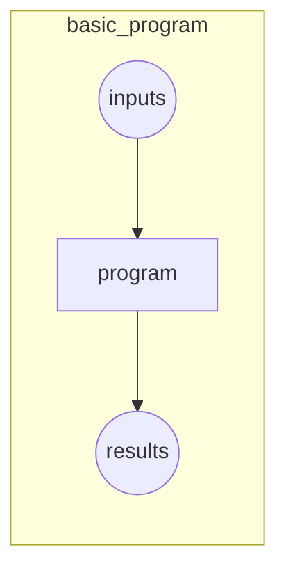

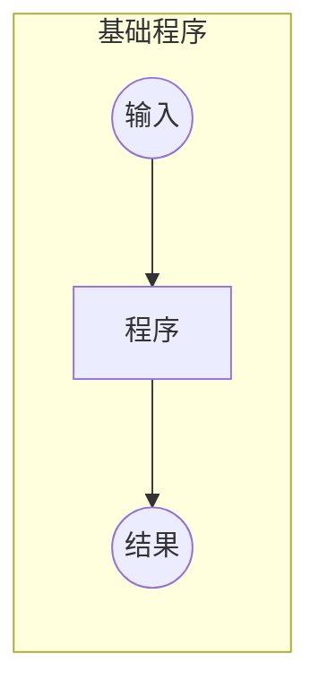

But for recognizing objects in a photo that's a bit tricky; what *are* the steps we take when we recognize an object in a picture? We really don't know, since it all happens in our brain without us being consciously aware of it!

但对于在图片中做目标识别就有点小困难了；当我们在图片中识别一个目标我们应该采取的步骤有哪些？事实上我们并不知道，因为不用有意识的思考它已经在我们大脑中做完了。

Right back at the dawn of computing, in 1949, an IBM researcher named Arthur Samuel started working on a different way to get computers to complete tasks, which he called *machine learning*. In his classic 1962 essay "Artificial Intelligence: A Frontier of Automation", he wrote:

返回到计算初期，在 1949 年，一个叫亚瑟·塞缪尔的研究员开始了一个不同的任务：让计算机去完成任务，他称为*机器学习*。在他 1962 年发表的“人工智能：自动化前沿”论文中写到：

> : Programming a computer for such computations is, at best, a difficult task, not primarily because of any inherent complexity in the computer itself but, rather, because of the need to spell out every minute step of the process in the most exasperating detail. Computers, as any programmer will tell you, are giant morons, not giant brains.
>
> ：安排计算机做类似计算的是一个困难的任务，主要不是因为计算机自身内在的复杂性，而因为需要在最令人恼火的细节中讲清楚处理的每一个微小步骤。任务一个程序员都会告诉你，计算机不是天才，而是大笨蛋。

His basic idea was this: instead of telling the computer the exact steps required to solve a problem, show it examples of the problem to solve, and let it figure out how to solve it itself. This turned out to be very effective: by 1961 his checkers-playing program had learned so much that it beat the Connecticut state champion! Here's how he described his idea (from the same essay as above):

他基本的思想是：与其告诉计算机解决问题所需要的精确的每一步，不如给它展示一个所要解决这个问题的例子，并让它想出如何自己解决这个问题。这种生产是非常有效率的：在 1961 年，他的跳棋程序已经学了很多，获得了康涅狄格州的冠军！下面描述了他的想法是什么（内容来自上述的同一篇论文）

> : Suppose we arrange for some automatic means of testing the effectiveness of any current weight assignment in terms of actual performance and provide a mechanism for altering the weight assignment so as to maximize the performance. We need not go into the details of such a procedure to see that it could be made entirely automatic and to see that a machine so programmed would "learn" from its experience.
>
> ：假设我们安排了一些基于实际的表现测试当前权重分配有效性的方法，并提供一种改变权重分配的机制以使其表现最优。我们不需要进入这个程序的细节就能到看它能够实现完全自动化，并看到这样程序的机器会从它的经验中“学习”。

There are a number of powerful concepts embedded in this short statement:

在这个短文中包含了一系列核心概念：

- The idea of a "weight assignment"
- The fact that every weight assignment has some "actual performance"
- The requirement that there be an "automatic means" of testing that performance,
- The need for a "mechanism" (i.e., another automatic process) for improving the performance by changing the weight assignments
- 一个“权重分配”的想法
- 每个权重分配对“实际执行”有一些影响
- 这里有一个测量执行的“自动化工具”需求
- 需要一个“机制”（即：别一个自动化工序）通过改变权重分配以优化执行

Let us take these concepts one by one, in order to understand how they fit together in practice. First, we need to understand what Samuel means by a *weight assignment*.

让我们一个个的对这些概念进行理解，以弄懂实际上他们是怎么有效的聚合在一起的。首先，我们需要去理解塞缪尔对*一个权重分配*的意思。

Weights are just variables, and a weight assignment is a particular choice of values for those variables. The program's inputs are values that it processes in order to produce its results—for instance, taking image pixels as inputs, and returning the classification "dog" as a result. The program's weight assignments are other values that define how the program will operate.

权重只是变量，一个权重是那些变量一个特定选择的值。程序输入的是变量，对它处理以产生结果。例如，以图片像素做为输入，然后返回狗的分类做为结果。程序的权重分配是定义程序将如何进行操作的其它值。

Since they will affect the program they are in a sense another kind of input, so we will update our basic picture in <basic_program> and replace it with <weight_assignment> in order to take this into account.

因此他们将会影响程序，在某种程序上他们是其它类型的输入。考虑到这一点，所以我们会在<基础程序>中更新我们基础描述并把它替换为<权重分配>

```python
#hide_input
#caption A program using weight assignment
#id weight_assignment
gv('''model[shape=box3d width=1 height=0.7]
inputs->model->results; weights->model''')
```

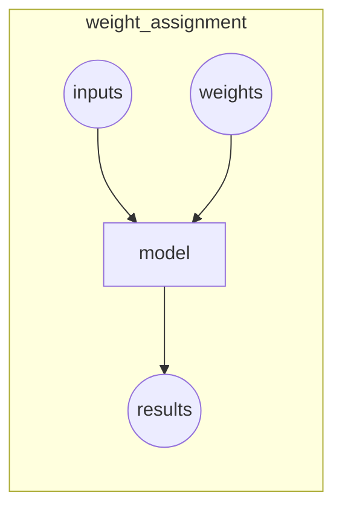

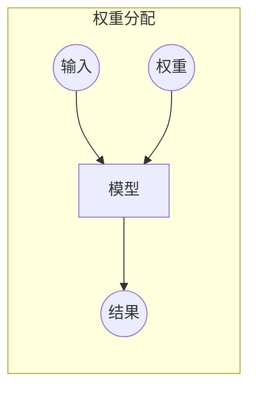

We've changed the name of our box from *program* to *model*. This is to follow modern terminology and to reflect that the *model* is a special kind of program: it's one that can do *many different things*, depending on the *weights*. It can be implemented in many different ways. For instance, in Samuel's checkers program, different values of the weights would result in different checkers-playing strategies.

我们已经把小盒子的名字从*程序*变为了*模型*。这沿用的是现代术语和参考的*模型*是一个特殊的程序：它依赖*权重*能够做很多不同的事情。它能以许多不同的方法实施。例如，在塞缪尔的跳棋程序，不同权重值将会在不同的跳棋策略中有不同的结果。

(By the way, what Samuel called "weights" are most generally refered to as model *parameters* these days, in case you have encountered that term. The term *weights* is reserved for a particular type of model parameter.)

（顺便说一下，如果你已经碰到那个术语，塞缪尔命名的“权重”最普遍是现在称为的模型*参数*。术语*权重*保留了模型参数的一个特指类型）

Next, Samuel said we need an *automatic means of testing the effectiveness of any current weight assignment in terms of actual performance*. In the case of his checkers program, the "actual performance" of a model would be how well it plays. And you could automatically test the performance of two models by setting them to play against each other, and seeing which one usually wins.

接下来，塞缪尔说我们需要一个*自动工具依据实际表现测试当前权重分配的有效性*。在他跳棋程序例子中，一个模型的*实际表现*将决定它玩的多么好。你能够通过它们相互间打比赛自动化测试两个模型的性能，并看哪一个会常胜。

Finally, he says we need *a mechanism for altering the weight assignment so as to maximize the performance*. For instance, we could look at the difference in weights between the winning model and the losing model, and adjust the weights a little further in the winning direction.

最后，他说到我们需要*一个改变权重分配的机制以便性能最大化*。例如，你能够看在战胜模型和失败模型之间权重方面的差异，并向胜利的方向进一步调整权重。

We can now see why he said that such a procedure *could be made entirely automatic and... a machine so programmed would "learn" from its experience*. Learning would become entirely automatic when the adjustment of the weights was also automatic—when instead of us improving a model by adjusting its weights manually, we relied on an automated mechanism that produced adjustments based on performance.

你现在能够明白为什么他说这么一个程序：*能够实现完全的自动化并且...这种程序的机器将从它的经验中“学习”*。当权重调整是这样的自动化（这种自动化是当我们依赖一个自动化机制基于表现产生调整，替代通过手工调整权重改善模型的时候）学习将变的全自动。

<training_loop> shows the full picture of Samuel's idea of training a machine learning model.

下图<训练循环>展示了塞缪尔对于机器学习模型想法的全景图。

```python
#hide_input
#caption Training a machine learning model
#id training_loop
#alt The basic training loop
gv('''ordering=in
model[shape=box3d width=1 height=0.7]
inputs->model->results; weights->model; results->performance
performance->weights[constraint=false label=update]''')
```

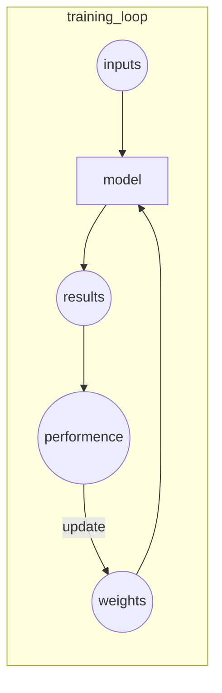

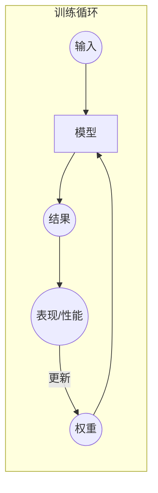

Notice the distinction between the model's *results* (e.g., the moves in a checkers game) and its *performance* (e.g., whether it wins the game, or how quickly it wins).

注意模型*结果*（即：跳棋走的第一步）和它的*表现*（即：它是否赢得比赛，或如何快速的胜利）之间的区别。

Also note that once the model is trained—that is, once we've chosen our final, best, favorite weight assignment—then we can think of the weights as being *part of the model*, since we're not varying them any more.

也要注意一旦模型被训练了（一旦我们选择了最终的、最好的、中意的权重分配），我们就会把权重视为模型的一部分，到此为止我们就不会对它进行任何变更了。

Therefore, actually *using* a model after it's trained looks like <using_model>.

因此，实际使用一个被训练后的模型如下图<模型使用>所示。

```python
#hide_input
#caption Using a trained model as a program
#id using_model
gv('''model[shape=box3d width=1 height=0.7]
inputs->model->results''')
```

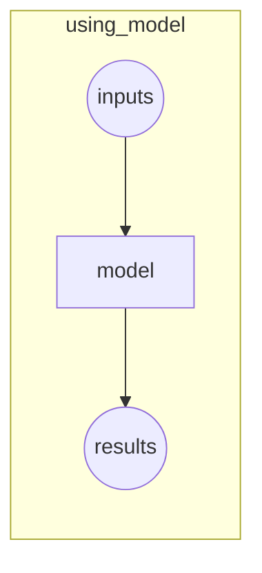

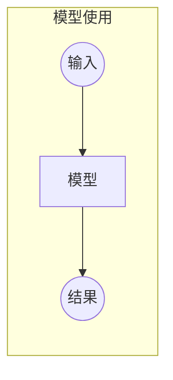

This looks identical to our original diagram in <>, just with the word *program* replaced with *model*. This is an important insight: *a trained model can be treated just like a regular computer program*.

这看起来与我们的原始图是相同的，只是把*程序* 替换为*模型*。这是一个重要的点：一个训练的模型能够被看待为像一个普通的计算机程序。

> jargon: Machine Learning: The training of programs developed by allowing a computer to learn from its experience, rather than through manually coding the individual steps.
>
> 行话（黑话）：机器学习：开发训练程序以允许一台计算机从它的经验中进行学习，而不是通过手工写代码具体的每一步。

### What Is a Neural Network?

### 什么是神经网络？

It's not too hard to imagine what the model might look like for a checkers program. There might be a range of checkers strategies encoded, and some kind of search mechanism, and then the weights could vary how strategies are selected, what parts of the board are focused on during a search, and so forth. But it's not at all obvious what the model might look like for an image recognition program, or for understanding text, or for many other interesting problems we might imagine.

把模型想像为可能看起来像一个跳棋程序不是太困难。可能有一系列的跳棋策略的编码和某种搜索机制，然后权重能够改变策略如何被选择，在搜索期间关注于那些可接受的部分，等等。模型可以看起来像一个图像识别程序，或文本理解，或我们可以想像到的其它有趣的问题，模型就不是那么完全清晰了。

What we would like is some kind of function that is so flexible that it could be used to solve any given problem, just by varying its weights. Amazingly enough, this function actually exists! It's the neural network, which we already discussed. That is, if you regard a neural network as a mathematical function, it turns out to be a function which is extremely flexible depending on its weights. A mathematical proof called the *universal approximation theorem* shows that this function can solve any problem to any level of accuracy, in theory. The fact that neural networks are so flexible means that, in practice, they are often a suitable kind of model, and you can focus your effort on the process of training them—that is, of finding good weight assignments.

我们想要某种功能，只通过变化它的权重就能非常灵活的用来解决任何给出的问题。太奇妙了，这种功能事实上是存在的！它就是我们之前讨论过的神经网络。也就是说，如果你把神经网络视为一种数学函数，它就是依赖权重极度灵活的函数。在理论层面，一个数学证明名为*通用近似定理（或万能逼近定理）*显示这个函数能够在任何精度水平解决任何问题。事实上神经网络是一个非常灵活的工作，实际上他们通常是一个合适的模型。你可以聚焦于模型训练过程的效果，即找到一个好的权重分配。

But what about that process? One could imagine that you might need to find a new "mechanism" for automatically updating weight for every problem. This would be laborious. What we'd like here as well is a completely general way to update the weights of a neural network, to make it improve at any given task. Conveniently, this also exists!

但那个过程是什么呢？一种设想是：你可能需要去找一个为每一个问题自动更新权重的新“机制”。这也许是一个艰辛的工作。我们也想要一个完全通用的方式去更新神经网络权重，使它在任何给定的任务中得到完善，这种方式方便的也是存在的！

This is called *stochastic gradient descent* (SGD). We'll see how neural networks and SGD work in detail in <>, as well as explaining the universal approximation theorem. For now, however, we will instead use Samuel's own words: *We need not go into the details of such a procedure to see that it could be made entirely automatic and to see that a machine so programmed would "learn" from its experience.*

这称之为*随机梯度下降*（SGD）。我们在下图会看到神经网络和 SGD 如何工作细节，同时解释通用近似定理。不管怎么样截至目前我们会替换塞缪尔的专用描述：*我们不需要进入这个程序的细节去看它能够实现全自动化，而去看一个这样编程的机器将从它的经验中“学习”*

> J: Don't worry, neither SGD nor neural nets are mathematically complex. Both nearly entirely rely on addition and multiplication to do their work (but they do a *lot* of addition and multiplication!). The main reaction we hear from students when they see the details is: "Is that all it is?"
>
> 杰：不要急，SGD 和神经网络都没有复杂的数学运算。两者几乎完全依赖加法和乘法去做他们的工作（只是它们需要做大量的加法和乘法）。当学生看到细节的时候，我们听到来自他们的主要反馈是：“这就是全部吗？”

In other words, to recap, a neural network is a particular kind of machine learning model, which fits right in to Samuel's original conception. Neural networks are special because they are highly flexible, which means they can solve an unusually wide range of problems just by finding the right weights. This is powerful, because stochastic gradient descent provides us a way to find those weight values automatically.

换句话去总结，一个神经网络是一种特定的正契合塞缪尔原始概念的机器学习模型。神经网络是特别的，因为他们极为灵活，意味着只要通过寻找正确的权重他们能够出乎意料的解决广泛的问题。这很强大，因为随机梯度下降提供给我们去自动找那些权重值的方法。

Having zoomed out, let's now zoom back in and revisit our image classification problem using Samuel's framework.

缩小后，让我们现在再放大并重回我们使用塞缪尔架构的图像分类问题。

Our inputs are the images. Our weights are the weights in the neural net. Our model is a neural net. Our results are the values that are calculated by the neural net, like "dog" or "cat."

我们输入的是图片集。我们的权重是神经网络里的权重。我们的模型是一个神经网络。我们的结果是通过神经网络计算后的值---类似“狗”或“猫”。

What about the next piece, an *automatic means of testing the effectiveness of any current weight assignment in terms of actual performance*? Determining "actual performance" is easy enough: we can simply define our model's performance as its accuracy at predicting the correct answers.

下一部分关于*依据实际表现测试当前权重分配效果的一个自动化工具*是什么？确定“实际表现”是非常容易的：我们能够以它在预测正确答案的精确率简单定义我们模型的表现。

Putting this all together, and assuming that SGD is our mechanism for updating the weight assignments, we can see how our image classifier is a machine learning model, much like Samuel envisioned.

综上所述，假定 SGD 是我们更新权重分配的机制，能看到我们图片分类器是一个更像塞缪尔想像的那种机器学习模型。

### A Bit of Deep Learning Jargon

### 一点深度学习术语

Samuel was working in the 1960s, and since then terminology has changed. Here is the modern deep learning terminology for all the pieces we have discussed:

塞缪尔的工作在 20 世纪 60 年代，从那之后术语已经变了。这里有我们已经讨论过的模型深度学习术语的所有部分：

- The functional form of the *model* is called its *architecture* (but be careful—sometimes people use *model* as a synonym of *architecture*, so this can get confusing).
- The *weights* are called *parameters*.
- The *predictions* are calculated from the *independent variable*, which is the *data* not including the *labels*.
- The *results* of the model are called *predictions*.
- The measure of *performance* is called the *loss*.
- The loss depends not only on the predictions, but also the correct *labels* (also known as *targets* or the *dependent variable*); e.g., "dog" or "cat."
- *模型*的功能样式称之为*架构*（但请注意，有时候人家会用*模型*做为*架构*的同义词，所以会产生混淆）。
- *权重*被称为*参数*。
- *预测*是由那些不含*标签值数据的自变量*计算的。
- 模型的*结果*称为*预测*。
- *性能*的测量称为*损失*。
- 损失不仅取决于预测，也取决于正确的*标签*（也叫*目标*或*因变量*）；例如“狗”或“猫”。

After making these changes, our diagram in <training_loop> looks like <detailed_loop>.

做了这些改变后，我们的在<训练循环>中的流程图看起来就像下图<循环细节>。

```python
#hide_input
#caption Detailed training loop
#id detailed_loop
gv('''ordering=in
model[shape=box3d width=1 height=0.7 label=architecture]
inputs->model->predictions; parameters->model; labels->loss; predictions->loss
loss->parameters[constraint=false label=update]''')
```

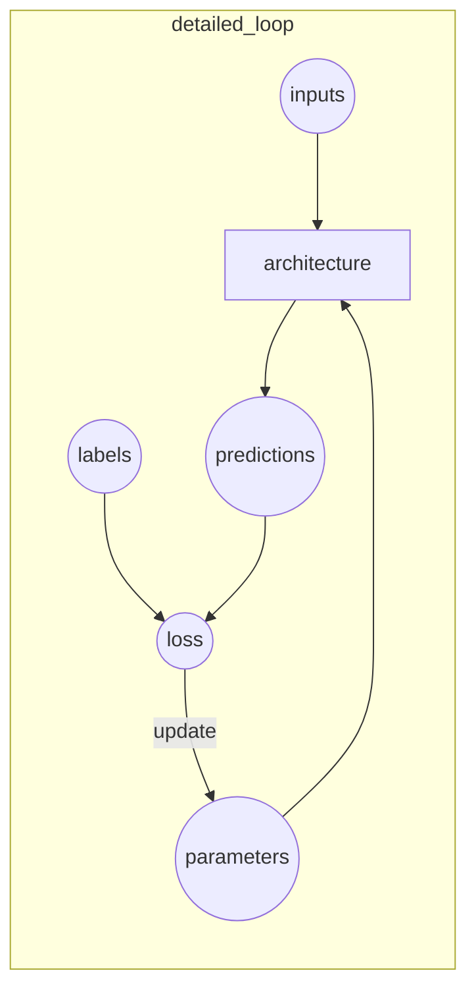

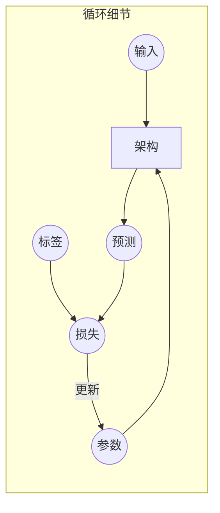

### Limitations Inherent To Machine Learning

### 机器学习固有局限

From this picture we can now see some fundamental things about training a deep learning model:

从这个图片我们能够看到一些关于训练一个深度学习模型的基础要素：

- A model cannot be created without data.
- A model can only learn to operate on the patterns seen in the input data used to train it.
- This learning approach only creates *predictions*, not recommended *actions*.
- It's not enough to just have examples of input data; we need *labels* for that data too (e.g., pictures of dogs and cats aren't enough to train a model; we need a label for each one, saying which ones are dogs, and which are cats).
- 模型不能在没有数据的情况下被创建。
- 一个模型只能学习去操作那些用于训练它而输入的数据中所看到的模式。
- 这个学习方法只能创建*预测*，不能推荐*活动*。
- 只有输入数据样例是不够的，我们还需要对那些数据*标注*（例如：狗和猫的图片集不能满足训练一个模式，我们需要对每一张图片进行标注，区分出哪些是狗哪些是猫）

Generally speaking, we've seen that most organizations that say they don't have enough data, actually mean they don't have enough *labeled* data. If any organization is interested in doing something in practice with a model, then presumably they have some inputs they plan to run their model against. And presumably they've been doing that some other way for a while (e.g., manually, or with some heuristic program), so they have data from those processes! For instance, a radiology practice will almost certainly have an archive of medical scans (since they need to be able to check how their patients are progressing over time), but those scans may not have structured labels containing a list of diagnoses or interventions (since radiologists generally create free-text natural language reports, not structured data). We'll be discussing labeling approaches a lot in this book, because it's such an important issue in practice.

通常来说，我们看到大多数组织说他们没有足够的数据，真实的意思是他们没有足够的标注数据。如果有些组织有兴趣在实践中利用模型做一些事情，然后大概他们有一些输入集计划去运行模型来处理。同时大概他们用一些其它方法已经在做了。（例如，手工或一些启发式程序），所以通过那些过程他们已经有数据了！例如，几乎可以确定一个放射科会有医学影像档案（因为他们需要能够检查他们病人随着时间的推移怎样进展的），但是那些影像可能没有包含了诊断和干预列表的结构化标签（因为放射学家通常会写自然语言自由文本报告，而不是结构化数据）。在本书中我们会讨论一些标注方法，因为在实践中它是非常重要的问题。

Since these kinds of machine learning models can only make *predictions* (i.e., attempt to replicate labels), this can result in a significant gap between organizational goals and model capabilities. For instance, in this book you'll learn how to create a *recommendation system* that can predict what products a user might purchase. This is often used in e-commerce, such as to customize products shown on a home page by showing the highest-ranked items. But such a model is generally created by looking at a user and their buying history (*inputs*) and what they went on to buy or look at (*labels*), which means that the model is likely to tell you about products the user already has or already knows about, rather than new products that they are most likely to be interested in hearing about. That's very different to what, say, an expert at your local bookseller might do, where they ask questions to figure out your taste, and then tell you about authors or series that you've never heard of before.

因为这些类型的机器学习模型只能做预测（即尝试复制标签），这能导致在组织目标和模型能力间产品巨大的差异。例如，在本书你会学到怎么创建一个能预测哪些产品用户有可能购买的*推荐系统*。这经常用于电商，这样通过展示最高排名的条目来自定义产品显示在首页。但是这样一个模型通常是通过看用户他们购买历史（*输入*）和他们想要购买的商品或看了什么商品（*标签*）来创建的，这意味着模型可能告诉你关于用户已经购买或已经知道的产品，而不是他们极可能感兴趣于听到的那些全新的产品。这是非常不同的，好比说一个专家在你当地书店可能做的事情，他们问询问问题计算出你的偏好，然后告诉你以前你从未听过的作者或图书系列。

Another critical insight comes from considering how a model interacts with its environment. This can create *feedback loops*, as described here:

其它的评判来自一个模型如何与它的环境进行交互的思考。能够创建*反馈循环*，如下描述：

- A *predictive policing* model is created based on where arrests have been made in the past. In practice, this is not actually predicting crime, but rather predicting arrests, and is therefore partially simply reflecting biases in existing policing processes.
- Law enforcement officers then might use that model to decide where to focus their police activity, resulting in increased arrests in those areas.
- Data on these additional arrests would then be fed back in to retrain future versions of the model.
- 一个*治安预测* 模型是基于在过去某地已经发生的拘捕情况来创建的。事实上，这不是实际的犯罪预测，而是拘捕预测，因此在存在的治安程序上一定程度上简单的反映了偏见。
- 法律执行官员可能会使用模型去决策他们的警察活动聚焦的区域，结果是在增加拘捕的那些区域。
- 增加拘捕的数据将会被反馈给再训练的未来模型版本。

This is a *positive feedback loop*, where the more the model is used, the more biased the data becomes, making the model even more biased, and so forth.

这是一个*正向的反馈循环*，更多的模型被使用，更多偏向数据产生，使得模型更加偏见，等等。

Feedback loops can also create problems in commercial settings. For instance, a video recommendation system might be biased toward recommending content consumed by the biggest watchers of video (e.g., conspiracy theorists and extremists tend to watch more online video content than the average), resulting in those users increasing their video consumption, resulting in more of those kinds of videos being recommended. We'll consider this topic more in detail in <chapter_ethics>.

在商业环境中反馈循环也能产生一些问题。例如，一个视频推荐系统可能偏向推荐观看量最大的内容（例如，阴谋论和极端分子相比普通人倾向观看更多的在线视频），导致那些用户增加他们的视频观看量，进而导致更多那种类型的视频被推荐。我们会在<伦理章节>思考这个话题的更多细节。

Now that you have seen the base of the theory, let's go back to our code example and see in detail how the code corresponds to the process we just described.

现在你已经看到了这个理论基础，让我们返回到代码示例，并看代码如何反映到我们刚刚描述的过程细节。

### How Our Image Recognizer Works

### 我们的图像识别如何工作

Let's see just how our image recognizer code maps to these ideas. We'll put each line into a separate cell, and look at what each one is doing (we won't explain every detail of every parameter yet, but will give a description of the important bits; full details will come later in the book).

让我们看一下我们的图像识别代码如何对映到这些想法上。我们会把每一行代码都在单独的单元格内，来看每一行做的什么（我们不会解释每一个参数的细节，但会给出重要部分的描述，所有细节会在本书后续部分出现）。

The first line imports all of the fastai.vision library.

第一行是引入 fastai视觉库的代码

```python
from fastai.vision.all import *
```

This gives us all of the functions and classes we will need to create a wide variety of computer vision models.

这个库提供了我们创建的各类计算机视觉模型需要的所有函数和类，

> J: A lot of Python coders recommend avoiding importing a whole library like this (using the `import *` syntax), because in large software projects it can cause problems. However, for interactive work such as in a Jupyter notebook, it works great. The fastai library is specially designed to support this kind of interactive use, and it will only import the necessary pieces into your environment.
>
> 杰：很多 Python 程序员建议避免引入整个库（例如 using the `import *`语句），因为在大型软件项目中它会引发很多问题。然而，对于类似在 Jupyter 中的交互性工作，它工作的非常好。fastai 库专门设计去支持这类的交互工作，它只会引入必要的部分进入你的工作环境。

The second line downloads a standard dataset from the [fast.ai datasets collection](https://course.fast.ai/datasets) (if not previously downloaded) to your server, extracts it (if not previously extracted), and returns a `Path` object with the extracted location:

第二行代码用于下载一个来自 fast.ai 收集的数据集的一个标准数据集（如果之前没有下载过）到你的服务器，抽取数据（如果之前没有抽取），并返回一个本地抽取后的`路径`：

```python
path = untar_data(URLs.PETS)/'images'
```

> S: Throughout my time studying at fast.ai, and even still today, I've learned a lot about productive coding practices. The fastai library and fast.ai notebooks are full of great little tips that have helped make me a better programmer. For instance, notice that the fastai library doesn't just return a string containing the path to the dataset, but a `Path` object. This is a really useful class from the Python 3 standard library that makes accessing files and directories much easier. If you haven't come across it before, be sure to check out its documentation or a tutorial and try it out. Note that the [https://book.fast.ai[website\]](https://book.fast.ai[website]/) contains links to recommended tutorials for each chapter. I'll keep letting you know about little coding tips I've found useful as we come across them.
>
> 西：贯穿我在fast.ai学习的历程，时至今日，我已经学到了很多富有成效的编码实践。fastai库和 fast.ai笔记遍布超好的小提示，这帮助我成为一个优秀的程序员。例如，注意 fastai 库不是只返回一个包含指向数据集的路径，而是一个*路径*对象。这是非常有用处的类，来自 Python3 标准库使得获取文件和目录更加方便。如果你之前没有不知道它，一定去查看它的文档或指引手册并尝试理解它。站点[[https:book.fast.ai]](https:book.fast.ai)包含了每一章节的建议指导链接。我会持续让你知道一些编程小技巧，当我们遇到它们时发现很有帮助。

In the third line we define a function, `is_cat`, labels cats based on a filename rule provided by the dataset creators:

在第三行我们定义了一个`is_cat`函数，通过数据集构建器基于提供的文件名规则来标记猫。

```python
def is_cat(x): return x[0].isupper()
```

We use that function in the fourth line, which tells fastai what kind of dataset we have, and how it is structured:

我们在第四行使用这个函数，告诉 fastai 我们拥有数据集的类型和它是如何构造的。

```python
dls = ImageDataLoaders.from_name_func(
    path, get_image_files(path), valid_pct=0.2, seed=42,
    label_func=is_cat, item_tfms=Resize(224))
```

There are various different classes for different kinds of deep learning datasets and problems—here we're using `ImageDataLoaders`. The first part of the class name will generally be the type of data you have, such as image, or text.

这里有各式各样不同的类来处理不同各类的深度学习数据集和问题，这里我们用的是`ImageDataLoaders`。类名的第一部分通常是你有的数据类型，例如图片或文本。

The other important piece of information that we have to tell fastai is how to get the labels from the dataset. Computer vision datasets are normally structured in such a way that the label for an image is part of the filename, or path—most commonly the parent folder name. fastai comes with a number of standardised labeling methods, and ways to write your own. Here we're telling fastai to use the `is_cat` function we just defined.

其它重点部分信息是我们要告诉 fastai 如果从数据集里获取标签。计算机视觉数据集通常用图片名部分或路径（通常大多数是父文件夹名）这种方式来结构标签。fastai 提供了许多标准化的标注方法，及编写你自己的方法。这里我们告诉 fastai 使用我们刚刚定义的`is_cat`函数。

Finally, we define the `Transform`s that we need. A `Transform` contains code that is applied automatically during training; fastai includes many predefined `Transform`s, and adding new ones is as simple as creating a Python function. There are two kinds: `item_tfms` are applied to each item (in this case, each item is resized to a 224-pixel square), while `batch_tfms` are applied to a *batch* of items at a time using the GPU, so they're particularly fast (we'll see many examples of these throughout this book).

最后，我们定义了一些我们需要的`Transform`，一个`Transform`所包含的代码是在训练期间自动应用的。fastai 包含了许多预定义`Transform`，只是简单创建一个 Python 函数就可以新定义一个。这里有两类：`item_tfms`这类被用于单个图片（在这个例子中，每张图片尺寸被转换为 224*224 像素的方形），而`batch_tfms`这类通过使用 GPU 在同一时间内批量处理多张图片，所以这种方式特别快（在整本书内我们会看到许多这样的例子）。

Why 224 pixels? This is the standard size for historical reasons (old pretrained models require this size exactly), but you can pass pretty much anything. If you increase the size, you'll often get a model with better results (since it will be able to focus on more details), but at the price of speed and memory consumption; the opposite is true if you decrease the size.

为什么是 224 像素？这是历史原因下的标准尺寸（老的预训练模型需要这个尺寸），但你能使用更好的方式。如果你增加尺寸，你通常会得到一个更好结果的模型（因为它能关注到更多细节），但会增加速度和内存的价格消耗，如果你缩小尺寸就是相反的结果。

> Note: Classification and Regression: *classification* and *regression* have very specific meanings in machine learning. These are the two main types of model that we will be investigating in this book. A classification model is one which attempts to predict a class, or category. That is, it's predicting from a number of discrete possibilities, such as "dog" or "cat." A regression model is one which attempts to predict one or more numeric quantities, such as a temperature or a location. Sometimes people use the word *regression* to refer to a particular kind of model called a *linear regression model*; this is a bad practice, and we won't be using that terminology in this book!
>
> 注释：分类和回归：*分类*和*回归*在机器学习中有非常具体的含义。在本书中这是我们要学习的两类主要模型。分类模型是一种尝试预测一个类别或种类。它的预测来自一组各自独立的概率（或可能性），例如“狗”或“猫”。回归模型是一种尝试去预测一个或一些数字量，例如温度或定位。有时候人们使用*回归*这个词去指代一种名为*线性回归模型*的特定模型。这是不好应用，在本书我们不会使用这个术语。

The Pet dataset contains 7,390 pictures of dogs and cats, consisting of 37 different breeds. Each image is labeled using its filename: for instance the file *great_pyrenees_173.jpg* is the 173rd example of an image of a Great Pyrenees breed dog in the dataset. The filenames start with an uppercase letter if the image is a cat, and a lowercase letter otherwise. We have to tell fastai how to get labels from the filenames, which we do by calling `from_name_func` (which means that filenames can be extracted using a function applied to the filename), and passing `x[0].isupper()`, which evaluates to `True` if the first letter is uppercase (i.e., it's a cat).

宠物数据集包含 7390 张狗和猫的图片，由37个不同品类组成。每一张图片用它的文件名进行了标注：例如文件*great_pyrenees_173.jpg*是在数据集中大比利牛斯犬的第 173 张例图。如果图片是一只猫文件名起始用一个大写字母，否则是一个小写字母。我们必须告诉 fastai 如何从文件名中获取标签，我们做了一个名为`from_name_func`的函数（意思这是应用于文件名的函数用来抽取文件名），如果通过评估`x[0].isupper()`中第一个字母大写为真，即：它是一只猫。

The most important parameter to mention here is `valid_pct=0.2`. This tells fastai to hold out 20% of the data and *not use it for training the model at all*. This 20% of the data is called the *validation set*; the remaining 80% is called the *training set*. The validation set is used to measure the accuracy of the model. By default, the 20% that is held out is selected randomly. The parameter `seed=42` sets the *random seed* to the same value every time we run this code, which means we get the same validation set every time we run it—this way, if we change our model and retrain it, we know that any differences are due to the changes to the model, not due to having a different random validation set.

在这里提到的最更要的参数是`valid_pct=0.2`。这是告诉 fastai 取出20%的数据并完成不能把它用于模型训练。这 20%的数据叫做*验证集*；剩下80%的数据称为*训练集*。验证集用来测量模型的精度。默认情况下取出的这 20%数据是随机选中的。参数`seed=42`设置随机种子，每次我们运行这段代码都是相同的值，意思是每次我们运行代码都会取同样的验证集。利用这个方法，如果我们改变我们的模型和重训练它，我们会知道这些差异是因为模型的改变，而不是因为不同的随机验证设置。

fastai will *always* show you your model's accuracy using *only* the validation set, *never* the training set. This is absolutely critical, because if you train a large enough model for a long enough time, it will eventually memorize the label of every item in your dataset! The result will not actually be a useful model, because what we care about is how well our model works on *previously unseen images*. That is always our goal when creating a model: for it to be useful on data that the model only sees in the future, after it has been trained.

fastai 将会*一直只用*验证集*永远不会*用训练集给你展示你的模型精度。这是绝对的评判标准，因为如果你用足够长的时间训练一个足够大的模型，它最终会记忆你的数据集里的每一个标签！其结果不会是实际有用的模型，因为我们关心我们的模型在之前看不到的图片集上工作的如何的好。当创建一个模型我们坚持的目标是：在一个模型被训练后，它在数据上是有用的，只关注未来。

Even when your model has not fully memorized all your data, earlier on in training it may have memorized certain parts of it. As a result, the longer you train for, the better your accuracy will get on the training set; the validation set accuracy will also improve for a while, but eventually it will start getting worse as the model starts to memorize the training set, rather than finding generalisable underlying patterns in the data. When this happens, we say that the model is *overfitting*.

即使你的模型没有记忆你的所有数据，在早先的训练中它可以记忆确定的部分。结果是，长时间训练你相对好的精度来自训练集，验证集精度会暂时得到改善，但最终在模型记忆了训练集后它的精度会开始变差，而不是在数据上发现了可归纳的基础模式。当这个事情发生后，我们称这个模型是*过拟*的。

<img_overfit> shows what happens when you overfit, using a simplified example where we have just one parameter, and some randomly generated data based on the function `x**2`. As you can see, although the predictions in the overfit model are accurate for data near the observed data points, they are way off when outside of that range.

<过拟图>展示了当你过拟时发生了什么，使用了一个简单例子：我们只用了一个参数，基于函数*x**2*生成随机数。你能看到，虽然过拟模型预测的精准度都在观测数据点附近，当在这个数据序列这外时精度就差的很远了。

<div style="text-align:center">
  <p align="center">
    
  </p>
  <p align="center">图：过拟示例</p>
</div>
**Overfitting is the single most important and challenging issue** when training for all machine learning practitioners, and all algorithms. As you will see, it is very easy to create a model that does a great job at making predictions on the exact data it has been trained on, but it is much harder to make accurate predictions on data the model has never seen before. And of course, this is the data that will actually matter in practice. For instance, if you create a handwritten digit classifier (as we will very soon!) and use it to recognize numbers written on checks, then you are never going to see any of the numbers that the model was trained on—check will have slightly different variations of writing to deal with. You will learn many methods to avoid overfitting in this book. However, you should only use those methods after you have confirmed that overfitting is actually occurring (i.e., you have actually observed the validation accuracy getting worse during training). We often see practitioners using over-fitting avoidance techniques even when they have enough data that they didn't need to do so, ending up with a model that may be less accurate than what they could have achieved.

所有机器学习预测者在训练模型时和所有的算法**过拟是一个非常重要并极巨挑战的问题**。正如你将要看到的，非常容易创建一个在它训练的确定数据上做的预测精度非常好，但在模型之前从来没见过的数据上做精确预测是非常难的事情。当然在现实中有些数据是可以准确处理的。例如，你创建了一个手写数字分类（我们很快就看到了！）并且用它去识别支票上的手写数字，然后去看训练后的模型从来没见过的数字----手写体只有很小的差异变化就能检查处理。在本书中你会学到很多避免过拟的方法。然而只有当你确定过拟已经实际发生了你才应该使用那些方法（即，训练期间你实际观测到验证精度开始变差了）。我们经常看到一些模型训练员在拥有足够多的数据的情况下依然使用过拟规避技术，事实上他们并不需要这样做，最终相对他能够完成的成果模型的精度可能会差一些。

> important: Validation Set: When you train a model, you must *always* have both a training set and a validation set, and must measure the accuracy of your model only on the validation set. If you train for too long, with not enough data, you will see the accuracy of your model start to get worse; this is called *overfitting*. fastai defaults `valid_pct` to `0.2`, so even if you forget, fastai will create a validation set for you!
>
> 重要：验证集：当你训练一个模型，你必须*一直*拥有训练集和验证集，并必须用验证集测试你的模型精度。如果你在没有足够数据的情况下训练的时候过长，你会发现你的模型精度开始变差----这称之为*过拟*。fastai 默认`valid_pct`为`0.2`，所以即使你忘记 fastai 也会给你创建一个验证集！

The fifth line of the code training our image recognizer tells fastai to create a *convolutional neural network* (CNN) and specifies what *architecture* to use (i.e. what kind of model to create), what data we want to train it on, and what *metric* to use:

训练我们的图像识别器的第五行代码告诉 fastai 创建一个*卷积神经网络*（CNN ）和使用什么样的特点*架构*（即，去创建什么类型的模型），我们想在什么样的数据上训练它和使用什么样的*指标*：

```python
learn = cnn_learner(dls, resnet34, metrics=error_rate)
```

Why a CNN? It's the current state-of-the-art approach to creating computer vision models. We'll be learning all about how CNNs work in this book. Their structure is inspired by how the human vision system works.

为什么是 CNN？这是时下最先进的创建计算机视觉模型的方法。在本书我们会学到关于CNN 如何工作的所有内容。他们的构建灵感来自人类视觉系统工作方式。

There are many different architectures in fastai, which we will introduce in this book (as well as discussing how to create your own). Most of the time, however, picking an architecture isn't a very important part of the deep learning process. It's something that academics love to talk about, but in practice it is unlikely to be something you need to spend much time on. There are some standard architectures that work most of the time, and in this case we're using one called *ResNet* that we'll be talking a lot about during the book; it is both fast and accurate for many datasets and problems. The `34` in `resnet34` refers to the number of layers in this variant of the architecture (other options are `18`, `50`, `101`, and `152`). Models using architectures with more layers take longer to train, and are more prone to overfitting (i.e. you can't train them for as many epochs before the accuracy on the validation set starts getting worse). On the other hand, when using more data, they can be quite a bit more accurate.

在 fastai 有很多不同的架构，在这本里我们会介绍它们（和讨论如何去创建你自己）。然而，大多数时候深度学习过程挑选一个架构不是一个很重要的部分。这个事情学术界喜爱谈论，但在实践中它不可能是你需要花费很多时候的事情。这里有一些绝大多数情况下使用的标准架构，在这个例子里我们使用了一个名为*ResNet*的架构，在本书内我们会讲一些关于它的内容。在很多数据集和问题上它兼顾了快和精度。在 `resnet34`中的`34`指的是在这个种类架构内的层数（其它的操作还有`18`，`50`，`101`和`152`层）。模型使用的架构层数越多训练花费的时候就越长并更容易过拟（即，）别一方面，当你用更多的数据，他就能获得相对更好的精确度。

What is a metric? A *metric* is a function that measures the quality of the model's predictions using the validation set, and will be printed at the end of each *epoch*. In this case, we're using `error_rate`, which is a function provided by fastai that does just what it says: tells you what percentage of images in the validation set are being classified incorrectly. Another common metric for classification is `accuracy` (which is just `1.0 - error_rate`). fastai provides many more, which will be discussed throughout this book.

指标是什么？指标是使用验证集测量模型预测质量的，并会在每一个*epoch*后面输出。例如我们使用`error_rate`(错误率)，这是一个 fastai 提供的函数：告诉你在验证集上图像分类不正确性的百分数。别一种通用的指标是分类`精度`（从 1.0 至错误率）。fastai 提供了更多的指标，整本书都会讨论。

The concept of a metric may remind you of *loss*, but there is an important distinction. The entire purpose of loss is to define a "measure of performance" that the training system can use to update weights automatically. In other words, a good choice for loss is a choice that is easy for stochastic gradient descent to use. But a metric is defined for human consumption, so a good metric is one that is easy for you to understand, and that hews as closely as possible to what you want the model to do. At times, you might decide that the loss function is a suitable metric, but that is not necessarily the case.

指标的概念可以提醒你的损失，但这里有一个重要的差异。损失的全部目标是去定义“测量表现”，训练系统能用来自动更新权重。换一种说法，对损失来说一个好的选择，可以很容易用来进行随机梯度下降。但指标的定义对人类来说，一个好的指标是那种让你很容易去理解，并尽可能向接近你所想要的模型去努力。同时，你可以决定损失函数是一个合适的指标，但也未必。

`cnn_learner` also has a parameter `pretrained`, which defaults to `True` (so it's used in this case, even though we haven't specified it), which sets the weights in your model to values that have already been trained by experts to recognize a thousand different categories across 1.3 million photos (using the famous [*ImageNet* dataset](http://www.image-net.org/)). A model that has weights that have already been trained on some other dataset is called a *pretrained model*. You should nearly always use a pretrained model, because it means that your model, before you've even shown it any of your data, is already very capable. And, as you'll see, in a deep learning model many of these capabilities are things you'll need, almost regardless of the details of your project. For instance, parts of pretrained models will handle edge, gradient, and color detection, which are needed for many tasks.

`cnn_learner`也有一个参数`pretrained`默认值为`True`（即使我们没有具体说明它，在这个例子里也用到了），用来设置你模型内的权重为通过专家用 一 百三十万张上千种不同各类的图片已经训练完成的值（使用的是著名的 [ImageNet 数据集](http://www.image-net.org/)）。模型的权重已经用一些其它数据集训练过被称为*预训练模型*。你几乎可以一直使用预训练模型，因为它意味着，你的模型在给它展示任何你的数据前，它已经很有能力了。并且，你会发现在深度学习的这些能力将是你所需要的，你的项目几乎不用理会这些细节。例如，预训练模型的部分已经有了边缘、斜坡和颜色的检测，这些内容可被用于很多任务。

When using a pretrained model, `cnn_learner` will remove the last layer, since that is always specifically customized to the original training task (i.e. ImageNet dataset classification), and replace it with one or more new layers with randomized weights, of an appropriate size for the dataset you are working with. This last part of the model is known as the *head*.

当使用一个预训练模型，`cnn_learner`会移除最后一层，因为这层一直是为完成原始训练任务而特别定义的（即，ImageNet 数据集分类），用新的随机权重的单层或多层来替换它，和你正在使用的一个合适尺寸的数据集。模型的最后部分称为*head*。

Using pretrained models is the *most* important method we have to allow us to train more accurate models, more quickly, with less data, and less time and money. You might think that would mean that using pretrained models would be the most studied area in academic deep learning... but you'd be very, very wrong! The importance of pretrained models is generally not recognized or discussed in most courses, books, or software library features, and is rarely considered in academic papers. As we write this at the start of 2020, things are just starting to change, but it's likely to take a while. So be careful: most people you speak to will probably greatly underestimate what you can do in deep learning with few resources, because they probably won't deeply understand how to use pretrained models.

使用预训练模型是*最*使用的方法，可以让我们用更少的数据、时间和金钱去训练更精确、更快的模型。你可能会想这意味着使用预训练模型在学术深度学习也许是更广泛的研究领域...但你大错特错了！预训练模型的重要性通常在大多数课程、教科书或软件特征库没有被承认和讨论，并在学术论文是几乎没有被考虑。在 2020 的开始阶段我们编写这个内容时，这个状况已经开始变化，但它也许还需要一段时间。所以请注意：对大多数来说，你所说的在深度学习使用很少的资源进行训练极可能会被大大低估，因为他们可能对如何使用预训练模型没有深刻的理解。

Using a pretrained model for a task different to what it was originally trained for is known as *transfer learning*. Unfortunately, because transfer learning is so under-studied, few domains have pretrained models available. For instance, there are currently few pretrained models available in medicine, making transfer learning challenging to use in that domain. In addition, it is not yet well understood how to use transfer learning for tasks such as time series analysis.

使用预训练模型在一个不同于初始被训练的任务称为*迁移学习*。不幸的是，因为迁移学习的研究是非常不足的，只有少数领域可提供预训练模型。例如，当前在医疗领域只有少数预训练模型可提供，使的在该领域使用迁移学习具有挑战。另外，对于类似时间序列分析类任务如何使用迁移学习也没有很好的理解。

> jargon: Transfer learning: Using a pretrained model for a task different to what it was originally trained for.
>
> 术语：迁移学习：使用预训练模型用于不同于它初始被训练目的的任务。

The sixth line of our code tells fastai how to *fit* the model:

我们代码的第六行告诉 fastai 如何*拟合*模型：

```python
learn.fine_tune(1)
```

As we've discussed, the architecture only describes a *template* for a mathematical function; it doesn't actually do anything until we provide values for the millions of parameters it contains.

我们已经讨论过，架构只是针对一个学习函数描述了一个*模板*。在我们提供上百万它所包含的参数值之前，它不能做任何实际工作。

This is the key to deep learning—determining how to fit the parameters of a model to get it to solve your problem. In order to fit a model, we have to provide at least one piece of information: how many times to look at each image (known as number of *epochs*). The number of epochs you select will largely depend on how much time you have available, and how long you find it takes in practice to fit your model. If you select a number that is too small, you can always train for more epochs later.

深度学习的关键是：决定如何去拟合模型参数以让它去解决你的问题。为了拟合一个模型，我们必须提供至少一条信息：每一张图片看多少次（称为*epochs*数）。你的 epochs 数的选择极大依赖你可提供的时间有多少和在实践中你发现要多久去拟合你的模型。如果你选择的数很小，你稍后有更多的 epochs 保持训练。

But why is the method called `fine_tune`, and not `fit`? fastai actually *does* have a method called `fit`, which does indeed fit a model (i.e. look at images in the training set multiple times, each time updating the parameters to make the predictions closer and closer to the target labels). But in this case, we've started with a pretrained model, and we don't want to throw away all those capabilities that it already has. As you'll learn in this book, there are some important tricks to adapt a pretrained model for a new dataset—a process called *fine-tuning*.

但是为什么这个方法称为`fine_tune`（微调），而不是`fit`（拟合）？实际上fastai *有*一个称为`fit`（拟合）的方法，它确实拟合一个模型（即，在训练中设置多次看图片，每一次更新参数以使用的预测越来越接近目标标签）。但在这个事例，我们已经开始使用预训练模型，并且我们不想抛弃所有已经具备的能力。做为在本书中将要学到的，这里有很多重要的技巧为一个新的数据集调整一个预训练模型，这个过程称为*fine-tuning*（微调）。

> jargon: Fine-tuning: A transfer learning technique where the parameters of a pretrained model are updated by training for additional epochs using a different task to that used for pretraining.
>
> 术语：微调（Fine-tuning）:一种迁移学习技术，一个预训练模型的参数被通过使用与预训练任务不同的用于其它任务的额外 epochs训练更新。

When you use the `fine_tune` method, fastai will use these tricks for you. There are a few parameters you can set (which we'll discuss later), but in the default form shown here, it does two steps:

当你使用`fine_tune`方法，fastai 将会为你使用这些技巧。这里有一些你能设置的参数（这些参数稍后我们再讨论），但在这里展示的默认格式下，它分两步来做：

1. Use one epoch to fit just those parts of the model necessary to get the new random head to work correctly with your dataset.
2. Use the number of epochs requested when calling the method to fit the entire model, updating the weights of the later layers (especially the head) faster than the earlier layers (which, as we'll see, generally don't require many changes from the pretrained weights).

1. 使用 单 个 epoch去拟合模型必须的那些部分，让新的随机head在你的数据集下正确工作。
2. 当使用本方法去拟合整个模型时要求使用 epochs 值，相比前几层（正如我会将看到的，这几层不太需要对预训练权重进行更多的变更）更快的更新最后的层数权重（尤其 head 层）。

The *head* of a model is the part that is newly added to be specific to the new dataset. An *epoch* is one complete pass through the dataset. After calling `fit`, the results after each epoch are printed, showing the epoch number, the training and validation set losses (the "measure of performance" used for training the model), and any *metrics* you've requested (error rate, in this case).

一个模型的*head*是新增加去特别应对新的数据集的部分。一个*epoch*是完全覆盖数据集的。调用`fit`（拟合）后每一个 epoch 后输出结果，显示 epoch 值、训练集和评估集的损失（用于在训练模型过程中模型表现测量），以及你要求的任何*指标*（例如在本例子中的错误率）。

So, with all this code our model learned to recognize cats and dogs just from labeled examples. But how did it do it?

所以利用这些代码我们的模型通过标注的示例学会了去辨别猫和狗。但它是怎么做的呢？

### What Our Image Recognizer Learned

### 我们的图像识别器学到了什么

At this stage we have an image recognizer that is working very well, but we have no idea what it is actually doing! Although many people complain that deep learning results in impenetrable "black box" models (that is, something that gives predictions but that no one can understand), this really couldn't be further from the truth. There is a vast body of research showing how to deeply inspect deep learning models, and get rich insights from them. Having said that, all kinds of machine learning models (including deep learning, and traditional statistical models) can be challenging to fully understand, especially when considering how they will behave when coming across data that is very different to the data used to train them. We'll be discussing this issue throughout this book.

在这一阶段我们有了一个工作良好的图像识别器，但我们并不知道它实际上做了什么！虽然很多人抱怨深度学习产生在无法穿透的“黑盒子”模型里（是这样的，一些事情给出的预测，然而没人能理解），事实上真像并不太远。这里有大量的研究展示了深层次检查深度学习模型是怎样的，并对它们有丰富的洞察。说到这，所有类型的机器学习模型（包括深度学习和传统统计模型）都能进行全面理解的挑战，尤其当考虑通过使用完全不同的数据训练它们时他们会有怎样的行为时。通过本书我们将会讨论这个问题。

In 2013 a PhD student, Matt Zeiler, and his supervisor, Rob Fergus, published the paper ["Visualizing and Understanding Convolutional Networks"](https://arxiv.org/pdf/1311.2901.pdf), which showed how to visualize the neural network weights learned in each layer of a model. They carefully analyzed the model that won the 2012 ImageNet competition, and used this analysis to greatly improve the model, such that they were able to go on to win the 2013 competition! <img_layer1> is the picture that they published of the first layer's weights.

在 2013 年一个名叫马特·齐勒博士生和他的导师罗伯·弗格斯发表了名为“[可视化并理解卷积网络](https://arxiv.org/pdf/1311.2901.pdf)”的论文，在文中展示了可视化神经网络权重在模型的每一层是如何学习的。他们仔细分析了2012 年 ImageNet 比赛的获胜模型，并利用分析去改进这个模型，因此他们能够继续赢得 2013 年的比赛！<层一图>是他们发表的第一层权重图片。

<div style="text-align:center">
  <p align="center">
    
  </p>
  <p align="center">图：神经网络第一层激活</p>
</div>

This picture requires some explanation. For each layer, the image part with the light gray background shows the reconstructed weights pictures, and the larger section at the bottom shows the parts of the training images that most strongly matched each set of weights. For layer 1, what we can see is that the model has discovered weights that represent diagonal, horizontal, and vertical edges, as well as various different gradients. (Note that for each layer only a subset of the features are shown; in practice there are thousands across all of the layers.) These are the basic building blocks that the model has learned for computer vision. They have been widely analyzed by neuroscientists and computer vision researchers, and it turns out that these learned building blocks are very similar to the basic visual machinery in the human eye, as well as the handcrafted computer vision features that were developed prior to the days of deep learning. The next layer is represented in <img_layer2>.

这张图片需要一些解释。图片用了浅灰背景部分为每层展示了重建权重图，在底部更大的区域展示训练图片每个权重集最匹配部分。对于层 1，我们能够发现模型已经发现了代表对角线，水平线和垂直边缘，以及各种不同类型的渐变权重。（注意这里只对每层的特征子集做了展示。实践中所有层上都会有数千个。）对于计算机视觉这是一些模型已经学到的基础构建模块。他们已经被神经科学家和计算机视觉研究人员广泛的分析了，并得出这些学到的构建模型与人类眼睛的基础可视化机制和深度学习时代之前开发的手工计算机视觉特征是非常类似的。下一层被展示在<层二图>内。

<div style="text-align:center">
  <p align="center">
    
  </p>
  <p align="center">图：神经网络第二层激活</p>
</div>

For layer 2, there are nine examples of weight reconstructions for each of the features found by the model. We can see that the model has learned to create feature detectors that look for corners, repeating lines, circles, and other simple patterns. These are built from the basic building blocks developed in the first layer. For each of these, the right-hand side of the picture shows small patches from actual images which these features most closely match. For instance, the particular pattern in row 2, column 1 matches the gradients and textures associated with sunsets.

对于第二层，这里有通过模型发现的9 个每个特征的权重重建示例。我们能看到模型已经学会创建特征探测器查找角、重复的线、圈和其它简单图案。这些构造来自第一层形成的基础构建模块。图片右侧展示小块来自实际图像里最接近的特征匹配。例如，第 二 行第一列的特定图案与日落渐变和纹理相匹配。

<img_layer3> shows the image from the paper showing the results of reconstructing the features of layer 3.

<层三图>展示图像来自论文中列示的第三层特征重建结果。

<div style="text-align:center">
  <p align="center">
    
  </p>
  <p align="center">图：神经网络第三层激活</p>
</div>

As you can see by looking at the righthand side of this picture, the features are now able to identify and match with higher-level semantic components, such as car wheels, text, and flower petals. Using these components, layers four and five can identify even higher-level concepts, as shown in <img_layer4>.

正如你在本图右侧看到的，特征现在能够辨认和匹配更高水平的语义组件，例如车轮、文本和花瓣。利用这些组件，第四和第五层甚至能够分辨更高水平的概念，正如<层四图>所显示。

<div style="text-align:center">
  <p align="center">
    
  </p>
  <p align="center">图：神经网络第四、五层激活</p>
</div>

This article was studying an older model called *AlexNet* that only contained five layers. Networks developed since then can have hundreds of layers—so you can imagine how rich the features developed by these models can be!

这篇文章研究了一个只包含五层名为 AlexNet 的老模型。网络被开发后，从那时起能够有数百个层。你可以想像通过这些模型多么丰富的特征被形成！

When we fine-tuned our pretrained model earlier, we adapted what those last layers focus on (flowers, humans, animals) to specialize on the cats versus dogs problem. More generally, we could specialize such a pretrained model on many different tasks. Let's have a look at some examples.

当我们微调之前的预训练模型，我们调整最后的聚焦于花、人类、动物层，让它专门研究猫狗对比问题。更广泛的层面，我们能够基于更多不同的任务专门研究此类预训练模型。让我们看更多的例了。

### Image Recognizers Can Tackle Non-Image Tasks

### 图像识别器能够处理非图像任务

An image recognizer can, as its name suggests, only recognize images. But a lot of things can be represented as images, which means that an image recogniser can learn to complete many tasks.

就如它所名字表明的，一个图像识别器只能识别图像。然而很多事情能够用图像进行展示，这意味着一个图像识别器能学习完成很多任务。

For instance, a sound can be converted to a spectrogram, which is a chart that shows the amount of each frequency at each time in an audio file. Fast.ai student Ethan Sutin used this approach to easily beat the published accuracy of a state-of-the-art [environmental sound detection model](https://medium.com/@etown/great-results-on-audio-classification-with-fastai-library-ccaf906c5f52) using a dataset of 8,732 urban sounds. fastai's `show_batch` clearly shows how each different sound has a quite distinctive spectrogram, as you can see in <img_spect>.

例如，声音能够被转换为光谱图，一张图可展示一个声音文件在每一个时间点每一个频率的数量。Fast.ai 学生伊森·苏丁利用这一方法使用 8,732个城市声音数据集轻松打破了最先进的[环境声音检测模型](https://medium.com/@etown/great-results-on-audio-classification-with-fastai-library-ccaf906c5f52)精度。fastai 的`show_batch`清晰的显示了每一种不同的声音具有怎样的完全不同的光谱，正如下图<光谱图>你所看到的。

<div style="text-align:center">
  <p align="center">
    
  </p>
  <p align="center">图：声音光谱图</p>
</div>

A time series can easily be converted into an image by simply plotting the time series on a graph. However, it is often a good idea to try to represent your data in a way that makes it as easy as possible to pull out the most important components. In a time series, things like seasonality and anomalies are most likely to be of interest. There are various transformations available for time series data. For instance, fast.ai student Ignacio Oguiza created images from a time series dataset for olive oil classification, using a technique called Gramian Angular Difference Field (GADF); you can see the result in <ts_image>. He then fed those images to an image classification model just like the one you see in this chapter. His results, despite having only 30 training set images, were well over 90% accurate, and close to the state of the art.

一个时间序列通过图表上简单的标定能轻松的转换为一张图像。因而，这是常用的好想法，用这种方法展示你的数据，使得它尽可能容易的提取出重要的要素。在一个时间序列，像季节性的或反常的事情最可能引发兴趣，圣于时间序列数据这是有很多有效的转换。例如，fast.ai 的学生伊格纳西奥·奥吉扎使用一种称为格拉姆角场（GADF）的技术为来自橄榄油分类的时间序列数据集创建图像，你能够看到在下图<时间序列转换图>的结果。然后他把那些图片喂一个你在本章节看到的那种图像分类模型。尽管只有 30 个训练集图片，他的结果超过了 90%的精度，接近了最新的技术。

<div style="text-align:center">
  <p align="center">
    
  </p>
  <p align="center">图：时间序列转化图</p>
</div>

Another interesting fast.ai student project example comes from Gleb Esman. He was working on fraud detection at Splunk, using a dataset of users' mouse movements and mouse clicks. He turned these into pictures by drawing an image where the position, speed, and acceleration of the mouse pointer was displayed using coloured lines, and the clicks were displayed using [small colored circles](https://www.splunk.com/en_us/blog/security/deep-learning-with-splunk-and-tensorflow-for-security-catching-the-fraudster-in-neural-networks-with-behavioral-biometrics.html), as shown in <splunk>. He then fed this into an image recognition model just like the one we've used in this chapter, and it worked so well that it led to a patent for this approach to fraud analytics!

另一个有趣的fast.ai学习项目示例来自格莱布·埃斯曼。他在斯普伦克公司利用用户鼠标移动和点击数据集从事欺诈检测工作。他把数据集转化为图像集，通过使用不同颜色的线体现鼠标点击者位置、速度和加速进行绘图，并且使用[小彩色圆圈](https://www.splunk.com/en_us/blog/security/deep-learning-with-splunk-and-tensorflow-for-security-catching-the-fraudster-in-neural-networks-with-behavioral-biometrics.html)代表点击，如下图所示。然后他喂给就像我们在本章节所使用的一个图片识别模型，模型工作的非常好，这一个欺诈分析方法还申请了专利！

<div style="text-align:center">
  <p align="center">
    
  </p>
  <p align="center">图：计算机鼠标轨迹习惯图</p>
</div>

Another example comes from the paper ["Malware Classification with Deep Convolutional Neural Networks"](https://ieeexplore.ieee.org/abstract/document/8328749) by Mahmoud Kalash et al., which explains that "the malware binary file is divided into 8-bit sequences which are then converted to equivalent decimal values. This decimal vector is reshaped and a gray-scale image is generated that represents the malware sample," like in <malware_proc>.

另一个例子来自马哈茂德·卡拉什等人的论文[“基于深度卷积神经网络的恶意软件分类”](https://ieeexplore.ieee.org/abstract/document/8328749)，文中解释了“制恶意软件二进文件被切分为一系列的 8八比特，然后又全部转化为等价的十进制值。这个十进制向量的变形和灰度图的产生代表了恶意软件样本”，如下图<恶意软件分类过程>。

<div style="text-align:center">
  <p align="center">
    
  </p>
  <p align="center">图：恶意软件分类过程</p>
</div>

The authors then show "pictures" generated through this process of malware in different categories, as shown in <malware_eg>.

作者然后展示了通过这一过程生成的不同类别恶意软件“图片”，如下图<恶意软件示例>所示。

<div style="text-align:center">
  <p align="center">
    
  </p>
  <p align="center">图：恶意软件示例</p>
</div>


As you can see, the different types of malware look very distinctive to the human eye. The model the researchers trained based on this image representation was more accurate at malware classification than any previous approach shown in the academic literature. This suggests a good rule of thumb for converting a dataset into an image representation: if the human eye can recognize categories from the images, then a deep learning model should be able to do so too.

你能看出来，在人类的眼里各种不同类型的恶意软件看起来有很大的差别。研究人员基于这种图形表现法训练的模型在恶意软件分类的精度方面远超之前在学术文献中列示的任何方法。转换数据集为图形表示这是一个非常好的经验法则建议：如果人类的眼睛能够从图片中识别分类，那么深度学习模型应该也能够做到。

In general, you'll find that a small number of general approaches in deep learning can go a long way, if you're a bit creative in how you represent your data! You shouldn't think of approaches like the ones described here as "hacky workarounds," because actually they often (as here) beat previously state-of-the-art results. These really are the right ways to think about these problem domains.

通常来说，如果你是少数在如何展示你的数据方面有创造力的人，你将会发现在深度学习里少数通用方法能有很大的帮助！你不应该想像这些方法像这里人们所描述的那种“极客解决方法”，因为实际上他们经常（就像这里）打破之前先进的技术成果。这确实是正确的方法去想思考这些问题领域。

### Jargon Recap

### 术语总结

We just covered a lot of information so let's recap briefly, <dljargon> provides a handy vocabulary.

我们刚刚学习了一些知识，所以让我们做一个简短的总结，<深度学习术语>提供了一个方便查看的词汇表。

dljargon.Deep learning vocabulary

| Term             | Meaning                                                      |
| ---------------- | ------------------------------------------------------------ |
| Label            | The data that we're trying to predict, such as "dog" or "cat" |
| Architecture     | The _template_ of the model that we're trying to fit; the actual mathematical function that we're passing the input data and parameters to |
| Model            | The combination of the architecture with a particular set of parameters |
| Parameters       | The values in the model that change what task it can do, and are updated through model training |
| Fit              | Update the parameters of the model such that the predictions of the model using the input data match the target labels |
| Train            | A synonym for _fit_                                          |
| Pretrained model | A model that has already been trained, generally using a large dataset, and will be fine-tuned |
| Fine-tune        | Update a pretrained model for a different task               |
| Epoch            | One complete pass through the input data                     |
| Loss             | A measure of how good the model is, chosen to drive training via SGD |
| Metric           | A measurement of how good the model is, using the validation set, chosen for human consumption |
| Validation set   | A set of data held out from training, used only for measuring how good the model is |
| Training set     | The data used for fitting the model; does not include any data from the validation set |
| Overfitting      | Training a model in such a way that it _remembers_ specific features of the input data, rather than generalizing well to data not seen during training |
| CNN              | Convolutional neural network; a type of neural network that works particularly well for computer vision tasks |

深度学习术语.深度学习词汇

| 术语                           | 解释                                                         |
| :----------------------------- | :----------------------------------------------------------- |
| 标签（Label）                  | 我们尝试要预测的数据，例如“狗”或“猫”                         |
| 架构（Architecture）           | 我们尝试拟合的模型模板；我们传递数据和参数给数学函数         |
| 模型（Model）                  | 含有特点参数集的架构混合体                                   |
| 参数（Parameters）             | 在模型内更改其所能做的任务的数值，并通过模型训练进行更新     |
| 拟合（Fit）                    | 更新模型的参数，使用输入数据以使得模型预测匹配目标标签       |
| 训练（Train）                  | _拟合_的同义词                                               |
| 预训练模型（Pretrained model） | 通常使用海量数据集完成训练的模型，并将被_微调_               |
| 微调（Fine-tune）              | 为了一个不同的任务更新预训练模型                             |
| 周期（Epoch）                  | 完全遍历输入数据一轮                                         |
| 损失（Loss）                   | 模型良好程序的测量，通过 SGD（随机梯度下降）选择驱动训练     |
| 指标（Metric）                 | 使用验证集测量模型的良好程度指标，以供人类所使用             |
| 验证集（Validation set）       | 与训练集不同的数据集，仅用来测试模型的良好程序               |
| 训练集（Training set）         | 用于拟合模型的数据，不包含任何来自验证集的数据               |
| 过拟合（Overfitting）          | 用某种方法训练一个模型以使用它记住输入数据的特定特征，而不能很好的归纳训练期看不到的数据 |
| 卷积神经网络(CNN)              | 卷积神经网络，在计算机视觉任务方面工作的特别好的一种神经网络 |

With this vocabulary in hand, we are now in a position to bring together all the key concepts introduced so far. Take a moment to review those definitions and read the following summary. If you can follow the explanation, then you're well equipped to understand the discussions to come.

基于手里的这个词汇表，到目前我们集合了所有关键概念的介绍。花点时间去温习一下定义并阅读一下后面的总结。如果你能读懂解释，然后你将有能力很好的理解接下来讨论的内容。

*Machine learning* is a discipline where we define a program not by writing it entirely ourselves, but by learning from data. *Deep learning* is a specialty within machine learning that uses *neural networks* with multiple *layers*. *Image classification* is a representative example (also known as *image recognition*). We start with *labeled data*; that is, a set of images where we have assigned a *label* to each image indicating what it represents. Our goal is to produce a program, called a *model*, which, given a new image, will make an accurate *prediction* regarding what that new image represents.

*机器学习*是不用完全不需要我们自己编写而从数据里进行学习定义一个程序的学科。*深度学习*是专长与*多层神经网络*的机器学习。*图像分类*是一个有代表性的例子（也称为*图像识别*）。我们从被标注后的数据开始，这些数据是我们对每一张图片分配一个*标签*以指明它是什么的图像数据集。我们的目标是产出一个称为*模型*的程序，当给这个模型一张新图片能够精准*预测*这张新图片是什么。

Every model starts with a choice of *architecture*, a general template for how that kind of model works internally. The process of *training* (or *fitting*) the model is the process of finding a set of *parameter values* (or *weights*) that specialize that general architecture into a model that works well for our particular kind of data. In order to define how well a model does on a single prediction, we need to define a *loss function*, which determines how we score a prediction as good or bad.

每一个模型都从选择*架构*开始，这个架构是一个相关类型模型内部如何工作的通用模板。模型*训练*（或*拟合*）过程是寻找*参数值*（或*权重*）集的过程，这个参数值集使的通用架构变成在我们特定类型数据上工作良好的一个模型。为了定义在单个预测上模型怎样良好，我们需要定义一个*损失函数*，这个函数决定我们如何评分预测的好或坏。

To make the training process go faster, we might start with a *pretrained model*—a model that has already been trained on someone else's data. We can then adapt it to our data by training it a bit more on our data, a process called *fine-tuning*.

为了训练过程尽量的快，我们可以从一个预训练模型开始---这个模型已经在其它人的数据上训练过了。然后，我们能够在我们的数据上对它进行更多的训练以使其适应数据，这一过程称为*微调*。

When we train a model, a key concern is to ensure that our model *generalizes*—that is, that it learns general lessons from our data which also apply to new items it will encounter, so that it can make good predictions on those items. The risk is that if we train our model badly, instead of learning general lessons it effectively memorizes what it has already seen, and then it will make poor predictions about new images. Such a failure is called *overfitting*. In order to avoid this, we always divide our data into two parts, the *training set* and the *validation set*. We train the model by showing it only the training set and then we evaluate how well the model is doing by seeing how well it performs on items from the validation set. In this way, we check if the lessons the model learns from the training set are lessons that generalize to the validation set. In order for a person to assess how well the model is doing on the validation set overall, we define a *metric*. During the training process, when the model has seen every item in the training set, we call that an *epoch*.

在我们训练一个模型时，一个关键的考虑是确保我们的模型*泛化*，是指从我们的数据中学习通用内容，也适用于它将遇到的新内容，以便使它能在其它内容上完成良好预测。风险是如果我们所训练的模型很差，替代学习通用内容的是它有效记忆所看到的内容，其后它将在新的图片上做出很有差的预测，这种*失败*被称为*过拟合*。为了避免这种情况，我们总是把我们的数据合成两份：*训练集*和*验证集*。我们只展示训练集进行模型训练，然后我们通过验证集的内容看它表现如何来评估模型运行是否良好。用这种方法，我们检查模型从训练集上学习的内容是否泛化到验证集。对个人来说在整个验证集上评估模型工作状况良好情况，我们定义了*指标*。在训练过程期间，当模型已经看完训练集的所有内容，我们称之为一个*周期*。

All these concepts apply to machine learning in general. That is, they apply to all sorts of schemes for defining a model by training it with data. What makes deep learning distinctive is a particular class of architectures: the architectures based on *neural networks*. In particular, tasks like image classification rely heavily on *convolutional neural networks*, which we will discuss shortly.

通常来说所有这些概念都适用于机器学习。也就是说，它们适用于定义一个通过数据训练模型的所有方案。使得深度学习与众不同是一种基于*神经网络*的特定类型架构。实践中，类似图像分类任务严重依赖*卷积神经网络*，我们将会对这一架构进行简短讨论。

## Deep Learning Is Not Just for Image Classification

## 深度学习不仅仅只能做图像分类

Deep learning's effectiveness for classifying images has been widely discussed in recent years, even showing *superhuman* results on complex tasks like recognizing malignant tumors in CT scans. But it can do a lot more than this, as we will show here.

深度学习在分类图像的有效性在近几年已经被广泛讨论，像在 CT 片上识别恶性肿瘤这种复杂任务上，甚至展现了*超人*成果。它能做的要比这个更多，下面我们会在这里展示。

For instance, let's talk about something that is critically important for autonomous vehicles: localizing objects in a picture. If a self-driving car doesn't know where a pedestrian is, then it doesn't know how to avoid one! Creating a model that can recognize the content of every individual pixel in an image is called *segmentation*. Here is how we can train a segmentation model with fastai, using a subset of the [*Camvid* dataset](http://www0.cs.ucl.ac.uk/staff/G.Brostow/papers/Brostow_2009-PRL.pdf) from the paper "Semantic Object Classes in Video: A High-Definition Ground Truth Database" by Gabruel J. Brostow, Julien Fauqueur, and Roberto Cipolla:

例如，让我们探讨一个对自动驾驶至关重要的事情：在图片中定位目标。如果自动驾驶汽车不知道行人在哪里，它将不知道如何躲避行人！创建一个能够识别图像中每个独立像素内容的模型称为*分割*。这里用 fastai 让我们训练一个分割模型，使用一个来自由加布里埃尔·布罗斯托、朱利安·福克和罗伯托·西波拉发表的论文“视频中的语义目标类：一个高清地面真实数据库”的[*Camvid*数据集](http://www0.cs.ucl.ac.uk/staff/G.Brostow/papers/Brostow_2009-PRL.pdf)子集：

```
path = untar_data(URLs.CAMVID_TINY)
dls = SegmentationDataLoaders.from_label_func(
    path, bs=8, fnames = get_image_files(path/"images"),
    label_func = lambda o: path/'labels'/f'{o.stem}_P{o.suffix}',
    codes = np.loadtxt(path/'codes.txt', dtype=str)
)

learn = unet_learner(dls, resnet34)
learn.fine_tune(8)
```

| epoch（周期） | train_loss（训练损失） | valid_loss（验证损失） | time（时间） |
| ------------: | ---------------------: | ---------------------: | -----------: |
|             0 |               2.906601 |               2.347491 |        00:02 |

| epoch（周期） | train_loss（训练损失） | valid_loss（验证损失） | time（时间） |
| ------------: | ---------------------: | ---------------------: | -----------: |
|             0 |               1.988776 |               1.765969 |        00:02 |
|             1 |               1.703356 |               1.265247 |        00:02 |
|             2 |               1.591550 |               1.309860 |        00:02 |
|             3 |               1.459745 |               1.102660 |        00:02 |
|             4 |               1.324229 |               0.948472 |        00:02 |
|             5 |               1.205859 |               0.894631 |        00:02 |
|             6 |               1.102528 |               0.809563 |        00:02 |
|             7 |               1.020853 |               0.805135 |        00:02 |

We are not even going to walk through this code line by line, because it is nearly identical to our previous example! (Although we will be doing a deep dive into segmentation models in <chapter_arch_details>, along with all of the other models that we are briefly introducing in this chapter, and many, many more.)

我们不会一行一行的看一遍这个代码，因为它与这前的例子几乎一样！（虽然我们将会深入分割模型，以及本节和许多其它章节的其它许多模型我们都会简短的介绍）

We can visualize how well it achieved its task, by asking the model to color-code each pixel of an image. As you can see, it nearly perfectly classifies every pixel in every object. For instance, notice that all of the cars are overlaid with the same color and all of the trees are overlaid with the same color (in each pair of images, the lefthand image is the ground truth label and the right is the prediction from the model):

通过请求模型用不同的颜色标记图片的每个像素，你能看到它如何良好的完成它的任务。正如你看到的，它几乎完美的分类了每一个目标中的每一个像素。例如，注意到所有的汽车用同样的颜色做了覆盖，并且所有的树也用同样的颜色进行了覆盖（在每对图像中，左手边的图像是地面的真实标注，右侧是来自模型的预测）：

```
learn.show_results(max_n=6, figsize=(7,8))
```

<div style="text-align:left">
  <p align="left">
    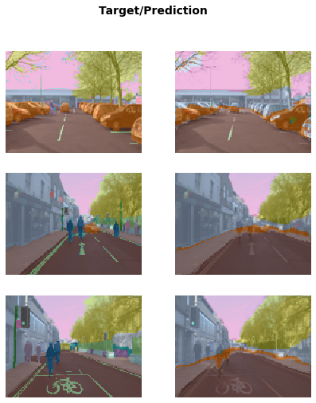
  </p>
  <p align="left"></p>
</div>

One other area where deep learning has dramatically improved in the last couple of years is natural language processing (NLP). Computers can now generate text, translate automatically from one language to another, analyze comments, label words in sentences, and much more. Here is all of the code necessary to train a model that can classify the sentiment of a movie review better than anything that existed in the world just five years ago:

在其它一个领域深度学习在近几年已经发生了戏剧化的改善，这就是自然语言处理（NLP）。计算机现在能够生成文本、自动从一种语言翻译到另一种语言、分析评论、在句子中标注词语等很多事情。这里有训练一个电影评论情感的分类模型所需要的所有代码，这个模型比五年前在这个世界上所存在的任何分类都要好：

```
from fastai.text.all import *

dls = TextDataLoaders.from_folder(untar_data(URLs.IMDB), valid='test')
learn = text_classifier_learner(dls, AWD_LSTM, drop_mult=0.5, metrics=accuracy)
learn.fine_tune(4, 1e-2)
```

| epoch（周期） | train_loss（训练损失） | valid_loss（验证损失） | accuracy（精度） | time（时间） |
| ------------: | ---------------------: | ---------------------: | ---------------: | -----------: |
|             0 |               0.594912 |               0.407416 |         0.823640 |        01:35 |

| epoch（周期） | train_loss（训练损失） | valid_loss（验证损失） | accuracy（精度） | time（时间） |
| ------------: | ---------------------: | ---------------------: | ---------------: | -----------: |
|             0 |               0.268259 |               0.316242 |         0.876000 |        03:03 |
|             1 |               0.184861 |               0.246242 |         0.898080 |        03:10 |
|             2 |               0.136392 |               0.220086 |         0.918200 |        03:16 |
|             3 |               0.106423 |               0.191092 |         0.931360 |        03:15 |

\#clean If you hit a "CUDA out of memory error" after running this cell, click on the menu Kernel, then restart. Instead of executing the cell above, copy and paste the following code in it:

#如果在运行这个单元格后你遇到了“CUDA 内存举出错误”，点击内核菜单，然后重启来清楚这个错误。拷贝和粘贴下面的代码，以替代上面单元格的代码。

```
from fastai.text.all import *

dls = TextDataLoaders.from_folder(untar_data(URLs.IMDB), valid='test', bs=32)
learn = text_classifier_learner(dls, AWD_LSTM, drop_mult=0.5, metrics=accuracy)
learn.fine_tune(4, 1e-2)
```

This reduces the batch size to 32 (we will explain this later). If you keep hitting the same error, change 32 to 16.

这个减少了批次尺寸到 32（我们稍后会解释）。如果你保持了同样的错误，把 32 改成 16.

This model is using the ["IMDb Large Movie Review dataset"](https://ai.stanford.edu/~ang/papers/acl11-WordVectorsSentimentAnalysis.pdf) from the paper "Learning Word Vectors for Sentiment Analysis" by Andrew Maas et al. It works well with movie reviews of many thousands of words, but let's test it out on a very short one to see how it does its thing:

这个模型使用的是来自安德鲁·马斯等人发表的论文“学习用于情感分析的词语向量”的[“IMDb 大型电影评论数据集”](https://ai.stanford.edu/~ang/papers/acl11-WordVectorsSentimentAnalysis.pdf)。基于电影评论数千个词语它工作的很好，让我们用一个非常短的语句对它进行测试，看它做的怎么样：

```
learn.predict("I really liked that movie!"):
```

out：('pos', tensor(1), tensor([0.0041, 0.9959]))

Here we can see the model has considered the review to be positive. The second part of the result is the index of "pos" in our data vocabulary and the last part is the probabilities attributed to each class (99.6% for "pos" and 0.4% for "neg").

这里我们能够看到模型已经认为评论是正向的。结果的第二部分在我们的数据词汇中是“正向”索引，最后一部分是每个分类的概率属性（“正向”为 99.6% 和 “负面”为 0.4%）。

Now it's your turn! Write your own mini movie review, or copy one from the internet, and you can see what this model thinks about it.

现在到你了，写下你自己的电影小评论，或从互联网上拷贝一个，然后你能看到这个模型对这个评论想了什么。

### Sidebar: The Order Matters

### 侧边栏：次序那点事

In a Jupyter notebook, the order in which you execute each cell is very important. It's not like Excel, where everything gets updated as soon as you type something anywhere—it has an inner state that gets updated each time you execute a cell. For instance, when you run the first cell of the notebook (with the "CLICK ME" comment), you create an object called `learn` that contains a model and data for an image classification problem. If we were to run the cell just shown in the text (the one that predicts if a review is good or not) straight after, we would get an error as this `learn` object does not contain a text classification model. This cell needs to be run after the one containing:

在 Jupyter 笔记本中，执行每一个单元格的次序是非常重要的。它不像 Excel，当你在某地方一旦输入内容，所有内容就会被更新：它有一个内部状态，每次你执行一个单元格都会被更新。例如，当你点击第一个笔记本单元格（有“CLICK ME”注释），你创建了一个名为`learn`包含一个处理图像分类问题的模型和数据的对象。然后如果我们直接去运行刚刚文中显示的单元格（预测一个评论是好或坏），我们会发现一个`learn`对象没有包含文本分类模型的错误。这个单元格需要在执行如下内容后方可运行：

```python
from fastai.text.all import *

dls = TextDataLoaders.from_folder(untar_data(URLs.IMDB), valid='test')
learn = text_classifier_learner(dls, AWD_LSTM, drop_mult=0.5, 
                                metrics=accuracy)
learn.fine_tune(4, 1e-2)
```

The outputs themselves can be deceiving, because they include the results of the last time the cell was executed; if you change the code inside a cell without executing it, the old (misleading) results will remain.

它们自己的输出能够被误导，因为它们包含最后一个单元格执行后的结果。如果你改变了单位格内的代码却没有执行它，老的（误导）结果将会保留。

Except when we mention it explicitly, the notebooks provided on the [book website](https://book.fast.ai/) are meant to be run in order, from top to bottom. In general, when experimenting, you will find yourself executing cells in any order to go fast (which is a super neat feature of Jupyter Notebook), but once you have explored and arrived at the final version of your code, make sure you can run the cells of your notebooks in order (your future self won't necessarily remember the convoluted path you took otherwise!).

除了我们明确说明，[图书网址](https://book.fast.ai/) 提供的书执行顺序一定是从上到下。通常来说，在做实验的时候，你会发现不管你以何顺序执行你的单元格都可以快速执行（这是 Jupyter 笔记的超级简洁特性），然而一旦你已经到了你的代码的最终版本，请确保你能以一定的顺序执行你的笔记本单元格（随着时间推移你自己不一定记得你曾做过的那些复杂顺序）。

In command mode, pressing `0` twice will restart the *kernel* (which is the engine powering your notebook). This will wipe your state clean and make it as if you had just started in the notebook. Choose Run All Above from the Cell menu to run all cells above the point where you are. We have found this to be very useful when developing the fastai library.

命令模型下，点击`0`按键两次会重启*内核*（这是你的笔记本引擎）。 这会清除笔记内所有你的执行状态并使得它就像刚刚开始的样子。点击单元格菜单选择运行上述所有代码功能项，就会运行当前位置以上的所有单元格。我们发现在开发 fastai 库时这是很有用。

### End sidebar

### 侧边栏结束

If you ever have any questions about a fastai method, you should use the function `doc`, passing it the method name:

如果对于 fastai 方法有任何疑问，你可以使用`doc`函数，通过如下方法名：

```python
doc(learn.predict)
```

This will make a small window pop up with content like this:

这会弹出包含以下内容的小窗口：


A brief one-line explanation is provided by `doc`. The "Show in docs" link take you to the full documentation, where you'll find all the details and lots of examples. Also, most of fastai's methods are just a handful of lines, so you can click the "source" link to see exactly what's going on behind the scenes.

通过`doc`提供了一个简短的解释。“Show in docs” 链接可以让你进入完整文档，在那里你会找到全部细节和很多例子。当然大多数 fastai 的方法只有少量代码行，所以你可以点击“source”链接去看方法背后到底做了什么。

Let's move on to something much less sexy, but perhaps significantly more widely commercially useful: building models from plain *tabular* data.

让我们移步到不是那么迷人，但也许对广泛的商业用途很有用的事情上：创建来自纯*表格*式数据的模型。

> jargon: Tabular: Data that is in the form of a table, such as from a spreadsheet, database, or CSV file. A tabular model is a model that tries to predict one column of a table based on information in other columns of the table.
>
> 术语：表格（Tabular）：在表格形式中的数据，例如来自一个电子数字表、数据库或 CSV 文件。一个表格模型是一种尝试基于表格的其它列信息去预测表格的某一列。

It turns out that looks very similar too. Here is the code necessary to train a model that will predict whether a person is a high-income earner, based on their socioeconomic background:

实际上看起来也是非常相似的。这里有训练一个模型所必需的代码，模型基于人们的社会经济背景，预测一个人是否是高收入者：

```
from fastai.tabular.all import *
path = untar_data(URLs.ADULT_SAMPLE)

dls = TabularDataLoaders.from_csv(path/'adult.csv', path=path, y_names="salary",
    cat_names = ['workclass', 'education', 'marital-status', 'occupation',
                 'relationship', 'race'],
    cont_names = ['age', 'fnlwgt', 'education-num'],
    procs = [Categorify, FillMissing, Normalize])

learn = tabular_learner(dls, metrics=accuracy)
```

As you see, we had to tell fastai which columns are *categorical* (that is, contain values that are one of a discrete set of choices, such as `occupation`) and which are *continuous* (that is, contain a number that represents a quantity, such as `age`).

正如你看到的，我们必须告诉 fastai 哪些列是分类的（这些列包含那种离散选择数值，例如`职业`）和哪些列是连续的（这些列包含代表数量的一种数值，例如`年龄`）。

There is no pretrained model available for this task (in general, pretrained models are not widely available for any tabular modeling tasks, although some organizations have created them for internal use), so we don't use `fine_tune` in this case. Instead we use `fit_one_cycle`, the most commonly used method for training fastai models *from scratch* (i.e. without transfer learning):

这个任务这里没有提供预训练模型（通常来说，对于那些表格式模型任务没有广泛的提供预训练模型，因此很多组织创建它们只是在内部使用），所以在这个例子中我们没用使用`微调(fine_tune)`。而是用到了`fit_one_cycle`，对于从头开始训练的 fastai 模型这是最常用的方法（即，没有迁移学习）：

```
learn.fit_one_cycle(3)
```

| epoch | train_loss | valid_loss | accuracy |  time |
| ----: | ---------: | ---------: | -------: | ----: |
|     0 |   0.359960 |   0.357917 | 0.831388 | 00:11 |
|     1 |   0.353458 |   0.349657 | 0.837991 | 00:10 |
|     2 |   0.338368 |   0.346997 | 0.843213 | 00:10 |

This model is using the [*Adult* dataset](http://robotics.stanford.edu/~ronnyk/nbtree.pdf), from the paper "Scaling Up the Accuracy of Naive-Bayes Classifiers: a Decision-Tree Hybrid" by Rob Kohavi, which contains some demographic data about individuals (like their education, marital status, race, sex, and whether or not they have an annual income greater than $50k). The model is over 80% accurate, and took around 30 seconds to train.

这个模型使用的是[*成年人*数据集](http://robotics.stanford.edu/~ronnyk/nbtree.pdf)，来自由罗布·科哈维发表的“提升贝叶斯分类精度：一种混合决策树”论文，它包含了关于个人的一些人口统计数据（例如他们的教育、婚姻状况、种族、性别和是否高于 5 万美金的年度收入）。这个模型训练时间用了大约 30 秒，超过了80%的精度。

Let's look at one more. Recommendation systems are very important, particularly in e-commerce. Companies like Amazon and Netflix try hard to recommend products or movies that users might like. Here's how to train a model that will predict movies people might like, based on their previous viewing habits, using the [MovieLens dataset](https://doi.org/10.1145/2827872):

让我们看另外一个例子。推荐系统是非常重要的，尤其在电子商务。像亚马逊和网飞这样的公司尝试极力推荐用户可能喜欢的商品和电影。基于人们以前的观看习惯，这里有一个如何去训练预测他们可能喜欢的电影的模型，使用的是[MovieLens 数据集](https://doi.org/10.1145/2827872):

```
from fastai.collab import *
path = untar_data(URLs.ML_SAMPLE)
dls = CollabDataLoaders.from_csv(path/'ratings.csv')
learn = collab_learner(dls, y_range=(0.5,5.5))
learn.fine_tune(10)
```

| epoch（周期） | train_loss（训练损失） | valid_loss（验证损失） | time（时间） |
| ------------: | ---------------------: | ---------------------: | -----------: |
|             0 |               1.554056 |               1.428071 |        00:01 |

| epoch（周期） | train_loss（训练损失） | valid_loss（验证损失） | time（时间） |
| ------------: | ---------------------: | ---------------------: | -----------: |
|             0 |               1.393103 |               1.361342 |        00:01 |
|             1 |               1.297930 |               1.159169 |        00:00 |
|             2 |               1.052705 |               0.827934 |        00:01 |
|             3 |               0.810124 |               0.668735 |        00:01 |
|             4 |               0.711552 |               0.627836 |        00:01 |
|             5 |               0.657402 |               0.611715 |        00:01 |
|             6 |               0.633079 |               0.605733 |        00:01 |
|             7 |               0.622399 |               0.602674 |        00:01 |
|             8 |               0.629075 |               0.601671 |        00:00 |
|             9 |               0.619955 |               0.601550 |        00:01 |

This model is predicting movie ratings on a scale of 0.5 to 5.0 to within around 0.6 average error. Since we're predicting a continuous number, rather than a category, we have to tell fastai what range our target has, using the `y_range` parameter.

这个模型预测的电影评分从 0.5 到 5.0 这个范围，平均误差在 0.6 左右。因此我们预测的是一个连续数值，而不是一个分类，我们需要使用`y_range`这个参数告诉fastai我们的目标序列。

Although we're not actually using a pretrained model (for the same reason that we didn't for the tabular model), this example shows that fastai lets us use `fine_tune` anyway in this case (you'll learn how and why this works in <chapter_pet_breeds>). Sometimes it's best to experiment with `fine_tune` versus `fit_one_cycle` to see which works best for your dataset.

虽然我们没用实际用到预训练模型（基于同样的原因，我们没有把它用在表格模型上），不过在这个例子中事例显示 fastai 让我们用了`微调（fine_tune）`（我们将会在宠物品种章节学习这个如何工作和为什么）。

We can use the same `show_results` call we saw earlier to view a few examples of user and movie IDs, actual ratings, and predictions:

我们能够使用`show_results`输出我们之前看到用户、电影 ID和实际评分的一些例子，以及其评分预测：

```
learn.show_results()
```

|      | userId（用户 ID） | movieId（电影 ID） | rating（评分） | rating_pred（评分预测） |
| ---: | ----------------: | -----------------: | -------------: | ----------------------: |
|    0 |               157 |               1200 |            4.0 |                3.558502 |
|    1 |                23 |                344 |            2.0 |                2.700709 |
|    2 |                19 |               1221 |            5.0 |                4.390801 |
|    3 |               430 |                592 |            3.5 |                3.944848 |
|    4 |               547 |                858 |            4.0 |                4.076881 |
|    5 |               292 |                 39 |            4.5 |                3.753513 |
|    6 |               529 |               1265 |            4.0 |                3.349463 |
|    7 |                19 |                231 |            3.0 |                2.881087 |
|    8 |               475 |               4963 |            4.0 |                4.023387 |
|    9 |               130 |                260 |            4.5 |                3.979703 |

### Sidebar: Datasets: Food for Models

### 侧边栏：数据集：模型的食物

You’ve already seen quite a few models in this section, each one trained using a different dataset to do a different task. In machine learning and deep learning, we can’t do anything without data. So, the people that create datasets for us to train our models on are the (often underappreciated) heroes. Some of the most useful and important datasets are those that become important *academic baselines*; that is, datasets that are widely studied by researchers and used to compare algorithmic changes. Some of these become household names (at least, among households that train models!), such as MNIST, CIFAR-10, and ImageNet.

你已经在本节完整的看了一些模型，每个训练使用的是用于完成不同任务的不同的数据集。对于机器学习和深度学习，没有数据我们什么都干不了。所以为我们训练模型创建了数据集的人是英雄（经常被低估）。一些最有用和重要的数据集是那些变成了重要的*学术基线*，这些数据集被研究人员广泛的研究并用于对比算法的改变。其中一些的名字已经家喻户晓（至少，在训练模型方面家喻户晓），例如 MNIST,CIFAR-10和 ImageNet。

The datasets used in this book have been selected because they provide great examples of the kinds of data that you are likely to encounter, and the academic literature has many examples of model results using these datasets to which you can compare your work.

在本书中所使用的数据集被选择的原因，他们是你可能遇到的各种类型数据中很好的示例，并且学术作品已经有了很多使用这些数据集的模型结果例子，这样能对你的工作进行对比。

Most datasets used in this book took the creators a lot of work to build. For instance, later in the book we’ll be showing you how to create a model that can translate between French and English. The key input to this is a French/English parallel text corpus prepared back in 2009 by Professor Chris Callison-Burch of the University of Pennsylvania. This dataset contains over 20 million sentence pairs in French and English. He built the dataset in a really clever way: by crawling millions of Canadian web pages (which are often multilingual) and then using a set of simple heuristics to transform URLs of French content onto URLs pointing to the same content in English.

在本书中使用的大多数据集创建者都做了大量的工作去创建。例如，在本书最后我们会给你展示如何创建一个模型，能够实现法语和英语之间的互译。输入的关键是早在 2009 年由宾夕法尼亚大学克里斯·卡里森·伯奇教授准备的法语/英语平行文本语料库。这个数据集包含了超过两千万对法语和英语。他用了非常聪明的方法创建了这个数据集：通过爬取数百万加拿大网页（这些网页通过是多语言），然后使用一系列简单的启发式方法把含有法语内容的网络地址转换到含有相同内容的对应英文网络地址。

As you look at datasets throughout this book, think about where they might have come from, and how they might have been curated. Then think about what kinds of interesting datasets you could create for your own projects. (We’ll even take you step by step through the process of creating your own image dataset soon.)

正好通过本书你看到的数据集，思虑他们可能来自哪里，并且他们可能如何策划的。然后思考关于为了你自己的项目你能创建哪些类型的有趣数据集。（稍后我们将带你通过一步一步的过程创建你自己的图像数据集，）

fast.ai has spent a lot of time creating cut-down versions of popular datasets that are specially designed to support rapid prototyping and experimentation, and to be easier to learn with. In this book we will often start by using one of the cut-down versions and later scale up to the full-size version (just as we're doing in this chapter!). In fact, this is how the world’s top practitioners do their modeling in practice; they do most of their experimentation and prototyping with subsets of their data, and only use the full dataset when they have a good understanding of what they have to do.

fast.ai 已经花费了大量时间创建了缩减版的流行数据集，用于支持快速原型和实验而特别设计的，并很容易学习。在本书我们经常通过使用缩减版开始，然后逐步增加到全尺寸版本（就像我们在本章正在做的一样）。实际上，在实践中世界顶级的从业人员就是这样制作他们的模型的，他们大多数的实验和原型使用的是他们的数据子集，只有在对他们要做什么有了一个深刻理解的时候才会使用全尺寸数据集。

### End sidebar

### 侧边栏结束

Each of the models we trained showed a training and validation loss. A good validation set is one of the most important pieces of the training process. Let's see why and learn how to create one.

我们训练的每一个模型都展示了一个训练损失和验证损失。一个好的验证集是训练过程最重要的一个环节。让我们看一下为什么以及学习如何创建一个。

## Validation Sets and Test Sets

## 验证集和测试集

As we've discussed, the goal of a model is to make predictions about data. But the model training process is fundamentally dumb. If we trained a model with all our data, and then evaluated the model using that same data, we would not be able to tell how well our model can perform on data it hasn’t seen. Without this very valuable piece of information to guide us in training our model, there is a very good chance it would become good at making predictions about that data but would perform poorly on new data.

正好我们已经讨论过的，一个模型的目标是做出关于数据的预测。但模型训练过程是根本无法表述的。如果你用我们全部数据训练模型，然后使用同样的数据评估模型，我们无法说出我们的模型在没有看到的数据上表现的良好情况。在我们训练模型时没有非常有价值的信息去指导我们，就有很大的可能性发生模型能在训练数据上做出很好的预测，但在新的数据上表现却很糟糕。

To avoid this, our first step was to split our dataset into two sets: the *training set* (which our model sees in training) and the *validation set*, also known as the *development set* (which is used only for evaluation). This lets us test that the model learns lessons from the training data that generalize to new data, the validation data.

为了避免这个问题，我们第一步是把我们的数据集分割为两个数据集：*训练集*（在训练中我们的模型可以看到）和*验证集*，也被称为*开发集*（只用于模型评估）。验证数据让我们测试模型从训练数据上学习经验可泛化到新的数据上。

One way to understand this situation is that, in a sense, we don't want our model to get good results by "cheating." If it makes an accurate prediction for a data item, that should be because it has learned characteristics of that kind of item, and not because the model has been shaped by *actually having seen that particular item*.

某种意义上理解这一情况的方法是，我们不想模型通过“作弊”获得好的成果。如果它在一个数据项上取得精准预测，应该是因为它已经学习到了那类数据项的一些特征，并不是因为模型通过*实际看到过的特定项* 完成塑形。

Splitting off our validation data means our model never sees it in training and so is completely untainted by it, and is not cheating in any way. Right?

分离出我们的验证数据意味着我们的模型在训练过程中永远无法看到它，所以验证数据完全不会用于模型训练，没有以任何方式进行欺骗。对吗？

In fact, not necessarily. The situation is more subtle. This is because in realistic scenarios we rarely build a model just by training its weight parameters once. Instead, we are likely to explore many versions of a model through various modeling choices regarding network architecture, learning rates, data augmentation strategies, and other factors we will discuss in upcoming chapters. Many of these choices can be described as choices of *hyperparameters*. The word reflects that they are parameters about parameters, since they are the higher-level choices that govern the meaning of the weight parameters.

事实上，不一定。情况更加微妙。这是因为基于确实可行的情况下我们很少仅通过训练模型的参数来构建模型。相反，我们可能去探查很多版本的模型，通过考虑网络架构进行各种建模选择、学习率、数据增加策略，以及我们将要在后续 章节讨论的其它因素。这些因素的选择能够被描述为*超参*选择。这个词折射出的他们是关于参数的参数，因为他们是更高水平的选择，以治理权重参数的意思。

The problem is that even though the ordinary training process is only looking at predictions on the training data when it learns values for the weight parameters, the same is not true of us. We, as modelers, are evaluating the model by looking at predictions on the validation data when we decide to explore new hyperparameter values! So subsequent versions of the model are, indirectly, shaped by us having seen the validation data. Just as the automatic training process is in danger of overfitting the training data, we are in danger of overfitting the validation data through human trial and error and exploration.

问题是，即使普通的训练过程在它学习权重参数值时只看在训练数据上的预测，对我们同样不是真实的。我们做为模型塑造者，我们决定探查新的超参值时通过看在验证数据上的预测来评估模型！所以随后的模型版本是通过我们查看验证数据间接塑造的。正如自动化训练过程是处于训练数据过拟危险之中，我们通过人类的判断、错误和探索而处于验证数据过拟的危险之中。

The solution to this conundrum is to introduce another level of even more highly reserved data, the *test set*. Just as we hold back the validation data from the training process, we must hold back the test set data even from ourselves. It cannot be used to improve the model; it can only be used to evaluate the model at the very end of our efforts. In effect, we define a hierarchy of cuts of our data, based on how fully we want to hide it from training and modeling processes: training data is fully exposed, the validation data is less exposed, and test data is totally hidden. This hierarchy parallels the different kinds of modeling and evaluation processes themselves—the automatic training process with back propagation, the more manual process of trying different hyper-parameters between training sessions, and the assessment of our final result.

解决这一复杂问题是引入其它更高等级储备数据：测试集。正如在训练过程中我们隐藏了验证数据，我们甚至必须对我们自己对测试集数据进行隐藏。它不能被用于改善模型。它只能用于我们的最终成果的模型评估。实际上是基于我们如何想完全在训练和建模过程中隐藏它，我们定义了数据分割的等级制度：训练数据完全暴露，验证数据较少暴露，测试数据全部隐藏。不同类型的建模和他们自我评估过程都有这个等级向度：向后传播的自动训练过程，在不同的训练时间段尝试不同超参的更多手动过程，和我们最终结果的评价。

The test and validation sets should have enough data to ensure that you get a good estimate of your accuracy. If you're creating a cat detector, for instance, you generally want at least 30 cats in your validation set. That means that if you have a dataset with thousands of items, using the default 20% validation set size may be more than you need. On the other hand, if you have lots of data, using some of it for validation probably doesn't have any downsides.

测试集和验证集应该有足够的数据以确保你可以获得精度的良好评估。例如，如果你正在创建一个猫探测器，通过在你的验证集不能少于 30 张猫的图片。意味着如果你有一个数千条的数据集，使用默认的 20%作为验证集大小可以大大满足你的需求。另一方面，如果你有一些数据，它们中的一部分做为验证之用可能不会有任何负面作用。

Having two levels of "reserved data"—a validation set and a test set, with one level representing data that you are virtually hiding from yourself—may seem a bit extreme. But the reason it is often necessary is because models tend to gravitate toward the simplest way to do good predictions (memorization), and we as fallible humans tend to gravitate toward fooling ourselves about how well our models are performing. The discipline of the test set helps us keep ourselves intellectually honest. That doesn't mean we *always* need a separate test set—if you have very little data, you may need to just have a validation set—but generally it's best to use one if at all possible.

拥有两个等级的“保留数据”：一个验证集和一个测试集，一个等级代表数据对你自己完全隐藏，好像有点极端。通常必须这样做的理由是因为模型倾向采用最简单的方法去做出良好的预测（记忆），而我们做为容易犯错的人类倾向于我们的模型表现是如何的良好来愚弄自己。测试集的准则是帮助我们保持理智上的诚实。这并不意味我们*总是*需要一个单独的测试集，如果你有很少的数据，你可能只需要有一个验证集，但通常来说如果在完全有可能的情况下最好使用测试集。

This same discipline can be critical if you intend to hire a third party to perform modeling work on your behalf. A third party might not understand your requirements accurately, or their incentives might even encourage them to misunderstand them. A good test set can greatly mitigate these risks and let you evaluate whether their work solves your actual problem.

相同准则是至关重要的，如果你基于自己的需求想要雇佣第三方做建模工作。第三方不可能精准的理解到你的需求，或他们的动机甚至可能鼓励他们去错误的理解需求。一个好的测试集能够很好的缓解这个风险，让你评估他们的工作是否解决了你的实际问题。

To put it bluntly, if you're a senior decision maker in your organization (or you're advising senior decision makers), the most important takeaway is this: if you ensure that you really understand what test and validation sets are and why they're important, then you'll avoid the single biggest source of failures we've seen when organizations decide to use AI. For instance, if you're considering bringing in an external vendor or service, make sure that you hold out some test data that the vendor *never gets to see*. Then *you* check their model on your test data, using a metric that *you* choose based on what actually matters to you in practice, and *you* decide what level of performance is adequate. (It's also a good idea for you to try out some simple baseline yourself, so you know what a really simple model can achieve. Often it'll turn out that your simple model performs just as well as one produced by an external "expert"!)

坦白的说，如果你在你的组织内是一个资深决策层（或你给资深决策层做顾问），最重要的是：确保你是否真的理解什么是测试集和验证集和它们为什么重要，然后当组织决定使用人工智能时你将会规避我们所见过的单个最大失败源。例如，如果你考虑引进外部的卖家或服务，确保你持有卖家*从来没看到过的*测试数据。然后*你*用你的测试数据检测他们的模型，基于实践中对你来说真正重要的事情使用*你*所选择的指标，并且*你* 要决策什么表现级别是足够的。（尝试一些你自己的简单基线对你来说这也是一个好主意，因此你会知道一个真正简单的模型能完成什么。通常你会发现你的简单模型和外部“专家”生产的模型一样好！）

### Use Judgment in Defining Test Sets

### 使用判断力定义测试集

To do a good job of defining a validation set (and possibly a test set), you will sometimes want to do more than just randomly grab a fraction of your original dataset. Remember: a key property of the validation and test sets is that they must be representative of the new data you will see in the future. This may sound like an impossible order! By definition, you haven’t seen this data yet. But you usually still do know some things.

要做好一个好的定义一个验证集（也可能是一个测试集）的工作，你有时会想要做的更多而不是仅仅随机抓取你原始数据集的一下部分。记住：验证集和测试集一个关键的特征是它们必须代表你在未来将要看到的新数据。听起来这是一个不可能的任务！根据定义，你还没有看到过的这个数据。但通常你一直都知道一些事情。

It's instructive to look at a few example cases. Many of these examples come from predictive modeling competitions on the [Kaggle](https://www.kaggle.com/) platform, which is a good representation of problems and methods you might see in practice.

看一些事例是有帮助的。这些例子很多来自 [Kaggle](https://www.kaggle.com/)平台上的预测建模比赛，它们很好的代表了在实践中你可能看到的问题和方法。

One case might be if you are looking at time series data. For a time series, choosing a random subset of the data will be both too easy (you can look at the data both before and after the dates your are trying to predict) and not representative of most business use cases (where you are using historical data to build a model for use in the future). If your data includes the date and you are building a model to use in the future, you will want to choose a continuous section with the latest dates as your validation set (for instance, the last two weeks or last month of available data).

一种情况可能是你正在查看的时间序列数据。对于一个时间序列，选择一个随机子数据集即不太容易（你要能够看到你要预测时间之前和之后的两者数据）也不能很好的代表大多商业案例（你用历史数据去构建一个模型用于未来）。如果你的数据包含了日期且你正在构建一个用于未来的模型，你需要选择一个包含最近日期的连续片段作为你的验证集（例如，最后的两周或最后一个月的有效数据）

Suppose you want to split the time series data in <timeseries1> into training and validation sets.

假设你想把图<时间序列一>中的时间序列数据分割为训练集和验证集。

<div style="text-align:left">
  <p align="left">
    
  </p>
  <p align="center">时间序列一</p>
</div>

Instead, use the earlier data as your training set (and the later data for the validation set), as shown in <<timeseries3>>.

作为替代，使用最早的数据作为你的训练集（和最新的数据做为验证集），如图<时间序列三>所示。

<div style="text-align:left">
  <p align="left">
    
  </p>
  <p align="center">时间序列三</p>
</div>

For example, Kaggle had a competition to [predict the sales in a chain of Ecuadorian grocery stores](https://www.kaggle.com/c/favorita-grocery-sales-forecasting). Kaggle's training data ran from Jan 1 2013 to Aug 15 2017, and the test data spanned Aug 16 2017 to Aug 31 2017. That way, the competition organizer ensured that entrants were making predictions for a time period that was *in the future*, from the perspective of their model. This is similar to the way quant hedge fund traders do *back-testing* to check whether their models are predictive of future periods, based on past data.

例如，Kaggle 有一个竞赛[预测一个厄瓜多尔杂货连锁店的销售额](https://www.kaggle.com/c/favorita-grocery-sales-forecasting)。Kaggle 的训练数据从 2013 年 1 月 1 日到 2017 年 8 月 15 日，测试数据的持续时间段从 2017 年 8 月 16 日到 2017 年8 月 31 日。这样比赛组织者通过他们模型的视角可确保参赛者预测*未来*的一个时间段。这与量化对冲基金交易员做*回归测试*去检查他们的模型基于过去的数据是否预测了未来时间段很类似。

A second common case is when you can easily anticipate ways the data you will be making predictions for in production may be *qualitatively different* from the data you have to train your model with.

第二种常见的情况是当你能够轻松的预料在生产上做出预测的数据方式与你进行模型训练所必须的数据可能有*本质区别*。

In the Kaggle [distracted driver competition](https://www.kaggle.com/c/state-farm-distracted-driver-detection), the independent variables are pictures of drivers at the wheel of a car, and the dependent variables are categories such as texting, eating, or safely looking ahead. Lots of pictures are of the same drivers in different positions, as we can see in <img_driver>. If you were an insurance company building a model from this data, note that you would be most interested in how the model performs on drivers it hasn't seen before (since you would likely have training data only for a small group of people). In recognition of this, the test data for the competition consists of images of people that don't appear in the training set.

在 Kaggle 上的[驾驶员分心竞赛](https://www.kaggle.com/c/state-farm-distracted-driver-detection)，自变量是在汽车方向盘上驾驶员们的图片和因变量是各种如发信息、进食或安全的目视前方的分类。很多图片是相同的驾驶员的不同姿态，如你在下<驾驶员图片>中看到的。如果你是一个保险公司要根据这些数据构建模型， 请注意你可能最感兴趣的是模型在它之前没有看到的驾驶员上表面如何（因此你可能只有一个小团体人群的训练数据）。基于这个认识，竞赛所构成的人类图片测试数据没有出现在训练集中。

<div style="text-align:left">
  <p align="left">
    
  </p>
  <p align="center">驾驶员图片</p>
</div>

If you put one of the images in <img_driver> in your training set and one in the validation set, your model will have an easy time making a prediction for the one in the validation set, so it will seem to be performing better than it would on new people. Another perspective is that if you used all the people in training your model, your model might be overfitting to particularities of those specific people, and not just learning the states (texting, eating, etc.).

如果你把<驾驶员图片>中的一张图片放在你的训练集，一张放在验证集，你的模型将会很容易预测在验证集里的那张图片，所以相对一个新人图片模型看起来表面更好。别一个观点是，如果你使用了所有人的图片在你的模型训练，你的模型可能在那些特点人的特征过拟了，并不仅仅是学习了那此状态（发信息、进食等）。

A similar dynamic was at work in the [Kaggle fisheries competition](https://www.kaggle.com/c/the-nature-conservancy-fisheries-monitoring) to identify the species of fish caught by fishing boats in order to reduce illegal fishing of endangered populations. The test set consisted of boats that didn't appear in the training data. This means that you'd want your validation set to include boats that are not in the training set.

一个类似的措施是在[Kaggle渔业竞赛](https://www.kaggle.com/c/the-nature-conservancy-fisheries-monitoring)中去识别渔船捕捉鱼的品种，以减少非法捕捉濒危鱼种。渔船测试集构成没有出现在训练数据中。这意味着你不希望你的验证集包含的渔船没有在训练集中。

Sometimes it may not be clear how your validation data will differ. For instance, for a problem using satellite imagery, you'd need to gather more information on whether the training set just contained certain geographic locations, or if it came from geographically scattered data.

有时候它可能不清楚你的验证数据会有怎样的差别。例如，对于一个使用卫星图片的问题，你需要去搜集训练集是否仅仅包含确定的地理位置或它是否来自地理上分散数据的更多信息。

Now that you have gotten a taste of how to build a model, you can decide what you want to dig into next.

现在你已经浅尝如何构建一个模型，你能够决定接下来想要深入研究什么。

## A *Choose Your Own Adventure* moment

## *选择你自己的冒险* 时刻

If you would like to learn more about how to use deep learning models in practice, including how to identify and fix errors, create a real working web application, and avoid your model causing unexpected harm to your organization or society more generally, then keep reading the next two chapters. If you would like to start learning the foundations of how deep learning works under the hood, skip to <chapter_mnist_basics>. (Did you ever read *Choose Your Own Adventure* books as a kid? Well, this is kind of like that… except with more deep learning than that book series contained.)

如你想学习更多关于如何在实践中使用深度学习模型，包括如何识别并修复错误，创建一个实际工作的网络应用，并避免你的模型在更广泛的层面上对你的组织和社会引发不可预期的伤害，请继续阅读接下来的两节。如果你喜欢从学习深度学习后台如何工作的基础开始，可以直接到<mnist 基础章节>（小的时候你曾经读过*选择你自己的冒险*系列书吗？是，这是相同的类型...除了比那本系列书包含了更多的深度学习。）

You will need to read all these chapters to progress further in the book, but it is totally up to you which order you read them in. They don't depend on each other. If you skip ahead to <chapter_mnist_basics>, we will remind you at the end to come back and read the chapters you skipped over before you go any further.

你需要阅读本书的所有章节以进一步学习，但它完全取决于你阅读他们的顺序。它们相互之间没有依赖。如果你略过开头去阅读<mnist 基础章节>，我们在结尾会提醒你进行任何进一步学习之前返回并阅读你略过的章节。

## Questionnaire

## 练习题

It can be hard to know in pages and pages of prose what the key things are that you really need to focus on and remember. So, we've prepared a list of questions and suggested steps to complete at the end of each chapter. All the answers are in the text of the chapter, so if you're not sure about anything here, reread that part of the text and make sure you understand it. Answers to all these questions are also available on the [book's website](https://book.fast.ai/). You can also visit [the forums](https://forums.fast.ai/) if you get stuck to get help from other folks studying this material.

在一页页的文字中很难知道你真正需要关注和记住的关键事情是什么。所以，我们在每一章的末尾准备了一个问题列表和建议完成的步骤。所有的答案都在章节内的文字中，如果你有任何不确定的事情，重新阅读该文字部分并确保你理解它。所有问题的答案在[图书站点](https://book.fast.ai/)也有提供。如果你卡住了你也可以访问[论坛](https://forums.fast.ai/)去获取其它学习本书人的帮助。

1. Do you need these for deep learning?
   - Lots of math T / F
   - Lots of data T / F
   - Lots of expensive computers T / F
   - A PhD T / F
2. Name five areas where deep learning is now the best in the world.
3. What was the name of the first device that was based on the principle of the artificial neuron?
4. Based on the book of the same name, what are the requirements for parallel distributed processing (PDP)?
5. What were the two theoretical misunderstandings that held back the field of neural networks?
6. What is a GPU?
7. Open a notebook and execute a cell containing: `1+1`. What happens?
8. Follow through each cell of the stripped version of the notebook for this chapter. Before executing each cell, guess what will happen.
9. Complete the Jupyter Notebook online appendix.
10. Why is it hard to use a traditional computer program to recognize images in a photo?
11. What did Samuel mean by "weight assignment"?
12. What term do we normally use in deep learning for what Samuel called "weights"?
13. Draw a picture that summarizes Samuel's view of a machine learning model.
14. Why is it hard to understand why a deep learning model makes a particular prediction?
15. What is the name of the theorem that shows that a neural network can solve any mathematical problem to any level of accuracy?
16. What do you need in order to train a model?
17. How could a feedback loop impact the rollout of a predictive policing model?
18. Do we always have to use 224×224-pixel images with the cat recognition model?
19. What is the difference between classification and regression?
20. What is a validation set? What is a test set? Why do we need them?
21. What will fastai do if you don't provide a validation set?
22. Can we always use a random sample for a validation set? Why or why not?
23. What is overfitting? Provide an example.
24. What is a metric? How does it differ from "loss"?
25. How can pretrained models help?
26. What is the "head" of a model?
27. What kinds of features do the early layers of a CNN find? How about the later layers?
28. Are image models only useful for photos?
29. What is an "architecture"?
30. What is segmentation?
31. What is `y_range` used for? When do we need it?
32. What are "hyperparameters"?
33. What's the best way to avoid failures when using AI in an organization?

1. 对于深度学习你需要这些吗？
   - 许多数学知识 真 / 假
   - 大量数据 真 / 假
   - 许多昂贵的计算机 真 / 假
   - 一个博士学位 真 / 假
2. 列出在这个世界上现在深度学习做的最好的五个领域名称。
3. 基于人工神经元原理的第一个装置是什么名字？
4. 根据同名书，对于并行分布式处理（PDP）有什么要求？
5. 阻止神经网络领域的两个理论误解是什么？
6.  什么是GPU？
7. 打开一个Jupyter笔记本并执行 一个含有 1+1 内容的单元格，会发生什么？
8. 跟随本章笔记的剥离版本的每一个单元格，在执行每个单元格前，猜想将会发生什么。
9. 完成 Jupyter 笔记本的在线附录。
10. 为什么很难用传统计算机程序去识别照片中的图像？
11. 塞缪尔所说的“权重分配”是什么意思？
12. 在深度学习中什么术语通常用来表示塞缪尔所说的“权重”？
13. 画一幅总结塞缪尔机器学习模型观点的图。
14. 一个深度学习模型为什么做了一个特定预测，为什么很难理解？
15. 表名神经网络能够在任何精度等级上解决任何数学问题的定理名是什么？
16. 为了训练一个模型你需要做什么？
17. 反馈回路如何影响治安预警模型的推出？
18. 在猫识别模型上你必须一直使用 224*224 像素的图片吗？
19. 分类和回归这间的差异是什么？
20. 什么是验证集？什么是测试集？我们为什么需要它们？
21. 如果你不提供一个验证集，fastai 将会做什么？
22. 对于验证集我们能总是使用随机样本吗？为什么这样做或为什么不这样做？
23. 什么是过拟？提供一个示例。
24. 什么是指标？它与“loss”有怎样的区别？
25. 预训练模型能提供怎样的帮助？
26. 模型“头”是什么？
27. 卷积神经网络前面的层能找到什么类型的特征？后面的层呢？
28. 图形模型只对图像有用吗？
29. “架构”是什么？
30. 什么是分割？
31. `y_range`用于什么？我们什么时候需要它？
32. 什么是“超参”？

### Further Research

### 未来研究

Each chapter also has a "Further Research" section that poses questions that aren't fully answered in the text, or gives more advanced assignments. Answers to these questions aren't on the book's website; you'll need to do your own research!

每个章节也有一个“未来研究”小节，突出一些文中没有完全回答的问题，或给出更多高级任务。本收的网站没有问题的答案，你需要自己去研究探索！

1. Why is a GPU useful for deep learning? How is a CPU different, and why is it less effective for deep learning?
2. Try to think of three areas where feedback loops might impact the use of machine learning. See if you can find documented examples of that happening in practice.

1. 为什么 GPU 对深度学习有用？ CPU 有什么不同，及为什么它对深度学习的效果差？
2. 尝试思考反馈回路功能影响机器学习使用的三个方面。看你是否能找到实践中记录的发生示例。