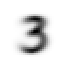
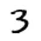
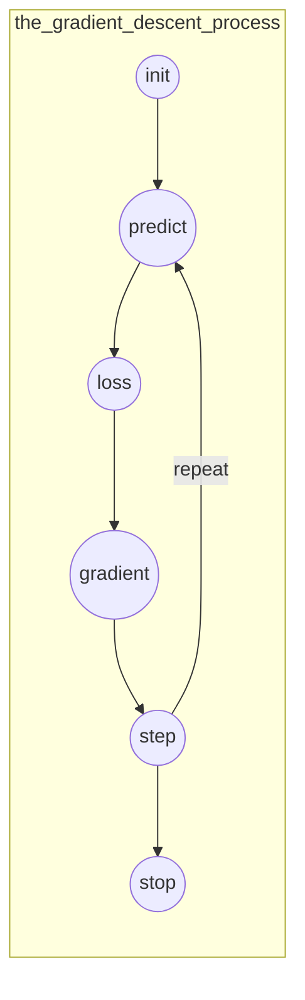
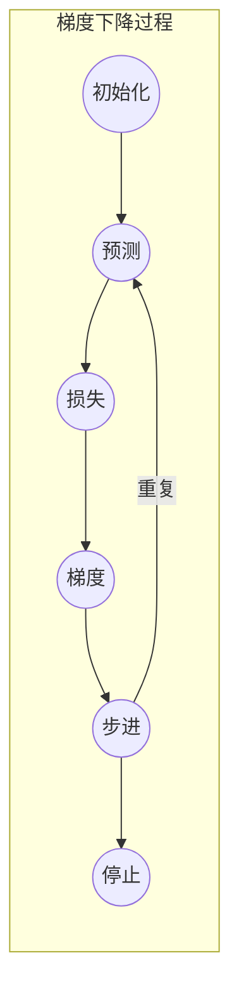
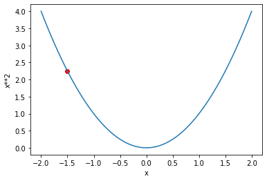

# Under the Hood: Training a Digit Classifier

# 追根溯源：训练一个数字分类

Having seen what it looks like to actually train a variety of models in Chapter 2, let’s now look under the hood and see exactly what is going on. We’ll start by using computer vision to introduce fundamental tools and concepts for deep learning.

在第二章已经发它看起来好像可以训练各种模型，现在让我们追根溯源并看实际上到底是怎么一回事。我们将通过使用计算机视觉开始介绍一些基础工具和深度学习的概念。

To be exact, we'll discuss the roles of arrays and tensors and of broadcasting, a powerful technique for using them expressively. We'll explain stochastic gradient descent (SGD), the mechanism for learning by updating weights automatically. We'll discuss the choice of a loss function for our basic classification task, and the role of mini-batches. We'll also describe the math that a basic neural network is actually doing. Finally, we'll put all these pieces together.

为了准确，我们会讨论数组、张量和传播的作用，一个强大的技术，使用他们具有深远意义。我们会解释随机剃度下降（SGD），通过自动更新权重来学习的机制。我们会讨论对于基础分类任务的损失函数选择，及最小批次的作用。我们也会描述一个基础神经网络实际在做的数学知识。最后，我们会把所有部分汇总在一起。

In future chapters we’ll do deep dives into other applications as well, and see how these concepts and tools generalize. But this chapter is about laying foundation stones. To be frank, that also makes this one of the hardest chapters, because of how these concepts all depend on each other. Like an arch, all the stones need to be in place for the structure to stay up. Also like an arch, once that happens, it's a powerful structure that can support other things. But it requires some patience to assemble.

在后续章节我们也会深度研究其它应用，并看这些概念和工具如何泛化。但是这一章是基石。坦率的说，这也使得这是难的章节之一。因为这些概念彼此都是依赖的。就像一个拱形，所以的石头需要在架构保持稳定的位置。也像一个拱形，一旦问题发生，这个强大的架构能够支持其它事情。因而它需要一些耐心去装配。

Let's begin. The first step is to consider how images are represented in a computer.

让我们开始吧。第一步来考虑在计算机里图片是怎样表达的。

## Pixels: The Foundations of Computer Vision

## 像素：计算机视觉的基础

In order to understand what happens in a computer vision model, we first have to understand how computers handle images. We'll use one of the most famous datasets in computer vision, [MNIST](https://en.wikipedia.org/wiki/MNIST_database), for our experiments. MNIST contains images of handwritten digits, collected by the National Institute of Standards and Technology and collated into a machine learning dataset by Yann Lecun and his colleagues. Lecun used MNIST in 1998 in [Lenet-5](http://yann.lecun.com/exdb/lenet/), the first computer system to demonstrate practically useful recognition of handwritten digit sequences. This was one of the most important breakthroughs in the history of AI.

为了理解在计算机视觉模型里到底到生了什么，我们先要理解计算机怎样处理图像。作为我们的尝试，我们会使用在计算机视觉最著名的数据集之一：[MNIST](https://en.wikipedia.org/wiki/MNIST_database)。MNIST包含了手写体数字图像，由美国国家标准技术研究所搜集，并被杨·立昆和他的同事纳入到一个机器学习数据集中。立昆1998年在[Lenet-5](http://yann.lecun.com/exdb/lenet/)卷积神经网络中使用了MNIST数据集，这是第一个计算机系统实际证明了可用的手写数字系列的识别。这是人工智能历史上最重要的突破之一。

## Sidebar: Tenacity and Deep Learning

## 侧边栏：坚韧和深度学习

The story of deep learning is one of tenacity and grit by a handful of dedicated researchers. After early hopes (and hype!) neural networks went out of favor in the 1990's and 2000's, and just a handful of researchers kept trying to make them work well. Three of them, Yann Lecun, Yoshua Bengio, and Geoffrey Hinton, were awarded the highest honor in computer science, the Turing Award (generally considered the "Nobel Prize of computer science"), in 2018 after triumphing despite the deep skepticism and disinterest of the wider machine learning and statistics community.

深度学习的故事是少数具有献身精神的研究人员坚韧和坚持之一。在1990年代和2000年代早期的希望（和过度宣传！）神经网络令人失去兴趣，只有少数的研究人员持续尝试使优化他们的工作。尽管更广泛的机器学习和统计团队深度质疑和漠不关心，在巨大成功后，2018年他们中的三人，杨·立昆、约书亚·本吉奥和杰弗里·辛顿被授予计算机科学界的最高荣誉：图灵奖（普通认为这是“计算机科学的诺贝尔奖”）。

Geoff Hinton has told of how even academic papers showing dramatically better results than anything previously published would be rejected by top journals and conferences, just because they used a neural network. Yann Lecun's work on convolutional neural networks, which we will study in the next section, showed that these models could read handwritten text—something that had never been achieved before. However, his breakthrough was ignored by most researchers, even as it was used commercially to read 10% of the checks in the US!

杰弗里·辛顿说过，即使学术论文怎样显示出比之前发布文章的更戏剧化的结果，也许会被顶级期刊和会议拒绝，只是因为他们用了一个神经网络。杨·立昆在卷积神经网络的工作，显示了这些模型能够阅读手写文本（有些内容被），一些工作以前从来没有完成过，在下一部分我们会进行研究。即便它被用于商业用途读取了美国10%的支票信息，然而，他的突破却被绝大多数研究人员所忽略。

In addition to these three Turing Award winners, there are many other researchers who have battled to get us to where we are today. For instance, Jurgen Schmidhuber (who many believe should have shared in the Turing Award) pioneered many important ideas, including working with his student Sepp Hochreiter on the long short-term memory (LSTM) architecture (widely used for speech recognition and other text modeling tasks, and used in the IMDb example in <chapter_intro>). Perhaps most important of all, Paul Werbos in 1974 invented back-propagation for neural networks, the technique shown in this chapter and used universally for training neural networks ([Werbos 1994](https://books.google.com/books/about/The_Roots_of_Backpropagation.html?id=WdR3OOM2gBwC)). His development was almost entirely ignored for decades, but today it is considered the most important foundation of modern AI.

除了这三名图灵获奖者，还有很多其它奋斗的研究人员为我们争取到了今天的成果。例如于尔根·施密德胡伯（很多人认为应该获得图灵奖）是很多重要想法的先驱，包括与他的学生塞普·霍克赖特在长短期记忆（LSTM）架构（广泛被用于语音识别和其它文本建模任务，及被用于在<概述>章节中的IMDb例子）上的工作。可能所有工作中重要的是在1974年保罗·韦伯斯发明的后向传播神经网络，这一技术在本章节会出现并被广泛用于训练神经网络[（韦伯斯 1994）](https://books.google.com/books/about/The_Roots_of_Backpropagation.html?id=WdR3OOM2gBwC))。他的发展几乎被忽略了整整十几年，但如今它被认为是现代人工智能最重要的基础。

There is a lesson here for all of us! On your deep learning journey you will face many obstacles, both technical, and (even more difficult) posed by people around you who don't believe you'll be successful. There's one *guaranteed* way to fail, and that's to stop trying. We've seen that the only consistent trait amongst every fast.ai student that's gone on to be a world-class practitioner is that they are all very tenacious.

这是一个对我们所有人的教训！在你的深度学习之旅，你将会面临很多障碍，技术上的和态度两者，后者甚至更艰难，你周边的人不相信你会取得成功。没有*肯定*失败的方法并停止尝试。我们已经看到了，在每一个fast.ai励志做一个世界一流水平行业者的学生中有个唯一一致特点是他们都非常有韧性。

## End sidebar

## 侧边栏结束

For this initial tutorial we are just going to try to create a model that can classify any image as a 3 or a 7. So let's download a sample of MNIST that contains images of just these digits:

我们将尝试创建一个能够分类任何3和7图片的模型做为本次初始教程。所以让我们下载一个只包含这两个数字图片的MNIST样本：

```python
path = untar_data(URLs.MNIST_SAMPLE)
#hide
Path.BASE_PATH = path
```

We can see what's in this directory by using `ls`, a method added by fastai. This method returns an object of a special fastai class called `L`, which has all the same functionality of Python's built-in `list`, plus a lot more. One of its handy features is that, when printed, it displays the count of items, before listing the items themselves (if there are more than 10 items, it just shows the first few):

你能够使用`ls`查看这个目录里的内容，这个方法是fastai增加的。本方法返回一个叫做`L`的特定fastai类对象，这与Python内置的`list`的实用性完全类似，只是增加了一些内容。它好用功能之一是，当输出时它会先显示条目数，随后列出条目自身（如果有超过10个条目，它只显示头几个）：

```python
path.ls()
```

Out：(#3) [Path('valid'),Path('labels.csv'),Path('train')]

The MNIST dataset follows a common layout for machine learning datasets: separate folders for the training set and the validation set (and/or test set). Let's see what's inside the training set:

MNIST数据集遵从了机器学习数据集的通用框架：把文件夹分割为训练集和验证集（和/或测试集）。让我们看一下训练集的内部是什么：

```python
(path/'train').ls()
```

Out: (#2) [Path('train/7'),Path('train/3')]

There's a folder of 3s, and a folder of 7s. In machine learning parlance, we say that "3" and "7" are the *labels* (or targets) in this dataset. Let's take a look in one of these folders (using `sorted` to ensure we all get the same order of files):

有一个3的文件夹和一个7的文件夹。在机器学习中的用语，我们说“3”和“7”是本数据集中的*标签*（或靶）。让我们看一下这些文件夹中的一个（使用*sorted*以确保我们完全取得相同顺序的文件）：

```python
threes = (path/'train'/'3').ls().sorted()
sevens = (path/'train'/'7').ls().sorted()
threes
```

Out: (#6131) [Path('train/3/10.png'),Path('train/3/10000.png'),Path('train/3/10011.png'),Path('train/3/10031.png'),Path('train/3/10034.png'),Path('train/3/10042.png'),Path('train/3/10052.png'),Path('train/3/1007.png'),Path('train/3/10074.png'),Path('train/3/10091.png')...]

As we might expect, it's full of image files. Let’s take a look at one now. Here’s an image of a handwritten number 3, taken from the famous MNIST dataset of handwritten numbers:

正如我们可能期望的，它全是图像文件。让我们现在看一张。这是一张来自著名MNIST数据集的手写数字3：

```python
im3_path = threes[1]
im3 = Image.open(im3_path)
im3
```

Out: 

Here we are using the `Image` class from the *Python Imaging Library* (PIL), which is the most widely used Python package for opening, manipulating, and viewing images. Jupyter knows about PIL images, so it displays the image for us automatically.

这里我们用了来自*python图像库*（PIL）的`Image`类，这是使用最为广泛的Python包用于打开、操作和查看图像。Jupyter知道PIL图片，所以它会为我们自动显示图片。

In a computer, everything is represented as a number. To view the numbers that make up this image, we have to convert it to a *NumPy array* or a *PyTorch tensor*. For instance, here's what a section of the image looks like, converted to a NumPy array:

在一个计算机里，所有的事情被表示为一个数值。查看组成这一图片的数值，我们必须把它转换为一个*NumPy数组*或一个*PyTorch张量*。例如，这是一张选中的图像看起来已转换为一个NumPy数组：

```python
array(im3)[4:10,4:10]
```

$
\begin{matrix} Out:array([&[& 0, & 0, & 0, & 0, & 0, & 0&],\\ 
	& [&0,& 0,& 0,& 0,& 0,& 29&], \\ 
	& [&0,& 0,& 0,& 48,& 166,& 224&], \\ 
	& [&0,& 93,& 244,& 249,& 253,& 187&], \\
	& [&0,& 107,& 253,& 253,& 230,& 48&], \\
	& [&0,& 3,& 20,& 20,& 15,& 0&]]&dtype=uint8)
\end{matrix}
$

The `4:10` indicates we requested the rows from index 4 (included) to 10 (not included) and the same for the columns. NumPy indexes from top to bottom and left to right, so this section is located in the top-left corner of the image. Here's the same thing as a PyTorch tensor:

4:10指示的是我们需要索引号从4（包含）到10（不包含）的行和相同的列。NumPy索引号从上到下和从左到右，所以这一部分位置在图像的左上部。对于PyTorch张量是同样的事情：

```python
tensor(im3)[4:10,4:10]
```

$
\begin{matrix} Out:array([&[& 0, & 0, & 0, & 0, & 0, & 0&],\\ 
	& [&0,& 0,& 0,& 0,& 0,& 29&], \\ 
	& [&0,& 0,& 0,& 48,& 166,& 224&], \\ 
	& [&0,& 93,& 244,& 249,& 253,& 187&], \\
	& [&0,& 107,& 253,& 253,& 230,& 48&], \\
	& [&0,& 3,& 20,& 20,& 15,& 0&]]&dtype=torch.uint8)
\end{matrix}
$

We can slice the array to pick just the part with the top of the digit in it, and then use a Pandas DataFrame to color-code the values using a gradient, which shows us clearly how the image is created from the pixel values:

我们能够切片数组挑出其中数值顶部的部分，然后用Pandas的数据结构利用一个梯度对数值颜色编码，就能够清晰的展示给我们图片被创建的像数值：

```python
#hide_output
im3_t = tensor(im3)
df = pd.DataFrame(im3_t[4:15,4:22])
df.style.set_properties(**{'font-size':'6pt'}).background_gradient('Greys')
```

Out: 

You can see that the background white pixels are stored as the number 0, black is the number 255, and shades of gray are between the two. The entire image contains 28 pixels across and 28 pixels down, for a total of 784 pixels. (This is much smaller than an image that you would get from a phone camera, which has millions of pixels, but is a convenient size for our initial learning and experiments. We will build up to bigger, full-color images soon.)

你能够看到白色像素背景储存的数值是0，黑色的是数值255，及灰色阴影是在两者之间的数值。整张图像包含28个横向像素和28个竖向像素，一共是784个像素。（它与你从一个手机镜头拍摄的上百万像素图片极为相似，但对于我们开始学习和试验小像素是一个合适的尺寸。稍后我们会创建更大和彩色的图像。）

So, now you've seen what an image looks like to a computer, let's recall our goal: create a model that can recognize 3s and 7s. How might you go about getting a computer to do that?

所以，现在你已经看到了对于计算机来说一张图像的样子，来回想一下我们的目标：创建能够识别3和7的模型。你如何能够让计算机做这个事情呢？

> Warning: Stop and Think!: Before you read on, take a moment to think about how a computer might be able to recognize these two different digits. What kinds of features might it be able to look at? How might it be able to identify these features? How could it combine them together? Learning works best when you try to solve problems yourself, rather than just reading somebody else's answers; so step away from this book for a few minutes, grab a piece of paper and pen, and jot some ideas down…
>
> 警示：停下来并想一下：在你阅读之前，花点时间想一下计算机如何能够具备识别这两个不同数字的能力。它能够看什么类型的特征？它怎样能够识别这些特征？它怎么能够把他们结合在一起？当你尝试解决你自己的问题，而不只是阅读别人的答案的时候，学习效果最好。所以从本书移步离开几分钟，拿张纸和笔，并快速记下一些想法...

## First Try: Pixel Similarity

## 首要尝试：像素相似处

So, here is a first idea: how about we find the average pixel value for every pixel of the 3s, then do the same for the 7s. This will give us two group averages, defining what we might call the "ideal" 3 and 7. Then, to classify an image as one digit or the other, we see which of these two ideal digits the image is most similar to. This certainly seems like it should be better than nothing, so it will make a good baseline.

所以，这是第一个想法：我们如何发现３图像每个像素的平均像素值，然后对７的图像做同样的事情。这会给我们两组平均值，定义我们认为“理想中”的３和７。然后分类一张图像作为一个数字或另一个，我们看这两个理想的数字图片更像哪一个。这确实好像应该比无法识别任何东西更好，所以它会做作为一个好的基线。

> jargon: Baseline: A simple model which you are confident should perform reasonably well. It should be very simple to implement, and very easy to test, so that you can then test each of your improved ideas, and make sure they are always better than your baseline. Without starting with a sensible baseline, it is very difficult to know whether your super-fancy models are actually any good. One good approach to creating a baseline is doing what we have done here: think of a simple, easy-to-implement model. Another good approach is to search around to find other people that have solved similar problems to yours, and download and run their code on your dataset. Ideally, try both of these!
>
> 术语：基线：你相信有理由应该表现更好的一个简单模型。它应该很简单实施，并很容易测试，所以你能够稍后测试每一个你改进的想法，并确认他们总是比你的基线更好。不从一个实用基线开始，就很困难知晓你超级热爱的模型是不是真的好。创建一个基线的方法是做我们这里已经在做的事情：一个简单的想法，易于实施的模型。另一个好方法是查找周围去寻找其它人与你类似问题的现成解决方案，下载并在你的数据集上运行他们的代码。最合适的方法是，尝试这两个方法！

Step one for our simple model is to get the average of pixel values for each of our two groups. In the process of doing this, we will learn a lot of neat Python numeric programming tricks!

我们简易模型的第一步是获取我们两组图像中每一组的平均像素值。处理这个过程中，我们会学到一些灵巧的Python数据规划技巧！

Let's create a tensor containing all of our 3s stacked together. We already know how to create a tensor containing a single image. To create a tensor containing all the images in a directory, we will first use a Python list comprehension to create a plain list of the single image tensors.

让我们创建一个张量包含我们所有堆叠在一起的３图像。我们已经知道怎样创建一个包含单张图像的张量。创建一个包含所有在同一目录的图像张量，我们会第一次使用一个Python列表生成器创建一个单张图像张量的纯列表。

We will use Jupyter to do some little checks of our work along the way—in this case, making sure that the number of returned items seems reasonable:

运用这一方法，我们会使用Jupyter做一些工作上的小检查：在这个例子中，确保返回的数值项看起来是可理解的：

```python
seven_tensors = [tensor(Image.open(o)) for o in sevens]
three_tensors = [tensor(Image.open(o)) for o in threes]
len(three_tensors),len(seven_tensors)
```

Out: (6131, 6265)

> note: List Comprehensions: List and dictionary comprehensions are a wonderful feature of Python. Many Python programmers use them every day, including the authors of this book—they are part of "idiomatic Python." But programmers coming from other languages may have never seen them before. There are a lot of great tutorials just a web search away, so we won't spend a long time discussing them now. Here is a quick explanation and example to get you started. A list comprehension looks like this: `new_list = [f(o) for o in a_list if o>0]`. This will return every element of `a_list` that is greater than 0, after passing it to the function `f`. There are three parts here: the collection you are iterating over (`a_list`), an optional filter (`if o>0`), and something to do to each element (`f(o)`). It's not only shorter to write but way faster than the alternative ways of creating the same list with a loop.
>
> 注释：列表生成器：列表和目录生成器是Python一个非常好的功能。许多Python程序员每天都会用它们，也包括本书的作者，他们是“Python惯用语”的一部分。但是来自其它语言的程序员之前可能多来没有看过他们。这里有很多只用网页所搜的极好的指引，所以现在我们不会花费太长时间讨论他们。这有一个快速解释和让我们开始的例子。一个列表生成器看起来像这样：`new_list = [f(o) for o in a_list if o>0]`。这会返回每一个`a_list`大于0的元素，之后把它传递给函数`f`。这里有三部分：收集你在（`a_list`）之上的迭代，一个操作过滤器（`if o>0`），和对每个元素进行处理的（`f(o)`）。它不仅仅编写短小，而且此方法相比使用循环创建相同列表的替代方法要更快。

We'll also check that one of the images looks okay. Since we now have tensors (which Jupyter by default will print as values), rather than PIL images (which Jupyter by default will display as images), we need to use fastai's `show_image` function to display it:

我们也会检查其中一张是否是好的。因为我们现在有了张量（Jupyter默认会输出为数值）而不是PIL图像（Jupyter默认会输出为一张图像），我们需要使用fastai的`show_image`函数去显示它：

```python
show_image(three_tensors[1]);
```

Out: 

For every pixel position, we want to compute the average over all the images of the intensity of that pixel. To do this we first combine all the images in this list into a single three-dimensional tensor. The most common way to describe such a tensor is to call it a *rank-3 tensor*. We often need to stack up individual tensors in a collection into a single tensor. Unsurprisingly, PyTorch comes with a function called `stack` that we can use for this purpose.

对于每个像素位置，我们要去计算所以图像上的像素强度平均值。做本工作，我们首先要组合在这个列表中的所有图像进入一个单一三维张量。最常用的方法来描述这样一个张量是名为*三阶张量*。我们经常需要堆砌在一个集合里的各个独立张量进入一个单一张量。不用太惊讶，PyTorch提供了一个名为`stack`的函数，我们能用它来实现这一目的。

Some operations in PyTorch, such as taking a mean, require us to *cast* our integer types to float types. Since we'll be needing this later, we'll also cast our stacked tensor to `float` now. Casting in PyTorch is as simple as typing the name of the type you wish to cast to, and treating it as a method.

在PyTorch中的一些操作，例如要取一个平均值，需要我们把整型*转换*为浮点型。因而我们稍后会需要这个，现在我们也将会转换堆叠后的张量为`float`。在PyTorch中转换是简单的输入你希望转换后的类型名，然后就做为一个方法处理它。

Generally when images are floats, the pixel values are expected to be between 0 and 1, so we will also divide by 255 here:

通常当一个图像是浮点型时，就希望像素值处于0到1之间，所以在这里我们也会除以255：

```python
stacked_sevens = torch.stack(seven_tensors).float()/255
stacked_threes = torch.stack(three_tensors).float()/255
stacked_threes.shape
```

Out: torch.Size([6131, 28, 28])

Perhaps the most important attribute of a tensor is its *shape*. This tells you the length of each axis. In this case, we can see that we have 6,131 images, each of size 28×28 pixels. There is nothing specifically about this tensor that says that the first axis is the number of images, the second is the height, and the third is the width—the semantics of a tensor are entirely up to us, and how we construct it. As far as PyTorch is concerned, it is just a bunch of numbers in memory.

也许张量最重要的属性是它的*shape*。这会告诉你每一个坐标轴的长度。在这个例子中，我们能够看到我们有6131张图像，每张图像的尺寸28×28像素。关于这个张量没有什么特别的只是说第一个坐标轴是图像的数值，第二个是图像的高，第三个是图像的宽：这样一个张量的含义就完全呈现给我们，及我们怎么构造他。正如PyTorch所考虑的，在内存中它只是一堆数。

The *length* of a tensor's shape is its rank:

张量形状的*长度*是它的阶：

```python
len(stacked_threes.shape)
```

Out: 3

It is really important for you to commit to memory and practice these bits of tensor jargon: *rank* is the number of axes or dimensions in a tensor; *shape* is the size of each axis of a tensor.

它对你是很重要的去记住和实践这些张量术语：*阶*是张量中的坐标数量或维度；*形状*是一个张量每个坐标轴的大小。

> A: Watch out because the term "dimension" is sometimes used in two ways. Consider that we live in "three-dimensonal space" where a physical position can be described by a 3-vector `v`. But according to PyTorch, the attribute `v.ndim` (which sure looks like the "number of dimensions" of `v`) equals one, not three! Why? Because `v` is a vector, which is a tensor of rank one, meaning that it has only one *axis* (even if that axis has a length of three). In other words, sometimes dimension is used for the size of an axis ("space is three-dimensional"); other times, it is used for the rank, or the number of axes ("a matrix has two dimensions"). When confused, I find it helpful to translate all statements into terms of rank, axis, and length, which are unambiguous terms.
>
> 亚：小心，因为术语“维度”有时候会用于两种方式。思考你所生活的“三维空间”，这是一个通过3维向量`v`能够描述的物理位置。但根据PyTorch，`v.ndim`的属性（确实看起来像`v`的"维度数"）等于1，而不是3！为什么？因为`v`是一个向量。即，是一个1阶的张量，意味它只有一个*坐标轴*（即使那个坐标轴有一个3的长度）。换句话说，有时候维度被用于坐标轴的大小（“空间是三维”）；其它时候，它被用于阶或坐标轴的数量（“一个矩阵有二维”）。当混淆的时候，我发现把所有的声明转换为阶、坐标轴和长度这些不模糊的术语是有帮助的。

We can also get a tensor's rank directly with `ndim`:

我们也能用`ndim`直接取得一个张量的阶：

```python
stacked_threes.ndim
```

Out: 3

Finally, we can compute what the ideal 3 looks like. We calculate the mean of all the image tensors by taking the mean along dimension 0 of our stacked, rank-3 tensor. This is the dimension that indexes over all the images.

最后，我们能够计算理想中的３像什么。我们计算全部图像张量的平均值，这个值是沿着我们所堆积张量的维度0取的平均值。这是在所有图像之上索引的维度。

In other words, for every pixel position, this will compute the average of that pixel over all images. The result will be one value for every pixel position, or a single image. Here it is:

换句话说，这将会计算所有图像像素之上的每一个像素位置的平均值。其结果是每个像素位置一个数值，或一张图像。它是这样的：

```python
mean3 = stacked_threes.mean(0)
show_image(mean3);
```

Out: 

According to this dataset, this is the ideal number 3! (You may not like it, but this is what peak number 3 performance looks like.) You can see how it's very dark where all the images agree it should be dark, but it becomes wispy and blurry where the images disagree.

根据这个数据集，这是一个理想的数字3！（你可能不喜欢它，但是这看起来是最优的数字3的表现。）你能看到所有的图片一致认为它应该是暗的地方非常暗的，但对于图像不一致的地方就变成小束壮和模糊不清。

Let's do the same thing for the 7s, but put all the steps together at once to save some time:

让我们对7做同样的事情，但同时把所有的步骤合并起来以节省时间：

```
mean7 = stacked_sevens.mean(0)
show_image(mean7);
```

Out: 

Let's now pick an arbitrary 3 and measure its *distance* from our "ideal digits."

让我们现在随意取一个3并测量我们“理想中数字”间的*差距*。

> stop: Stop and Think!: How would you calculate how similar a particular image is to each of our ideal digits? Remember to step away from this book and jot down some ideas before you move on! Research shows that recall and understanding improves dramatically when you are engaged with the learning process by solving problems, experimenting, and trying new ideas yourself
>
> 暂停：停下来并想一想！：你将如何计算每一个我们理想数字是如何相似一个特定图片？记住从本书离开一会并在你继续前写一下一些想法！研究显示当你通过解决问题、试验和尝试你自己的新想法来应对你的学习过程的时候，回忆能力和理解力会戏剧化的改善。

Here's a sample 3:

这是一个样本3：

```python
a_3 = stacked_threes[1]
show_image(a_3);
```

Out: 

How can we determine its distance from our ideal 3? We can't just add up the differences between the pixels of this image and the ideal digit. Some differences will be positive while others will be negative, and these differences will cancel out, resulting in a situation where an image that is too dark in some places and too light in others might be shown as having zero total differences from the ideal. That would be misleading!

我们怎样能够确定它与我们理想中3的差距？我们不能只是加这张图片和理想中数字像素间的差异。一些差异是正向的同时其它一些会是负向的，这些差异将会抵消，在图像中一些地方太暗，在别一些地方太亮会被显示与理想数字总差异为零的一种结果情况。 这会被误导！

To avoid this, there are two main ways data scientists measure distance in this context:

为避免发现此事， 在这种情况下这里有两个数据科学家测量差距的主要方法：

- Take the mean of the *absolute value* of differences (absolute value is the function that replaces negative values with positive values). This is called the *mean absolute difference* or *L1 norm*
- Take the mean of the *square* of differences (which makes everything positive) and then take the *square root* (which undoes the squaring). This is called the *root mean squared error* (RMSE) or *L2 norm*.
- 取差异的*绝对值*的平均值（绝对值是替换负值为正值的一个方法）这称之为*平均绝对差*或*L1 正则*。
- 到差异的*平方*的平均值（使得每个数为正），然后求*平均根*（撤销平方）。这称之为*均方根误差*（RMSE）或*L2正则*

> important: It's Okay to Have Forgotten Your Math: In this book we generally assume that you have completed high school math, and remember at least some of it... But everybody forgets some things! It all depends on what you happen to have had reason to practice in the meantime. Perhaps you have forgotten what a *square root* is, or exactly how they work. No problem! Any time you come across a maths concept that is not explained fully in this book, don't just keep moving on; instead, stop and look it up. Make sure you understand the basic idea, how it works, and why we might be using it. One of the best places to refresh your understanding is Khan Academy. For instance, Khan Academy has a great [introduction to square roots](https://www.khanacademy.org/math/algebra/x2f8bb11595b61c86:rational-exponents-radicals/x2f8bb11595b61c86:radicals/v/understanding-square-roots).
>
> 重要：已经忘记你的数学知识这没什么关系：在本书我们通常假设你已经完成高中数学，并至少还记得一些... 但每个人都忘记了很多！在此期间它完全依赖于你碰巧有机会用到。也许你已经忘记什么是*平均根*或究竟他们怎么计算。没有问题！在本书任何时候你遇到了一个没有完全解释的数学概念，不要只是向下看，而是停下来并查找它。确保你理解基础概念，它的计算原理，及我们为什么可能会用到它。恢复你的理解最好的地方之一便是可汗学院。例如，可汗学院有一个很好的对[平均根的介绍](https://www.khanacademy.org/math/algebra/x2f8bb11595b61c86:rational-exponents-radicals/x2f8bb11595b61c86:radicals/v/understanding-square-roots)。

Let's try both of these now:

让我们现在尝试一下这两种方法：

```python
dist_3_abs = (a_3 - mean3).abs().mean()
dist_3_sqr = ((a_3 - mean3)**2).mean().sqrt()
dist_3_abs,dist_3_sqr
```

Out: (tensor(0.1114), tensor(0.2021))

```python
dist_7_abs = (a_3 - mean7).abs().mean()
dist_7_sqr = ((a_3 - mean7)**2).mean().sqrt()
dist_7_abs,dist_7_sqr
```

Out: (tensor(0.1586), tensor(0.3021))

In both cases, the distance between our 3 and the "ideal" 3 is less than the distance to the ideal 7. So our simple model will give the right prediction in this case.

在两个事例中，我们的3和“理想的”3之间的差距要小于它与理想的7之间的差距。所以在本例中我们的简单模型会给出正确的预测。

PyTorch already provides both of these as *loss functions*. You'll find these inside `torch.nn.functional`, which the PyTorch team recommends importing as `F` (and is available by default under that name in fastai):

PyTorch已经以*损失函数*的方式提供了这两个方法。你会在`torch.nn.functional`内部发现他们，PyTorch团队推荐以`F`作为引入（并且在fastai中默认该名可用）

```python
F.l1_loss(a_3.float(),mean7), F.mse_loss(a_3,mean7).sqrt()
```

Out: (tensor(0.1586), tensor(0.3021))

Here `mse` stands for *mean squared error*, and `l1` refers to the standard mathematical jargon for *mean absolute value* (in math it's called the *L1 norm*).

这里的`mse`代表*均方误差*，和`l1`参照的标准的数学术语*平均绝对值*（在数学里它称为*L1正则*）。

> S: Intuitively, the difference between L1 norm and mean squared error (MSE) is that the latter will penalize bigger mistakes more heavily than the former (and be more lenient with small mistakes).
>
> 西：直观地的来说，L1正则和均方差（MSE）之间的差异是后者相对前者会对更大的错误惩罚的更重（且对小错误惩罚更宽松）。

> J: When I first came across this "L1" thingie, I looked it up to see what on earth it meant. I found on Google that it is a *vector norm* using *absolute value*, so looked up *vector norm* and started reading: *Given a vector space V over a field F of the real or complex numbers, a norm on V is a nonnegative-valued any function p: V → [0,+∞) with the following properties: For all a ∈ F and all u, v ∈ V, p(u + v) ≤ p(u) + p(v)...* Then I stopped reading. "Ugh, I'll never understand math!" I thought, for the thousandth time. Since then I've learned that every time these complex mathy bits of jargon come up in practice, it turns out I can replace them with a tiny bit of code! Like, the *L1 loss* is just equal to `(a-b).abs().mean()`, where `a` and `b` are tensors. I guess mathy folks just think differently than me... I'll make sure in this book that every time some mathy jargon comes up, I'll give you the little bit of code it's equal to as well, and explain in common-sense terms what's going on.
>
> 杰：在我第一次碰到这个“L1”的时候，我查找看它到底代表什么意思。在谷歌上我发现它是一个使用*绝对值*的*向量范数*，所以查看*向量范数*并开始读：*在真实或复杂数据域 F 之上给出一个向量空间 V，在 V 上的一个范数是具有以下属性的非负数据任何函数 p: V → [0,+∞) 所有 a ∈ F 并且所有的 u, v ∈ V, p(u + v) ≤ p(u) + p(v)...* 然后我停止了阅读。我想了无数次，“嗯...，我永远都无法理解数学！” 自那以后我学会了，每当在实践中遇到这种复杂数学术语，证明我都能用一小段代码替换他们，就像L1损失只是等于 `(a-b).abs().mean()`，其中`a`和`b`是张量。我猜想搞数学的这些家伙只是想法上与我不同...在本书我保证每当遇到一些数学术语，我会给你与它相等的一小段代码，并用常识性语言解释到底是怎么回事。

We just completed various mathematical operations on PyTorch tensors. If you've done some numeric programming in PyTorch before, you may recognize these as being similar to NumPy arrays. Let's have a look at those two very important data structures.

我们刚刚完成了在PyTorch张量上各种数学操作。在PyTorch之前如果你已经完成一些数值编程，你应该可以看出这些与NumPy数组是相似的。让我们看一下这两者非常重要的数据结构。

### NumPy Arrays and PyTorch Tensors

### NumPy数组和PyTorch张量

[NumPy](https://numpy.org/) is the most widely used library for scientific and numeric programming in Python. It provides very similar functionality and a very similar API to that provided by PyTorch; however, it does not support using the GPU or calculating gradients, which are both critical for deep learning. Therefore, in this book we will generally use PyTorch tensors instead of NumPy arrays, where possible.

[NumPy](https://numpy.org/)是使用作为广泛的科学与数值编程库。它提供的功能与API与PyTorch所提供的非常相似。然而，它不支持对深度学习很重要的两个事情：GPU或计算剃度。因而，在本书，我们会广泛使用PyTorch张量尽可能的来替代NumPy数组。

(Note that fastai adds some features to NumPy and PyTorch to make them a bit more similar to each other. If any code in this book doesn't work on your computer, it's possible that you forgot to include a line like this at the start of your notebook: `from fastai.vision.all import *`.)

（注释：fastai增加了一些NumPy和PyTorch特性，以使得它们彼此间有点类似。如果在本收中的任何代码无法在你本地运行，可能你在笔记开头忘记包含像这样的一行代码：`from fastai.vision.all import *`。）

But what are arrays and tensors, and why should you care?

但数组和张量是什么，为什么你应该关注？

Python is slow compared to many languages. Anything fast in Python, NumPy, or PyTorch is likely to be a wrapper for a compiled object written (and optimized) in another language—specifically C. In fact, **NumPy arrays and PyTorch tensors can finish computations many thousands of times faster than using pure Python.**

相比项目语言Python是慢的。在Python、NumPy、或PyTorch中任何运行速度快的可能在其它语言（特别是C）中编写（和优化），对编译对象做了包装。事实上，**Numpy数组和PyTorch张量能够完成计算比单纯使用Python快数千倍**。

A NumPy array is a multidimensional table of data, with all items of the same type. Since that can be any type at all, they can even be arrays of arrays, with the innermost arrays potentially being different sizes—this is called a "jagged array." By "multidimensional table" we mean, for instance, a list (dimension of one), a table or matrix (dimension of two), a "table of tables" or "cube" (dimension of three), and so forth. If the items are all of some simple type such as integer or float, then NumPy will store them as a compact C data structure in memory. This is where NumPy shines. NumPy has a wide variety of operators and methods that can run computations on these compact structures at the same speed as optimized C, because they are written in optimized C.

一个NumPy数组是所有条目类型相同的多维数据表。因为能完全做为任何类型，他们甚至能做为数组的数组，数组最里面可能是不同的尺寸，这被称为“不规则数组”。我们表达的“多维的表”，例如是一列（一维），一个表或矩阵（二维），一个“表中的表”或“立方体”（三维）等等。如果所有的条目是一些整型或浮点型之类简单的类型，NumPy会在内存中以简洁的C数据结构存贮他们。这是NumPy的闪光点。NumPy有多种运算符和方法在这些简洁的结构上运行计算，运行速度与优化的C相同，因为他们的优化是用C写的。

A PyTorch tensor is nearly the same thing as a NumPy array, but with an additional restriction that unlocks some additional capabilities. It's the same in that it, too, is a multidimensional table of data, with all items of the same type. However, the restriction is that a tensor cannot use just any old type—it has to use a single basic numeric type for all components. For example, a PyTorch tensor cannot be jagged. It is always a regularly shaped multidimensional rectangular structure.

一个PyTorch张量做的事情与NumPy数组几乎相同，但一些附加限制打开了一些额外的能力。它同样是一个所有条目类型相同的多维数据表。然而，限制是一个张量只是不能使用任何老的类型（对所有的组件它必须用一个单一基础数值类型）。例如，一个PyTorch张量不能是不规则的。它总是一个规则多维长方形结构形状。

The vast majority of methods and operators supported by NumPy on these structures are also supported by PyTorch, but PyTorch tensors have additional capabilities. One major capability is that these structures can live on the GPU, in which case their computation will be optimized for the GPU and can run much faster (given lots of values to work on). In addition, PyTorch can automatically calculate derivatives of these operations, including combinations of operations. As you'll see, it would be impossible to do deep learning in practice without this capability.

在这些结构上由NumPy提供的的绝大多数方法和运算符也被PyTorch所提供，但PyTorch张量有额外的能力。一个主要能力是这些结构能够在GPU上运行，由此他们的计算能够针对GPU做优化并运行的更快（给出很多的数据去处理）。另外，PyTorch能够自动计算这些运算符的派生，包括运算符的混合体。你将会看到，它没有个能力它也许不可能在实践中做深度学习。

> S: If you don't know what C is, don't worry as you won't need it at all. In a nutshell, it's a low-level (low-level means more similar to the language that computers use internally) language that is very fast compared to Python. To take advantage of its speed while programming in Python, try to avoid as much as possible writing loops, and replace them by commands that work directly on arrays or tensors.
>
> 西：如果你不知道C是什么不要着急，因为你压根不需要它。简单的说，相对Python它是运行的非常快的底层语言（低层的意思是更像是计算机内部使用的语言）。当在Python中编程时它会取得运行速度优势，尝试避免尽可能多的写循环，而是通过直接工作在数组或张量上的命令来替代他们。

Perhaps the most important new coding skill for a Python programmer to learn is how to effectively use the array/tensor APIs. We will be showing lots more tricks later in this book, but here's a summary of the key things you need to know for now.

可能对于一名Python程序员最重要的新编码技能是去学习如何有效使用数组/张量API接口。稍后在本书我们会展示一些技巧，但这里是你现在需要知道的一些关键事项的总结。

To create an array or tensor, pass a list (or list of lists, or list of lists of lists, etc.) to `array()` or `tensor()`:

创建一个数组和张量，传递一个列表（或列表的列表，或列表的列表的列表等。）给`array()` 或 `tensor()`：

```python
data = [[1,2,3],[4,5,6]]
arr = array (data)
tns = tensor(data)
```

```python
arr  # numpy
```

$
\begin{matrix} Out: array([&[& 1, & 2, & 3&],\\ 
	& [&4,& 5,& 6&]]&)
\end{matrix}
$

```python
tns  # pytorch
```

$
\begin{matrix} Out: tensor([&[& 1, & 2, & 3&],\\ 
	& [&4,& 5,& 6&]]&)
\end{matrix}
$

All the operations that follow are shown on tensors, but the syntax and results for NumPy arrays is identical.

随后所有的操作在张量上展示，但是句法和结果对于NumPy数组来说是相同的。

You can select a row (note that, like lists in Python, tensors are 0-indexed so 1 refers to the second row/column):

你能选择一行（请注意，就像Python中的列表，张量是从0开始索引的，所以1指的是第二行/列）：

```python
tns[1]
```

Out: tensor([4, 5, 6])

or a column, by using `:` to indicate *all of the first axis* (we sometimes refer to the dimensions of tensors/arrays as *axes*):

或一列，通过使用`:` 来指示*第一坐标轴的全部*（我们有时候参照张量/数组的维度为*坐标轴*）：

```python
tns[:,1]
```

Out: tensor([2, 5])

You can combine these with Python slice syntax (`[start:end]` with `end` being excluded) to select part of a row or column:

你能够把这些内容与Python切片句法（`[start:end]`其中`end`是被排除在外的）结合使用去选择一行或列的部分内容：

```python
tns[1,1:3]
```

Out: tensor([5, 6])

And you can use the standard operators such as `+`, `-`, `*`, `/`:

并且你能用例如`+`,`-`,`*`,`/`这些标准运算符：

```python
tns+1
```
$
\begin{matrix} Out: tensor([&[& 2, & 3, & 4&],\\ 
	& [&5,& 6,& 7&]]&)
\end{matrix}
$

Tensors have a type:

张量有一个类型：

```python
tns.type()
```

Out: 'torch.LongTensor'

And will automatically change type as needed, for example from `int` to `float`:

并且会自动改变为所需要的类型，例如从`整型`变为`浮点型`：

```python
tns*1.5
```
$
\begin{matrix} Out: tensor([&[& 1.5000, & 3.0000, & 4.5000&],\\ 
	& [& 6.0000,& 7.5000 ,& 9.0000&]]&)
\end{matrix}
$

So, is our baseline model any good? To quantify this, we must define a metric.

所以，我们的基线模型好吗？要量化，我们必须定义一个指标。

## Computing Metrics Using Broadcasting

## 使用广播计算指标

Recall that a metric is a number that is calculated based on the predictions of our model, and the correct labels in our dataset, in order to tell us how good our model is. For instance, we could use either of the functions we saw in the previous section, mean squared error, or mean absolute error, and take the average of them over the whole dataset. However, neither of these are numbers that are very understandable to most people; in practice, we normally use *accuracy* as the metric for classification models.

回忆一下，一个指标是基于我们模型预测和在我们数据集中的正确标注计算出的一个数字，为了能够告诉我们的模型如何的好。例如，我们能够用在之前小节看到的两种函数：均方误差或平均绝对误差。并取整个数据集的平均数。然而，对大多数人来说这些数字都不是非常不易懂。在实践中，我们通常会用*精度*作为分类模型的指标。

As we've discussed, we want to calculate our metric over a *validation set*. This is so that we don't inadvertently overfit—that is, train a model to work well only on our training data. This is not really a risk with the pixel similarity model we're using here as a first try, since it has no trained components, but we'll use a validation set anyway to follow normal practices and to be ready for our second try later.

正如我们讨论过的，我们希望在一个*验证集*上计算我们的指标。这是因为我们不要无意中过拟（它是训练一个模型只在我们的训练数据上工作的好）。作为第一次尝试，我们在这里使用的像素相似模型，这不是一个真实风险，因为它没有被训练的要素，但不论如何，我们会用一个验证集遵循正常的实践，并为我们稍后的第二次尝试做好准备。

To get a validation set we need to remove some of the data from training entirely, so it is not seen by the model at all. As it turns out, the creators of the MNIST dataset have already done this for us. Do you remember how there was a whole separate directory called *valid*? That's what this directory is for!

我们需要从整个训练集中移除一些数据来得到一个验证集，所以它对模型是完全不可见的。事实证明，MNIST数据集的创建者已经为我们做了这个事情。你还记得有一个完全分割的目录称为*验证*吗？那就是这个目录的使用！

So to start with, let's create tensors for our 3s and 7s from that directory. These are the tensors we will use to calculate a metric measuring the quality of our first-try model, which measures distance from an ideal image:

所以让我们为来自那个目录的3和7创建张量开始。这些张量我们会用于计算一个指标来测量我们第一步尝试模型的质量，即测量与理想中图片的差距：

```python
valid_3_tens = torch.stack([tensor(Image.open(o)) 
                            for o in (path/'valid'/'3').ls()])
valid_3_tens = valid_3_tens.float()/255
valid_7_tens = torch.stack([tensor(Image.open(o)) 
                            for o in (path/'valid'/'7').ls()])
valid_7_tens = valid_7_tens.float()/255
valid_3_tens.shape,valid_7_tens.shape
```

Out: (torch.Size([1010, 28, 28]), torch.Size([1028, 28, 28]))

It's good to get in the habit of checking shapes as you go. Here we see two tensors, one representing the 3s validation set of 1,010 images of size 28×28, and one representing the 7s validation set of 1,028 images of size 28×28.

养成随时检查形状的习惯这很好。这里我们看到两个张量，一个代表3的验证集（1010张图像，尺寸28×28），一个代表7的验证集（1028张图像，尺寸28×28）。

We ultimately want to write a function, `is_3`, that will decide if an arbitrary image is a 3 or a 7. It will do this by deciding which of our two "ideal digits" this arbitrary image is closer to. For that we need to define a notion of distance—that is, a function that calculates the distance between two images.

我们最终会写一个`is_3`的函数，它将会判断一个随机图像是3或7。它将决策我们两个“理想中的数字”那一个与这张随机图像是更接近。为了这个，我们需要定义一个差距概念：那是一个计算两张图像差距的函数。

We can write a simple function that calculates the mean absolute error using an experssion very similar to the one we wrote in the last section:

我们能写一个计算平均绝对误差的简单函数，使用的表达与我们在最后小节写的那个非常相似：

```python
def mnist_distance(a,b): return (a-b).abs().mean((-1,-2))
mnist_distance(a_3, mean3)
```

Out: tensor(0.1114)

This is the same value we previously calculated for the distance between these two images, the ideal 3 `mean3` and the arbitrary sample 3 `a_3`, which are both single-image tensors with a shape of `[28,28]`.

这与我们之前计算的两张图像间的差距值是相同的。这两张图像是理想中的3 `mean3`和随机样本3 `a_3`,这两者都是`[28,28]`形状的单图像张量。

But in order to calculate a metric for overall accuracy, we will need to calculate the distance to the ideal 3 for *every* image in the validation set. How do we do that calculation? We could write a loop over all of the single-image tensors that are stacked within our validation set tensor, `valid_3_tens`, which has a shape of `[1010,28,28]` representing 1,010 images. But there is a better way.

但为了计算一个全局精度指标，我将需要来计算理想中的3对验证集中*每张*图像的差距。我们怎么做这个计算呢？我们能够写一个循环，把所有单张图像张量堆叠在我们的验证集张量，`valid_3_tens`，这个张量的形状为`[1010,28,28]`代表1010张图像。但这里有一个更好的方法。

Something very interesting happens when we take this exact same distance function, designed for comparing two single images, but pass in as an argument `valid_3_tens`, the tensor that represents the 3s validation set:

当你们采纳这个完全一样的距离函数时，会发生一些有趣的事情，这个函数的设计用于比较两张单张图像，`valid_3_lens`做为一个参数传递进来后，张量就相当于3的验证集：

```python
valid_3_dist = mnist_distance(valid_3_tens, mean3)
valid_3_dist, valid_3_dist.shape
```

Out: (tensor([0.1634, 0.1145, 0.1363,  ..., 0.1105, 0.1111, 0.1640]),torch.Size([1010]))

Instead of complaining about shapes not matching, it returned the distance for every single image as a vector (i.e., a rank-1 tensor) of length 1,010 (the number of 3s in our validation set). How did that happen?

替代吐槽形状不匹配，它返回了长度1010（在我们验证集中3图像的数量）每个单张图像的差距的向量（即，一阶张量）。这是怎么发生的？

Take another look at our function `mnist_distance`, and you'll see we have there the subtraction `(a-b)`. The magic trick is that PyTorch, when it tries to perform a simple subtraction operation between two tensors of different ranks, will use *broadcasting*. That is, it will automatically expand the tensor with the smaller rank to have the same size as the one with the larger rank. Broadcasting is an important capability that makes tensor code much easier to write.

再看一下我们的`mnist_distance`函数，你会看在这里我们有减法`(a-b)`。那是PyTorch奇妙的技巧，当它尝试在两个不同阶张量间执行减法操作时，将用到*广播*。这是自动扩展张量到与最大阶张量相同的阶，从而他们间具有了相同尺寸。广播是使得张量代码更容易编写的一个很重要的能力。

After broadcasting so the two argument tensors have the same rank, PyTorch applies its usual logic for two tensors of the same rank: it performs the operation on each corresponding element of the two tensors, and returns the tensor result. For instance:

广播后两个张量参数有了相同的阶，PyTorch对两个相同阶的张量应用通常逻辑：它在两个张量的每个相符元素上执行操作，并返回张量结果。例如：

```python
tensor([1,2,3]) + tensor([1,1,1])
```

Out: tensor([2, 3, 4])

So in this case, PyTorch treats `mean3`, a rank-2 tensor representing a single image, as if it were 1,010 copies of the same image, and then subtracts each of those copies from each 3 in our validation set. What shape would you expect this tensor to have? Try to figure it out yourself before you look at the answer below:

所以在这个例子中，PyTorch处理`mean3`（一个两阶张量等同于一个单张图像）好像它是相同图像的1010次拷贝，然后这些拷贝与我们验证集中每一张图像3做减法操作。你期望这个张量有什么样的形状？在看到下面的答案之前尝试自己想像出它的结果：

```python
(valid_3_tens-mean3).shape
```

Out: torch.Size([1010, 28, 28])

We are calculating the difference between our "ideal 3" and each of the 1,010 3s in the validation set, for each of 28×28 images, resulting in the shape `[1010,28,28]`.

我们正在计算我们“理想中的3”和在验证集中1010张图像每张3之间的差异，每张图像的尺寸是 28×28 ，得到结果形状为`[1010,28,28]`。

There are a couple of important points about how broadcasting is implemented, which make it valuable not just for expressivity but also for performance:

关于广播的实施这里有两个重要的点，每个产生的价值不仅仅在其表达性上，而且有其执行：

- PyTorch doesn't *actually* copy `mean3` 1,010 times. It *pretends* it were a tensor of that shape, but doesn't actually allocate any additional memory
- It does the whole calculation in C (or, if you're using a GPU, in CUDA, the equivalent of C on the GPU), tens of thousands of times faster than pure Python (up to millions of times faster on a GPU!).
- PyTorch不*实际* 拷贝`mean3`1010次。它*假装*是那个形状的一个张量，但是并没有实际分配任何额外内存
- 它在C中做整个计算（或如果你使用一个GPU，在CUDA中等同于在GPU上的C），比纯Python快几万倍（在GPU上要快百万倍以上）。

This is true of all broadcasting and elementwise operations and functions done in PyTorch. *It's the most important technique for you to know to create efficient PyTorch code.*

在PyTorch中广播和逐元素操作及函数处理都是如此。*对于你知道如何创建高效的PyTorch代码它是最重要的*。

Next in `mnist_distance` we see `abs`. You might be able to guess now what this does when applied to a tensor. It applies the method to each individual element in the tensor, and returns a tensor of the results (that is, it applies the method "elementwise"). So in this case, we'll get back 1,010 absolute values.

接下来我们看`mnist_distance`中的`abs`。当它被应用于一个张量时，你现在也许能够猜这是做什么的。它应用本方法到张量中的每个独立元素，并返回结果的一个张量（也就是说，它按“逐元素”应用本方法）。所以在这个例子中，我们会返回1010个绝对值。

Finally, our function calls `mean((-1,-2))`. The tuple `(-1,-2)` represents a range of axes. In Python, `-1` refers to the last element, and `-2` refers to the second-to-last. So in this case, this tells PyTorch that we want to take the mean ranging over the values indexed by the last two axes of the tensor. The last two axes are the horizontal and vertical dimensions of an image. After taking the mean over the last two axes, we are left with just the first tensor axis, which indexes over our images, which is why our final size was `(1010)`. In other words, for every image, we averaged the intensity of all the pixels in that image.

最后，我们的函数名叫`mean((-1,-2))`。这个`(-1,-2)`元组代表坐标轴的一个范围。在Python中，-1参照的是最后一个元素，-2参照的是倒数第二个元素。所以在这个例子中，这是告诉PyTorch我们想在张量的最后两个坐标轴索引的数值范围上求平均。最后两个坐标轴是一个图像的横和纵两个维度。在最后两个坐标轴上求平均值后，我们就剩下覆盖我们所有图像索引的第一个张量坐标轴，这主是为什么我们最终的尺寸是`(1010)`。换句话说，对每一张图片，我们对在那张图像上的所有像素强度就了平均。

We'll be learning lots more about broadcasting throughout this book, especially in <<chapter_foundations>, and will be practicing it regularly too.

通过本书，我们将会学习到一些关于广播的内容，特别在<章节：基础>中会也会经常的对它进行练习。

We can use `mnist_distance` to figure out whether an image is a 3 or not by using the following logic: if the distance between the digit in question and the ideal 3 is less than the distance to the ideal 7, then it's a 3. This function will automatically do broadcasting and be applied elementwise, just like all PyTorch functions and operators:

我们能够用`mnist_distance`通过使用下述逻辑想像出一个图像是否是3：在问题图片和理想中3之间的差距小于理想中7的差距，它就是3.这个函数将会自动做广播并应用到逐个元素，就像所有的PyTorch函数和操作一样：

```python
def is_3(x): return mnist_distance(x,mean3) < mnist_distance(x,mean7)
```

Let's test it on our example case:

让我们在我们的事例上测试一下它：

```python
is_3(a_3), is_3(a_3).float()
```

Out: (tensor(True), tensor(1.))

Note that when we convert the Boolean response to a float, we get `1.0` for `True` and `0.0` for `False`. Thanks to broadcasting, we can also test it on the full validation set of 3s:

注意，当我们转换布尔型为一个浮点型，我们取`1.0`为`真`和`0.0`为`假`。感谢广播机制，我们也能够在全是3的验证集上测试它：

```python
is_3(valid_3_tens)
```

Out: tensor([True, True, True,  ..., True, True, True])

Now we can calculate the accuracy for each of the 3s and 7s by taking the average of that function for all 3s and its inverse for all 7s:

现在我们能够通过对所有3的函数求平均值和对所有7的反函数求平均值，来计算每个3和7的精度：

```python
accuracy_3s =      is_3(valid_3_tens).float() .mean()
accuracy_7s = (1 - is_3(valid_7_tens).float()).mean()

accuracy_3s,accuracy_7s,(accuracy_3s+accuracy_7s)/2
```

Out: (tensor(0.9168), tensor(0.9854), tensor(0.9511))

This looks like a pretty good start! We're getting over 90% accuracy on both 3s and 7s, and we've seen how to define a metric conveniently using broadcasting.

这看起来是一个相当好的开始！我们对3和7取得了超过90%的精度，并且我们已经看到如何方便的利用传广播来定义一个指标。

But let's be honest: 3s and 7s are very different-looking digits. And we're only classifying 2 out of the 10 possible digits so far. So we're going to need to do better!

但说实话，3和7看起来是差异非常大的数字。并且到目前为止我们只分类出10个可能数字中的2个。所以我们将需要做的更好！

To do better, perhaps it is time to try a system that does some real learning—that is, that can automatically modify itself to improve its performance. In other words, it's time to talk about the training process, and SGD.

为了做的更好，也许是时候尝试一个做真正学习的系统了。也就是说，能够自己改变它自己来改善它的表现。换句话话，是时候讨论关于训练过程和随机梯度下降（SGD）的内容了

## Stochastic Gradient Descent (SGD)

## 随机梯度下降（SGD）

Do you remember the way that Arthur Samuel described machine learning, which we quoted in <chapter_intro>?

你还记得亚瑟·塞缪尔描述的机器学习方法吗？我们在<章节：概述>中引用的话。

> : Suppose we arrange for some automatic means of testing the effectiveness of any current weight assignment in terms of actual performance and provide a mechanism for altering the weight assignment so as to maximize the performance. We need not go into the details of such a procedure to see that it could be made entirely automatic and to see that a machine so programmed would "learn" from its experience.
>
> ：假设我们安排了一些基于实际的表现测试当前权重分配有效性的方法，并提供一种改变权重分配的机制以使其表现最优。我们不需要进入这个程序的细节就能到看它能够实现完全自动化，并看到这样程序的机器会从它的经验中“学习”。

As we discussed, this is the key to allowing us to have a model that can get better and better—that can learn. But our pixel similarity approach does not really do this. We do not have any kind of weight assignment, or any way of improving based on testing the effectiveness of a weight assignment. In other words, we can't really improve our pixel similarity approach by modifying a set of parameters. In order to take advantage of the power of deep learning, we will first have to represent our task in the way that Arthur Samuel described it.

正如我们讨论过的，这是一个允许我们有一个越来越好模型的关键：它能学习。但我们的像素相似法不能真正的做这个事情。我们没有任何种类的权重分配，或任何基于测试权重分配的有效性的改善方法。换种说法，我们不能通过改变一组参数，真正的改善我们的像素相似法。为了充分利用深度深度的力量，我们将首先必须用亚瑟·塞缪尔描述的方法来体现我们的任务。

Instead of trying to find the similarity between an image and an "ideal image," we could instead look at each individual pixel and come up with a set of weights for each one, such that the highest weights are associated with those pixels most likely to be black for a particular category. For instance, pixels toward the bottom right are not very likely to be activated for a 7, so they should have a low weight for a 7, but they are likely to be activated for an 8, so they should have a high weight for an 8. This can be represented as a function and set of weight values for each possible category—for instance the probability of being the number 8:

替代尝试寻找一个张图像与一个“理想中的图像”之间相似之处，相反，我们能够查看每个独立的像素并为对每个像素提供一组权重，这样对于一个特定分类那些最有可能是黑色的像素被分配了最高的权重。例如对于7，右下角像素是极不可能被激活的。所以对于7来说他们应该有一个低权重，但是对于8，他们可能被激活，所以对8来说他们应该有一个高权重。对于每一个可能分类这能够表示为一个函数和权重值集，例如做为数字8的概率：

​			def pr_eight(x,w) = (x*w).sum()

Here we are assuming that `x` is the image, represented as a vector—in other words, with all of the rows stacked up end to end into a single long line. And we are assuming that the weights are a vector `w`. If we have this function, then we just need some way to update the weights to make them a little bit better. With such an approach, we can repeat that step a number of times, making the weights better and better, until they are as good as we can make them.

这是我们正在假设`x`是图像，表示为一个向量：换句话说，把所有的行端对端的堆叠为一个很长的单行。并且我们正在假设权重是一个向量`w`。如果我们有这样的函数，然后我们只需要一些方法来更新权重，以使得它们稍好一点。用这样的方法，我们能够重复这个步骤很多次，使得权重越来越好，直到他们与我们所能够做到的一样好。

We want to find the specific values for the vector `w` that causes the result of our function to be high for those images that are actually 8s, and low for those images that are not. Searching for the best vector `w` is a way to search for the best function for recognising 8s. (Because we are not yet using a deep neural network, we are limited by what our function can actually do—we are going to fix that constraint later in this chapter.)

对于向量`w`我们希望找到特点值，使得我们的函数对于那些真实为8的图像是高的，且对于那些不是8的图像是低的。搜索最好的向量`w`是一个去搜索识别8的最好函数的方法。（因为我们还没使用深度神经网络，我们被我们函数所能实际做的事情限制了，我们将在本章修复这个限制。）

To be more specific, here are the steps that we are going to require, to turn this function into a machine learning classifier:

为了更加具体，这里是我们将需要的一些步骤，把这个函数变为一个机器学习分类器：

1. *Initialize* the weights.
2. For each image, use these weights to *predict* whether it appears to be a 3 or a 7.
3. Based on these predictions, calculate how good the model is (its *loss*).
4. Calculate the *gradient*, which measures for each weight, how changing that weight would change the loss
5. *Step* (that is, change) all the weights based on that calculation.
6. Go back to the step 2, and *repeat* the process.
7. Iterate until you decide to *stop* the training process (for instance, because the model is good enough or you don't want to wait any longer).


1. *初始化*权重。
2. 对每张图像使用权重来*预测* 它像是3或7。
3. 基于这些预测，计算模型是如何的好（它的损失）。
4. 计算用于测量每个权重*梯度*，改变权重可能会改变损失。
5. 根据这个计算*步进*（即改变）所有权重。
6. 返回到步骤2，并重复这一过程。
7. 重复，直到你决定*停止*这个训练过程（例如，因为这个模型足够的好了或你不想再等了）。

These seven steps, illustrated in <gradient_descent>, are the key to the training of all deep learning models. That deep learning turns out to rely entirely on these steps is extremely surprising and counterintuitive. It's amazing that this process can solve such complex problems. But, as you'll see, it really does!

这七步（在<梯度下降>图中做了插图说明）是训练所有深度模型的关键。深度学习产生完全的依赖这些步骤是极度令人惊讶和反直觉的。这个过程能够解决如此复杂的问题是奇妙的。但，正好你将看到的，它确实如此！





There are many different ways to do each of these seven steps, and we will be learning about them throughout the rest of this book. These are the details that make a big difference for deep learning practitioners, but it turns out that the general approach to each one generally follows some basic principles. Here are a few guidelines:

有很多不同方法来做这七步中的第一步，我将在本书的其它部分学习他们。对于深度学习从业人员来说有些会带来很大差别的细节，但事实证明任何一些通用方法通常会遵循一些基本原则。这是一些指导方针：

- Initialize:: We initialize the parameters to random values. This may sound surprising. There are certainly other choices we could make, such as initializing them to the percentage of times that pixel is activated for that category—but since we already know that we have a routine to improve these weights, it turns out that just starting with random weights works perfectly well.
- Loss:: This is what Samuel referred to when he spoke of *testing the effectiveness of any current weight assignment in terms of actual performance*. We need some function that will return a number that is small if the performance of the model is good (the standard approach is to treat a small loss as good, and a large loss as bad, although this is just a convention).
- Step:: A simple way to figure out whether a weight should be increased a bit, or decreased a bit, would be just to try it: increase the weight by a small amount, and see if the loss goes up or down. Once you find the correct direction, you could then change that amount by a bit more, and a bit less, until you find an amount that works well. However, this is slow! As we will see, the magic of calculus allows us to directly figure out in which direction, and by roughly how much, to change each weight, without having to try all these small changes. The way to do this is by calculating *gradients*. This is just a performance optimization, we would get exactly the same results by using the slower manual process as well.
- Stop:: Once we've decided how many epochs to train the model for (a few suggestions for this were given in the earlier list), we apply that decision. This is where that decision is applied. For our digit classifier, we would keep training until the accuracy of the model started getting worse, or we ran out of time.
- 初始化：我们用随机值来初始化参数。这可能听起来让人吃惊。我们确实可做其它选择，例如用这个分类像素被激活次数的百分比来初始化他们。但是因为我们已经知道，我们有一个例行程序来改善这些权重，事实证明，只从随机权重开始工作就十分有效。
- 损失：这是塞缪尔提出的，他谈到*依据实际表现测试当前权重分配的有效性*，我们需要一些函数，如果模型是好的会返回一个小数值（标准方法是认为一个小的损失认为是好，而一个大的损失认为是坏，虽然这仅仅是一个惯例）。
- 步进：一个简单的方法是算出一个权重应该被增加一点，还是被减少一点，也许只需要尝试一下：通过一个小数值增加权重，并看损失增加还是减小。一旦你发现正确的方向，然后你能够通过增加一点和减小一点来改变这个数值，直到你发现一个数值效果很好。然而，这太慢了！正如我们将要看不对劲的，计算的魔力允许我们直接计算出方向，及大致是多少，来改变每个权重，不用尝试这些小的改变。这个方法是通过计算*梯度*来做这个事情。通过使用更慢的手工过程也能取得相同精确的结果，这只是一个表现优化。
- 停止：一旦我们已经决定用多少轮次来训练模型（对于此事在很早的列表中已经出给出了一些小建议），我们就应用这个决策。这就是决策被应用的地方。对于我们的数字分类，模型的精度开始变的糟糕或我们没有运行时间了，我们将会停止训练。

Before applying these steps to our image classification problem, let's illustrate what they look like in a simpler case. First we will define a very simple function, the quadratic—let's pretend that this is our loss function, and `x` is a weight parameter of the function:

应用这些步骤到我们图像分类问题之前，让我们在一个很简单的例子中插图说明他们什么样子。首先我们要定义一个非常简单的函数：二次方程。让我们假定这是我们的损失函数，并且`x`是这个函数的权重：

```python
def f(x): return x**2
```

Here is a graph of that function:

这是该函数的图形：

```python
plot_function(f, 'x', 'x**2')
```

Out: 

The sequence of steps we described earlier starts by picking some random value for a parameter, and calculating the value of the loss:

在早先我们描述的一系列步骤从为参数取随机值开始，并计算损失值：

```python
plot_function(f, 'x', 'x**2')
plt.scatter(-1.5, f(-1.5), color='red');
```

Out: 

Now we look to see what would happen if we increased or decreased our parameter by a little bit—the *adjustment*. This is simply the slope at a particular point:

现在我们如果通过小小的*调整*，来增加或减小我们参数看看会发生什么。这是一个在特定点上简单的斜坡：


We can change our weight by a little in the direction of the slope, calculate our loss and adjustment again, and repeat this a few times. Eventually, we will get to the lowest point on our curve:

我们能够在斜坡上的方向通过少许调整改变我们的权重，计算我们的损失和再次调整，并重复这一过程几次，我们会在曲线上达到最低点：


This basic idea goes all the way back to Isaac Newton, who pointed out that we can optimize arbitrary functions in this way. Regardless of how complicated our functions become, this basic approach of gradient descent will not significantly change. The only minor changes we will see later in this book are some handy ways we can make it faster, by finding better steps.

这个基本想法完全来自艾萨克·牛顿，它指出我们能够用这种方法优化任意函数。不管我们的函数变得多么复杂，这个梯度下降的基本方法都不会有明显改变。在本书中稍晚我们会看到仅有的一点改变，是一些通过寻找更优的步骤能让它更快的实用方法，