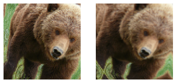

# Image Classification

# 图像分类

Now that you understand what deep learning is, what it's for, and how to create and deploy a model, it's time for us to go deeper! In an ideal world deep learning practitioners wouldn't have to know every detail of how things work under the hood… But as yet, we don't live in an ideal world. The truth is, to make your model really work, and work reliably, there are a lot of details you have to get right, and a lot of details that you have to check. This process requires being able to look inside your neural network as it trains, and as it make s predictions, find possible problems, and know how to fix them.

现在你理解了深度学习是什么，为了什么，且如何创建和部署一个模型，对我们来说是时候更深一步了！在理想的世界里深度学习行业者不需要知道事物深层次如何运作的所有细节...但到目前为止，我们并不是生活在一个理想的世界里。真像是，要使得你的模型真正的工作且可行，有太多的细节你必须正确处理，很多细节你需要检查。这一过程需要能够查看你所训练的神经网络内部，并在它做出预测后查找可能的问题，及要知道如何来修复它们。

So, from here on in the book we are going to do a deep dive into the mechanics of deep learning. What is the architecture of a computer vision model, an NLP model, a tabular model, and so on? How do you create an architecture that matches the needs of your particular domain? How do you get the best possible results from the training process? How do you make things faster? What do you have to change as your datasets change?

所以，在本书从现在开始，我们要深入了解深度学习的机理。计算机视觉、自然语言处理、表格等模型的架构是什么？你如何创建一个匹配你的特定领域所需要的架构？你如何通过训练处理得到一个可能最好的结果？你如何处理事物更快？当你的数据集改变了你需要做什么样的变化？

We will start by repeating the same basic applications that we looked at in the first chapter, but we are going to do two things:

- Make them better.
- Apply them to a wider variety of types of data.

我们将会通过重复相同的基础应用开始，这些我们在第一章节已经看到过了，但我们将要做两件事：

- 使它们更好。
- 应用它们在一个各类繁多的数据类型。

In order to do these two things, we will have to learn all of the pieces of the deep learning puzzle. This includes different types of layers, regularization methods, optimizers, how to put layers together into architectures, labeling techniques, and much more. We are not just going to dump all of these things on you, though; we will introduce them progressively as needed, to solve actual problems related to the projects we are working on.

为了做这两件事情，我们将必须学习深度学习拼图的所有部分。这包含层的不同类型，正则化方法，优化器，如果把层合并到架构里，标注技术，及更多的其它内容。然而，我们不会把所有的内容只是倾倒给你。我们会通过解决与我们正在工作的项目相关的实际问题，然后根据需要逐步的介绍他们，

## From Dogs and Cats to Pet Breeds

## 从猫狗到宠物品种

In our very first model we learned how to classify dogs versus cats. Just a few years ago this was considered a very challenging task—but today, it's far too easy! We will not be able to show you the nuances of training models with this problem, because we get a nearly perfect result without worrying about any of the details. But it turns out that the same dataset also allows us to work on a much more challenging problem: figuring out what breed of pet is shown in each image.

在我们最先的模型，我们学会了如何来分类狗和猫。仅仅在几年前这被认为是一项非常有挑战的任务，而然在今天，它太容易了！在这个问题上我们无法给你展示模型训练的细微差别。因为我们取得了近乎完美的结果，而不担心任何细节。但事实上同样的数据集也允许我们处理更多挑战性的问题：弄清楚显示在每张图像中的宠物品种是什么。

In <chapter_intro> we presented the applications as already-solved problems. But this is not how things work in real life. We start with some dataset that we know nothing about. We then have to figure out how it is put together, how to extract the data we need from it, and what that data looks like. For the rest of this book we will be showing you how to solve these problems in practice, including all of the intermediate steps necessary to understand the data that you are working with and test your modeling as you go.

在<章节：概述>里我们展示了作为所解决问题的应用。但是不是现实生活中事物的运作方式。我们从一些完全不了解的数据集开始。然后计算出如何把他们聚合在一起，如何从其中抽取我们所需要的数据，且数据看起来像什么。本书的剩余部分我们会呈现给你如何解决这些实践中的问题，包括所有必须的中间步骤来理解我们正在处理的数据并随时测试你的模型

We already downloaded the Pet dataset, and we can get a path to this dataset using the same code as in <chapter_intro>:

我们已经下载了宠物数据集，并我们能够利用与<章节：概述>中同样的代码来获取得这个数据集的路径：

```
from fastai.vision.all import *
path = untar_data(URLs.PETS)
```

Now if we are going to understand how to extract the breed of each pet from each image we're going to need to understand how this data is laid out. Such details of data layout are a vital piece of the deep learning puzzle. Data is usually provided in one of these two ways:

- Individual files representing items of data, such as text documents or images, possibly organized into folders or with filenames representing information about those items
- A table of data, such as in CSV format, where each row is an item which may include filenames providing a connection between the data in the table and data in other formats, such as text documents and images

现在如果我们要理解如何从每张图像中抽取每个宠物的种类，我们就需要理解这个数据框架是怎么的。如数据框架的细节是深度学习拼图中一个非常重要的部分。数据通常以如下两种方式中的其中一种来提供：

- 独立的文件代表数据项目，例如文本文档或图像，尽量分组到目录中或用文件名代表这些数据项目的信息
- 一个表格数据，例如CSV格式，每行是一个可以包含文件名的数据项，这把表格中的数据和以其它格式存放的数据（如文本文档和图像）做了关联

There are exceptions to these rules—particularly in domains such as genomics, where there can be binary database formats or even network streams—but overall the vast majority of the datasets you'll work with will use some combination of these two formats.

To see what is in our dataset we can use the `ls` method:

对于这些规则有一些例外，如基因组学等特定领域，在这些领域提供二进制化数据库格式，甚至会是网络流。但是总体来说绝大多数我们将要使用的数据集会使用这两种模型中的某种进行组装。

我们能够使用`ls`方法来查看我们的数据集里有什么：

```
#hide
Path.BASE_PATH = path
```

```
path.ls()
```

Out: (#3) [Path('annotations'),Path('images'),Path('models')]

We can see that this dataset provides us with *images* and *annotations* directories. The [website](https://www.robots.ox.ac.uk/~vgg/data/pets/) for the dataset tells us that the *annotations* directory contains information about where the pets are rather than what they are. In this chapter, we will be doing classification, not localization, which is to say that we care about what the pets are, not where they are. Therefore, we will ignore the *annotations* directory for now. So, let's have a look inside the *images* directory:

我们能够看到提供给我们这个数据集有*图像*和*释文*目录。对于数据集[网站](https://www.robots.ox.ac.uk/~vgg/data/pets/)告诉了我们*释文*目录所包含的信息是哪里的宠物而不是他们是什么。在本章节，我们会处理分类，不是本地化，也就是说我们关心宠物是什么，不是他们是哪里的。因而，从现在我们会忽略*释文*目录。所以，让我们看一下*图像*目录的内部：

```
(path/"images").ls()
```

Out: (#7394) [Path('images/great_pyrenees_173.jpg'),Path('images/wheaten_terrier_46.jpg'),Path('images/Ragdoll_262.jpg'),Path('images/german_shorthaired_3.jpg'),Path('images/american_bulldog_196.jpg'),Path('images/boxer_188.jpg'),Path('images/staffordshire_bull_terrier_173.jpg'),Path('images/basset_hound_71.jpg'),Path('images/staffordshire_bull_terrier_37.jpg'),Path('images/yorkshire_terrier_18.jpg')...]

Most functions and methods in fastai that return a collection use a class called `L`. `L` can be thought of as an enhanced version of the ordinary Python `list` type, with added conveniences for common operations. For instance, when we display an object of this class in a notebook it appears in the format shown there. The first thing that is shown is the number of items in the collection, prefixed with a `#`. You'll also see in the preceding output that the list is suffixed with an ellipsis. This means that only the first few items are displayed—which is a good thing, because we would not want more than 7,000 filenames on our screen!

在fastai中大多数函数和方法返回一个名为L的集合类。L 能够被认为原生Python `list`类型的增强版，对于普通操作增加了方便性。例如，当在我们一个笔记中展示这个类的对象时（它以上述所展示的格式呈现）。首先展示的是带有井号（ # ）前缀的集合中数据项的数值。你也会看到在先前输出中带有省略号（ ... ）的列表后缀。这意味着只有前部的少量数据项被显示，这是个好事情，因为我们不想在屏幕上看到七千多个文件名！

By examining these filenames, we can see how they appear to be structured. Each filename contains the pet breed, and then an underscore (`_`), a number, and finally the file extension. We need to create a piece of code that extracts the breed from a single `Path`. Jupyter notebooks make this easy, because we can gradually build up something that works, and then use it for the entire dataset. We do have to be careful to not make too many assumptions at this point. For instance, if you look carefully you may notice that some of the pet breeds contain multiple words, so we cannot simply break at the first `_` character that we find. To allow us to test our code, let's pick out one of these filenames:

通过审视这些文件名，我们会发现他们所展示的结构是怎么样的。每个文件名都包含了宠物的品种，然后是下划线（ _ ）及一个数字，最终是文件的扩展名。我们需要构建的代码是从这单一`路径`内抽取品种。Jupyter notebooks会让这一工作很容易，因为我们能够逐步的建立起运行代码，然后把它应用到整个数据集上。在这一点上我们必须小心不要做太多假设。例如，如果你仔细看你会注意到一些宠物品种包含多个词，我们不能用所发现的第一个下划线来简单的分离它。我们来测试一个代码，挑出这些文件里其中一个文件名：

```
fname = (path/"images").ls()[0]
```

The most powerful and flexible way to extract information from strings like this is to use a *regular expression*, also known as a *regex*. A regular expression is a special string, written in the regular expression language, which specifies a general rule for deciding if another string passes a test (i.e., "matches" the regular expression), and also possibly for plucking a particular part or parts out of that other string.

从字符串中抽取信息最强大和灵活的方法是正如这里所使用的*正则表达式*，也被称为*regex*。正则表达式是一种用正则表达语言编写的特殊字符串，用特定通用规则来决定其它字符串是否通过测试（即，“匹配”正则表达），也可以取出其它字符串中的一个或多个特定部分。

In this case, we need a regular expression that extracts the pet breed from the filename.

在这个例子中，我们用正则表达示从文件名中抽取宠物品种。

We do not have the space to give you a complete regular expression tutorial here, but there are many excellent ones online and we know that many of you will already be familiar with this wonderful tool. If you're not, that is totally fine—this is a great opportunity for you to rectify that! We find that regular expressions are one of the most useful tools in our programming toolkit, and many of our students tell us that this is one of the things they are most excited to learn about. So head over to Google and search for "regular expressions tutorial" now, and then come back here after you've had a good look around. The [book's website](https://book.fast.ai/) also provides a list of our favorites.

在这里我们没有时间给你一个完整的正则表达式的指导，但是有很多优秀的在线教程，并且我们知道对于其中的一些优秀的工具你已经熟知了。如果你不知道，完全没有关系，对你来说这是一个很好的修正机会！我们发现在我们程序工具箱里正则表达式是最有用的工具之一并且我们的很多学生告诉我们学习它是他们的最激动的事情之一。所以现在到谷歌并搜索“正则表达式指引”吧，然后充分看完后再返回到这里。[本书网站](https://book.fast.ai/) 也提供了我们收藏的列表。

> a: Not only are regular expressions dead handy, but they also have interesting roots. They are "regular" because they were originally examples of a "regular" language, the lowest rung within the Chomsky hierarchy, a grammar classification developed by linguist Noam Chomsky, who also wrote *Syntactic Structures*, the pioneering work searching for the formal grammar underlying human language. This is one of the charms of computing: it may be that the hammer you reach for every day in fact came from a spaceship.
>
> 亚：正则表达式不仅仅很好用，他们也有一个很有趣的词根。他们是“正则”，因为他们源于一种“正则”语言的例子，在乔姆斯基等级里它是最低等级，这个等级是由语言学家诺姆·乔姆斯基开发的一个语法分类，他也编写了*句法结构*，基于人类语言对于正式说法的先驱研究工作。这是极具魅力的计算之一：它可能是你每天要伸手去拿，而实际上来是自太空飞船的锤子。

When you are writing a regular expression, the best way to start is just to try it against one example at first. Let's use the `findall` method to try a regular expression against the filename of the `fname` object:

当你正在编写一个正式表达式时，首先依据一个例子进行尝试是最好的开始方法。让我们用`findall`方法来尝试一个正则表达式处理`fname`对象的文件名：

```
re.findall(r'(.+)_\d+.jpg$', fname.name)
```

Out: ['great_pyrenees']

This regular expression plucks out all the characters leading up to the last underscore character, as long as the subsequence characters are numerical digits and then the JPEG file extension.

只要后续字符是数字数值，再然后是JPEG扩展文件名，这个正则表达式就会摘出从开始直到最后一个下划线前的所有字符。

Now that we confirmed the regular expression works for the example, let's use it to label the whole dataset. fastai comes with many classes to help with labeling. For labeling with regular expressions, we can use the `RegexLabeller` class. In this example we use the data block API we saw in <chapter_production> (in fact, we nearly always use the data block API—it's so much more flexible than the simple factory methods we saw in <chapter_intro>):

现在根据这个例子，我们确认正则表达式起做用了，让我们用它来标注整个数据集。fastai提供了很多类来帮助处理标注。对于使用正则表达式做标注，我们能够用`RegexLabeller`类。在这个例子中，我们使用在<章节：产品>中看到的数据块API（实际上，我们几乎一直使用数据块API，它比我们在<章节：概述>中看到的简单工厂方法要灵活的多）：

```
pets = DataBlock(blocks = (ImageBlock, CategoryBlock),
                 get_items=get_image_files, 
                 splitter=RandomSplitter(seed=42),
                 get_y=using_attr(RegexLabeller(r'(.+)_\d+.jpg$'), 'name'),
                 item_tfms=Resize(460),
                 batch_tfms=aug_transforms(size=224, min_scale=0.75))
dls = pets.dataloaders(path/"images")
```

One important piece of this `DataBlock` call that we haven't seen before is in these two lines:

`DataBlock`一个重要调用部分的两行代码，我们之前没有看到过：

```python
item_tfms=Resize(460),
batch_tfms=aug_transforms(size=224, min_scale=0.75)
```

These lines implement a fastai data augmentation strategy which we call *presizing*. Presizing is a particular way to do image augmentation that is designed to minimize data destruction while maintaining good performance.

这些代码行执行的是一个fastai数据增强策略，我们称为*填孔处理*。填孔处理是一个处理图像扩展的特定方法，这个设计用来当维持好的性能时最小化数据破坏。

## Presizing

## 填孔处理

We need our images to have the same dimensions, so that they can collate into tensors to be passed to the GPU. We also want to minimize the number of distinct augmentation computations we perform. The performance requirement suggests that we should, where possible, compose our augmentation transforms into fewer transforms (to reduce the number of computations and the number of lossy operations) and transform the images into uniform sizes (for more efficient processing on the GPU).

我们需要图像有相同的维度，所以他们就能够整理到张量中传递给GPU。我们也希望最小化我们执行的不同增强计算的数量。性能需求建议下我们应该尽可能压缩我们的增强转换组成为更少的转换（压缩计算数量和有损操作数量）并转换图像为相同尺寸（在GPU上更有效的处理）。

The challenge is that, if performed after resizing down to the augmented size, various common data augmentation transforms might introduce spurious empty zones, degrade data, or both. For instance, rotating an image by 45 degrees fills corner regions of the new bounds with emptiness, which will not teach the model anything. Many rotation and zooming operations will require interpolating to create pixels. These interpolated pixels are derived from the original image data but are still of lower quality.

这样做的挑战是，如果调整尺寸到增强尺寸后执行，很多常见的增强转换会导致虚假的空域，或数据质量退化，或同时出现这两种问题。例如， 通过45度转换一张图片，填充新的空白边界的角区域，不会教会模型任何东西。很多转换和缩放操作会需要插值来创建像素。这些插值像素是从原始图像数据衍生得来的，但依然质量是很低的。

To work around these challenges, presizing adopts two strategies that are shown in <presizing>:

1. Resize images to relatively "large" dimensions—that is, dimensions significantly larger than the target training dimensions.
2. Compose all of the common augmentation operations (including a resize to the final target size) into one, and perform the combined operation on the GPU only once at the end of processing, rather than performing the operations individually and interpolating multiple times.

来处理这些挑战，填孔处理采用了两个策略，这些策略<训练集上的填孔处理>上有所展示：

1. 调整图像到相对应的“大”量度，即，量度比目标训练维度明显更大。
2. 组合所有常见增强操作（包括调整到最终的目标尺寸）为一步，并在最终处理时，GPU上只执行组合操作一次，而不是独立的执行各操作及插值多次。

The first step, the resize, creates images large enough that they have spare margin to allow further augmentation transforms on their inner regions without creating empty zones. This transformation works by resizing to a square, using a large crop size. On the training set, the crop area is chosen randomly, and the size of the crop is selected to cover the entire width or height of the image, whichever is smaller.

调整大小的第一步，创建足够大的图像，他们有备用边缘以允许未来在内部区域增强转换，而不会产生空域。这一转换工作通过利用大剪切尺寸来调整图像尺寸为正方形。在训练集上，剪切面积是随机选择的，且剪切的尺寸是通过覆盖整个图像的宽或高，以最小者为准进行选定的。

In the second step, the GPU is used for all data augmentation, and all of the potentially destructive operations are done together, with a single interpolation at the end.

在第二步，GPU用于对所有数据增强，且所有潜在的破坏操作一起完成，并最终用一次插值。

<div style="text-align:center">
  <p align="center">
    
  </p>
  <p align="center">图：训练集上的填孔处理</p>
</div>

This picture shows the two steps:

1. *Crop full width or height*: This is in `item_tfms`, so it's applied to each individual image before it is copied to the GPU. It's used to ensure all images are the same size. On the training set, the crop area is chosen randomly. On the validation set, the center square of the image is always chosen.
2. *Random crop and augment*: This is in `batch_tfms`, so it's applied to a batch all at once on the GPU, which means it's fast. On the validation set, only the resize to the final size needed for the model is done here. On the training set, the random crop and any other augmentations are done first.

这张图像展示了两个步骤：

1. *宽或高全尺寸剪切* ：这个步骤在`item_tfms`中，所以在剪切到GPU前它用于每张独立的图像。它用于确保所有图像是相同的尺寸。在训练集上，剪切面积是随机选择的。在验证集上一直选择的是图像中心区域。
2. *随机剪切和增强* ：这个步骤在`batch_tfms`中，所以它立刻用于GPU上的一个批次，这意味着它很快。在验证集上，仅仅调整到模型最终所需要的大小。在训练集上，随机剪切和任何其它增强是首要做的。

To implement this process in fastai you use `Resize` as an item transform with a large size, and `RandomResizedCrop` as a batch transform with a smaller size. `RandomResizedCrop` will be added for you if you include the `min_scale` parameter in your `aug_transforms` function, as was done in the `DataBlock` call in the previous section. Alternatively, you can use `pad` or `squish` instead of `crop` (the default) for the initial `Resize`.

在fastai中来实施这一过程，我们用`Resize`做为对一个大尺寸的图像项转换，`RandomResizedCrop`作为一个更小尺寸的批次转换。如果在你的`aug_transforms`函数中包含了`min_scale`参数，会为你添加`RandomResizedCrop`，正如在前一部分`DataBlock`中调用的那样。或者，对于最初的`Resize`你能够使用`pad`或`squish`替代`crop`（默认）。

<interpolations> shows the difference between an image that has been zoomed, interpolated, rotated, and then interpolated again (which is the approach used by all other deep learning libraries), shown here on the right, and an image that has been zoomed and rotated as one operation and then interpolated just once on the left (the fastai approach), shown here on the left.

<interpolations>代码展示了他们的差异，一张图像被放大、插值、旋转，然后再次插值（所有其它深度学习库所使用的方法）被展示在右侧，及一张图像放大和旋转做为一次操作然后只是插值一次（这是fastai方法）被展示在左侧。

```
#hide_input
#id interpolations
#caption A comparison of fastai's data augmentation strategy (left) and the traditional approach (right).
dblock1 = DataBlock(blocks=(ImageBlock(), CategoryBlock()),
                   get_y=parent_label,
                   item_tfms=Resize(460))
dls1 = dblock1.dataloaders([(Path.cwd()/'images'/'grizzly.jpg')]*100, bs=8)
dls1.train.get_idxs = lambda: Inf.ones
x,y = dls1.valid.one_batch()
_,axs = subplots(1, 2)

x1 = TensorImage(x.clone())
x1 = x1.affine_coord(sz=224)
x1 = x1.rotate(draw=30, p=1.)
x1 = x1.zoom(draw=1.2, p=1.)
x1 = x1.warp(draw_x=-0.2, draw_y=0.2, p=1.)

tfms = setup_aug_tfms([Rotate(draw=30, p=1, size=224), Zoom(draw=1.2, p=1., size=224),
                       Warp(draw_x=-0.2, draw_y=0.2, p=1., size=224)])
x = Pipeline(tfms)(x)
#x.affine_coord(coord_tfm=coord_tfm, sz=size, mode=mode, pad_mode=pad_mode)
TensorImage(x[0]).show(ctx=axs[0])
TensorImage(x1[0]).show(ctx=axs[1]);
```

Out:

You can see that the image on the right is less well defined and has reflection padding artifacts in the bottom-left corner; also, the grass iat the top left has disappeared entirely. We find that in practice using presizing significantly improves the accuracy of models, and often results in speedups too.

你能够看到右侧的图像不是很好，且在左下角反映出人工填充痕迹，并且图像左上角的青草完全消失不见了。在实践中我们发现，使用填孔处理可极大的改善模型精度，且通常也会加快速度。

The fastai library also provides simple ways to check your data looks right before training a model, which is an extremely important step. We'll look at those next.

fastai库提供了一些简单方法，在训练模型前来检查你的数据看起来是否正确，这是异常重要的步骤。后续我们会看到这些方法。

### Checking and Debugging a DataBlock

### 检查并调试一个DataBlock

We can never just assume that our code is working perfectly. Writing a `DataBlock` is just like writing a blueprint. You will get an error message if you have a syntax error somewhere in your code, but you have no guarantee that your template is going to work on your data source as you intend. So, before training a model you should always check your data. You can do this using the `show_batch` method:

永远不能假定我们的代码会完美的运行。编写一个`DataBlock`只是就像写一个规划。如果在你的代码中的某个地方有语法错误你会收到错误消息，但你不能保证你的模板会如你计划的那样在你的数据资源上运行。所以，开始训练一个模型前，你应该一直检查你的数据。你可以用`show_batch`方法来进行检查：

```
dls.show_batch(nrows=1, ncols=3)
```

Out: 

Take a look at each image, and check that each one seems to have the correct label for that breed of pet. Often, data scientists work with data with which they are not as familiar as domain experts may be: for instance, I actually don't know what a lot of these pet breeds are. Since I am not an expert on pet breeds, I would use Google images at this point to search for a few of these breeds, and make sure the images look similar to what I see in this output.

看一下每一张图像，并检查每张图像是否有正确的宠物品种标注。通常，数据科学家处理的数据，他们可能并会与领域专家一样熟悉：例如，我实际上并不知道这些宠物品种是什么。因为我不是一个宠物品种专家，在这一点上我也许会用谷歌图片来搜索一些这些品种，并确保在输出时与我们看到这些图像看起来是相似的。

If you made a mistake while building your `DataBlock`, it is very likely you won't see it before this step. To debug this, we encourage you to use the `summary` method. It will attempt to create a batch from the source you give it, with a lot of details. Also, if it fails, you will see exactly at which point the error happens, and the library will try to give you some help. For instance, one common mistake is to forget to use a `Resize` transform, so you end up with pictures of different sizes and are not able to batch them. Here is what the summary would look like in that case (note that the exact text may have changed since the time of writing, but it will give you an idea):

如果在创建你的`DataBlock`时你犯了一个错误，在这一步这前你极有可能不会看到它。来调试一下，我们鼓励你使用`summary`方法。它会尝试从你给定的资源上创建一个批次，并带有很多细节。此外，如果它失败了，你会准确的看到哪个点产生了错误，并且库会尝试给你一些帮助。例如，一个常发生的错误是会忘记使用一个`Resize`转换，所以最终你会用不同尺寸的图像且无法批处理它们。在本下例中summary可能看起来是这样的（注解：由于编写时间原因，准确的文字描述可能发生了变化，但它会给你一个启示）：

```python
#hide_output
pets1 = DataBlock(blocks = (ImageBlock, CategoryBlock),
                 get_items=get_image_files, 
                 splitter=RandomSplitter(seed=42),
                 get_y=using_attr(RegexLabeller(r'(.+)_\d+.jpg$'), 'name'))
pets1.summary(path/"images")
```

 ```python
Setting-up type transforms pipelines
Collecting items from /Users/Y.H/.fastai/data/oxford-iiit-pet/images
Found 7390 items
2 datasets of sizes 5912,1478
Setting up Pipeline: PILBase.create
Setting up Pipeline: partial -> Categorize -- {'vocab': None, 'add_na': False}

Building one sample
  Pipeline: PILBase.create
    starting from
      /Users/Y.H/.fastai/data/oxford-iiit-pet/images/saint_bernard_60.jpg
    applying PILBase.create gives
      PILImage mode=RGB size=375x500
  Pipeline: partial -> Categorize -- {'vocab': (#37) ['Abyssinian','Bengal','Birman','Bombay','British_Shorthair','Egyptian_Mau','Maine_Coon','Persian','Ragdoll','Russian_Blue'...], 'add_na': False}
    starting from
      /Users/Y.H/.fastai/data/oxford-iiit-pet/images/saint_bernard_60.jpg
    applying partial gives
      saint_bernard
    applying Categorize -- {'vocab': (#37) ['Abyssinian','Bengal','Birman','Bombay','British_Shorthair','Egyptian_Mau','Maine_Coon','Persian','Ragdoll','Russian_Blue'...], 'add_na': False} gives
      TensorCategory(30)

Final sample: (PILImage mode=RGB size=375x500, TensorCategory(30))

Setting up after_item: Pipeline: ToTensor
Setting up before_batch: Pipeline: 
Setting up after_batch: Pipeline: IntToFloatTensor -- {'div': 255.0, 'div_mask': 1}

Building one batch
Applying item_tfms to the first sample:
  Pipeline: ToTensor
    starting from
      (PILImage mode=RGB size=375x500, TensorCategory(30))
    applying ToTensor gives
      (TensorImage of size 3x500x375, TensorCategory(30))

Adding the next 3 samples

No before_batch transform to apply

Collating items in a batch
Error! It's not possible to collate your items in a batch
Could not collate the 0-th members of your tuples because got the following shapes
torch.Size([3, 500, 375]),torch.Size([3, 333, 500]),torch.Size([3, 352, 500]),torch.Size([3, 500, 354])
 ```

You can see exactly how we gathered the data and split it, how we went from a filename to a *sample* (the tuple (image, category)), then what item transforms were applied and how it failed to collate those samples in a batch (because of the different shapes).

你能够准确的看到我们怎样收集数据并分割它，我们希望怎样从一个文件名到一个*样本*（元组（图像，分类）），然后数据项转换应用用它收集那些在一个批次中的样本是如何失败的（因为形状的不同）。

Once you think your data looks right, we generally recommend the next step should be using to train a simple model. We often see people put off the training of an actual model for far too long. As a result, they don't actually find out what their baseline results look like. Perhaps your probem doesn't need lots of fancy domain-specific engineering. Or perhaps the data doesn't seem to train the model all. These are things that you want to know as soon as possible. For this initial test, we'll use the same simple model that we used in <chapter_intro>:

一旦你认为你的数据看起来是好的，通常我们建议接下来的步骤应该是用来训练一个简单的模型。我们经常看到人们被一个实际训练的模型拖延太久了。这导致他们并不能实际找出他们基线结果是什么样子。也许你的问题并不是需要太多花哨的特定领域工程。或者也许数据似乎不能全部来训练模型。这些事情你知道的越快越好。对于这个初始测试，我们会用在<章节：概述>中使用过的，同样简单的模型：

```
learn = cnn_learner(dls, resnet34, metrics=error_rate)
learn.fine_tune(2)
```

| epoch | train_loss | valid_loss | error_rate |  time |
| ----: | ---------: | ---------: | ---------: | ----: |
|     0 |   1.551305 |   0.322132 |   0.106225 | 00:19 |

| epoch | train_loss | valid_loss | error_rate |  time |
| ----: | ---------: | ---------: | ---------: | ----: |
|     0 |   0.529473 |   0.312148 |   0.095399 | 00:23 |
|     1 |   0.330207 |   0.245883 |   0.080514 | 00:24 |

As we've briefly discussed before, the table shown when we fit a model shows us the results after each epoch of training. Remember, an epoch is one complete pass through all of the images in the data. The columns shown are the average loss over the items of the training set, the loss on the validation set, and any metrics that we requested—in this case, the error rate.

正如我们之前做过的简短讨论，当我们拟合一个模型时每个周期训练后展示给我们如表格中显示的结果。记住，一个周期是完整遍历数据中所有的图像一个过程。列展示的是训练集数据项的平均损失，验证集上的损失，以及在本例中我们需要的那些指标：错误率。

Remember that *loss* is whatever function we've decided to use to optimize the parameters of our model. But we haven't actually told fastai what loss function we want to use. So what is it doing? fastai will generally try to select an appropriate loss function based on what kind of data and model you are using. In this case we have image data and a categorical outcome, so fastai will default to using *cross-entropy loss*.

记住*损失*是我们已经决定用于来优化我们模型参数的那种函数。但实际上我们并没有告诉fastai我们想用损失函数。那么它做了什么？fastai通常会基于数据类型和你所使用的模型，尝试选择一个合适的损失函数。在这个例子中，我们有图像数据和一个分类输出，所以fastai会默认使用*交叉熵损失函数*（即 *cross-entropy loss*）。

## Cross-Entropy Loss

## 交叉熵损失函数

*Cross-entropy loss* is a loss function that is similar to the one we used in the previous chapter, but (as we'll see) has two benefits:

- It works even when our dependent variable has more than two categories.
- It results in faster and more reliable training.

在之前的章节我们使用过一种损失函数，*交叉熵损失函数*与它相似，但（正如我们会看到的）有两个好处：

- 即使当我们的因变量有超过两个类别时它也可以工作。
- 其结果是更快和更可靠的训练。

In order to understand how cross-entropy loss works for dependent variables with more than two categories, we first have to understand what the actual data and activations that are seen by the loss function look like.

为了理解超过两个类别的因变量交叉熵损失函数如何工作的，我们首先必须要理解通过损失函数看到的真实数据和激活的情况。

### Viewing Activations and Labels

### 观察激活和标注

Let's take a look at the activations of our model. To actually get a batch of real data from our `DataLoaders`, we can use the `one_batch` method:

让我们看一下我们模型的激活。来自我们的`DataLoaders`实际取得的一个批次真实数据，我们可以使用`one_batch`方法：

```
x,y = dls.one_batch()
```

As you see, this returns the dependent and independent variables, as a mini-batch. Let's see what is actually contained in our dependent variable:

正如你看到的，这返回的是一个最小批次的因变量和自变量。让我们看一下在因变量里实际包含了什么：

```
y
```

Out:$\begin{matrix}TensorCategory([& 0,  &5,& 23,& 36,&  5, &20, &29, &34, &33,& 32,& 31,\\
 &24, &12, &36,&  8,& 26, &30, & 2,& 12,& 17,&  7,& 23, \\
&12,& 29, &21, & 4, &35,& 33, & 0, &20, &26,& 30, & 3, \\
& 6, &36, & 2, &17, &32,& 11, & 6, & 3, &30, & 5,& 26,\\
& 26,& 29,&  7,& 36,&31,& 26,& 26, & 8, &13,& 30,& 11,  \end{matrix}\\
\begin{matrix}&&&&&&&&&12, &36,& 31, &34,& 20,& 15,&  8, & 8,& 23&], device='cuda:5') \end{matrix}$

Our batch size is 64, so we have 64 rows in this tensor. Each row is a single integer between 0 and 36, representing our 37 possible pet breeds. We can view the predictions (that is, the activations of the final layer of our neural network) using `Learner.get_preds`. This function either takes a dataset index (0 for train and 1 for valid) or an iterator of batches. Thus, we can pass it a simple list with our batch to get our predictions. It returns predictions and targets by default, but since we already have the targets, we can effectively ignore them by assigning to the special variable `_`:

我们批处理尺寸大小是64，所以在这个张量里我们有64行。每一行是介于从0到36之间的整数，代表了我们37个可能宠物品种。我们能够用`Learner.get_preds`来观察预测情况（即我们的神经网络最后一层的激活）。这个函数要么接受一个数据集的索引（0代表训练，1代表验证）要么接受批次的迭代器。因而，我们能够传递给它一个包含我们批次的简单列表来得到我们的预测。它默认会返回预测和目标，但因为我们已经有了目标，我们能够通过分配一个特定变量`_`来有效的忽略它们：

```
preds,_ = learn.get_preds(dl=[(x,y)])
preds[0]
```

Out: $\begin{matrix}tensor([
&9.9911e-01,& 5.0433e-05, &3.7515e-07, &8.8590e-07, &8.1794e-05,& 1.8991e-05, &9.9280e-06, \\
&5.4656e-07, &6.7920e-06, &2.3486e-04, &3.7872e-04, &2.0796e-05,& 4.0443e-07,& 1.6933e-07, \\
&2.0502e-07, &3.1354e-08,&9.4115e-08, &2.9782e-06,& 2.0243e-07,& 8.5262e-08, &1.0900e-07,\\
 &1.0175e-07, &4.4780e-09,& 1.4285e-07, &1.0718e-07, &8.1411e-07, &3.6618e-07,& 4.0950e-07, \\
&3.8525e-08, &2.3660e-07, &5.3747e-08, &2.5448e-07,&6.5860e-08,& 8.0937e-05, &2.7464e-07,\\
 &5.6760e-07,& 1.5462e-08 ]) \end{matrix}$

The actual predictions are 37 probabilities between 0 and 1, which add up to 1 in total:

实际预测是37个从0到1之间的概率，他们合计为1：

```
len(preds[0]),preds[0].sum()
```

Out: (37, tensor(1.0000))

To transform the activations of our model into predictions like this, we used something called the *softmax* activation function.

转换我们模型的激活为像这样的预测，我们使用了叫做*softmax*的激活函数。

### Softmax

### Softmax激活函数

In our classification model, we use the softmax activation function in the final layer to ensure that the activations are all between 0 and 1, and that they sum to 1.

Softmax is similar to the sigmoid function, which we saw earlier. As a reminder sigmoid looks like this:

在我们的分类模型中，我们在最后的层使用softmax激活函数以确保激活都处于从0到1之间，且它们的合计为1.

Softmax与我们早先看到的S函数类似。提醒一下S函数看起来像这个样子：

```
plot_function(torch.sigmoid, min=-4,max=4)
```

Out: ![img](data:image/png;base64,iVBORw0KGgoAAAANSUhEUgAAAXcAAAD7CAYAAACRxdTpAAAABHNCSVQICAgIfAhkiAAAAAlwSFlzAAALEgAACxIB0t1+/AAAADh0RVh0U29mdHdhcmUAbWF0cGxvdGxpYiB2ZXJzaW9uMy4xLjEsIGh0dHA6Ly9tYXRwbG90bGliLm9yZy8QZhcZAAAgAElEQVR4nO3deXiV5Z3/8fcXCCQkJEAIYd9BNg1IBEHRtmpdplYdbLUq7rWgtrZO/dXqaNW206mdjh2trTpFccO14saorVoVl1HCEiEsYQ9bSCBk35Pv74+EThqDOUCS55yTz+u6znVxntzBj+GcDw/3c5/7MXdHRESiS5egA4iISNtTuYuIRCGVu4hIFFK5i4hEIZW7iEgU6hZ0AIB+/fr5iBEjgo4hIhJRli9fvs/dU1r6WliU+4gRI8jIyAg6hohIRDGz7Yf6mqZlRESiUEjlbmY3mlmGmVWZ2cJWxv7IzHLNrMjMHjWzHm2SVEREQhbqmftu4BfAo182yMzOBG4FTgNGAKOAu48in4iIHIGQyt3dX3L3l4H9rQy9Aljg7lnufgD4OXDl0UUUEZHD1dZz7pOAzCbPM4FUM0tu4/+OiIh8ibYu9wSgqMnzg7/u1XygmV3XOI+fkZ+f38YxREQ6t7Yu91Igscnzg78uaT7Q3R9x93R3T09JaXGZpoiIHKG2XueeBaQBzzc+TwP2untrc/UiIlHN3Skoqya3uJK84irySirZW1zF1GG9mT227U9wQyp3M+vWOLYr0NXMYoFad69tNvQJYKGZPQ3sAf4VWNh2cUVEwlN1bT27CivYeaCcnQcq2HWggt2FFewqrGBPUSW5xZVU19Z/4fvmf2V0cOVOQ0n/rMnzy4C7zexRYC0w0d1z3P1NM7sX+BsQB/y52feJiESsmrp6cgrK2ZJfxtZ9pWzdV862fWXkFJSzp6iC+ib3PuraxRiQGMug3rFMGdqbgb1jGZDY8OifGEv/Xj1I6dWD2Jiu7ZLVwuFOTOnp6a7tB0QkXNTVO1v3lbI+t4TsvaVs3FvCxrxStu8vo6bu/zqzT88YRvSLZ3jfngxLjmdY354M7RPHkL49Se3Vg25d23cTADNb7u7pLX0tLPaWEREJSmVNHRtyS1i9q4is3UVk7S5mQ24JVY1TKF0MhifHM6Z/AmdMTGVMSgKjUuIZ1S+BpJ4xAac/NJW7iHQa7k5OQTnLtx9gZU4hmTsLWben+O9n40lxMUwalMjcE4czYWAi4wf2YnRKQrtNnbQnlbuIRK36emddbjGfbings60FZGw/wL7SKgDiu3fluCG9uXb2KI4bnMTkwUkM6ROHmQWcum2o3EUkqmzbV8aHm/bx0aZ9fLx5P0UVNQAM6RPH7LH9mDa8D+kj+jC2fy+6domOIm+Jyl1EIlplTR2fbN7PexvyeC87n+37ywEYlBTL1yemMnN0MjNGJTO4d1zASTuWyl1EIk5heTV/XbuXt9ft5YPsfVTU1BEb04VZo/txzckjmT02hRHJPaNmiuVIqNxFJCIcKKvmzaxc/mf1Hj7ZvJ/aemdgUiwXThvCaRP6c+Ko5Ii88NleVO4iErYqquv4y9pcXl21m/ez86mtd4Yn9+S7p4zi7MkDOHZwUqc+O/8yKncRCSvuzoqcA7y4fCevZ+6hpKqWAYmxXH3ySL6ZNohJgxJV6CFQuYtIWCgqr+HPK3ay6LMcNuWVEhfTlXOOHcicaYM5cWQyXaJ4ZUt7ULmLSKDW7i5m4cdbeWXVbqpq60kb2pt75xzHOccNJKGHKupI6ScnIh2uvt55e91eFny4lU+3FhAb04V/Pn4Il504jEmDkoKOFxVU7iLSYapq63h55S4e/mALW/LLGNw7jtvOGc9F6cPCep+WSKRyF5F2V1lTx7Of5fDQ+1vILa5k0qBE7v/OVM6ZPKDdd07srFTuItJuKmvqePrTHB56fzP5JVVMH9mX33zrOE4e008rXtqZyl1E2lxtXT0vLt/Jf72zkT1FlcwancwD35nKiaOSg47WaajcRaTNuDtvr8vjV2+sY0t+GVOG9ua330pj1ph+QUfrdFTuItIm1uwq4uevr+XTrQWMSonnkbnTOGNiqqZfAqJyF5GjUlBWzW/e2sCzy3Lo07M7Pz9vEhdPH0aMLpQGSuUuIkekvt5Z9FkOv3lrA6VVtVw1ayQ/PGMsibFa0hgOVO4ictjW5xbz05dWszKnkJmjkrn7vEmMS+0VdCxpQuUuIiGrrKnj/nc28sgHW0iMi+G+i9I4f8pgzauHIZW7iIRkZc4BbnnxczbllXLhtCHcfs4E+sR3DzqWHILKXUS+VFVtHff9dSOPfLCZ1MRYHr96OqeOSwk6lrRC5S4ih5S9t4Sbnl3Fuj3FXJQ+lNu/MUEXTCOEyl1EvsDdefzjbfzqjfUk9OjGny5P5/SJqUHHksOgcheRf1BYXs2PX/ict9ft5avHpHDvhWmk9OoRdCw5TCp3Efm75dsP8INnVpJXUskd35jI1SeN0EqYCKVyFxHcncc+2sa//c86BvaO5cV5s0gb2jvoWHIUVO4inVx5dS0/fWk1r6zazekTUvntt9NIitNF00inchfpxHL2l3Pdkxls2FvCLWcew/xTR+tG1FEipJ19zKyvmS02szIz225mlxxiXA8ze8jM9ppZgZm9ZmaD2zayiLSFTzbv57wHP2RPUSULr5rODV8do2KPIqFu2/YgUA2kApcCfzSzSS2MuwmYCRwHDAIKgQfaIKeItKFFn+Ywd8GnJCf04JUbTtKHkqJQq+VuZvHAHOAOdy919w+BV4G5LQwfCbzl7nvdvRJ4FmjpLwERCUBdvfPz19dy2+LVnDy2Hy9dP4sR/eKDjiXtIJQ593FAnbtnNzmWCZzawtgFwH+Z2cGz9kuBN446pYgctYrqOn743EreytrLlbNGcMc3JtJV0zBRK5RyTwCKmh0rAlra3zMbyAF2AXXAauDGln5TM7sOuA5g2LBhIcYVkSOxv7SKax7PIHNnIXd+YyJXnzwy6EjSzkKZcy8FEpsdSwRKWhj7RyAWSAbigZc4xJm7uz/i7ununp6Sovk+kfayo6CcCx/6hPW5xTx02TQVeycRSrlnA93MbGyTY2lAVgtj04CF7l7g7lU0XEydbma6O65IANbtKWbOHz+moKyap6+dwZmTBgQdSTpIq+Xu7mU0nIHfY2bxZnYScB7wZAvDlwGXm1mSmcUA1wO73X1fW4YWkdYt21bAtx/+hC5mvDBvJtOG9w06knSgUJdCXg/EAXnAM8B8d88ys9lmVtpk3I+BSmAjkA+cA1zQhnlFJARLN+Yzd8GnpCT04MX5M3ULvE4opE+ounsBcH4Lx5fScMH14PP9NKyQEZGA/CUrlxsXrWRUSjxPXjNDOzp2Utp+QCSKvJa5mx8+t4rJg5N4/KoT6N1Tt8HrrFTuIlHilVW7+NFzq0gf3pcFV6bTS3dM6tRU7iJR4OWVu7j5+VWcMKIvj155AvE99Nbu7PQKEIlwB4t9+siGYu/ZXW9rUbmLRLQln+/h5udXMWNkMo9eeQJx3bsGHUnCRKhLIUUkzPwlK5ebnl3J8cP6sODKdBW7/AOVu0gEej87nxsXrWTS4CQeu0pTMfJFKneRCJOxrYDvPZnB6P4JPHHVdK2KkRap3EUiyNrdxVy1cBmDkuJ48prpJPVUsUvLVO4iEWLrvjIuf/QzEnp048lrZ9AvQZ88lUNTuYtEgLziSuYu+JR6d568ZgaDe8cFHUnCnMpdJMwVV9ZwxWPLKCirZuFVJzCmf0Lr3ySdnspdJIxV1dYx78nlbNxbwkOXTeO4Ib2DjiQRQuunRMJUfb3z4xc+5+PN+7nvojROGac7lknodOYuEqZ+/dZ6Xsvcza1nj+eCqUOCjiMRRuUuEoae+t/tPPz+Fi47cRjfO2VU0HEkAqncRcLMu+v3cucra/ja+P7cde4kzCzoSBKBVO4iYWTt7mJuXLSSiYMSeeA7U+nWVW9ROTJ65YiEibziSq59fBlJcTEsuEJ7ssvR0atHJAxUVNfx3ScyKKyo4YV5M0lNjA06kkQ4lbtIwBqWPGby+a4iHr5sGpMGJQUdSaKApmVEAnb/uxtZsnoPt541nq9PGhB0HIkSKneRAL2xeg+/e3sjc44fwnVa8ihtSOUuEpCs3UXc/HwmU4f15pcXTNaSR2lTKneRAOwrreK6J5bTu2cMD8+dRmyMbpEnbUsXVEU6WE1dPTc8vYJ9pVW8OG8W/XtpZYy0PZW7SAf75ZJ1fLq1gPsuSuPYIVoZI+1D0zIiHeiFjB0s/Hgb15w8UpuBSbtSuYt0kM93FnL7y2uYNTqZn549Pug4EuVU7iIdYH9pFfOeXE5KQg9+f8nx2jNG2p3m3EXaWW1dPT94diX7yqr587xZ9I3vHnQk6QRCOn0ws75mttjMysxsu5ld8iVjjzezD8ys1Mz2mtlNbRdXJPL8x1+y+WjTfn5x/mRdQJUOE+qZ+4NANZAKTAGWmFmmu2c1HWRm/YA3gR8BLwLdAV01kk7rzTW5PPT+Zi6ZMYxvpw8NOo50Iq2euZtZPDAHuMPdS939Q+BVYG4Lw28G3nL3p929yt1L3H1d20YWiQxb8kv58QuZpA3tzc/OnRh0HOlkQpmWGQfUuXt2k2OZwKQWxp4IFJjZx2aWZ2avmdmwtggqEknKq2uZ/9QKYroaf7j0eHp00ydQpWOFUu4JQFGzY0VArxbGDgGuAG4ChgFbgWda+k3N7DozyzCzjPz8/NATi4Q5d+f2xWvIzivhdxdPZXDvuKAjSScUSrmXAonNjiUCJS2MrQAWu/syd68E7gZmmdkXriK5+yPunu7u6SkpKYebWyRsPf1pDotX7uKHp43j1HF6bUswQin3bKCbmY1tciwNyGph7OeAN3l+8Nfa7k46hdU7i7jntbWcMi6F739tTNBxpBNrtdzdvQx4CbjHzOLN7CTgPODJFoY/BlxgZlPMLAa4A/jQ3QvbMrRIOCoqr+H6RctJTujO7y6aQpcuOqeR4IT6MbnrgTggj4Y59PnunmVms82s9OAgd38XuA1Y0jh2DHDINfEi0cLd+fGLmewprOT3lxyvDypJ4EJa5+7uBcD5LRxfSsMF16bH/gj8sU3SiUSIPy3dyl/X7uWOb0xk2vA+QccR0d4yIkdr+fYD/PrN9Zw1aQBXnzQi6DgigMpd5KgcKKvm+4tWMLB3LL++8DjdKk/ChjYOEzlC9fXOv7yQyb7Sav48fxZJcTFBRxL5O525ixyh/166hXfX53H7P03QhmASdlTuIkdg+fYC7n1rA+ccO4DLZw4POo7IF6jcRQ5Twzz7Sgb3juPf52ieXcKT5txFDoO78+Mm8+yJsZpnl/CkM3eRw/CnpVt5Z30et50zXvPsEtZU7iIhWpnTsJ79zEmpXDFrRNBxRL6Uyl0kBEXlNdy4aCUDkmK598I0zbNL2NOcu0gr3J2f/Plz9hZX8sK8mVrPLhFBZ+4irXjik+28mZXLT84az9Rh2jdGIoPKXeRLrNlVxC+XrONr4/tz7eyRQccRCZnKXeQQSipruHHRCpITuvPbb2meXSKL5txFWuDu3LZ4DTsOVPDsdSfSR/uzS4TRmbtIC55btoPXMndz8xnjOGFE36DjiBw2lbtIMxtyS/jZq1mcPKYf808dHXQckSOichdpory6lhsWraBXbAz36T6oEsE05y7SxJ2vZLE5v5SnrplBSq8eQccROWI6cxdp9OflO3lx+U6+/7WxnDSmX9BxRI6Kyl0E2JRXwr++vIbpI/ty02ljg44jctRU7tLpVVTXccPTK4nr3pX7L55KV82zSxTQnLt0ene9msWGvSU8fvV0BiTFBh1HpE3ozF06tZdX7uK5jB1c/5XRnDouJeg4Im1G5S6d1qa8Um5bvJoTRvTh5jPGBR1HpE2p3KVTaphnX0FsTFfu/85UunXVW0Gii+bcpVM6OM++8KoTGJgUF3QckTan0xXpdF5asZPnMnZww1dH85Vj+gcdR6RdqNylU9m4t4TbFzesZ//R6Zpnl+ilcpdOo6yqlvlPryC+R1d+r3l2iXKac5dOwd25ffFqtjTuG9M/UevZJbqFdOpiZn3NbLGZlZnZdjO7pJXx3c1svZntbJuYIkdn0Wc5vLxqNz86fRyztG+MdAKhnrk/CFQDqcAUYImZZbp71iHG3wLkAQlHH1Hk6Hy+s5C7X13LqeNSuOGrY4KOI9IhWj1zN7N4YA5wh7uXuvuHwKvA3EOMHwlcBvyqLYOKHInC8mrmP7WClF49tD+7dCqhTMuMA+rcPbvJsUxg0iHGPwDcBlQcZTaRo1Jf7/zwuVXkl1Txh0uPp6/ugyqdSCjlngAUNTtWBPRqPtDMLgC6ufvi1n5TM7vOzDLMLCM/Pz+ksCKH44F3N/HehnzuPHciaUN7Bx1HpEOFUu6lQGKzY4lASdMDjdM39wLfD+U/7O6PuHu6u6enpGjDJmlb723I43fvZHPB1MFcOmNY0HFEOlwoF1SzgW5mNtbdNzYeSwOaX0wdC4wAlpoZQHcgycxygRPdfVubJBZpRc7+cm56dhXHpPbi3y44lsbXo0in0mq5u3uZmb0E3GNm19KwWuY8YFazoWuAoU2ezwJ+DxwPaN5FOkRFdR3znlqOu/Pw3GnEde8adCSRQIT6Eb3rgTgaljc+A8x39ywzm21mpQDuXuvuuQcfQAFQ3/i8rl3SizTh7tz+8mrW5RbzXxdPZXhyfNCRRAIT0jp3dy8Azm/h+FIOsZbd3d8DhhxNOJHD8cQn23lpxS5+ePpYvjpeG4JJ56bNNSQqfLJ5P/e8vpbTJ6Tyg6/pBtciKneJeLsKK7hh0QpGJPfkvovS9EElEVTuEuEqa+r43pMZ1NTW88jl6fSKjQk6kkhY0K6QErHcnVte/Jys3cX86fJ0RqdoKyORg3TmLhHrD+9t5rXM3dxy5jGcNiE16DgiYUXlLhHpL1m5/OatDZw3ZRDzTx0ddByRsKNyl4izPreYHz23irQhSfx6znH6BKpIC1TuElHyS6q4ZmEGCbHdeHhuOrEx+gSqSEt0QVUiRmVNHdc9mUFBWTUvzJvJgCTdKk/kUFTuEhEOroxZmVPIQ5dNY/LgpKAjiYQ1TctIRLjvr9m8lrmbn5w1nrMmDwg6jkjYU7lL2Ht+2Q7uf3cTF6UPZd6po4KOIxIRVO4S1pZuzOe2xas5ZVwKv7hgslbGiIRI5S5ha92eYuY/tYIx/RN48JKpxHTVy1UkVHq3SFjaeaCcKx/7jIQe3XjsqhO0Z4zIYVK5S9g5UFbN5Y9+RkV1HU9cM52BSXFBRxKJOFoKKWGlorqOqx9fxs4DFTx1zQzGpfYKOpJIRNKZu4SN6tp6rn96OZk7Crn/4qlMH9k36EgiEUtn7hIW6uqdf3khk79tyOdX/3ys1rKLHCWduUvg3J07X1nDa5m7ufXs8Xxn+rCgI4lEPJW7BMrdufetDTz9aQ7zTh3NPG3fK9ImVO4SqPvf2cQf39vMJTOG8ZOzjgk6jkjUULlLYB5+fzP3vZ3NhdOG8Ivz9OlTkbakcpdAPPbRVn71xnrOTRvEr+ccR5cuKnaRtqTVMtLhHv1wK/e8vpazJg3gP7+dRlcVu0ibU7lLh/rT0i38Ysk6zpo0gAe0X4xIu9E7SzrMwWI/e7KKXaS96cxd2p2788C7m/jPv2bzT8cO5HcXT1Gxi7Qzlbu0K3fn399cz8Pvb2HO8UP49Zxj6aZiF2l3KndpN3X1zs9eXcNT/5vD3BOHc/c3J2lVjEgHUblLu6iqrePm5zJZsnoP3zt1FLeeNV7r2EU6UEj/Pjazvma22MzKzGy7mV1yiHG3mNkaMysxs61mdkvbxpVIUFpVy9ULl7Fk9R5uP2cCPz17gopdpIOFeub+IFANpAJTgCVmlunuWc3GGXA58DkwGviLme1w92fbKrCEt7ziSq5+fBnr9pTw22+lMWfakKAjiXRKrZ65m1k8MAe4w91L3f1D4FVgbvOx7n6vu69w91p33wC8ApzU1qElPGXvLeGCP3zMlvwy/nR5uopdJEChTMuMA+rcPbvJsUxg0pd9kzX8O3w20PzsXqLQR5v2MecPH1NdV8/z35vJV8f3DzqSSKcWSrknAEXNjhUBrd3/7K7G3/+xlr5oZteZWYaZZeTn54cQQ8LV059u54pHP2Ng71hevuEkJg9OCjqSSKcXypx7KZDY7FgiUHKobzCzG2mYe5/t7lUtjXH3R4BHANLT0z2ktBJWauvq+fnra3n8k+2cOi6FBy6ZSmJsTNCxRITQyj0b6GZmY919Y+OxNA4x3WJmVwO3Aqe4+862iSnhpqCsmh88s5IPN+3ju7NHcuvZE7QBmEgYabXc3b3MzF4C7jGza2lYLXMeMKv5WDO7FPg34KvuvqWtw0p4WL2ziHlPLSe/tIp7LzyOb6cPDTqSiDQT6ufArwfigDzgGWC+u2eZ2WwzK20y7hdAMrDMzEobHw+1bWQJ0vMZO5jz0McAvDhvpopdJEyFtM7d3QuA81s4vpSGC64Hn49su2gSTsqra7nzlSxeXL6Tk8f04/7vTKVvfPegY4nIIWj7AWnVhtwSbli0gs35pfzgtLHcdNpYza+LhDmVuxySu/PUpzn8cslaEnrE8NQ1MzhpTL+gY4lICFTu0qL8kip+8ufPeXd9HqeMS+E/vnUc/XvFBh1LREKkcpcveHNNLrcvXk1JVS13nTuRy2eO0Fa9IhFG5S5/V1BWzc9ezeK1zN1MGpTIMxdNYVxqax9EFpFwpHIX3J0lq/dw16tZFFXUcPMZ45j/ldG6FZ5IBFO5d3I7Csq585U1/G1DPscOTuLJa2YwYWDz3SZEJNKo3Dupqto6Fny4lQfe2YQZ3PGNiVwxc7jubyoSJVTundB7G/K4+7W1bN1XxhkTU7nrm5MY3Dsu6Fgi0oZU7p3Ixr0l/OqN9by7Po9R/eJ5/OrpnDouJehYItIOVO6dQH5JFb97O5tnl+2gZ/eu/PTs8Vx10ki6d9MUjEi0UrlHsaLyGh5ZuplHP9xGTV09c08czg9OG6s9YUQ6AZV7FCqurOHxj7bx30u3UFxZyzfTBvGjM8Yxsl980NFEpIOo3KNIYXk1j320jUc/2kpJZS2nT+jPzWccw8RBWtoo0tmo3KPArsIKFizdyrPLciivruPMSal8/2tjdS9TkU5M5R7BVu0o5LGPtvL653sw4Ny0QVx3yih9CElEVO6RprKmjjfX5LLw422s2lFIQo9uXDFzBNfMHqm16iLydyr3CLElv5RnPsvhxeU7OVBew8h+8dx17kQuTB9KQg/9MYrIP1IrhLHiyhqWfL6HF5fvZPn2A3TrYpwxMZVLZwxn1uhkbcMrIoekcg8zlTV1vLchn1czd/HOujyqausZ0z+BW88ezz9PHUz/RN0wQ0Rap3IPA5U1dXyQnc8ba3J5e91eSipr6ZfQnYtPGMr5UwczZWhvzHSWLiKhU7kHpKCsmr+tz+PtdXv5IDufsuo6kuJiOHPSAL6ZNohZo5O1Q6OIHDGVewepq3fW7CrivQ35vJ+dx6odhdQ7pCb24JtTBnP25AHMHJ2sG2SISJtQubcTd2dzfhn/u2U/H23ax8eb91NUUYMZHDc4iRu/NpbTJ/Rn8qAkXRgVkTancm8jNXX1rNtTTMa2A2RsL+CzrQXsK60GYFBSLF+fmMrJY/tx8ph+JCf0CDitiEQ7lfsRcHd2Hqhg9a4iVu0oZNWOQlbvLKKipg5oKPPZY1OYMbIvM0YlMyK5py6IikiHUrm3orq2ns35pazPLWbdnhLW7i5mze4iCstrAOjetQsTByVy0QlDSR/Rh+OH9WGQPikqIgFTuTeqrKlj674yNueXsimvlI15pWTnlrB1Xxm19Q5A925dGJeawNmTBzB5cBKTByUxYWCibnohImGnU5V7UUUNOw+Us6OgnO37y8kpKGfb/jK27Stnd1EF3tDhmMHQPj0Zl5rA6RNTGT+gFxMGJjKqX7yWJ4pIRIiaci+rqiWvpIo9RRXsLa4kt6iK3YUV7CmqYFdhJTsPlFNSWfsP39O7ZwwjkuOZPrIvI5LjGZUSz5j+CYzsF09sTNeA/k9ERI5eRJf739bncc/ra8krrqSsuu4LX0+Ki2FQ7zgGJcUyfUQfhvTpyeA+cQzr25OhfXuSFBcTQGoRkfYXUrmbWV9gAfB1YB/wU3df1MI4A/4duLbx0ALgJ+4HJzzaVu+eMUwcmMhXjkmhf69Y+vfqwcCkWAY0Pnp2j+i/u0REjlio7fcgUA2kAlOAJWaW6e5ZzcZdB5wPpAEO/BXYAjzUNnH/0dRhfXjw0j7t8VuLiES0Vq8Omlk8MAe4w91L3f1D4FVgbgvDrwB+6+473X0X8FvgyjbMKyIiIQhl6cc4oM7ds5scywQmtTB2UuPXWhsnIiLtKJRyTwCKmh0rAnqFMLYISLAWPp5pZteZWYaZZeTn54eaV0REQhBKuZcCze+4nAiUhDA2ESht6YKquz/i7ununp6SkhJqXhERCUEo5Z4NdDOzsU2OpQHNL6bSeCwthHEiItKOWi13dy8DXgLuMbN4MzsJOA94soXhTwA3m9lgMxsE/AuwsA3ziohICEL9LP31QByQBzwDzHf3LDObbWalTcY9DLwGrAbWAEsaj4mISAcKaZ27uxfQsH69+fGlNFxEPfjcgf/X+BARkYBYO3149PBCmOUD24/w2/vR8KnZcBOuuSB8synX4VGuwxONuYa7e4srUsKi3I+GmWW4e3rQOZoL11wQvtmU6/Ao1+HpbLm0f62ISBRSuYuIRKFoKPdHgg5wCOGaC8I3m3IdHuU6PJ0qV8TPuYuIyBdFw5m7iIg0o3IXEYlCKncRkSgUdeVuZmPNrNLMngo6C4CZPWVme8ys2Myyzeza1r+r3TP1MLMFZrbdzErMbKWZnR10LgAzu7FxK+gqM1sYcJa+ZrbYzMoaf1aXBJmnMVPY/HyaCvPXVNi9B5tqr86KxpuMPggsCzpEE78CrnH3KjMbD7xnZivdfXmAmboBO4BTgRzgHOB5MzvW3bcFmAtgN/AL4Ewa9jMKUqi3l+xI4fTzaSqcX1Ph+B5sql06K2cH3BsAAAI1SURBVKrO3M3sYqAQeCfoLAe5e5a7Vx182vgYHWAk3L3M3e9y923uXu/urwNbgWlB5mrM9pK7vwzsDzLHYd5essOEy8+nuTB/TYXde/Cg9uysqCl3M0sE7qFhm+GwYmZ/MLNyYD2wB/ifgCP9AzNLpeF2itp7//8czu0lpZlwe02F43uwvTsrasod+DmwwN13BB2kOXe/nobbEs6mYW/8qi//jo5jZjHA08Dj7r4+6Dxh5HBuLylNhONrKkzfg+3aWRFR7mb2npn5IR4fmtkU4HTgvnDK1XSsu9c1/tN+CDA/HHKZWRcabrpSDdzYnpkOJ1eYOJzbS0qjjn5NHY6OfA+2piM6KyIuqLr7V77s62b2Q2AEkNN4L+4EoKuZTXT344PKdQjdaOf5vlByNd60fAENFwvPcfea9swUaq4w8vfbS7r7xsZjum3klwjiNXWE2v09GIKv0M6dFRFn7iF4hIY/rCmNj4douAvUmUGGMrP+ZnaxmSWYWVczOxP4DvBukLka/RGYAJzr7hVBhznIzLqZWSzQlYYXe6yZdfhJyGHeXrLDhMvP5xDC7jUVxu/B9u8sd4+6B3AX8FQY5EgB3qfhangxDbcf/G4Y5BpOw4qBShqmHw4+Lg2DbHfxfysaDj7uCihLX+BloIyG5X2X6OcTWa+pcH0PHuLPtU07SxuHiYhEoWiZlhERkSZU7iIiUUjlLiIShVTuIiJRSOUuIhKFVO4iIlFI5S4iEoVU7iIiUej/A4awfmYB+Gr6AAAAAElFTkSuQmCC)

We can apply this function to a single column of activations from a neural network, and get back a column of numbers between 0 and 1, so it's a very useful activation function for our final layer.

我们能够把这一函数应用到神经网络单一列的激活，并获取一列介于从0到1之间的数值，所以对于我们最后的层它是一个非常有用的激活函数。

Now think about what happens if we want to have more categories in our target (such as our 37 pet breeds). That means we'll need more activations than just a single column: we need an activation *per category*. We can create, for instance, a neural net that predicts 3s and 7s that returns two activations, one for each class—this will be a good first step toward creating the more general approach. Let's just use some random numbers with a standard deviation of 2 (so we multiply `randn` by 2) for this example, assuming we have 6 images and 2 possible categories (where the first column represents 3s and the second is 7s):

现在想一下，如果我们想在我们目标中（例如我们有37个宠物品种）有更多的类别会发生什么。这意味着我们会需要更多的激活而不仅仅是一个单列：我们需要一个*宠物分类*的激活。例如，我们能够创建一个神经网络来返回两个激活来预测数字3和数字7，每个类别一个激活。这是来创建更加通用方法的好的开端。在本例中我们只用标准差为2的一些随机数（所以我们用2乘以`randn`），假设我们有6张图像和2个分类（第一列代表数字3，第二列代表数字7）：

```
#hide
torch.random.manual_seed(42);
acts = torch.randn((6,2))*2
acts
```

Out: $\begin{array}{r} tensor(
		&[[ &0.6734, & 0.2576&],\\
       & [ &0.4689, & 0.4607&],\\
       & [&-2.2457, &-0.3727&],\\
       & [& 4.4164, &-1.2760&],\\
       & [& 0.9233, & 0.5347&],\\
       & [& 1.0698, & 1.6187&]]&)\end{array}$

We can't just take the sigmoid of this directly, since we don't get rows that add to 1 (i.e., we want the probability of being a 3 plus the probability of being a 7 to add up to 1):

我们不能指示直接采纳S函数，因为我们不能取所有的行且总计为1（即，我们认为数字3的概率加上数字7的概率总计为1）：

```
acts.sigmoid()
```

Out: $\begin{array}{r} tensor(
		&[[&0.6623, &0.5641&],\\
        &[&0.6151, &0.6132&],\\
        &[&0.0957, &0.4079&],\\
        &[&0.9881, &0.2182&],\\
        &[&0.7157, &0.6306&],\\
        &[&0.7446, &0.8346&]]&) \end{array}$

In <chapter_mnist_basics>, our neural net created a single activation per image, which we passed through the `sigmoid` function. That single activation represented the model's confidence that the input was a 3. Binary problems are a special case of classification problems, because the target can be treated as a single boolean value, as we did in `mnist_loss`. But binary problems can also be thought of in the context of the more general group of classifiers with any number of categories: in this case, we happen to have two categories. As we saw in the bear classifier, our neural net will return one activation per category.

在<章节：MNIST基础>中，我们创建了每张图像单激活的神经网络，我们通过`sigmoid`函数传递。单激活代表模型置信度为输入数据是数字3。二值问题是一个特定的分类问题事例，因为目标能够作为单布尔值进行处理，正如我们在`mnist_loss`做的那样。但二值问题也能被认为任意数值类别情况下更加通用的组分类器：在这个例子中，我们恰巧有两个类别。正如在熊分类器中我们看到的，我们的神经网络会返回每个类别的一个激活。

So in the binary case, what do those activations really indicate? A single pair of activations simply indicates the *relative* confidence of the input being a 3 versus being a 7. The overall values, whether they are both high, or both low, don't matter—all that matters is which is higher, and by how much.

那么在二值事例中，那些激活真正表明了什么呢？一对激活简单的指示输入的*相对*置信度是数字3不是数字7。整个数值，两者是否都高或都低，并不是问题，问题在于哪个更高，高多少。

We would expect that since this is just another way of representing the same problem, that we would be able to use `sigmoid` directly on the two-activation version of our neural net. And indeed we can! We can just take the *difference* between the neural net activations, because that reflects how much more sure we are of the input being a 3 than a 7, and then take the sigmoid of that:

我们会期望，因为这只是代表相同问题的别一个方法，我们能够在我们的神经网络的双激活版本上直接使用`sigmoid`函数。并且我们真的能够这样！我们只需要求神经神经激活间的*差*，因为这反映了我们输入的数字为3比为7更确信多少，然后求它的S函数：

```
(acts[:,0]-acts[:,1]).sigmoid()
```

Out: tensor([0.6025, 0.5021, 0.1332, 0.9966, 0.5959, 0.3661])

The second column (the probability of it being a 7) will then just be that value subtracted from 1. Now, we need a way to do all this that also works for more than two columns. It turns out that this function, called `softmax`, is exactly that:

第二列（它是数字7的概率）只是从1减去的值。现在我们需要一个方法也做所有的这些超过两列的处理。被称为`softmax`的方法准确来说是这样的：

```python
def softmax(x): return exp(x) / exp(x).sum(dim=1, keepdim=True)
```

> jargon: Exponential function (exp): Literally defined as `e**x`, where `e` is a special number approximately equal to 2.718. It is the inverse of the natural logarithm function. Note that `exp` is always positive, and it increases *very* rapidly!
>
> 术语：指数函数（exp）：字面上的定义是`e**x`，`e`是一个特定近似等于2.718的数值。它是自然对数函数的逆函数。注释`exp`一直是正值，并且它的增长*非常* 快速！

Let's check that `softmax` returns the same values as `sigmoid` for the first column, and those values subtracted from 1 for the second column:

我们来查看一下，`softmax`返回了`sigmoid`第一列同样的值，并且第二列的那些数值从1减去的：

```
sm_acts = torch.softmax(acts, dim=1)
sm_acts
```

Out: $\begin{array}{r} tensor(
		&[[0.6025, 0.3975],\\
        &[0.5021, 0.4979],\\
        &[0.1332, 0.8668],\\
        &[0.9966, 0.0034],\\
        &[0.5959, 0.4041],\\
        &[0.3661, 0.6339]]&)\end{array}$

`softmax` is the multi-category equivalent of `sigmoid`—we have to use it any time we have more than two categories and the probabilities of the categories must add to 1, and we often use it even when there are just two categories, just to make things a bit more consistent. We could create other functions that have the properties that all activations are between 0 and 1, and sum to 1; however, no other function has the same relationship to the sigmoid function, which we've seen is smooth and symmetric. Also, we'll see shortly that the softmax function works well hand-in-hand with the loss function we will look at in the next section.

If we have three output activations, such as in our bear classifier, calculating softmax for a single bear image would then look like something like <bear_softmax>.

`softmax`是`sigmoid`的多分类等效式，我们有超过两个分类且分类的概率必须合计为时，我们必须无一例外的使用它。及时只有两个分类我们也经常使用它，只是为了保证事物更加的一致。我们能够创建其它函数，它们具有所有激活在从0到1之间，且合计为1的属性。然而，其它函数都没有与S函数相同的逻辑关系，我们已经看过的平滑与对称。另外，在下一小节，我们将会很快看到softmax函数与损失函数非常好的协同工作。

如果我们有三个激活输出，正如在我们的熊分类中那样，对于单个熊的图像计算softmax，然后会看到如<熊分类softmax例子>中的内容。

<div style="text-align:center">
  <p align="center">
    
  </p>
  <p align="center">图：熊分类softmax例子</p>
</div>

What does this function do in practice? Taking the exponential ensures all our numbers are positive, and then dividing by the sum ensures we are going to have a bunch of numbers that add up to 1. The exponential also has a nice property: if one of the numbers in our activations `x` is slightly bigger than the others, the exponential will amplify this (since it grows, well... exponentially), which means that in the softmax, that number will be closer to 1.

在实践中这个函数做了什么事情呢？使用指数可确保我们所有的数值是正的，然后除以合计数，以确保我们会有一组总计为1的数值。指数也有一个很好的属性：如果在我们激活`x`中的其中一个数值稍微比其它数据更大，指数会对些放大（由于它称指数级的增长），这意味在softmax中数值会接近1 。

Intuitively, the softmax function *really* wants to pick one class among the others, so it's ideal for training a classifier when we know each picture has a definite label. (Note that it may be less ideal during inference, as you might want your model to sometimes tell you it doesn't recognize any of the classes that it has seen during training, and not pick a class because it has a slightly bigger activation score. In this case, it might be better to train a model using multiple binary output columns, each using a sigmoid activation.)

直观的说，softmax函数*实际* 想从其它类型中取出一个类，所以当我们知道每一张图片有明确的标签，训练一个分类器它是理想的。（注解，在推理期间它可能不是太理想，你可能希望你的模型有时候告诉你它不能识别训练期间看到的任何分类，没有选出分类是因为它有一个稍微大一点的激活分数。在这个例子中，可能最好训练一个使用多个二值输出列的模型，每一列使用一个S激活。）

Softmax is the first part of the cross-entropy loss—the second part is log likelihood.

Softmax是交叉熵损失函数的第一部分，第二部分是对数似然。

### Log Likelihood

### 对数似然

When we calculated the loss for our MNIST example in the last chapter we used:

在上一章节中，在我们计算MNIST损失的例子中，我们使用了：

```python
def mnist_loss(inputs, targets):
    inputs = inputs.sigmoid()
    return torch.where(targets==1, 1-inputs, inputs).mean()
```

Just as we moved from sigmoid to softmax, we need to extend the loss function to work with more than just binary classification—it needs to be able to classify any number of categories (in this case, we have 37 categories). Our activations, after softmax, are between 0 and 1, and sum to 1 for each row in the batch of predictions. Our targets are integers between 0 and 36.

正如我们从sigmoid转移到softmax，我们需要扩展损失函数以处理不仅仅二值分类，它需要能够分类任意数量种类（在例中，我们有37个种类）。在softmax之后，我们的激活处于从0到1之间，且批处理预测的全部行合计为1。我们的目标是在从0到36之间的整型数值。

In the binary case, we used `torch.where` to select between `inputs` and `1-inputs`. When we treat a binary classification as a general classification problem with two categories, it actually becomes even easier, because (as we saw in the previous section) we now have two columns, containing the equivalent of `inputs` and `1-inputs`. So, all we need to do is select from the appropriate column. Let's try to implement this in PyTorch. For our synthetic 3s and 7s example, let's say these are our labels:

在二值事例中，我们用了`torch.where`来选择从`inputs`到`1-inputs`之间的值。当我们处理一个有二个类型普通分类的二值分类问题时，实际上它甚至变的更容易，因为（正好我们在之前小节看到的）现在我们有二列，包含了`inputs`和`1-inputs`的等价物。所以，所有我们需要做的是从合适的列中做选择。让我们在PyTorch中尝试执行。对于我们人造的数字3和7的例子，假设这些是我们的标签：

```
targ = tensor([0,1,0,1,1,0])
```

and these are the softmax activations:

这些是softmax激活：

```
sm_acts
```

Out: $\begin{array}{r} tensor(
		&[[0.6025, 0.3975],\\
        &[0.5021, 0.4979],\\
        &[0.1332, 0.8668],\\
        &[0.9966, 0.0034],\\
        &[0.5959, 0.4041],\\
        &[0.3661, 0.6339]]&)\end{array}$

Then for each item of `targ` we can use that to select the appropriate column of `sm_acts` using tensor indexing, like so:

然后对于`targ`的每个数据项，使用张量索引我们能够用其来选择`sm_acts`的合适列，像这样：

```
idx = range(6)
sm_acts[idx, targ]
```

Out: tensor([0.6025, 0.4979, 0.1332, 0.0034, 0.4041, 0.3661])

To see exactly what's happening here, let's put all the columns together in a table. Here, the first two columns are our activations, then we have the targets, the row index, and finally the result shown immediately above:

来看一下到底这里发生了什么，我们把所有列放在一个表里。这里的头两列是我们的激活，然后是我们的目标值，行索引，以及最后立即展示上面的结果：

```
#hide_input
from IPython.display import HTML
df = pd.DataFrame(sm_acts, columns=["3","7"])
df['targ'] = targ
df['idx'] = idx
df['loss'] = sm_acts[range(6), targ]
t = df.style.hide_index()
#To have html code compatible with our script
html = t._repr_html_().split('</style>')[1]
html = re.sub(r'<table id="([^"]+)"\s*>', r'<table >', html)
display(HTML(html))
```

|        3 |          7 | targ |  idx |       loss |
| -------: | ---------: | ---: | ---: | ---------: |
| 0.602469 |   0.397531 |    0 |    0 |   0.602469 |
| 0.502065 |   0.497935 |    1 |    1 |   0.497935 |
| 0.133188 |   0.866811 |    0 |    2 |   0.133188 |
|  0.99664 | 0.00336017 |    1 |    3 | 0.00336017 |
| 0.595949 |   0.404051 |    1 |    4 |   0.404051 |
| 0.366118 |   0.633882 |    0 |    5 |   0.366118 |

Looking at this table, you can see that the final column can be calculated by taking the `targ` and `idx` columns as indices into the two-column matrix containing the `3` and `7` columns. That's what `sm_acts[idx, targ]` is actually doing.

看这个表，你能够看到最后一行能够通过`targ`和`idx`列作为包含`3`和`7`两列矩阵的索引而计算得出。 这就是`sm_acts[idx, targ]`实际做的事情。

The really interesting thing here is that this actually works just as well with more than two columns. To see this, consider what would happen if we added an activation column for every digit (0 through 9), and then `targ` contained a number from 0 to 9. As long as the activation columns sum to 1 (as they will, if we use softmax), then we'll have a loss function that shows how well we're predicting each digit.

真正有有趣的事情是，这个功能实际上对于更多列（大于两列）也一样有效。为此，考虑一下如果我们对每个数字（从0到9）都增加一个激活会发生什么，且`targ`包含的数值从0到9。只要所有激活列的合计为1（如果我们使用softmax它们就会有这样的结果），然后我们会用一个损失函数展示我们预测每个数字的良好情况。

We're only picking the loss from the column containing the correct label. We don't need to consider the other columns, because by the definition of softmax, they add up to 1 minus the activation corresponding to the correct label. Therefore, making the activation for the correct label as high as possible must mean we're also decreasing the activations of the remaining columns.

我们只从包含正确标签的列选取损失。我们不需要考虑其它列，因为依据softmax的定义，他们合计为1，减去正确标签的相应激活。因为，对于正确标签使其激活尽可能的高，这就一定意味着我们已经减小了剩余列的激活。

PyTorch provides a function that does exactly the same thing as `sm_acts[range(n), targ]` (except it takes the negative, because when applying the log afterward, we will have negative numbers), called `nll_loss` (*NLL* stands for *negative log likelihood*):

Pytorch提供了一个函数叫做`nll_loss`（NLL为负的对于似然），做了与`sm_acts[range(n), targ]`完全相同的事情（除了它取负，因为在之后的应用对数时，我们会有一个负数）：

```
-sm_acts[idx, targ]
```

Out: tensor([-0.6025, -0.4979, -0.1332, -0.0034, -0.4041, -0.3661])

```
F.nll_loss(sm_acts, targ, reduction='none')
```

Out: tensor([-0.6025, -0.4979, -0.1332, -0.0034, -0.4041, -0.3661])

Despite its name, this PyTorch function does not take the log. We'll see why in the next section, but first, let's see why taking the logarithm can be useful.

尽管它名字了，但这个PyTorch函数并没有采用对数。在之后的小节里我们会看到为什么这样，但首先，让我们看一下为什么采纳对数能够有用。

### Taking the Log

### 采纳对数 

The function we saw in the previous section works quite well as a loss function, but we can make it a bit better. The problem is that we are using probabilities, and probabilities cannot be smaller than 0 or greater than 1. That means that our model will not care whether it predicts 0.99 or 0.999. Indeed, those numbers are so close together—but in another sense, 0.999 is 10 times more confident than 0.99. So, we want to transform our numbers between 0 and 1 to instead be between negative infinity and infinity. There is a mathematical function that does exactly this: the *logarithm* (available as `torch.log`). It is not defined for numbers less than 0, and looks like this:

在之前的小节我们看到这个函数作为损失函数工作的十分好，但我们能够使它更好一点。问题是我们使用了概率，且概率不能比0小或比1大。意味我们模型将不考虑它测试是0.99或0.999。确实，那些数字是如何的接近，但其它视角看，0.999比0.99的确信度多10倍。所以，作为替代我们想转换0和1之间的数值到负无穷和正无穷。这里有一个数学函数可准确的做这个事情：对数（以`torch.log`获得）。对于比0小的数值它没有定义，看起来是下面这个样子：

```
plot_function(torch.log, min=0,max=4)
```

Out: ![img](data:image/png;base64,iVBORw0KGgoAAAANSUhEUgAAAXUAAAD7CAYAAACVMATUAAAABHNCSVQICAgIfAhkiAAAAAlwSFlzAAALEgAACxIB0t1+/AAAADh0RVh0U29mdHdhcmUAbWF0cGxvdGxpYiB2ZXJzaW9uMy4xLjEsIGh0dHA6Ly9tYXRwbG90bGliLm9yZy8QZhcZAAAegElEQVR4nO3de3ycVYH/8c/JrWnuzb1Jm6Rpmt5paUNb7iCgwHJTdAFBwRVRLu7PxXVdV1kr6Etx1133ta8FZBdWVy5eAREFlFuhIpRS2tJLkrZJ2zTNPU0yuScz5/fHDKXUtEmbZ+aZPPN9v17zMp0cZ749Gb59cp4zzxhrLSIi4g1xbgcQERHnqNRFRDxEpS4i4iEqdRERD1Gpi4h4SILbAXJzc21ZWZnbMUREppS333673Vqbd/T9rpd6WVkZGzdudDuGiMiUYozZN9b9Wn4REfEQlbqIiIeo1EVEPESlLiLiISp1EREPUamLiHiISl1ExENc36cuIhILAgFLq2+IvR197OvoY29HP7edN5f05ERHn0elLiLikEDA0uIbpL69j30d/ext7zv89b7OPgZHAofHJsYbrlxexIJClbqIiGustXT2DVPf3kdde9/h4n6vvAdG/IfHJsXHUZKTQllOKmfPy6U0N5U5OamU5qRQlDWd+DjjeD6VuojIGPqHR4PF3fZ+ade191Hf1kvP4OjhcQlxhpLsFMpyUzmzIpeyUHGX5aYwMzM8xX08KnURiVmBgKWpZ5C6tl72tPZS197HnrZe6tr6aOoe/MDYosxk5uSlcuXyYubkph6+zZoxnYT46NlzolIXEc8bHPGzt6OPPa197G7tZU9b7+HyPnK5JH1aAuV5qawpz6E8N5XyvLTD5T09Kd7Fv8HEqdRFxDN8gyPsbu1lV2vwyHt3ay+723pp6OwnYINjjIHirOnMzUtj1Zxs5ualhW6p5KVPw5jILpc4TaUuIlNOd/8Ita0+drX0sqvVFyzyll6ae95fMkmKj2NObipLijK5cnkxFfnB4i7PTZsyR90nQ6UuIlGrZ3CEXS0+alt6qWn2sas1+HWbb+jwmJSkeCry0zijIoeK/DTm5adTkZ/G7Chb644UlbqIuG5wxM+ull5qWnzUtvioaQ7+75EnK1OS4pmXn8Y58/KoLEijsiBY3sVZ04mL8A6TaKZSF5GICQQs+zv7qW7uobrZR3WTj5oWH/s6+g6veSclxFGRl8bqOdnML8w4XOAq74lRqYtIWHQPjFDd1MPOpmCB72z2UdvsO7zbxBgozU5hfmE6ly8rYkFhOpUF6ZTlpMTksolTVOoiMimBgKXhUD87DvawI1TiO5t8NHYNHB4zIyWRBYUZXLtqNgsLM5hfmM68gjRSklRBTtOMisiEDY0G1763H+w+osR99A4F32EZZ6A8L40VpTO4fk0JC2dmsGhmBvke2Co4VajURWRMfUOj7GzqYVtjN9sO9rD9YA+7WnyMhha/U5PiWVSUwcdWFLO4KIOFMzOoLEgnOdG72wWnAkdL3RhzB3ATsBR43Fp7k5OPLyLh4RscYfvBYIG/29jNtsZu6tr7sKGTl7lpSSwqyuT8+XksLspkUVEGpdkpOnEZhZw+Uj8IfBv4CDDd4ccWEQf0D4+yrbGHrQe62NbYzdbGbuqPKPDCjGSWFGdyxbLgEfjSWZlaPplCHC11a+0TAMaYKmCWk48tIidueDRAdXMPWxq62HKgm60Hutjd2nt4++DMzGSWFmfy0eXFLJmVydLiTHLTprkbWibFlTV1Y8wtwC0AJSUlbkQQ8RxrLXs7+tnccIgtDd1sbuhix8Eehv3BD2bISU3ilFmZXLJkJqfMygwdgSe7nFqc5kqpW2sfBB4EqKqqsm5kEJnquvqH2dzQxeaGLt7Z38WWA1109Y8AMD0xnqWzMvnMmWWcMiuLZbMzKc6ariWUGKDdLyJTQCBg2dXay6b9h3h73yE27T9EXVsfEHwTT2V+OhcvLmT57CyWzc5iXn6a3sATo1TqIlGod2iUzfu7eHvfITbu62RzQxe+0KftZKcmsaIki6tXzOLUkixOmZVF2jT9pyxBTm9pTAg9ZjwQb4xJBkattaPH/3+KxLbm7kHe2tvJxr2dbNx3iJ1NPQRs8Ch8fkE6VywrYmXpDFaUzKA0J0XLKHJMTv/z/g3gm0f8+QbgW8Bah59HZMqy1lLf3seG+k421Hfy1r5OGjqDb6mfnhjPitIs7vjQPKpKZ7C8JIuMZGc/bV68zektjWtRgYt8QCBgqW318WZdJ2/Wd7ChvpP23mEg+KaeqtJsbjpjDqeVzWDhzAwStRYuk6CFOBGHBQKW6mYfb9R18EZdBxv2dh7elVKcNZ2z5+Wxak42q+ZkU56bqqUUcZRKXWSSrLXsaevl9T0dvL67gzfrOzgUKvGS7BQ+vKiA1XNyWF2ezawZKS6nFa9TqYuchMauAf60u53Xd7fz+p4OWkMfr1acNZ0LFhZwenkOa+bmUJylq2VIZKnURSage2CEP+/pYP3uNv60u4P69uAe8dy0aZwxN4czK3I4vTyXkhwdiYu7VOoiYxj1B9hyoItXa9t5bVcbmxu6CNjg52SuKc/hhjWlnFWRS2VBmtbEJaqo1EVCmroHWFfTxqu72nhtVzu+wVHiDJwyK4s7zq/grHl5LJ+dRVKCdqdI9FKpS8wa8QfYuPcQr9S08kpNGzUtPiB46dlLl8zknMo8zqzIISslyeWkIhOnUpeY0t47xMvVrbxc08prte34hkZJjDecVpbNP61cwLmV+VpSkSlNpS6eZq2lpsXHCztaeLG6lc0NXVgL+enTuHTpTM5fkM9Z83J17RTxDL2SxXNG/QE27O3kjztaeGFny+G34J8yK5MvXVDJBQvzWVyUoaNx8SSVunjCwLCfdbVt/GFHMy9Vt9LVP0JSQhxnV+Ry23kVXLAgn/wMfSCEeJ9KXaasnsERXtrZyrPbmlhX28bgSIDM6YlcsDCfDy8q4Ox5eaRqWUVijF7xMqV0D4zwxx0tPPtuE6/tamfYHyA/fRqfWDmbi5cUsmpOti6IJTFNpS5RzzcYLPJntjbx2q42RvyW4qzpfPr0Ui5ZWsips2cQF6f1cRFQqUuUGhj282J1C7/dcpCXa9oYHg1QnDWdz5w5h0uXzmTZrEyd6BQZg0pdosaoP8D63e08vfkgz29vpm/YT376NK5fXcLly4o4dXaWilxkHCp1cZW1lm2NPTz5TiNPbzlIe+8QGckJXL6siCuWFbG6PId4La2ITJhKXVzR3D3IU5sb+fXbB9jV2ktSfBwXLMznqlOLOW9+HtMS4t2OKDIlqdQlYoZG/bywo5Vfvt3Aq7VtBCysLJ3Bdz66hMuWFpGZos/iFJkslbqEXXVzDz9/q4Gn3mnkUP8IMzOTue28Cq5eOYs5ualuxxPxFJW6hEX/8CjPbGnisQ372dzQRWK84cOLC/nrqtmcVZGrdXKRMFGpi6Nqmn08+uY+ntzUiG9olIr8NO66bBEfPbWY7FRdwlYk3FTqMmnDowGe397MT9/Yx4b6TpIS4virpTP55OoSqkpnaBuiSASp1OWktfoGefzNBh59cx+tviFKslP42iUL+ETVbB2Vi7hEpS4nbFtjNw+vr+e3Ww8y4recW5nHvVeXcW5lnt6uL+IylbpMSCBgeWFnC/+zvp4N9Z2kJsVz/epSPn16KeV5aW7HE5EQlboc1+CIn19vOsBDr9VT195HcdZ0vn7pQv76tNlkTte+cpFoo1KXMXUPjPDIG/v43z/V0947zNLiTP7zulO5ZEkhCbq0rUjUUqnLB7T3DvHQ+noe+fM+fEOjnFOZxxfOLef08hztYhGZAlTqAkBLzyA/WlfHYxv2MTQa4NKlM7n13LksKc50O5qInACVeoxr6Rnk/lf28NiG/fgDlo+eWsyt581lrk5+ikxJKvUY1d47xH0v7+HRN/cxGrB8fMUsbj+/gpKcFLejicgkqNRjTPfACP/9ah0P/6mewRE/H1sxiy9+qILSHF1YS8QLHC11Y0w28BDwYaAd+Jq19jEnn0NOzuCIn//7817+6+U9dA+McNkpM/m7iyq1zCLiMU4fqf8XMAwUAMuB3xljtlhrtzv8PDJBgYDlyXca+bc/1tLYNcC5lXn8w8XzWVykE6AiXuRYqRtjUoGrgSXW2l5gvTHmaeBTwD869TwycW/WdXDP73awrbGHpcWZ/MvHT+GMily3Y4lIGDl5pF4J+K21tUfctwU49+iBxphbgFsASkpKHIwgAA2d/Xzndzt5bnszRZnJ/PCa5VyxrEjXZRGJAU6WehrQfdR93UD60QOttQ8CDwJUVVVZBzPEtIFhP/e/spsHXq0jIc7w5YsqufnscqYn6fM+RWKFk6XeC2QcdV8G4HPwOWQM1lqe397CPc/soLFrgCuWFfFPly6kMDPZ7WgiEmFOlnotkGCMmWet3RW6bxmgk6Rh1NDZz9qnt/NidSsLCtP5+S1rWF2e43YsEXGJY6Vure0zxjwB3G2MuZng7pcrgTOceg5536g/wEPr6/n3F2qJM4avX7qQm84sI1EX2xKJaU5vabwNeBhoBTqAW7Wd0XnbD3bz1V9vZVtjDxcuLODuKxdTlDXd7VgiEgUcLXVrbSdwlZOPKe8bGvXzny/u5v51e5iRksh916/gkiWFunqiiBymywRMEdsPdvPlX2yhutnH1StmcddlC8lK0eeAisgHqdSjnD9gue/l3fzHi7uYkZrEQzdWccHCArdjiUiUUqlHsYbOfu78xWbe2nuIy06ZyT1XLmFGqo7OReTYVOpR6jebG/nGk9uwwA+vWc5Vpxa7HUlEpgCVepQZHPGz9unt/OytBlaWzuCH1yxndraucS4iE6NSjyK7W3u547FNVDf7uO28udx5UaU+5FlETohKPUr8/t0m/v6XW0hOjOcnf7OKcyvz3I4kIlOQSt1l/oDlX56v4YF1ezi1JIv7r1+pa7aIyElTqbuou3+EOx7fxGu72vnk6hK+efkipiXoiooicvJU6i6pb+/jsz95i4bOfr73saVcu0rXlReRyVOpu+D1Pe3c+sgm4gw8evMaVs3JdjuSiHiESj3CnnznAF/55VbKclN5+MbTKMnRdkURcY5KPUKstfzo1Tq+92w1p5fn8KNPryQjOdHtWCLiMSr1CAgELHc/s4Mfv76Xy5cV8a+fOEUnREUkLFTqYTbqD/APv9rKE+808tmz5vD1SxfqA6BFJGxU6mE0PBrg//3sHZ7d1sxXPjKf28+vcDuSiHicSj1MBkf83PrI27xc08Zdly3is2fNcTuSiMQAlXoYDI36+fxP3+bVXW1892NLuU570EUkQlTqDhseDXD7o5tYV9vGvVcv5ZrTVOgiEjm6BKCDRvwB/vbxd3hhZyv3XLVEhS4iEadSd4i1lq/+eivPbW/mny9bxKfWlLodSURikErdIfc+V8MTmxq586JK/kYnRUXEJSp1Bzy8vp4H1u3hhjUlfPFD2rYoIu5RqU/SM1sPcvczO7h4cSHfumIJxuiNRSLiHpX6JGxp6OLLv9jCaWUz+OG1y4nXO0VFxGUq9ZPU3D3I5/5vI3np03jghpUkJ+paLiLiPpX6SRgY9nPLTzfSNzTK/9xYRU7aNLcjiYgAevPRCbPW8rUntvJuYzf//akqFhRmuB1JROQwHamfoMc27OepzQe588JKLlxU4HYcEZEPUKmfgG2N3Xzrtzs4pzJPV1wUkaikUp+gnsERbn9sE9kpSfzwmuW6JrqIRCWtqU9AcB39XQ4cGuDnt6whOzXJ7UgiImPSkfoEPL3lIL/b2sSdF1VSVZbtdhwRkWNypNSNMXcYYzYaY4aMMT924jGjRXP3IHc9tY2VpTP4wrlz3Y4jInJcTi2/HAS+DXwEmO7QY7rOWstXfrWFEb/lB59YpneMikjUc6TUrbVPABhjqoBZTjxmNHjkzf28tqude65cTFluqttxRETG5cqaujHmltByzca2tjY3IoyrqXuA7/1+J2fPy+UGXRtdRKYIV0rdWvugtbbKWluVl5fnRoRx3f3bHYwGLN+5aqmuvCgiU8a4pW6MecUYY49xWx+JkJH2ck0rz25r5osfqqAkJ8XtOCIiEzbumrq19rwI5IgagyN+vvmb7ZTnpfK5c8rdjiMickIcOVFqjEkIPVY8EG+MSQZGrbWjTjx+JN338m72d/bz2M2rmZagy+mKyNTi1Jr6N4AB4B+BG0Jff8Ohx46YA4f6eWBdHVctL+KMily344iInDCntjSuBdY68Vhu+rc/1GIMfPWSBW5HERE5KbpMQMiOgz08ubmRz5w5h5mZnnn/lIjEGJV6yL3PVZORnMituhSAiExhKnXg9d3trKtt4/bz55KZkuh2HBGRkxbzpW6t5d7nqinKTObTp5e5HUdEZFJivtRfqWljy4FuvnRhJcmJ2sIoIlNbzJf6/a/soSgzmY+uKHY7iojIpMV0qW/c28mGvZ187pxyEuNjeipExCNiuskeWLeHGSmJXHPabLejiIg4ImZLvabZxws7W7nxjDJSkvRRrSLiDTFb6j96dQ/TE+O5UTteRMRDYrLUD3YN8PTmg1y3qoQZqUluxxERcUxMlvrP32rAby2fObPM7SgiIo6KuVL3Byy/3NjA2fPymJ2tD8AQEW+JuVJ/tbaNg92DXKcdLyLiQTFX6o9t2E9uWhIXLCxwO4qIiONiqtRbewZ5qbqVj6+cTVJCTP3VRSRGxFSz/fLtA/gDlmu19CIiHhUzpR4IWH721n7OmJtDWW6q23FERMIiZkr9jboOGjoHuHZVidtRRETCJmZK/XfvNpGSFM+HF+kEqYh4V0yUuj9geX57C+fPz9c100XE02Ki1DftP0R77xAXLyl0O4qISFjFRKk/+24zSQlxnL8g3+0oIiJh5flSt9by/PZmzpmXS9o0XWJXRLzN86W+9UA3jV0DXLxkpttRRETCzvOl/uy2ZhLiDBfpsgAiEgM8XerWWp7b1sTpc3PITEl0O46ISNh5utRrWnzs7ejXrhcRiRmeLvWXqlsBuEhvOBKRGOHpUn+jrpPKgjTy05PdjiIiEhGeLfURf4CNezs5vTzH7SgiIhHj2VLfeqCb/mE/a1TqIhJDPFvqb9R1ALBqTrbLSUREImfSpW6MmWaMecgYs88Y4zPGvGOMucSJcJPxRl0H8wvSyUmb5nYUEZGIceJIPQFoAM4FMoG7gF8YY8oceOyTMjwaYOPeQ5w+V0svIhJbJn0xFGttH7D2iLueMcbUAyuBvZN9/JPxbmMXAyN+1pRr6UVEYovja+rGmAKgEth+nDG3GGM2GmM2trW1OR2BN+o6AVg1R0fqIhJbHC11Y0wi8CjwE2tt9bHGWWsftNZWWWur8vLynIwAwJ/3dLCgMJ3s1CTHH1tEJJqNW+rGmFeMMfYYt/VHjIsDfgoMA3eEMfNxDY8G2LivU1sZRSQmjbumbq09b7wxxhgDPAQUAJdaa0cmH+3kbD3QxeBIQKUuIjHJqU+NuB9YCFxorR1w6DFPypv1wfX01dqfLiIxyIl96qXA54HlQLMxpjd0u37S6U7CjqYeSrJTmKH1dBGJQU5sadwHGAeyOKK6qYf5heluxxARcYWnLhMwOOKnvr2PhSp1EYlRnir13a29BCzML8xwO4qIiCs8Veo7m3oAWDBTR+oiEps8Veo1zT6mJcRRlpPqdhQREVd4qtSrm31UFqQTHxc1521FRCLKc6W+QCdJRSSGeabU23uHaO8d0nZGEYlpnin1mmYfAAtnaueLiMQuz5T64Z0vOlIXkRjmmVKvafaRmzZNH18nIjHNM6Ve3exjofani0iM80Sp+wOW2hYf8wtU6iIS2zxR6ns7+hgaDbBAJ0lFJMZ5otSrm4I7X3SSVERinSdKvaa5h/g4Q0V+mttRRERc5YlS39vRT3HWdJIT492OIiLiKk+UenPPIIWZyW7HEBFxnSdKvaVnkIIMlbqIyJQvdWstLT2DFGboTUciIlO+1HsGRhkcCehIXUQED5R6c88ggEpdRAQPlHpLqNR1olRExAOl/t6ReqGO1EVEpn6pt3QHSz0vXSdKRUSmfqn7BpmRkqg3HomI4IFSb+4e0klSEZGQKV/qeuORiMj7PFHqOkkqIhI0pUt91B+gvXeIAm1nFBEBpnipt/UOEbBQoEsEiIgAU7zUW3qGAO1RFxF5z5Qu9eZuXSJARORIU7rUW3TdFxGRD3Ck1I0xjxhjmowxPcaYWmPMzU487nhaegZJjDfkpCZF4ulERKKeU0fq3wXKrLUZwBXAt40xKx167GNq7hkkPz2ZuDgT7qcSEZkSHCl1a+12a+3Qe38M3eY68djH09IzSL52voiIHObYmrox5j5jTD9QDTQBvz/O2FuMMRuNMRvb2tpO+jlbeoa080VE5AiOlbq19jYgHTgbeAIYOs7YB621Vdbaqry8vJN+zpZuXSJARORI45a6MeYVY4w9xm39kWOttX5r7XpgFnBruEID9A2N4hsaVamLiBwhYbwB1trzTvJxw7qmfvjDMTK1pi4i8p5JL78YY/KNMdcaY9KMMfHGmI8A1wEvTT7esWmPuojIXxr3SH0CLMGllgcI/iOxD/iStfY3Djz2ManURUT+0qRL3VrbBpzrQJYT0tyt676IiBxtyl4moKVnkPRpCaROc+KXDRERb5jSpa43HomIfNCUPcxdUpxJWW6q2zFERKLKlC3128+vcDuCiEjUmbLLLyIi8pdU6iIiHqJSFxHxEJW6iIiHqNRFRDxEpS4i4iEqdRERD1Gpi4h4iLHWuhvAmDaCV3acqFygPUxxJiNac0H0ZovWXBC92aI1F0RvNq/mKrXW/sVHx7le6ifKGLPRWlvldo6jRWsuiN5s0ZoLojdbtOaC6M0Wa7m0/CIi4iEqdRERD5mKpf6g2wGOIVpzQfRmi9ZcEL3ZojUXRG+2mMo15dbURUTk2KbikbqIiByDSl1ExENU6iIiHhJ1pW6MyTbGPGmM6TPG7DPGfPIY44wx5l5jTEfo9n1jjImSbGuNMSPGmN4jbuVhzHWHMWajMWbIGPPjccb+nTGm2RjTbYx52BgTtg96nWguY8xNxhj/UfN1XhhzTTPGPBT6GfqMMe8YYy45zvhIztmEs7kwb48YY5qMMT3GmFpjzM3HGRvJOZtQrkjP11HPPc8YM2iMeeQY33euz6y1UXUDHgd+DqQBZwHdwOIxxn0eqAFmAcXADuALUZJtLfBIBOfsY8BVwP3Aj48z7iNAC7AYmAG8AnwvCnLdBKyP4Hylhn5GZQQPbC4DfEBZFMzZiWSL9LwtBqaFvl4ANAMro2DOJporovN11HP/AXjtWL3gZJ9F1ZG6MSYVuBq4y1rba61dDzwNfGqM4TcCP7DWHrDWNgI/IPhDi4ZsEWWtfcJa+xTQMc7QG4GHrLXbrbWHgHsI45ydQK6Istb2WWvXWmv3WmsD1tpngHpg5RjDIz1nJ5ItokJzMPTeH0O3uWMMjfScTTSXK4wx1wJdwIvHGeZYn0VVqQOVgN9aW3vEfVsI/kt8tMWh7403zo1sAJcbYzqNMduNMbeGMdeJGGvOCowxOS7lOdKpxpj20K/PdxljIvah6MaYAoI/3+1jfNvVORsnG0R43owx9xlj+oFqoAn4/RjDIj5nE8wFkZ+vDOBu4MvjDHWsz6Kt1NMILmkcqRtIn8DYbiAtjOvqJ5LtF8BCIA/4HPDPxpjrwpTrRIw1ZzD23yGSXgWWAPkEfxu6DvhKJJ7YGJMIPAr8xFpbPcYQ1+ZsAtkiPm/W2tsI/t3PBp4AhsYYFvE5m2AuN15n9xD8raVhnHGO9Vm0lXovkHHUfRkE1xTHG5sB9NrQApWb2ay1O6y1B621fmvt68B/AB8PU64TMdacwdjzGzHW2jprbX1oueFdgkc2YZ8vY0wc8FNgGLjjGMNcmbOJZHNr3kKv6/UE13/H+i3UlTkbL1ek58sYsxy4EPj3CQx3rM+irdRrgQRjzLwj7lvG2L96bg99b7xxbmQ7mgXCujNngsaasxZrbVSteROB+QodAT0EFABXW2tHjjE04nN2AtmOFunXWQJjr127/To7Vq6jhXu+ziN4wnu/MaYZ+HvgamPMpjHGOtdnbpwJHucs8c8I7jJJBc7k2DtMvgDsJHimuCg0AeHe/TLRbFcSPOtvgFVAI3BjGHMlAMnAdwke3SUDCWOMu5jgzoBFoXwvEd5dCRPNdQlQEPp6AbAN+GaYf5YPAG8AaeOMi+icnWC2iM0bwSWLawkuE8QT3OHSB1zp5pydYK6Ivs6AFKDwiNu/Ar8C8sYY61ifhe2FOYmJyAaeCv1g9gOfDN1/NsFfR94bZ4DvA52h2/cJXcsmCrI9TnDHRy/BEzd/G+Zca3n/rP97t7VASShDyRFj7yS43awH+F9CW8HczBV6sbeE5rWO4K/FiWHMVRrKMhjK8d7t+iiYswlni+S8ETw/tI7gLo4e4F3gc6HvuTZnJ5Ir0q+zY/z38Ejo67D1mS7oJSLiIdG2pi4iIpOgUhcR8RCVuoiIh6jURUQ8RKUuIuIhKnUREQ9RqYuIeIhKXUTEQ/4/JB4qbDe3fLAAAAAASUVORK5CYII=)

Does "logarithm" ring a bell? The logarithm function has this identity:

“对数”有印象吗？对数函数有这个特点：

```
y = b**a
a = log(y,b)
```

In this case, we're assuming that `log(y,b)` returns *log y base b*. However, PyTorch actually doesn't define `log` this way: `log` in Python uses the special number `e` (2.718...) as the base.

在这个例子中，我们假设`log(y,b)`返回`b为底的对数y`，PyTorch实际上没有定义`log`这个方法：在Python中`对数`使用特定数值`e`(2.718...)为底。

Perhaps a logarithm is something that you have not thought about for the last 20 years or so. But it's a mathematical idea that is going to be really critical for many things in deep learning, so now would be a great time to refresh your memory. The key thing to know about logarithms is this relationship:

也许对数是你大约近20年没有想过的事情。但是它将是一个在深度学习中对于很多事情是真正关键的数学概念，所以现在也许是恢复你的记忆的最好时刻吧。关于对数关键要知道的事情是这个逻辑关系：

```
log(a*b) = log(a)+log(b)
```

When we see it in that format, it looks a bit boring; but think about what this really means. It means that logarithms increase linearly when the underlying signal increases exponentially or multiplicatively. This is used, for instance, in the Richter scale of earthquake severity, and the dB scale of noise levels. It's also often used on financial charts, where we want to show compound growth rates more clearly. Computer scientists love using logarithms, because it means that multiplication, which can create really really large and really really small numbers, can be replaced by addition, which is much less likely to result in scales that are difficult for our computers to handle.

当我们在这样的格式中看到它时，看起来有点无聊。但想一下这真正表达的意思是什么。它表达的意思是当呈极大的几何级数或乘法倍数级增长时对数呈线性增长。例如，这被用于地震严重程度的里氏等级和噪声水平的分贝等级。它也经常被用于金融图表，我们想来展示更加清晰的组合增长率。计算机科学家喜欢使用对数，因为这代表乘法所能创建的十分十分巨大和十分十分小的数值，能够通过加法进行替换计算，这就极不可能导致在规模计算上我们计算机会处理困难。

> s: It's not just computer scientists that love logs! Until computers came along, engineers and scientists used a special ruler called a "slide rule" that did multiplication by adding logarithms. Logarithms are widely used in physics, for multiplying very big or very small numbers, and many other fields.
>
> 西：不只是计算机科学家喜爱对数！在计算机出现之前，工程师和科学家使用一种称为“滑尺”的特殊尺子，通过加对数做乘法计算。对数在物理学中，非常大或非常小的数值乘法和很多其它领域都被广泛使用。

Taking the mean of the positive or negative log of our probabilities (depending on whether it's the correct or incorrect class) gives us the *negative log likelihood* loss. In PyTorch, `nll_loss` assumes that you already took the log of the softmax, so it doesn't actually do the logarithm for you.

对于我们的概率取正或负对数的平均值（依据它是正确或错误的分类）提供给我们*负对数似然*损失。在PyTorch中，`nll_loss`假定我们已经取了softmax的对数，所以它不实际上不会对为计算对数。

> warning: Confusing Name, Beware: The nll in `nll_loss` stands for "negative log likelihood," but it doesn't actually take the log at all! It assumes you have *already* taken the log. PyTorch has a function called `log_softmax` that combines `log` and `softmax` in a fast and accurate way. `nll_loss` is deigned to be used after `log_softmax`.
>
> 提醒：当心混淆命名：在`nll_loss`中的nll代表的是“负对数似然”，但它实际上根本没有取对数！它假设你*已经*取了对数。PyTorch有一个名为`log_softmax`的函数，它以快速且准确的方法把`log`和`softmax`组合在一起。`nll_loss`被设计用于`log_softmax`之后。

When we first take the softmax, and then the log likelihood of that, that combination is called *cross-entropy loss*. In PyTorch, this is available as `nn.CrossEntropyLoss` (which, in practice, actually does `log_softmax` and then `nll_loss`):

当我们首次采用softmax，且随后对它做对数似然时，这个组合被称为*交叉熵损失*。在PyTorch中以`nn.CrossEntropyLoss`获得（事实上，它实际做了`log_softmax`且随后做了`nll_loss`）：

```
loss_func = nn.CrossEntropyLoss()
```

As you see, this is a class. Instantiating it gives you an object which behaves like a function:

正如你看到的，这是一个类。实例化后它提供给你一个操作操函数的对象：

```
loss_func(acts, targ)
```

Out: tensor(1.8045)

All PyTorch loss functions are provided in two forms, the class just shown above, and also a plain functional form, available in the `F` namespace:

所有的PyTorch损失函数以两种形式被提供，如上所示的类，用另外一种纯函数的形式，在`F`命名空间中可获取：

```
F.cross_entropy(acts, targ)
```

Out: tensor(1.8045)

Either one works fine and can be used in any situation. We've noticed that most people tend to use the class version, and that's more often used in PyTorch's official docs and examples, so we'll tend to use that too.

By default PyTorch loss functions take the mean of the loss of all items. You can use `reduction='none'` to disable that:

每一个都运行极好且能够被用于任何情况下。我们已经提到绝大多数人倾向使用类版本，且在PyTorch的官方文档和例子中它更经常使用，所以我们也会倾向使用它。

PyTorch损失函数在默认情况下会求所有数据项的损失平均值。你能够用`reduction='none'`来禁用它：

```
nn.CrossEntropyLoss(reduction='none')(acts, targ)
```

Out: tensor([0.5067, 0.6973, 2.0160, 5.6958, 0.9062, 1.0048])

> s: An interesting feature about cross-entropy loss appears when we consider its gradient. The gradient of `cross_entropy(a,b)` is just `softmax(a)-b`. Since `softmax(a)` is just the final activation of the model, that means that the gradient is proportional to the difference between the prediction and the target. This is the same as mean squared error in regression (assuming there's no final activation function such as that added by `y_range`), since the gradient of `(a-b)**2` is `2*(a-b)`. Because the gradient is linear, that means we won't see sudden jumps or exponential increases in gradients, which should lead to smoother training of models.
>
> 西：当我们思考交叉熵的梯度时，对于交叉熵损失就显示出一个有趣的特征。`cross_entropy(a,b)`的梯度就是`softmax(a)-b`。因为`softmax(a)`就是最终的模型激活，这表达的意思是梯度对于预测和目标间的差异是成比例的。在回归中它与均方误差是相同的（假定没有最终的激活函数，例如通过`y_range`添加的函数），因为`(a-b)**2`的梯度是`2*(a-b)`。因为梯度是线性的，这意味着在梯度中我们不会看到突然的跳跃或指数级增长，它应该会导致模型的训练更加平滑。

We have now seen all the pieces hidden behind our loss function. But while this puts a number on how well (or badly) our model is doing, it does nothing to help us know if it's actually any good. Let's now see some ways to interpret our model's predictions.

我们现在已经看到了损失函数背后的所有隐藏部分。但当为我们模型做的是如何好（或坏）提供一个数值时，它无助于让我们知道是否它有实际的什么好处。现在让我们看一些方法来解释我们模型的预测。

## Model Interpretation

It's very hard to interpret loss functions directly, because they are designed to be things computers can differentiate and optimize, not things that people can understand. That's why we have metrics. These are not used in the optimization process, but just to help us poor humans understand what's going on. In this case, our accuracy is looking pretty good already! So where are we making mistakes?

We saw in <> that we can use a confusion matrix to see where our model is doing well, and where it's doing badly:

In [ ]:

```
#width 600
interp = ClassificationInterpretation.from_learner(learn)
interp.plot_confusion_matrix(figsize=(12,12), dpi=60)
```

Out: 

Oh dear—in this case, a confusion matrix is very hard to read. We have 37 different breeds of pet, which means we have 37×37 entries in this giant matrix! Instead, we can use the `most_confused` method, which just shows us the cells of the confusion matrix with the most incorrect predictions (here, with at least 5 or more):

哎，天呀！在这个例子中，混淆矩阵是非常难读的。我们有37个不同品种的宠物，这代表在这个巨大矩阵里我们有37×37个条目！作为替代，我们能够用`most_confused`方法，它只给我们显示最不正确预测的混淆矩阵单元格（这里，至少5个或更多）：

```
interp.most_confused(min_val=5)
```

Out: $\begin {array}{l}
[('american\_pit\_bull\_terrier', 'staffordshire\_bull\_terrier', 10),\\
 ('Ragdoll', 'Birman', 8),\\
 ('Siamese', 'Birman', 6),\\
 ('Bengal', 'Egyptian\_Mau', 5),\\
 ('american\_pit\_bull\_terrier', 'american\_bulldog', 5)] \end{array}$

Since we are not pet breed experts, it is hard for us to know whether these category errors reflect actual difficulties in recognizing breeds. So again, we turn to Google. A little bit of Googling tells us that the most common category errors shown here are actually breed differences that even expert breeders sometimes disagree about. So this gives us some comfort that we are on the right track.

We seem to have a good baseline. What can we do now to make it even better?

因为我们并不是宠物品种专家，对我们来说很难知道是否这些分类错误实际反映了在识别品种方面的差异。所以我们再次求助于谷歌。谷歌简单搜索后告诉我们最常见的分类错误显示这实际上是品种差异，即使是品种专家有时也有不同意见。所以这给了我们一丝安慰，我们在正确的路径上。

我们似乎有了一个好的基线。现在我们能做什么来使它更好？

## Improving Our Model

## 改进我们的模型

We will now look at a range of techniques to improve the training of our model and make it better. While doing so, we will explain a little bit more about transfer learning and how to fine-tune our pretrained model as best as possible, without breaking the pretrained weights.

现在我们会看到一些来改善我们模型训练且让它更好的技术。当做这些的时候，我们会稍微更多一些解释关于迁移学习，以及如何尽最大可能微调我们的预训练模型，而不用破坏预训练模型权重。

The first thing we need to set when training a model is the learning rate. We saw in the previous chapter that it needs to be just right to train as efficiently as possible, so how do we pick a good one? fastai provides a tool for this.

当我们训练一个模型的时候，首要的事情我们需要来设置学习率。在之前的章节我们看到了它需要只是尽可能高效的正确训练，所以我们怎么样选择一个好的学习率呢？fastai为此提供了一个工具。

### The Learning Rate Finder

### 学习率查找器

One of the most important things we can do when training a model is to make sure that we have the right learning rate. If our learning rate is too low, it can take many, many epochs to train our model. Not only does this waste time, but it also means that we may have problems with overfitting, because every time we do a complete pass through the data, we give our model a chance to memorize it.

So let's just make our learning rate really high, right? Sure, let's try that and see what happens:

在训练一个模型的时候，我们能做的最重要的事情之一是确保我们有正确的学习率。如果我们的学习率太低，它就需要很多很多的周期来训练我们的模型。这不仅浪费时间，而且也表明我们可能有过拟的问题，因为每次我们完整传递数据，我们就给模型一个去记住它的机会。

那么我们只要使学习率足够的高，是这样吗？好吧，让我们尝试并看会发生什么：

```
learn = cnn_learner(dls, resnet34, metrics=error_rate)
learn.fine_tune(1, base_lr=0.1)
```

| epoch | train_loss | valid_loss | error_rate |  time |
| ----: | ---------: | ---------: | ---------: | ----: |
|     0 |   2.778816 |   5.150732 |   0.504060 | 00:20 |

| epoch | train_loss | valid_loss | error_rate |  time |
| ----: | ---------: | ---------: | ---------: | ----: |
|     0 |   4.354680 |   3.003533 |   0.834235 | 00:24 |

That doesn't look good. Here's what happened. The optimizer stepped in the correct direction, but it stepped so far that it totally overshot the minimum loss. Repeating that multiple times makes it get further and further away, not closer and closer!

这看起来并不好。这到底发生了什么。优化器的步进在正确的方向，但它步进的如此大，完全超过了最小损失。重复多次后使得它越来越远，而不是越来越近！

What do we do to find the perfect learning rate—not too high, and not too low? In 2015 the researcher Leslie Smith came up with a brilliant idea, called the *learning rate finder*. His idea was to start with a very, very small learning rate, something so small that we would never expect it to be too big to handle. We use that for one mini-batch, find what the losses are afterwards, and then increase the learning rate by some percentage (e.g., doubling it each time). Then we do another mini-batch, track the loss, and double the learning rate again. We keep doing this until the loss gets worse, instead of better. This is the point where we know we have gone too far. We then select a learning rate a bit lower than this point. Our advice is to pick either:

- One order of magnitude less than where the minimum loss was achieved (i.e., the minimum divided by 10)
- The last point where the loss was clearly decreasing

我们怎么做来寻找完美的学习率：不要太高，且不要太低？在2015年研究员莱斯利·史密斯提出一个绝妙的想法，称为*学习率查找器*。他的想法是从很小很小的学习率开始，如果小的东西以至于我们永远不会期望它因为太大而无法处理。我们对一个最小批次使用它，查找之后的损失，然后通过一定的百分比提高学习率（例如，每次对它加倍）。然后我们做另外的最小批次，追踪学习率，然后再次加倍学习率。我持续做这个事情，直到损失变得糟糕而不是更好。我们知道在这个点上我们走的太远了。然后我们选择一个比这个点上的学习率稍微低一点数值。我们建议选取二者之一：

- 比实现的最小损失要小一个数量级（即，最小损失除以10）
- 最后的点，损失明显的减小

The learning rate finder computes those points on the curve to help you. Both these rules usually give around the same value. In the first chapter, we didn't specify a learning rate, using the default value from the fastai library (which is 1e-3):

学习率查找器计算曲线上的那些点来帮助你。这两个规则通常会给出大致相同的数值。在第一章节，我们没有具体说明学习率，使用了来fastai库中的默认值（它是1e-3）:

```
learn = cnn_learner(dls, resnet34, metrics=error_rate)
lr_min,lr_steep = learn.lr_find()
```

Out: ![img](data:image/png;base64,iVBORw0KGgoAAAANSUhEUgAAAZAAAAEQCAYAAACeDyIUAAAABHNCSVQICAgIfAhkiAAAAAlwSFlzAAALEgAACxIB0t1+/AAAADh0RVh0U29mdHdhcmUAbWF0cGxvdGxpYiB2ZXJzaW9uMy4xLjEsIGh0dHA6Ly9tYXRwbG90bGliLm9yZy8QZhcZAAAgAElEQVR4nO3dd3gc1dn+8e+jblnNsuWu4t4LxhVscOg1wAuhtwRCCL83pNBSCSQkhBAgIS9JICF0EmoooTcbAwYsA8a4d9lyUy9W3z2/P3YFwshWsbSzu7o/17WXd2dnZu8Vyz575sw5Y845REREOirG6wAiIhKZVEBERKRTVEBERKRTVEBERKRTVEBERKRTVEBERKRT4rwO0FX69evn8vLyvI4hIhJRli5dWuycy+rMtlFTQPLy8sjPz/c6hohIRDGzLZ3dVoewRESkU1RARESkU1RARESkU1RARESkU1RARESkU0JWQMxsgZnVmVl18LZmH+vdYGaNLdarNrPhocopIiLtE+oWyP8651KCtzH7We+xFuulOOc2hiqgz+/w+TXFvYhIW3QIK8jvdzyev5UZv3mdnz+z3Os4IiJhL9QF5GYzKzazd81s/n7WO9nMSs1shZl9d18rmdllZpZvZvlFRUWdDrVyeyXfuHsx1z75KXWNPv67bAcNTf5O7086psnnp6qukaKqeraW1rB+dxWfFVZQUl3vdTQR2Y9QjkS/DlgJNABnA8+b2VTn3Ia91nscuAfYBcwCnjKzcufcv/beoXPunuC6TJ8+vVPHnR54bzM3Pr+CjOQEbj1jMn2SE7j0wXze31jCYaM7Nbpf9sHvd6zaWcl760t4d0Mxn2wtp7quiab9HDLsn5rIuEFpTBmazlkzcxiS0SuEiUVkf0JWQJxzH7R4+ICZnQOcAPx5r/VWtnj4npn9CTgD+EoB6QrTcvpwzswcrjl2DBnJCdQ1+ugVH8urK3f22AJSUl3PxuI95GQm0z81ETPr8D6Kquq5+aVVvLR8Z6BfyX25b2l4Vm+OnziQPskJ9IqPJSk+lqT4GBKD9xNija2ltazaWcmqHVXctWADf1mwga9PGcx3Dh/BmIGpXfmWRaQTvJwLywHt+WZq73qdMmloOpOGTvr8cVJ8LIeN7sfrK3fz61Ncp748I1Wjz88D723mj6+vo7q+CYBe8bHk9k1m9IBUxg9OY8LgNHIyk9lZUcfWslq2ltaQGB/DQdl9mJKdTmJcLI98sIVbX1lDXaOP06cNpU/vBGIMYszI7dubQ0f2ZVB6x1oSheW1/GPRRv794Vae/riQw0dncc7MHI4c15/4WHXliXghJAXEzDIIHI5aCDQBZwGHAT9oZd1TgLeBcmAGcCXw01DkbHb0+IG8smIXywsrmDw0I5Qv7ZlF64q44bkVbCjaw/wxWZw3K5edFbVsLqlhU/Eelm4p47ll27+ynRm4YMMiNsbI7J1AUVU9c0f248ZTJjAiK6VL8g3J6MUvT57AlUeM4qH3t/DoBwVc/vBSslITOePgoQzr15vkhFiSE2KJjYmhtqGJPfU+ahqaSIyPpX9qIlmpifRPTaJfSkKP+mEg0l1C1QKJB24CxgI+YDVwqnNujZnNA15yzjV/05wN/BNIBLYBtzjnHghRTgCOGNufGIPXVu6K+gKyrayGm/67ipdX7CS3bzL3XjSdI8cNaHXd8poGVm6vZFtZLQPTk8jOTGZwRhI19T4+2VrOxwVlrN1VzYmTB3HS5EHd8iXdp3cCVx45iivmj2Dh2iL+9WEBdy/cQEfOvO4VH0tOZjI5fZPpl5JIbEygdWRAZV0TJXsaKN1TT1VdE7FmxMfGEB9njBmQxoVzcpmSHd2fCZH2MueiY8zD9OnTXVdO537W3YupqG3k5R8c1mX7DCd1jT7+/vZG7lqwHoDvHTGKS+YOIyk+1uNkHVdV10h5TSO1jT5qGnw0+fwkJ8SRkhhHr4RY6hp97K6qo6iqnl2V9RSU1rClpIaC0j2U7mnAOfA7h99BSmIc/VISyOydQFqveHx+R5PPUd/kY8nmMqrrm5iancHFh+TxtTH9SU+O9/rtixwQM1vqnJvemW2j5nogXe3o8QO46YVVFJTUkNM32es4Xcbvdzy3bDu3vbaGraW1nDBpID87cXxEn92UmhRPatL+v8izMw/8v2FVXSNPLd3Gg4u38IPHPgFgRFZvpuX0YUZeJoePyWJAWtIBv45IpFALZB8KSmo47Na3+PmJ47h0XuTPpOKcY+HaIm55eQ2rdlQyflAaPz1hHHNH9fM6WsTx+x1LNpeSv6WMj7aU8VFBGWU1jQBMGJzG18b056wZ2V1StES624G0QFRA9uPYO94mIzmex74zp0v3210qahvx+R2ZvRM+X9ZcOP7vzfXkbykjO7MXVx8zhpMnDyYmRh3JXcE5x5pdVby1uoi3Vu9maUEZSXEx3HjKRE6fNkQd9hLWdAirmxw9fgB/WbCe0j0NX/pSbs3uyjre3VDM16cMIbYbv5hXbK+goqYxeNgmjgafn4Vrinh91S7yt5Th8ztG9k9hRl4mYwak8NRHhSwvrGBwehK/OmUCZ8/IISFOp712JTNj7MA0xg5M47vzR1BYXsuPHvuEq59YxsK1Rdx06kTSe6mvRKKPWiD7sWpHJSfcuYhxA9P46/nTyO3b+yvr+P2Ofy/Zys0vraKqrolbTp/EWTNyOvw6KYlx+z3ksb28lt+8sIoXlu9o9fmxA1M5atwAkhNjWbKplPzNZVTVN5HbN5kr5o/gtIOGqnCEkM/v+NvCDdz+2loGpiXx8xPHcdzEgWqNSNjRISy6p4AAvLl6Fz98bBl+57j9zKkcPT5wiqvf71i9s4obnl/Bh5tKmT08kz31PnZV1rHgmvkkJ7SvcbejopYjb1tIbIxxzwXTmTOi75eer2/y8Y9Fm/i/N9fjd44r5o9k5rBMquoaqa5vwud3zBnRl6F9vlx8fH5HQWkN2X16EaeBdp75uKCMa5/8lHW7q5mWk8HPThzHwbmZXscS+ZwKCN1XQAC2ltbw3UeW8llhJYePzqKoqp6NxdXUNfpJS4rjZyeO48zp2XxUUMbpf13Mj44ezZVHjmrXvq94ZClvrNrN0D692Fpay63fmMwpU4fg9zueXVbIH15ZS2F5LcdNGMjPThynjtkI1OTz8+TSbdz+2lp2V9Vz4qRB3HjKBPqlJHodTUQFBLq3gEBg3MRvX1zF22uLyOvXm5FZKYzon8JR4waQlfrFF8HlDy1l0boiFlzztS8tX7WjkuFZvUmM+2KcxYI1u7n4viVcc+wYzp+Vy2UP5fPBplK+degwFm8sYdWOSiYMTuMnx+tsqWhQ09DE39/exF1vrSclKY7fnjaR4yYO8jqW9HAqIHR/AWmvjUXVHHPH25w9M5ubTp1EcXU9v3x2BS8s38GUoen85fyDGZLRi7pGH8fc8TZxscZL359HYlws9U0+rnp8Gf/9dAdD+/TimmN1tlQ0WruriqseX8bywgpOmTqYa48bG9HjcCSyqYAQPgUE4PpnP+ORDwr48XFj+evCDVTXNXHWjGye+biQuFjjz+dMY8nmUv70xjoeuXQWh478onXh9zvyt5R9PjGhRKdGn5+/vLWBP7+5jia/4+DcPpw8eRAnTB5E/1QNRpTQUQEhvApIcXU9829dQHV9E1OyM7j1jMmMHpDKxqJqLn94Ket2VxMXYxw/cRB3nnOQ13HFQ1tLa3hu2XaeX7ad1TurSIiL4ebTJnH6wUO9jiY9hAoI4VVAAF5fuYsdFbWcMzPnS2dB1TQ08dOnl/PehhL++7259NfUFxK0blcVv3xuBe9tKOGSucP4yfFjdQaddDsVEMKvgLTF73fq25CvaPL5+c2Lq7jv3c3MHdmP/zv3IDKS9z+IVeRAHEgB0c8bj6h4SGviYmP45ckT+P0Zk/lwUyln3/M+VXWNXscSaZUKiEgYOnN6Nv+4aDrrd1dzxSMf0ejzex1J5CtUQETC1GGjs/jt/0xi0bpifvr0cqLlcLNED02mKBLGzpyezbbSGu58cz3ZmcntnuFAJBRUQETC3A+PHs22slpuf20t/VMTOXtmxybrFOkuKiAiYc7M+N3pkymtaeAn/1lOfGyMxolIWFAfiEgESIiL4W/nH8yhI/pxzZPLeG7Zdq8jiaiAiESKpPhY/n7hdGbkZfLDxz7hpX1cG0YkVFRARCJIr4RY/nnxDA7KzuDKf3/MwrVFXkeSHkwFRCTC9E6M45/fnMGo/qlc/tBSlm4p9TqS9FAqICIRKC0pngcvmcnA9CS+ed8SVu2o9DqS9EAqICIRql9KIg9dMpPkhDgu/OeHbCnZ43Uk6WFUQEQi2NA+yTx0yUwafX4uf/gj6hp9XkeSHkQFRCTCjRqQyu1nTmHVjkpueXm113GkB1EBEYkCR4wdwMWH5HHfu5t5a/Vur+NID6ECIhIlfnz8WMYOTOXqJ5axu7LO6zjSA6iAiESJpPhY/nzOQexpaOKqJ5bh92v2XuleKiAiUWTUgFR+cdJ4Fq0r5vH8rV7HkSinAiISZc6dmcPMvExueXk1ZXsavI4jUUwFRCTKmBk3njKByrombn11jddxJIqpgIhEoXGD0rhoTh7/+rCAZVvLvY4jUSpkBcTMFphZnZlVB2+t/jSygFvMrCR4+72ZWahyikSLHxw9in4pifzi2c/wqUNdukGoWyD/65xLCd7G7GOdy4BTgSnAZOAk4DuhCigSLdKS4vnZCeP4dFsFjy1Rh7p0vXA8hHURcJtzbptzrhC4DbjY20gikemUqYOZNSyT3720ip0VGhsiXSvUBeRmMys2s3fNbP4+1pkALGvxeFlw2VeY2WVmlm9m+UVFui6CyN6aL4fb4PPz46c/xTkdypKuE8oCch0wHBgC3AM8b2YjWlkvBaho8bgCSGmtH8Q5d49zbrpzbnpWVlZ3ZBaJeMP69ea648ayYE2RxoZIlwpZAXHOfeCcq3LO1TvnHgDeBU5oZdVqIK3F4zSg2umnk0inXTQnj9nDM/n1f1dRWF7rdRyJEl72gTigtbOrVhDoQG82JbhMRDopJsa49Ywp+J3juid1KEu6RkgKiJllmNmxZpZkZnFmdh5wGPBKK6s/CPzIzIaY2WDgKuD+UOQUiWbZmcn89IRxvLO+mCfyt3kdR6JAqFog8cBNQBFQDHwPONU5t8bM5plZdYt17waeB5YDnwEvBJeJyAE6b1YO03IyuP21tbr4lBywkBQQ51yRc26Gcy7VOZfhnJvtnHst+Nwi51xKi3Wdc+5a51xm8Hat+j9EuoaZcc2xY9lZWceDizd7HUciXDiOAxGRbjRnRF8OG53FXxZsoLKu0es4EsFUQER6oGuPHUN5TSP/eHuj11EkgqmAiPRAE4ekc+KkQfzjnU0UV9d7HUcilAqISA/1o2NGU9/k56631nsdRSKUCohIDzUiK4Uzpg3lkfcL2Fpa43UciUAqICI92A+OHkVMDNymC09JJ6iAiPRgg9J7ccncYTzzyXaWb6toewORFlRARHq47xw+gszeCfz2xVWa4kQ6RAVEpIdLS4rnyiNGsnhjCQvW6rII0n4qICLCubNyyeubzO9eXK3L30q7qYCICAlxMVx73FjW7KriyaW6Zoi0jwqIiABw/MSBTMnO4K8LNuBXK0TaQQVERIDARIuXzh3G5pIaFqovRNpBBUREPnfcxIEMSEvkvvc2ex1FIoAKiIh8Lj42hvNm5fL22iI2FFW3vYH0aCogIvIl58zMISE2hocWb/E6ioQ5FRAR+ZKs1EROnDyIJ5duo0rXC5H9UAERka+46JA8quubeGqprp0u+6YCIiJfMTU7gynZGTy4eItO6ZV9UgERkVZdfEguG4v3sGDtbq+jSJhSARGRVp04aTBD+/TijtfWaZJFaZUKiIi0KiEuhu8fOYrlhRW8smKX13EkDKmAiMg+nXbQEIZn9eb219ZokkX5ChUQEdmnuNgYfnjUaNbuqua/n273Oo6EGRUQEdmvEycNYuzAVO54bS2NPr/XcSSMqICIyH7FxBhXHTOGzSU1PP2RxoXIF1RARKRNR43rz5TsDO58Y71aIfI5FRARaZOZceURIyksr+XF5Tu8jiNBjT4/d76xjhXbKzx5fRUQEWmXr43pz/B+vbn3nU0aFxImdlbUcftra/msUAVERMJYTIzxrbnD+HRbBflbyryOI8C2sloAhmQke/L6KiAi0m6nTxtKRnI8/1i00esoAhSWBwtIn16evL4KiIi0W6+EWM6flcurK3expWSP13F6vMJgC2RQepInr68CIiIdcuGcXOJijPve3ex1lB6vsLyG/qmJJMXHevL6KiAi0iH905I4ecpgHs/fSkWNLjjlpcLyWs8OX4EHBcTMRplZnZk9vI/nbzCzRjOrbnEbHuqcIrJvl8wdRk2Dj38tKfA6So9WWFbLkIweVECAu4AlbazzmHMupcVNPXYiYWTC4HRmDcvkocVbNMmiR/x+x/byup7TAjGzs4Fy4I1Qvq6IdL0L5+RRWF7LW6t1wSkvFFXX0+DzM7QntEDMLA34FXBVO1Y/2cxKzWyFmX13P/u8zMzyzSy/qKioy7KKSNuOmTCAAWmJPPj+Fq+j9EifjwGJhBaImf3IzKYG7882swIz22hmc9q5i18D9zrntrax3uPAOCAL+DZwvZmd09qKzrl7nHPTnXPTs7Ky2hlDRLpCfGwM58zM4e21RWwu1im9ofb5GBCPBhFCx1ogPwQ2Be/fDNwO/Ab4Y1sbBgvPUcAdba3rnFvpnNvunPM5594D/gSc0YGcIhIi587MIS7GeFitkJArjKQWCJDunKsws1RgCvBn59y9wJh2bDsfyAMKzGwncDVwupl91I5tHWAdyCkiIdI/LYljJw7k8fyt1Db4vI7ToxSW15CRHE9KYpxnGTpSQLaa2SHA2cDbzjlfsF+jPZ+ae4ARwNTg7W/AC8Cxe69oZqeYWR8LmAlcCTzbgZwiEkIXzs6lsq6J55YVeh2lR/H6FF7oWAG5BngS+BmB/gyAk4AP29rQOVfjnNvZfAOqgTrnXJGZzTOz6harnw2sB6qAB4FbnHMPdCCniITQzGGZjBmQyoOLt2iW3hAqLPe+gLS77eOcexEYvNfiJ4K3DnHO3dDi/iIgpcXjVjvMRSQ8mRkXzMnl5898xkcF5Ryc28frSFHPOUdhWS2HjuznaY6OnIU13swGBO+nmNmNwE+A+O4KJyKR4bSDhpCaGMdDizd7HaVHKK9pZE+Dz/MWSEcOYT0KZATv/wE4DJgD3N3VoUQksvROjOP0g4fy4vKdFFfXex0n6jWfwjvUwzOwoGMFJM85t8bMDDgN+AaB02u/0hEuIj3P+bNzafD5eWxJW0O95EB5fSGpZh0pIPXBU3hnAludc8VAPeDNRPQiElZG9k/h0JF9eeT9LTT5/F7HiWqR2AJ5FHgTeAC4P7hsGl8MLhSRHu6C2Xlsr6jjDc2P1a0Ky2pJToglI9nbLuiOnIX1QzM7Bmh0zr0VXOwnMEJdRISjxvVncHoSDy3ewrETBnodJ2oVltcwJKMXgR4F73RoMkXn3KvABjObY2Y5zrl859yb3ZRNRCJMXGwM587K4Z31xWwoqm57A+kUry8k1awjp/EOMrOFwDrgaWC9mS00s73HhohID3bWjBziY42HFmt+rO4SDqPQoWMtkL8Cy4BM59wgoA/wCYFpSUREAMhKTeSESYN46qNt1DQ0eR0n6uypb6KspjGyWiDAXOAq59wegOC/1wKHdEcwEYlc583KpaquieeXbfc6StT5Yhr3yCogZcD4vZaNIXCFQRGRz83I68PoASk88oGumd7VmqdxH9rH2zEg0LEC8nvgdTP7nZl918x+B7wWXC4i8jkz47xZuXy6rYJPt+k3ZlfaFiZjQKADBcQ593fgLKAfcHLw3wuAod0TTUQi2WnThtArPpZH3lcrpCsVltWSEBtDVkqi11E6fBrvm865S51zJzjnLgUWEpjeXUTkS9KS4jll6mCeW7aditpGr+NEjcLyWgZlJBET4/119jpUQPbB+3chImHpvFm51Db6eOZjXWyqq3y6rZxR/VPaXjEEuqKA6AoyItKqSUPTmTI0nYff18WmukJBSQ1bSmqY6/F1QJq1OZWJmR2xn6cTujCLiESh82blcu1Tn/LhplJmDe/rdZyItmh9EQDzRmd5nCSgPXNh3dvG8+ohE5F9OnnKYG5+aRV/W7hBBeQAvbOumMHpSQzv19vrKEA7CohzblgogohIdOqVEMul84Zz6ytr+GRrOVOzM9reSL7C53e8u76Y4ycO8nwSxWZd0QciIrJfFx2SR0ZyPHe+sc7rKBHr023lVNY1MXdUePR/gAqIiIRASmIc3543nDdX72bZVg0s7IxF64oxg0PDpAMdVEBEJESaWyF/UiukU95ZV8zEwelk9g6fc5dUQEQkJNQK6bzq+iY+KihjXhgdvgIVEBEJoQvn5KovpBPe31BCk98xb1R4nL7bTAVEREImNSmeS+cO443Vu1m1o9LrOBFj0boiesXHMi03vM5gUwERkZA6f3YuSfEx3P/uZq+jRIxF64uZPTyTxLhYr6N8iQqIiIRURnICpx00lGc+KaR0T4PXccLetrIaNhbtYW6YHb4CFRAR8cC3Ds2jvsnPvz7URBZt+WBjKQCHjgy/UfwqICIScqMGpDJvVD8eWryFRp/f6zhhbcX2SnrFxzKqf6rXUb5CBUREPPHNQ/PYWVnHS5/t9DpKWFu5o4Kxg1KJDYPrf+xNBUREPDF/dH+G9evNfe9u8jpK2HLOsXJ7JeMHpXkdpVUqICLiiZgY46I5uXxcUM7HBWVexwlL28pqqaxrYvxgFRARkS85Y3o2qYlx3KdTelu1YntgrMyEwekeJ2ldyAuImY0yszoze3gfz5uZ3WJmJcHb7y1c5i4WkS6VkhjHmTOyeXH5DnZW1HkdJ+ys3FFJjMGYAeHXgQ7etEDuApbs5/nLgFOBKcBk4CTgOyHIJSIeuPiQPPzO8eDizV5HCTsrt1cyIiuFXgnhNYCwWUgLiJmdDZQDb+xntYuA25xz25xzhcBtwMUhiCciHsjOTOaY8QN59MMCaht8XscJKyu3V4Rt/weEsICYWRrwK+CqNladACxr8XhZcJmIRKlvzR1GeU0j//m40OsoYaNsTwPbK+qYoAICwK+Be51zW9tYLwWoaPG4AkhprR/EzC4zs3wzyy8qKurCqCISSjPy+jBxSBr/fHcTzjmv44SFlcHJJscPCs8OdAhRATGzqcBRwB3tWL0aaFly04Bq18qnyjl3j3NuunNuelZW+M0TIyLtY2Z869BhrN9dzdvrir2OExZWBs/A0iEsmA/kAQVmthO4GjjdzD5qZd0VBDrQm00JLhORKHbS5MFkpSbyz3c0sBACLZBB6UlhdQXCvYWqgNwDjACmBm9/A14Ajm1l3QeBH5nZEDMbTKDP5P4Q5RQRjyTExXDh7FwWri1i/e4qr+N4bsX2irAdgd4sJAXEOVfjnNvZfCNwmKrOOVdkZvPMrLrF6ncDzwPLgc8IFJq7Q5FTRLx17qwcEuJiuP+9zV5H8VRdo48NRXvCugMdPBqJ7py7wTl3fvD+IudcSovnnHPuWudcZvB2bWv9HyISffqmJHLKlME8tbSQitpGr+N4Zs3OKnx+F9b9H6CpTEQkzFx0SB61jT6eyG/rhM3oFQlnYIEKiIiEmYlD0pmZl8kDizfj8/fMgw8rt1eSmhhHdmYvr6PslwqIiISdiw/NY2tpLW+s2uV1FE+s2F7BuMFphPs0gCogIhJ2jhk/gMHpST2yM73J52fVjqqw70AHFRARCUNxsTFcMCeP9zaUsGZnzzqld+WOSmobfUzL6eN1lDapgIhIWDp7RjaJPfCU3g83lQIwc1imx0napgIiImGpT+8E/mfaEJ7+aBu7KnvOtUKWbC4lJzOZAWlJXkdpkwqIiIStK+aPxO8cf35znddRQsI5R/7mMmbkhX/rA1RARCSMZWcmc9aMbP794VYKSmq8jtPtNhTtoWRPAzOHhX//B6iAiEiY+94Ro4iNMf74xlqvo3S7JZsD/R/T1QIRETlwA9KSuPiQPP7zcSFrd0X3GVlLNpfSLyWB4f16ex2lXVRARCTsXX74CHonxHH7q9HdClmyuZTpuZlhP4CwmQqIiIS9Pr0TuHTeMF5esZNPt5V7Hadb7KyoY2tpLTMi4PTdZiogIhIRLpk7jD7J8dz6yhqvo3SLD4P9HzMjpP8DVEBEJEKkJsVzxfyRLFpXzOINJV7H6XJLNpXSOyGWcYNSvY7SbiogIhIxLpiTy8C0JH7/ymqi7TJBSzaXMi23D3GxkfO1HDlJRaTHS4qP5ftHjeLjgnLeWLXb6zhdpqKmkTW7qiJmAGEzFRARiShnHDyUYf1684dX1+CPkuuFLC0oxTlUQEREulN8bAw/PHo0q3dW8dyy7V7H6RIfbiojPtY4KCfD6ygdogIiIhHnpEmDGD8ojdtfW0tDk9/rOAfs/Y0lTB6aQVJ8rNdROkQFREQiTkyMce1xYygoreGut9Z7HeeAVNc3sbywgjnD+3odpcNUQEQkIs0f059Tpw7mrrfW81lhhddxOm3JplJ8fsecESogIiIhc8PXJ5DZO4Grn1hGfZPP6zid8v7GEuJjLSKuQLg3FRARiVgZyQnc/D+TWL2zij+/EZmHshZvLOGg7D70Sois/g9QARGRCHfkuAGccfBQ/rpwA8u2RtY8WZV1jXxWWMHsCDx8BSogIhIFfnHSePqnJnLdU5/ii6CxIUs2leJ3MHt4ZI3/aKYCIiIRL71XPD89YVxwbEih13HabfGGEhLiYiKy/wNUQEQkSpwYgWNDFm8sYVpO5I3/aKYCIiJRoXlsyNbSWv69pMDrOG2qqGlk5Y5KZkfg+I9mKiAiEjUOH53FzGGZ3PnGemoamryOs18fbCrBOSJyAGEzFRARiRpmxnXHjaG4up773t3sdZz9WryxhMS4GKZG2PxXLamAiEhUOTg3k6PG9edvCzdQXtPgdZx9WryhhINz+5AYF5n9H6ACIiJR6Opjx1Bd38Tvw/Tyt2V7Gli9syqiD1+BCnOqTBsAAA75SURBVIiIRKGxA9P49rzhPPpBAW+tCb8LT72zvhiAQ0aqgLSLmT1sZjvMrNLM1prZpftY72Iz85lZdYvb/FDlFJHo8KOjRzN6QArXPflp2B3Kemv1bvokxzM1OzLHfzQLZQvkZiDPOZcGfB24ycwO3se6i51zKS1uC0KWUkSiQlJ8LLefOZXSPQ1c/+wKr+N8zud3LFhbxOGjs4iNMa/jHJCQFRDn3ArnXH3zw+BtRKheX0R6nolD0rnyyFE8t2w7L3y6w+s4ACzbVk7pnga+Nra/11EOWEj7QMzsL2ZWA6wGdgAv7mPVg8ysOHio6xdmFhe6lCISTa6YP4Ip2Rn87JnlFFXVt71BN1uwejcxFhizEulCWkCcc1cAqcA84Gmgtf+abwMTgf7A6cA5wDWt7c/MLjOzfDPLLyoq6p7QIhLR4mJjuO0bU6hp8PHL5z7zOg5vrtnNtJw+ZCQneB3lgIX8LCznnM859w4wFPhuK89vdM5tcs75nXPLgV8BZ+xjX/c456Y756ZnZUV+NReR7jGyfwrfP3IULy7fycufeXcoa3dlHZ8VVkbF4Svw9jTeONrXB+KAyO5pEhHPXXbYcCYMTuPnz6zw7Kys5lOKj1ABaT8z629mZ5tZipnFmtmxBA5NvdnKuseb2YDg/bHAL4BnQ5FTRKJXfGwMvz9jMuU1Dfz6v6s8yfDW6iIGpScxdmCqJ6/f1ULVAnEEDldtA8qAPwA/cM49a2Y5wbEeOcF1jwQ+NbM9BDrZnwZ+G6KcIhLFJgxO5/LDR/DUR9tCPsCwocnPO+uLmT+mP2bRcVAlJGc3OeeKgMP38VwBkNLi8dXA1aHIJSI9z/eOHMkrK3Zy1ePLePb/HUp2ZnJIXnfJ5lKq65ui5vAVaCoTEelhEuNiufuCg2ny+fn2g/lU14dm2vc3V+8mIS6GQyN8+pKWVEBEpMcZnpXCXedNY93uan7w70/wd/N11H1+x6srdzJ7eF+SE6JnWJsKiIj0SPNGZfGLE8fx+qpd/OHV7p21963Vu9laWstZ07O79XVCLXpKoYhIB110SB5rdlXzlwUbyMlM5uyZOW1v1An3v7eZQelJHDNhQLfs3ytqgYhIj2Vm3Pj1CRw2Oouf/mc5Ly7v+kGG63ZV8c76Ys6fnUt8bHR95UbXuxER6aCEuBj+dv40puX04fv//piFa7t2WqT73ttMYlwM53RT68ZLKiAi0uMlJ8Rx78UzGNk/lcsfWsrSLaVdst+Kmkae/mgbp04dQmbvyJ/7am8qICIiQHqveB781kwGpifxzfuWsKl4zwHv87H8Auoa/Vx0SN6BBwxDKiAiIkFZqYk88M2ZxMYYlz6whMq6xk7vy+d3PPDeFmYNy2T84LQuTBk+VEBERFrI6ZvMX88/mC0lNXzv0Y/xdXKMyOP5Wyksr+Wbhw7r4oThQwVERGQvs4f35cZTJrBwbRG3vLy6Q9s657h74QZ+8vRyZuT14ahx0TN1yd40DkREpBXnzcplzc4q7nl7I6mJcVw+f0Sbp+E2+fxc/9wKHv2ggBMnD+K2b0whLspO3W1JBUREZB9+cdJ4Svc0cNtra3lh+Q5+d/pkpmZntLruzoo6rnlyGYvWFfPd+SO45pgxxMREx6y7+2LOde8cMKEyffp0l5+f73UMEYlCr6zYyS+fXcGuqjrOm5XDNw7OZtKQdGJijEafn/vf3cwfX19Lk99x49cndNuI9u5gZkudc9M7s61aICIibTh2wkAOGdGX215dy4OLN/Pw+wX0S0ngsNFZrCisZM2uKo4Y258bTp5ATt/QTA8fDtQCERHpgNI9Dby9tog3V+9m4doiUpPiuP6k8Rw9fkBEXihKLRARkRDJ7J3AqQcN4dSDhuD3O8yIyMLRFVRAREQ6Kdo7ydsSveeXiYhIt1IBERGRTlEBERGRTlEBERGRTlEBERGRTlEBERGRTlEBERGRTomakehmVgRsAdKBiuDitu43/9sPKO7Ey7bcZ0ee33v5/h7vnbXlss7kjsTM+8vVkcz7yrmv+158PiIxc2vLo/Uz3fJ+tHw+cp1zWR0NDwTmro+mG3BPe++3+Df/QF+rI8/vvXx/j/fOeqC5IzFzW7nbmzkSPh+RmNnrz0coM3v9t/b687H3LRoPYT3fgfstlx3oa3Xk+b2X7+9xa1kPJHckZm5r+/Zm3ntZOH4+IjFza8uj9TPd8n5P/Hx8SdQcwjoQZpbvOjmZmJciMbcyh0YkZobIzN2TM0djC6Qz7vE6QCdFYm5lDo1IzAyRmbvHZlYLREREOkUtEBER6RQVEBER6RQVkHYys7lmtiB4W2tmd3idqT3MbL6ZvWFmb5nZaV7naYuZ5ZlZUYu/defOT/eImZ0THJMU9sxsgJm9Z2YLzexNMxvkdaa2mNkcM1sczPwvM4v3OlN7mFm6mX1oZtVmNtHrPPtiZr8xs0Vm9qSZtXltXhWQdnLOveOcm++cmw+8BzzjcaQ2mVkScBVwvHPua865/3idqZ0WNv+tnXMR8WUMYGYxwBnAVq+ztFMxMNc5dzjwIHCJx3naYwtwRDDzRuAUj/O0Vw1wIvCk10H2JVjYRjjn5gGvA99qaxsVkA4K/uKZCSzyOks7HALUAs+b2X/MbKDXgdrp0OCvoN9aZF0r9FwCXxB+r4O0h3PO55xrzpoKrPAyT3s457Y752qDD5uInL91YwT8GJoHvBS8/xIwt60NorKAmNn/mlm+mdWb2f17PZcZ/DLdY2ZbzOzcDu7+aOCNFv/jdYluyjwAGAmcDPwduCECMu8IZj4M6A/8T1dmDmbr8txmFgucCTzW1XmD+++Wz7SZTTWzD4D/BT6KhMzB7YcBxwP/7cLIzfvuzu+PbncA+fvwxdQnFUBmW68VrddE3w7cBBwL9NrrubuABgJfrlOBF8xsmXNuRfAXemtNzDOcczuD978B3BcJmYFy4F3nXIOZvQH8ONwzB//O9QBm9jQwG3gq3HMH9/W4c87fTY2mbvlbO+c+AWaZ2ZnAT4DLwz2zmaUBDwAXOOcaujBvt+buhpz70qn8QBmBubII/lva5it1xXwo4XoL/hHvb/G4d/CPN7rFsoeA37Vzf/HAZ0BMJGQG+hI4lmnALOC+CMic1uL+zcCFEfK3vgV4FXiZwK+3OyMgc2KL+8cCt0dA5jjgBQL9IN3yueiO3C3Wvx+Y2N3ZO5MfmAQ8Grx/GfC9tl4jWlsg+zIa8Dnn1rZYtgw4vJ3bHwW86br48FUbOp3ZOVdiZv8BFhI4Vtxmp1gXOZC/8+FmdgOBTsdNwC+6Pt4+Hcjf+rrm+xaYJuLKbsjXmgP5W08zs1sAH1BHZHw+ziHwY+h6M7se+KtzrlsOG7bigL4/zOxFAr/6x5jZ3c65+7s+4n7tN79zbnnwsNYiYDdwYVs77GkFJIWvToVcQaADsU3OuZf4opMpVA40810Emq2h1OnMzrnn6eIJ3zrggP7WzVxo50U6kL/1YgJ9TaF2IJkfIvCr2QsH+v/iCV2eqGPazO+c+0lHdhiVnej7UQ2k7bUsDajyIEt7KXPoRGJuZQ6dSM3drMvz97QCshaIM7NRLZZNIbxPX1Tm0InE3MocOpGau1mX54/KAmJmcRYYRBcLxJpZkpnFOef2AE8DvzKz3mZ2KIGBSF41iT+nzKETibmVOXQiNXezkOYPxdkAob4RGO/g9rrdEHwuk8Ao8j1AAXCu13mVWbmVOTwyR3JuL/JrOncREemUqDyEJSIi3U8FREREOkUFREREOkUFREREOkUFREREOkUFREREOkUFREREOkUFRKQLmNlLZnaR1zlEQkkFRCKamW02s6O8zuGcO94590BX79fM5puZ38yqzazKzNaY2Tc7sP0NZvZwV+cSARUQkTaZmdeXPdjunEshMHPqD4G/m9kYjzOJqIBI9DKzk8zsEzMrN7P3zGxyi+d+bGYbgr/qV5rZaS2eu9jM3jWzO8ysFLghuOwdM/uDmZWZ2SYzO77FNgvM7NIW2+9v3WFm9nbwtV83s7va00pwAS8SuNRoy/fyJzPbamaVZrbUzOYFlx8H/BQ4K9iCWRZcnm5m95rZDjMrNLObLHBNd5EOUQGRqGRm04B/At8hcGnfu4HnzCwxuMoGYB6Baz/fCDxsZoNa7GIWsBHoD/ymxbI1QD/g98C9Zvu8APr+1n0U+DCY6wbggna+pxgz+3pwn+tbPLWEwJXuMoP7fsLMkpxzLwO/BR5zzqU456YE138AaAJGAgcBxwCXtieDSEsqIBKtvg3c7Zz7wDnnC/ZP1AOzAZxzTzjntjvn/C5wSdR1wMwW2293zv3ZOdfknKsNLtvinPu7c85H4Et4EDBgH6/f6rpmlgPMAK53zjU4594BnmvjvQw2s3KgFvgP8CPn3MfNTzrnHnbOlQSz3gYkAq0e4jKzAcDxwA+cc3ucc7uBO4Cz28gg8hUqIBKtcoGrgoevyoNfwNnAYAAzu7DF4a1yYCKBX/bNtrayz53Nd5xzNcG7Kft4/X2tOxgobbFsX6/V0nbnXAaBPpA7gSNaPmlmV5nZKjOrCL6X9L3eS0u5QDywo8V7v5tAS0ukQ7zuHBTpLluB3zjnfrP3E2aWC/wdOBJY7JzzmdknQMvDUd11nYMdQKaZJbcoItnt2dA5V29m1wFrzOxU59wzwf6O6wi8lxXOOb+ZlfHFe9n7fWwl0BLr55xrOuB3Iz2aWiASDeKDV11rvsURKBCXm9ksC+htZieaWSrQm8AXaxFA8LTYiaEI6pzbAuQT6JhPMLM5wMkd2L4BuA24PrgolUB/RhGBy5Vez5eve70LyDOzmOD2O4BXgdvMLC3YrzLCzA4/0PcmPY8KiESDFwn0DzTfbnDO5RPoB/k/oIxAp/PFAM65lQS+hBcT+IKdBLwbwrznAXOAEuAm4DECrYL2+ieQY2YnA68ALxG43vUWoI4vHxJ7IvhviZl9FLx/IZAArCTwt3mSQB+NSIfoioQiHjOzx4DVzrlfep1FpCPUAhEJMTObETxsFBMcq3EKgetUi0QUdaKLhN5A4GkC40C2Ad9teVquSKTQISwREekUHcISEZFOUQEREZFOUQEREZFOUQEREZFOUQEREZFOUQEREZFO+f/qAtDe5s8ZYQAAAABJRU5ErkJggg==)

```
print(f"Minimum/10: {lr_min:.2e}, steepest point: {lr_steep:.2e}")
```

Out: Minimum/10: 1.00e-02, steepest point: 5.25e-03

We can see on this plot that in the range 1e-6 to 1e-3, nothing really happens and the model doesn't train. Then the loss starts to decrease until it reaches a minimum, and then increases again. We don't want a learning rate greater than 1e-1 as it will give a training that diverges like the one before (you can try for yourself), but 1e-1 is already too high: at this stage we've left the period where the loss was decreasing steadily.

在这个图上我们能够看到的范围是1e-6到1e-3，没有什么事情真正发生且模型没有训练。然后损失开始减小直到达到最小值，然后再次增大。我们不希望一个学习率比1e-1大，因为它会给出一个像之前的例子那样偏离训练（你能自己尝试一下），但是1e-1已经是太大了：在这个阶段我们已经使得损失逐步减小了。

In this learning rate plot it appears that a learning rate around 3e-3 would be appropriate, so let's choose that:

在这个学习率图，它展示了学习率在3e-3左右会比较合适，那么我们就选择这个值：

```
learn = cnn_learner(dls, resnet34, metrics=error_rate)
learn.fine_tune(2, base_lr=3e-3)
```

| epoch | train_loss | valid_loss | error_rate |  time |
| ----: | ---------: | ---------: | ---------: | ----: |
|     0 |   1.328591 |   0.344678 |   0.114344 | 00:20 |

| epoch | train_loss | valid_loss | error_rate |  time |
| ----: | ---------: | ---------: | ---------: | ----: |
|     0 |   0.540180 |   0.420945 |   0.127876 | 00:24 |
|     1 |   0.329827 |   0.248813 |   0.083221 | 00:24 |

> Note: Logarithmic Scale: The learning rate finder plot has a logarithmic scale, which is why the middle point between 1e-3 and 1e-2 is between 3e-3 and 4e-3. This is because we care mostly about the order of magnitude of the learning rate.
>
> 注解：对数刻度：学习率查找器图有一个对数刻度，这是为什么在1e-3和1e-2这间的中点是3e-3和4e-3。这是因为我们必须关心学习率的数量级。

It's interesting that the learning rate finder was only discovered in 2015, while neural networks have been under development since the 1950s. Throughout that time finding a good learning rate has been, perhaps, the most important and challenging issue for practitioners. The soltuon does not require any advanced maths, giant computing resources, huge datasets, or anything else that would make it inaccessible to any curious researcher. Furthermore, Leslie Smith, was not part of some exclusive Silicon Valley lab, but was working as a naval researcher. All of this is to say: breakthrough work in deep learning absolutely does not require access to vast resources, elite teams, or advanced mathematical ideas. There is lots of work still to be done that requires just a bit of common sense, creativity, and tenacity.

Now that we have a good learning rate to train our model, let's look at how we can fine-tune the weights of a pretrained model.

有趣的事，当神经网络从20世纪50年代就已经发展的时候，学习率查找器在2015年才被发现。对于从业人员贯穿这一时期寻找一个好的学习率也许已经是最重要及最具有挑战性的问题。此解决方案不需要任何高级数学，巨大的计算资源，大型数据集，或其它的任何让那些好奇的研究人员难以获得的东西。而且，莱斯利·史密斯不是那些高级硅谷实验室的一员，而只是一名海军研究员。所以这一切说明：在深度学习上的突破工作绝对不需要获得巨大资源、精英团队，或高级数学的想法。这些工作持续去做的需要的只是一点常识、创新和坚持。

现在我们有了一个好的学习率来训练我们的模型，让我们看一下怎么才能微调预训练模型的权重。

### Unfreezing and Transfer Learning

### 解冻层及迁移学习

We discussed briefly in <chapter_intro> how transfer learning works. We saw that the basic idea is that a pretrained model, trained potentially on millions of data points (such as ImageNet), is fine-tuned for some other task. But what does this really mean?

在<章节：概论>中我们简短的讨论了迁移学习如何工作的。我们看到的基础概念是对在百万级数据点（例如ImageNet数据集）上完成了强有力的训练的预训练模型对其进行其它任务的微调。但这表达的是真实含义吗？

We now know that a convolutional neural network consists of many linear layers with a nonlinear activation function between each pair, followed by one or more final linear layers with an activation function such as softmax at the very end. The final linear layer uses a matrix with enough columns such that the output size is the same as the number of classes in our model (assuming that we are doing classification).

现在我们知道一个卷积神经网络由很多线性层和每对线性层之间包含的非线性激活函数组成，随后是一个或多个最终线性层，在最后是一个激活函数，如softmax。最终线性层使用了足够多列的矩阵，它输出尺寸与我们模型类别数目相同！（假设我们正在做分类）

This final linear layer is unlikely to be of any use for us when we are fine-tuning in a transfer learning setting, because it is specifically designed to classify the categories in the original pretraining dataset. So when we do transfer learning we remove it, throw it away, and replace it with a new linear layer with the correct number of outputs for our desired task (in this case, there would be 37 activations).

在迁移学习设置中，在我们进行微调时，最终线性层对我们不可能有任何用处，因为它是为原始预训练数据集中的类别分类而特定设计的。所以当我们做迁移学习时，我们会移除它，把它扔到一边，且使用符合我们所希望任务的正确输出数值的新线性层进行替换（在这人例子中，会有37个激活）。

This newly added linear layer will have entirely random weights. Therefore, our model prior to fine-tuning has entirely random outputs. But that does not mean that it is an entirely random model! All of the layers prior to the last one have been carefully trained to be good at image classification tasks in general. As we saw in the images from the [Zeiler and Fergus paper](https://arxiv.org/pdf/1311.2901.pdf) in <chapter_intro> (see <img_layer1> through <img_layer4>), the first few layers encode very general concepts, such as finding gradients and edges, and later layers encode concepts that are still very useful for us, such as finding eyeballs and fur.

新增加的线性层会有完全随机的权重。因此，我们模型最先微调时会有完全随机的输出。但是这并不代表它是一个完全随机的模型！在最后一层之前的所有层通常已经被严谨的训练了，擅长图像分类任务。在<章节：概述>中我们看到了来自[齐勒和弗格斯论文](https://arxiv.org/pdf/1311.2901.pdf)的图片（参见<层一图>到<层四图>），开始的几层编码了非常普通的概念，如查找斜坡和边缘，后面的层编码了对我们更加非常有用的概念，如查找眼球和皮毛。

We want to train a model in such a way that we allow it to remember all of these generally useful ideas from the pretrained model, use them to solve our particular task (classify pet breeds), and only adjust them as required for the specifics of our particular task.

我们想以某种方法来训练模型，我们允许它记住所有来自预训练模型的这些有用的常用概念，用它们来解决我们的特定问题（分类宠物品种），并对于我们特定任务的具体细节只对他们做必要调整。

Our challenge when fine-tuning is to replace the random weights in our added linear layers with weights that correctly achieve our desired task (classifying pet breeds) without breaking the carefully pretrained weights and the other layers. There is actually a very simple trick to allow this to happen: tell the optimizer to only update the weights in those randomly added final layers. Don't change the weights in the rest of the neural network at all. This is called *freezing* those pretrained layers.

在微调时我们的挑战是去替换在我们增加的线性层中的随机权重，这些权重可正确的完成我们所期望的任务（分类宠物品种）而不会破坏严谨的预训练权重和其它层。这里有一个实用的小技巧以允许达成这一目标：告诉优化器只更新那些随机增加的最终层中的权重。完全不改变神经网络其它层的权重。这被称为*冻结* 那些预训练层。

When we create a model from a pretrained network fastai automatically freezes all of the pretrained layers for us. When we call the `fine_tune` method fastai does two things:

- Trains the randomly added layers for one epoch, with all other layers frozen
- Unfreezes all of the layers, and trains them all for the number of epochs requested

当我们创建一个来自一个预训练网络模型，fastai自动的对我们冻结所有预训练层。当我们调用`fine_tune`方法时，fastai做两件事情：

- 连同其它冻结的层，训练随机增加层一个周期
- 解冻所有层，并训练他们所有周期术语的要求

Although this is a reasonable default approach, it is likely that for your particular dataset you may get better results by doing things slightly differently. The `fine_tune` method has a number of parameters you can use to change its behavior, but it might be easiest for you to just call the underlying methods directly if you want to get some custom behavior. Remember that you can see the source code for the method by using the following syntax:

不过这是一个合理的默认方法，对于你的特定数据集通过做轻微的调整你可能会获得更好的结果，这是有可能的。`fine_tune`方法有参数数值，你能够用来改变它的行为，但对你来说，如果你想获取一些自定义行为，只要直接调用底层方面可能会更容易些。记住，通过使用下面的语法你能够看到这个方法的源代码：

```
learn.fine_tune??
```

So let's try doing this manually ourselves. First of all we will train the randomly added layers for three epochs, using `fit_one_cycle`. As mentioned in <chapter_intro>, `fit_one_cycle` is the suggested way to train models without using `fine_tune`. We'll see why later in the book; in short, what `fit_one_cycle` does is to start training at a low learning rate, gradually increase it for the first section of training, and then gradually decrease it again for the last section of training.

那么让我们尝试自己手动做这个操作。首先我们会使用`fit_one_cycle`来训练随机增加的层三个周期。正如在<章节：概述>里提到的，`fit_one_cycle`是建议方法来训练模型而不用`fine_tune`。其后在本书我们会看到为什么。简短的说，`fit_one_cycle`所做的是从一个很低的学习率开始，对于训练的第一阶段逐步增加它，然后在训练的最后阶段再逐步的减小它。

```
learn.fine_tune??
```

```
learn = cnn_learner(dls, resnet34, metrics=error_rate)
learn.fit_one_cycle(3, 3e-3)
```

| epoch | train_loss | valid_loss | error_rate |  time |
| ----: | ---------: | ---------: | ---------: | ----: |
|     0 |   1.188042 |   0.355024 |   0.102842 | 00:20 |
|     1 |   0.534234 |   0.302453 |   0.094723 | 00:20 |
|     2 |   0.325031 |   0.222268 |   0.074425 | 00:20 |

Then we'll unfreeze the model:

这样你会看到解冻的模型：

```
learn.unfreeze()
```

and run `lr_find` again, because having more layers to train, and weights that have already been trained for three epochs, means our previously found learning rate isn't appropriate any more:

然后再次运行`lr_find`，因为有很多层要要训练，且权重已经被训练了三个周期，这表示我们之前找到的学习率不再合适：

```
learn.lr_find()
```

Out: (1.0964782268274575e-05, 1.5848931980144698e-06)

Out: ![img](data:image/png;base64,iVBORw0KGgoAAAANSUhEUgAAAYgAAAEKCAYAAAAIO8L1AAAABHNCSVQICAgIfAhkiAAAAAlwSFlzAAALEgAACxIB0t1+/AAAADh0RVh0U29mdHdhcmUAbWF0cGxvdGxpYiB2ZXJzaW9uMy4xLjEsIGh0dHA6Ly9tYXRwbG90bGliLm9yZy8QZhcZAAAgAElEQVR4nO3deXxcdb3/8dcnaZIuSdeke9KmNF2ha0AQyr4U0RbFpXhVuKKIgOiD31XBDQW5Kl69chEvVMXlKlZAvRbsZVHZodCkC9CNtmmzdE2bpEmzL5/fHzNthzBtk3ZOZiZ9Px+PeTRnm/PJeUzm3XO+3/M95u6IiIh0lhLvAkREJDEpIEREJCoFhIiIRKWAEBGRqBQQIiISlQJCRESi6hPvAmIlOzvbx48fH+8yRESSSnFx8V53z4m2rNcExPjx4ykqKop3GSIiScXMSo+0TJeYREQkKgWEiIhEpYAQEZGoFBAiIhKVAkJERKJSQIiISFQKCBGRJLZiWxXFpdWBvLcCQkQkif3nM29z1xPrAnlvBYSISBIrqaxnQs6AQN5bASEikqTqm9vYVdvEhGwFhIiIRNi6tx6ACTmZgby/AkJEJEltqTwAkJyXmMxsvpltNLPNZnbbEdb5qJmtM7O1ZvZwxPxrzGxT+HVNkHWKiCSjksp6zGD8sGACIrDRXM0sFbgfuASoAFaY2VJ3XxexTgFwO3C2u1eb2fDw/KHAHUAh4EBxeNtg+nKJiCShkr31jBncj75pqYG8f5BnEGcAm929xN1bgCXAwk7rfBa4/+AXv7vvCc+/DHjG3avCy54B5gdYq4hI0tm690Bg7Q8QbECMAcojpivC8yJNAiaZ2ctmttzM5ndjWxGRk5a7s7WyPrAeTBDsA4MsyjyPsv8C4HxgLPCimZ3axW0xs+uB6wHy8vJOpFYRkaSyu7aZ+pZ2TgmogRqCPYOoAHIjpscCO6Ks81d3b3X3rcBGQoHRlW1x98XuXujuhTk5UZ+YJyLSK5WEezDlZyfnJaYVQIGZ5ZtZOrAIWNppnf8FLgAws2xCl5xKgKeAS81siJkNAS4NzxMREWDLoXsgkvASk7u3mdnNhL7YU4GH3H2tmd0JFLn7Ug4HwTqgHfiyu+8DMLO7CIUMwJ3uXhVUrSIiyaak8gD90lIZObBvYPsIsg0Cd18GLOs071sRPztwa/jVeduHgIeCrE9EJFmVVNaTnz2AlJRoTbaxoTupRUSS0Na9wQ3Sd5ACQkQkyTS3tVNR3RDoPRCggBARSTql+xrocALt4goKCBGRpHOwi+uEALu4ggJCRCTpbKkMdXEdn90/0P0oIEREkkxJZT3DszLI6psW6H4UECIiSaZk74HAezCBAkJEJKm4e/g51MG2P4ACQkQkqVQ3tLK/sTXQUVwPUkCIiCSRgz2YTtEZhIiIRCqpDH6QvoMUECIiSWTL3gOkpRpjhwTbxRUUECIiSaWksp5xwwaQGuAgfQcpIEREkkhJ5YEeaaAGBYSISNJoa++grCr4QfoOUkCIiCSJiupGWtu9RxqoQQEhIpI0SvYe7OKqgBARkQiHurgGPIrrQYEGhJnNN7ONZrbZzG6LsvxaM6s0s9Xh12cilrVHzF8aZJ0iIslgS2U9Q/qnMWRAeo/sL7BnUptZKnA/cAlQAawws6Xuvq7Tqn9095ujvEWju88Kqj4RkWRTUnmgxxqoIdgziDOAze5e4u4twBJgYYD7ExHp1Ur21pPfQ11cIdiAGAOUR0xXhOd1dpWZvWFmj5lZbsT8vmZWZGbLzezKaDsws+vD6xRVVlbGsHQRkcSyv7GVyrrmHuvBBMEGRLTb/LzT9OPAeHefAfwd+E3Esjx3LwQ+DvzEzE5515u5L3b3QncvzMnJiVXdIiIJ582K/QCcNmZQj+0zyICoACLPCMYCOyJXcPd97t4cnvw5MDdi2Y7wvyXAc8DsAGsVEUloaypqAJgxZnCP7TPIgFgBFJhZvpmlA4uAd/RGMrNREZMLgPXh+UPMLCP8czZwNtC5cVtE5KSxuryGCdkDGNQ/2MeMRgqsF5O7t5nZzcBTQCrwkLuvNbM7gSJ3XwrcYmYLgDagCrg2vPlU4EEz6yAUYt+P0vtJROSk4O6sLq9h3sTsHt1vYAEB4O7LgGWd5n0r4ufbgdujbPcKcFqQtYmIJIud+5uorGtmZm7PXV4C3UktIpLw1pSH2h8UECIi8g6rK2pISzWmjsrq0f0qIEREEtya8hqmjRpIRp/UHt2vAkJEJIG1dzhvVuxnVg9fXgIFhIhIQttSeYD6lvYeb38ABYSISEJbXRafBmpQQIiIJLTVFTVk9e1D/rCeG4PpIAWEiEgCW1New8yxg0lJiTa8XbAUECIiCaqptZ0Nu+qYmdtzA/RFUkCIiCSotTv2097hzModEpf9KyBERBLU6vLQEN8zx+oMQkREIqwur2H0oL4MH9g3LvtXQIiIJKg15TVx6d56kAJCRCQBVdW3UFbVoIAQEZF3OvgEuXgMsXGQAkJEJAGtKa8hxXr2GdSdKSBERBLQ6vIaCoZnMSAj0Oe6HZUCQkQkwbh7uIE6fmcPEHBAmNl8M9toZpvN7LYoy681s0ozWx1+fSZi2TVmtin8uibIOkVEEkl5VSPVDa1xbaCGAJ9JbWapwP3AJUAFsMLMlrr7uk6r/tHdb+607VDgDqAQcKA4vG11UPWKiCSK1eEG6plj4xsQQZ5BnAFsdvcSd28BlgALu7jtZcAz7l4VDoVngPkB1SkiklBWllbTLy2VKSN79hGjnQUZEGOA8ojpivC8zq4yszfM7DEzy+3OtmZ2vZkVmVlRZWVlrOoWEYmrlWXVzMwdRJ/U+DYTB7n3aGPTeqfpx4Hx7j4D+Dvwm25si7svdvdCdy/Myck5oWJFRBJBY0s763bUMndcfAboixRkQFQAuRHTY4EdkSu4+z53bw5P/hyY29VtRUR6ozcqamjr8F4fECuAAjPLN7N0YBGwNHIFMxsVMbkAWB/++SngUjMbYmZDgEvD80REerXislBfnNlxGuI7UmC9mNy9zcxuJvTFngo85O5rzexOoMjdlwK3mNkCoA2oAq4Nb1tlZncRChmAO929KqhaRUQSxcrSaibkDGDIgPR4lxJcQAC4+zJgWad534r4+Xbg9iNs+xDwUJD1iYgkEndnZVkNF00ZHu9SAN1JLSKSMLbta6CqviUh2h9AASEikjCKS0PtD3MUECIiEqm4tJqsvn2YmJMZ71IABYSISMJYWVrNnLwhpKREuxWs5ykgREQSQG1TK2/vqUuY9gdQQIiIJITVZTW4o4AQEZF3Ki6tJsWI+xDfkRQQIiIJYGVZNZNHDiQzjk+Q60wBISISZ+0dzuqyGuaOS5yzB1BAiIjE3aY9ddQ1tyVU+wMoIERE4u7QDXJ5CggREYlQXFpNdmY6eUP7x7uUd1BAiIjE2aqyGubkDcEsMW6QO0gBISISR/sONLN1b33CtT+AAkJEJK5WltUAiTNAXyQFhIhIHBWXVpOWapw2ZlC8S3kXBYSISBytLK1m2uhB9E1LjXcp7xJoQJjZfDPbaGabzey2o6z3YTNzMysMT483s0YzWx1+PRBknSIi8dDc1s6aihpOT8DLSxDgI0fNLBW4H7gEqABWmNlSd1/Xab0s4BbgtU5vscXdZwVVn4hIvL21vZbmtg4Kxw+NdylRBXkGcQaw2d1L3L0FWAIsjLLeXcA9QFOAtYiIJJyibVUAFI5PzDOIIANiDFAeMV0RnneImc0Gct39iSjb55vZKjN73szmBViniEhcrNhWTX72ALIzM+JdSlRBDhsY7Y4PP7TQLAX4T+DaKOvtBPLcfZ+ZzQX+18ymu3vtO3Zgdj1wPUBeXl6s6hYRCZy7U1xaxcVTR8S7lCMK8gyiAsiNmB4L7IiYzgJOBZ4zs23AmcBSMyt092Z33wfg7sXAFmBS5x24+2J3L3T3wpycnIB+DRGR2NtSWU91QyunJ2j7A3QxIMzsFDPLCP98vpndYmbHGpd2BVBgZvlmlg4sApYeXOju+909293Hu/t4YDmwwN2LzCwn3MiNmU0ACoCSbv92IiIJKtHbH6DrZxB/AtrNbCLwSyAfePhoG7h7G3Az8BSwHnjE3dea2Z1mtuAY+zsXeMPM1gCPATe4e1UXaxURSXgrtlUzbEA6+dkD4l3KEXW1DaLD3dvM7IPAT9z9PjNbdayN3H0ZsKzTvG8dYd3zI37+E6FQEhHplYpKq5g7LvEG6IvU1TOIVjO7GrgGONjjKC2YkkREerc9dU2U7mtI6PYH6HpA/CtwFnC3u281s3zgd8GVJSLSexVvCz0gaG4Ctz9AFy8xhe9+vgXAzIYAWe7+/SALExHprVZsqyajTwqnjk68AfoidbUX03NmNtDMhgJrgF+Z2Y+DLU1EpHcqKq1iVu5g0vsk9nipXa1uUPgmtQ8Bv3L3ucDFwZUlItI7NbS0sXZHbcK3P0DXA6KPmY0CPsrhRmoREemm1WU1tHd4wrc/QNcD4k5C9zNscfcV4ZvXNgVXlohI77RiWzVmMCcv8QOiq43UjwKPRkyXAFcFVZSISG9VVFrF5BFZDOqX+HcKdLWReqyZ/cXM9pjZbjP7k5mNDbo4EZHepK29g5Wl1UnR/gBdv8T0K0LjKI0mNGT34+F5IiLSRRt21VHf0p7Q4y9F6mpA5Lj7r9y9Lfz6NaDhU0VEuuHwAH296wxir5l9wsxSw69PAPuCLExEpLdZUVrN6EF9GTO4X7xL6ZKuBsSnCXVx3UXoYT4fJjT8hoiIdIG7U7StKmnOHqCLAeHuZe6+wN1z3H24u19J6KY5ERHpgu01jeyubWbuuORof4ATe6LcrTGrQkSkl1tVVgMkx/0PB51IQCTuIOYiIglmdXkNGX1SmDIqK96ldNmJBITHrAoRkV5uVVk1p40ZRFpqYg/QF+mod1KbWR3Rg8CA5GiGFxGJs5a2Dt7aUcunzhwX71K65ahR5u5Z7j4wyivL3Y85TIeZzTezjWa22cxuO8p6HzYzN7PCiHm3h7fbaGaXde/XEhFJHOt31tLS1sHsJGp/gK4/k7rbzCwVuB+4BKgAVpjZ0vDDhyLXyyL0MKLXIuZNAxYB0wndvf13M5vk7u1B1SsiEpTV5aEG6ll5g+NcSfcEeTHsDGCzu5e4ewuwBFgYZb27gHuApoh5C4El7t7s7luBzeH3ExFJOqvLaxielcHoQX3jXUq3BBkQY4DyiOmK8LxDzGw2kOvunZ8xccxtw9tfb2ZFZlZUWVkZm6pFRGJsVVk1s3IHY5ZcnT+DDIhoR+JQg7eZpQD/Cfy/7m57aIb7YncvdPfCnBwNDSUiiae6voVt+xqSrv0BAmyDIPS//tyI6bHAjojpLOBU4Llwqo4ElprZgi5sKyKSFA61P+QmV/sDBHsGsQIoMLN8M0sn1Oi89OBCd9/v7tnuPt7dxwPLgQXuXhReb5GZZZhZPlAAvB5grSIigVhVXkOKwYyxg+JdSrcFdgbh7m1mdjOhR5WmAg+5+1ozuxMocvelR9l2rZk9AqwD2oCb1INJRJLRqrJqJo3IYkBGkBdsghFoxe6+DFjWad63jrDu+Z2m7wbuDqw4EZGAdXQ4a8pruGLGqHiXclyS555vEZEkU7K3ntqmNmbnJl8DNSggREQCk6w3yB2kgBARCciqsmqyMvowMScz3qUcFwWEiEhAVpfXMCN3ECkpyXWD3EEKCBGRADS2tLNhV13Stj+AAkJEJBBvbt9Pe4cn5Q1yBykgREQCsLq8GkjeBmpQQIiIBGJVWQ25Q/uRnZkR71KOmwJCRCQAq8trkrr9ARQQIiIxt2t/Ezv3NyV1+wMoIEREYm5VWfK3P4ACQkQk5h4pKmfYgHSmjx4Y71JOiAJCRCSGNuyq5dmNlVz73vFk9EmNdzknRAEhIhJDi58voV9aKp88a1y8SzlhCggRkRjZXtPI0jU7WHRGLoP7p8e7nBOmgBARiZFfvrgVBz4zb0K8S4kJBYSISAzUNLSwZEUZC2aOZszgfvEuJyYUECIiMfA/r5bS0NLO587rHWcPEHBAmNl8M9toZpvN7LYoy28wszfNbLWZvWRm08Lzx5tZY3j+ajN7IMg6RURORFNrO79+ZRvnT85hysjk7toaKbBnUptZKnA/cAlQAawws6Xuvi5itYfd/YHw+guAHwPzw8u2uPusoOoTEYmVR4sr2FffwufOPSXepcRUkGcQZwCb3b3E3VuAJcDCyBXcvTZicgDgAdYjIhJz7R3Oz18oYWbuYM6cMDTe5cRUkAExBiiPmK4Iz3sHM7vJzLYA9wC3RCzKN7NVZva8mc2LtgMzu97MisysqLKyMpa1i4h0yZNv7aKsqoEbzp2AWXI+Oe5IggyIaEfqXWcI7n6/u58CfBX4Rnj2TiDP3WcDtwIPm9m7Luy5+2J3L3T3wpycnBiWLiJybHVNrfzo6Y2MH9afS6ePjHc5MRdkQFQAuRHTY4EdR1l/CXAlgLs3u/u+8M/FwBZgUkB1ioh0m7vz5UffoLSqge99aAapSfrc6aMJMiBWAAVmlm9m6cAiYGnkCmZWEDF5BbApPD8n3MiNmU0ACoCSAGsVEemWB54v4cm1u7j98imcdcqweJcTiMB6Mbl7m5ndDDwFpAIPuftaM7sTKHL3pcDNZnYx0ApUA9eENz8XuNPM2oB24AZ3rwqqVhGR7nh5815++NQG3j9jFNedkx/vcgJj7r2j41BhYaEXFRXFuwwR6eW21zTygfteIjsznb/ceDYDMgL7f3aPMLNidy+Mtkx3UouIdFFTazuf/10xrW0dPPCJuUkfDsfSu387EZEY+vbStbxRsZ/Fn5zLhJzMeJcTOJ1BiIh0wT/W72bJinJuPP+UXtmlNRoFhIjIMTS2tHPH0rUUDM/kSxefPD3udYlJROQYfvrsJiqqG/nj9WeS3ufk+X/1yfObiogch8176lj8QgkfmjOG90zonfc7HIkCQkTkCNydb/7vWvqn9+Fr75sa73J6nAJCROQI/rp6B6+W7OMr8yeTnZkR73J6nAJCRCSK/Y2tfPdv65iZO5irT8+LdzlxoYAQEYniR09vpKq+hbuvPJWUXjgQX1coIEREOnmzYj//s7yUT501nlPHDIp3OXGjgBARieDu3L1sHUP7p3PrpSfPPQ/RKCBERCK8uGkvy0uq+MKFExnYNy3e5cSVAkJEJKyjw7nnqQ2MHdKPq99zcjZMR1JAiIiELXtrJ29tr+XWSyaR0Sc13uXEnQJCRARobe/gR0+/zZSRWSycNSbe5SQEBYSICPBIUTlb99bz5csm98rnSx+PQAPCzOab2UYz22xmt0VZfoOZvWlmq83sJTObFrHs9vB2G83ssiDrFJGTW2NLO/f+fROF44Zw4ZTh8S4nYQQWEGaWCtwPXA5MA66ODICwh939NHefBdwD/Di87TRgETAdmA/8LPx+IiIx9+tXtrGnrpmvXj4FM509HBTkGcQZwGZ3L3H3FmAJsDByBXevjZgcABx8QPZCYIm7N7v7VmBz+P1i7kBzG39eWcGWygNBvL2IJLj9Da3893ObuXDKcE4fPzTe5SSUIANiDFAeMV0RnvcOZnaTmW0hdAZxS3e2jYWWtg5ufWQN/1y/J6bvW9/cRm1Ta0zfU0Ri795/bKKuuY0vXzY53qUknCADItp5mr9rhvv97n4K8FXgG93Z1syuN7MiMyuqrKw8riKHDkhnxMAM1u+qPfbKXVTb1MoH7nuJy3/yItX1LTF7XxGJnfYO5zuPr+Whl7ey6PQ8po4aGO+SEk6QAVEB5EZMjwV2HGX9JcCV3dnW3Re7e6G7F+bk5Bx3oVNGDmTDzrrj3j5SR4fz/x5ZQ1lVA5V1zXzxj6tp73hXtolIHDW0tHHD74r51cvbuO6cfL575anxLikhBRkQK4ACM8s3s3RCjc5LI1cws4KIySuATeGflwKLzCzDzPKBAuD1oAqdMiqLzXsO0NreccLv9cALW3hm3W6+9r6p3LFgGi+8Xcl9/9x07A1jzF2hJBLNnromFi1ezj/W7+Y7C6bzzfdPU7fWIwjsmdTu3mZmNwNPAanAQ+6+1szuBIrcfSlws5ldDLQC1cA14W3XmtkjwDqgDbjJ3duDqnXqyIG0tHewdW89k0ZkHff7vLRpL//x1EY+MHM0/3r2eACKS6u59x+bmJ03hPMmHf9ZztFU17ewdkctb++uO/TatPsAecP688An5pI7tH8g+xVJNpt213Htr1ZQVd/C4k8WcvG0EfEuKaFZb/mfZmFhoRcVFR3Xtht21TL/Jy9y76JZR72D8tmNe/jSktV8ZO5Yrj9vAsOz+h5atr2mkff/14vkZGXwlxvPZkBGKHsbW9r54M9eZldtE3+7ZR5jBvc7rhqjcXcefr2MOx9fR3Nb6Oxn6IB0Jo3I5JScTB5fs4P0Pqn84ppCZuUOjtl+RZLR9ppGLv/JC2SkpfLQNadz2tiTdxjvSGZW7O6F0ZbpTmpgQnYmaanGhl1Hb4d4Zt1u6pvbeOjlrcz7wbN85/G17K5toqm1nc//rpi2dueBT8w9FA4A/dJT+e9PzKW93bnx9ytpbuvaiVBDSxt7DzQfcXltUys3P7yKr//lLd4zYRgPf+Y9FH3jYlZ+8xKWXH8Wd3/wNP5849n0S09h0eJXefKtXV07GCK91PeWrae5rYNHP3eWwqGLArvElEzS+6RwSk4mG3YevSfTqrIazjplGHctPJX7n93Mb18t5fevlTF5RBZvbt/P4k/OZUJO5ru2y88ewA8/MoMbfreSOx9fx3evPPWoN+O8VrKPmx5eRVV9M/MKcvhoYS4XTxt+aPCw1eU1fOEPK9lR08Rtl0/h+nkToj7xauLwTP5y49l89rdFfP73xXzt8ql8Zl7+O/Z9oLmN0n31uEPftFT6pqXQLy2Vvmmp9E9P1U1D0iu8VrKPJ97YyRcvKmB89oB4l5M0FBBhU0cNZHnJviMur29uY+OuWi65MPQB++FHZnLLRQX87LnNPFpUwRcunMil00cecfv5p47i+nMnsPiFErZUHuCuhadS0Km9w935+Ysl/ODJjYwb2p+PFI7lr6u2c9PDKxncP40rZ41h6IB0/usfmxgxsC+PfO4s5o4bctTfKzszgz989kxufWQ1dy9bz5qKGrL69qGksp6SvfVU1h35LGVW7mAe/ux76J+uj4kkr1B31nWMHtSXG847Jd7lJBX95YdNGZnFX1Ztp6ahhcH909+1/I2K/XQ4zM47fC0/d2h/vvehGdzxgen0TTv2SCC3zZ9C3tD+/PCpjVx+74t8+px8brmogMyMPtQ2tfKVR9/gybW7uPzUkdzz4Rlk9U3j3y6dzMub9/JIUTkPv1ZGS3sHl00fwT1XzWRQ/649zKRvWio/vXoO9wzdyOIXtjCkfzr52QM4f1IO+TkDGD9sAH1SjKa2Dppa2mlqa2dvXTM/fXYzX370DX768dk6k5Ck9ccV5azbWct9V8+mX7pG7OkOBUTYlPBNMht21XHmhGHvWr6qvBqAWWPf3djblXAASEkxPnHmON532ijueXIDi18o4a+rt3Pj+RP59SvbKKtq4BtXTOW6cw5fBkpNMc6dlMO5k3KoaWhh274GZo4d1O0v7JQU47bLp3DrJZNI79O1pqfMvn3492UbmP78QG48f2K39ieSCPY3tPIfT2/kjPyhvH/GqHiXk3TUSB02dWTocs+R2iFWldUwIXsAQwa8++yiu4YOSOf7V83gzze+l5ysDO5YupYDzW384bNn8pl5E4745T+4fzqzcgef0P/muxoOAJ+dN4EFM0fzw6c28uyGIw9F0tzWrvsuJCHd+49NVDe0cMcHpuks+DgoIMJysjIYOiA9ak8md2dVWQ2z8mLbVXRO3hD+etM5LP7kXJbdMo8z8hNroDAz4wdXzWDqyIHcsmQVJZ0GNNx7oJm7/7aOmd95mrueWB+nKkWi27ynjt++uo1Fp+cxfbR6LR0PBUSYmTFlZBbrowRERXUjew80Mzvv6A3CxyM1xbh0+khysjJi/t6x0C89lQc/OZc+Kcb1/1NMXVMrVfUtfP//NjDvB8/yy5e2Mn7YAB56eetRzzJEgtDe4ZTuq2fznjr2HWg+NKyNe6hhul96Kv926aQ4V5m81AYRYcrIgfzh9TLaO/wdt96vKq8BYPZJerNZ7tD+3P/xOXzyodf52IPLKd1XT0NrOwtnjuYLFxUwZnA/rrz/Zb782Bqe/NK5ZGcmZtj1Nh0dzuqKGp7bWMn00QO57Ci96JJdR4dTUd3I+l21bN5z4NBoAVsqDxy6SRTADAb3S2NgvzRK9zXwzfdPY5g+j8dNARFhyqgsGlvbKatqID+ir/Sqsmr6pqUwZeTxD8OR7N47MZtvXjGVO59Yx/tOG8UXLyp4RzfdexfN5gM/fYmvPPYGv7ymMOr1Xnensq6ZnKyMo14P7uhwHn9jBxXVjVw5e0xM7z5Pdi1tHSwv2cdTa3fxzLrd7InopvyxwlzuWDDtiN2Sm1rbeWXLXgqGZyX88CtV9S3831s7Wb+zlvU769i4q44DzW2Hlo8Z3I+JwzN57ynDKBiRSb/0PlTXt1B18NXQwpn5w/jUWePi+FskPwVEhKkjwz2ZdtZ2CogaZowdTJ/Uk/uK3LVn5/PR03OjfgFNHpnF1y6fwrcfX8fvlpfyybPGv2P5jppGvvqnN3hx017m5A3mSxdPYl5B9ruCori0ijsfX8eaiv0A/OjpjZw/eTj/8p48zp88vMuDqlXWNfPW9v1gkGJGSvjf9D6hoM/q27Uuwt3VFP4PRknlAWoaWhnYL41Bka/+aWRl9Ol2g2lHh/OHFWX88KmN1DS00i8tlfMn53Dp9BGcW5DDL1/ayn8/v4Wi0ip++vE57xi6uqm1nYdfK+OB57ccCpSJwzO5cMpwLpg8nMLxQ0hLkM+2u/NYcQX/vmw91Q2tZPXtw9SRA/nQnDFMHTWQySOzmDQii8wMfXX1BI3FFKGptZ1p33qSmy8s4NZLQtctm9vaOe2Op/nXc8Zz++VTY1Fqr+XuXPurFSwv2ccTXziHghFZuDt/Xrmdbz++lrZ25+oz8njyrZ3s2N/E7LzBfPGiAvEpbq4AAA8CSURBVM6blMOO/U18//828PiaHYwYmMFXLpvCGflD+eOKcv5YVE5lXTOjB/XlY6fn8dHTxzJqUPSzioaWNha/UMLiF0poaIk+rEmKweSRAykcN4TC8UOYkzeEsUP6dftLu7W9gxXbqnh+YyXrd9VRUnmA7TWNHOtPKiujD2OH9mfskH7kDulP7tB+nD5+KNNHD4xaw7a99dz25zdYXlLFWROGcd05+ZxTkP2u7tUvb97Ll/64mv2NrXzjiql8ZG4uv3+tlAdfKKGyrpkzJwzlunMmULqvnuc2VvLa1n20tjtZGX341HvHceslk+M6qumWygN87c9v8trWKgrHDeHbC6Yf8ZhI7BxtLCYFRCcX/ug5JuZksvhToeO1sqyaD/3sFR74xFzmn9p7r/HGyp66Ji7/yYsMH9iXX1xTyLeXruWZdbs5ffwQ/uMjMxk3bADNbe08VlzBz57dwvaaRqaOGnioh9Tnzp3A58475R3jWbW2d/D3dbt5+PUyXty0lxSDCyYPZ9EZeVwwOYc+qSm0dziPFpXz42feZk9dM+87bSTXnDWetD4puIfCq8NDd8SvLq+huLSaVWXV1IdDZNKITK6aM5YPzh7D8IF9o/5uEDozeW7jHp7duIcX395LXXMb6akpTB6ZxYScAeRnh14TsjMZmplObWMrtY2t7A+/qhta2F7dSHl1I+VVDZRXN9DUGrqGXjA8kw/OGcPCWaHLau0dzkMvbeVHz2wkLSWFr18xlY+dnnvUL8y9B5r5t0fX8NzGSvqlpdLY2s5ZE4bxxYsL3nV/z4HmNl7evJela3bwtzd2Mq8gm/uunh31RtEgNbe187Nnt/Dfz22hb1oKt79vKh8rzI06fIzEngKiG276/Ure3L6fF75yAQC/fGkrdz2xjte+dhEjjvLFIYf9Y/1urvtNEX1SjJQU4yuXTeZfz85/1/9OW9o6+NPKCn77aimTRmTylflTjtneULqvnj+uKOfR4goq65oZnpXBwlmjeeHtvWzcXcecvMF8/YqpzB137C7D7R3Ohl21vL61isfX7GBlWQ0pBvMKcrhq7lhmjBnExt11rNtRy7qdtazbUcv2mkYARgzM4ILJw7lwynDOnpj9jkDrDndnT10zz6zbzf+u2k5RaeiGzPfkD6WptZ01Ffu5eOoIvnvlqYwc1LXPX0eH8+tXtrG8ZB+fmTehS92nl7xexjf/+hajB/dj8ScLmdzF9raWtg4efH4LB5rbuPy0UUe9idPd2bm/iY2769gUbmTetOcAm/cc4EBzGwtnjeYbV0xL2B59vZUCohvu+8cmfvTM27z1ncvIzOjDzQ+vZFVZDS/fdmEMqjx53PPkBlaWVfPdK09l4vDYN+63tnfwzw17WPJ6Gc+/XUnu0P58df4ULj915HFfkthSeYA/r6zgLyu3s2N/06H5ZjAhewDTRw9i2uiBnDMxO7BLH2X7Gvjr6u38ZfV2DjS18Y33T+MDM0b1yGWW4tJqbvhdMfXNbfz4o7OOeca8u7aJG3+/kuLSavqkGG0dztgh/bjitFG877RRTBmVxbodtRSXVrOyrJri0mp21x5uVM/OzKBgeCaTRmRy6fSRnD0xO+hfUaJQQHTDM+t289nfFvGnz7+XueOGcPb3/8msvMHc//E5MahSgrC/sZUB6akx60TQ0eG8WrKPsqoGpozMYvLIrB4fsNDd43LtfXdtE5/7n2JWl9fwuXMncN05+VEvub2+tYqbHl5JfXMbP7hqBucW5PD0ul387c2dvLRpL20dTorBwaftjh3Sj7njQu09U0cNpGB4ZkxGJZATd7SAUFeATg52Zd2wq5bcIf3YXtN46OlwkpgG9Yttj6SUFOPsidmcHdN37Z54NcyOGNiXJdefyR1/XcuDL5Tw8xdLOG9SDh8pzOWiqcNJT03hN69s47t/W0/u0P787rr3HLoc9ZHCXD5SmEtNQwtPr9tNSWU9M8cOYs64Ibo8m6QUEJ2MHdKPzIw+bNhZd+iGryDuoBZJVH3TUvnBh2fwufMm8KeVFfypeDs3/j405PykEVm8vrWKi6eO4Mcfm8nAKN2FB/dP56OFuXGoXGIt0IAws/nAvYSeSf0Ld/9+p+W3Ap8h9NzpSuDT7l4aXtYOvBletczdFwRZa0RNTBmZxYZdtQzI6ENaqjF99MBjbyjSy0zIyeTLl03h1ksm89LmvTxWXMGrW/Zx6yWTuPmCiepldBIILCDMLBW4H7gEqABWmNlSd18XsdoqoNDdG8zs88A9wMfCyxrdfVZQ9R3NlFFZ/HXVDsyMaaMHdXk4b5HeKDXFOG9SDudNyol3KdLDgrx98gxgs7uXuHsLsARYGLmCuz/r7g3hyeXA2ADr6bIpIwdS19xG0baqk3b8JRGRIANiDFAeMV0Rnnck1wH/FzHd18yKzGy5mV0ZRIFHMnVUqNGt8xPkREROJkG2QUS7QBm1T62ZfQIoBM6LmJ3n7jvMbALwTzN70923dNrueuB6gLy8vNhUDUyKGIRujhqoReQkFeQZRAUQ2ZVhLLCj80pmdjHwdWCBux+6i8bdd4T/LQGeA2Z33tbdF7t7obsX5uTE7vpoVt80cof2IzsznbFDNJKoiJycgjyDWAEUmFk+sB1YBHw8cgUzmw08CMx39z0R84cADe7ebGbZwNmEGrB7zKLT82hrj8/NSiIiiSCwgHD3NjO7GXiKUDfXh9x9rZndCRS5+1Lgh0Am8Gj4i/hgd9apwINm1kHoLOf7nXo/Be6mCyb25O5ERBKOhtoQETmJHW2ojcR4SoiIiCQcBYSIiESlgBARkagUECIiEpUCQkREolJAiIhIVAoIERGJqtfcB2FmlUANsD9i9qBuTGcDe2NYUud9nej6R1re1flHmw7yOBytxuNdtzvHoivzeupY9NRn4kjLjjWvN/59HGlZd/4+Ok/H81jE+u8DoMDdB0V9J3fvNS9g8fFOE7q7O7BaTnT9Iy3v6vxj/O6BHYfuHouurNudY9GVeT11LHrqM3G8x6I3/n0cz2cgkY9FrP8+jvWeve0S0+MnOB1kLSe6/pGWd3X+0aaDPA7dff+urNudY9GVeT11LHrqM3GkZcea1xv/Po60LFm/K2L993HU9+w1l5hOlJkV+RFuNz+Z6DgcpmNxmI7FYSfTsehtZxAnYnG8C0gQOg6H6VgcpmNx2ElzLHQGISIiUekMQkREolJAiIhIVAoIERGJSgFxDGY2z8weMLNfmNkr8a4nnswsxczuNrP7zOyaeNcTT2Z2vpm9GP5snB/veuLNzAaYWbGZvT/etcSLmU0Nfx4eM7PPx7ueWOjVAWFmD5nZHjN7q9P8+Wa20cw2m9ltR3sPd3/R3W8AngB+E2S9QYrFsQAWAmOAVqAiqFqDFqNj4cABoC86FgBfBR4Jpsrgxei7Yn34u+KjQK/oBturezGZ2bmE/oh/6+6nhuelAm8DlxD6w14BXE3oudnf6/QWn3b3PeHtHgE+4+61PVR+TMXiWIRf1e7+oJk95u4f7qn6YylGx2Kvu3eY2Qjgx+7+Lz1VfyzF6FjMIDT8RF9Cx+WJnqk+dmL1XWFmC4DbgJ+6+8M9VX9Q+sS7gCC5+wtmNr7T7DOAze5eAmBmS4CF7v49IOrpsZnlAfuTNRwgNsfCzCqAlvBke3DVBitWn4uwaiAjiDp7Qow+FxcAA4BpQKOZLXP3jkALj7FYfSbcfSmw1Mz+BiggktAYoDxiugJ4zzG2uQ74VWAVxU93j8WfgfvMbB7wQpCFxUG3joWZfQi4DBgM/DTY0npct46Fu38dwMyuJXxmFWh1Pae7n4nzgQ8R+g/DskAr6yEnY0BYlHlHvc7m7ncEVEu8detYuHsDobDsjbp7LP5MKDB7o27/jQC4+69jX0pcdfcz8RzwXFDFxEOvbqQ+ggogN2J6LLAjTrXEm47FYToWh+lYhJz0x+FkDIgVQIGZ5ZtZOrAIWBrnmuJFx+IwHYvDdCxCTvrj0KsDwsz+ALwKTDazCjO7zt3bgJuBp4D1wCPuvjaedfYEHYvDdCwO07EI0XGIrld3cxURkePXq88gRETk+CkgREQkKgWEiIhEpYAQEZGoFBAiIhKVAkJERKJSQEivZmYHenh/vzCzaTF6r3YzW21mb5nZ42Y2+BjrDzazG2OxbxHQfRDSy5nZAXfPjOH79QnfQBW4yNrN7DfA2+5+91HWHw88cXC4apETpTMIOemYWY6Z/cnMVoRfZ4fnn2Fmr5jZqvC/k8PzrzWzR83sceBpCz1N7jkLPTlsg5n93swsvO5zZlYY/vmAhZ7At8bMloefHYGZnRKeXmFmd3bxLOdVQqOLYmaZZvYPM1tpZm+a2cLwOt8HTgmfdfwwvO6Xw/t5w8y+E8PDKCcBBYScjO4F/tPdTweuAn4Rnr8BONfdZwPfAv49YpuzgGvc/cLw9GzgS4SegTABODvKfgYAy919JqHh0T8bsf97w/s/5uBv4QfXXMThcYCagA+6+xzgAuBH4YC6Ddji7rPc/ctmdilQQOi5BrOAueEH44h0yck43LfIxcC08H/6AQaaWRYwCPiNmRUQGtY5LWKbZ9y9KmL6dXevADCz1cB44KVO+2kh9KhagGJCTyaDUNhcGf75YeA/jlBnv4j3LgaeCc834N/DX/YdhM4sRkTZ/tLwa1V4OpNQYPS2Z3lIQBQQcjJKAc5y98bImWZ2H/Csu38wfD3/uYjF9Z3eozni53ai/y21+uFGviOtczSN7j7LzAYRCpqbgP8C/gXIAea6e6uZbSP0uM/ODPieuz/Yzf2KALrEJCenpwmN0gmAmc0K/zgI2B7++doA97+c0KUtCA0hfVTuvh+4Bfg3M0sjVOeecDhcAIwLr1oHZEVs+hTwaTM72NA9xsyGx+h3kJOAAkJ6u/7h4ZsPvm4l9GVbGG64XQfcEF73HuB7ZvYyoQfTB+VLwK1m9jowCth/rA3cfRWwhlCg/J5Q/UWEziY2hNfZB7wc7hb7Q3d/mtAlrFfN7E3gMd4ZICJHpW6uIj3MzPoTunzkZrYIuNrdFx5rO5GepjYIkZ43F/hpuOdRDfDpONcjEpXOIEREJCq1QYiISFQKCBERiUoBISIiUSkgREQkKgWEiIhEpYAQEZGo/j8fO/IDy1Hj4AAAAABJRU5ErkJggg==)

Note that the graph is a little different from when we had random weights: we don't have that sharp descent that indicates the model is training. That's because our model has been trained already. Here we have a somewhat flat area before a sharp increase, and we should take a point well before that sharp increase—for instance, 1e-5. The point with the maximum gradient isn't what we look for here and should be ignored.

Let's train at a suitable learning rate:

注意，这个图与你有随机权重时的图会有一些不同：我们没有骤然下降，这表明模型正在训练中。那是因为我们的模型已经被训练过了。在陡然上升前，在这里我们有一个平坦的区域，我们应该在陡然上升前取一个好的点—如，1e-5。具有最大梯度的这个点不是我们这里要寻找的，我们应该忽略它。

让我们在一个合适的学习率上训练：

```
learn.fit_one_cycle(6, lr_max=1e-5)
```

| epoch | train_loss | valid_loss | error_rate |  time |
| ----: | ---------: | ---------: | ---------: | ----: |
|     0 |   0.263579 |   0.217419 |   0.069012 | 00:24 |
|     1 |   0.253060 |   0.210346 |   0.062923 | 00:24 |
|     2 |   0.224340 |   0.207357 |   0.060217 | 00:24 |
|     3 |   0.200195 |   0.207244 |   0.061570 | 00:24 |
|     4 |   0.194269 |   0.200149 |   0.059540 | 00:25 |
|     5 |   0.173164 |   0.202301 |   0.059540 | 00:25 |

This has improved our model a bit, but there's more we can do. The deepest layers of our pretrained model might not need as high a learning rate as the last ones, so we should probably use different learning rates for those—this is known as using *discriminative learning rates*.

这已经稍微改善了一点我们的模型，但我们还能做的更多。我们预训练模型的最深层可能不需要有最后那些层一样高的学习率，所以对于那些层我们可能应该使用不同的学习率，这被称为使用*区别学习率*。

### Discriminative Learning Rates

### 区分学习率

Even after we unfreeze, we still care a lot about the quality of those pretrained weights. We would not expect that the best learning rate for those pretrained parameters would be as high as for the randomly added parameters, even after we have tuned those randomly added parameters for a few epochs. Remember, the pretrained weights have been trained for hundreds of epochs, on millions of images.

即使我们解冻层后，我们依然要关心很多关于那些预训练权重的质量。即使你已经已经运行那些随机增加的参数有几个周期了，我们也不希望对于那些预训练参数最好的学习率会与随机增加的参数学习率一样高。请记住，预训练权重已经在数百万张图像上被训练了数百个周期了。

In addition, do you remember the images we saw in <chapter_intro>, showing what each layer learns? The first layer learns very simple foundations, like edge and gradient detectors; these are likely to be just as useful for nearly any task. The later layers learn much more complex concepts, like "eye" and "sunset," which might not be useful in your task at all (maybe you're classifying car models, for instance). So it makes sense to let the later layers fine-tune more quickly than earlier layers.

此外，你还记得我们在<章节：概述>中看到的那些展示了每层学习内容的图像吗？第一层学习的非常简单的基础信息，如边缘和斜坡探测器。这些可能会对几乎所有任务都有用。后面的层学习了很多更加增长的概念，如“眼睛”和“落日”，这些在你的任务中完全不可能有用处（例如，也许你正在做分类汽车模型）。所以感觉后面的几层比前面的那些层微调会更快。

Therefore, fastai's default approach is to use discriminative learning rates. This was originally developed in the ULMFiT approach to NLP transfer learning that we will introduce in <chapter_nlp>. Like many good ideas in deep learning, it is extremely simple: use a lower learning rate for the early layers of the neural network, and a higher learning rate for the later layers (and especially the randomly added layers). The idea is based on insights developed by [Jason Yosinski](https://arxiv.org/abs/1411.1792), who showed in 2014 that with transfer learning different layers of a neural network should train at different speeds, as seen in <yosinski>.

所以，fastai的默认方法是用来区分学习率。这是起初在ULMFiT方法中开发做自然语言处理迁移学习的，我们会在<章节：自然语言处理>中介绍。如深度学习中很多好的想法一样，它是异常简单的：对于神经网络的前面那些层使用一个更低的学习率，对于后面的那些层用一个更高的学习率（且尤其对随机增加的那些层）。这个想法是基于[杰森·尤辛斯基](https://arxiv.org/abs/1411.1792)的深刻理解开发的，他在2014年发表了迁移学习神经网络的不同层应该以不同的速度训练，如下图中<在迁移学习上不同层和训练方法的影响（Yosinki）>所示。

<div style="text-align:center">
  <p align="center">
    
  </p>
  <p align="center">图：在迁移学习上不同层和训练方法的影响（Yosinki）</p>
</div>

fastai lets you pass a Python `slice` object anywhere that a learning rate is expected. The first value passed will be the learning rate in the earliest layer of the neural network, and the second value will be the learning rate in the final layer. The layers in between will have learning rates that are multiplicatively equidistant throughout that range. Let's use this approach to replicate the previous training, but this time we'll only set the *lowest* layer of our net to a learning rate of 1e-6; the other layers will scale up to 1e-4. Let's train for a while and see what happens:

在任何学习率被期望的地方，fastai让我们传递一个Python`slice`对象。首个被传递的值将会是神经网络最开始层的学习率，第二个值交付是最后层的学习率。在整个学习率范围内两者中间的那些层将有倍数等距的学习率。让我们使用这一方面来重复之前的训练，但是这次我们会只设置网络的*最低*层为1e-6的学习率，其它层会按比例增加到1e-4。让我们训练一会并看发生了什么：

```
learn = cnn_learner(dls, resnet34, metrics=error_rate)
learn.fit_one_cycle(3, 3e-3)
learn.unfreeze()
learn.fit_one_cycle(12, lr_max=slice(1e-6,1e-4))
```

| epoch | train_loss | valid_loss | error_rate |  time |
| ----: | ---------: | ---------: | ---------: | ----: |
|     0 |   1.145300 |   0.345568 |   0.119756 | 00:20 |
|     1 |   0.533986 |   0.251944 |   0.077131 | 00:20 |
|     2 |   0.317696 |   0.208371 |   0.069012 | 00:20 |

| epoch | train_loss | valid_loss | error_rate |  time |
| ----: | ---------: | ---------: | ---------: | ----: |
|     0 |   0.257977 |   0.205400 |   0.067659 | 00:25 |
|     1 |   0.246763 |   0.205107 |   0.066306 | 00:25 |
|     2 |   0.240595 |   0.193848 |   0.062246 | 00:25 |
|     3 |   0.209988 |   0.198061 |   0.062923 | 00:25 |
|     4 |   0.194756 |   0.193130 |   0.064276 | 00:25 |
|     5 |   0.169985 |   0.187885 |   0.056157 | 00:25 |
|     6 |   0.153205 |   0.186145 |   0.058863 | 00:25 |
|     7 |   0.141480 |   0.185316 |   0.053451 | 00:25 |
|     8 |   0.128564 |   0.180999 |   0.051421 | 00:25 |
|     9 |   0.126941 |   0.186288 |   0.054127 | 00:25 |
|    10 |   0.130064 |   0.181764 |   0.054127 | 00:25 |
|    11 |   0.124281 |   0.181855 |   0.054127 | 00:25 |

Now the fine-tuning is working great!

现在微调运行的非常好！

fastai can show us a graph of the training and validation loss:

fastai能够展示给我们一张训练和验证损失的图：

```
learn.recorder.plot_loss()
```

Out: ![img](data:image/png;base64,iVBORw0KGgoAAAANSUhEUgAAAYAAAAD4CAYAAADlwTGnAAAABHNCSVQICAgIfAhkiAAAAAlwSFlzAAALEgAACxIB0t1+/AAAADh0RVh0U29mdHdhcmUAbWF0cGxvdGxpYiB2ZXJzaW9uMy4xLjEsIGh0dHA6Ly9tYXRwbG90bGliLm9yZy8QZhcZAAAgAElEQVR4nO3dd3xV5f3A8c83e0NIAgmEPWVERlgOhlILWpVWVFy1Vmtta6vtz4HV1rrqaqvVOmutC6TOigqiLEcZEmSFHSCQECAhEDLIvs/vj3PuSHKT3EBCxv2+X6/7yrnPGfc5Xjzf+2wxxqCUUsr/BLR2BpRSSrUODQBKKeWnNAAopZSf0gCglFJ+SgOAUkr5qaDWzkBTxMfHmz59+rR2NpRSql1Zt27dEWNMQu30dhUA+vTpQ1paWmtnQyml2hUR2ectXauAlFLKT2kAUEopP6UBQCml/FS7agNQSqmmqqysJDs7m7KystbOSosLCwsjOTmZ4OBgn47XAKCU6tCys7OJjo6mT58+iEhrZ6fFGGPIz88nOzubvn37+nSOVgEppTq0srIy4uLiOvTDH0BEiIuLa1JJRwOAUqrD6+gPf6em3qdfBIAP12czd43XbrBKKeW3/CIALNiQw3/WZrV2NpRSfqigoIDnn3++yeddeOGFFBQUtECO3PwiAASI4NCFb5RSraC+AFBdXd3geQsXLqRz584tlS3AT3oBiQgOR2vnQinlj+bMmcPu3bsZOXIkwcHBREVFkZSUxIYNG9i6dSszZ84kKyuLsrIybrvtNm6++WbAPfVNcXExM2bM4JxzzmHlypX06NGDjz76iPDw8FPOm18EgABBSwBKKR74eAtbcwqb9ZpDu8dw/8XD6t3/2GOPkZ6ezoYNG1ixYgUXXXQR6enprq6ar776Kl26dKG0tJSxY8dy2WWXERcXV+Mau3bt4u233+af//wnV1xxBe+//z7XXnvtKefdTwKAoM9/pVRbMG7cuBr99J955hk+/PBDALKysti1a1edANC3b19GjhwJwJgxY8jMzGyWvPhHAAjQEoBSigZ/qZ8ukZGRru0VK1awZMkSVq1aRUREBFOmTPHajz80NNS1HRgYSGlpabPkxS8agUWEag0ASqlWEB0dTVFRkdd9x48fJzY2loiICLZv387q1atPa978ogQQqFVASqlWEhcXx9lnn83w4cMJDw+nW7durn3Tp0/nxRdfJCUlhcGDBzNhwoTTmje/CADaCKyUak3z5s3zmh4aGsqiRYu87nPW88fHx5Oenu5Kv+OOO5otX35RBaTjAJRSqi6/CAA6DkApperyiwAQINZUqUoppdz8JAAIDn3+K6VUDf4RAALQbqBKKVWLfwQAEa0CUkqpWnwKACIyXUR2iEiGiMzxsv93IrJVRDaJyFIR6W2nTxWRDR6vMhGZae97TUT2euwb2by35qZVQEqp9iIqKgqAnJwcZs2a5fWYKVOmkJaWdsqf1eg4ABEJBJ4DvgdkA2tFZIExZqvHYeuBVGPMCRH5BfAEcKUxZjkw0r5OFyAD+NzjvDuNMe+d8l00QscBKKXam+7du/Peey37ePSlBDAOyDDG7DHGVADzgUs9DzDGLDfGnLDfrgaSvVxnFrDI47jTxuoG2ngAOHi8lIoq7S+qlGo+d999d431AP70pz/xwAMPcP755zN69GhGjBjBRx99VOe8zMxMhg8fDkBpaSmzZ88mJSWFK6+8stnmAvJlJHAPwHM5rWxgfAPH3wh4G9o2G/hbrbRHROSPwFJgjjGm3If8NJkvs4FmHT3BuU8s54ejevDUlS1WG6WUak2L5sChzc17zcQRMOOxenfPnj2b22+/nV/+8pcAvPPOO3z22Wf89re/JSYmhiNHjjBhwgQuueSSetf0feGFF4iIiGDTpk1s2rSJ0aNHN0vWfSkBeMuR18epiFwLpAJP1kpPAkYAiz2S7wGGAGOBLsDd9VzzZhFJE5G0vLw8H7JbV2NVQCt25HLuE8sB+HD9gZP6DKWU8mbUqFHk5uaSk5PDxo0biY2NJSkpid///vekpKQwbdo0Dhw4wOHDh+u9xldffeWa/z8lJYWUlJRmyZsvJYBsoKfH+2Qgp/ZBIjINuBeY7OWX/BXAh8aYSmeCMeagvVkuIv8GvE5wYYx5GXgZIDU19aQq8gMCGp4N9Cf/Xnsyl1VKtTcN/FJvSbNmzeK9997j0KFDzJ49m7lz55KXl8e6desIDg6mT58+XqeB9lRf6eBU+FICWAsMFJG+IhKCVZWzoFbGRgEvAZcYY3K9XOMq4O1a5yTZfwWYCaR7Oa9ZNLUXUFllw2t1KqVUU8yePZv58+fz3nvvMWvWLI4fP07Xrl0JDg5m+fLl7Nu3r8HzJ02axNy5cwFIT09n06ZNzZKvRgOAMaYKuBWr+mYb8I4xZouIPCgil9iHPQlEAe/aXTpdAUJE+mCVIL6sdem5IrIZ2AzEAw+f4r3Uq6lTQRw63nAkPhXHSyu5672NFJZVcvB48zTkKKXatmHDhlFUVESPHj1ISkrimmuuIS0tjdTUVObOncuQIUMaPP8Xv/gFxcXFpKSk8MQTTzBu3LhmyZdP00EbYxYCC2ul/dFje1oD52ZiNSTXTj/P51yeoqaWAKb8ZQWZj13UInl5c1Um76Rls2x7LkeKK1h8+yQGJ0a3yGcppdqOzZvdjc/x8fGsWrXK63HFxcWAtSi8cxro8PBw5s+f3+x58pORwPU3AvvSPbS5VFU7+MvnOwE4UlwBQG5Ry5U2lFKqIX4RAMTuBuqtGqjSnif6nAHxPN3C3T/TcwrrpJWUa3uDUqp1+EUACLBbz70VAiqrrcRJg+LpE+9erLkl5g46cKxunX9+SYsMfVBKefCXucCaep9+EgCsv966glZVWyWAoIAAEmPCXOnOwNCcducV10l7esmuZv8cpZRbWFgY+fn5HT4IGGPIz88nLCys8YNt/rEmsB0BvLUDOB/0wYFCt5hQV3ppZTUhQc0bHzPzS+qk5RWVszuvmP4JUc36WUopS3JyMtnZ2ZzsQNL2JCwsjORkbzPxeOcfAaCBKqBv9x4FIDgwABHhgqHd+HzrYcoqq+kUHtys+Sguq2JIYjQXDEvkmaXuX/7n//VLdjw8ndCgwGb9PKUUBAcH07dv39bORpvkV1VA3koAv5r3XY3304cnAlBa0fyNs6WV1YSHBPLbaQN5YlYKT85yD+e+8qXVzf55SinVEL8qATTU47PCbguICbN+9R8vraz/4JNUWlFNREggIsIVqT2pdhjSMo/xn7QsNmQVYIxpkeHeSinljV+UAJzP1B2Hiuo9przSCgCxkVYAOHaiolnzUFpRzcbsAsKD3dU8gQHC47NSuOOCQQAUnGj+oKOUUvXxiwDgLAFc9sLKeo8pr7KqfDpHhADN/zD+zfz1VFZ7/4XfN95qAD5UqIPClFKnj18EgODAxqtVyu2FYGLtANCcJYC0zKN8sdWa6vVERVWd/YmdrN5Hv3hrnY4MVkqdNn4SAOq/TWdPn3MGxAMQFWo1i5SU131Qn6xX/7fXtV1ZVbchomu01W83M/8Ejy/a0Wyfq5RSDfGLRmDPAFBV7SAoMID84nKqjWFQtyiCAgIY3y8OgJCgAEKDAihqxgAQGeL+zzxtaNc6+7t5DEDbfqjudBFKKdUS/KME4DGgq6zKwZHicsY8vIRxjywlt6iciJCa/e+jQoMoKvM9APz+w828vy673v0OA907hfHxrefws3P71dkfEhTAQzOttT93HS7WdYmVUqeFfwSAAHcbQFllNTOf+5/r/b78E4TVCgD5JRXMW7Pfp6HjG7MKmLdmP//37kZ2Hfbey6ii2kFIUAAjkjvV283zugm9efaqUVRUO/jpa2u5/MX6G6yVUqo5+EcA8KgCKq2oJrvWpGyeXTM9FftQDbRqT75r+3tPfeV1eumKKt+mlUjsZFUFfZNxhLWZx1pkMJpSSjn5RwDwePg6u3t6qh0A7vz+YAA+2XSwzrG11X5Ie6s6qqw2PgWAhKjQGu8PFJxo9ByllDpZfhEAPCtdyr3Ur4fWejj3ibOmhb7ng811jq2trFZAKSit2320ospBSAM9kZzio2sGgMOFOlW0Uqrl+EUA8JwDqMrLNM+1q+UvGNYNgEmDEhq9tnMEsdPkJ1fU6etfUeXwqQQQGRJYIy86JkAp1ZL8IgB4tuVWORrvYRMcGMCkQQkcK2l8MFhpRTWJMWG8/lP3Is27Dtec97+82kGIDzN9Olcuc2rqaOTN2cd5dOE21xoHSinVEJ8CgIhMF5EdIpIhInO87P+diGwVkU0islREenvsqxaRDfZrgUd6XxFZIyK7ROQ/IhLSPLdUV7VHw6y3hV7CvDQCD0iIYlduUYMPU2MM/0nL4lBhGZM9Sgtvf7vftX/EnxazMauAEB9GI9dWWGqVJMoqG28MNsZw8T++4aWv9rB4y+Emf5ZSyv80GgBEJBB4DpgBDAWuEpGhtQ5bD6QaY1KA94AnPPaVGmNG2q9LPNIfB54yxgwEjgE3nsJ9NMizCqjaYehu97ZxVrdM9lLVM7p3Z8oqHSzZllvvdQvrGSswf20Wf/hvOhuyClyNwvuP+tagO/em8Vw1ricRIYEUllVSWlHNkD98xh/+m97geVlH6y43qZRSDfGlBDAOyDDG7DHGVADzgUs9DzDGLDfGOJ9wq4EGl6QRqzP8eVjBAuB1YGZTMt4UkwYlkGQ/9CurHQxKjCYluRO7H7mQL++cQmqfLnXOOW9IV4IDhY82HPB6zTdWZXLu48tqpA3rHuPafnP1Pn74vLsvf/fO4T7l9ewB8Tz6oxQ6hQdz7ESFa1rqN1fv4+ONOXWO/8N/03lr9T6yj7kDTFGZziqqlGqcLwGgB5Dl8T7bTqvPjcAij/dhIpImIqtFxPmQjwMKjDHOn9D1XlNEbrbPTzvZJd3CggN5+bpUwGoErqo2BAUIAQFC77hIr+dEhAQxulcs+cU12wHKKqs5WlLBHz/a4ioBPHjpMAA+/c25vHvLxBrHR4YE8vJ1Y3j6ypFNyvOArlH8L+NIjeqfX7+9vsYxxhjeXL2P+/6bXmNsQ0ELrGWglOp4fJkLyFvltdchsiJyLZAKTPZI7mWMyRGRfsAyEdkMeJvwxus1jTEvAy8DpKamnvSqzkF2HXyVw0GlPR9QY+KiQuqsIXD/R1v4T1pWjbSxHiUIz4XlrWuEcsGwxCbnd0zvWL7edaTBKSmcbQQA2cdOuKq0dF0BpZQvfCkBZAM9Pd4nA3XqIkRkGnAvcIkxxtWB3RiTY//dA6wARgFHgM4i4gxAXq/ZnJxTQldWG6ocxqcpohOiQjlQUFpjSojlO+q2CcR7DOCKjazZlu1LA643cfZ1Dh6vWbfv2aD95S53ieiZZRkkxYSREBXK+v3HfJrGQinl33wJAGuBgXavnRBgNrDA8wARGQW8hPXwz/VIjxWRUHs7Hjgb2Gqsp9NyYJZ96PXAR6d6Mw0JCrButcrhoMphXO8bktQ5nLJKB8+v2O1KCwyoGzi6eDz0o0KDuPP7g7l92kDAew8jX8TZQcVzqglwLxqzaPNBflOrSig5NoLconLW7D3KG6v2ndTnKqX8R6NPQbue/lZgMbANeMcYs0VEHhQRZ6+eJ4Eo4N1a3T3PANJEZCPWA/8xY8xWe9/dwO9EJAOrTeBfzXZXXgR5lgCqHQR5eZDXdsFQa0DYk4t3UO0wOByGvKK6o3NrB4VfTR3AbecP5I4LBvGHH9TuMOWbnrERAPz7f5mAe3qKr3dav/q3Hqxbi5Yc625oXrU7v85+pZTy5NN6AMaYhcDCWml/9NieVs95K4ER9ezbg9XD6LRwTgjnagT2oQqoX0KUa/vAsVIiQgOpamhleQ8iwq3nDTy5zAIDu0XVeD91cFeeXLyDOR9sZuaoHjVmFZ08KIEvd+YxtHsMY/rEcu+H6T5NZKeU8m9+MRIYcP3ir3I4KKmoqrFIS0Pm3TQegD1Hisk9jXPzhAUHMrZPrOt9987uxuWvdx3h8y2HAPjm7qmuCenOG9KVa8b35srUnmw9WNjkdgBjDEu2HtaRxEr5Cf8JAHYJ4GhJBdnHSokO8y0A9I63uokePF7GYXtunmlndOXnk/vxvaHduHXqgJbJMPDaDeO4cEQiX981lc4RIXzwy7MA+OvnO9hu905Kjo3giVkpPHTpMFeJZWj3GI6WVDR5Mrn31mVz0xtpvNvA4jZKqY7DL5aEBFyzcT69ZBcAe46U+HSec4rmQ8fLCLSrXe6/eBg9u0S0QC5rigwN4vlrxrjej+5llQi21+qa2ic+kj7x7vEMzgFpa/bmc+nIhoZs1LQ+qwCAE7oOgVJ+wW9KALWnfPZ10feQoADiIkPIKy7n4HGrBJBQa9rm06mvx4P+/ou9NzCfkRRDp/BgXlixm9yiMgp9HBnsDJIn23VVKdW++E0ACAiQGnPyXzO+dwNH11Re5WDemv08tWQnXaNDT7prZ3O4e/pg13ZKcmevx0SGBnHTOX3ZfqiIcY8sZcqTK3y6trPN4HChTkOtlD/wmwAAEBps3W6XyBAuG9PgdEU1ePaoSfJxTp+W0jnCPeYgpoF2DM8qoaM+TGsN7qqftMxjJ5k7pVR74lcBwPnLvVN48Elfo6GH7unQz+PB3rXWtBOezkiKrvE+y4fZSE/YVT+HtASglF/wqwDgrAIa0aNTk877nj0gDCAipPWqf6DmQ7+hQDaga80AsCXneKPXdnYnPXaiQruCKuUH/CoAHCiw5tXxbEj1xcvXjXH98p86uGuz56up5v1sPE/OSmnSObvzGu71ZIxh2fZcexuO6YRySnV4ftMN1NPUIU17iIsIG++/gO/2H3N1xWxNZ/WP9+m4+y46g71HSliwMcfrFBaejteaQjq/pLxVezsppVqeXwWAK1N7UulwMLKn994zDRERxvSuu3BMW3bTuf0AWLk7nyPFDQeAhz7ZBsBlo5N5/7ts8osr+MviHSzYmMNXd01t8bwqpU4/vwoAjzex2qSjiIsMqbOwTW3vf2eN/u0TZw1wu+aVNa59eUVaGlCqI/KrNgB/FR8V2mgJwGlA16g6aZn5vo2aVkq1LxoA/EBsZAi7covrHeFb6dHjJ7FT3a6lh45rt1ClOiINAH7AuWD8Cx4L23jynBZjQNcofj6pX439GgCU6pg0APiB+y6y5gyqXZWTfuA4FVUO17rDT8xKITosmNum1VzHoKGBYQ6H4X8ZR2qUIpRS7YMGAD8wODGacX27cLDA/SDfnH2cHzz7DYPuW+QaJexc0D48OJBxfbowZ8YQ+sZHNhgA/r0yk2teWcNie30CpVT74Ve9gPxZcudwVnusL1zkMUPom6ut9YOdDcAiwju3TASsLqSZR0o4fqKSmPCgGiuRAWTkWlNTazWRUu2PlgD8RHJsOIcKy1xVNSUec/4vSrd+vXsubu80JDGaLTmFnPng58xfm1Vnv8Ou+Vm/v6AFcq2Uakk+BQARmS4iO0QkQ0TmeNn/OxHZKiKbRGSpiPS200eKyCoR2WLvu9LjnNdEZK+9iPwGERnZfLelausRG47DuH+pe1sPofaaCWAFACdv1TzHTljjC77eldfkJSiVUq2r0QAgIoHAc8AMYChwlYjUXolkPZBqjEkB3gOesNNPAD82xgwDpgNPi4jnMNw7jTEj7deGU7wX1YAena0BXtnHrPmQvC0aX7t6B2B8vzjXBHgrduTxz6/2uPZVVDlYuduqViosqyK3kekmlFJtiy8lgHFAhjFmjzGmApgPXOp5gDFmuTHGOd/waiDZTt9pjNllb+cAuUBCc2Ve+S451lrH4Kp/rmbxlkMU2L/c/3H1qAbP69E5nK0PTneVBB5ZuM2179p/raG4vIprxvcC4KudeS2RdaVUC/ElAPQAPCt/s+20+twILKqdKCLjgBDAszP6I3bV0FMi4nWuARG5WUTSRCQtL08fMCerZ5cI4qOsOv6fv7mOv3y+k/DgQC4akeTT+TNHub/yb/ceBSDHnl31lsn9CRDf1hxQSrUdvgSAuvUC4LWyV0SuBVKBJ2ulJwFvAjcYY5wdxu8BhgBjgS7A3d6uaYx52RiTaoxJTUjQwsPJCgwQ/vCDmjV3pZXViAjzbhrPP3+c2uD5P5/Uj6vtX/pXvLQKgKFJMQxJjLaDS6guJKNUO+NLN9BsoKfH+2Qgp/ZBIjINuBeYbIwp90iPAT4F7jPGrHamG2MO2pvlIvJv4I6mZ181xZjesQQGCNUOK36n9ramtj5rQOPTS4sIgR5tBFlHT/D51sOu94mdwjhUqG0ASrUnvpQA1gIDRaSviIQAs4EFngeIyCjgJeASY0yuR3oI8CHwhjHm3VrnJNl/BZgJpJ/KjajGJcdGsPvPF9LDXtf4rZvGN+n8n53bj55drHP/sSyjxr5uMWEc1rEASrUrjQYAY0wVcCuwGNgGvGOM2SIiD4rIJfZhTwJRwLt2l05ngLgCmAT8xEt3z7kishnYDMQDDzffbamGfPirs1hw69muNZJ91Ssugq/unErf+EgWbKxZCEyMCSPr2Il6J5xTSrU90p76bqemppq0tLTWzobfe3ThNl6yu4P+7Yoz+dHoZJZvz+WG19YC8N0fvud1UJlSqnWIyDpjTJ2GPh0JrJqsX4J7TeURPToBcO5AdzvCNxlHTnuelFJNpwFANZlzUBlAdFgwAEGB7n9Kh46XnvY8KaWaTgOAarIe9qAywDW2AODFa0cDcOi49gZSqj3QAKCaLMlj1TDPX/7ThyeRktyJbzK8D9j7ZFMO2w4Wtnj+lFK+0emgVZOFBQfy+wuH0L1zeJ19UwYl8OzyDCqqHIR4TC7ncBhunbcegMzHLjpteVVK1U8DgDopN0/q7zW9Z5cIjIH0nOOM7hXrSnfOGqqUaju0Ckg1q5Rka7LXK15cVSPdc5oI50hkpVTr0gCgmtWgbtaqYlW1HvK5HtNEOCeRU0q1Lg0AqlmJCBelWDOMeq4dcNijBKDjBJRqGzQAqGbnnGTukYXb2JhlLRXpWQV0RBeOUapN0ACgmt1lY5Jd2698s5eKKgeHC8uJjwohOjSIg4Vl7MsvacUcKqVAewGpFhAd6v5n9fHGHJZtO+xahL5ffCTz1uxn3pr9PHDJMK4/q08r5VIppSUA1exEhL9cfiZnJlvzBDkf/rERwUzsH+c67pmlu1olf0opiwYA1SJmjUnm2atG10h79SdjaywtWbunkFLq9NIAoFpMr7gIZgxPdL0f1SuWsX260N2eSqKwrJKqakd9pyulWpgGgOZQcQLKi6y/VeXgqIZ2tM5CS5ruEQCcVtw5lXsvPANj4HhpZSvkSikF2gjcPBbdCevfqpsuARAQBBIIAfbLte1Mr31MkH2e89ggezsAgsJg+GUw4nIIbB9f3aUje3Db/A18f1g3V1pIUABJna1SwOsrM/ndBYNbK3tK+TVdEaw5ZCyFw1vAVFu//h3VHttV9rbDY9uZ7qh1TCPnluTC0T3QpT9MvguGz2oXgaCiykFQgBAQ4F5U/uDxUiY+ugyAzX+6wLWugFKq+dW3IpgGgPbEGNj+Kax4DA5vhrgBMOkuGDHLKiW0M88tz+DJxTvo0Tmcq8f34ldTB/DCit3ERgQze1yv1s6eUh2GLgnZEYjAGT+An38FV7xpVQl9eDM8Nx42vWuVGtqRi0ZYU0YcKCjlycU72HawkMc/286cDza3cs6U8g8+BQARmS4iO0QkQ0TmeNn/OxHZKiKbRGSpiPT22He9iOyyX9d7pI8Rkc32NZ8REal9XVWPgAAYegn8/Gu44g0IDIYPboLnJ8Dm99pNIEj0WFgGYMbfv3ZtV55i76AlWw+zek/+KV1DqY6u0QAgIoHAc8AMYChwlYgMrXXYeiDVGJMCvAc8YZ/bBbgfGA+MA+4XEeck8S8ANwMD7df0U74bfxMQAEMvhVv+B5e/bjUYv38jPD+xXQSCsOD6q6325JVQXF7FbfPXk3mkhD/8N51XvnZPLudwGFbvyae+Ksyb3khj9surmz3PSnUkvrQgjgMyjDF7AERkPnApsNV5gDFmucfxq4Fr7e3vA18YY47a534BTBeRFUCMMWaVnf4GMBNYdEp3468CAmDYTDjjEtj2Eax43AoEXz0Jk++GoTOtY9qR37y9HhHYfqiIZdtyKSqvAmBgt2gmD0rgg/UHuOPdjVw1rifvrzvAnBlDuHBEUp1ShVKqfr48FXoAWR7vs+20+tyI+0Fe37k97O1GrykiN4tImoik5eV5X2tW2QICYNgP4RcrYdarVqPxezfAC2fBlg+t3kRtzICu1voBN5zdB4AzkmIA2HG4iO2HigBcD3+AbQcLqax2cMe7GwF4+9ssKqodPPjJVm6d9x0ApRXukk9ZZdsuBSnVmnwJAN7q5r2Wu0XkWiAVeLKRc32+pjHmZWNMqjEmNSEhwYfsKgICrPECv1wFl/3L6kr67k/gxbNhy39bJxA4HJC/2wpESx+E/1wHS/7EpxcUsfnOUVw60or/N57Tl4Zag/YfPUHmEe8ziabtO0Z+cTnLtue60rKPnWjW21CqI/GlCigb6OnxPhnIqX2QiEwD7gUmG2PKPc6dUuvcFXZ6cq30OtdUpygg0OoiOuyH1oN3xWPw7vXQbbhVNTTkBy1TNVRZCrnb4NAmOLTZfqVDpf3gDgiCTj1hx0JCHVWEAiNj+7D1zNFEVB3gdcrZRi+qPP55Xj+xN6+v2se8Nfs5f0hXAIYkRvOj0T0oOFHJ8yt2A3D7fzYwdXBX13kHCsoY0DW6+e9RqQ7AlwCwFhgoIn2BA8Bs4GrPA0RkFPASMN0Yk+uxazHwZ4+G3wuAe4wxR0WkSEQmAGuAHwPPntqtqHp5BoL09+HLx+Gd66DbCJhyNwy+6OQDQUl+rQf9Zjiy0yp1AIREQ+IIGHWt9TdxBCQMgeAwa+qMgxshey1kf0tE1krY8QEfh0KZCWaT6cd6xwDWOwYyKakHr9sfudT+hf+nS4YxoZ81u+jQ7jHcOm89uYXlFHhML7FgQw6TB2nJUSlvfBoIJiIXAk8DgcCrxphHRORBIM0Ys0BElgAjgIP2KfuNMZfY5/4U+L2d/ogx5t92eirwGpP6qNcAACAASURBVBCO1Wbwa9NIZvx+IFhzcVRbvYS+fByO7rYeypPnwJCLqLf+xeGAgsyaD/pDm6HwgPuYmB7uh3xiivW3c2/fg4sxUHiA9DVLCDv8Hd2L0gk7spkARwUAFZHd+bywF7mdRvBJfg8e+sU1DOvl/rV/zwebWLj5EJec2Z03V+9zpe/+84UEBmgvY+W/dCSwqqu6CtKdgWCP9dCeMgf6nw9522s+6A+nQ3mhdZ4EQvwgSEpxP/C7jYDIuIY/72RUlVufn70Wsr4lZ8vXdMfqDGACQpCkFOg5DpJT+ex4T275OJeBXaMprawm+5i1+Pyy/5tMv4So5s+bUu2EBgBVv+oq2PwOfPkEHNuL1UZv/7sIibLaDFy/7EdA1zMgOLxVsnrNK6vZmZHB6IAMnp1URUjOOshZD1XWw/6w6cx6x0AORQ/HkTyWJzaFExEZzUe/OpuKagf9NRAoP6QBQDXOWSLIz4Buw6wSQWzfNjWG4E8LtvDaykwAMh+7yEqsroTDWyjevZLPP/+UUbKLvgGHAag0gaSbvqx1DCbNMYiX770VIuNbKfdKtY76AkDbn0pSnT6BQXDm7NbORYOcA71qVOkHBkP3kUQmncm720bzuz35TOsVwCvnQ9GOb6hIW8L1gZ9zc9Cn8ORTEDcQek2AXhOtv1361d/2oVQHpgFAtSuDullVOI/9KKXOPhHhyctTOOfx5YwYNAAGD6TL4Bks4mquW7mL4bKXsQE7+FVkHjHbP4H1b1onRnatGRASR1hBRakOTquAVLuzMauAlORO1Dd/YHlVNYEiBAVaVVcvfbmbRxdtr3HM9gcvIKxgN+xfBftXW38L7J5DwRGQnOoOCMljIVTHEqj2S6uAVIdxZs/ODe4PDao5ydy4vl3qHHPhs/9j2f9Nga5DIPUGK7Ewxw4GqyFrtTWXknFYq7EljnAHhJ4TICapuW5HqVajJQDlF3KLyng3LZuNWQV8vtVqIN7x8PQ6waKG8iKr+6mzhJCdBpX21BKxfTxKCOMgpjuEddK2BNUmaQlA+bWu0WH8auoAjDHc8NpaVuzIY1/+CQZ1a6BqJzQa+p9nvcDqbXRokzsgZCyBjW+7jw8IgvAuEBFnv3zYDonSoKFajQYA5VdEhDsuGMyKHXlk5BY3HABqCwyGHmOs18RfWSOXj+6BA+ugOBdO5Hu8jlpTYji3TT2zkgaGWIEgvEutIBFXK2B0gdAYq30iOMz6GxiiwaM+BVlwZIc1YLFTT/3vVA8NAMrv9EuIBGB3bvGpXUgE4vpbr4Y4HFB+3AoENYJEvkea/ffwFutv6THqmSDXMwM1A0JQmDVAz/kKCm9kn5f3oVHWQzMk8tT+25xODoc1cn3/Knej/nGPWegj4iBpJHQfZb9GWtOWaFDQAKD8T0RIED06h7M77xQDgK8CAiA81no1FiycHNVQWgCldmAoOWK1SVSVWrOtOl9VZVa7RKX91/m+4oR1XmVp3X2NkQCIGwBJZ1qDAZNSrL8RdRvTW0VVOeRsgP0r3Y32ZQXWvqhuVtvMxFutEev5u6yR4jkb4Jun3CWxyAR3QHAGBz9s2NcAoPxS77gI9h9tw2sFBARacytFxmGtmNpMjLEeoK6A4BlMSq2gc3iL1daxbyVsftd9bqdeVjDwDAzRSS3/S7rsOGStdT/wD6yz8g7WoL4zLobeZ1kN8rF9a+an32T3dmWpNS15znrrdXCD1Y5j7PUxohKt0oFnYIju1rL31so0ACi/1DU6lP9uyKGkvIrIUD/630DErhZqYOnMoZe4t0vy4dBGa9rug5uswLD9U1zVU5EJ7mDgDAynOn1I4UGP6pxVVkAyDmsSwqQzIfVG6D3R6o4b1YSpvoPDoedY6+VUUWJNNpizwR0Ydi523190d3e1kTMoNOUz2zg/+pevlJuz++ffvtjJH34wtJVz04ZFxtXsCQVWVdShdCsYHNxkBYeVz4LDXrozJNpdbeQMDPGDvI+uNgaO7HL/ut+3staAvLHW4kXOAXnN3TYREmmPAp9Q6/42uwNCzgbY8al7f0xyzZJCdKIVoIwBjJe/1JPexL+9Jjb7/es4AOWXDhSUcvZjyxjULYrPbptEgK4XcGqqyiF3q7uUcNBeJMiepZXAUOg21F1KqDzh7k57It86JiLe+mXvmpIjpe1MyVF23A52HiWFo3tObx5+tRYSBp3UqTobqFK1PLpwGy99tYc//3AEV4/v1drZ6Xgc1dbMss4HpzMwOBtsu/RzP+x7nWU1kLennjmlBVbpp/SYnW9p2t+mnpM4AkIiTiqrGgCUqqW8qpoR93/OhP5xvPHTca2dHf9gjNVFMzC0wzewtiX1BYC2M9G7UqdZaFAgM0d156udeTy6cBsFJypaO0sdnwh07qUP/zZCA4Dya33jremlX/pqD59vOez1mHs+2MTyHbmnM1tKnRY+BQARmS4iO0QkQ0TmeNk/SUS+E5EqEZnlkT5VRDZ4vMpEZKa97zUR2euxb2Tz3ZZSvokJd3eEu+v9TRSWVdbYX1nt4O1vs7jh32s5UFB6urOnVItqNACISCDwHDADGApcJSK1+83tB34CzPNMNMYsN8aMNMaMBM4DTgCfexxyp3O/MWbDyd+GUifne0O78YMU9wjQXYdrjg4uLHUHhL9+vuO05Uup08GXEsA4IMMYs8cYUwHMBy71PMAYk2mM2QQ4GrjOLGCRMaYND79U/qZrdBj/uHo0H996DgC/eGsdv3vH/Vvkb1/sdG3vzz+BMYYcLQmoDsKXANAD8JhZiWw7ralmA2/XSntERDaJyFMiEurtJBG5WUTSRCQtLy/vJD5WqcYlRFv//HKLyvnguwMAbD9UyNw1+wHoHBHM/qMnuPCZbzjrsWV8ln6w1fKqVHPxJQB465jbpL6jIpIEjAAWeyTfAwwBxgJdgLu9nWuMedkYk2qMSU1I6DhDsFXb0jW65u+PvKJypj/9tev9rNHJ5BaVs+1gIQCr9xxlydbDVFU3VOhVqm3zJQBkAz093icDOU38nCuAD40xrgpVY8xBYykH/o1V1aRUqwgIEJ6+ciQDu1q9gsY+ssS1Ly4yhJmjahZ6X1uZyU1vpLEw/RAAazOP8uzSXacvw0o1A18CwFpgoIj0FZEQrKqcBU38nKuoVf1jlwoQa2XvmUB6E6+pVLOaOaoHj12WUif9nVsm0jfePQdLzy7hru3fvL0egMtfXMVfv9ipJQLVrjQ6GZwxpkpEbsWqvgkEXjXGbBGRB4E0Y8wCERkLfAjEAheLyAPGmGEAItIHqwTxZa1LzxWRBKwqpg3ALc10T0qdtO6da86S+dnt59I/wSoVPHPVKMoqq4kJC+KWt75zHVNcXuXaPlxUzqrd+USHBfH9YYmnJ9NKnSSfZgM1xiwEFtZK+6PH9lqsqiFv52bipdHYGHNe3aOVal1xke62gMvHJDMkMcb1/pIzuwOw90hJjXOG3+9u2tqXX8Id724EIPOxi1oyq0qdMh0JrJSHkCD3/xJPXn6m12N6dbEm5Jo6uG6nhB2HilzbWh2k2joNAEp5kdo7tt59gQFC5mMX8e8bxvGE3WbQvZNVdeRZOhhw76KWzaRSp0gXhFGqlp0Pz8DX5QEmD06gb3wkt04dwP0LtpCZX3Oco8NhdK0B1WZpCUCpWkKCAggK9O1/jW4xYSy/YwqXjUmmW0wo+/Nrtg98vKmpPaaVOn00ACjVTLp3DneVAJ6+0prbcOk2nUVUtV0aAJRqJucMiHdtd42xehMt2JhDfnF5a2VJqQZpAFCqmfTs4l6uLzQokEHdrPEDzy7LaK0sKdUgDQBKNZNuMe5BZKFBAbz9swmANW2EUm2RBgClmonzFz9AdFgQcVFeJ7hVqs3QAKBUM4kOC3Z1H+0Za1UH/fq8AQAcOl7WWtlSql4aAJRqRl/eOZX3fzHR1fd/xnBrtbFPtDuoaoM0ACjVjHp2iWBM7y6u90O7x9A/IbLeBeeVak0aAJRqYecOTGBLznGMadI6Skq1OA0ASrWwHp3DKamoprCsqvGDlTqNNAAo1cIGJ0YDsHSbVgOptkUDgFIt7JwB8QzuFs0LK3af1Pm5RWWs33/spD8/p6CURZt1EXtVlwYApVpYQIBw2Zge7Mot5mhJRZPPv+yFlfzw+ZWUVVY3+dxHPt3KWY8t4xdzv6OorLLxE5Rf0QCg1GkwNKkTAJ/Zi8g3RdbRUgA2Hzje5HP/+fVe1/buvJIGjlT+SAOAUqfBxP5xdO8U1uR2gI82HHBtX/7iqiadW7vX0a7DRfUcqfyVBgClToPAAGH68CSWbs+lz5xP2ZhV4NN5mUdqLjDTlId4SYVVZTTtjK6IwKo9+b5nWPkFnwKAiEwXkR0ikiEic7zsnyQi34lIlYjMqrWvWkQ22K8FHul9RWSNiOwSkf+ISMip345SbdfscT1d25c+9z9+/Oq3FJxouE3gRGUVIUEBfH3XVAC+3Jnn2vdOWhbvrM2q99xnl+4CrEboS8/szgffHcDhcJcKqh1Gxyb4uUYDgIgEAs8BM4ChwFUiMrTWYfuBnwDzvFyi1Bgz0n5d4pH+OPCUMWYgcAy48STyr1S7MbBrVI33X+3M477/ptd7fFllNS99uYcAsUYYR4cG8fCn21wP8bve28Rd72/yem5+cTkvfbUHgLioUIZ1t9og/utRpTTovkX8/sPNp3RPqn3zpQQwDsgwxuwxxlQA84FLPQ8wxmQaYzYBDl8+VEQEOA94z056HZjpc66VaodEhB0PT+cHKUmutIzc4nqPX7P3KABV1dYDv7zK+t9rUfqhGiWH2r17Pks/yKOLtgPw4rWjuWhEEleP7wXAh+utAFBZ7aDaYXj72yxKynWAmr/yJQD0ADzLmdl2mq/CRCRNRFaLiPMhHwcUGGOc//LqvaaI3Gyfn5aXl+ftEKXajdCgQG6Z3B+wRghvP1TEjL9/TUVV3d9OH36XDcC/fjIWgHdvmQjAr+Z9x7lPLHcdt+2gu12guLyKW976jvfWZZMYE8b04UkEBAiRoUEAfL3rCCszjlDkMSr5lrfWNfNdqvbClwAgXtKaUnHYyxiTClwNPC0i/ZtyTWPMy8aYVGNMakJCQhM+Vqm2aXiPTmx/aDrPXDUKgG0HC3nis+016uerqh38d4M1g+j4vtbkcmf27Oza7/kA35Lj7h56xzsbXduxkTWb1ebMGALAt5lHKSx1lxq+3nXklO9JtU++BIBsoKfH+2TA57ltjTE59t89wApgFHAE6CwiQSdzTaXau7DgQMb0jiXa/mX+yjd7+dieMtoYw4B7F9U41ik5NrzOtbbkFLq2P9viHmew7WBhjeNumdyfYd1jWLLtsCuAOK+n01T4J18CwFpgoN1rJwSYDSxo5BwARCRWRELt7XjgbGCrsboeLAecPYauBz5qauaVau823n+Ba/vJxTvIKSjl7W/dNa4PXjqsxvHPXzOaV36c6no/vEcMW3IKMcawNtNqM/hBShJ94yNdVU2ehnfvRPqBQuav3Q/AE5elAFoK8FdBjR1gjKkSkVuBxUAg8KoxZouIPAikGWMWiMhY4EMgFrhYRB4wxgwDzgBeEhEHVrB5zBiz1b703cB8EXkYWA/8q9nvTqk2LiBAGN4jhvQDhWQfK+Wsx5bV2D99eGKN9ynJVjXQ8jumEB0WxNNLdvLW6v30vWeh65irx/XirAHxXj/v55P78Z+0LOau2U90WBDj+8UxsmdndhzSQWL+qNEAAGCMWQgsrJX2R4/ttVjVOLXPWwmMqOeae7B6GCnl1975+UTmrdnPw59uq5H+2e3n0jU6zOs5feMjAbg4pTtvrd5fY9+wHp3q/ax+Ce6uqAO7RhEYIAzuFs0SrQLySzoSWKlWFhESxJTBXQEIDnT3j+gS2fjYyPH94pg5snuNNGe7QmOuGmd1DR2UGE1+SQVHisvJLy7X9Yv9iG//UpRSLWpA1yjSH/g+JeVVXP7iKlKSO5EQFerTuYmdajYMO9cjrs9Dlw5j3b5jXJ5q9e0Y3M1ar2DnoSKufmUN3WJCWfP7aSdxF6q90QCgVBsRFRpEVGgQX9nTPvjq1+cNICo0kDG9u5B97ESjx183sQ/XTezjet83wapOemrJTgAOF5ZTXF5FlI8lCdV+6TesVDsXGRrErecNtN/FNfn8xBirnWFtpnvRmYWbD3JFas/6TlEdhLYBKOXnAr1UGb381Z4aA9NUx6QBQCnlCgK/nNKfM3t2JiO3mEH3LeK7U1iKUrV9GgCUUkweZE2zMmtMMj89uw8AVQ7Dj55fyfETupRkR6UBQCnFP64exXNXj6ZfQhQzhidx8ZndcdYM/fadDa2bOdViNAAopYgICeIie5rqkKAAnr1qFOvu+x4Ay7bnUlrR9AXp24uqagdvrMqkvKrj3mN9NAAopbzynE308611F7OvdhiOl7b/6qGPNuTwx4+2cMe7m6j2s4ZvDQBKqXrNu2k8AN/ai9N4euiTrZz5wOfsyy853dlqVhXV1loMH2/M4aFPtjZydMeiAUApVa+zBsTTJy6CuWv2k3mk5oP+s3SrVLBse26d8yqqHDy6aBuHC9v+tBJPfLbdte255rI/0ACglGpQlV0tUnv9YOcv5335dUcfr9qTz0tf7uH3H/i25nBGbjFz1+xrUr7KKqtZv//YKS1sX1Xt4Jjdy+mK1GTyi8tP6XrtjQYApVSD5t00AYCVu/NdjcHGGNeqYq+tzGTJVvdsoocLy/izPbPp0u25rMxofK2B37y9nns/TK9TymjIP5Zl8MPnV7LCx1/txhh2HS5yPeDzispdC++M7tWZoUkxFJZVkVtUDsDeIyUdfr1kDQBKqQb1iovgrumDATjjj5+RlnmUskqHq2QAcNMbaey1H97XvLKGHYfd6wt8vvUwCzbm8Pa3++udq+hEhfWg/TazbluDN1XVDv6xPAOARZsPNnp8WWU1zy7L4HtPfcUjdnA6eLzUtf8fV49mkD0p3q7DxQBM/csKZr+8usHrVlY7KDhR4VOe2yINAEqpRt1wVl/X9qwXV/HSV7vrHPP4Iqsu/WiJ9UB89qpRDEmM5t20LH7z9nru+WAz5zy+3OsDMyjQehRtzSmss8+bPR4lhU83HaSssuEunLfP38DfvrAmu/tkkxUwSsqtcx64ZBjdO4cz0A4AOw4XUWlXb20+cJyjJRVU2e89HTxeysRHlzHywS/a7bQZGgCUUo0KDwnk29+fzzn2SmNPL9kFwL0XnsF1E3pz0YgkvtyZR1W1g/LKaq6f2JuLz+xOn7hISmqNIfjguwOu7ZLyKu7/KJ2MXOtX92srMyn2odplT547AJRUVDPkD5/ZAWZZnWM3ZBXUWCv5UGEZf1qwxVXqGNXLWmUtPiqE7p3CSMs8yolyd55HP/QFf164vcY1S8qrmPjoMo4UW9VFe44UN5rntkgDgFLKJ11jwnjrpvG8fN0YV9qMEYk8NHM4kwcnUFpZzao9+ZRUVDPA/jUdEepe0P7Gc/qS1CmMBz/ZyrS/fUl5VTXD7l/M66tqNv7+nw8jj52ljM9uP9eVZlUxlbp+vTvtP1q32um1lZmuwBQRYk2KLCKcNSCeVXvyOVqrlPL6qswa759cvKPG+483Nl4N1RZpAFBKNcmkQQl0Cg/mzz8cQXJshJU2MIEAgddXZgKQEGUNIrvt/IEM7xHDDWf34b6LziA51lq8JiO3mFEPflHjuleNs6afzilouOvo17vy2JNn/eLuExfJqnvOq7HfWYfvVFRmNVb/+Ycj+M/NE1zpm7IKAIj0CFKpvWMpOFHJ1L+sAODWqQMASOpUc2nOxVtqDoz7+9JdXquJ2jqfAoCITBeRHSKSISJzvOyfJCLfiUiViMzySB8pIqtEZIuIbBKRKz32vSYie0Vkg/0a2Ty3pJRqSWHBgWy8/wKuHt/LlZbYKYwRyZ1Zss0aE9Al0lrNrHdcJJ/8+lzuv3gYIsJfLj+TK+11Bk7Uqhq6/qw+XDgikZKK+quAKqsdXPevb3nlm72EBQcQFhxIUq0V0T7acIBPNuUw5/1NpB84zr0fpgPwo9E9GN8vjoW/sUoNr3yzF7DWU3BytgM4jUjuxI3n9OVIcbmrnj/r6AkOHi/j/ouH8rXH4j17m9CDqa1oNACISCDwHDADGApcJSJDax22H/gJMK9W+gngx8aYYcB04GkR6eyx/05jzEj7pTNOKdWOnTPAvRhNbESw12N6x0Xy+KwUenZxP7R/PqkfveMiGNQ1mqRO4ezJK+Hlr3Z7nYX0WIm7aqay2t3w6iw99Ogczuq9R7l13nrmr83ishdWuo4JC7Z+6Q/tHsMZSTEAxEWGEBPmzuvAblE1Pm9M71gGdI2irNLBgQKr19DyHVaQO3dgPD27RPDwzOEAfLD+AO2NLyWAcUCGMWaPMaYCmA9c6nmAMSbTGLMJcNRK32mM2WVv5wC5QEKz5Fwp1aac3d9qIE6ODa/zS7q2FXdM5e7pQ/j77JHcc+EZfHnnVAIChO8PSwTgzwu3M+2pL+ucN+7PS13bnsvYPPqjFDIfu4jzhnRlo121A1BeZT2SXv/puBrXudoOGLUXw/EMBv+4ehTxUaGu7qHPr8igosrBw59uY1C3KAZ0tdKvndCboUkxvLBiN1f/czXPr8gg/cBxnxqzG1PtMDWCXnPzJQD0ALI83mfbaU0iIuOAEMCz/9gjdtXQUyLidQVsEblZRNJEJC0vz7+GaSvVnkzsH8fcm8az4o4pjR4bGCD8Ykp/Lh1Z81Eyrm8X+sVbaxTn2QOynDxH6F40Iom37HmKPH1vaLc629eM7+Va78DJGWgGJ9YNVH+fPZIhidFM7GeVaEb17Ez3TmF8vPEg9y/YQkWVgwuGJtY4Z5J9/ZW783nisx384Nlv+OvnO8g6eqLOdBilFdXM+PvXvLEqs85n1/a3L3Yw6qEvuPzFlY0eezJ8CQB114uDJnV6FZEk4E3gBmOMs5RwDzAEGAt0Ae72dq4x5mVjTKoxJjUhQQsPSrVVIsLZA+JdffpP1vVn9XFtewaBw4Xu7cdnpTChX931j88eEE9ybDgPXTrM1b0zJKhufrrGhPH2zybw9JV1mx4vHdmDz26fRFyU9Zs0IED4+eT+FJdX8emmHAB+ObV/jXNmjan7m/irnXlMfnI54/+81FUqqahycMd7G9l2sJA/frSFQ8fL6vRa8uScm8hzvebm5Ms3lQ14rg6dDOT4+gEiEgN8CtxnjHENqzPGHDSWcuDfWFVNSik/N2tMMr26WL2L7vlgkyvd2df+sR+NIMqj4dZTYIDwzd3ncd3EPnSLtnruRIQEej12Yv8410O+MRcMs0oThWVVzBie6Oo66jSgazTv3jKRz387yZW2O68E5/iwX7+9nrLKav6xPINPN7m7jE54dCk/fP5/9U5DPciuZpo0qGV+/PoSANYCA0Wkr4iEALOBBb5c3D7+Q+ANY8y7tfYl2X8FmAmkNyXjSqmOKTI0iC/vnALAzsPFFJyoYE9eMQ99Yk3hMGVwV5+uc8nI7tw1fTC/nDLglPPk2dNo3T7vv8bH9unCoG7RjO7Vuc6+/UdPcOYDn/PM0l119qUfKORTj+ksPBffiQqzAs1fLz/zpPPeEO9h1IMxpkpEbgUWA4HAq8aYLSLyIJBmjFkgImOxHvSxwMUi8oDd8+cKYBIQJyI/sS/5E7vHz1wRScCqYtoA3NLcN6eUap9EhBvP6cu/vtnLhEeXUlbpriZJrNUnvz7BgQHN8vB3WnDr2Vzyj//x+wvPaPC4t24az/8y8vnZG2kA/HbaIJ5astPVIO312hty2JhVQERIIM8uy+DCEYkkRIWSV1ROYkwYCdG+lVSaStrT1KepqakmLS2ttbOhlDoNvtqZx49f/bZG2tybxnO2PR1FW1ZWaU1PAbByznmc9VjNKSoW3XYu1/3rWyYPSiAqNLDOaOjaMh+76JTyIyLrjDGptdN1JLBSqk2aNCiBsX1ia6SN7dOllXLTNM4xBwDdO4eTHBvOrDHJAMwYnsgZSTGsvfd8/nJ5ChP7123MPl0arQJSSqnWcuM5/VibuQ6wBnl569HTVq27b5prsZlv7ramq5gzY4irAdtq/oTpw5Nc5/zue4MY1C2K8ioHt823xsbePm1gi+VRA4BSqs0622N08WKPHjbtQVxUaJ1eRvH19Dq698IzSIgOZeYoqztpXlE5InDZ6GRunzaoxfKobQBKqTZt7pp99IuPatWqktaQX1xO54iQOqOVT0Z9bQBaAlBKtWnXjO/d2lloFb6OUTgV7adCTSmlVLPSAKCUUn5KA4BSSvkpDQBKKeWnNAAopZSf0gCglFJ+SgOAUkr5KQ0ASinlp9rVSGARyQManjbPu3jgSDNnp63Qe2u/OvL9deR7g/Z3f72NMXVWlWlXAeBkiUiat2HQHYHeW/vVke+vI98bdJz70yogpZTyUxoAlFLKT/lLAHi5tTPQgvTe2q+OfH8d+d6gg9yfX7QBKKWUqstfSgBKKaVq0QCglFJ+qkMHABGZLiI7RCRDROa0dn6aSkR6ishyEdkmIltE5DY7vYuIfCEiu+y/sXa6iMgz9v1uEpHRrXsHjRORQBFZLyKf2O/7isga+97+IyIhdnqo/T7D3t+nNfPtCxHpLCLvich2+zuc2FG+OxH5rf1vMl1E3haRsPb83YnIqyKSKyLpHmlN/q5E5Hr7+F0icn1r3EtTdNgAICKBwHPADGAocJWIDG3dXDVZFfB/xpgzgAnAr+x7mAMsNcYMBJba78G614H262bghdOf5Sa7Ddjm8f5x4Cn73o4BN9rpNwLHjDEDgKfs49q6vwOfGWOGAGdi3We7/+5EpAfwGyDVGDMcCARm076/u9eA6bXSmvRdiUgX4H5gPDAOuN8ZNNosY0yHfAETgcUe7+8B7mntfJ3iPX0EfA/YASTZaUnADnv7JeAqj+Ndx7XFF5CM9T/WJuOgqAAAArFJREFUecAngGCNrgyq/R0Ci4GJ9naQfZy09j00cG8xwN7aeewI3x3QA8gCutjfxSfA99v7dwf0AdJP9rsCrgJe8kivcVxbfHXYEgDuf6RO2XZau2QXm0cBa4BuxpiDAPbfrvZh7e2enwbuAhz2+zigwBhTZb/3zL/r3uz9x+3j26p+QB7wb7uK6xURiaQDfHfGmAPAX4D9wEGs72IdHee7c2rqd9VuvkOnjhwAxEtau+zzKiJRwPvA7caYwoYO9ZLWJu9ZRH4A5Bpj1nkmeznU+LCvLQoCRgMvGGNGASW4qxC8aTf3Z1drXAr0BboDkVjVIrW11++uMfXdT7u7z44cALKBnh7vk4GcVsrLSRORYKyH/1xjzAd28mERSbL3JwG5dnp7uuezgUtEJBOYj1UN9DTQWUSC7GM88++6N3t/J+Do6cxwE2UD2caYNfb797ACQkf47qYBe40xecaYSuAD4Cw6znfn1NTvqj19h0DHDgBrgYF2z4QQrEaqBa2cpyYREQH+BWwzxvzNY9cCwNnD4HqstgFn+o/tXgoTgOPOImxbY4y5xxiTbIzpg/XdLDPGXAMsB2bZh9W+N+c9z7KPb7O/rowxh4AsERlsJ50PbKUDfHdYVT8TRCTC/jfqvLcO8d15aOp3tRi4QERi7VLSBXZa29XajRAt+QIuBHYCu4F7Wzs/J5H/c7CKkJuADfbrQqz606XALvtvF/t4wer5tBvYjNVLo9Xvw4f7nAJ8Ym/3A74FMoB3gVA7Pcx+n2Hv79fa+fbhvkYCafb3918gtqN8d8ADwHYgHXgTCG3P3x3wNlZ7RiXWL/kbT+a7An5q32cGcENr31djL50KQiml/FRHrgJSSinVAA0ASinlpzQAKKWUn9IAoJRSfkoDgFJK+SkNAEop5ac0ACillJ/6f5sVULxwbJAwAAAAAElFTkSuQmCC)

As you can see, the training loss keeps getting better and better. But notice that eventually the validation loss improvement slows, and sometimes even gets worse! This is the point at which the model is starting to over fit. In particular, the model is becoming overconfident of its predictions. But this does *not* mean that it is getting less accurate, necessarily. Take a look at the table of training results per epoch, and you will often see that the accuracy continues improving, even as the validation loss gets worse. In the end what matters is your accuracy, or more generally your chosen metrics, not the loss. The loss is just the function we've given the computer to help us to optimize.

Another decision you have to make when training the model is for how long to train for. We'll consider that next.

正如你能看到的，训练损失保持越来越好的状态。但是请注意，最终的验证损失改善很慢，有时甚至会变糟！这是一个模型开始过拟的点。尤其是模型对于它的预测开始变过于自信。但这不代表它必然变得不太精确。看一下每一周期训练结果表，你常常会看到精度持续改进，即使验证损失开始变糟。最后，重要的是你的精度，或者更笼统的说你选择的指标，而不是损失。损失只是我们已经提供给计算机的函数来帮助我们做优化。

在训练模型时，我们必须做的另一个决策是对模型训练多长时间。接下来是我们会考虑这一问题。

### Selecting the Number of Epochs

### 选择周期数

Often you will find that you are limited by time, rather than generalization and accuracy, when choosing how many epochs to train for. So your first approach to training should be to simply pick a number of epochs that will train in the amount of time that you are happy to wait for. Then look at the training and validation loss plots, as shown above, and in particular your metrics, and if you see that they are still getting better even in your final epochs, then you know that you have not trained for too long.

当选择多少周期来训练模型，你常常会发现你被时间所限制，而不是泛化和精度。所以你的第一个方法是训练应该简单选取一个周期数，训练所花费的时间你很高兴去等待。然后看如上所展示的训练和验证损失图，尤其你的指标和你看到在最后的那些周期甚至依然变的更好，然后你就知道你还没有训练时间过长。

On the other hand, you may well see that the metrics you have chosen are really getting worse at the end of training. Remember, it's not just that we're looking for the validation loss to get worse, but the actual metrics. Your validation loss will first get worse during training because the model gets overconfident, and only later will get worse because it is incorrectly memorizing the data. We only care in practice about the latter issue. Remember, our loss function is just something that we use to allow our optimizer to have something it can differentiate and optimize; it's not actually the thing we care about in practice.

另一方面，也许在训练的结尾你很可能看到你已经选择的指标实际变的很糟。记住，它不仅是你正在寻找的验证损失变糟，而且还有实际的指标。训练期间你的验证损失交付首先变差，因为模型变的过于自信，并且其后只会变的更更糟，因为它不正确的记忆了数据。在实践中我们只关心后一个问题。记住，我们的损失函数只是那些我们用于允许优化器具有区分和优化能够功能。在实践中它没能我们可以实际关注的东西。

Before the days of 1cycle training it was very common to save the model at the end of each epoch, and then select whichever model had the best accuracy out of all of the models saved in each epoch. This is known as *early stopping*. However, this is very unlikely to give you the best answer, because those epochs in the middle occur before the learning rate has had a chance to reach the small values, where it can really find the best result. Therefore, if you find that you have overfit, what you should actually do is retrain your model from scratch, and this time select a total number of epochs based on where your previous best results were found.

1个循环训练的几天前，在每个周期末尾保存模型是极为正常的，然后选出在每个周期所有保存的模型里最好精度输出的模型。这被称为*早停法*。虽然这极不可能给你最好的答案，因为在学习率已经改变来搜寻小的数值前，那些中间发生的周期能够确定找到最好的结果。因而，如果你发现你过拟了，你实际应该做的是对你的模型从开始重新训练，这次选择一个周期总数是基于你之前发现的最好结果。

If you have the time to train for more epochs, you may want to instead use that time to train more parameters—that is, use a deeper architecture.

如果你有时间来训练更多周期，你可能想用这些时间来训练更多的参数。也就是说，使用更深的架构。