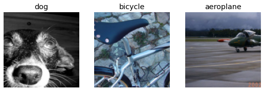

# Other Computer Vision Problems

# 其它计算机视觉问题

In the previous chapter you learned some important practical techniques for training models in practice. Considerations like selecting learning rates and the number of epochs are very important to getting good results.

在上一章节我们学习了一些在实践中训练模型的一些重要特定技术。考虑的因素像选择学习率和周期数对于获得良好结果是非常重要的。

In this chapter we are going to look at two other types of computer vision problems: multi-label classification and regression. The first one is when you want to predict more than one label per image (or sometimes none at all), and the second is when your labels are one or several numbers—a quantity instead of a category.

在本章节，我们将学习另外两个类型的计算机视觉问题：多标签分类和回归。第一个问题是当我们想要预测单张图像有多个标签时（或有时间根本什么都没有）遇到到，第二个问题是当你的标注是一个或多个时：数量而不是类别。

In the process will study more deeply the output activations, targets, and loss functions in deep learning models.

在这个过程中会学习在深度学习模型中更深层的输出激活、目标和损失函数。

## Multi-Label Classification

## 多标签分类

Multi-label classification refers to the problem of identifying the categories of objects in images that may not contain exactly one type of object. There may be more than one kind of object, or there may be no objects at all in the classes that you are looking for.

多标签分类适用于那种在图像中不可能只包含一个目标类型的识别问题。有可能会超过一个目标类型，或在分类中你根本没有找到目标。

For instance, this would have been a great approach for our bear classifier. One problem with the bear classifier that we rolled out in <chapter_production> was that if a user uploaded something that wasn't any kind of bear, the model would still say it was either a grizzly, black, or teddy bear—it had no ability to predict "not a bear at all." In fact, after we have completed this chapter, it would be a great exercise for you to go back to your image classifier application, and try to retrain it using the multi-label technique, then test it by passing in an image that is not of any of your recognized classes.

例如，我们的熊分类器这一方法也许已经是一个非常好的方法了。在<章节：产品>中我们遇到了一个熊分类器的问题，如果用户上传不包含任何种类熊的图像，模型依然会说它是灰熊、黑熊或泰迪熊的一种。它不具备预测“根本没有熊”的能力。实际上，当我们完成本章节后，你重回图像分类器应用会是很好的练习。用多标签技术尝试重训练模型，然后通过传递给模型一张不包含任何你的识别分类的图像，对它进行测试。

In practice, we have not seen many examples of people training multi-label classifiers for this purpose—but we very often see both users and developers complaining about this problem. It appears that this simple solution is not at all widely understood or appreciated! Because in practice it is probably more common to have some images with zero matches or more than one match, we should probably expect in practice that multi-label classifiers are more widely applicable than single-label classifiers.

在实践中，我们没有看到很多人们以此为目的训练多标签分类器的例子，但是我们常常看到用户和开发人员抱怨这个问题。表明这个简单的解决方案根本没有被广泛的理解或认可！由于在实践中可能更常见的是很多零匹配或超过一个匹配项的图片，相比单标签分类器，我们可能应该期望在实践中多标签分类器更更广泛的应用。

First, let's see what a multi-label dataset looks like, then we'll explain how to get it ready for our model. You'll see that the architecture of the model does not change from the last chapter; only the loss function does. Let's start with the data.

首先，我们看一下多标签数据集看起来是什么样子，然后我们会解释如何为我们的模型把它准备好。你会在看到从上一章节开始，模型的架构没有做变化，只是变了损失函数。让我们从数据开始。

### The Data

### 数据

For our example we are going to use the PASCAL dataset, which can have more than one kind of classified object per image.

We begin by downloading and extracting the dataset as per usual:

我们的例子会使用PASCAL数据集，这个数据集对每张图像有超过一个种类的分类对象。与平常一样我们开始下载并抽取数据集：

```
from fastai.vision.all import *
path = untar_data(URLs.PASCAL_2007)
```

This dataset is different from the ones we have seen before, in that it is not structured by filename or folder but instead comes with a CSV (comma-separated values) file telling us what labels to use for each image. We can inspect the CSV file by reading it into a Pandas DataFrame:

这个数据集与我们以前看到的那些是不同的，也就是说它没有通过文件名或文件夹结构化，而是用CSV（逗号分割值）文件告诉我们每一张图像所用的标签是什么。我们能够把它读取到Pandas DataFrame里，来查看这个CSV文件：

```
df = pd.read_csv(path/'train.csv')
df.head()
```

<table style="width: 370px;border-collapse: collapse;" >
  <tr>
    <td  style="width: 10px;" align="center"></td>
    <td  style="width: 100px;" align="center">fname</td>
    <td  style="width: 160px;" align="center">labels</td>
    <td  style="width: 100px;" align="center">is_valid</td>
  </tr>
  <tr>
    <td align="center" font-weight="bold"><strong>0</strong></td>
    <td align="right">000005.jpg</td>
  	<td align="right">chair</td>
  	<td align="right">True</td>
  </tr>
  </tr>
    <td align="center"><strong>1</strong></td>
    <td align="right">000007.jpg</td>
  	<td align="right">car</td>
  	<td align="right">True</td>
  </tr>
  </tr>
    <td align="center"><strong>2</strong></td>
    <td align="right">000009.jpg</td>
  	<td align="right">horse person</td>
  	<td align="right">True</td>
  </tr>
  </tr>
    <td align="center"><strong>3</strong></td>
    <td align="right">000012.jpg</td>
  	<td align="right">car</td>
  	<td align="right">False</td>
  </tr>
  </tr>
    <td align="center" ><strong>4</strong></td>
    <td align="right">000016.jpg</td>
  	<td align="right">bicycle</td>
  	<td align="right">True</td>
  </tr>
</table>

As you can see, the list of categories in each image is shown as a space-delimited string.

正如你能看到的，每张图像的分类列表被显示为一个空格分割字符串。

### Sidebar: Pandas and DataFrames

### 侧边栏：Pandas and DataFrames

No, it’s not actually a panda! *Pandas* is a Python library that is used to manipulate and analyze tabular and time series data. The main class is `DataFrame`, which represents a table of rows and columns. You can get a DataFrame from a CSV file, a database table, Python dictionaries, and many other sources. In Jupyter, a DataFrame is output as a formatted table, as shown here.

You can access rows and columns of a DataFrame with the `iloc` property, as if it were a matrix:

是的，实际上它并不是熊猫！*Pandas*是一个Python库，用于操作和分析表格形式和时间序列数据。主要的类是`DataFrame`，它相当于一个有行和列的表。你能够从CSV文件、数据库表、Python字典和一些其它资源获取DataFrame。在Jupyter中，一个DataFrame输出的是一个格式化后的表，正如下面显示的。

你利用`iloc`特性能够获取一个DataFrame的行和列，好像它是一个矩阵：

```
df.iloc[:,0]
```

Out: $\begin{array}{l,c}
0 &      000005.jpg \\
1&       000007.jpg  \\
2&       000009.jpg \\
3&       000012.jpg  \\
4&       000016.jpg  \\
&           ...      \\
5006&    009954.jpg \\
5007&    009955.jpg \\
5008&    009958.jpg  \\
5009&    009959.jpg  \\
5010&    009961.jpg  \end{array}$
$\begin{array}{l}&&Name: fname, Length: 5011, dtype: object
 \end{array}$

```
df.iloc[0,:]
# Trailing :s are always optional (in numpy, pytorch, pandas, etc.),
#   so this is equivalent:
df.iloc[0]
```

Out: $\begin{array}{l,r} 
fname   &    000005.jpg\\
labels  &         chair\\
is\_valid &         True\end{array}$
$\begin{array}{l}&&Name: 0,& dtype: object
\end{array}$

You can also grab a column by name by indexing into a DataFrame directly:

你也能够通过列名直接索引到DataFrame中去来抓起一列：

```
df['fname']
```

Out: $\begin{array}{l,c} 0  &     000005.jpg\\
1      & 000007.jpg\\
2      & 000009.jpg\\
3      & 000012.jpg\\
4      & 000016.jpg\\
       &    ...    \\
5006   & 009954.jpg\\
5007   & 009955.jpg\\
5008   & 009958.jpg\\
5009   & 009959.jpg\\
5010   & 009961.jpg\end{array}$
$\begin{array}{l,l}&&Name: fname,& Length: 5011,& dtype: object\end{array}$

You can create new columns and do calculations using columns:

你能够创建一个新列并用列做计算：

```
tmp_df = pd.DataFrame({'a':[1,2], 'b':[3,4]})
tmp_df
```

<table style="width: 30px;border-collapse: collapse;" >
  <tr>
    <td  style="width: 10px;" align="center"></td>
    <td  style="width: 10px;" align="center"><strong>a</strong></td>
    <td  style="width: 10px;" align="center"><strong>b</strong></td>
  </tr>
  <tr>
    <td align="center" font-weight="bold"><strong>0</strong></td>
    <td align="right">1</td>
  	<td align="right">3</td>
  </tr>
  <tr>
    <td align="center" font-weight="bold"><strong>1</strong></td>
    <td align="right">2</td>
  	<td align="right">4</td>
  </tr>
</table>

```
tmp_df['c'] = tmp_df['a']+tmp_df['b']
tmp_df
```

<table style="width: 30px;border-collapse: collapse;" >
  <tr>
    <td  style="width: 10px;" align="center"></td>
    <td  style="width: 10px;" align="center"><strong>a</strong></td>
    <td  style="width: 10px;" align="center"><strong>b</strong></td>
    <td  style="width: 10px;" align="center"><strong>c</strong></td> 
  </tr>
  <tr>
    <td align="center" font-weight="bold"><strong>0</strong></td>
    <td align="right">1</td>
  	<td align="right">3</td>
    <td align="right">4</td>
  </tr>
  <tr>
    <td align="center" font-weight="bold"><strong>1</strong></td>
    <td align="right">2</td>
  	<td align="right">4</td>
  	<td align="right">6</td>
  </tr>
</table>

Pandas is a fast and flexible library, and an important part of every data scientist’s Python toolbox. Unfortunately, its API can be rather confusing and surprising, so it takes a while to get familiar with it. If you haven’t used Pandas before, we’d suggest going through a tutorial; we are particularly fond of the book [*Python for Data Analysis*](http://shop.oreilly.com/product/0636920023784.do) by Wes McKinney, the creator of Pandas (O'Reilly). It also covers other important libraries like `matplotlib` and `numpy`. We will try to briefly describe Pandas functionality we use as we come across it, but will not go into the level of detail of McKinney’s book.

Pandas是一个快速和灵活的库，它是每个数据科学的Python工具箱一个很重要的部分。不幸的是，它的API让人比较混乱和惊讶，所以需要花一段时间来熟悉它。如果你之前没有用过Pandas，我们建议你通过一个指引来学习使用它。我们特别喜欢由Pandas的创始人韦斯·麦金尼编写的书[Pyhon数据分析](http://shop.oreilly.com/product/0636920023784.do)（欧莱礼媒体发行）。它也覆盖了其它重要的库，如`matploatlib`和`numpy`的内容。我们会尝试简短的描述我们所使用的Pandas功能设计，但是不会达到麦金尼著作的细节水平。

### End sidebar

### 侧边栏结束

Now that we have seen what the data looks like, let's make it ready for model training.

既然我们已经知道了数据的样子，那让我们为模型训练做好准备。

### Constructing a DataBlock

### 创建一个数据块

How do we convert from a `DataFrame` object to a `DataLoaders` object? We generally suggest using the data block API for creating a `DataLoaders` object, where possible, since it provides a good mix of flexibility and simplicity. Here we will show you the steps that we take to use the data blocks API to construct a `DataLoaders` object in practice, using this dataset as an example.

我们如果从一个`DataFrame`对象转换为一个`DataLoaders`对象？对于创建一个`DataLoaders`对象，我们通常建议尽可能使用数据块API，因为它提供了柔性和简洁的完美融合。这里我们使用这个数据集做为一个例子，给你展示实践中使用数据块API来构建一个`DataLoaders`对象的步骤。

As we have seen, PyTorch and fastai have two main classes for representing and accessing a training set or validation set:

- `Dataset`:: A collection that returns a tuple of your independent and dependent variable for a single item
- `DataLoader`:: An iterator that provides a stream of mini-batches, where each mini-batch is a tuple of a batch of independent variables and a batch of dependent variables

正如你看到的，PyTorch和fastai有两个主要的类代表和访问训练集和验证集：

- `Dataset`：一个集合，返回单一数据自变量和因变量的一个元组
- `DataLoader`：一个迭代器，提供一串最小批次，每一最小批次是一个自变量批次和因变量批次的元组

On top of these, fastai provides two classes for bringing your training and validation sets together:

- `Datasets`:: An object that contains a training `Dataset` and a validation `Dataset`
- `DataLoaders`:: An object that contains a training `DataLoader` and a validation `DataLoader`

在这些之上，fastai提供了两个类把你的训练和验证集汇集在一起：

- `Datasets`：一个对象，包含一个训练`Dataset`和一个验证`Dataset`
- `DataLoaders`：一个对象，包含一个训练`DataLoader`和一个验证`DataLoader`

Since a `DataLoader` builds on top of a `Dataset` and adds additional functionality to it (collating multiple items into a mini-batch), it’s often easiest to start by creating and testing `Datasets`, and then look at `DataLoaders` after that’s working.

因为`DataLoader`构建在`Dataset`之上并增加了附加功能（把多个数据项收集在一个最小批次内），通常最简单的开始创建和测试`Datasets`，然后在运行后查看`DataLoaders`。

When we create a `DataBlock`, we build up gradually, step by step, and use the notebook to check our data along the way. This is a great way to make sure that you maintain momentum as you are coding, and that you keep an eye out for any problems. It’s easy to debug, because you know that if a problem arises, it is in the line of code you just typed!

Let’s start with the simplest case, which is a data block created with no parameters:

当你创建一个`数据块`时，我们要一步一步的逐步建立，并用notebook来逐步检查我们的数据。这是一个确保你保持编码动力的一个绝佳方法，然后随时关注出现的任何问题。它很容易调试，因为你知道如果一个问题产生，这个问题就在你刚刚敲击完成的代码行内！

让我们从不传参创建一个数据块这个最简单的例子开始：

```
dblock = DataBlock()
```

We can create a `Datasets` object from this. The only thing needed is a source—in this case, our DataFrame:

这样我们就能够创建一个`Datasets`对象。在这个例子中唯一需要的一个源是—我们的DataFrame：

```
dsets = dblock.datasets(df)
```

This contains a `train` and a `valid` dataset, which we can index into:

它包含了一个我们能够索引到的`训练`和`验证`数据集，

```
len(dsets.train),len(dsets.valid)
```

Out: (4009, 1002)

```
x,y = dsets.train[0]
x,y
```

Out: $\begin{array}{llr}
(&fname  &     008663.jpg\\
&labels         & car person\\
&is\_valid     &           False\\\end{array}$
$ \begin{array}{l}& &&        Name: 4346, &dtype: object,\end{array}$
$ \begin{array}{llllr}&&&  fname       &008663.jpg\\
 &&& labels    &  car person\\
 &&& is\_valid &  False\end{array}$
$ \begin{array}{llr}&&& Name: 4346,& dtype: object&)\end{array}$

As you can see, this simply returns a row of the DataFrame, twice. This is because by default, the data block assumes we have two things: input and target. We are going to need to grab the appropriate fields from the DataFrame, which we can do by passing `get_x` and `get_y` functions:

正如你看到的，这个例子返回了两次数据帧的一行数据。因为这是默认的，数据块假设我们有两件事：输入和目标。我们需要从DataFrame合适的区域中抓取，可以通过传递`get_x`和`get_y`函数来做：

```
x['fname']
```

Out: '008663.jpg'

```
dblock = DataBlock(get_x = lambda r: r['fname'], get_y = lambda r: r['labels'])
dsets = dblock.datasets(df)
dsets.train[0]
```

Out: ('005620.jpg', 'aeroplane')

As you can see, rather than defining a function in the usual way, we are using Python’s `lambda` keyword. This is just a shortcut for defining and then referring to a function. The following more verbose approach is identical:

正如你所看到的，我们使用了Python的`lambda`关键字，而不是在普通的方法中定义一个函数。这只是定义的一个快捷方式，然后引用一个函数。下面是相同的更为冗长的方法：

```
def get_x(r): return r['fname']
def get_y(r): return r['labels']
dblock = DataBlock(get_x = get_x, get_y = get_y)
dsets = dblock.datasets(df)
dsets.train[0]
```

Out: ('002549.jpg', 'tvmonitor')

Lambda functions are great for quickly iterating, but they are not compatible with serialization, so we advise you to use the more verbose approach if you want to export your `Learner` after training (lambdas are fine if you are just experimenting).

We can see that the independent variable will need to be converted into a complete path, so that we can open it as an image, and the dependent variable will need to be split on the space character (which is the default for Python’s `split` function) so that it becomes a list:

Lambda函数对于快速迭代是极好的，但它们不兼任序列化，所以如果你想训练后输出你的`Learner`，我们建议你使用更为冗长的方法。（如果你只是做个尝试，lambdas是非常好的）

```
def get_x(r): return path/'train'/r['fname']
def get_y(r): return r['labels'].split(' ')
dblock = DataBlock(get_x = get_x, get_y = get_y)
dsets = dblock.datasets(df)
dsets.train[0]
```

Out: (Path('/home/jhoward/.fastai/data/pascal_2007/train/002844.jpg'), ['train'])

To actually open the image and do the conversion to tensors, we will need to use a set of transforms; block types will provide us with those. We can use the same block types that we have used previously, with one exception: the `ImageBlock` will work fine again, because we have a path that points to a valid image, but the `CategoryBlock` is not going to work. The problem is that block returns a single integer, but we need to be able to have multiple labels for each item. To solve this, we use a `MultiCategoryBlock`. This type of block expects to receive a list of strings, as we have in this case, so let’s test it out:


```
dblock = DataBlock(blocks=(ImageBlock, MultiCategoryBlock),
                   get_x = get_x, get_y = get_y)
dsets = dblock.datasets(df)
dsets.train[0]
```

Out: (PILImage mode=RGB size=500x375,
         TensorMultiCategory([0., 0., 0., 0., 0., 0., 0., 0., 0., 0., 0., 1., 0., 0., 0., 0., 0., 0., 0., 0.]))

As you can see, our list of categories is not encoded in the same way that it was for the regular `CategoryBlock`. In that case, we had a single integer representing which category was present, based on its location in our vocab. In this case, however, we instead have a list of zeros, with a one in any position where that category is present. For example, if there is a one in the second and fourth positions, then that means that vocab items two and four are present in this image. This is known as *one-hot encoding*. The reason we can’t easily just use a list of category indices is that each list would be a different length, and PyTorch requires tensors, where everything has to be the same length.

> jargon: One-hot encoding: Using a vector of zeros, with a one in each location that is represented in the data, to encode a list of integers.

Let’s check what the categories represent for this example (we are using the convenient `torch.where` function, which tells us all of the indices where our condition is true or false):


```
idxs = torch.where(dsets.train[0][1]==1.)[0]
dsets.train.vocab[idxs]
```

Out: (#1) ['dog']

With NumPy arrays, PyTorch tensors, and fastai’s `L` class, we can index directly using a list or vector, which makes a lot of code (such as this example) much clearer and more concise.

We have ignored the column `is_valid` up until now, which means that `DataBlock` has been using a random split by default. To explicitly choose the elements of our validation set, we need to write a function and pass it to `splitter` (or use one of fastai's predefined functions or classes). It will take the items (here our whole DataFrame) and must return two (or more) lists of integers:


```
def splitter(df):
    train = df.index[~df['is_valid']].tolist()
    valid = df.index[df['is_valid']].tolist()
    return train,valid

dblock = DataBlock(blocks=(ImageBlock, MultiCategoryBlock),
                   splitter=splitter,
                   get_x=get_x, 
                   get_y=get_y)

dsets = dblock.datasets(df)
dsets.train[0]
```

Out: (PILImage mode=RGB size=500x333,
         TensorMultiCategory([0., 0., 0., 0., 0., 0., 1., 0., 0., 0., 0., 0., 0., 0., 0., 0., 0., 0., 0., 0.]))

As we have discussed, a `DataLoader` collates the items from a `Dataset` into a mini-batch. This is a tuple of tensors, where each tensor simply stacks the items from that location in the `Dataset` item.

Now that we have confirmed that the individual items look okay, there's one more step we need to ensure we can create our `DataLoaders`, which is to ensure that every item is of the same size. To do this, we can use `RandomResizedCrop`:


```
dblock = DataBlock(blocks=(ImageBlock, MultiCategoryBlock),
                   splitter=splitter,
                   get_x=get_x, 
                   get_y=get_y,
                   item_tfms = RandomResizedCrop(128, min_scale=0.35))
dls = dblock.dataloaders(df)
```

And now we can display a sample of our data:


```
dls.show_batch(nrows=1, ncols=3)
```

Out: 

Remember that if anything goes wrong when you create your `DataLoaders` from your `DataBlock`, or if you want to view exactly what happens with your `DataBlock`, you can use the `summary` method we presented in the last chapter.

Our data is now ready for training a model. As we will see, nothing is going to change when we create our `Learner`, but behind the scenes, the fastai library will pick a new loss function for us: binary cross-entropy.