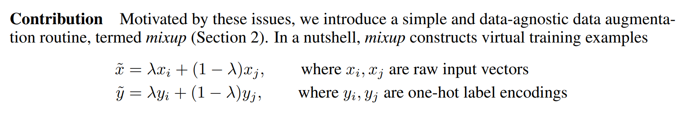

# Training a State-of-the-Art Model

# 训练一个最先进的模型

This chapter introduces more advanced techniques for training an image classification model and getting state-of-the-art results. You can skip it if you want to learn more about other applications of deep learning and come back to it later—knowledge of this material will not be assumed in later chapters.

这一章介绍的是一些用于训练图像分类模型和取得最新成果的更高级的技术。如果你希望学习更多有关于机器学习的其它应用你可以略过它，稍后再回来看即可，这个知识内容在后面的章节不会展示。

We will look at what normalization is, a powerful data augmentation technique called mixup, the progressive resizing approach and test time augmentation. To show all of this, we are going to train a model from scratch (not using transfer learning) using a subset of ImageNet called [Imagenette](https://github.com/fastai/imagenette). It contains a subset of 10 very different categories from the original ImageNet dataset, making for quicker training when we want to experiment.

我们会看一下什么是归一化，称为mixup的一种强大的数据增强技术，渐进式的调整大小方法和测试时间增强。我们会使用一个名为[Imagenette](https://github.com/fastai/imagenette)的ImageNet的子集，从零开始训练一个模型来展示这些技术。这个数据集是包含了来自原生ImageNet数据集非常不同的10个分类的子数据集，当我们希望跑实验时在这个子数据集上会训练的更快。

This is going to be much harder to do well than with our previous datasets because we're using full-size, full-color images, which are photos of objects of different sizes, in different orientations, in different lighting, and so forth. So, in this chapter we're going to introduce some important techniques for getting the most out of your dataset, especially when you're training from scratch, or using transfer learning to train a model on a very different kind of dataset than the pretrained model used.

相比我们之前的数据集这个会更难做好，因为我们使用了全尺寸和全彩色图像，这些是在不同的方位、不同的光线等条件下，不同尺寸对象的照片。所以在本章我们会介绍充分利用你的数据集一些重点技术，尤其在你从零开始训练模型时，或利用迁移学习来训练一个模型，所使用的数据集种类与预训练模型所使用的完全不同。

## Imagenette

## Imagenette数据集

When fast.ai first started there were three main datasets that people used for building and testing computer vision models:

- ImageNet:: 1.3 million images of various sizes around 500 pixels across, in 1,000 categories, which took a few days to train
- MNIST:: 50,000 28×28-pixel grayscale handwritten digits
- CIFAR10:: 60,000 32×32-pixel color images in 10 classes

当fast.ai首次启动时，有三个主要数据集，人们用于创建和测试计算机视觉模型：

- ImageNet：有一千个分类，一百三十万张像素大约为500的各种尺寸的图像，它会耗费几天的时间来训练
- MNIST：五万张，28×28像素的灰度手写体数字
- CIFAR10：六万张，32×32像素有十个种类的彩色图像

The problem was that the smaller datasets didn't actually generalize effectively to the large ImageNet dataset. The approaches that worked well on ImageNet generally had to be developed and trained on ImageNet. This led to many people believing that only researchers with access to giant computing resources could effectively contribute to developing image classification algorithms.

问题是，小的数据集不能真正有效的泛华到大型ImageNet数据集上。在ImageNet上工作良好的方法通常是必须在ImageNet上开发和训练。这就导致很多人相信只有有权限使用巨型计算资源的研究人员能够有效的为图像分类算法做发展贡献。

We thought that seemed very unlikely to be true. We had never actually seen a study that showed that ImageNet happen to be exactly the right size, and that other datasets could not be developed which would provide useful insights. So we thought we would try to create a new dataset that researchers could test their algorithms on quickly and cheaply, but which would also provide insights likely to work on the full ImageNet dataset.

我们认为这好像极不可能是真实的。我们从来没有实际看到过一个研究显示ImageNet是一个绝对正确的尺寸，而不能开发出可提供有益见解的其它数据集。所以我们认为我们也许要尝试创建一个让研究人员快速且廉价测试他们算法的数据集，但它也能提供可工作在全部ImageNet数据集上的见解。

About three hours later we had created Imagenette. We selected 10 classes from the full ImageNet that looked very different from one another. As we had hoped, we were able to quickly and cheaply create a classifier capable of recognizing these classes. We then tried out a few algorithmic tweaks to see how they impacted Imagenette. We found some that worked pretty well, and tested them on ImageNet as well—and we were very pleased to find that our tweaks worked well on ImageNet too!

大约3个小时后我们创建了Imagenette。我们从全尺寸ImageNet里选择了看起来完全不同的10个类别。正如我们期望的，我们能够快速且廉价的创建一个具备识别它些类别的分类器。然后我们尝试一些算法微调来看它会如何影响Imagenette。我们发现有一些运行的相当好，且在ImageNet上测试他们也相当不错，非常高兴发现我们的微调工作在ImageNet上也运行良好！

There is an important message here: the dataset you get given is not necessarily the dataset you want. It's particularly unlikely to be the dataset that you want to do your development and prototyping in. You should aim to have an iteration speed of no more than a couple of minutes—that is, when you come up with a new idea you want to try out, you should be able to train a model and see how it goes within a couple of minutes. If it's taking longer to do an experiment, think about how you could cut down your dataset, or simplify your model, to improve your experimentation speed. The more experiments you can do, the better!

Let's get started with this dataset:

这里有一个很重要的信息：你得到的数据集未必是你想要的。它尤其不可能是你想要做你的开发和原型的数据集。你的目标应该是迭代速度不能超过几分钟，也就是说，当你提出一个希望尝试一下的新想法，你应该能够训练一个模型，在几分钟内查看它的情况是怎样的。如果花费太长的时间做这个实验，思考一下你能够如何减小你的数据集或简化你的模型，来改善你的实验速度。你能够更多的实验是更好的！

让我们利用这个数据集开始吧：

```
from fastai.vision.all import *
path = untar_data(URLs.IMAGENETTE)
```

First we'll get our dataset into a `DataLoaders` object, using the *presizing* trick introduced in <chapter_pet_breeds>:

首先我们会把我们的数据集放入一个`DataLoaders`对象，这使用的是在<章节：基于宠物品种的图像分类>中介绍的*填孔处理*技巧：

```
dblock = DataBlock(blocks=(ImageBlock(), CategoryBlock()),
                   get_items=get_image_files,
                   get_y=parent_label,
                   item_tfms=Resize(460),
                   batch_tfms=aug_transforms(size=224, min_scale=0.75))
dls = dblock.dataloaders(path, bs=64)
```

and do a training run that will serve as a baseline:

做一个训练，并做为基准：

```
model = xresnet50(n_out=dls.c)
learn = Learner(dls, model, loss_func=CrossEntropyLossFlat(), metrics=accuracy)
learn.fit_one_cycle(5, 3e-3)
```

| epoch | train_loss | valid_loss | accuracy |  time |
| --: | ---------: | ---------: | -------: | ----: |
|     0 |   1.583403 |   2.064317 | 0.401792 | 01:03 |
|     1 |   1.208877 |   1.260106 | 0.601568 | 01:02 |
|     2 |   0.925265 |   1.036154 | 0.664302 | 01:03 |
|     3 |   0.730190 |   0.700906 | 0.777819 | 01:03 |
|     4 |   0.585707 |   0.541810 | 0.825243 | 01:03 |

That's a good baseline, since we are not using a pretrained model, but we can do better. When working with models that are being trained from scratch, or fine-tuned to a very different dataset than the one used for the pretraining, there are some additional techniques that are really important. In the rest of the chapter we'll consider some of the key approaches you'll want to be familiar with. The first one is *normalizing* your data.

这是一个好的基准模型，因为我们没有使用预训练模型，但做的更好。当使用的模型是从零训练的，或微调与预训练使用的数据集完全不同时，有一些非常重要的附加技术。在剩下的章节，我们会思考一些你希望精通的关键方法。第一个技术是*归一化*你的数据。

## Normalization

## 归一化

When training a model, it helps if your input data is normalized—that is, has a mean of 0 and a standard deviation of 1. But most images and computer vision libraries use values between 0 and 255 for pixels, or between 0 and 1; in either case, your data is not going to have a mean of 0 and a standard deviation of 1.

Let's grab a batch of our data and look at those values, by averaging over all axes except for the channel axis, which is axis 1:

当训练一个模型时，如果你输入的数据是归一化（即，平均值为0，标准偏差为1）是有帮助的。但是绝大多数图像和计算机视觉库使用的像素值在0到255或0到1之间。在任何例子中，你的数据都不是平均数为0和标准偏差为1。

```
x,y = dls.one_batch()
x.mean(dim=[0,2,3]),x.std(dim=[0,2,3])
```

Out: (TensorImage([0.4842, 0.4711, 0.4511], device='cuda:5'), TensorImage([0.2873, 0.2893, 0.3110], device='cuda:5'))

As we expected, the mean and standard deviation are not very close to the desired values. Fortunately, normalizing the data is easy to do in fastai by adding the `Normalize` transform. This acts on a whole mini-batch at once, so you can add it to the `batch_tfms` section of your data block. You need to pass to this transform the mean and standard deviation that you want to use; fastai comes with the standard ImageNet mean and standard deviation already defined. (If you do not pass any statistics to the `Normalize` transform, fastai will automatically calculate them from a single batch of your data.)

Let's add this transform (using `imagenet_stats` as Imagenette is a subset of ImageNet) and take a look at one batch now:

正如我们所预期的，平均值和标准偏差不是很接近期望的值。幸运的是，归一化数据在fastai中只通过添加`Normalize`转换就会很容易实现。在整个最小批次这是一次性操作，所以你可以把它添加到数据块的`batch_tfms`部分。你需要传递给这个转化你所希望使用的平均值和标准偏差。fastai已经定义了标准的ImageNet平均值和标准偏差。（如果你不给`Normalize`转换传递任何统计信息，fastai会根据你的单一批次数据来自动计算它们。）

```
def get_dls(bs, size):
    dblock = DataBlock(blocks=(ImageBlock, CategoryBlock),
                   get_items=get_image_files,
                   get_y=parent_label,
                   item_tfms=Resize(460),
                   batch_tfms=[*aug_transforms(size=size, min_scale=0.75),
                               Normalize.from_stats(*imagenet_stats)])
    return dblock.dataloaders(path, bs=bs)
```

```
dls = get_dls(64, 224)
```

```
x,y = dls.one_batch()
x.mean(dim=[0,2,3]),x.std(dim=[0,2,3])
```

Out: (TensorImage([-0.0787,  0.0525,  0.2136], device='cuda:5'), TensorImage([1.2330, 1.2112, 1.3031], device='cuda:5'))

Let's check what effect this had on training our model:

我们来检查在训练我们的模型上有什么效果：

```
model = xresnet50(n_out=dls.c)
learn = Learner(dls, model, loss_func=CrossEntropyLossFlat(), metrics=accuracy)
learn.fit_one_cycle(5, 3e-3)
```

| epoch | train_loss | valid_loss | accuracy |  time |
| ----: | ---------: | ---------: | -------: | ----: |
|     0 |   1.632865 |   2.250024 | 0.391337 | 01:02 |
|     1 |   1.294041 |   1.579932 | 0.517177 | 01:02 |
|     2 |   0.960535 |   1.069164 | 0.657207 | 01:04 |
|     3 |   0.730220 |   0.767433 | 0.771845 | 01:05 |
|     4 |   0.577889 |   0.550673 | 0.824496 | 01:06 |

Although it only helped a little here, normalization becomes especially important when using pretrained models. The pretrained model only knows how to work with data of the type that it has seen before. If the average pixel value was 0 in the data it was trained with, but your data has 0 as the minimum possible value of a pixel, then the model is going to be seeing something very different to what is intended!

虽然在这里它只有一点帮助，在使用预训练模型时归一化变的尤为重要。预训练模型只知道如何在它之前已经看到过的类型数据上工作。如果它训练的数据平均像素值为0，而你的数据有0作为一个像素的最小可能值，那么模型将会看到的事物与要达成的目的是完全不同的！

This means that when you distribute a model, you need to also distribute the statistics used for normalization, since anyone using it for inference, or transfer learning, will need to use the same statistics. By the same token, if you're using a model that someone else has trained, make sure you find out what normalization statistics they used, and match them.

这表示当你发布一个模型时，你也需要发布对于归一化使用的统计信息，因为任何人使用它作为参考或迁移学习，将需要使用相同的统计信息。同样的，如果你正在使用其它人已经训练过的模型，确保你找到他们使用的归一化统计信息，并与之相匹配。

We didn't have to handle normalization in previous chapters because when using a pretrained model through `cnn_learner`, the fastai library automatically adds the proper `Normalize` transform; the model has been pretrained with certain statistics in `Normalize` (usually coming from the ImageNet dataset), so the library can fill those in for you. Note that this only applies with pretrained models, which is why we need to add this information manually here, when training from scratch.

在之前章节我们不必处理归一化，因为当通过`cnn_learner`使用一个预训练模型时，fastai库自动添加了`Normalize`转换属性。模型已经用了`Normalize`中确定的统计信息做了预训练（通常来自ImageNet数据集），所以库能够为你填写那些信息。注意，这仅仅适用于预训练模型，当我们从零开始训练时，这就是为什么在这里我们需要手动添加这个信息的原因。

All our training up until now has been done at size 224. We could have begun training at a smaller size before going to that. This is called *progressive resizing*.

截止现在我们所有的训练都在224这个尺寸上完成了。开始前，我们能够在一个更小的尺寸上开始训练。这被称为*渐进式调整大小*。

## Progressive Resizing

## 渐进式调整大小

When fast.ai and its team of students [won the DAWNBench competition](https://www.theverge.com/2018/5/7/17316010/fast-ai-speed-test-stanford-dawnbench-google-intel) in 2018, one of the most important innovations was something very simple: start training using small images, and end training using large images. Spending most of the epochs training with small images, helps training complete much faster. Completing training using large images makes the final accuracy much higher. We call this approach *progressive resizing*.

> jargon: progressive resizing: Gradually using larger and larger images as you train.

当fast.ai和它的学习团队在2018年[赢得DAWNBence比赛](https://www.theverge.com/2018/5/7/17316010/fast-ai-speed-test-stanford-dawnbench-google-intel)时，一个最重要且简单的发明：使用小图像开始训练，利用大图像结束训练。花费大多数周期用小图像做训练，帮助训练更快的完成。使用大图像完成训练使得最终精度更高。我们称这种方法为*渐进式调整大小*。

> 术语：渐进式调整大小：逐步使用越来越大的图像做训练。

As we have seen, the kinds of features that are learned by convolutional neural networks are not in any way specific to the size of the image—early layers find things like edges and gradients, and later layers may find things like noses and sunsets. So, when we change image size in the middle of training, it doesn't mean that we have to find totally different parameters for our model.

正如我们看到的，通过卷积神经网络来学习的这些特征类型不是任何特定形式上的图像尺寸，起初的那些层找到如边沿和斜坡这些事物，后面的那些层找到如鼻子和日落这些事物。所以，当我们在训练中途改变图像尺寸，这并不代表我们必须为我们的模型寻找完全不同的参数。

But clearly there are some differences between small images and big ones, so we shouldn't expect our model to continue working exactly as well, with no changes at all. Does this remind you of something? When we developed this idea, it reminded us of transfer learning! We are trying to get our model to learn to do something a little bit different from what it has learned to do before. Therefore, we should be able to use the `fine_tune` method after we resize our images.

然而很明显，图像在大和小的时候它们之间有一些区别，所以我们不应该期望我们的模型在完全不改变的情况下也完全一样的工作。这让你想起了什么？当我们开发这个想法的时候，它让我们想到了迁移学习！我们尝试让我们的模型学习一些东西，这些东西与模型之前已经学到的有一些差别。因而，我们改变图像大小后应该能够使用`fine_tune`方法。

There is an additional benefit to progressive resizing: it is another form of data augmentation. Therefore, you should expect to see better generalization of your models that are trained with progressive resizing.

对于渐式调整大小有一个额外收益：它是另一种形式的数据增强。所以，在渐进式调整大小下你应该希望看到你训练的模型有更好的泛化。

To implement progressive resizing it is most convenient if you first create a `get_dls` function which takes an image size and a batch size as we did in the section before, and returns your `DataLoaders`:

就如我们在之前小节做的那样，如果你首先创建一个取图像大小和一个批次大小的`get_dls`函数，来实施渐进式调整大小是极其方便的，然后返回你的`DataLoaders`。

Now you can create your `DataLoaders` with a small size and use `fit_one_cycle` in the usual way, training for a few less epochs than you might otherwise do:

现在你可以创建一个小尺寸的`DataLoaders`，并使用常用的`fit_one_cycle`方法，相比你可能做的其它方式训练少一些周期：

```
dls = get_dls(128, 128)
learn = Learner(dls, xresnet50(n_out=dls.c), loss_func=CrossEntropyLossFlat(), 
                metrics=accuracy)
learn.fit_one_cycle(4, 3e-3)
```

| epoch | train_loss | valid_loss | accuracy |  time |
| ----: | ---------: | ---------: | -------: | ----: |
|     0 |   1.902943 |   2.447006 | 0.401419 | 00:30 |
|     1 |   1.315203 |   1.572992 | 0.525765 | 00:30 |
|     2 |   1.001199 |   0.767886 | 0.759149 | 00:30 |
|     3 |   0.765864 |   0.665562 | 0.797984 | 00:30 |

Then you can replace the `DataLoaders` inside the `Learner`, and fine-tune:

然后你能够`Learner`内部的`DataLoaders`，并做微调:

```
learn.dls = get_dls(64, 224)
learn.fine_tune(5, 1e-3)
```

| epoch | train_loss | valid_loss | accuracy |  time |
| ----: | ---------: | ---------: | -------: | ----: |
|     0 |   0.985213 |   1.654063 | 0.565721 | 01:06 |

| epoch | train_loss | valid_loss | accuracy |  time |
| ----: | ---------: | ---------: | -------: | ----: |
|     0 |   0.706869 |   0.689622 | 0.784541 | 01:07 |
|     1 |   0.739217 |   0.928541 | 0.712472 | 01:07 |
|     2 |   0.629462 |   0.788906 | 0.764003 | 01:07 |
|     3 |   0.491912 |   0.502622 | 0.836445 | 01:06 |
|     4 |   0.414880 |   0.431332 | 0.863331 | 01:06 |

As you can see, we're getting much better performance, and the initial training on small images was much faster on each epoch.

你能看到，我们获得更好的性能，在小图像上的初始训练每个周期速度更快。

You can repeat the process of increasing size and training more epochs as many times as you like, for as big an image as you wish—but of course, you will not get any benefit by using an image size larger than the size of your images on disk.

你能够重复增加尺寸这一过程，到你希望的图像大小，并训练更多你喜欢周期的次数。当然，使用一个比你磁盘上图像更大的尺寸你将不会获得任何收益。

Note that for transfer learning, progressive resizing may actually hurt performance. This is most likely to happen if your pretrained model was quite similar to your transfer learning task and dataset and was trained on similar-sized images, so the weights don't need to be changed much. In that case, training on smaller images may damage the pretrained weights.

注意，对于迁移学习渐进式调整大小实际会伤害表现。如果你的预训练模型与你迁移学习的任务和数据集完全相似，在更小尺寸的图像上训练这种情况就极有可能发生，因为权重不需要有太多变化。在那种情况下，在更小图像上训练会损害预训练权重。

On the other hand, if the transfer learning task is going to use images that are of different sizes, shapes, or styles than those used in the pretraining task, progressive resizing will probably help. As always, the answer to "Will it help?" is "Try it!"

从另一方面说，如果迁移学习任务使用的图像与在预训练任务中使用的那些图像在尺寸、形状和样式不同，渐进式调整大小可能会有用。正如一直说的那样，对于“它会有帮忙吗？”的答案是“尝试一下！”

Another thing we could try is applying data augmentation to the validation set. Up until now, we have only applied it on the training set; the validation set always gets the same images. But maybe we could try to make predictions for a few augmented versions of the validation set and average them. We'll consider this approach next.

另外一件事情是，我们能够尝试的是对验证集应用数据增强。直到现在，我们只在训练集上应用了这一技术。验证集总是会取到相同的图像。但也许我们能够尝试对于一个稍微增强过的验证集版本上做一些预测并平均预测值。我们接下来会思考这个方法。

## Test Time Augmentation

## 测试时数据增强

We have been using random cropping as a way to get some useful data augmentation, which leads to better generalization, and results in a need for less training data. When we use random cropping, fastai will automatically use center cropping for the validation set—that is, it will select the largest square area it can in the center of the image, without going past the image's edges.

我们已经使用了随机裁剪作为获得一些有用的数据增强方法，会产生更好的泛化，和其结果是需要更少的训练数据。当我们使用随机裁剪，fastai会自动对验证集使用中心裁剪。即，它会在图像的中央选择它能选择的最大正文形面积，而不用越过图像的边缘。

This can often be problematic. For instance, in a multi-label dataset sometimes there are small objects toward the edges of an image; these could be entirely cropped out by center cropping. Even for problems such as our pet breed classification example, it's possible that some critical feature necessary for identifying the correct breed, such as the color of the nose, could be cropped out.

这经常会产生问题。例如，在多标签数据集中，有时有些小目标在图像的边缘。通过中心裁剪这这些目标可能会被完全裁剪掉。对于这些问题，即使如我们宠物分类例子，对于识别正确宠物的一些关键必要的特征，如鼻子的颜色，也许可能会被裁剪掉。

One solution to this problem is to avoid random cropping entirely. Instead, we could simply squish or stretch the rectangular images to fit into a square space. But then we miss out on a very useful data augmentation, and we also make the image recognition more difficult for our model, because it has to learn how to recognize squished and squeezed images, rather than just correctly proportioned images.

对于这个问题的一个解决方案是避免随机完全裁剪。相替代的，我们能够简单的把长方形图像挤扁或拉长正好契合入一个正方形的空间。但那时我们错失了一个非常有用的数据增强，我们也会使得我们的模型图像识别更加困难，因为他已经学会了如何来识别挤扁和挤压的图像，而不是正确比例的图像。

Another solution is to not just center crop for validation, but instead to select a number of areas to crop from the original rectangular image, pass each of them through our model, and take the maximum or average of the predictions. In fact, we could do this not just for different crops, but for different values across all of our test time augmentation parameters. This is known as *test time augmentation* (TTA).

> jargon: test time augmentation (TTA): During inference or validation, creating multiple versions of each image, using data augmentation, and then taking the average or maximum of the predictions for each augmented version of the image.

别一个解决方案是不仅仅对验证集做中心裁剪，相替代的是对原始长方形图像选择一些区域来裁剪，传递每个裁剪的区域通过我们的模型取预测的最大或平均值。事实上，我们做的这个事情不仅仅是对不同的裁剪，而且对于所有我们测试时的数据增强参数的不同值做这个操作。这被称为*测试时数据增强*（TTA）。

> 术语：测试时数据增强（TTA）：推理或验证期间，利用数据增强创建每张图像的多个版本，然后对每个图像增强版本取预测的平均或最大值。

Depending on the dataset, test time augmentation can result in dramatic improvements in accuracy. It does not change the time required to train at all, but will increase the amount of time required for validation or inference by the number of test-time-augmented images requested. By default, fastai will use the unaugmented center crop image plus four randomly augmented images.

You can pass any `DataLoader` to fastai's `tta` method; by default, it will use your validation set:

依靠数据集，测试时的数据增强能够导致戏剧化的改善精度。它根本不改变训练所请求的时间，而是会通请求一定数量的测试时的增强图像来增加验证或推理所需要的大量时间。fastai会通过默认方式使用非增强的中心裁剪图像加上四个随机增强图像。

你能够传递任意`DataLoader`到fastai的`tta`方法，它会默认的使用你的验证集：

```
preds,targs = learn.tta()
accuracy(preds, targs).item()
```

Out: 0.8737863898277283

As we can see, using TTA gives us good a boost in performance, with no additional training required. However, it does make inference slower—if you're averaging five images for TTA, inference will be five times slower.

如我们所看到的，在没有额外的训练请求下，使用TTA在表现方面给了我们一个好的提升。然而，它使用的推理更慢，如果我们为TTA平均五张图像，推理会慢五倍。

We've seen examples of how data augmentation helps train better models. Let's now focus on a new data augmentation technique called *Mixup*.

我们已经看到了数据增强如何帮助训练更好的模型的例子。现在让我们聚焦在一个新的数据增强技术，称为*Mixup*。

## Mixup

## Mixup

Mixup, introduced in the 2017 paper ["*mixup*: Beyond Empirical Risk Minimization"](https://arxiv.org/abs/1710.09412) by Hongyi Zhang et al., is a very powerful data augmentation technique that can provide dramatically higher accuracy, especially when you don't have much data and don't have a pretrained model that was trained on data similar to your dataset. The paper explains: "While data augmentation consistently leads to improved generalization, the procedure is dataset-dependent, and thus requires the use of expert knowledge." For instance, it's common to flip images as part of data augmentation, but should you flip only horizontally, or also vertically? The answer is that it depends on your dataset. In addition, if flipping (for instance) doesn't provide enough data augmentation for you, you can't "flip more." It's helpful to have data augmentation techniques where you can "dial up" or "dial down" the amount of change, to see what works best for you.

张宏毅等人在2017年发表的论文["*mixup*:超越经验的风险最小化"](https://arxiv.org/abs/1710.09412)中介绍了Mixup，它是一项非常强大的数据增强技术，能够提供戏剧性的高精确度，尤其当你没有很多数据和没有在与你数据集相似的数据上训练完成的预训练模型的时候。论文解释：“当数据增强不断的导致改善泛化时，程序是数据集依赖的，因此需要专业知道的使用。” 例如，作为数据增强的部分通常来翻转图像，但你应该只是水平翻转还是垂直翻转呢？答案是依据你的数据集。此外，如果翻转（首先）没有为你提供足够的数据增强，你不能“翻转太多。” 对于数据增强技术你能够“增加”或“减少”改变的数量是有帮助的，观察什么最适合你。

Mixup works as follows, for each image:

1. Select another image from your dataset at random.
2. Pick a weight at random.
3. Take a weighted average (using the weight from step 2) of the selected image with your image; this will be your independent variable.
4. Take a weighted average (with the same weight) of this image's labels with your image's labels; this will be your dependent variable.

对于每张图像，Mixup工作如下：

1. 从你的数据集中随机选择另一张图像。
2. 随机选取一个权重。
3. 你的图像和选中的图像取一个加权平均值（使用第二步的权重值），这会作为你的自变量。
4. 你的图像标签和这张图像的标签取一个加权平均值（有相同的权重），这会作为你的因变量。

In pseudocode, we're doing this (where `t` is the weight for our weighted average):

在伪代码中我们做了这些工作（其中`t`为我们加权平均值的权重）：

```
image2,target2 = dataset[randint(0,len(dataset)]
t = random_float(0.5,1.0)
new_image = t * image1 + (1-t) * image2
new_target = t * target1 + (1-t) * target2
```

For this to work, our targets need to be one-hot encoded. The paper describes this using the equations shown in <mixup> where $\lambda$ is the same as `t` in our pseudocode:

为了让它产生效果，我们的目标需要做独热编码。论文描述mixup使用下图<来自Mixup论文的一个片段>中所展示的公式，这里的$\lambda$与我们伪代码中的`t`相同：

<div style="text-align:center">
  <p align="center">
    
  </p>
  <p align="center">图：来自Mixup论文的一个片段</p>
</div>

### Sidebar: Papers and Math

### 侧边栏：论文和数学

We're going to be looking at more and more research papers from here on in the book. Now that you have the basic jargon, you might be surprised to discover how much of them you can understand, with a little practice! One issue you'll notice is that Greek letters, such as $\lambda$, appear in most papers. It's a very good idea to learn the names of all the Greek letters, since otherwise it's very hard to read the papers to yourself, and remember them (or to read code based on them, since code often uses the names of the Greek letters spelled out, such as `lambda`).

在本书从现在我们会看越来越多的研究论文。既然你有了技术术语，随着少许实践，你可能会吃惊的发现他们中的多少是你能够理解的！一个你需要注意的问题是希腊字母，如在绝大多数论文中所显示的$\lambda$。学习所有希腊字母的名称是一个好主意，因为否则你自己阅读论文是非常难且难以记住它们（或阅读它们的编码，因为编码经常使用希腊字母的名称拼写出来，如`lambda`）。

The bigger issue with papers is that they use math, instead of code, to explain what's going on. If you don't have much of a math background, this will likely be intimidating and confusing at first. But remember: what is being shown in the math, is something that will be implemented in code. It's just another way of talking about the same thing! After reading a few papers, you'll pick up more and more of the notation. If you don't know what a symbol is, try looking it up in Wikipedia's [list of mathematical symbols](https://en.wikipedia.org/wiki/List_of_mathematical_symbols) or drawing it in [Detexify](http://detexify.kirelabs.org/classify.html), which (using machine learning!) will find the name of your hand-drawn symbol. Then you can search online for that name to find out what it's for.

论文有一个更大的问题是它们使用数学代替代码来解释发生了什么。如果你没有很多的数据背景，在一开始可能会被吓住和困惑。但是请记住：在数学中所展示的内容，是一些将在代码中所实现的。它只是谈论相同事情的另一个方法！阅读一些论文后，你会收集越来越多的符号。如果你不知道一个符号是什么，尝试查找Wikipedia的[数学符号列表](https://en.wikipedia.org/wiki/List_of_mathematical_symbols)或在[Detexify](http://detexify.kirelabs.org/classify.html)中画出它，它（使用了机器学习！）会找到你手写符号的名称。然后你能够在线搜索这个名称来找出它代表了什么。

### End sidebar

### 侧边栏结束

<mixup_example> shows what it looks like when we take a *linear combination* of images, as done in Mixup.

下面<mixupg事例>显示，当我们取图像的*线性组合*时它看起来什么样子，就像在Mixup中做的那样。

```
#hide_input
#id mixup_example
#caption Mixing a church and a gas station
#alt An image of a church, a gas station and the two mixed up.
church = PILImage.create(get_image_files_sorted(path/'train'/'n03028079')[0])
gas = PILImage.create(get_image_files_sorted(path/'train'/'n03425413')[0])
church = church.resize((256,256))
gas = gas.resize((256,256))
tchurch = tensor(church).float() / 255.
tgas = tensor(gas).float() / 255.

_,axs = plt.subplots(1, 3, figsize=(12,4))
show_image(tchurch, ax=axs[0]);
show_image(tgas, ax=axs[1]);
show_image((0.3*tchurch + 0.7*tgas), ax=axs[2]);
```

Out: 

The third image is built by adding 0.3 times the first one and 0.7 times the second. In this example, should the model predict "church" or "gas station"? The right answer is 30% church and 70% gas station, since that's what we'll get if we take the linear combination of the one-hot-encoded targets. For instance, suppose we have 10 classes and "church" is represented by the index 2 and "gas station" is reprsented by the index 7, the one-hot-encoded representations are:

第三张图像是通过第一张图像的0.3倍和第二张图像的0.7倍加起来构建的。在这个例子中，模型应该预测“教堂”还是“加油站”？正确的答案是30%是教堂，70%是加油站，因为如果我们取了独热编码目标的线性组合，这就是我们会得到的结果。例如，假设我们有10个分类，“教堂”通过索引2来代表，和“加油站”通过索引7来代表，独热编码描述的是：

```
[0, 0, 1, 0, 0, 0, 0, 0, 0, 0] and [0, 0, 0, 0, 0, 0, 0, 1, 0, 0]
```

so our final target is:

所以我们最终的目标是：

```
[0, 0, 0.3, 0, 0, 0, 0, 0.7, 0, 0]
```

This all done for us inside fastai by adding a *callback* to our `Learner`. `Callback`s are what is used inside fastai to inject custom behavior in the training loop (like a learning rate schedule, or training in mixed precision). We'll be learning all about callbacks, including how to make your own, in <chapter_accel_sgd>. For now, all you need to know is that you use the `cbs` parameter to `Learner` to pass callbacks.

fastai内部能够对我们的`Learner`增加一个*回调函数*为我们做了所有事情。回调函数用于fastai内部注入定义学习循环的行为（如学习率计划或混合精度训练）。在<章节：加速随机梯度下降>中我们会学习所有关于回调的内容，包活如何定义我们自己的回调函数。目前为止你所需要知道的是，你使用`cbs`参数传递回调函数给`Learner`。

Here is how we train a model with Mixup:

下面是我们如何用Mixup训练模型：

```python
model = xresnet50(n_out=dls.c)
learn = Learner(dls, model, loss_func=CrossEntropyLossFlat(), 
                metrics=accuracy, cbs=MixUp())
learn.fit_one_cycle(5, 3e-3)
```

What happens when we train a model with data that's "mixed up" in this way? Clearly, it's going to be harder to train, because it's harder to see what's in each image. And the model has to predict two labels per image, rather than just one, as well as figuring out how much each one is weighted. Overfitting seems less likely to be a problem, however, because we're not showing the same image in each epoch, but are instead showing a random combination of two images.

当我们以这种方式“混合起”数据来训练模型时会发生什么？很明显，会更难训练，因为在每张图像中更难看到有什么。并且模型必须对每张图像预测两个标签，而不是一个，也要计算出每一个标签的权重是多少。然而，过拟好像不太可能是一个问题，因为在每个周期我们没有展示相同的图像，相替代展示的是随机组合的两张图像。

Mixup requires far more epochs to train to get better accuracy, compared to other augmentation approaches we've seen. You can try training Imagenette with and without Mixup by using the *examples/train_imagenette.py* script in the [fastai repo](https://github.com/fastai/fastai). At the time of writing, the leaderboard in the [Imagenette repo](https://github.com/fastai/imagenette/) is showing that Mixup is used for all leading results for trainings of >80 epochs, and for fewer epochs Mixup is not being used. This is in line with our experience of using Mixup too.

相比我们看到的其它增强方法，Mixup需要更多的周期来训练以获得更好的精度。我们能够通过使用[fastai repo](https://github.com/fastai/fastai)中的*examples/train_imagenette.py*脚本分别使用和不使用Mixup方法训练Imagenette。在编写本书的时候，在[Imagenette repo](https://github.com/fastai/imagenette/)中的选手排行榜显示对于所有领先的结果使用了超过80个周期的训练，更少周期Mixup是没有被使用的。这也符合我们使用Mixup的经验。

One of the reasons that Mixup is so exciting is that it can be applied to types of data other than photos. In fact, some people have even shown good results by using Mixup on activations *inside* their models, not just on inputs—this allows Mixup to be used for NLP and other data types too.

Mixup如此令人激动的一个原因是它能够应用于照片之外的的数据类型。真实上，不仅仅在输入，很多人甚至已经通过在他们模型内部的激活使用了Mixup显示出了好的结果。这使得Mixup也被用于自然语言处理和其它的数据类型。

There's another subtle issue that Mixup deals with for us, which is that it's not actually possible with the models we've seen before for our loss to ever be perfect. The problem is that our labels are 1s and 0s, but the outputs of softmax and sigmoid can never equal 1 or 0. This means training our model pushes our activations ever closer to those values, such that the more epochs we do, the more extreme our activations become.

对我们来说这里有另一个Mixup所涉及的小问题，对于我们的模型损失可能实际上不可能有我们以前所见过的更完美。问题是我们的标签是1和0，但Softmax和sigmoid的输出永远不能够等于1或0。这表示训练我们的模型使用我们的激活更接近这些值，这样我们做更多的周期， 我们的激活就变的越极端。

With Mixup we no longer have that problem, because our labels will only be exactly 1 or 0 if we happen to "mix" with another image of the same class. The rest of the time our labels will be a linear combination, such as the 0.7 and 0.3 we got in the church and gas station example earlier.

对于Mixup我们不再有那样的问题，因为如果我们用相同类的其它图像发生“混合”，我们的标签只会是确切的1或0。我们标签的剩余时间会做一个线性组合，如在稍早的教堂和加油站图像例子中我们取得了0.7和0.3。

One issue with this, however, is that Mixup is "accidentally" making the labels bigger than 0, or smaller than 1. That is to say, we're not *explicitly* telling our model that we want to change the labels in this way. So, if we want to make the labels closer to, or further away from 0 and 1, we have to change the amount of Mixup—which also changes the amount of data augmentation, which might not be what we want. There is, however, a way to handle this more directly, which is to use *label smoothing*.

然而，与此相关的一个问题是，Mixup会“偶然的”使的标签比0大或比1小。也就是说，用个方法我们无法*明确的*告诉模型我们希望改变的标签。所以，如果我们希望使用标签更接近0和1或距离0和1更远，我们必须改变Mixup的数量，这也改变了数据增强的数量，这可能不是我们希望的那样。然而，有一个方法能更直接的处理这个问题，这就是使用*标签平滑*。

## Label Smoothing

## 标签平滑

In the theoretical expression of loss, in classification problems, our targets are one-hot encoded (in practice we tend to avoid doing this to save memory, but what we compute is the same loss as if we had used one-hot encoding). That means the model is trained to return 0 for all categories but one, for which it is trained to return 1. Even 0.999 is not "good enough", the model will get gradients and learn to predict activations with even higher confidence. This encourages overfitting and gives you at inference time a model that is not going to give meaningful probabilities: it will always say 1 for the predicted category even if it's not too sure, just because it was trained this way.

在损失的理论表述中，在分类问题上我们的目标是被独热编码的（实际上我们倾向避免做这个来存储记忆，但是我们的计算是相同的损失，就好像我们已经独热编码了）。这表示模型模型被训练来返回除了一个其它所有分类为0，它被训练返回1。即使0.999也不是“足够的好”，模型会获取梯度并学习用甚至更高的可信度来预测激活。这鼓励过拟且在推理时给你模型将不会给出有意义的概率：对于预测分类，即使它不太确定，它也总会说是1，只是因为它就是以这种方法训练的。

This can become very harmful if your data is not perfectly labeled. In the bear classifier we studied in <chapter_production>, we saw that some of the images were mislabeled, or contained two different kinds of bears. In general, your data will never be perfect. Even if the labels were manually produced by humans, they could make mistakes, or have differences of opinions on images that are harder to label.

如果你的数据不是完美的标注，这会变的非常有害。在<章节：产品>中我们学习到的熊分类器，我们看到其中一些图像是被错误标注了，或包含了两个不同种类的熊。通常来说，你的数据永远不会是完美的。及时标签是通过人类手工标注的，他们能够犯错，或在图像上有不同的观点很难来标注。

Instead, we could replace all our 1s with a number a bit less than 1, and our 0s by a number a bit more than 0, and then train. This is called *label smoothing*. By encouraging your model to be less confident, label smoothing will make your training more robust, even if there is mislabeled data. The result will be a model that generalizes better.

作为替代，我们能够用稍微小于1的数据来替换所有我们的数据1，和通过一个稍微比0大的数字来替代我们的数据0，然后做训练。这就被称为*标签平滑*。通过鼓励你的模型可信度不能么高，即使存在错误的标注，标签平滑也会使得你的训练更加可靠，其结果会有一个更好泛化的模型。

This is how label smoothing works in practice: we start with one-hot-encoded labels, then replace all 0s with $\frac{\epsilon}{N}$ (that's the Greek letter *epsilon*, which is what was used in the [paper that introduced label smoothing](https://arxiv.org/abs/1512.00567) and is used in the fastai code), where $N$ is the number of classes and ϵϵ is a parameter (usually 0.1, which would mean we are 10% unsure of our labels). Since we want the labels to add up to 1, replace the 1 by $1-\epsilon + \frac{\epsilon}{N}$. This way, we don't encourage the model to predict something overconfidently. In our Imagenette example where we have 10 classes, the targets become something like (here for a target that corresponds to the index 3):

下面是实践中标签平滑如何工作的：我们从独热编码标签开始，然后用$\frac{\epsilon}{N}$替换所有的数字0（这是希腊字母*epsilon*，它被用于[介绍标签平滑的论文](https://arxiv.org/abs/1512.00567) 和fastai代码中），$N$是分类数，$\epsilon$是参数（通常为0.1，它表示我们标注的不确定性是10%）。因为我们希望标签加总为1，我们通过$1-\epsilon + \frac{\epsilon}{N}$来替换1。这样，我们不鼓励模型预测事物过度自信。在我们的Imagenette例子中，我们有10个分类，目标会变成下面的样子（在这里相符目标的是索引3）：

```
[0.01, 0.01, 0.01, 0.91, 0.01, 0.01, 0.01, 0.01, 0.01, 0.01]
```

In practice, we don't want to one-hot encode the labels, and fortunately we won't need to (the one-hot encoding is just good to explain what label smoothing is and visualize it).

在实践中，我们不希望独热编码标签，且幸运的是我们也不需要（独热编码只是很好的解释了标签平滑是什么且形象化它）。

### Sidebar: Label Smoothing, the Paper

### 侧边栏：标签平滑论文

Here is how the reasoning behind label smoothing was explained in the paper by Christian Szegedy et al.:

> : This maximum is not achievable for finite $z_k$ but is approached if $z_y\gg z_k$ for all $k\neq y$—that is, if the logit corresponding to the ground-truth label is much great than all other logits. This, however, can cause two problems. First, it may result in over-fitting: if the model learns to assign full probability to the ground-truth label for each training example, it is not guaranteed to generalize. Second, it encourages the differences between the largest logit and all others to become large, and this, combined with the bounded gradient $\frac{\partial\ell}{\partial z_k}$, reduces the ability of the model to adapt. Intuitively, this happens because the model becomes too confident about its predictions.

这是由克里斯汀·塞格迪等人在论文中解释的标签平滑背后的原因：

> ：如果对于所有$k\neq y$ 的$z_y\gg z_k$，对于有限$z_k$无法达到最大，但是会接近。也就是说，如果分对数符合真实标签组，则它会远大于其它分对数。然而，这会引发两个问题。首先，它可能会产生过拟：如果模型学习为每个训练事例分配所有可能性给真实标签组，就不能保证泛化。第二，它鼓励最大的分对数和其它分对数的差异变的更大，和这个有边界梯度$\frac{\partial\ell}{\partial z_k}$组合，降低了模型的适应能力。直觉上来说，这个事实的发生是因为模型对于它的预测变的过于自信。

Let's practice our paper-reading skills to try to interpret this. "This maximum" is refering to the previous part of the paragraph, which talked about the fact that 1 is the value of the label for the positive class. So it's not possible for any value (except infinity) to result in 1 after sigmoid or softmax. In a paper, you won't normally see "any value" written; instead it will get a symbol, which in this case is $z_k$. This shorthand is helpful in a paper, because it can be referred to again later and the reader will know what value is being discussed.

让我们实践读到的论文技巧尝试理解它。“这个最大”指的是段落的前一部分，讲述了关于对于确定的分类标签的值为1的事实。sigmoid或softmax后任何值（除了无穷大）都不可能为1.在论文中，我们通常不会看到“任何值”的写法，作为替代它会取一个符号，在这个情况下是$z_k$。在论文中这个简写是有帮助的，因为它能够后面再次引用，读者会知道被讨论的值是什么。

Then it says "if $z_y\gg z_k$ for all $k\neq y$." In this case, the paper immediately follows the math with an English description, which is handy because you can just read that. In the math, the $y$ is refering to the target ($y$ is defined earlier in the paper; sometimes it's hard to find where symbols are defined, but nearly all papers will define all their symbols somewhere), and $z_y$ is the activation corresponding to the target. So to get close to 1, this activation needs to be much higher than all the others for that prediction.

然后它说到了"如果对于所有的for all $k\neq y$都$z_y\gg z_k$ " ，在这种情况下，论文立刻随后有数学公式的英文描述，这是很方便的因为你能够正好读到它。在数学公式中，$y$指的是目标（($y$ 在论文中是最早被定义的，有时候很难发现符号已经被定义了，但几乎所有的论文会在某处定义它们所有的符号），$z_y$ 是对应于目标的激活。所以使用接近于1，这个激活需要对于那个预测相比所有其它的值要足够的高。

Next, consider the statement "if the model learns to assign full probability to the ground-truth label for each training example, it is not guaranteed to generalize." This is saying that making $z_y$ really big means we'll need large weights and large activations throughout our model. Large weights lead to "bumpy" functions, where a small change in input results in a big change to predictions. This is really bad for generalization, because it means just one pixel changing a bit could change our prediction entirely!

接下来，思考概念“如果模型学会对于每个训练实例分配所有的可能性给真实标签组，就不能保证泛化。”这说的是使得$z_y$确实足够的大，表示我们模型至始至终会需要大权重和大激活。大权重导致“凹凸不平”的作用，这里一个很小的输入变化结果会是很大的预测变化。这对于泛化真的是非常糟糕，因为它意味着只是一个像素的小小变化就能够完全改变我们的预测！

Finally, we have "it encourages the differences between the largest logit and all others to become large, and this, combined with the bounded gradient $\frac{\partial\ell}{\partial z_k}$, reduces the ability of the model to adapt." The gradient of cross-entropy, remember, is basically `output - target`. Both `output` and `target` are between 0 and 1, so the difference is between `-1` and `1`, which is why the paper says the gradient is "bounded" (it can't be infinite). Therefore our SGD steps are bounded too. "Reduces the ability of the model to adapt" means that it is hard for it to be updated in a transfer learning setting. This follows because the difference in loss due to incorrect predictions is unbounded, but we can only take a limited step each time.

最后，我们看“它鼓励最大的分对数和其它分对数的差异变的更大，和这个有边界梯度$\frac{\partial\ell}{\partial z_k}$组合，降低了模型的适应能力。” 记住，交叉熵的梯度根本上来说是`输出 -目标`。`输出`和`目标`两者是在0和1之间，所以区别是在`-1`和`1`之间，这就是为什么论文说梯度是“有边界”（它不能是无穷大的）。因而我们的随机梯度下降的步进也是有边界的。“降低了模型的适应能力”表示的是它很难在迁移学习环境中被更新。这是因为在损失中的差异由于不正确的预测是无边边界的，但我们每次只能取有限的步进。

### End sidebar

### 侧边栏结束

To use this in practice, we just have to change the loss function in our call to `Learner`:

在实践中来使用这个方法，我们只需要改变对`Learner`我们所调用的损失函数：

```python
model = xresnet50(n_out=dls.c)
learn = Learner(dls, model, loss_func=LabelSmoothingCrossEntropy(), 
                metrics=accuracy)
learn.fit_one_cycle(5, 3e-3)
```

Like with Mixup, you won't generally see significant improvements from label smoothing until you train more epochs. Try it yourself and see: how many epochs do you have to train before label smoothing shows an improvement?

像Mixup一样，直到你训练更多的周期前，你通常不会看到来自标签平滑的重要改善。你自己实验一下并观察：在标签平滑显示出重大改善前，你必须做多少周期的训练？

## Conclusion

## 结尾

You have now seen everything you need to train a state-of-the-art model in computer vision, whether from scratch or using transfer learning. Now all you have to do is experiment on your own problems! See if training longer with Mixup and/or label smoothing avoids overfitting and gives you better results. Try progressive resizing, and test time augmentation.

Most importantly, remember that if your dataset is big, there is no point prototyping on the whole thing. Find a small subset that is representative of the whole, like we did with Imagenette, and experiment on it.

In the next three chapters, we will look at the other applications directly supported by fastai: collaborative filtering, tabular modeling and working with text. We will go back to computer vision in the next section of the book, with a deep dive into convolutional neural networks in <chapter_convolutions>.

## Questionnaire

1. What is the difference between ImageNet and Imagenette? When is it better to experiment on one versus the other?
2. What is normalization?
3. Why didn't we have to care about normalization when using a pretrained model?
4. What is progressive resizing?
5. Implement progressive resizing in your own project. Did it help?
6. What is test time augmentation? How do you use it in fastai?
7. Is using TTA at inference slower or faster than regular inference? Why?
8. What is Mixup? How do you use it in fastai?
9. Why does Mixup prevent the model from being too confident?
10. Why does training with Mixup for five epochs end up worse than training without Mixup?
11. What is the idea behind label smoothing?
12. What problems in your data can label smoothing help with?
13. When using label smoothing with five categories, what is the target associated with the index 1?
14. What is the first step to take when you want to prototype quick experiments on a new dataset?

### Further Research

1. Use the fastai documentation to build a function that crops an image to a square in each of the four corners, then implement a TTA method that averages the predictions on a center crop and those four crops. Did it help? Is it better than the TTA method of fastai?
2. Find the Mixup paper on arXiv and read it. Pick one or two more recent articles introducing variants of Mixup and read them, then try to implement them on your problem.
3. Find the script training Imagenette using Mixup and use it as an example to build a script for a long training on your own project. Execute it and see if it helps.
4. Read the sidebar "Label Smoothing, the Paper", look at the relevant section of the original paper and see if you can follow it. Don't be afraid to ask for help!