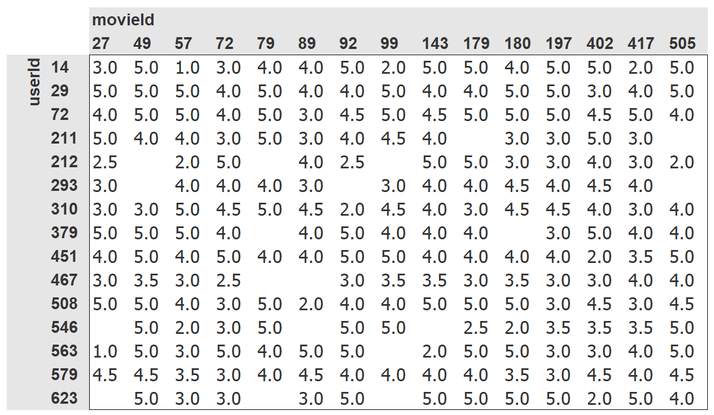

# Collaborative Filtering Deep Dive

# 协同过滤深度研究

One very common problem to solve is when you have a number of users and a number of products, and you want to recommend which products are most likely to be useful for which users. There are many variations of this: for example, recommending movies (such as on Netflix), figuring out what to highlight for a user on a home page, deciding what stories to show in a social media feed, and so forth. There is a general solution to this problem, called *collaborative filtering*, which works like this: look at what products the current user has used or liked, find other users that have used or liked similar products, and then recommend other products that those users have used or liked.

一个要解决的常见问题是，当你有一定数量的用户和一定数量的产品，你希望推荐哪些产品最可能对哪些用户有用。对于这个问题有很多变化：例如，推荐电影（如网飞），计算出用户的网页上要高亮显示哪些内容，决定社交媒体中显示哪些故事，等等。对于这个问题这有一个常用解决方案称为*协同过滤*，它的工作方式：看当前用户已经使用或喜爱了哪些产品，寻找其它用户已经使用或喜爱的类似产品，然后推荐其它那些用户已经使用或喜爱的产品。

For example, on Netflix you may have watched lots of movies that are science fiction, full of action, and were made in the 1970s. Netflix may not know these particular properties of the films you have watched, but it will be able to see that other people that have watched the same movies that you watched also tended to watch other movies that are science fiction, full of action, and were made in the 1970s. In other words, to use this approach we don't necessarily need to know anything about the movies, except who like to watch them.

例如，在网飞上你可能已经看了很多充满动作的科幻电影，这些电影在1970年代制作的。网飞可能不知道这些你看过的电影的特定属性，但是它将能够查看和你观看相同电影的其它人，倾向看其它的充满动作的在1970年代制作的科幻电影。换句话说，用这个方法除了人们喜欢观看这些电影，我们不需要知道关于电影的任何信息，

There is actually a more general class of problems that this approach can solve, not necessarily involving users and products. Indeed, for collaborative filtering we more commonly refer to *items*, rather than *products*. Items could be links that people click on, diagnoses that are selected for patients, and so forth.

事实上有一些更一般问题类型用这个方法能够解决，不必包含用户和产品。确实，对于协同过滤我们更常指的是*项目*，而不是*产品*。项目能够关联人们的点击，对病人选择的诊断，等等。

The key foundational idea is that of *latent factors*. In the Netflix example, we started with the assumption that you like old, action-packed sci-fi movies. But you never actually told Netflix that you like these kinds of movies. And Netflix never actually needed to add columns to its movies table saying which movies are of these types. Still, there must be some underlying concept of sci-fi, action, and movie age, and these concepts must be relevant for at least some people's movie watching decisions.

关键的基础想法是那些潜在因素。在网飞的例子中，我们从假设你喜欢老的科幻动作电影开始。但你实际上永远不会告诉网飞你喜欢这些类型的电影。并且网飞实际上永远不需要在它的电影表中添加一列，来描述这些电影是这些类型。然而，必然有一些潜在的科幻、运作和电影年代的概念，这些概念一定至少与一些人的观看决策是关联的。

For this chapter we are going to work on this movie recommendation problem. We'll start by getting some data suitable for a collaborative filtering model.

这一章，我们将处理这个电影推荐问题。我们会从通过取得一些对于协同过滤模型合适的数据开始。

## A First Look at the Data

## 首先查看数据

We do not have access to Netflix's entire dataset of movie watching history, but there is a great dataset that we can use, called [MovieLens](https://grouplens.org/datasets/movielens/). This dataset contains tens of millions of movie rankings (a combination of a movie ID, a user ID, and a numeric rating), although we will just use a subset of 100,000 of them for our example. If you're interested, it would be a great learning project to try and replicate this approach on the full 25-million recommendation dataset, which you can get from their website.

The dataset is available through the usual fastai function:

我们没有网飞电影观看历史的整个数据集权限，但有一个很好的数据集我们能够使用，称为[MovieLens](https://grouplens.org/datasets/movielens/)。这个数据集包含了数千万的电影排名（一个电影ID,一个用户ID和一个数字等级的组合），然而对于我们的事例我们只会用到这个数据集中的十万条数据的子集。如果你有兴趣，在完整的两千五百万条数据的推荐数据集上，这会是一个非常好的学习项目来尝试和复制这个方法，你能够从它们的网站上获取。

通过使用fastai函数可获取到这个数据集：

```
from fastai.collab import *
from fastai.tabular.all import *
path = untar_data(URLs.ML_100k)
```

According to the *README*, the main table is in the file *u.data*. It is tab-separated and the columns are, respectively user, movie, rating, and timestamp. Since those names are not encoded, we need to indicate them when reading the file with Pandas. Here is a way to open this table and take a look:

根据*说明*，主表是在文件*u.data*中。它是跳格分割，列分别是用户、电影、等级和时间戳。因为那些名子不是编码过的，当用Pandas读取文件时，我们需要标示它们。下面是打开这个表并查询的方法：

```
ratings = pd.read_csv(path/'u.data', delimiter='\t', header=None,
                      names=['user','movie','rating','timestamp'])
ratings.head()
```

|      | user | movie | rating | timestamp |
| ---: | ---: | ----: | -----: | --------: |
|    0 |  196 |   242 |      3 | 881250949 |
|    1 |  186 |   302 |      3 | 891717742 |
|    2 |   22 |   377 |      1 | 878887116 |
|    3 |  244 |    51 |      2 | 880606923 |
|    4 |  166 |   346 |      1 | 886397596 |

Although this has all the information we need, it is not a particularly helpful way for humans to look at this data. <movie_xtab> shows the same data cross-tabulated into a human-friendly table.

虽然有我们需要所有信息，对于人类看这些数据它不是特别有帮助的方法。图<电影和用户的交叉表>显示了同样的数据，交叉表对人类很友好的表格。

<div style="text-align:center">
  <p align="center">
    
  </p>
  <p align="center">图：电影和用户的交叉表</p>
</div>

We have selected just a few of the most popular movies, and users who watch the most movies, for this crosstab example. The empty cells in this table are the things that we would like our model to learn to fill in. Those are the places where a user has not reviewed the movie yet, presumably because they have not watched it. For each user, we would like to figure out which of those movies they might be most likely to enjoy.

这个交叉表例子中，我们选择了一些只是最流行的电影和用户观看最多的电影。在这个表中空的单元格是我们希望模型来学习填充的内容。那些地方用户还没有评论的地方，大概因为他们还没有观看。对于各个用户，我们希望计算出那些电影中的哪些他们可能最喜欢。

If we knew for each user to what degree they liked each important category that a movie might fall into, such as genre, age, preferred directors and actors, and so forth, and we knew the same information about each movie, then a simple way to fill in this table would be to multiply this information together for each movie and use a combination. For instance, assuming these factors range between -1 and +1, with positive numbers indicating stronger matches and negative numbers weaker ones, and the categories are science-fiction, action, and old movies, then we could represent the movie *The Last Skywalker* as:

如果我们知道每一名用户他们喜欢电影可能属于每个重要分类的程度，如类型、年代、偏好的导演和演员，等等，我们知道关于每部电影同样的信息，然后一个简单的填写这个表的方法也许是对于每部电影把这个信息乘起来并组合使用。例如，假设这些因素的范围在-1到+1之间，正数指标更强烈匹配，负数指标更弱的匹配，这些分类是科幻、动作和老电影，然后我们能够描述*最后的天行者*这部电影为：

```
last_skywalker = np.array([0.98,0.9,-0.9])
```

Here, for instance, we are scoring *very science-fiction* as 0.98, and *very not old* as -0.9. We could represent a user who likes modern sci-fi action movies as:

例如，在这里我们非常科幻的分类为0.98，不是非常老的电影为-0.9。我们能够描述喜欢现代科幻电影的用户为：

```
user1 = np.array([0.9,0.8,-0.6])
```

and we can now calculate the match between this combination:

现在我们能够计算这些组合之间的匹配度：

```
(user1*last_skywalker).sum()
```

Out: 2.1420000000000003

When we multiply two vectors together and add up the results, this is known as the *dot product*. It is used a lot in machine learning, and forms the basis of matrix multiplication. We will be looking a lot more at matrix multiplication and dot products in <chapter_foundations>.

> jargon: dot product: The mathematical operation of multiplying the elements of two vectors together, and then summing up the result.

On the other hand, we might represent the movie *Casablanca* as:

当我们把两个向量乘起来并加总结果，这被称为*点积*。在机器学习中它是被大量使用的，并构成矩阵乘法的基础。在<章节：基础>中我们会大量看到矩阵乘法和点积。

> 术语：点积：两个向量元素乘法的数学运算，然后把结果加总。

```
casablanca = np.array([-0.99,-0.3,0.8])
```

The match between this combination is:

这个组合的匹配是：

```
(user1*casablanca).sum()
```

Out: -1.611

Since we don't know what the latent factors actually are, and we don't know how to score them for each user and movie, we should learn them.

因为我们不知道实际的潜在因素是什么，且我们不知道对每名用户和电影如何来打分，我们应该学习他们。