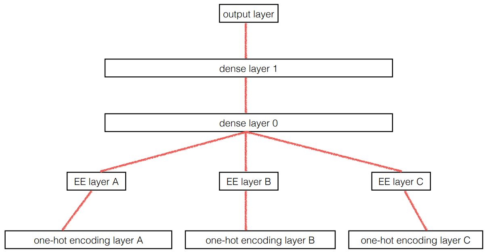

# Tabular Modeling Deep Dive

# 表格模型深潜

Tabular modeling takes data in the form of a table (like a spreadsheet or CSV). The objective is to predict the value in one column based on the values in the other columns. In this chapter we will not only look at deep learning but also more general machine learning techniques like random forests, as they can give better results depending on your problem.

表格模型接受表格形式的数据（像电子表格或CSV）。目标是基于其它列的值预测某一列的值。在本章节我们不仅会看深度学习，而且看更多常用的如随机森林这样的机器学习技术，基于我们的问题它们能够产生更好的结果。

We will look at how we should preprocess and clean the data as well as how to interpret the result of our models after training, but first, we will see how we can feed columns that contain categories into a model that expects numbers by using embeddings.

我们会看到我们应该如何处理和清理术语，和如何解释训练后我们模型的结果，但首先，我们会看通过嵌入我们如何能够把包含分类的那些列送入期望数字的模型中。

## Categorical Embeddings

## 分类嵌入

In tabular data some columns may contain numerical data, like "age," while others contain string values, like "sex." The numerical data can be directly fed to the model (with some optional preprocessing), but the other columns need to be converted to numbers. Since the values in those correspond to different categories, we often call this type of variables *categorical variables*. The first type are called *continuous variables*.

在表格数据中，一些列可能包含数值数据，如“年龄”，与此同时其它列包含字符串值，如“性别”。数值数据能够直接喂给模型（和可远的预处理），但是其它列需要转换为数值。因为那些值对应不同的分类，我们经常称这些变量类型为*分类变量*。第一种类型称为*连续变量*。

> jargon: Continuous and Categorical Variables: Continuous variables are numerical data, such as "age," that can be directly fed to the model, since you can add and multiply them directly. Categorical variables contain a number of discrete levels, such as "movie ID," for which addition and multiplication don't have meaning (even if they're stored as numbers).

> 术语：连续和分类变量：联系变量是数值数据，如“年龄”，能够直接喂给模型，因为你能够直接加和乘他们。分类变量包含包含一些分离并列的数据，如“电影ID”，对其加和乘法运算没有意思（即使它被以数值型存储）。

At the end of 2015, the [Rossmann sales competition](https://www.kaggle.com/c/rossmann-store-sales) ran on Kaggle. Competitors were given a wide range of information about various stores in Germany, and were tasked with trying to predict sales on a number of days. The goal was to help the company to manage stock properly and be able to satisfy demand without holding unnecessary inventory. The official training set provided a lot of information about the stores. It was also permitted for competitors to use additional data, as long as that data was made public and available to all participants.

在2015年末，Kaggle举办了[罗斯曼销售竞赛](https://www.kaggle.com/c/rossmann-store-sales) 。参赛者被提供了关于在德国的各种商店范围广泛的信息，并在许多天数上尝试预测销量的任务。目标是帮助公司管理库存资产并能够不持有不必要的库存清单来满足需求。官方的训练集提供了许多商店的信息。也允许参赛者使用附加数据，只要数据是公共产生的和所有参与者都可获得的。

One of the gold medalists used deep learning, in one of the earliest known examples of a state-of-the-art deep learning tabular model. Their method involved far less feature engineering, based on domain knowledge, than those of the other gold medalists. The paper, ["Entity Embeddings of Categorical Variables"](https://arxiv.org/abs/1604.06737) describes their approach. In an online-only chapter on the [book's website](https://book.fast.ai/) we show how to replicate it from scratch and attain the same accuracy shown in the paper. In the abstract of the paper the authors (Cheng Guo and Felix Berkhahn) say:

一名金奖得主使用了深度学习，是一个最早被熟知的先进深度学习表格模型的例子。相比那些其它金奖得主他们方法依据领域知识涉及更少的特征工程。论文[“分类变量的实体嵌入”](https://arxiv.org/abs/1604.06737)描述了他们的方法。只有在[本书网站](https://book.fast.ai/) 上的在线章节我们描述了如何从零再现它并获取在文章中相同的精度。在论文的摘要中作者（郭程和费利克斯·伯哈恩）说到：

> : Entity embedding not only reduces memory usage and speeds up neural networks compared with one-hot encoding, but more importantly by mapping similar values close to each other in the embedding space it reveals the intrinsic properties of the categorical variables... [It] is especially useful for datasets with lots of high cardinality features, where other methods tend to overfit... As entity embedding defines a distance measure for categorical variables it can be used for visualizing categorical data and for data clustering.

> ：相比独热编码，实体嵌入不仅仅减少了内存使用和加速了神经网络，而且更重要的通过映射在嵌入空间中彼此接近的相似值，它揭示了分类变量的本质属性...【它】对有很多高基数特征的数据集尤为有用，其它方法会导致过拟...实体嵌入定义了分类变量的一个距离测量，它能够被用于可视化分类数据和数据群集。

We have already noticed all of these points when we built our collaborative filtering model. We can clearly see that these insights go far beyond just collaborative filtering, however.

当我们构建协同过滤模型时，我们已经注意到了这些所有点。然而，我们能够清晰的看到这些深刻见解远不只是协同过滤。

The paper also points out that (as we discussed in the last chapter) an embedding layer is exactly equivalent to placing an ordinary linear layer after every one-hot-encoded input layer. The authors used the diagram in <entity_emb> to show this equivalence. Note that "dense layer" is a term with the same meaning as "linear layer," and the one-hot encoding layers represent inputs.

这篇论文也指出（作为在本章最后我们讨论），一个嵌入层是完全等价于放置在每个独热编码输入层后的普通线性层。作者使用了<在神经网络中实体嵌入>示意图来展示了这个等价。注意“全连接层”是一个与“线性层”相同含义的术语，独热编码层代表输入。

  

    
  

  
图：在神经网络中实体嵌入

The insight is important because we already know how to train linear layers, so this shows that from the point of view of the architecture and our training algorithm the embedding layer is just another layer. We also saw this in practice in the last chapter, when we built a collaborative filtering neural network that looks exactly like this diagram.

这一见解是很重要的，因为我们已经知道如何来训练线性层，所以这展示了来自训练算法和架构的观点，嵌入层只是另外的层。在最后的章节实践中我们也会看，当我们创建一个协同过滤神经网络看起来完全像这个示意图。

Where we analyzed the embedding weights for movie reviews, the authors of the entity embeddings paper analyzed the embedding weights for their sales prediction model. What they found was quite amazing, and illustrates their second key insight. This is that the embedding transforms the categorical variables into inputs that are both continuous and meaningful.

在我们分析了对于电影评价的嵌入权重的地方，实体嵌入论文作者分析了它们的销售预测模型的嵌入权重。他们的发现是十分令人振奋的，并插图说明了他们的第二个关键见解。这就是嵌入转换分类变量为连续和有意义的输入。

The images in <state_emb> illustrate these ideas. They are based on the approaches used in the paper, along with some analysis we have added.

在<州嵌入和地图>图像中说明了这些想法。他们是基于在论文中使用的方法，连同一些我们已经添加的分析。

  

    
  

  
图：州嵌入和地图

On the left is a plot of the embedding matrix for the possible values of the `State` category. For a categorical variable we call the possible values of the variable its "levels" (or "categories" or "classes"), so here one level is "Berlin," another is "Hamburg," etc. On the right is a map of Germany. The actual physical locations of the German states were not part of the provided data, yet the model itself learned where they must be, based only on the behavior of store sales!

左侧是对于`状态`分类可能值的嵌入矩阵图像。对于分类变量，我们称变量的可能值为“级别”（或“种类”或“类别”），所以这里一级别是“柏林”，另一个级别是“汉堡”，等等。在右侧是德国地图。德国州的实际物理位置不是数据提供的部分，只是基于商店销售的行为，模型还自己学习了他们一定在什么地方。

Do you remember how we talked about *distance* between embeddings? The authors of the paper plotted the distance between store embeddings against the actual geographic distance between the stores (see <store_emb>). They found that they matched very closely!

你还记得我们讲过的嵌入之间的距离吗？论文的作者以商店间实际的地理距离为背景绘制了商店嵌入间的距离（看<商店距离>）。我们发现他们的匹配非常接近！

  

    
  

  
图：商店距离

We've even tried plotting the embeddings for days of the week and months of the year, and found that days and months that are near each other on the calendar ended up close as embeddings too, as shown in <date_emb>.

我们甚至尝试为周的天数和年的月数绘制了嵌入，且发现在日历上彼此接近的天和月最终也接近嵌入，如图<日期嵌入>所示：

  

    
  

  
图：日期嵌入

What stands out in these two examples is that we provide the model fundamentally categorical data about discrete entities (e.g., German states or days of the week), and then the model learns an embedding for these entities that defines a continuous notion of distance between them. Because the embedding distance was learned based on real patterns in the data, that distance tends to match up with our intuitions.

在这两个例子中突出的内容是我们提供的关于分离实体（即，德国洲或周的天数）基本的分类数据模型，然后模型对于这些界定了他们间距离的连续概念的实体学习一个嵌入。因为实体距离是基于数据中的真实模式学习的，距离趋向与我们的直觉相匹配。

In addition, it is valuable in its own right that embeddings are continuous, because models are better at understanding continuous variables. This is unsurprising considering models are built of many continuous parameter weights and continuous activation values, which are updated via gradient descent (a learning algorithm for finding the minimums of continuous functions).

另外，嵌入是连续的在它自己的正确性上是很有价值的，因为模型更擅长理解连续变量。考虑到模型是由很多连续参数权重和连续激活值的构建，就不奇怪了，这些值是通过梯度下降更新的（寻找连续函数最小值的学习算法）。

Another benefit is that we can combine our continuous embedding values with truly continuous input data in a straightforward manner: we just concatenate the variables, and feed the concatenation into our first dense layer. In other words, the raw categorical data is transformed by an embedding layer before it interacts with the raw continuous input data. This is how fastai and Guo and Berkhahn handle tabular models containing continuous and categorical variables.

其它好处是，用实际连续输入数据我们能够用一个直接了当的方式组合连续嵌入值：我们只连接变量，并把连接喂给我们第一个全连接层。换句话说，原生分类数据在它与原生连续输入数据交互前，通过一个嵌入层转换了。这就是fastai、郭和伯哈恩如何处理含有连续和分类变量表格模型的。

An example using this concatenation approach is how Google does its recommendations on Google Play, as explained in the paper ["Wide & Deep Learning for Recommender Systems"](https://arxiv.org/abs/1606.07792). <google_recsys> illustrates.

有一个使用这一连接方法，谷歌如何在谷歌播放器上做推荐的例子，在论文[推荐系统的广泛深度学习](https://arxiv.org/abs/1606.07792)中做了解释。下图<谷歌播放器推荐系统>的插图说明。

  

    
  

  
图：谷歌播放器推荐系统

Interestingly, the Google team actually combined both approaches we saw in the previous chapter: the dot product (which they call *cross product*) and neural network approaches.

有意思的是，谷歌团队实际组合我们在上一章节看到的两个方法：点积（它们称其为*向量积* 和神经网络方法）

Let's pause for a moment. So far, the solution to all of our modeling problems has been: *train a deep learning model*. And indeed, that is a pretty good rule of thumb for complex unstructured data like images, sounds, natural language text, and so forth. Deep learning also works very well for collaborative filtering. But it is not always the best starting point for analyzing tabular data.

让我们暂停一会。到目前为止，对于我们所有建模问题的解决方案是：*训练一个深度学习模型*。事实上，对于如图像、声音、自然语言文本等等复杂的非结构数据，这是非常好的经验法则。对于协同过滤深度学习也工作的非常好。但对于分析表格数据它一直都不是最佳的起始点。