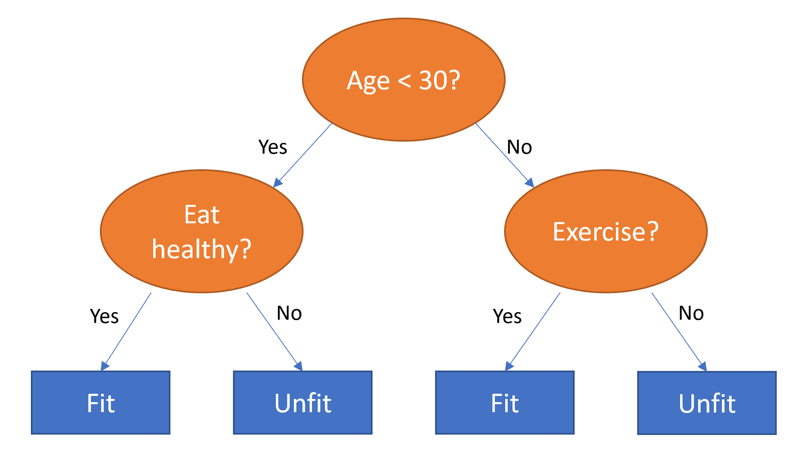

# Tabular Modeling Deep Dive

# 表格模型深潜

Tabular modeling takes data in the form of a table (like a spreadsheet or CSV). The objective is to predict the value in one column based on the values in the other columns. In this chapter we will not only look at deep learning but also more general machine learning techniques like random forests, as they can give better results depending on your problem.

表格模型接受表格形式的数据（像电子表格或CSV）。目标是基于其它列的值预测某一列的值。在本章节我们不仅会看深度学习，而且看更多常用的如随机森林这样的机器学习技术，基于我们的问题它们能够产生更好的结果。

We will look at how we should preprocess and clean the data as well as how to interpret the result of our models after training, but first, we will see how we can feed columns that contain categories into a model that expects numbers by using embeddings.

我们会看到我们应该如何处理和清理术语，和如何解释训练后我们模型的结果，但首先，我们会看通过嵌入我们如何能够把包含分类的那些列送入期望数字的模型中。

## Categorical Embeddings

## 分类嵌入

In tabular data some columns may contain numerical data, like "age," while others contain string values, like "sex." The numerical data can be directly fed to the model (with some optional preprocessing), but the other columns need to be converted to numbers. Since the values in those correspond to different categories, we often call this type of variables *categorical variables*. The first type are called *continuous variables*.

在表格数据中，一些列可能包含数值数据，如“年龄”，与此同时其它列包含字符串值，如“性别”。数值数据能够直接喂给模型（和可远的预处理），但是其它列需要转换为数值。因为那些值对应不同的分类，我们经常称这些变量类型为*分类变量*。第一种类型称为*连续变量*。

> jargon: Continuous and Categorical Variables: Continuous variables are numerical data, such as "age," that can be directly fed to the model, since you can add and multiply them directly. Categorical variables contain a number of discrete levels, such as "movie ID," for which addition and multiplication don't have meaning (even if they're stored as numbers).

> 术语：连续和分类变量：联系变量是数值数据，如“年龄”，能够直接喂给模型，因为你能够直接加和乘他们。分类变量包含包含一些分离并列的数据，如“电影ID”，对其加和乘法运算没有意思（即使它被以数值型存储）。

At the end of 2015, the [Rossmann sales competition](https://www.kaggle.com/c/rossmann-store-sales) ran on Kaggle. Competitors were given a wide range of information about various stores in Germany, and were tasked with trying to predict sales on a number of days. The goal was to help the company to manage stock properly and be able to satisfy demand without holding unnecessary inventory. The official training set provided a lot of information about the stores. It was also permitted for competitors to use additional data, as long as that data was made public and available to all participants.

在2015年末，Kaggle举办了[罗斯曼销售竞赛](https://www.kaggle.com/c/rossmann-store-sales) 。参赛者被提供了关于在德国的各种商店范围广泛的信息，并在许多天数上尝试预测销量的任务。目标是帮助公司管理库存资产并能够不持有不必要的库存清单来满足需求。官方的训练集提供了许多商店的信息。也允许参赛者使用附加数据，只要数据是公共产生的和所有参与者都可获得的。

One of the gold medalists used deep learning, in one of the earliest known examples of a state-of-the-art deep learning tabular model. Their method involved far less feature engineering, based on domain knowledge, than those of the other gold medalists. The paper, ["Entity Embeddings of Categorical Variables"](https://arxiv.org/abs/1604.06737) describes their approach. In an online-only chapter on the [book's website](https://book.fast.ai/) we show how to replicate it from scratch and attain the same accuracy shown in the paper. In the abstract of the paper the authors (Cheng Guo and Felix Berkhahn) say:

一名金奖得主使用了深度学习，是一个最早被熟知的先进深度学习表格模型的例子。相比那些其它金奖得主他们方法依据领域知识涉及更少的特征工程。论文[“分类变量的实体嵌入”](https://arxiv.org/abs/1604.06737)描述了他们的方法。只有在[本书网站](https://book.fast.ai/) 上的在线章节我们描述了如何从零再现它并获取在文章中相同的精度。在论文的摘要中作者（郭程和费利克斯·伯哈恩）说到：

> : Entity embedding not only reduces memory usage and speeds up neural networks compared with one-hot encoding, but more importantly by mapping similar values close to each other in the embedding space it reveals the intrinsic properties of the categorical variables... [It] is especially useful for datasets with lots of high cardinality features, where other methods tend to overfit... As entity embedding defines a distance measure for categorical variables it can be used for visualizing categorical data and for data clustering.

> ：相比独热编码，实体嵌入不仅仅减少了内存使用和加速了神经网络，而且更重要的通过映射在嵌入空间中彼此接近的相似值，它揭示了分类变量的本质属性...【它】对有很多高基数特征的数据集尤为有用，其它方法会导致过拟...实体嵌入定义了分类变量的一个距离测量，它能够被用于可视化分类数据和数据群集。

We have already noticed all of these points when we built our collaborative filtering model. We can clearly see that these insights go far beyond just collaborative filtering, however.

当我们构建协同过滤模型时，我们已经注意到了这些所有点。然而，我们能够清晰的看到这些深刻见解远不只是协同过滤。

The paper also points out that (as we discussed in the last chapter) an embedding layer is exactly equivalent to placing an ordinary linear layer after every one-hot-encoded input layer. The authors used the diagram in <entity_emb> to show this equivalence. Note that "dense layer" is a term with the same meaning as "linear layer," and the one-hot encoding layers represent inputs.

这篇论文也指出（作为在本章最后我们讨论），一个嵌入层是完全等价于放置在每个独热编码输入层后的普通线性层。作者使用了<在神经网络中实体嵌入>示意图来展示了这个等价。注意“全连接层”是一个与“线性层”相同含义的术语，独热编码层代表输入。

<div style="text-align:center">
  <p align="center">
    
  </p>
  <p align="center">图：在神经网络中实体嵌入</p>
</div>

The insight is important because we already know how to train linear layers, so this shows that from the point of view of the architecture and our training algorithm the embedding layer is just another layer. We also saw this in practice in the last chapter, when we built a collaborative filtering neural network that looks exactly like this diagram.

这一见解是很重要的，因为我们已经知道如何来训练线性层，所以这展示了来自训练算法和架构的观点，嵌入层只是另外的层。在最后的章节实践中我们也会看，当我们创建一个协同过滤神经网络看起来完全像这个示意图。

Where we analyzed the embedding weights for movie reviews, the authors of the entity embeddings paper analyzed the embedding weights for their sales prediction model. What they found was quite amazing, and illustrates their second key insight. This is that the embedding transforms the categorical variables into inputs that are both continuous and meaningful.

在我们分析了对于电影评价的嵌入权重的地方，实体嵌入论文作者分析了它们的销售预测模型的嵌入权重。他们的发现是十分令人振奋的，并插图说明了他们的第二个关键见解。这就是嵌入转换分类变量为连续和有意义的输入。

The images in <state_emb> illustrate these ideas. They are based on the approaches used in the paper, along with some analysis we have added.

在<州嵌入和地图>图像中说明了这些想法。他们是基于在论文中使用的方法，连同一些我们已经添加的分析。

<div style="text-align:center">
  <p align="center">
    
  </p>
  <p align="center">图：州嵌入和地图</p>
</div>

On the left is a plot of the embedding matrix for the possible values of the `State` category. For a categorical variable we call the possible values of the variable its "levels" (or "categories" or "classes"), so here one level is "Berlin," another is "Hamburg," etc. On the right is a map of Germany. The actual physical locations of the German states were not part of the provided data, yet the model itself learned where they must be, based only on the behavior of store sales!

左侧是对于`状态`分类可能值的嵌入矩阵图像。对于分类变量，我们称变量的可能值为“级别”（或“种类”或“类别”），所以这里一级别是“柏林”，另一个级别是“汉堡”，等等。在右侧是德国地图。德国州的实际物理位置不是数据提供的部分，只是基于商店销售的行为，模型还自己学习了他们一定在什么地方。

Do you remember how we talked about *distance* between embeddings? The authors of the paper plotted the distance between store embeddings against the actual geographic distance between the stores (see <store_emb>). They found that they matched very closely!

你还记得我们讲过的嵌入之间的距离吗？论文的作者以商店间实际的地理距离为背景绘制了商店嵌入间的距离（看<商店距离>）。我们发现他们的匹配非常接近！

<div style="text-align:center">
  <p align="center">
    
  </p>
  <p align="center">图：商店距离</p>
</div>

We've even tried plotting the embeddings for days of the week and months of the year, and found that days and months that are near each other on the calendar ended up close as embeddings too, as shown in <date_emb>.

我们甚至尝试为周的天数和年的月数绘制了嵌入，且发现在日历上彼此接近的天和月最终也接近嵌入，如图<日期嵌入>所示：

<div style="text-align:center">
  <p align="center">
    
  </p>
  <p align="center">图：日期嵌入</p>
</div>

What stands out in these two examples is that we provide the model fundamentally categorical data about discrete entities (e.g., German states or days of the week), and then the model learns an embedding for these entities that defines a continuous notion of distance between them. Because the embedding distance was learned based on real patterns in the data, that distance tends to match up with our intuitions.

在这两个例子中突出的内容是我们提供的关于分离实体（例如，德国洲或周的天数）基本的分类数据模型，然后模型对于这些界定了他们间距离的连续概念的实体学习一个嵌入。因为实体距离是基于数据中的真实模式学习的，距离趋向与我们的直觉相匹配。

In addition, it is valuable in its own right that embeddings are continuous, because models are better at understanding continuous variables. This is unsurprising considering models are built of many continuous parameter weights and continuous activation values, which are updated via gradient descent (a learning algorithm for finding the minimums of continuous functions).

另外，嵌入是连续的在它自己的正确性上是很有价值的，因为模型更擅长理解连续变量。考虑到模型是由很多连续参数权重和连续激活值的构建，就不奇怪了，这些值是通过梯度下降更新的（寻找连续函数最小值的学习算法）。

Another benefit is that we can combine our continuous embedding values with truly continuous input data in a straightforward manner: we just concatenate the variables, and feed the concatenation into our first dense layer. In other words, the raw categorical data is transformed by an embedding layer before it interacts with the raw continuous input data. This is how fastai and Guo and Berkhahn handle tabular models containing continuous and categorical variables.

其它好处是，用实际连续输入数据我们能够用一个直接了当的方式组合连续嵌入值：我们只连接变量，并把连接喂给我们第一个全连接层。换句话说，原生分类数据在它与原生连续输入数据交互前，通过一个嵌入层转换了。这就是fastai、郭和伯哈恩如何处理含有连续和分类变量表格模型的。

An example using this concatenation approach is how Google does its recommendations on Google Play, as explained in the paper ["Wide & Deep Learning for Recommender Systems"](https://arxiv.org/abs/1606.07792). <google_recsys> illustrates.

有一个使用这一连接方法，谷歌如何在谷歌播放器上做推荐的例子，在论文[推荐系统的广泛深度学习](https://arxiv.org/abs/1606.07792)中做了解释。下图<谷歌播放器推荐系统>的插图说明。

<div style="text-align:center">
  <p align="center">
    
  </p>
  <p align="center">图：谷歌播放器推荐系统</p>
</div>

Interestingly, the Google team actually combined both approaches we saw in the previous chapter: the dot product (which they call *cross product*) and neural network approaches.

有意思的是，谷歌团队实际组合我们在上一章节看到的两个方法：点积（它们称其为*向量积* 和神经网络方法）

Let's pause for a moment. So far, the solution to all of our modeling problems has been: *train a deep learning model*. And indeed, that is a pretty good rule of thumb for complex unstructured data like images, sounds, natural language text, and so forth. Deep learning also works very well for collaborative filtering. But it is not always the best starting point for analyzing tabular data.

让我们暂停一会。到目前为止，对于我们所有建模问题的解决方案是：*训练一个深度学习模型*。事实上，对于如图像、声音、自然语言文本等等复杂的非结构数据，这是非常好的经验法则。对于协同过滤深度学习也工作的非常好。但对于分析表格数据它一直都不是最佳的起始点。

## Beyond Deep Learning

## 深度学习之外

Most machine learning courses will throw dozens of different algorithms at you, with a brief technical description of the math behind them and maybe a toy example. You're left confused by the enormous range of techniques shown and have little practical understanding of how to apply them.

大多数机器学习教程会抛给你很多困难的算法，在这些算法之后有数学的简短技术描述，有可能是一个小例子。通过庞大范围的技术展示和有一些如何应用它们的实践理解，你被搞糊涂了。

The good news is that modern machine learning can be distilled down to a couple of key techniques that are widely applicable. Recent studies have shown that the vast majority of datasets can be best modeled with just two methods:

1. Ensembles of decision trees (i.e., random forests and gradient boosting machines), mainly for structured data (such as you might find in a database table at most companies)
2. Multilayered neural networks learned with SGD (i.e., shallow and/or deep learning), mainly for unstructured data (such as audio, images, and natural language)

好消息是现代机器学习能够提炼几个被广泛应用的技术。最近的研究显示绝大多数数据集只用两个方法就能够被最好的建模：

1. 决策树集合（即，随机森林和梯度推进机），主要用于结构化数据（如在大多数公司的数据库表中你可以找到）
2. 多层神经网络随机梯度下降学习（即，浅层和/或深度学习），主要用于非结构化数据（如音频、图像和自然语言）

Although deep learning is nearly always clearly superior for unstructured data, these two approaches tend to give quite similar results for many kinds of structured data. But ensembles of decision trees tend to train faster, are often easier to interpret, do not require special GPU hardware for inference at scale, and often require less hyperparameter tuning. They have also been popular for quite a lot longer than deep learning, so there is a more mature ecosystem of tooling and documentation around them.

虽然深度学习对于非结构化数据几乎一直明显更优，对于很多类型的结构化数据这两个方法倾向给出完全相似的结果。但决策树集合训练更快，通常更容易解释，对于大规模推理不需要特定的GPU硬件，且通常需要较少的超参调优。相比机器学习它们已经流行了相当长的时间，所以在它们周边有更成熟的工作和文档生态。

Most importantly, the critical step of interpreting a model of tabular data is significantly easier for decision tree ensembles. There are tools and methods for answering the pertinent questions, like: Which columns in the dataset were the most important for your predictions? How are they related to the dependent variable? How do they interact with each other? And which particular features were most important for some particular observation?

更主要的是，对于决策树集合解释表格数据模型的关键步骤明显更容易。有工作和方法回答相关问题，如：在数据集中的哪一列对于你的预测是最重要的？他们如何关联到因变量？他们彼此如何交互？对于一些特定观察哪些特定特征是最重要的？

Therefore, ensembles of decision trees are our first approach for analyzing a new tabular dataset.

因此，决策树集合是我们分析一个新的表格数据集的第一个方法。

The exception to this guideline is when the dataset meets one of these conditions:

- There are some high-cardinality categorical variables that are very important ("cardinality" refers to the number of discrete levels representing categories, so a high-cardinality categorical variable is something like a zip code, which can take on thousands of possible levels).
- There are some columns that contain data that would be best understood with a neural network, such as plain text data.

当数据集遇到这些条件之一时的这个例外指导方针：

- 有一些高基数分类变量是非常重要的（“基数”指的是代表类别的许多离散级别数目，所以高基数分类变量是如地区码这样的内容，它能够接受数千可能的级别）。
- 有一些列包含了最好用神经网络来理解的数据，如纯文本数据。

In practice, when we deal with datasets that meet these exceptional conditions, we always try both decision tree ensembles and deep learning to see which works best. It is likely that deep learning will be a useful approach in our example of collaborative filtering, as we have at least two high-cardinality categorical variables: the users and the movies. But in practice things tend to be less cut-and-dried, and there will often be a mixture of high- and low-cardinality categorical variables and continuous variables.

在实践中，当我们处理数据集遇到这些例外条件时，我们总会尝试决策树和深度学习两者，来看哪一个工作的更好。可能深度学习在我们协同过滤例子中会是一个有用的方法，我们有至少两个高基数分类变量：用户和电影。但现实中的事情不是一成不变的，经常会有高和低基数分类变量和连续变量的混合体。

Either way, it's clear that we are going to need to add decision tree ensembles to our modeling toolbox!

不管哪种方式它都是很明显的，我们将需要添加决策树集合到我们建模工具箱！

Up to now we've used PyTorch and fastai for pretty much all of our heavy lifting. But these libraries are mainly designed for algorithms that do lots of matrix multiplication and derivatives (that is, stuff like deep learning!). Decision trees don't depend on these operations at all, so PyTorch isn't much use.

截至现在，对于我们几乎所有的困难任务我们已经使用PyTorch和fastai。但是这些库主要的设计为了用于算法，做大量的矩阵乘法和除法（即这些内容就像深度学习！）。决策树完全不依赖这些操作，所以PyTorch用的不太多。

Instead, we will be largely relying on a library called scikit-learn (also known as `sklearn`). Scikit-learn is a popular library for creating machine learning models, using approaches that are not covered by deep learning. In addition, we'll need to do some tabular data processing and querying, so we'll want to use the Pandas library. Finally, we'll also need NumPy, since that's the main numeric programming library that both sklearn and Pandas rely on.

作为替代，我们会极大的依赖名叫scikit-learn库（也被称为`sklearn`）。Scikit-learn是一个创建机器学习模型很流行的库，所使用的方法不是深度学习所覆盖的。另外，我们会需要做一些表格数据处理和查询，所以我们希望使用Pandas库。最后，我们也会需要NumPy，因为它是主要的数字程序库，sklearn和Pandas两者也依赖于它。

We don't have time to do a deep dive into all these libraries in this book, so we'll just be touching on some of the main parts of each. For a far more in depth discussion, we strongly suggest Wes McKinney's [Python for Data Analysis](http://shop.oreilly.com/product/0636920023784.do) (O'Reilly). Wes is the creator of Pandas, so you can be sure that the information is accurate!

在本书，我们没有时间对所有这些库做更入的研究，所以我们仅仅会接触每个库的一些主要部分。为了更深入的探讨，我们强烈推荐韦斯·麦金尼编写的[Python数据分析](http://shop.oreilly.com/product/0636920023784.do)（O'Reilly出版）。韦斯是Pandas的创建者，所以你能够确信书上的信息是准确的！

First, let's gather the data we will use.

首先，让我们收集将要使用的数据。

## The Dataset

## 数据集

The dataset we use in this chapter is from the Blue Book for Bulldozers Kaggle competition, which has the following description: "The goal of the contest is to predict the sale price of a particular piece of heavy equipment at auction based on its usage, equipment type, and configuration. The data is sourced from auction result postings and includes information on usage and equipment configurations."

在本章我们使用的数据集来自Kaggle比赛推土机蓝皮书，其有如下描述：“比赛的目的是基于用途、设备类型和配置来预测在拍卖市场上一种特殊重装备的拍卖价格。数据来源来自拍卖结果发布，包括使用和设备配置信息。”

This is a very common type of dataset and prediction problem, similar to what you may see in your project or workplace. The dataset is available for download on Kaggle, a website that hosts data science competitions.

这是一个非常普通的数据集类型和预测问题，与你可能在你的项目和工作场所看到的问题类似。这个数据集能够在Kaggle上有效下载，这是一个主办数据科学比赛的网站。

### Kaggle Competitions

### Kaggle 比赛

Kaggle is an awesome resource for aspiring data scientists or anyone looking to improve their machine learning skills. There is nothing like getting hands-on practice and receiving real-time feedback to help you improve your skills.

Kaggle对于渴望寻找改善他们机器学习技能的数据科学家或相关人是一个极佳的资源地。没有什么比获取手动实践和接收时时反馈更能帮助你改善你的技巧的了。

Kaggle provides:

- Interesting datasets
- Feedback on how you're doing
- A leaderboard to see what's good, what's possible, and what's state-of-the-art
- Blog posts by winning contestants sharing useful tips and techniques

Kaggle提供：

- 有趣的数据
- 反馈你做的怎么样
- 一个选手积分榜来看什么是好的，什么是可能的和什么是最先进的
- 微博发布获胜选手共享有用的技巧和技术

Until now all our datasets have been available to download through fastai's integrated dataset system. However, the dataset we will be using in this chapter is only available from Kaggle. Therefore, you will need to register on the site, then go to the [page for the competition](https://www.kaggle.com/c/bluebook-for-bulldozers). On that page click "Rules," then "I Understand and Accept." (Although the competition has finished, and you will not be entering it, you still have to agree to the rules to be allowed to download the data.)

截至目前，我们所有的数据集通过fastai的集成数据集系统有效下载获得。然而，本章使用的数据集只能从Kaggle上获取。因此，你将需要去这个网站注册，然后到[这个比赛的页面](https://www.kaggle.com/c/bluebook-for-bulldozers)。在那个页面上点击“规则”，然后“我理解并接受。”（虽然比赛已经结束，你将不能进入这个比赛，但你仍必须同意规则以被允许下载数据。）

The easiest way to download Kaggle datasets is to use the Kaggle API. You can install this using `pip` by running this in a notebook cell:

一个最容易下载Kaggle数据集的方法是使用Kaggle的API。你能够使用`pip`安装，通过notebook单元格来运行这个命令：

```
!pip install kaggle
```

You need an API key to use the Kaggle API; to get one, click on your profile picture on the Kaggle website, and choose My Account, then click Create New API Token. This will save a file called *kaggle.json* to your PC. You need to copy this key on your GPU server. To do so, open the file you downloaded, copy the contents, and paste them in the following cell in the notebook associated with this chapter (e.g., `creds = '{"username":"xxx","key":"xxx"}'`):

我需要一个API密钥来使用Kaggle API，点击Kaggle网站上你的形象头像，选择你的账户，然后点击创建新的API令牌，获取密钥。这会保存一个名为*kaggle.json*文件到你的计算机。在你的GPU服务器上你需要拷贝这个密钥。做了这个工作后，打开你下载的文件，拷贝内容并粘贴到与本章相关的notebook中的下述单元格上（例如，``creds = '{"username":"xxx","key":"xxx"}'``）:

```
creds = ''
```

Then execute this cell (this only needs to be run once):

执行这个单元格（这只需运行一次）：

```
cred_path = Path('~/.kaggle/kaggle.json').expanduser()
if not cred_path.exists():
    cred_path.parent.mkdir(exist_ok=True)
    cred_path.write_text(creds)
    cred_path.chmod(0o600)
```

Now you can download datasets from Kaggle! Pick a path to download the dataset to:

现在你能够从Kaggle上下载数据集了！选一个数据集下载到本地的路径：

```
path = URLs.path('bluebook')
path
```

Out: Path('/home/jhoward/.fastai/archive/bluebook')

```
#hide
Path.BASE_PATH = path
```

And use the Kaggle API to download the dataset to that path, and extract it:

使用Kaggle API下载数据集到这个路径，并抽取数据：

```
if not path.exists():
    path.mkdir(parents=true)
    api.competition_download_cli('bluebook-for-bulldozers', path=path)
    file_extract(path/'bluebook-for-bulldozers.zip')

path.ls(file_type='text')
```

Out: (#7) [Path('TrainAndValid.csv'),Path('Machine_Appendix.csv'),Path('random_forest_benchmark_test.csv'),Path('Test.csv'),Path('median_benchmark.csv'),Path('ValidSolution.csv'),Path('Valid.csv')]

Now that we have downloaded our dataset, let's take a look at it!

现在我们已经下载了我们的数据集，让我们查看一下它！

### Look at the Data

### 查看数据

Kaggle provides information about some of the fields of our dataset. The [Data](https://www.kaggle.com/c/bluebook-for-bulldozers/data) explains that the key fields in *train.csv* are:

- `SalesID`:: The unique identifier of the sale.
- `MachineID`:: The unique identifier of a machine. A machine can be sold multiple times.
- `saleprice`:: What the machine sold for at auction (only provided in *train.csv*).
- `saledate`:: The date of the sale.

Kaggle提供了一些我们数据集的字段信息。在*train.csv*中关键字段的[数据](https://www.kaggle.com/c/bluebook-for-bulldozers/data)解释是：

- `SalesID`：销售的唯一标示。
- `MachineID`：机械的唯一标示。一个机械能卖多次。
- `saleprice`：在拍卖会上的这台机械的出售情况（只在*train.csv*中提供了）。
- `saledate`：销售日期。

In any sort of data science work, it's important to *look at your data directly* to make sure you understand the format, how it's stored, what types of values it holds, etc. Even if you've read a description of the data, the actual data may not be what you expect. We'll start by reading the training set into a Pandas DataFrame. Generally it's a good idea to specify `low_memory=False` unless Pandas actually runs out of memory and returns an error. The `low_memory` parameter, which is `True` by default, tells Pandas to only look at a few rows of data at a time to figure out what type of data is in each column. This means that Pandas can actually end up using different data type for different rows, which generally leads to data processing errors or model training problems later.

Let's load our data and have a look at the columns:

任何形式的数据科学工作，*直接查看你的数据* 以确保你理解格式是很重要的，它是如何存贮的，它有什么类型的值，等等。即使你已经阅读了数据的描述，真实数据可能也不是你所期望的内容。我们会从通过阅读训练集到一个Pandas DataFrame中开始。通常具体说明`low_memory=False`是一个好主意，除非Pandas实际耗尽了内存并返回错误。`low_memory`参数默认为`真`，告诉Pandas一次只查看很少的几行数据，弄明白在每一列数据的类型是什么。意思是Pandas能够最终使用不同行的不同数据类型，其通常会导致数据处理错误或其后的模型训练问题。

```
df = pd.read_csv(path/'TrainAndValid.csv', low_memory=False)
```

```
df.columns
```

Out: Index(['SalesID', 'SalePrice', 'MachineID', 'ModelID', 'datasource',
       'auctioneerID', 'YearMade', 'MachineHoursCurrentMeter', 'UsageBand',
       'saledate', 'fiModelDesc', 'fiBaseModel', 'fiSecondaryDesc',
       'fiModelSeries', 'fiModelDescriptor', 'ProductSize',
       'fiProductClassDesc', 'state', 'ProductGroup', 'ProductGroupDesc',
       'Drive_System', 'Enclosure', 'Forks', 'Pad_Type', 'Ride_Control',
       'Stick', 'Transmission', 'Turbocharged', 'Blade_Extension',
       'Blade_Width', 'Enclosure_Type', 'Engine_Horsepower', 'Hydraulics',
       'Pushblock', 'Ripper', 'Scarifier', 'Tip_Control', 'Tire_Size',
       'Coupler', 'Coupler_System', 'Grouser_Tracks', 'Hydraulics_Flow',
       'Track_Type', 'Undercarriage_Pad_Width', 'Stick_Length', 'Thumb',
       'Pattern_Changer', 'Grouser_Type', 'Backhoe_Mounting', 'Blade_Type',
       'Travel_Controls', 'Differential_Type', 'Steering_Controls'],
      dtype='object')

That's a lot of columns for us to look at! Try looking through the dataset to get a sense of what kind of information is in each one. We'll shortly see how to "zero in" on the most interesting bits.

At this point, a good next step is to handle *ordinal columns*. This refers to columns containing strings or similar, but where those strings have a natural ordering. For instance, here are the levels of `ProductSize`:

这对我们来说要查看很多列！尝试通看数据集来感受每一个列的信息是什么类型。我们会简短了解一下在最感兴趣的点上如何“锁定”。

```
df['ProductSize'].unique()
```

Out: array([nan, 'Medium', 'Small', 'Large / Medium', 'Mini', 'Large', 'Compact'], dtype=object)

We can tell Pandas about a suitable ordering of these levels like so:

我能够告诉Pandas合适的排序这些级别，像这样：

```
sizes = 'Large','Large / Medium','Medium','Small','Mini','Compact'
```

```
df['ProductSize'] = df['ProductSize'].astype('category')
df['ProductSize'].cat.set_categories(sizes, ordered=True, inplace=True)
```

The most important data column is the dependent variable—that is, the one we want to predict. Recall that a model's metric is a function that reflects how good the predictions are. It's important to note what metric is being used for a project. Generally, selecting the metric is an important part of the project setup. In many cases, choosing a good metric will require more than just selecting a variable that already exists. It is more like a design process. You should think carefully about which metric, or set of metrics, actually measures the notion of model quality that matters to you. If no variable represents that metric, you should see if you can build the metric from the variables that are available.

最重要的数据列是因变量，即我们希望去预测的那个。回想一个模型的指标是一个函数，反映预测是如何的好。注意一个项目使用了什么指标是很重要的。通常，选择指标是项目设置的一个重要部分。在很多案例中，选择一个好的指标会需要不仅仅是只选择一个已经存在的变量。它更象是一个设计过程。你应该仔细的想那些指标，或指标集，实际测量对你来说很重要的那些模型质量概念。如果没有变量代表指标，你应该看是否你能够从那些有效的变量中创建指标。

However, in this case Kaggle tells us what metric to use: root mean squared log error (RMSLE) between the actual and predicted auction prices. We need do only a small amount of processing to use this: we take the log of the prices, so that `rmse` of that value will give us what we ultimately need:

然而，在本例中Kaggle告诉了我们所使用的指标：实际和预测拍卖价格间的均方根对数误差（RMSLE）。使用这个指标我们只需要做少量的处理：我们求价格的对数，所以值的`rmse`会提供给我们最终所需要的：

```
dep_var = 'SalePrice'
```

```
df[dep_var] = np.log(df[dep_var])
```

We are now ready to explore our first machine learning algorithm for tabular data: decision trees.

现在我们准备来探索我们第一个表格数据机器学习算法：决策树。

## Decision Trees

## 决策树

Decision tree ensembles, as the name suggests, rely on decision trees. So let's start there! A decision tree asks a series of binary (that is, yes or no) questions about the data. After each question the data at that part of the tree is split between a "yes" and a "no" branch, as shown in <decision_tree>. After one or more questions, either a prediction can be made on the basis of all previous answers or another question is required.

决策树集合命名表明依赖的是决策树。所以我们从那里开始！一棵决策树问了一系列关于数据的二值（即是或否）问题。每个问题后，在树的相关位置数据分为一个“是”和一个“否”两个分支。一个或多个问题后，基于所有之前提供的答案或其它必须的问题，二择一的决策就可以做出了。

<div style="text-align:center">
  <p align="center">
    
  </p>
  <p align="center">图：决策树</p>
</div>

This sequence of questions is now a procedure for taking any data item, whether an item from the training set or a new one, and assigning that item to a group. Namely, after asking and answering the questions, we can say the item belongs to the same group as all the other training data items that yielded the same set of answers to the questions. But what good is this? The goal of our model is to predict values for items, not to assign them into groups from the training dataset. The value is that we can now assign a prediction value for each of these groups—for regression, we take the target mean of the items in the group.

这一系列的问题现在是一个获取任意数据项的过程（不管来自训练集的数据项或新的数据项），并把数据项分配到组中。即，问和回答一些问题后，我们能够描述数据项属于所有其它训练数据相同的组，这是由相同系列的问题回答产生的。但这有什么好处？我们模型的目标是预测数据项的值，而不是从训练集分配他们到组中去。这个值是我们现在能够对这些组的每一个分配一个预测值。为了回归，我们采用了组中数据项的目标平均数。

Let's consider how we find the right questions to ask. Of course, we wouldn't want to have to create all these questions ourselves—that's what computers are for! The basic steps to train a decision tree can be written down very easily:

让我们思虑我们如何查找正确的问题来回答。当然，我们不希望必须自己创建这些所有问题，那是计算机做的事情！训练一棵决策树基础步骤能够被非常容易的写下来：

1. Loop through each column of the dataset in turn.
2. For each column, loop through each possible level of that column in turn.
3. Try splitting the data into two groups, based on whether they are greater than or less than that value (or if it is a categorical variable, based on whether they are equal to or not equal to that level of that categorical variable).
4. Find the average sale price for each of those two groups, and see how close that is to the actual sale price of each of the items of equipment in that group. That is, treat this as a very simple "model" where our predictions are simply the average sale price of the item's group.
5. After looping through all of the columns and all the possible levels for each, pick the split point that gave the best predictions using that simple model.
6. We now have two different groups for our data, based on this selected split. Treat each of these as separate datasets, and find the best split for each by going back to step 1 for each group.
7. Continue this process recursively, until you have reached some stopping criterion for each group—for instance, stop splitting a group further when it has only 20 items in it.

1. 依次循环数据集的每一列。
2. 对于每一列，依次循环那一列的每个可能等级。
3. 基于他们是否比那个值更大或更小（或基于他们是否等于或不等于那个分类变量的那个等级，它是否是一个分类变量），尝试划分数据为两个组，
4. 查找那两组的每一个平均销售价格，并查看是怎样接近那个组中设备的每个项目的实际售价。即，作为一个非常简单的“模型”来处理，我们的预测是简单的数据项组的平均售价。
5. 对于所有列和所有可能等级的每个循环后，使用简单模型选择给出的最佳预测的分割点。
6. 基于这个选择的分割，现在我们数据有了两个不同的组。处理每一个这些分开的数据集，并返回到第一步对每组查找每个最佳的分割。
7. 明治维新这个递归处理，知道你已经搜索到了每一组的停止标准。例如，当一个组中只有20个数据项时停止进一步的分割这个组。

Although this is an easy enough algorithm to implement yourself (and it is a good exercise to do so), we can save some time by using the implementation built into sklearn.

不过这是一个你自己能够实现的足够容易的算法（并且做这个事情它是一个好的练习），通过使用sklearn内置的实现，我们能够节省很多时间。

First, however, we need to do a little data preparation.

因此，首先，我们需要来做一点数据准备。

> A: Here's a productive question to ponder. If you consider that the procedure for defining a decision tree essentially chooses one *sequence of splitting questions about variables*, you might ask yourself, how do we know this procedure chooses the *correct sequence*? The rule is to choose the splitting question that produces the best split (i.e., that most accurately separates the items into two distinct categories), and then to apply the same rule to the groups that split produces, and so on. This is known in computer science as a "greedy" approach. Can you imagine a scenario in which asking a “less powerful” splitting question would enable a better split down the road (or should I say down the trunk!) and lead to a better result overall?

> 亚：这是一个值得深思的问题。如果你考虑处理定义一个决策树必须选择一系列分割问题的变量，你可能会问你自己，我们知道如何做这个选择正确系列的处理？规则是选择的分割问题产生最好的分割（即，最精确的分割数据项到两个不同的分类），然后应用相同的规则到这些组产生分割，诸如此类。在计算机科学中这被称为“贪婪”方法。问一个“稍微弱点”的分割问题能够更好的分解路径（或我应该说向下走！），就会有一个更好的整体结果，你能想像这个场景吗？

### Handling Dates

### 处理日期

The first piece of data preparation we need to do is to enrich our representation of dates. The fundamental basis of the decision tree that we just described is *bisection*— dividing a group into two. We look at the ordinal variables and divide up the dataset based on whether the variable's value is greater (or lower) than a threshold, and we look at the categorical variables and divide up the dataset based on whether the variable's level is a particular level. So this algorithm has a way of dividing up the dataset based on both ordinal and categorical data.

数据准备的第一部分，我们需要做的是丰富我们的日期描述。决策树基础的基础是我们只描述*对分*（把组一分为二）。我们查看序数变量，然后依据变量大于（或小于）阈值而划分数据集，并且我们查看分类变量，其后基于变量的等级是否是特定的等级而划分数据集。所以这个算法有基于序数和分类数据划分数据集的方法。

But how does this apply to a common data type, the date? You might want to treat a date as an ordinal value, because it is meaningful to say that one date is greater than another. However, dates are a bit different from most ordinal values in that some dates are qualitatively different from others in a way that that is often relevant to the systems we are modeling.

但如何应用到一个普通的数据类型，日期？你可能希望把日期作为一个原始值来处理，因为一个日期比别一个更大是有意义的。然而，日期日期与绝大多数序数变脸有一点不同，在那些日期中在一程度上与其它日期是有本质区别的，其经常与我们正在建模的系统相关联。

In order to help our algorithm handle dates intelligently, we'd like our model to know more than whether a date is more recent or less recent than another. We might want our model to make decisions based on that date's day of the week, on whether a day is a holiday, on what month it is in, and so forth. To do this, we replace every date column with a set of date metadata columns, such as holiday, day of week, and month. These columns provide categorical data that we suspect will be useful.

为了帮助我们算法有智慧的处理日期，我们希望我们的模型知道的更多，而不仅仅一个日期是否比另外的日期更新或不是更新。我们可能希望我们的模型基于那个日期是星期几、是否是一个假日、它是在什么月份，诸如此类等做出决策。我们用一系列日期原数据列来替换每一个日期列，如假日、星期几和月份来做这个事情。这些列提供了分类日期，我们推测会有用的。

fastai comes with a function that will do this for us—we just have to pass a column name that contains dates:

fastai提供了一个函数为我们做这个事情，我们只需要传递包含那些日期的列名：

```
df = add_datepart(df, 'saledate')
```

Let's do the same for the test set while we're there:

让我们对测试集做同样的操作

```
df_test = pd.read_csv(path/'Test.csv', low_memory=False)
df_test = add_datepart(df_test, 'saledate')
```

We can see that there are now lots of new columns in our DataFrame:

我们能够看到现在在我们的DataFrame中有一些新的列：

```
' '.join(o for o in df.columns if o.startswith('sale'))
```

Out: 'saleWeek saleYear saleMonth saleDay saleDayofweek saleDayofyear saleIs_month_end saleIs_month_start saleIs_quarter_end saleIs_quarter_start saleIs_year_end saleIs_year_start saleElapsed'

This is a good first step, but we will need to do a bit more cleaning. For this, we will use fastai objects called `TabularPandas` and `TabularProc`.

这是一个非常好的起步阶段，但是我们将需要做进一点的清溪。为此，我们会使用名为`TabularPandas`和`TrbularProc`的fastai对象。

### Using TabularPandas and TabularProc

### 使用 TabularPandas 和 TabularProc

A second piece of preparatory processing is to be sure we can handle strings and missing data. Out of the box, sklearn cannot do either. Instead we will use fastai's class `TabularPandas`, which wraps a Pandas DataFrame and provides a few conveniences. To populate a `TabularPandas`, we will use two `TabularProc`s, `Categorify` and `FillMissing`. A `TabularProc` is like a regular `Transform`, except that:

预处理的第二部分是确保我们能够处理字符串和缺失的数据。sklearn不能做到这些工作。我们会用fastai的类`TabularPandas`来替代，其包装了Pandas DataFrame并提供了一些便利性。我们会用两个`TabularProc`，`Catagorify`和`FillMissing`来填充`TabularPandas`。`TabularProc`像一个均匀的`转换`，除了：

- It returns the exact same object that's passed to it, after modifying the object in place.
- It runs the transform once, when data is first passed in, rather than lazily as the data is accessed.

- 在恰当的位置修改对象后，它返回与传给它的完全相同的对象。
- 当数据首次传入时，它运行一次转换，而不是在访问数据时有迟缓。

`Categorify` is a `TabularProc` that replaces a column with a numeric categorical column. `FillMissing` is a `TabularProc` that replaces missing values with the median of the column, and creates a new Boolean column that is set to `True` for any row where the value was missing. These two transforms are needed for nearly every tabular dataset you will use, so this is a good starting point for your data processing:

`Categorify`是一个`TabularProc`，用一个数值分类列来替换一个列。`FillMissing`是一个`TabularProc`，用这个列的中值来替换那些缺失值，并创建一个新的布尔列设置那些值确实的行为`真`。对于几乎所有表格数据集这两个转换是你所需要使用的，所以对于你的数据处理这是一个好的开始点：

```
procs = [Categorify, FillMissing]
```

`TabularPandas` will also handle splitting the dataset into training and validation sets for us. However we need to be very careful about our validation set. We want to design it so that it is like the *test set* Kaggle will use to judge the contest.

`TabularPandas`也会为我们处理分割数据集为训练集和验证集。然而我们需要小心的处理验证集。我们希望设计的它像Kaggle用于评判比赛的*测试集*那样。

Recall the distinction between a validation set and a test set, as discussed in <chapter_intro>. A validation set is data we hold back from training in order to ensure that the training process does not overfit on the training data. A test set is data that is held back even more deeply, from us ourselves, in order to ensure that *we* don't overfit on the validation data, as we explore various model architectures and hyperparameters.

回想在<章节：概述>中讨论的验证集和测试集之间的区别。一个验证集是从训练中隐藏下来的数据，为了确保在训练数据上的训练过程不会过拟合。一个测试集是对我们甚至更深层的隐藏数据，为了确保*我们* 不会在验证数据上过拟，作为我们探索模型架构和超参。

We don't get to see the test set. But we do want to define our validation data so that it has the same sort of relationship to the training data as the test set will have.

我们没有看到测试集。但是我们希望定义我们的验证集以便它像测试集那样与测试数据有相同的关系。

In some cases, just randomly choosing a subset of your data points will do that. This is not one of those cases, because it is a time series.

在一些案例中，只是随机选择一个你的数据点的子集来做这个事情。这和那些案例不一样，因为它是一个时间序列。

If you look at the date range represented in the test set, you will discover that it covers a six-month period from May 2012, which is later in time than any date in the training set. This is a good design, because the competition sponsor will want to ensure that a model is able to predict the future. But it means that if we are going to have a useful validation set, we also want the validation set to be later in time than the training set. The Kaggle training data ends in April 2012, so we will define a narrower training dataset which consists only of the Kaggle training data from before November 2011, and we'll define a validation set consisting of data from after November 2011.

如果你查看了测试集中数据范围描述，你会发现它覆盖了从2012年5月开始的6个月的期间，在时间上它比训练集中的任何数据都要晚。这是一个好的设计，因为比赛的赞助方希望确保一个模型能够预测未来。但这表示如果我们希望有一个有用的验证集，我们也要验证集在时间上比训练集晚。Kaggle训练数据截止于2012年4月，所以我们会定义一个差距小的训练集，只是从2011年11月以前的连续的Kaggle训练数据，且我们会定义验证集从2011年11月以后的连续数据。

To do this we use `np.where`, a useful function that returns (as the first element of a tuple) the indices of all `True` values:

我们使用`np.where`来做这个操作，这是一个有用的函数，返回（作为元组的第一个元素）所有`True`值的索引：

```
cond = (df.saleYear<2011) | (df.saleMonth<10)
train_idx = np.where( cond)[0]
valid_idx = np.where(~cond)[0]

splits = (list(train_idx),list(valid_idx))
```

`TabularPandas` needs to be told which columns are continuous and which are categorical. We can handle that automatically using the helper function `cont_cat_split`:

`TabularPandas`需要被告知那些列是连续的，哪些是分类。我们能够使用帮助函数`cont_cat_split`自动处理：

```
cont,cat = cont_cat_split(df, 1, dep_var=dep_var)
```

```
to = TabularPandas(df, procs, cat, cont, y_names=dep_var, splits=splits)
```

A `TabularPandas` behaves a lot like a fastai `Datasets` object, including providing `train` and `valid` attributes:

`TabularPandas`表现很像一个fastai `Datasets` 对象，提供包含 `train` 和 `valid` 属性：

```
len(to.train),len(to.valid)
```

Out: (404710, 7988)

We can see that the data is still displayed as strings for categories (we only show a few columns here because the full table is too big to fit on a page):

我们能够看到数据对于分类一直以字符串显示（我们在这里只展示了少数几列，因为全表太大了不能在一页放不下）：

```
#hide_output
to.show(3)
```

|      | saleWeek | UsageBand | fiModelDesc | fiBaseModel | fiSecondaryDesc | fiModelSeries | fiModelDescriptor | ProductSize |                                         fiProductClassDesc |          state | ProductGroup |   ProductGroupDesc | Drive_System |  Enclosure |               Forks | Pad_Type |        Ride_Control | Stick | Transmission | Turbocharged | Blade_Extension | Blade_Width | Enclosure_Type | Engine_Horsepower | Hydraulics | Pushblock | Ripper | Scarifier | Tip_Control |           Tire_Size |             Coupler |      Coupler_System |      Grouser_Tracks | Hydraulics_Flow | Track_Type | Undercarriage_Pad_Width | Stick_Length | Thumb | Pattern_Changer | Grouser_Type | Backhoe_Mounting | Blade_Type | Travel_Controls | Differential_Type | Steering_Controls | saleIs_month_end | saleIs_month_start | saleIs_quarter_end | saleIs_quarter_start | saleIs_year_end | saleIs_year_start | saleElapsed | auctioneerID_na | MachineHoursCurrentMeter_na | SalesID | MachineID | ModelID | datasource | auctioneerID | YearMade | MachineHoursCurrentMeter | saleYear | saleMonth | saleDay | saleDayofweek | saleDayofyear | SalePrice |
| ---: | -------: | --------: | ----------: | ----------: | --------------: | ------------: | ----------------: | ----------: | ---------------------------------------------------------: | -------------: | -----------: | -----------------: | -----------: | ---------: | ------------------: | -------: | ------------------: | ----: | -----------: | -----------: | --------------: | ----------: | -------------: | ----------------: | ---------: | --------: | -----: | --------: | ----------: | ------------------: | ------------------: | ------------------: | ------------------: | --------------: | ---------: | ----------------------: | -----------: | ----: | --------------: | -----------: | ---------------: | ---------: | --------------: | ----------------: | ----------------: | ---------------: | -----------------: | -----------------: | -------------------: | --------------: | ----------------: | ----------: | --------------: | --------------------------: | ------: | --------: | ------: | ---------: | -----------: | -------: | -----------------------: | -------: | --------: | ------: | ------------: | ------------: | --------: |
|    0 |       46 |       Low |        521D |         521 |               D |          #na# |              #na# |        #na# |                   Wheel Loader - 110.0 to 120.0 Horsepower |        Alabama |           WL |       Wheel Loader |         #na# | EROPS w AC | None or Unspecified |     #na# | None or Unspecified |  #na# |         #na# |         #na# |            #na# |        #na# |           #na# |              #na# |    2 Valve |      #na# |   #na# |      #na# |        #na# | None or Unspecified | None or Unspecified |                #na# |                #na# |            #na# |       #na# |                    #na# |         #na# |  #na# |            #na# |         #na# |             #na# |       #na# |            #na# |          Standard |      Conventional |            False |              False |              False |                False |           False |             False |  1163635200 |           False |                       False | 1139246 |    999089 |    3157 |        121 |          3.0 |     2004 |                     68.0 |     2006 |        11 |      16 |             3 |           320 | 11.097410 |
|    1 |       13 |       Low |      950FII |         950 |               F |            II |              #na# |      Medium |                   Wheel Loader - 150.0 to 175.0 Horsepower | North Carolina |           WL |       Wheel Loader |         #na# | EROPS w AC | None or Unspecified |     #na# | None or Unspecified |  #na# |         #na# |         #na# |            #na# |        #na# |           #na# |              #na# |    2 Valve |      #na# |   #na# |      #na# |        #na# |                23.5 | None or Unspecified |                #na# |                #na# |            #na# |       #na# |                    #na# |         #na# |  #na# |            #na# |         #na# |             #na# |       #na# |            #na# |          Standard |      Conventional |            False |              False |              False |                False |           False |             False |  1080259200 |           False |                       False | 1139248 |    117657 |      77 |        121 |          3.0 |     1996 |                   4640.0 |     2004 |         3 |      26 |             4 |            86 | 10.950807 |
|    2 |        9 |      High |         226 |         226 |            #na# |          #na# |              #na# |        #na# | Skid Steer Loader - 1351.0 to 1601.0 Lb Operating Capacity |       New York |          SSL | Skid Steer Loaders |         #na# |      OROPS | None or Unspecified |     #na# |                #na# |  #na# |         #na# |         #na# |            #na# |        #na# |           #na# |              #na# |  Auxiliary |      #na# |   #na# |      #na# |        #na# |                #na# | None or Unspecified | None or Unspecified | None or Unspecified |        Standard |       #na# |                    #na# |         #na# |  #na# |            #na# |         #na# |             #na# |       #na# |            #na# |              #na# |              #na# |            False |              False |              False |                False |           False |             False |  1077753600 |           False |                       False | 1139249 |    434808 |    7009 |        121 |          3.0 |     2001 |                   2838.0 |     2004 |         2 |      26 |             3 |            57 |  9.210340 |

```
#hide_input
to1 = TabularPandas(df, procs, ['state', 'ProductGroup', 'Drive_System', 'Enclosure'], [], y_names=dep_var, splits=splits)
to1.show(3)
```

|      |          state | ProductGroup | Drive_System |  Enclosure | SalePrice |
| ---: | -------------: | -----------: | -----------: | ---------: | --------: |
|    0 |        Alabama |           WL |         #na# | EROPS w AC | 11.097410 |
|    1 | North Carolina |           WL |         #na# | EROPS w AC | 10.950807 |
|    2 |       New York |          SSL |         #na# |      OROPS |  9.210340 |

However, the underlying items are all numeric:

然而，下面的数据项全是数字：

```
#hide_output
to.items.head(3)
```

|      | SalesID | SalePrice | MachineID | saleWeek |  ... | saleIs_year_start | saleElapsed | auctioneerID_na | MachineHoursCurrentMeter_na |
| ---: | ------: | --------: | --------: | -------: | ---: | ----------------: | ----------: | --------------: | --------------------------: |
|    0 | 1139246 | 11.097410 |    999089 |       46 |  ... |                 1 |        2647 |               1 |                           1 |
|    1 | 1139248 | 10.950807 |    117657 |       13 |  ... |                 1 |        2148 |               1 |                           1 |
|    2 | 1139249 |  9.210340 |    434808 |        9 |  ... |                 1 |        2131 |               1 |                           1 |

3 rows × 67 columns

3行 × 67列

```
#hide_input
to1.items[['state', 'ProductGroup', 'Drive_System', 'Enclosure']].head(3)
```

|      | state | ProductGroup | Drive_System | Enclosure |
| ---: | ----: | -----------: | -----------: | --------: |
|    0 |     1 |            6 |            0 |         3 |
|    1 |    33 |            6 |            0 |         3 |
|    2 |    32 |            3 |            0 |         6 |

The conversion of categorical columns to numbers is done by simply replacing each unique level with a number. The numbers associated with the levels are chosen consecutively as they are seen in a column, so there's no particular meaning to the numbers in categorical columns after conversion. The exception is if you first convert a column to a Pandas ordered category (as we did for `ProductSize` earlier), in which case the ordering you chose is used. We can see the mapping by looking at the `classes` attribute:

分类列转化为数值是通过用数字简单的替换每个唯一等级来完成的。与等级相关联的这些数字是在列是它们看到的内容连续选择的，所以没有转换后分类列中的数字没有特别的含义。例外是如果你第一次转换一个列到一个Pandas顺序分类（我们早前对`ProductSize`做的事情），在这种情况下顺序你的选择是有用的。我们能够通过看`classes`属性来查看映射：

```
to.classes['ProductSize']
```

Out: ['#na#', 'Large', 'Large / Medium', 'Medium', 'Small', 'Mini', 'Compact']

Since it takes a minute or so to process the data to get to this point, we should save it—that way in the future we can continue our work from here without rerunning the previous steps. fastai provides a `save` method that uses Python's *pickle* system to save nearly any Python object:

因为做这个事情花费了一些时间或处理数据到了这个阶段，我们应该保存下它。在这种情况下在未来我们能够从这里继续我们的工作，而不用重复运行之前的步骤。

```
save_pickle(path/'to.pkl',to)
```

To read this back later, you would type:

其后读取回这个信息，你可以输入：

```python
to = (path/'to.pkl').load()
```

Now that all this preprocessing is done, we are ready to create a decision tree.

现在这个预处理的所有工作做完了，我们准备创建一棵决策树。

### Creating the Decision Tree

### 创建决策树

To begin, we define our independent and dependent variables:

我们从定义自变量和因变量开始：

```
#hide
to = load_pickle(path/'to.pkl')
```

```
xs,y = to.train.xs,to.train.y
valid_xs,valid_y = to.valid.xs,to.valid.y
```

Now that our data is all numeric, and there are no missing values, we can create a decision tree:

因为我们的数据都是数值型，且没有丢失的数据，我们能够创建一棵决策树了：

```
m = DecisionTreeRegressor(max_leaf_nodes=4)
m.fit(xs, y);
```

To keep it simple, we've told sklearn to just create four *leaf nodes*. To see what it's learned, we can display the tree:

为保持简单操作，我们告诉sklearn只创建四*叶节点*。来看一下它学到了什么，我们展示这棵树：

```
draw_tree(m, xs, size=10, leaves_parallel=True, precision=2)
```

Out: 

Understanding this picture is one of the best ways to understand decision trees, so we will start at the top and explain each part step by step.

理解这个图像是理解决策树的最好的方法之一，我们会从顶端开始并一步步的解释每一部分。

The top node represents the *initial model* before any splits have been done, when all the data is in one group. This is the simplest possible model. It is the result of asking zero questions and will always predict the value to be the average value of the whole dataset. In this case, we can see it predicts a value of 10.10 for the logarithm of the sales price. It gives a mean squared error of 0.48. The square root of this is 0.69. (Remember that unless you see `m_rmse`, or a *root mean squared error*, then the value you are looking at is before taking the square root, so it is just the average of the square of the differences.) We can also see that there are 404,710 auction records in this group—that is the total size of our training set. The final piece of information shown here is the decision criterion for the best split that was found, which is to split based on the `coupler_system` column.

当所有数据在一个组时，顶部节点代表任何分割完成前的*初始模型*。这是最简单的可能模型。它是问零个问题的结果并会一直预测整个数据集的平均值。在这种情况下，我们能看到它预测了销售价格的对数为 10.10 的值。它给出均方误差为 0.48。平方根是 0.69。（记住，除非你看到 `m_rmse` 或一个*均方根误差*，然后你看到的是求平均根前的值，所以这只是差值平均的平均值。）我们也能够看到在这个组有 404710 条拍卖记录，这是我们训练集的全部大小。信息的最后部分展示的是所发现的最佳分割的决策标准，它是基于`coupler_system`列做的分割。

Moving down and to the left, this node shows us that there were 360,847 auction records for equipment where `coupler_system` was less than 0.5. The average value of our dependent variable in this group is 10.21. Moving down and to the right from the initial model takes us to the records where `coupler_system` was greater than 0.5.

向左下移动，这个节点给我们展示了有 360,847 条设备拍卖记录，这里`coupler_system`小于0.5。在这一组我们因变量的平均值为10.21。从初始模型向右下移动，带我们到了`coupler_system`比 0.5 大的记录。

The bottom row contains our *leaf nodes*: the nodes with no answers coming out of them, because there are no more questions to be answered. At the far right of this row is the node containing records where `coupler_system` was greater than 0.5. The average value here is 9.21, so we can see the decision tree algorithm did find a single binary decision that separated high-value from low-value auction results. Asking only about `coupler_system` predicts an average value of 9.21 versus 10.1.

底部行是我们的*叶节点*：这些节点不用回答问题就能得出，因为没有更多的问题来回答。这一行的最右侧包含 `coupler_system`比 0.5 大的记录。这里的平均值是 9.21 ，所以我们能看到决策树算法找到了一个单二分决策，其把低位值拍卖与高位值拍卖分开。只用问关于 `coupler_system` 一个平均值 9.21 对比 10.1 的预测。

Returning back to the top node after the first decision point, we can see that a second binary decision split has been made, based on asking whether `YearMade` is less than or equal to 1991.5. For the group where this is true (remember, this is now following two binary decisions, based on `coupler_system` and `YearMade`) the average value is 9.97, and there are 155,724 auction records in this group. For the group of auctions where this decision is false, the average value is 10.4, and there are 205,123 records. So again, we can see that the decision tree algorithm has successfully split our more expensive auction records into two more groups which differ in value significantly.

第一个决策点后找回到顶部节点，我们能够看到基于问 `YearMade` 是否是小于或等于 1991.5 ，第二个二分决策分割已经完成。对于为真（记住，现在遵循的二分决策是基于 `coupler_system` 和 `YearMade`）的这一组平均值是 9.97 ，在这一组有 155,724 条拍卖记录。对决策为假这一组的拍卖，平均值为 10.4 ，这一组有 205,123 条记录。所以再一次，我们能够看到决策算法已经成功的分割更多昂贵的拍卖记录进入另外两个组，这些组值的区分是显著的。

We can show the same information using Terence Parr's powerful [dtreeviz](https://explained.ai/decision-tree-viz/) library:

我们可以使用特伦斯·帕尔强大的 [dtreeviz](https://explained.ai/decision-tree-viz/) 库来展示相同的信息：

```
samp_idx = np.random.permutation(len(y))[:500]
dtreeviz(m, xs.iloc[samp_idx], y.iloc[samp_idx], xs.columns, dep_var,
        fontname='DejaVu Sans', scale=1.6, label_fontsize=10,
        orientation='LR')
```

Out: 

This shows a chart of the distribution of the data for each split point. We can clearly see that there's a problem with our `YearMade` data: there are bulldozers made in the year 1000, apparently! Presumably this is actually just a missing value code (a value that doesn't otherwise appear in the data and that is used as a placeholder in cases where a value is missing). For modeling purposes, 1000 is fine, but as you can see this outlier makes visualization of the values we are interested in more difficult. So, let's replace it with 1950:

这展示了对每一个分割点的数据分配图。我们能够清晰的看到我们的 `YearMade` 数据有一个问题：有制造年份为1000年的推土机，很明显！大概实际上只是丢失了值代码（在数据中不会以其它方式显示，在案例中值是丢失的其作为一个占位符被使用）。对于建模的目的 1000 是没问题的，但正如我们看到的这个离群值使得我们感兴趣的数值的可视化更困难了。所以我们用 1950 来替换它：

```
xs.loc[xs['YearMade']<1900, 'YearMade'] = 1950
valid_xs.loc[valid_xs['YearMade']<1900, 'YearMade'] = 1950
```

That change makes the split much clearer in the tree visualization, even although it doesn't actually change the result of the model in any significant way. This is a great example of how resilient decision trees are to data issues!

这个改变使用的树可视化的分割更清晰了，虽然甚至它没有用任何显著的方法实际改变模型的结果。这是一个非常好的例子，来说明决策树对数据问题的适应情况如何！

```
m = DecisionTreeRegressor(max_leaf_nodes=4).fit(xs, y)

dtreeviz(m, xs.iloc[samp_idx], y.iloc[samp_idx], xs.columns, dep_var,
        fontname='DejaVu Sans', scale=1.6, label_fontsize=10,
        orientation='LR')
```

Out: 

Let's now have the decision tree algorithm build a bigger tree. Here, we are not passing in any stopping criteria such as `max_leaf_nodes`:

现在让决策树算法构建一棵更大的树。这里我们不会传递任何停止标准，如 `max_leaf_modes` ：

```
m = DecisionTreeRegressor()
m.fit(xs, y);
```

We'll create a little function to check the root mean squared error of our model (`m_rmse`), since that's how the competition was judged:

我们会创建一个小函数来检查我们模型的均方根误差（ `m_rmse` ），因为这是如何评判比赛的：

```
def r_mse(pred,y): return round(math.sqrt(((pred-y)**2).mean()), 6)
def m_rmse(m, xs, y): return r_mse(m.predict(xs), y)
```

```
m_rmse(m, xs, y)
```

Out: 0.0

So, our model is perfect, right? Not so fast... remember we really need to check the validation set, to ensure we're not overfitting:

所以我们的模型是完美的，对吗？ 不要高兴的太早... 记住我们需要实际的检查验证集，以确保我们不会过拟合：

```
m_rmse(m, valid_xs, valid_y)
```

Out: 0.331466

Oops—it looks like we might be overfitting pretty badly. Here's why:

哎哟，它好像很严重的过拟了。原因如下：

```
m.get_n_leaves(), len(xs)
```

Out: (324544, 404710)

We've got nearly as many leaf nodes as data points! That seems a little over-enthusiastic. Indeed, sklearn's default settings allow it to continue splitting nodes until there is only one item in each leaf node. Let's change the stopping rule to tell sklearn to ensure every leaf node contains at least 25 auction records:

我们获取了太多的叶节点做为数据点！这好像是有点过于乐观了。实际上，sklearn的默认设置允许连续的分割节点，直到每个叶节点中只有一个数据项。让我们改变停止规则，告诉sklearn确保每个叶节点至少包含 25 条拍卖记录：

```
m = DecisionTreeRegressor(min_samples_leaf=25)
m.fit(to.train.xs, to.train.y)
m_rmse(m, xs, y), m_rmse(m, valid_xs, valid_y)
```

Out: (0.248562, 0.323396)

That looks much better. Let's check the number of leaves again:

这看起来好多了。 我们再次检查一下叶子的数目：

```
m.get_n_leaves()
```

Out: 12397

Much more reasonable!

更合理了！

> A: Here's my intuition for an overfitting decision tree with more leaf nodes than data items. Consider the game Twenty Questions. In that game, the chooser secretly imagines an object (like, "our television set"), and the guesser gets to pose 20 yes or no questions to try to guess what the object is (like "Is it bigger than a breadbox?"). The guesser is not trying to predict a numerical value, but just to identify a particular object out of the set of all imaginable objects. When your decision tree has more leaves than there are possible objects in your domain, then it is essentially a well-trained guesser. It has learned the sequence of questions needed to identify a particular data item in the training set, and it is "predicting" only by describing that item's value. This is a way of memorizing the training set—i.e., of overfitting.

> 亚：这是我对叶节点比数据项多的过拟决策树的直觉。思虑20个问题游戏。在这个游戏中，选择者秘密的想像一个物体（如，“我们的电视机集”），猜测者摆出20个是的或没有问题尝试猜测物体是什么（如“它比面包箱更大吗？”）。猜测者不是尝试预测一个数字值，只是在所有可想像的物体的集中来辨认出一个特定的物体。当你的决策树的叶子比你想到的可能物体更多时，那么它必须是一个训练有素的猜测者。在训练集中它已经学习了一系列需要识别一个特定数据项的问题，且它只是通过描述数据项的值来“预测”。这是一种记忆训练集的方法，即过拟合。

Building a decision tree is a good way to create a model of our data. It is very flexible, since it can clearly handle nonlinear relationships and interactions between variables. But we can see there is a fundamental compromise between how well it generalizes (which we can achieve by creating small trees) and how accurate it is on the training set (which we can achieve by using large trees).

创建一棵决策树是一个创建我们数据模型的好方法。它是非常灵活的，因为它能够清晰的处理非线性关系和变量间的交互。但是我们能够看到，在它如何好的泛化和在训练集上的精度如何之间有一个基本的妥协（我们能够通过使用大型树来完成）。

So how do we get the best of both worlds? We'll show you right after we handle an important missing detail: how to handle categorical variables.

那么我们怎么做到两全其美呢？在我们处理完一个关键缺失细节后，我们会立刻给你展示：如何处理分类变量。

### Categorical Variables

### 分类变量

In the previous chapter, when working with deep learning networks, we dealt with categorical variables by one-hot encoding them and feeding them to an embedding layer. The embedding layer helped the model to discover the meaning of the different levels of these variables (the levels of a categorical variable do not have an intrinsic meaning, unless we manually specify an ordering using Pandas). In a decision tree, we don't have embeddings layers—so how can these untreated categorical variables do anything useful in a decision tree? For instance, how could something like a product code be used?

在上一章节，当与深度学习网络配合时，我们通过独热编码处理分类变量并把他们喂给一个嵌入层。嵌入层帮助模型发现这些不同等级变量的意义（变量的等级没有真正的意思，除非用Pandas我们手动具体排序）。在一棵决策树中，我们没有嵌入层，那么这些未处理的分类变量能够怎样在一棵决策树中做有帮助的事情呢？例如，像产品代码这种内容能够如何被使用？

The short answer is: it just works! Think about a situation where there is one product code that is far more expensive at auction than any other one. In that case, any binary split will result in that one product code being in some group, and that group will be more expensive than the other group. Therefore, our simple decision tree building algorithm will choose that split. Later during training the algorithm will be able to further split the subgroup that contains the expensive product code, and over time, the tree will home in on that one expensive product.

简短的回答是：它行的通！思考一种情况，有一个产品代码在拍卖价格上比其它要更昂贵。在那种情况下，任何二值分割将会使用那一产品代码分到某一组中，且那个组会比其它组更昂贵。因此，我们简单的决策树创建算法会选择那个分割。其后训练期间的算法能够进一步分割包含昂贵产品代码的子级，随着时间的推移，树会导向追踪那一昂贵的产品。

It is also possible to use one-hot encoding to replace a single categorical variable with multiple one-hot-encoded columns, where each column represents a possible level of the variable. Pandas has a `get_dummies` method which does just that.

这也可以用独热编码，用多个独热编码列替换一个单分类变量，很一独热编码列代表变量的可能等级。Pandas有一个正好做这个事情的`get_dummies`方法。

However, there is not really any evidence that such an approach improves the end result. So, we generally avoid it where possible, because it does end up making your dataset harder to work with. In 2019 this issue was explored in the paper ["Splitting on Categorical Predictors in Random Forests"](https://peerj.com/articles/6339/) by Marvin Wright and Inke König, which said:

然而，没有任何真实争取这一方面会改善最终的结果。所以，我们通常尽可能避免使用它，因为它最终使用你的数据集更难使用。在2019年这个问题在马文·赖特和因克·科尼格编写的论文中已经被探索过了，在[在随机树中分类预测因子的分割](https://peerj.com/articles/6339/)中描述到：

> : The standard approach for nominal predictors is to consider all $2^{k-1} − 1$ 2-partitions of the *k* predictor categories. However, this exponential relationship produces a large number of potential splits to be evaluated, increasing computational complexity and restricting the possible number of categories in most implementations. For binary classification and regression, it was shown that ordering the predictor categories in each split leads to exactly the same splits as the standard approach. This reduces computational complexity because only *k* − 1 splits have to be considered for a nominal predictor with *k* categories.

> ：对于名义预测因子的标准方法是思考所有的 $2^{k-1} − 1$  *k* 预测因子分类的二个分割。然而，这种指数关系产生了巨大数量的需要评估的潜在分割，在大多数实践中增加了计算的复杂度和限制了可能数量的分类。对于二值分类和回归，它显示 了在每一个分割中对预测因子分类排序，与标准方法完全相同的分割。这减小计算的复杂度，因为对于有 *k* 各分类名义预测因子来说只有*k* - 1个分割必须被考虑。

Now that you understand how decisions tree work, it's time for the best-of-both-worlds solution: random forests.

现在你理解了决策树如何工作的，两全其美的解决方案也是时候了：随机森林。

## Random Forests

## 随机森林

In 1994 Berkeley professor Leo Breiman, one year after his retirement, published a small technical report called ["Bagging Predictors"](https://www.stat.berkeley.edu/~breiman/bagging.pdf), which turned out to be one of the most influential ideas in modern machine learning. The report began:

在1994年，伯克利大学教授莱奥·布雷曼在它退休后的一年发表了一个小的技术报告称为["装袋预测因子"](https://www.stat.berkeley.edu/~breiman/bagging.pdf)，其结果它是在于机器学习领域中最具有影响力的思想之一。报告的开始：

> : Bagging predictors is a method for generating multiple versions of a predictor and using these to get an aggregated predictor. The aggregation averages over the versions... The multiple versions are formed by making bootstrap replicates of the learning set and using these as new learning sets. Tests… show that bagging can give substantial gains in accuracy. The vital element is the instability of the prediction method. If perturbing the learning set can cause significant changes in the predictor constructed, then bagging can improve accuracy.

> ：装袋预测因子是一种生成多个预测因子版本并用其得到一个聚合预测因子。在这些版本之上的聚合平均... 这些多版本是通过使得学习集引导复制形成的并其作为新的学习庥。测试... 显示装袋能够提供可观的精度收获。关键因素是预测方法的不稳定。如果干扰学习集能够在预测因子构建上引发显著的改变，然后装袋方法能够改善精度。

Here is the procedure that Breiman is proposing:

1. Randomly choose a subset of the rows of your data (i.e., "bootstrap replicates of your learning set").
2. Train a model using this subset.
3. Save that model, and then return to step 1 a few times.
4. This will give you a number of trained models. To make a prediction, predict using all of the models, and then take the average of each of those model's predictions.

这是布雷曼提出的步骤：

1. 随机选择你的数据行子集（即，“你的学习集的步进复制”）。
2. 用这个子集训练模型。
3. 保存模型，然后返回步骤1几次。
4. 这会给你许多训练后的模型。做出预测，用所有的模型预测，然后取那些每个模型预测的平均值。

This procedure is known as "bagging." It is based on a deep and important insight: although each of the models trained on a subset of data will make more errors than a model trained on the full dataset, those errors will not be correlated with each other. Different models will make different errors. The average of those errors, therefore, is: zero! So if we take the average of all of the models' predictions, then we should end up with a prediction that gets closer and closer to the correct answer, the more models we have. This is an extraordinary result—it means that we can improve the accuracy of nearly any kind of machine learning algorithm by training it multiple times, each time on a different random subset of the data, and averaging its predictions.

这个过程被称为“装袋”。它是基于一个深层且重要的理解：虽然每个在数据子集上训练的模型相比在数据全集上的训练模型会产生更多的错误，那些错误不会彼此相互关联。因此那些错误的平均值是：零！所以如果我们有更多的模型，我们求了所有模型预测的平均值，其后我们预测最终应该变的越来越接近正确答案。这是一个非凡的结果，它的意思是每一次在不同的随机数据子集上，通过训练它多次，并平均它们的预测，我们几乎能够改善任何类型机器学习算法的精度。

In 2001 Leo Breiman went on to demonstrate that this approach to building models, when applied to decision tree building algorithms, was particularly powerful. He went even further than just randomly choosing rows for each model's training, but also randomly selected from a subset of columns when choosing each split in each decision tree. He called this method the *random forest*. Today it is, perhaps, the most widely used and practically important machine learning method.

在2001年莱奥·布雷曼想要证明当应用到决策树构建算法时，这一方法来构建模型是尤为强大的。他甚至更加深入，不仅仅随机选择每个模型训练的行，而且当选择每个决策树中的每个分割时随机选择了列的子集。它称这一方法为*随机木森*。也许，现如今它是最为广泛使用和尤为重要的机器学习方法。

In essence a random forest is a model that averages the predictions of a large number of decision trees, which are generated by randomly varying various parameters that specify what data is used to train the tree and other tree parameters. Bagging is a particular approach to "ensembling," or combining the results of multiple models together. To see how it works in practice, let's get started on creating our own random forest!

一个随机森林的本质是平均大量决策树预测的模型，它是通过随机的各种不同参数产生的，这些参数指定什么时候被用于训练这种树和其它树的参数。装袋是一个“集成”的特殊方法，或多个模型的结果组合在一起。来查看在实践中它是如何运行的，让我们开始创建自己的随机森林吧！

```python
#hide
# pip install —pre -f https://sklearn-nightly.scdn8.secure.raxcdn.com scikit-learn —U
```

### Creating a Random Forest

### 创建随机森林

We can create a random forest just like we created a decision tree, except now, we are also specifying parameters that indicate how many trees should be in the forest, how we should subset the data items (the rows), and how we should subset the fields (the columns).

我们能够像创建一棵决策树那样创建随机森林，可是现在，我们也要具体说明参数，指明在森林中应该有多少树，我们应该如何子集数据项（行数），我们如何子集字段（列数）。

In the following function definition `n_estimators` defines the number of trees we want, `max_samples` defines how many rows to sample for training each tree, and `max_features` defines how many columns to sample at each split point (where `0.5` means "take half the total number of columns"). We can also specify when to stop splitting the tree nodes, effectively limiting the depth of the tree, by including the same `min_samples_leaf` parameter we used in the last section. Finally, we pass `n_jobs=-1` to tell sklearn to use all our CPUs to build the trees in parallel. By creating a little function for this, we can more quickly try different variations in the rest of this chapter:

下述函数描述`n_estimators`定义了我们希望的树的数量，`max_samples`定义了训练每棵树多少行做样本，`max_features`定义了在每个分割点上多少列做样本（其`0.5`表示“取列总数的一半”）。我们也能够说明什么时候停止分割树节点，通过包含在上小节所使用的相同`min_samples_leaf`参数有效的限定树的深度。最后，我们专递`n_jobs=-1`来告诉sklearn使用我们所有的CPU来并行的创建树。通过创建这样一个小函数，在本章节的剩余部分我们能够更快速的尝试不同变化：

```
def rf(xs, y, n_estimators=40, max_samples=200_000,
       max_features=0.5, min_samples_leaf=5, **kwargs):
    return RandomForestRegressor(n_jobs=-1, n_estimators=n_estimators,
        max_samples=max_samples, max_features=max_features,
        min_samples_leaf=min_samples_leaf, oob_score=True).fit(xs, y)
```

```
m = rf(xs, y);
```

Our validation RMSE is now much improved over our last result produced by the `DecisionTreeRegressor`, which made just one tree using all the available data:

我们验证的RMSE现在是通过`DecisionTreeRegressor`大大改善我们最后产生的结果，其只是用所有的验证数据只做一棵树：

```
m_rmse(m, xs, y), m_rmse(m, valid_xs, valid_y)
```

Out: (0.170917, 0.233975)

One of the most important properties of random forests is that they aren't very sensitive to the hyperparameter choices, such as `max_features`. You can set `n_estimators` to as high a number as you have time to train—the more trees you have, the more accurate the model will be. `max_samples` can often be left at its default, unless you have over 200,000 data points, in which case setting it to 200,000 will make it train faster with little impact on accuracy. `max_features=0.5` and `min_samples_leaf=4` both tend to work well, although sklearn's defaults work well too.

随机森林其中一个最重要的属性是它对超参选择不是非常敏感，如`max_features`。你能够设置`n_estimators`你有时间训练的最高值（你有更多的树，模型会有更高的精度）。`max_samples`能够能够设置它的默认值，除非你有超过2000,000个数据点，在一些情况下设置它为200,000会使得它在精度上有很小影响的情况下更快的训练。`max_features=0.5`和`min_samples_leaf=4`两者倾向工作的更加良好，虽然sklearn的默认值工作也是非常良好。

The sklearn docs [show an example](http://scikit-learn.org/stable/auto_examples/ensemble/plot_ensemble_oob.html) of the effects of different `max_features` choices, with increasing numbers of trees. In the plot, the blue plot line uses the fewest features and the green line uses the most (it uses all the features). As you can see in <max_features>, the models with the lowest error result from using a subset of features but with a larger number of trees.

sklearn文档展示了增加树的数量不同`max_features`选择所生产影响的[例子](http://scikit-learn.org/stable/auto_examples/ensemble/plot_ensemble_oob.html)。在图表中，蓝色绘图线使用了最少的特征，绿色线使用的绝大多数特征（它使用了所有特征）。正如你在图<最大特征>中看到的，有最少误差模型结果来自使用特征子集但有最多数量的树。

<div style="text-align:center">
  <p align="center">
    
  </p>
  <p align="center">图：最大特征图</p>
</div>

To see the impact of `n_estimators`, let's get the predictions from each individual tree in our forest (these are in the `estimators_` attribute):

来看一下`n_estimators`的影响，让我们从森林中每一棵独立的树获取预测值（这里在`estimators_`属性中）：

```
preds = np.stack([t.predict(valid_xs) for t in m.estimators_])
```

As you can see, `preds.mean(0)` gives the same results as our random forest:

你可以看到，`preds.mean(0)`提供了我们随机森林相同的结果：

```
r_mse(preds.mean(0), valid_y)
```

Out: 0.233975

Let's see what happens to the RMSE as we add more and more trees. As you can see, the improvement levels off quite a bit after around 30 trees:

让我们看一下在我们添加了越来越多的树后对于RMSE会发生什么。你能够看到，大约30棵树后改善程度下降了一些：

```
plt.plot([r_mse(preds[:i+1].mean(0), valid_y) for i in range(40)]);
```

Out: ![img](data:image/png;base64,iVBORw0KGgoAAAANSUhEUgAAAX8AAAD7CAYAAACCEpQdAAAAOXRFWHRTb2Z0d2FyZQBNYXRwbG90bGliIHZlcnNpb24zLjMuMSwgaHR0cHM6Ly9tYXRwbG90bGliLm9yZy/d3fzzAAAACXBIWXMAAAsTAAALEwEAmpwYAAAldElEQVR4nO3df3xcdZ3v8ddnZpKZ/G7TTNJCSQOlBSmKSASlCiiKoMvStXoXQZZlr6KwuuveRdddl8eDRfcuKo/dvVfZevGyyoLgigt7WcVfD3/s0oJCKhasQOVHf0KbpD+STNL8mnzuH+ckTIdJM03TTDLn/Xw85pHke86c+eQ0fc+Z7znn+zV3R0REoiVW6gJERGT2KfxFRCJI4S8iEkEKfxGRCFL4i4hEUKLUBRSjqanJ29raSl2GiMi8snHjxm53TxdaNi/Cv62tjY6OjlKXISIyr5jZtsmWqdtHRCSCFP4iIhGk8BcRiSCFv4hIBBUV/mbWaGYPmFm/mW0zsysmWe9yM3vWzHrMrNPM7jSz+pzlHzOzDjMbMrOvz9DvICIiR6jYI//bgGGgBbgSWGdmqwqstwFY7e4NwEkEVxN9Lmf5S+HP/zztikVE5KhNeamnmdUAa4HT3T0DrDezB4GrgE/nruvuO/KengVOzll+f7jNdmDp0ZUuIiLTVcyR/0og6+5bcto2AYWO/DGzt5hZD9BH8Kbxj9MpzMyuDbuIOrq6uqazCR54Yid3/3zSy1xFRCKrmPCvBXry2nqAukIru/v6sNtnKfBFYOt0CnP329293d3b0+mCN6hN6aGndiv8RUQKKCb8M0B9Xls9wZH9pNx9F/B94JvTK+3opeuSdPUNlerlRUTmrGLCfwuQMLMVOW1nAJuLeG4CWD6dwmZCujbJvoFhRrJjpSpBRGROmjL83b0fuB+42cxqzGw1cBlwV/66ZnalmbVaYBnwt8CPc5YnzCwFxIG4maXM7JiNL9Rcn8Qd9vUPH6uXEBGZl4q91PN6oAroBO4FrnP3zWHQZ8ysNVzvNOARgq6iDcCzwIdztvPXwEGCq4Q+GH7/10f9W0wiXZsEUNePiEieoo663X0fsKZA+3aCE8LjP38G+MxhtnMTcNMR1jht6bog/Dv7BoGG2XpZEZE5r6yHdxgPfx35i4gcqqzDv0ndPiIiBZV1+Kcq4tSnEgp/EZE8ZR3+AM31KboyCn8RkVxlH/7pWt3oJSKSr/zDvy5Jp8JfROQQkQh/HfmLiBwqEuE/MJylf2i01KWIiMwZZR/+zbrWX0TkVco+/Cdu9NIVPyIiEyIT/p29Cn8RkXHlH/4Td/kOlrgSEZG5o+zDf2F1JfGYqdtHRCRH2Yd/LGY01VbqhK+ISI6yD3+A5rqUwl9EJEckwj9dl1S3j4hIjqLC38wazewBM+s3s21mdsUk611uZs+aWY+ZdZrZnWZWf6TbmWnp2qSu9hERyVHskf9twDDQAlwJrDOzVQXW2wCsdvcG4CSCmcI+N43tzKh0XZK9/cNkx/xYv5SIyLwwZfibWQ2wFrjR3TPuvh54ELgqf1133+Hu3TlNWeDkI93OTEvXJcmOOfsHNJG7iAgUd+S/Esi6+5actk1AwSN2M3uLmfUAfQRh/4/T3M61ZtZhZh1dXV1FlDk5DfEgInKoYsK/FujJa+sB6gqt7O7rw26fpcAXga3T3M7t7t7u7u3pdLqIMienuXxFRA5VTPhngPq8tnqCI/tJufsu4PvAN49mOzNhYogHhb+ICFBc+G8BEma2IqftDGBzEc9NAMtnYDtHRRO5i4gcasrwd/d+4H7gZjOrMbPVwGXAXfnrmtmVZtZqgWXA3wI/PtLtzLSaZIKayrjCX0QkVOylntcDVUAncC9wnbtvDoM+Y2at4XqnAY8QdPFsAJ4FPjzVdo7+15iabvQSEXlFopiV3H0fsKZA+3aCE7njP38G+MyRbmc2BEM8aGRPERGIyPAOoIncRURyRSr81ecvIhKIVPj3DY4yOJItdSkiIiUXnfDX5Z4iIhOiE/71mshdRGRcdMJfR/4iIhMiE/7NGuJBRGRCZMK/saYSMx35i4hAhMI/EY+xqEYTuYuIQITCHyCtidxFRIDIhb/G9xERgaiFf22Srl6N7yMiEq3wD4/83TWRu4hEW+TCfyTr9BwcKXUpIiIlFbnwB13uKSISqfBvVviLiABFhr+ZNZrZA2bWb2bbzOyKSda72sw2mlmvme00sy+YWSJn+WvM7Cdm1mNmz5nZ783UL1IMTeQuIhIo9sj/NmAYaAGuBNaZ2aoC61UDnwCagHOAC4EbAMI3gf8HfAdoBK4F7jazlUdR/xFRt4+ISGDK8DezGmAtcKO7Z9x9PfAgcFX+uu6+zt0fdvdhd98FfANYHS4+FTgO+Ad3z7r7Twjm+X3Vdo6VumSCZCKma/1FJPKKOfJfCWTdfUtO2yag0JF/vvOA8QnarcByA04vYjszwsw0o5eICMWFfy3Qk9fWA9Qd7klmdg3QDtwaNj0DdAKfNLMKM7sIOJ+gq6jQ8681sw4z6+jq6iqizOI0K/xFRIoK/wxQn9dWD/RN9gQzWwPcAlzi7t0A7j4CrAHeA+wG/hz4FrCz0Dbc/XZ3b3f39nQ6XUSZxdGRv4hIceG/BUiY2YqctjN4pTvnEGZ2MfBV4FJ3fyp3mbs/6e7nu/sid38XcBLw2PRKn550XZLOPg3xICLRNmX4u3s/cD9ws5nVmNlq4DLgrvx1zeztBCd517r7q0LdzF5nZikzqzazG4AlwNeP8nc4IunaFPsHRhgeHZvNlxURmVOKvdTzeqCKoM/+XuA6d99sZq1mljGz1nC9G4EG4KGwPWNm38vZzlXAy+F2LgTe6e6z2gczfrnn3n51/YhIdCWmXgXcfR9Bf31++3aCE8LjP79tiu18EvjkkZU4s3Kv9V/SUFXKUkRESiZSwzuAhngQEYEIhr+GeBARiWD4L6qtBHTkLyLRFrnwTybiLKiuUPiLSKRFLvwhnM5R4S8iERbJ8G+u10TuIhJtkQx/HfmLSNRFM/zDIR40kbuIRFVkw39wZIzM0GipSxERKYnIhj/ock8Ria5ohn9tClD4i0h0RTL8m+vDI39d8SMiERXJ8E/XhkM89Cr8RSSaIhn+DVUVVMRNR/4iElmRDP9YzGjStf4iEmGRDH/QXL4iEm2RDf9mhb+IRFhR4W9mjWb2gJn1m9k2M7tikvWuNrONZtZrZjvN7AtmlshZ3mZmD5nZfjPbbWZfzl0+m4K7fBX+IhJNxR753wYMAy3AlcA6M1tVYL1q4BNAE3AOwTy9N+Qs/yeC+XuXAK8HzieYH3jWpWuT7OsfIjumIR5EJHqmDH8zqwHWAje6e8bd1wMPEkzGfgh3X+fuD7v7sLvvAr4BrM5Z5UTgW+4+6O67ge8Dhd5Ejrl0XZIx10TuIhJNxRz5rwSy7r4lp20TxYX2ecDmnJ//F3C5mVWb2fHAJQRvAK9iZteaWYeZdXR1dRXxUkdGQzyISJQVE/61QE9eWw9Qd7gnmdk1QDtwa07zfxK8afQCO4EO4N8LPd/db3f3dndvT6fTRZR5ZBT+IhJlxYR/BqjPa6sH+iZ7gpmtAW4BLnH37rAtBvwAuB+oITgvsBD4/BFXPQOa6zS+j4hEVzHhvwVImNmKnLYzOLQ7Z4KZXQx8FbjU3Z/KWdQInAB82d2H3H0v8DXg3dOq/Cg1jQ/xoPAXkQiaMvzdvZ/gaP1mM6sxs9XAZcBd+eua2dsJTvKudffH8rbTDbwIXGdmCTNbAFxNcP5g1lVVxqlLJujsHSzFy4uIlFSxl3peD1QRXKZ5L3Cdu282s1Yzy5hZa7jejUAD8FDYnjGz7+Vs573AxUAX8BwwCvzZTPwi07GipZZfv9RbqpcXESmZom6wcvd9wJoC7dsJTgiP//y2KbbzK+CCIynwWHpjWyP/vOFFBkeypCripS5HRGTWRHZ4B4D2tkZGss6TO/MvZhIRKW/RDv9lCwF4fOu+ElciIjK7Ih3+C2sqWdFcq/AXkciJdPhD0PWzcdt+jfEjIpES+fB/Y9tC+gZH2bJn0nvWRETKjsK/rRFQv7+IREvkw3/pwioW16d4fOv+UpciIjJrIh/+ZkZ720Ief3Ef7ur3F5FoiHz4A5x9YiO7ewfZuf9gqUsREZkVCn+gfVnQ79+xTf3+IhINCn/glMV11CUT6vcXkchQ+APxmHFW2O8vIhIFCv/QG9sa+W1nhv39w6UuRUTkmFP4h8bH+dm4TV0/IlL+FP6hM05YQGU8ppu9RCQSFP6hVEWc1y5tUPiLSCQUFf5m1mhmD5hZv5ltM7MrJlnvajPbaGa9ZrbTzL5gZomc5Zm8R9bMvjRTv8zRam9byFO7ehgcyZa6FBGRY6rYI//bgGGgBbgSWGdmqwqsVw18AmgCzgEuBG4YX+juteOPcFsHgfumXf0MOzuc3OVXOw6UuhQRkWNqyvA3sxpgLXCju2fcfT3wIHBV/rruvs7dH3b3YXffRTCZ++pJNv0+gjmBH5529TPsrPCkb4e6fkSkzBVz5L8SyLr7lpy2TUChI/985wGbJ1l2NfAvPsmAOmZ2rZl1mFlHV1dXES919BZUV7KypVY3e4lI2Ssm/GuB/Elue4C6wz3JzK4B2oFbCyxrBc4H7pzs+e5+u7u3u3t7Op0uosyZ0d7WyC81uYuIlLliwj8D1Oe11QOTzn5iZmuAW4BL3L27wCp/AKx39xeLrHPWnN3WSN/QKM/s7i11KSIix0wx4b8FSJjZipy2M5ikO8fMLga+Clzq7k9Nss0/4DBH/aXU3jbe76+uHxEpX1OGv7v3A/cDN5tZjZmtBi4D7spf18zeTnCSd627P1Zoe2Z2LnA8c+gqn1zHL6hiSUNK1/uLSFkr9lLP64Eqgqtz7gWuc/fNZtYaXq/fGq53I9AAPJRzLf/38rZ1NXC/u8/JSXPNjDe2NfL4Vk3uIiLlKzH1KuDu+4A1Bdq3E5wQHv/5bUVs6yNHUF9JvLFtIQ9ueomd+w9yQmN1qcsREZlxGt6hgHZN6i4iZU7hX8ApLXXUpRIKfxEpWwr/AmIxo33ZQt3sJSJlS+E/ifa2Rp7rzLBPk7uISBlS+E/i7BPV7y8i5UvhP4nXLW2gpjLOz56dnXGFRERmk8J/EslEnAtOaeZHv9nDmMb5EZEyo/A/jItWtdCdGeIJje8vImVG4X8YF5zSTCJm/Og3e0pdiojIjFL4H0ZDVQVvOmkRP/zN7lKXIiIyoxT+U7hoVQsvdPXzXGem1KWIiMwYhf8U3vGaFgAd/YtIWVH4T+G4BVW8bmkDP9ysfn8RKR8K/yJcdFoLv9pxgM7ewVKXIiIyIxT+RXjnaYsB+NHTOvoXkfKg8C/CypZali2qVtePiJSNosLfzBrN7AEz6zezbWZ2xSTrXW1mG82s18x2mtkXzCyRt87lZvZ0uK3nzeytM/GLHEtmxkWntfDI8930DY6UuhwRkaNW7JH/bcAw0AJcCawzs1UF1qsGPgE0AecAFwI3jC80s3cCnweuAeqA84AXpln7rLpo1WJGsq6xfkSkLEwZ/mZWA6wFbnT3jLuvBx4Erspf193XufvD7j7s7rsIJnNfnbPK3wA3u/vP3X3M3XeF6815b2hdyKKaSn6ou31FpAwUc+S/Esi6+5actk1AoSP/fOcBmwHMLA60A2kzey7sFvqymVUVeqKZXWtmHWbW0dVV+qPteMy48DXN/OyZToZHx0pdjojIUSkm/GuBnry2HoJum0mZ2TUEYX9r2NQCVADvA94KvB44E/jrQs9399vdvd3d29PpdBFlHnsXnbaYvqFRfv7C3lKXIiJyVIoJ/wxQn9dWD/RN9gQzWwPcAlzi7t1h88Hw65fc/eWw/e+Bdx9RxSX0lhVNVFXEdbeviMx7xYT/FiBhZity2s4g7M7JZ2YXA18FLnX3p8bb3X0/sBOYt4PjpyrinL8yrTH+RWTemzL83b0fuB+42cxqzGw1cBlwV/66ZvZ2gpO8a939sQKb+xrwcTNrNrOFBFcGfeco6p91F61qYU/vEE/uyu8JExGZP4q91PN6oAroBO4FrnP3zWbWamYZM2sN17sRaAAeCtszZva9nO18Fnic4NPE08ATwN/OxC8yW95+ajPxmPEjdf2IyDyWmHoVcPd9wJoC7dsJTgiP//y2KbYzQvBGcv0RVTmHLKiu5Oy2Rn64eQ+ffNeppS5HRGRaNLzDNFy0qoXfdmZ4oUtj/IvI/KTwn4Z3nhaM8a/pHUVkvlL4T8PShdWsOq5ed/uKyLyl8J+md57Wwi+372fXgYNTrywiMsco/KfpvWcuJZWI86f3PsFIVsM9iMj8ovCfptZF1Xz+fa+jY9t+/udDT5e6HBGRI6LwPwq/e8Zx/OG5bXxtw1Ye3PRSqcsRESmawv8o/dW7X8NZyxby6X97kt/umXS4IxGROUXhf5QqEzFuu+INVFfG+cjdGzXTl4jMCwr/GbC4IcWXPvAGtu0d4FPffhJ3DfomInObwn+GvHn5Iv7i4lP43q93838ffrHU5YiIHJbCfwZ9+K0nccnpi7nl+89owhcRmdMU/jPIzPjC+17HskXVfOyeJ9jTO1jqkkREClL4z7C6VAVf+eBZ9A+N8tG7N9IzoBPAIjL3KPyPgZUtdfz9fzuDX+/q4XdvW88WXQIqInOMwv8YueS1S/jmtW9iYDjLmts28P1fv1zqkkREJhQV/mbWaGYPmFm/mW0zsysmWe9qM9toZr1mttPMvmBmiZzlPzOzwZxZvp6dqV9kLjprWSPf+fhbWNlSx0fv/iW3/uBZzf0rInNCsUf+twHDQAtwJbDOzFYVWK+aYF7eJuAc4ELghrx1PubuteHjlGlVPY+01Kf414+8id9vP4Ev//Q5PvQvHfTqRjARKbEpw9/MaoC1wI3unnH39cCDwFX567r7Ond/2N2H3X0XwWTuq2e66PkmmYhzy9rX8tk1p/NfW7pY8+UNPNep8wAiUjrFHPmvBLLuviWnbRNQ6Mg/33nA5ry2vzOzbjPbYGYXTPZEM7vWzDrMrKOrq6uIl5rbzIyr3rSMez78JnoHR1hz2yP8YLMmgReR0igm/GuBnry2HqDucE8ys2uAduDWnOa/AE4CjgduB/7DzJYXer673+7u7e7enk6niyhzfjj7xEb+4+NvYXm6ho/ctZHPfuc3DI9qPgARmV3FhH8GqM9rqwcm7bcwszXALcAl7t493u7uv3D3Pncfcvc7gQ3Au4+46nluSUMV3/rom/nDc9u4Y/2LvP//PMqOfQOlLktEIqSY8N8CJMxsRU7bGby6OwcAM7sY+Cpwqbs/NcW2HbBiCi03yUScm353FV/54Bt4oSvDu//3w3z/1+oGEpHZMWX4u3s/cD9ws5nVmNlq4DLgrvx1zeztBCd517r7Y3nLFpjZu8wsZWYJM7uS4JzAD2biF5mvLj59Cd/9+Fs5qamGj969kZse3MzQaLbUZYlImSv2Us/rgSqgE7gXuM7dN5tZa3i9fmu43o1AA/BQzrX83wuXVQCfA7qAbuDjwBp3L+tr/YvRuqia+z56Ln+0+kS+/shW3rfuUbbt7S91WSJSxmw+jD3f3t7uHR0dpS5jVvxg824+ed8m3OHGS0/jfW9YSiwWyZ4xETlKZrbR3dsLLdPwDnPMu1Yt5rt/8lZWLq7jU99+kjX/tIHHt+4rdVkiUmYU/nPQCY3V3PeRN/MPv38Gnb1DvP8rj/LH9/xSVwSJyIxR+M9RsZjxe2cu5Sc3nM+fXriCHz+9hwv//j/54g+eITM0WuryRGSeU/jPcdWVCf7snSv5yZ9fwLtPX8xtP32et936M771+A4NEici06bwnyeOW1DFP15+Jg9cfy5LF1bxqX97kmu+/jgHBoZLXZqIzEMK/3nmzNaF3H/duXxuzek8+vxefudL6/n1rvzRN0REDk/hPw+ZGR980zLu++ibGRtz3rvuEb71+I5SlyUi84jCfx4744QFfOdP3srZbY186t+e5C/vf5LBEd0dLCJTU/jPc401ldz5R2fzx29bzr2P7eD9X3mUnft1SaiIHJ7CvwzEY8Yn33Uqt191Flu7+/mdL63nv7bM/zkQROTY0fAOZebF7n6uu3sjz+zu46R0DecuX8S5y5t400mLaKypLHV5IjKLDje8g8K/DA0Mj3LPL7az4bluHntxH/3DwXmAUxfXce7yJt68fBFnn9hIQ1VFiSsVkWNJ4R9hI9kxntzZw6PPd/PoC3vp2LqfodExzOCUljrOWraQs5YtpH1ZIyc0VmGmQeREyoXCXyYMjmR5YvsBfvHiXjZu288T2w9MDBfRVJukPXwzOLN1AacdV091ZaLEFYvIdB0u/PU/O2JSFXHevHwRb16+CIDsmLNlTx8bt+2feHw/nFg+ZrA8Xctrj2/g9OMbeO3SBk5bUk9NUn82IvOdjvzlVTp7B9m0s4endvXw613B166+IQAsfEM4f2WaD5zdysnNtSWuVkQmc9TdPmbWCNwBXEQwC9dfuvs9Bda7GvgTYAXQC9wD/JW7j+attwJ4Cvi2u39wqtdX+Jfent7BiTeCTTsOsP65bkayzjknNnLFOa1cfPpikol4qcsUkRwz0e1zGzAMtACvB75rZpvcPX8S92rgE8AvgDTwIHADcEuB7T1e5GvLHNBSn6KlPsWFr2kBoDszxH0dO7nnsW386Td/RWNNJe8/aykfOLuVtqaaElcrIlOZ8sjfzGqA/cDp7r4lbLsL2OXun57iuf8DeJu7X5rTdjnwXuA3wMk68p/fxsac9c91c88vtvOjp/eQHXNWn7yI15+wgHRtknRdiub6JOnaJM31SZ1AFplFR3vkvxLIjgd/aBNwfhHPPQ+Y+HRgZvXAzcCFwH8/3BPN7FrgWoDW1tbDrSolFIsZ561Mc97KNHt6B/nW4zu4/4ld/OKFFxgtMN9ATWWcxQ0pzluZ5j2vXcIbWhdqjmKREigm/GuB/DGDe4C6wz3JzK4B2oEP5TR/FrjD3XdMdT25u98O3A7BkX8RdUqJtdSn+PiFK/j4hSsYG3P2DwzTlRmis3eIrr4hOvuCry92Z/jGz7fztQ1bWVyf4uLTF/Oe1y3hLL0RiMyaYsI/A9TntdUDfZM9wczWEPTzv8Pdu8O21wPvAM6cTqEyv8RixqLaJItqk5y6+NXL+wZH+PHTnXz3qZe557HtfP2RrTTXJbnk9MVctGoxq46rZ0G1hqMQOVaKCf8tQMLMVrj7b8O2M8jpzsllZhcDXwXe4+5P5Sy6AGgDtodH/bVA3MxOc/c3TK98ma/qUhWsOfN41px5PH2DI/zkmU4eeuplvvn4Du58dBsALfVJVrbUceriuvBrPSc311JVqauKRI5WsZd6fhNwgi6c1wMPAefmX+1jZm8H7gN+z93/K29ZNYd+griB4M3gOnc/7BCUOuEbHZmhUTq27uPZ3X08u6ePLXv6+O2eDEOjY0Bwn8EJC6s5samGE5tqaFtUTVtTDSc11XL8wiri6jYSmTATl3peD/wz0AnsJQjszWbWSnDVzmnuvh24EWgAHsrp03/Y3S9x9wFgYqB5M8sAg1MFv0RLbTLBBac0c8EpzRNt2TFn295+nt3dxzO7+3i+K8PWvf1s3LZ/YmgKgIq4cUJjNcsaqzmhsZoTFlZzQmMVSxcGP2sgO5FX6A5fmbfcna7MEFu7B9ja3c+Le/t5sauf7fsG2LF/gL7BQ+4tpD6VYOnCairixkjWGcmOhY/g+9ExZ8ydptokSxpSHNdQxeKGFMctSLGkoYrjFqRork9RW5nQiWmZFzS2j5QlM6O5LkVzXYqzT2x81fKegRF27B9gR/hmsGPfQXYdOEh2zKmIGxXxGBXxGIm4URl+D9DVN8TLPQd5Zncf3Zkh8o+PzKC2MkFtKkFt8pWv9akKGqorWFKfoqUhxZKGFIvrUyxuSFGX0qcOmVsU/lK2GqoraKgOBqWbruHRMfb0DvJyzyAv9xyks3eIvqFRMoOj9A2OkBkaJTM0St/gKC8dOMj+gRH29Q+/aju1yQQt9UmWNFSxJHxjWLIg+GQR/FxFfSqhIbVl1ij8RQ6jMhELzh80Vhf9nMGRLJ29Q+zuDd4wxt88dvcMsrt3kId/201n3yD598BVV8ZZXB/cET0+nEZzXZLm+hQtdUnSdUlqkglSiTjJihjJRExvFjJtCn+RGZaqiNO6qJrWRZO/YYxmx+gMu5de7hnk5QODvNRzkM6+ITp7B3li+wH29A5OXOVUiBkkEzFSFXFSiTi1qQQnLKxi2aLgKqhlTTUsa6xm6cJqKhOarlsOpfAXKYFEPMZxC6o4bkHVpOu4O70HR+nsG2RP7xBdmUEGhrMMjowxOJJlaCTL4Gjw/eBIlt6Do2zfN3DI1J0QzMtw/MIqFtenqKpMUFURo6oiHrxpVMSpqoxTVRGnIh4jZhCPGTGz4GvMiJsRs+ATTf9wNujqGhylP+zy6h8e5eBwlgXVlTSHn1DSda+M55SuDT7NpCp0f8ZcovAXmaPMLDxvUcGKlsOOpnIId6c7M8y2vf1s3TvA9vDrnt5Beg6OsKcny8HwDWP860i2+Kv+KuJGTTJBTWVworsmGbyJ7O4Z5KldPezNDL2qSwvg+AVVrGip5eR0LSc3v/LQndylofAXKTNmNnH03d726qugChkNL3XNjjlZd8ZyvncP7rVIVcSpScannLchO+bs7T90PKeXDhzk+a5+nuvM8Ojzew/pzmqqTbJsUTULqytoqKpkQXUFDVUVOV8rqU0mqA4/oVRXxknlfFqR6VH4iwiJeIyZmosnHnvlEtxVBZZnx5yd+wd4rjMz8di5/yAvHRjk6Zf7ODAwfEi31eFUxC14U6pMUJ0MvtYkx39OUJuMU12ZOOTNZPwNZUHYVpeqKPrO8JHsGP3h1V2ZoaDrq384O9H1NjiS5eBw0B0XfM2SiNlEN9t4F1tVxStvYOM1B5+igje52TiRr/AXkVkVjxnLFtWwbFHNxORA+YZHx+gdHOHAwAgHBobJDI0yOJJlYDjoqjo4HDwGwu8HhoMQHgjDeHdvcH6kPyegp6qpIm5UxGJUJGIkYsF9IJWJGGPuE4F/uBPwhVTGY4yOjRXsBpuMGVRXxKlJBt1qd/zhGznxGEyQpPAXkTmnMhGjqTZJU21yRrY3kh2j9+AIBw4Gbyg9B4fDryP0HhyduNt7ODvGaHjH93B49zcE92nUjd/Ul3Nj33h3VO7J81QiRlVl0D0WjxnuzkjWXznPMv4GFn7fH540zwwF3w8MvfJ9ZniUmuSxOVGu8BeRslcRj00MMT7bzIzKhFGZiM2p8aV0tkREJIIU/iIiEaTwFxGJIIW/iEgEKfxFRCJI4S8iEkEKfxGRCFL4i4hE0LyYw9fMuoBt03x6E9A9g+XMJNU2PaptelTb9Mzn2pa5e7rQgnkR/kfDzDomm8C41FTb9Ki26VFt01OutanbR0QkghT+IiIRFIXwv73UBRyGapse1TY9qm16yrK2su/zFxGRV4vCkb+IiORR+IuIRJDCX0Qkgso2/M2s0cweMLN+M9tmZleUuqZxZvYzMxs0s0z4eLaEtXzMzDrMbMjMvp637EIze8bMBszsp2a2bC7UZmZtZuY5+y9jZjfOYl1JM7sj/LvqM7MnzOySnOUl22+Hq63U+y2s4W4ze9nMes1si5l9KGdZqf/eCtY2F/ZbTo0rwuy4O6dtevvN3cvyAdwL/CtQC7wF6AFWlbqusLafAR8qdR1hLe8F1gDrgK/ntDeF++z9QAr4IvDzOVJbG+BAokT7rAa4KawjBvwO0Bf+XNL9NkVtJd1vYX2rgGT4/anAbuCsUu+3KWor+X7LqfGHwMPA3eHP095vZTmHr5nVAGuB0909A6w3sweBq4BPl7S4Ocbd7wcws3Zgac6i9wKb3f2+cPlNQLeZneruz5S4tpJy936CgB33HTN7kSAoFlHC/TZFbRuP9etPxd035/4YPpYT1Ffqv7fJats7G68/FTO7HDgAPAKcHDZP+/9puXb7rASy7r4lp20TwTv7XPF3ZtZtZhvM7IJSF1PAKoJ9BkyEyvPMrX24zcx2mtnXzKypVEWYWQvB39xm5th+y6ttXEn3m5n9k5kNAM8ALwMPMUf22yS1jSvZfjOzeuBm4M/zFk17v5Vr+NcSfBTK1QPUlaCWQv4COAk4nuAmjf8ws+WlLelV5vI+7AbeCCwjOGKsA75RikLMrCJ87TvDI605s98K1DYn9pu7Xx++9luB+4Eh5sh+m6S2ubDfPgvc4e478tqnvd/KNfwzQH1eWz1B32fJufsv3L3P3Yfc/U5gA/DuUteVZ87uQ3fPuHuHu4+6+x7gY8BF4dHRrDGzGHAXMBzWAHNkvxWqba7st7CWrLuvJ+jOu445st8K1Vbq/WZmrwfeAfxDgcXT3m/lGv5bgISZrchpO4NDP/rOJQ5YqYvIs5lgnwET51GWMzf34fht6rO2D83MgDuAFmCtu4+Ei0q+3w5TW75Z328FJHhl/8y1v7fx2vLN9n67gOCk83Yz2w3cAKw1s19yNPut1Gevj+FZ8W8SXPFTA6xmjlztAywA3kVwZj4BXAn0A6eUqJ5EWMvfERwpjteVDvfZ2rDt88z+1ReT1XYOcArBwcsigqu6fjrLtX0F+DlQm9c+F/bbZLWVdL8BzcDlBF0V8fD/QT9wWan32xS1lXq/VQOLcx63At8O99m099us/UHO9gNoBP49/AfcDlxR6prCutLA4wQfyw6E/0nfWcJ6buKVKxvGHzeFy95BcOLrIMHlqW1zoTbgA8CL4b/ty8C/AItnsa5lYS2DBB+7xx9Xlnq/Ha62ObDf0sB/hn/3vcBTwIdzlpdyv01aW6n3W4FabyK81PNo9psGdhMRiaBy7fMXEZHDUPiLiESQwl9EJIIU/iIiEaTwFxGJIIW/iEgEKfxFRCJI4S8iEkH/Hx1hTjSC3REiAAAAAElFTkSuQmCC)

The performance on our validation set is worse than on our training set. But is that because we're overfitting, or because the validation set covers a different time period, or a bit of both? With the existing information we've seen, we can't tell. However, random forests have a very clever trick called *out-of-bag* (OOB) error that can help us with this (and more!).

在我们验证集上的表现比在训练集上更糟糕。但那是因为我们过拟了，或因为验证集覆盖了不同的时间区间，或两者都有？基于我们已经看到的现存信息，我们不能判断。因此，随机森林有一个很聪明的技巧称为*袋外数据*（OOB）误差，对于这个问题（且更多！）它能够我们。

### Out-of-Bag Error

### 袋外数据误差

Recall that in a random forest, each tree is trained on a different subset of the training data. The OOB error is a way of measuring prediction error on the training set by only including in the calculation of a row's error trees where that row was *not* included in training. This allows us to see whether the model is overfitting, without needing a separate validation set.

回忆一下在随机森林中，每棵树在不同的训练子集数据上训练。OOB误差是一个测量预测误差的方法，其在训练集上只包含一行误差树计算，那一行在训练中不被包含。这允许我们查看模型是否过拟，不需要分割验证集。

> A: My intuition for this is that, since every tree was trained with a different randomly selected subset of rows, out-of-bag error is a little like imagining that every tree therefore also has its own validation set. That validation set is simply the rows that were not selected for that tree's training.

> 亚：我的理解是这样的，因为每棵树用不同的随机选择的行子集来训练的，袋外数据误差是有点像每棵树为此也有它自己的验证集。那个验证集是没有为树训练所选中的简单的行数据。

This is particularly beneficial in cases where we have only a small amount of training data, as it allows us to see whether our model generalizes without removing items to create a validation set. The OOB predictions are available in the `oob_prediction_` attribute. Note that we compare them to the training labels, since this is being calculated on trees using the training set.

这是特别有利的，因为我们只有少量的训练数据，它允许我们查看模型是否泛化，而不用移除数据项来创建一个验证集。OOB预测在`oob_prediction_`属性中可获取的。注意，我们把他们与训练标签做对比，因为这是使用训练集在树上被计算的。

```
r_mse(m.oob_prediction_, y)
```

Out: 0.210681

We can see that our OOB error is much lower than our validation set error. This means that something else is causing that error, in *addition* to normal generalization error. We'll discuss the reasons for this later in this chapter.

This is one way to interpret our model's predictions—let's focus on more of those now.

我们能够看到OOB误差比我们验证集误差还要低。这表示*除了*普通泛化误差，还有其它问题引起了误差。我们在本章节稍晚些时候会讨论原因。

这是一个解释我们模型预测的方法，现在让我们聚焦那些更多的模型解释。

## Model Interpretation

## 模型解释

For tabular data, model interpretation is particularly important. For a given model, the things we are most likely to be interested in are:

对于表格数据，模型解释尤为重要。对于一个给定的模型，我们最可能感兴趣的事情是：

- How confident are we in our predictions using a particular row of data?
- For predicting with a particular row of data, what were the most important factors, and how did they influence that prediction?
- Which columns are the strongest predictors, which can we ignore?
- Which columns are effectively redundant with each other, for purposes of prediction?
- How do predictions vary, as we vary these columns?

- 我们是如何确信在我们的预测中使用特定数据行？
- 对于使用特定数据行的预测，最重要的因素是什么，它们如何影响预测？
- 哪些列是最强的预测因子，我们能够忽略哪些列？
- 以预测为目的，哪些列实际上是相互冗余的？
- 当我们改变那些列时，预测如果变化的？

As we will see, random forests are particularly well suited to answering these questions. Let's start with the first one!

正如我们将要看到的，随机森林特别适合来回答这些问题。让我们从第一个问题开始！

### Tree Variance for Prediction Confidence

### 树差异预测置信

We saw how the model averages the individual tree's predictions to get an overall prediction—that is, an estimate of the value. But how can we know the confidence of the estimate? One simple way is to use the standard deviation of predictions across the trees, instead of just the mean. This tells us the *relative* confidence of predictions. In general, we would want to be more cautious of using the results for rows where trees give very different results (higher standard deviations), compared to cases where they are more consistent (lower standard deviations).

我们看了模型如果平均单独的树预测来获取一个综合预测，即值的评估。但是我们如何能够知道评估的可信度？一个简单的方法是使用所有树预测的标准偏差，替代只是做平均。这告诉了我们预测可信的*相关性*。通常来说，相比树更一致的结果（低标准偏差），对于那些行数据，树给出差异非常大的结果，我们希望使用这些结果时要更加谨慎（高标准偏差）。

In the earlier section on creating a random forest, we saw how to get predictions over the validation set, using a Python list comprehension to do this for each tree in the forest:

在早先的部分创建一个随机森林，我们看到使用Python列表推导对森林中的每棵如何在验证集上做预测。

```
preds = np.stack([t.predict(valid_xs) for t in m.estimators_])
```

```
preds.shape
```

Out: (40, 7988)

Now we have a prediction for every tree and every auction (40 trees and 7,988 auctions) in the validation set.

Using this we can get the standard deviation of the predictions over all the trees, for each auction:

现在在验证集上，我们对每棵树有了一个预测和拍卖（40棵树和7,988拍卖）。

使用这个结果我们能够对每个拍卖记录取所有树的预测标准偏差，

```
preds_std = preds.std(0)
```

Here are the standard deviations for the predictions for the first five auctions—that is, the first five rows of the validation set:

这是对头五个拍卖预测的标准偏差，即：验证集的头五行：

```
preds_std[:5]
```

Out: array([0.25065395, 0.11043862, 0.08242067, 0.26988508, 0.15730173])

As you can see, the confidence in the predictions varies widely. For some auctions, there is a low standard deviation because the trees agree. For others it's higher, as the trees don't agree. This is information that would be useful in a production setting; for instance, if you were using this model to decide what items to bid on at auction, a low-confidence prediction might cause you to look more carefully at an item before you made a bid.

你能够看到，对于预测的可信性差异很大。对于一些拍卖，由于树的一致性有低的标准偏差。对于其它那些树不一致的时候标准差是高的。这些信息在生产环境中很有用。如何，如果你正使用这个模型来决策拍卖中出价的是什么物品，一个低可信预测可能导致你在出价前更加仔细的看该物品。

### Feature Importance

### 特征重要性

It's not normally enough just to know that a model can make accurate predictions—we also want to know *how* it's making predictions. *feature importance* gives us insight into this. We can get these directly from sklearn's random forest by looking in the `feature_importances_` attribute. Here's a simple function we can use to pop them into a DataFrame and sort them:

通常这不足以马上知道模型能够做出精确预测，我们也要希望知道它是*如何* 做出预测的。提供给我们洞察这一点的是*特征重要程度* 。我们能够从sklearn随机森林通过查看`fearture_importances_`属性直接获取获取这一信息。下面是样例函数，我们能够用于把这些特征放到一个DataFrame中并对它们进行排序：

```
def rf_feat_importance(m, df):
    return pd.DataFrame({'cols':df.columns, 'imp':m.feature_importances_}
                       ).sort_values('imp', ascending=False)
```

The feature importances for our model show that the first few most important columns have much higher importance scores than the rest, with (not surprisingly) `YearMade` and `ProductSize` being at the top of the list:

对我们模型的重要特征展示了头几个最重要的列，这些列比其它列有更高的重要要求，（不要惊讶）`YearMade`和`ProductSize`在列表的最顶端：

```
fi = rf_feat_importance(m, xs)
fi[:10]
```

|      |               cols |      imp |
| ---: | -----------------: | -------: |
|   59 |           YearMade | 0.180070 |
|    7 |        ProductSize | 0.113915 |
|   31 |     Coupler_System | 0.104699 |
|    8 | fiProductClassDesc | 0.064118 |
|   33 |    Hydraulics_Flow | 0.059110 |
|   56 |            ModelID | 0.059087 |
|   51 |        saleElapsed | 0.051231 |
|    4 |    fiSecondaryDesc | 0.041778 |
|   32 |     Grouser_Tracks | 0.037560 |
|    2 |        fiModelDesc | 0.030933 |

A plot of the feature importances shows the relative importances more clearly:

重要特征性图像显示了更清晰的相关重要性：

```
def plot_fi(fi):
    return fi.plot('cols', 'imp', 'barh', figsize=(12,7), legend=False)

plot_fi(fi[:30]);
```

Out: 

The way these importances are calculated is quite simple yet elegant. The feature importance algorithm loops through each tree, and then recursively explores each branch. At each branch, it looks to see what feature was used for that split, and how much the model improves as a result of that split. The improvement (weighted by the number of rows in that group) is added to the importance score for that feature. This is summed across all branches of all trees, and finally the scores are normalized such that they add to 1.

计算这些重要性特征的方法还是非常简单优雅的。特征重要性算法循环遍历了每棵树，然后递归探索了每个分支。对于每个分支，它查看了那些特征被用于那个分割，且模型基于那个分割结果改善了多少。这个改善（用那个组中的行数加权）被添加到那个特征的重要性分数上。这是遍及所有树的所有分支的总和，最终这些分数被标准化，这样它们合计为1。

### Removing Low-Importance Variables

### 移除低重要性变量

It seems likely that we could use just a subset of the columns by removing the variables of low importance and still get good results. Let's try just keeping those with a feature importance greater than 0.005:

这好像是可行的，我们能够使用移除低重要性变量的列子集，且还会获得好的结果。让我们尝试只保留那些分数大于0.005的重要特性：

```
to_keep = fi[fi.imp>0.005].cols
len(to_keep)
```

Out: 21

We can retrain our model using just this subset of the columns:

我们能够只用这个列子集重训练我们的模型：

```
xs_imp = xs[to_keep]
valid_xs_imp = valid_xs[to_keep]
```

```
m = rf(xs_imp, y)
```

And here's the result:

下面是训练后的结果：

```
m_rmse(m, xs_imp, y), m_rmse(m, valid_xs_imp, valid_y)
```

Out: (0.181204, 0.230329)

Our accuracy is about the same, but we have far fewer columns to study:

我们的精度是相同的，但是我们用了更少的列来学习：

```
len(xs.columns), len(xs_imp.columns)
```

Out: (66, 21)

We've found that generally the first step to improving a model is simplifying it—78 columns was too many for us to study them all in depth! Furthermore, in practice often a simpler, more interpretable model is easier to roll out and maintain.

This also makes our feature importance plot easier to interpret. Let's look at it again:

我们发现常用的第一步优化模型是简化它，78列对于我们深入的研究太多了！并且在实践中是往往是更简洁的，更加可解释的模型是更容易推出并维护的。

这也使得我们特征重要性图形更容易解释。让我们再看一下它：

```
plot_fi(rf_feat_importance(m, xs_imp));
```

Out: 

One thing that makes this harder to interpret is that there seem to be some variables with very similar meanings: for example, `ProductGroup` and `ProductGroupDesc`. Let's try to remove any redundant features.

有一个事情使得更难来解释，好像有一些变量有非常相似的意思：如，`ProductGroup`和`ProductGroupDesc`。让我们尝试移除任何冗余的特征。

### Removing Redundant Features

### 移除冗余特征

Let's start with:

让我们从下述内容开始：

```
cluster_columns(xs_imp)
```

Out: ![img](data:image/png;base64,iVBORw0KGgoAAAANSUhEUgAAArgAAAFoCAYAAAC8FoidAAAAOXRFWHRTb2Z0d2FyZQBNYXRwbG90bGliIHZlcnNpb24zLjMuMSwgaHR0cHM6Ly9tYXRwbG90bGliLm9yZy/d3fzzAAAACXBIWXMAAAsTAAALEwEAmpwYAABdrElEQVR4nO3dd5hdVdn+8e8dOqQRQktIQaoEBDWAKEgEFGnCz1eI0kEQRPRFEVFECUrTV4qCCiJSEkKXDlLE0FuCFIkBKQmTBqmkGFry/P5Y68DmMOVMMjNn5pz7c13nYp+92rM3uTJP1qy9lyICMzMzM7Na0a3aAZiZmZmZtSUnuGZmZmZWU5zgmpmZmVlNcYJrZmZmZjXFCa6ZmZmZ1RQnuGZmZmZWU5avtGLfvn1j8ODB7RiKmZmZWdsYN27czIhYs9pxWHVUnOAOHjyYsWPHtmcsZmZmZm1C0qRqx2DV4yUKZmZmZlZTnOCamZmZtSFJl0k6rZnyBZI+1pEx1RsnuGZmZlZ3JE2U9I6kvmXnn5YUkga319gR0T0iXlnWfoqJtKTBOe4F+fO6pNskfXHZI+56nOCamZlZvXoV+Ebpi6QtgFWqF06b6B0R3YEtgXuAGyUdWt2QOl7FD5mZ1YNn7/0b/354TLXDMDOzjjESOBg4P38/BLgCKM2K7pGPNwDeBC6JiBGlxpK2B34NbAbMB34WEZfl4tUl3Q58HhgP7B8RL+d2AWwUES9JugxYCAxuou6mOb5PAzPyGNe2dGERMR34raQVgF9JuiIilrTy/nRZnsE1K/j3w2OYMfHVaodhZmYd4zGgp6SPS1oOGA6MKpQvJCXAvYE9gG9L2gdA0kDgTlLyuSawFfB0oe03gFOB1YGXgNObiaPRupJWI83CjgbWyvX+IGlIK67xr7ntJq1o0+V5BteszJqD12f4KWdVOwwzM1sGXx/xq0qrlmZx7wcmAFNKBRExplDvWUlXATsCNwEHAPdGxFW5fFb+lPw1Ip4AkHQlcE4zMTRVd09gYkRcmr8/JekG4GvA8xVe39T83z4V1q8JTnDNzMysno0EHgDWJy1PeJ+kbYGzgM2BFYGVgOty8QDg5Wb6nV44/i/QfSnqDgK2lTS3UL58jrlS/fN/Z7eiTZfnJQpmZmZWtyJiEulhs91Jv84vGg3cAgyIiF7AhYByWQNpbW57agDuj4jehU/3iPh2K/r4f8AbwAvtE2Ln5ATXzMzM6t03gZ0iYmHZ+R7A7Ih4S9I2wP6FsiuBXSTtJ2l5SWtI2qqN47oN2FjSQZJWyJ+tJX28pYaS1pZ0LHAK8JN6esAMnOCamZlZnYuIlyNibCNFxwC/kDQf+DlwbaHNa6RZ3+NJv/5/mvRqrraMaz7wJeDrpLW004FfkZZKNGWupIXAczm+fSPiL20ZV1fgNbhmZmZWdyJicBPn3+ODZQgTgeub6eNBYNtGzh9a9n0MsF7hu1pR9wXSGxwaG//QwvHEQtx1zwmudRqjH3+Nm5+e0nLFdjTj7S04aqXnqhqDmZmZLRsvUbBO4+anpzB+2rxqh2FmZmZdnGdwrVPZbN2eXHPUdlUb/5pTb67a2GZmZtY2PINrZmZmZjXFCa6ZmZnZMpI0WFJIavG345IOlfRQR8RVr5zgmpmZWd2RNFHSO5L6lp1/OieqgzswlpC0YT4eIeldSfPz50VJF0hat6PiqQVOcM3MzKxevQp8o/RF0hbAKtUL533XREQPoA9pJ7J1gHFOcivnBNfMzMzq1Ujg4ML3Q4ArSl8k9ZJ0haQZkiZJOllSt1y2nKTfSJop6RXK3lWb214iaZqkKZJOk7Rca4KLiHcj4nlgODCDtKmEVcBvUTArM2Piq1xz6o+rHYaZmbW/x4CD8ta3L5ISye2B03L5+UAv4GPAGsDdwDTgEuBIYE/gk8BC4Iayvi8HXgc2BFYjbbvbAFzU2iAjYrGkm4FdW9u2XjnBNSv4+OeGVTsEMzPrWKVZ3PuBCUBpx6HlSAnvJ/OWufMlnQ0cREpw9wPOi4gGAElnAsPy8drAbkDviFgELJR0LvAtliLBzaaSlixYBZzgmhV8Ypcv84ldvlztMMzMbBl9fcSvKq06EngAWJ/C8gSgL7AiMKlwbhLQPx/3I83IFstKBgErANOk93fP7VZWv7X6A7OXoX1dcYJrZmZmdSsiJkl6Fdgd+GahaCbwLilZHZ/PDeSDGd5pwIBC/YGF4wbgbaBvRLy3rDHmdb97Afcua1/1wg+ZmZmZWb37JrBTRCwsnFsMXAucLqmHpEHAD4BRufxa4HuS1pO0OvD+wxsRMY20XvdsST0ldZO0gaQdWxOUpBXy+uCrSG9SOGdpL7DeOME1MzOzuhYRL0fE2EaKvkt6gOwV4CFgNPCXXHYxcBfwDPAU8NeytgeTljiMB+YA1wOVvuZruKQFwFzgFmAW8OmImFph+7qniKio4tChQ2Ps2Mb+35u1jeEXPQrANUdtV+VIzMysq5M0LiKGVjsOqw7P4JqZmZlZTXGCa2ZmZmY1xQmumZmZmdUUJ7hmZmZmVlOc4JqZmZlZTXGCa2ZmZlYhSSFpw2rHYc1zgmtmZmbWhiStLWmmpGFl5y+VdFV1oqov3qrXzMzMrA1FxOuSvg9cLOkTEbFI0s7AHsCQthpH0nIRsbit+qslnsE1MzOzmvH8g1O48eynKqor6URJUyTNl/SCpJ0lbSPpUUlzJU2TdIGkFZtov5Kk30h6TdLrki6UtApARIwEXgB+kc9dBHwPmCXpx5JeljRL0rWS+hT6vE7SdElvSnpA0pBC2WWS/ijpDkkLgS8s9Y2qcU5wzczMrGa8+MTrTP3P3BbrSdoEOBbYOiJ6ALsCE4HFwPeBvsB2wM7AMU108ytgY2ArYEOgP/DzQvnRwOHA1cC/IuJqUpK7D7Aj0I+0je/vC23uBDYC1iJtAXxl2Zj7A6cDPUjbB1sjvETBzMzMakq/jXpXUm0xsBKwmaQZETGxkToTJV1ESkbPKxZIEnAk8ImImJ3PnQGMBn4CEBGTJf0c+DUpAQY4Cjg2IibnNiOA1yQdFBHvRcRfCmOMAOZI6hURb+bTN0fEw/n4rUoutB45wTUzM7O6ExEvSToOGAEMkXQX8AOgO3AOMBRYlZQrjWukizVz+biU6wIgYLmyes8DcyJiWv4+CLhR0pJCncXA2pKmk2Zn9839l+r0BUoJbkNrr7UeeYmCmZmZ1aWIGB0R25OSziAtOfgjMAHYKCJ6AieREtdyM4FFwJCI6J0/vSKiewvDNgC7Fdr0joiVI2IKafnB3sAuQC9gcG5THD+W6mLrjGdwrd2Nfvw1bn56Sov1xk+bx2br9uyAiMzMrN7lNbj9gYdJv+pfRJr46wHMAxZI2hT4NjCjvH1ELJF0MXCupGMj4g1J/YHNI+KuZoa+EDhd0iERMUnSmsBnI+LmPPbbwCzS7PAZbXW99cYzuNbubn56CuOnzat2GGZmZkUrAWeRZmKnkx7qOgn4IWkmdT5wMXBNM32cCLwEPCZpHnAvsEkL4/4WuAW4W9J84DFg21x2BTAJmAKMz2W2FDyDax1is3V7cs1R2zVbZ/hFj3ZQNGZmVu8i4llgm0aKpgKblp17/80IEaHC8VukpPikZsYZA6xX+L6EtMb3nEbqLiAtUSi6olB+aFPj2Ic5wTUzawfPPziFF594vdphmNWdmZPn03e9HtUOw6rMSxTMzNrBi0+8zszJC6odhplZXfIMrplZO+m7Xnf+3/GfqnYYZnWl0l3MrLZ5BtfMzMzMaooTXDMzMzOrKU5wzczMzCokKSRt2HLNFvsZI+mItoipLUgaJmlyteNoK05wzczMzNpYThiXSFpQ9mn+nZnWJvyQmZmZmVn7mBoR67VczdqaZ3DNzMyspkz9z9yK6kk6UdIUSfMlvSBpZ0nbSHpU0lxJ0yRdIGnFJtqvJOk3kl6T9LqkCyWt0tp4JW0g6T5JsyTNlHSlpN6F8omSfiJpvKQ5ki6VtHIu6yvpthzvbEkPSuqWy/pJukHSDEmvSvpeoc9VJF2W+xsPbN3auDszJ7hmZmZWMzbeZm36bdS7xXqSNgGOBbaOiB7ArsBEYDHwfaAvsB2wM3BME938CtgY2ArYEOhPYdezVhBwJtAP+DgwABhRVueAHOMGecyT8/njgcnAmsDapF3VIie5twLP5Lh2Bo6TtGtud0rua4Pc7yFLEXen5QTXzMzMasaQHfpX+v7pxcBKwGaSVoiIiRHxckSMi4jHIuK9iJgIXATsWN5YkoAjge9HxOyImA+cAXy9UK1fnlktflYr7ysiXoqIeyLi7YiYQdrGt3zMCyKiISJmA6cD38jn3wXWBQZFxLsR8WBEBGlGds2I+EVEvBMRrwAXF+LbDzg9x94A/K6Sm9ZVeA2umZmZ1Z2IeEnScaSZ0iGS7gJ+AHQnJZhDgVVJudK4RrpYM5ePS7kukGZilyvUqWgNrqS1SAnmDkAP0gTknLJqDYXjSaTZXoD/y9dwd47jTxFxFjCInGAX2i0HPJiP+zXSZ81wgmtmXcLzD07hxSder3YYFZs5eT591+tR7TDMrBkRMRoYLaknaab2V6TE75/ANyJifk6Cv9ZI85nAImBIRExZxlDOBAL4RETMkrQPcEFZnQGF44HA1HwN80nLFI6XNAT4h6QnScnrqxGxURNjTst9Pl/os2Z4iYKZdQkvPvE6MycvqHYYZlYjJG0iaSdJKwFvkZLVxaQZ1HnAAkmbAt9urH1ELCH9yv/cPAOLpP6FNa6t0QNYAMyV1B84oZE635G0nqQ+pHW21+Qx95S0YV4yMS9fw2LgCWBefpBuFUnLSdpcUulhsmuBn0haXdJ6wHeXIu5OyzO4ZtZl9F2ve6Vr66ruxrOfqnYIZta8lYCzSA91vQs8AnyL9LDYn4AfkWZyrwF2aqKPE0kPlT0mqS8wBfgjcFcu7yep/F/mh0TEDWXnTgWuAN4EXgJGkh50KxoN3E2aYb4ZOC2f34g027smaVnDHyJiDICkvYCzgVfz9b7ABw+nnQpcmMumApcC/9vEdXY5TnDNzMys7kTEs8A2jRRNBTYtO/f+mxEiQoXjt0izqSc10v8YmvlNeUQMKxw/D3y6rMrZZd+fjIgzG+nnXODcJsaYygcPo5WX/Rc4uOz0/zUVb1fjJQpmZmZmVlOc4JqZmZlZTfESBTMzM7NOLCIGVzuGrsYzuGZmZmZWU5zgmpmZmbWCpImSdql2HNY0J7hmZmZWlyRtL+kRSW9Kmi3p4cJ7Ytt77DGSjsjHwyQtkbQgfyZLurajYqlFTnDNzMys7uTdy24Dzgf6AP1J74Z9u0ohTY2I7qRNHz4DTAAelLRzleLp0pzgmpmZWT3aGCAiroqIxRGxKCLujohnJW0g6T5JsyTNlHSlpN6NdSKpm6QfS3o517827zaGpJUljcrn50p6UtLazQUVyeSI+DnwZ9L2wdZKfouCmVk7mTl5gXc0M+u8XgQWS7ocuBp4LCLm5DIBZwIPAD2BG4ARwHGN9PM9YB9gR2AG8Dvg96QNFg4BegEDSDPDW5G2BK7UX4FjJK0WEQtb0a7uOcG1TmX8tHkMv+jRaodhndDMuQs4tvca1Q6jYhtv0+wkjZlVWUTMk7Q9abvdi4F1JN0BHBkRL5G2zAWYIekc4JQmujoKODYiJgNIGgG8Jukg0hbAawAb5p3TxrUyzKmkZLs34AS3FZzgWqex91b9qx2CWZsZskN/huzgP9NmVfPDlqtExL+BQwEkbQqMAs6T9L+kmdgdSGtiuwFzmuhmEHCjpCWFc4uBtYGRpNnbq/MSh1HATyPi3Qqvoj8QwNwK61vmBNc6jf23Hcj+2w6sdhjWSflX/WbWniJigqTLSDOyZ5ISy09ExCxJ+wAXNNG0ATg8Ih5uovxU4FRJg4E7gBeASyoM6/8BT3l5Quv5ITMzMzOrO5I2lXS8pPXy9wGkdbOPkWZtFwBzJfUHTmimqwuB0yUNyv2sKWnvfPwFSVtIWg6YR1qysLiFuCSpv6RTgCOAk5bpQuuUE1wzMzOrR/OBbYHHJS0kJbb/Ao4nzbp+CngTuJ30sFdTfgvcAtwtaX7uZ9tctg5wPSm5/TdwP2mZQmP6SVpASqyfBLYAhkXE3Ut7gfXMSxTMzMys7kTEFGC/JoqfBz5ddu7sQtvBheMlwDn5Uz7GVcBVTYw/rHA8Bk86tinfTDMzMzOrKU5wzczMzKymOME1MzMzs5riBNfMzMzMaooTXDMzMzOrKU5wzczMzLoIScMkTa52HJ2dE1wzMzOrK5KulPSXsnM7Spolad02GmOYpJD017LzW+bzY9piHGucE1wzMzOrN98Ddpf0RQBJKwMXA8dHxLRl7VxSaZ+BGcBnJa1RKD4EeHFZx7DmeaMHM+syZk5ewI1nP1XtMMysi4uIWZK+C/xJ0ubAycDLwARJjwCbAZOA/82bMCDpMOBHwHqkxPVXEXFRLhtG2qHsfOD7wD3AJcA7wG3A14Hf5y179wP+BOxUikfSb4GvAr2A/wDHRcSDuWwV4I/A3sA04NLitUjql8f9PGkXtHMj4ndtc6e6Ls/gmlmXsPE2a9N3ve7VDsPMakREXAeMI+009i3gaNK2vKcBfYAfAjdIWjM3eQPYE+gJHAacK+lThS7Xye0G5f5KrgAOzse7knZJm1oWzpPAVrn9aOC6PKsMcAqwQf7sSpoBBkBSN+BW4BmgP7AzcJykXVt1M2qQZ3DNrEsYskN/huzQv9phmFlX8cOKan2HNHP7U9Is6x0RcUcuu0fSWGB34PKIuL3Q7n5JdwM7AKVfKy0BTomItwEkARARj0jqI2kTUqJ7BbBKMYiIGFX4erakk4FNSInrfsAxETEbmC3pd8DPc92tgTUj4hf5+yuSLs7XcldFd6BGOcHtIKMff42bn55S7TCqYvy0eWy2bs9qh2FmZvYhEfG6pJmkWdWvAvtK2qtQZQXgHwCSdiPNpm5M+g34qsBzhbozIuKtJoYaCRwLfAE4HNi/WCjpeOAIoB8QpFnivrm4H9BQqD6pcDwI6CdpbuHccsCDTV50nXCC20FufnqKEz0zM7POqwEYGRFHlhdIWgm4gTQDe3NEvCvpJkCFatFM3yOBl4ArIuK/pdnd3PcOwImk5QXPR8QSSXMKfU8DBpCScICBZTG/GhEbVXyVdcIJbgfabN2eXHPUdtUOo8MNv+jRaodgZmbWklHAk3n96r2k2dvPkBLTN4GVSA+XvZdnc78E/KuSjiPiVUk7Aq80UtwDeC/3vbykH5NmcEuuBX4i6XFgNeC7hbIngHmSTgR+R3qo7ePAKhHxZEVXXaP8kJmZmZnVvYhoIL2p4CRSstkAnAB0i4j5pFeLXQvMIS0xuKWV/T8UEeUPl0FaK3sn6dVhk4C3+PCShFPz+VeBu0mzwaU+FwN7kR5QexWYCfyZ9DaGuqaI5mbUPzB06NAYO3ZsO4dTu0qzmPU8g1uP125mZtUhaVxEDK12HFYdnsE1MzMzs5riBNfMzMzMaooTXDMzMzOrKU5wzczMzKymOME1MzMzs5riBNfMzMzMKiLpMkmnVTuOljjBNTMzs7ol6euSHpe0UNIb+fgYFbcb6wIkHSBpQf4skrSk8H1BtePraE5wzczMrC5JOh74LfB/wDrA2sDRwOeAFRupv1yHBtgISY3uQhsRV0ZE94joDuwGTC19z+eKfVT9OtqbE1wzMzOrO5J6Ab8AjomI6yNifiT/jIgDIuLt/Ov4P0q6Q9JC4AuSPi5pjKS5kp6X9JVCn2MkHVH4fqikh/KxJJ2bZ4nflPSspM1z2UqSfiPpNUmvS7pQ0iq5bJikyZJOlDQduHQprrWx69hD0j8lzZPUIGlEWZvtJT2Sr7NB0qGN9NtD0j8k/S5f3+6SxkuaL2mKpB+2Nta24gTXzMzMasqkgw6upNp2wErAzS3U2x84HegBPA7cStoydy3gu8CVkjapYLwvAZ8HNgZ6A8OBWbnsV/n8VsCGQH/g54W26wB9gEHAtyoYq6XreAhYCBycY9kD+LakfQAkDSRtH3w+sGaO6+liZ5LWAP4OPBwR34u0Ne4lwFER0QPYHLhvKWNdZk5wzczMrB71BWZGxHulE4UZy0WSPp9P3xwRD0fEElKi1x04KyLeiYj7gNuAb1Qw3ruk5HJTQBHx74iYltf6Hgl8PyJmR8R84Azg64W2S4BTIuLtiFi0lNf7/nVExFsRMSYinsvfnwWuAnbMdQ8A7o2IqyLi3YiYFRFPF/rqB9wPXBcRJ5dd42aSekbEnIh4ailjXWZOcM3MzKwezQL6Fte0RsRnI6J3LivlSA2FNv2Ahpzslkwizbg2KyfDFwC/B16X9CdJPUkzpKsC43JyPRf4Wz5fMiMi3mrl9ZUrXgeSts3LC2ZIepO09rhvLh4AvNxMX3sAqwAXlp3/H2B3YJKk+yVtt4wxLzUnuGZmZlaPHgXeBvZuoV4UjqcCAyQV86eBwJR8vJCUrJas86GOIn4XEZ8GhpCWJJwAzAQWAUMionf+9Cp7MKwYw9Iq72M0cAswICJ6kZLV0psjGoANmunrYlISfoek1d4fIOLJiNibtHzjJuDaNoh7qTjBNTMzs7oTEXOBU4E/SPqapO6SuknaClitiWaPk5LYH0laQdIwYC/g6lz+NPBVSatK2hD4ZqmhpK3zrOkKuY+3gMV5Nvhi4FxJa+W6/SXt2qYX/FE9gNkR8ZakbUhrdEuuBHaRtJ+k5SWtke9L0bHAC8BtklaRtGJ+VVmviHgXmAcsbudraJITXDMzM6tLEfFr4AfAj4A3gNeBi4ATgUcaqf8O8BXSa7hmAn8ADo6ICbnKucA7uZ/LSYliSU9SIjuHtKxhFvCbXHYi8BLwmKR5wL1AJQ+uLYtjgF9Imk96oO392daIeI201OB4YDYpcd+y2Dg/VPYt0mzvzcDKwEHAxHwNRwMHtvM1NEkpvpYNHTo0xo4d287h1K7hFz0KwDVHVW05StXU87WbmVnHmnPNtbzxm9+w6dgnx0XE0GrHY9XhGVwzMzOrGfNuu40l8+dXOwyrMie4ZmZmVlO69ehR7RDajaSTilvwFj53Vju2zqTR7d7MzMzMrPOJiDNI78m1ZngG18zMzMxqihNcMzMzs2UgaYSkUe3Yf+TXjiHpQkk/a6+xmhj/MkmndeSYy8oJrpmZmdUdSRMl7VJ27lBJD1UrpkpExNER8cu27jdf++Kydb0XtPU4HcVrcM3MzMzaiaTlI+K9asdRoUcjYvtqB9EWPINrZmZmViDpBEk3lJ07X9J5+Xh9SfdLmi/pHqBvod7gvKTgm5JeA+7L56+TNF3Sm5IekDSk0GaMpCMK35ucSS5fLiBpb0lPS5on6WVJXy708UqO8VVJB7TJzUl9HynpJUmzJd0iqV8+f6qk8/PxCpIWSvp1/r6KpLckrd5WcTTHCa6ZmZnVlJU33XRZuxgFfFlSb0izsMBwYGQuHw2MIyW2vwQOaaSPHYGPA6Utd+8ENgLWAp7iw7ucLZW8xe4VwAlAb+DzpJ3EVgN+B+wWET2Az5J2I1tmknYCzgT2A9Yl7cpW2qr4fmBYPt4amE66DwDbAS9ExJy2iKMlXqJgZmZm9eomScXlAysCT0XENEkPAPuSttf9MjAzIsZJGkhK3naJiLeBByTd2kjfIyJiYelLRPyldCxpBDBHUq+IeHMZ4v8m8JeIuCd/n5L7Xw1YAmwu6bWImAZMq6C/z0iaW/j+5Yh4rKzOAXnMp/JYP8nXMhh4FNhI0hqkZPsS4BhJ3UmJ7v1LcY1LxTO4ZmZmVq/2iYjepQ9wTKHscuDAfHwgH8ze9gPmFJNX0ixmuYbSgaTlJJ2VlxDMAybmor6NtGuNAcDL5SdzbMOBo4Fpkm6XVMm09mPF+9FIcgvp+t+/3ohYAMwC+kfEImAsKZn9PCmhfQT4HB2c4HoG16yOzLnmWubddlu1wzAzazdvTZjQFksUAG4C/ihpc2BP4Ef5/DRgdUmrFZLcgUCUtS9+3x/YG9iFlNz2AuYAyuULgVUL9depMMYGYIPGCiLiLuAuSasAp5FmoneosN/mTAUGlb7k2eI1yLPHpCR2J+CTwJP5+67ANsADbTB+RTyDa1ZH5t12G29NmFDtMMzMOr2IeAu4nrTe9omIeC2fn0SapTxV0oqStgf2aqG7HsDbpJnOVfnoTmRPA1+VtGp+3+03KwzzEuAwSTtL6iapv6RNJa0t6Ss5+XwbWAAsrrDPlozOY24laaV8LY9HxMRcfj9wMDA+It4BxgBHAK9GxIw2iqFFnsE1qzMrb7opg0ZeUe0wzMzaxaSDDm7L7i4nJWeHl53fP5fNJq07vYL0kFdTriDNYk7JbX4GfLtQfi5pXe/rwLOkB9B2oQUR8YSkw3L79XP77wBvAseTllUEKYE+poluWiUi/p43mrgBWJ20BOHrhSqPAKvwwWzteOAtOnD2FpzgmpmZWR2KiMGNnLsMuKxw6jVgESmZK9Z7hSZ+3Z9nMlV2bgFpiULRFYXymcCXyspHFMpVOD60rO8bgRsbCWXHRs41qZFrL5aVj3khcGETdRcAKxS+B+nNER3KSxTMzMzMykjqBvwAuDoi5lU7HmsdJ7hmZmZmBXnt6jzgi8ApVQ6nzUi6sGwr3tKn0dnYrsxLFMzMzMwK8tsRulc7jrYWEUeTXh1W8zyDa2ZmZmY1xQmumZmZWQeSFPl1YNZOnOCamZlZ3ZK0v6SxeS3qNEl35nfbdjmSTpL0ar6WyZKuWcb+hkma3FbxdSQnuGZmZlaXJP0AOI+0WcHapB3J/sBHX+nVKUhq8tkpSYcABwG7RER3YCjw946KrbNxgmtmZmZ1R1Iv4BfAdyLirxGxMCLejYhbI+IESStJOk/S1Pw5L+/chaRDJT1U1t/7yw4kXZbfWHCPpPmS7pc06KNRQB7nN5Jek/R6brdKLhuWZ2JPlDQduLSZS9oauCsiXgaIiOkR8afcz76SxpWNe7ykm/Lx7pLG51inSPphfpPEnUC/wtsW+uUd034s6WVJsyRdK6lP7mdwvg+HSWqQNEfS0ZK2lvSspLmSLmjd/6ml4wTXzMzMasp/n3yykmrbASvT+CYJAD8FPgNsBWwJbAOc3IowDgB+CfQl7SR2ZRP1fgVsnMfZEOgP/LxQvg7QBxgEfKuZ8R4DDpZ0gqShkpYrlN0CrC/p44VzB5J2OoO05e9REdED2By4L79JYjdgakR0z5+pwPeAfUgbSfQD5gC/L4tlW2AjYDhphvynpJ3ZhgD7SWrVJhRLwwmumZmZ1Yyee+7JqltvXUnVNYCZEfFeE+UHAL+IiDciYgZwKmkJQKVuj4gHIuJtUoK3naQBxQqSBBwJfD8iZkfEfNJyieLWt0uAUyLi7YhY1NRgETEK+C5pS+D7gTck/TiXvQ1cQ0pqkTQEGAzclpu/C2wmqWdEzImIp5q5rqOAn0bE5NzvCOBrZcsnfhkRb0XE3cBC4Kp8H6cADwKfbKb/NuH34FqHGD9tHsMverTaYdS9t/t+gd/O/Ee1wzAzazerD9+P1YfvB6NGtlR1FtBX0vJNJLn9gEmF75PyuUo1lA4iYoGk2bl9Q6HOmsCqwLiU6wJpm9/i7OuMiHirkgEj4krgSkkrkGZZr5T0z4i4C7gcuErSyaRE/dqcoAL8D2l2+ixJzwI/joimfmgPAm6UtKRwbjFpDXPJ64XjRY18b/d3DHsG19rd3lv1Z7N1e1Y7DDMzs6JHgbdIiWBjppKSuZKB+RykWclVSwWS1mmk/YBCeXfSMoOpZXVmkhK+IRHRO3965YfESqLlS/mwvJb4OuBZ0pIDIuIx4B1gB2B/PlieQEQ8GRF7A2sBNwHXNjN2A7BbId7eEbFynp3tNDyDa+1u/20Hsv+2A6sdhgGTDvpjtUMwM+sUIuJNST8Hfi/pPeBu0q/qdwG+AFwFnCzpSVKi93NgVG7+DDBE0lbABNKv6cvtnl839gRpLe7jEVGcvSUilki6GDhX0rER8Yak/sDmeda1YpIOBWYAD5AS8F1Ja14fL1S7ArgAeC8iHsrtVgT2BW7L92QeaUYW0szrGpJ6RcSb+dyFwOmSDomISZLWBD4bETe3Jt725hlcMzMzq0sRcQ7wA9Kv52eQZiePJc1ingaMJc2CPgc8lc8RES+S3sBwL/Af4CE+ajRwCjAb+DRpTW9jTgReAh7LyeW9wCZLcTnzgJOA14C5wK+Bb5cS2WwkaUa3fP3GQcDEPP7R5LW6ETGBlOi/kt+A0A/4LemhtbslzSc93LbtUsTbrhRR2cz30KFDY+zYse0cTu0qrT+95qjtqhyJ1bNJBx0MwKCRV1Q5EjOz9iVpXEQMrdLYlwGTI6I1b11od/n1Y28An4qI/1Q7nvbkGVwzMzOz+vBt4MlaT27Ba3DNzMzMugRJJ5GWIZR7MCJ2a6HtRNIbGvZp+8g6Hye4ZmZmZm0oIg5tp37PIL0nd2naDm7baDo3L1EwMzMzs5riBNfMzMzMaooTXDMzM7NlJGmYpMnVjsMSJ7hmZmZWdyRNlLRI0oLC54Jqx2Vtww+ZmZmZWb3aKyLurXYQS0vSchGxuOWa9ccJrlmdeWvChPc3fDAzsw/LW94eQdqh65ukXcGOiYg7c3kf4GzSVrirAPdHxD6N9PNx4I/AVsAU4CcRcUsu2x34DTCAtAPZuRHxm9LYEbF9oZ8ANoqIl/IGEouAQcCOwN6SxgPnA58HFuS+ftdmN6SLcoJrVkd67rlntUMwM+sKtgUuB/oC3wIukdQ/0vavI0mJ5JD838+WN5a0AnAr8BfgS8D2wM2ShkbEC8AlwH4R8aCk1YH1WxHb/sDuwJ7AysCDwM3AN4D1gHslvRARd7X+smuHE1yzOrL68P1Yffh+1Q7DzKz9jRpZSa2bJL1X+H4C8C4wKSIuBpB0OfAHYG1JAnYD1oiIObnN/Y30+xmgO3BWRCwB7pN0GykJHZHH2EzSM7mfOY300ZSbI+LhHNsWwJoR8Ytc9oqki4GvA3Wd4PohMzMzM6tX+0RE78Ln4nx+eqlCRPw3H3YnLSmYXUhum9IPaMjJbckkoH8+/h/SLOwkSfdL2q4VMTcUjgcB/STNLX1IO52t3Yr+apJncM3MzMwq0wD0kdQ7IuY2U28qMEBSt0KSOxB4ESAiniStn10BOBa4lpQ8LwRWLXUiaZ1G+o6yeF6NiI2W8npqlmdwzczMzCoQEdOAO4E/SFpd0gqSPt9I1cdJyeqPcp1hwF7A1ZJWlHSApF4R8S7pIbPSmxCeAYZI2krSyqTlDM15Apgn6URJq0haTtLmkrZe5ovt4pzgmpmZWb26tew9uDdW0OYg0hraCcAbwHHlFSLiHeArpPW6M0lreA+OiAmFPiZKmgccDRyY270I/AK4F/gP8FBzgeRXhO1FelPDq3msPwO9KriOmqb0QGDLhg4dGmPHjm3ncGrX8IseBeCao1qzzMbMzMyWhqRxETG02nFYdXS6NbijH3+Nm5+eUu0w2tz4afPYbN2e1Q7DzMzMrOZ1uiUKNz89hfHT5lU7DDMzMzProjrdDC7AZuv2rLlf5ZeWKJiZmZlZ++p0M7hmZmZmZsvCCa6ZmZnZMpA0QtKoduw/JG2Yjy+U9LP2GqtWOME1MzOzuiNpoqRdys4dKqnZV3NVW0QcHRG/rHYcnZ0TXDMzM7N2IqlTPu9U65zgmpmZmRVIOkHSDWXnzpd0Xj5eX9L9kuZLugfoW6g3OC8p+Kak14D78vnrJE2X9KakByQNKbQZI+mIwvcmZ5IlXSbptML3vSU9LWmepJclfbnQxys5xlclHdAmN6eL8L8qzKxNXffiddzxyh3VDsPMbFmMAkZI6h0Rc/Ms7HDSzmQAo4FHgS8B2wK3AzeX9bEj8HFgSf5+J3A48A7wK+BK0g5kS03SNsAVwNeAvwPrAj0krQb8Dtg6Il6QtC7QZ1nG6mqc4JpZm7rjlTt4YfYLbNJnk2qHYmbWkpskvVf4viLwVERMk/QAsC9wMfBlYGZEjJM0ENga2CUi3gYekHRrI32PiIiFpS8R8ZfSsaQRwBxJvSLizWWI/5vAXyLinvx9Su5/NVJivbmk1yJiGjBtGcbpcpzgmlmb26TPJlz65UurHYaZ1bHLuKySavtExL2lL5IOBUpLBS4Hvk1KcA8ERubz/YA5xeQVmAQMKOu7odDvcsDppIR5TT6Y1e0LLEuCOwD4yK/MImKhpOHAD4FLJD0MHB8RE5ZhrC7Fa3DNzMzMPuom4BOSNgf2JC0pgDQTunqeJS0Z2Ej7KBzvD+wN7AL0Agbn88r/XQisWqi/ToUxNgAbNFYQEXdFxBdJyxYmkBL1uuEE18zMzKxMRLwFXE9ab/tERLyWz08CxgKnSlpR0vbAXi101wN4G5hFSmTPKCt/GviqpFXz+26/WWGYlwCHSdpZUjdJ/SVtKmltSV/JSfjbwAJgcYV91gQnuGZmZmaNuxzYgg+WJ5TsT3q4bDZwCulBr+ZcQVrGMAUYDzxWVn4u6eGz1/OYV1KBiHgCOCy3fxO4HxhEyu+OB6bmGHcEjqmkz1rhNbhmZmZWdyJicCPnLoMPLd59DVgE3FBW7xVghyb6ncgHSw9K5xaQligUXVEon0l6I0PRiEK5CseHlvV9I3BjI6Hs2Fh89cIJrlkT/LqrpTNh9gQ27bNptcMwM1smkroBPwCujoh51Y7HWsdLFMyaUHrdlZmZ1Ze8dnUe8EXSEgTrYjyDa9YMv+6q9Q7722HVDsHMbJnkV4B1r3YctvQ8g2tmZmZmNcUJrpmZmZnVFCe4ZmZmZm1E0hhJR7Rcs83HXSDpYx09bmflBNfMzMzqjqSJkhblxPB1SZdK6hTrbiUNkzS57FxvSX+RNF3SfEkvSjqxVB4R3fPrywwnuGZmZla/9oqI7sCngK2Bk4uFkjrTw/jnkh58+zhpu9+vAC9XNaJOrDP9jzOzGvHC7Bf8NgUz6zIiYoqkO4HNJQVwLHAcKU9aX9KRwIlAH+Ah4OiImAog6YvA+cC6pB3P3t+UQdIIYMOIODB/Hwy8CqwQEe9J6gOcDewKrELaiewA4E5gJUkLclcbkxPwiJiTz03In9JYAWwE/Bd4sXB53YBVSptFSDocOAFYB3gC+FbefrimeAbXzNrU7h/bnU36bFLtMMzMKiZpALA78M98ah/SVrybSdoJOBPYj5TETgKuzu36knY5OxnoS5pR/Vwrhh4JrAoMAdYCzs2vKNsNmJqXHXTPyfRjwOmSDpO0UVMdRkSxXXfSLmelePcBTgK+CqwJPAhc1Yp4uwzP4JpZm9p3433Zd+N9qx2GmdW5yz60426TbpL0HvAmcDtwBilZPTMiZgNIOgD4S0Q8lb//BJiTZ2M/D4yPiOtz2XnA8ZUMLGldUiK7RmFW9v5mmnwX+D5pdvlPkiYB342IO5sZ40RgU2D7fOqofG3/zuVnACdJGlRrs7iewTUzM7N6tU9E9I6IQRFxTEQsyucbCnX6kWZtAYiIBcAsoH8uayiURVnb5gwAZheS22ZFxKKIOCMiPg2sAVwLXJeXOXyEpN2A/83XWLquQcBvJc2VNBeYTVpS0b/CmLsMz+BapzT68de4+ekpVY3hhdk78slPNvePaTMzq1FROJ5KSgyB97fxXQOYAkwjJaqlMhW/AwtJSxBK1ikcNwB9JPWOiLnNjP/R4CLm5dnXnwDrkxLV90naBLgc+GpEFBPuBuD0iLiyuf5rgWdwrVO6+ekpjJ82r9phmJmZjQYOk7SVpJVIyxgej4iJpGUNQyR9Nb9x4Xt8OIl9Gvi8pIGSepESUgAiYhrpYbI/SFpd0gqSPp+LXwfWyG0AkPQzSVtLWlHSyqTZ2bnAC8VgJfUEbiY9kPZQ2bVcCPxE0pBct5ekmlxT5hlc67Q2W7cn1xy1XdXGP+xvf6ra2GZm1jlExN8l/Yz0MNnqwCPA13PZzJwg/g64lPTQ2MOFtvdIugZ4FpgJ/Ir0eq+Sg0iv/5oArAj8A3ggIiZIugp4RdJywGakWd1LgYHAe7nPPfKSiaJPAZsA50g6pxBL94i4Mb/r92pJg0hrj+8BrlvG29TpOME1MzOzuhMRg5s4r0bOXUia/Wys/t9Ir/FqapzvAN8pnLq4UDYbOKSJdoeXnTotf5oapxT3SxReVdZIvZGkRLymeYmCmZmZmdUUJ7hmZmZmVlOc4JqZmZlZTXGCa2ZmZmY1xQmumZmZ1R1Jm0j6p6T5kpbkNyW053gjJI2qsO4YSUe0ZzxLQ9LzkoZVO45KOME1MzOzevQjYExE9IiIbhHxSwBJwySFpL8WK0vaMp8f05FBSjpU0mJJC/LnVUmXSmryzQ3tJSKGRMSYSupKmihpl3YOqUlOcM3MzKweDQKeb6JsBvBZSWsUzh0CvNjuUTXu0YjoDvQCdgEWAeMkbd4Rg+dNLDpMW4znBNfMzMzqiqT7gC8AF+RZ0dGSiu+YfQe4ibyhQ95sYT/gyrJ+PivpSUlv5v9+tlC2vqT78xKIe4C+ZW0/I+kRSXMlPVPJr/4jYnFEvBwRxwD3AyMq6S/PAr+SY3lV0gGFsiMl/TuXjZf0qXx+oqQTJT0LLJS0fHFWNi+5uF7SNbntU5K2zGUjSRtS3Jrv74/y+a/kZQ5z8zKMjxfi+Mh4Ld2P5nijB7NmvDD7BQ7722HVDsPMzNpQROyUlxqMiog/S7qskWpXkHYZ+z2wK2m2d2qpUFIf0la93wOuAvYFbpe0YUTMIm3x+yjwJWDbXPfm3LZ//n4Q8DdgZ+AGSZtGxIwKL+OvwJkt9Qf8l7TT2tYR8YKkdYE+ud2+pCR5H2AssAHwbmGMbwB7ADMj4j3pI/tH7J3rHEjaOvgmSRtHxEGSdgCOiIh781gb5/u0DzAG+D4pAd4sIt5pbLwK70OjPINr1oTdP7Y7m/TZpNphmJlZFUTEI0AfSZsAB5MS3qI9gP9ExMiIeC8iriJtubuXpIHA1sDPIuLtiHgAuLXQ9kDgjoi4IyKWRMQ9pARz91aEOJWcqFbQ3xJgc0mrRMS0iCgtzTgC+HVEPBnJSxExqTDG7yKiISIWNRHDuIi4PiLeBc4BVgY+00Td4cDtEXFPrv8bYBXgs4U6LY1XMc/gmjVh3433Zd+N9612GGZmthQu47K26GYkcCxpOcPhwP6Fsn7ApLL6k4D+uWxORCwsKxuQjwcB+0raq1C+AvCPVsTWH5jdUn8RsVDScOCHwCWSHgaOj4gJOZ6XmxmjoYUY3i+PiCWSJpOuvTEful+5fkO+jkrHq5gTXDMzM7PGjQReAq6IiP+W/Yp+KimxLBpIWiIwDVhd0mqFJHcgEPm4ARgZEUcuQ2z/D3iwkv4i4i7gLkmrAKcBFwM75HYbNDNGNFMGHyTsSOoGrMcHyzjK204FtijUV24/pRXjVcxLFMzMzMwaERGvAjsCP22k+A5gY0n75wewhgObAbflX/OPBU6VtKKk7YHi7Ooo0lKGXSUtJ2nl/Hqy9ZqLJ9ddX9L5wDDg1Jb6k7R2frhrNeBtYAGwOLf7M/BDSZ9WsqGk8qS9OZ+W9NX8QNhxuf/HctnrwMcKda8F9pC0s6QVgONz/UdaMV7FnOCamZmZNSEiHoqIqY2cnwXsSUrUZpHeq7tnRMzMVfYnPVw2GziFwhreiGggPaB1EumVZA3ACTSdl20naQEwj/SAVk/SQ2PPVdBftxzj1BzLjsAxud11wOmkB+Lmk94cUVrXW4mbSWtr55AecPtqXl8L6QG4k/MbE34YES+Q1gqfD8wkJfx7FR4wa1NeomBmZmZ1JyKGFY4PLRyPIf2qvbE2fybNepa+PwR8uom6r5CWATQ1/uOkZLOl2C6DlhcUN9dfM+eJiAuBCxs5P7iCc29FxIFN9Hsz+a0RhXM3Ajc2Uf8j4y0Lz+CamZmZWU1xgmtmZmZmNcVLFMzMzMysVSJiRLVjaI5ncM3MzMyspjjBNTMzM7Oa4gTXzMzMrI1IGiPpiGrHUe+c4JqZmVndkTRR0iJJCyS9LulSSd2rHRdA3qRhciPnN5J0taQZkuZJ+o+k81vaIKId4wxJC/M9nCXp73nDi6pzgmtmZmb1aq+I6A58CtgaOLlYmHfo6hQkbQg8Ttqw4ZMR0RP4HPAysH0TbToi/i3zPdyE9L7eCySd0gHjNssJrpmZmdW1iJgC3AlsnmclvyPpP8B/ACQdKeklSbMl3SKpX6mtpC9KmiDpTUkXACqUjZA0qvB9cO5/+fy9T545nippjqSb8pa6dwL98szogjzeCODhiPhBREzOcb8REedFxNW5v2GSJks6UdJ04FJJK0k6L48xNR+vlOsfKumh4r3I8W2Yjy+TdKGkeyTNl3R/U1v5RsTMiBgJfBv4iaQ1ch+9JF0iaZqkKZJOk7RcLtsw9/mmpJmSrinEMSSPOzvPsJ/Umv+nTnDNzMystly6R6uqSxoA7A78M5/ah7TN7maSdiJtO7sfsC4wCSgllH2BG0gzv31Js6mfa8XQI4FVgSHAWsC5EbEQ2A2YGhHd82cqsEseqyXrkLbbHQR8C/gp8BlgK2BLYBvKZqpbcADwS9L1PQ1c2UL9m0mvod0mf78ceA/YEPgk8CWgtEb5l8DdwOqk3ePOB5DUA7gX+BvQL7f9eytidoJrZmZmdesmSXOBh4D7gTPy+TMjYnZELCIleH+JiKci4m3gJ8B2kgaTkuLxEXF9RLwLnAdMr2RgSeuSEtmjI2JORLwbEfc306RvsW9Jx0qam2d4Ly7UWwKcEhFvF+L/RZ7tnQGcChxUSYzZ7RHxQL72n5KufUBTlfN9mAn0kbR2vsbjImJhRLwBnAt8PVd/l5SI94uIt/LWxwB7AtMj4ux8fn7eirhiTnDNzMysXu0TEb0jYlBEHJMTQoCGQp1+pFlbACJiATAL6J/LGgplUda2OQOA2RExp8L6s0gzyKWxLoiI3qSkeoVCvRkR8VZT8efjflSueH0LgNnNtZe0ArBmrjcoxzYtJ+NzgYtIs9UAPyIt6XhC0vOSDs/nB5Bmw5eaE1wzMzOzD4vC8VRSogZAXiO7BjAFmEZKxkplKn4HFpKWIJSsUzhuIM1y9m5h/JK/A19tZexQFj8wMJ/7SHySivGVFK+vO2n5w9RG6pXsTVqS8ATpGt8G+uZ/SPSOiJ4RMQQgIqZHxJER0Q84CvhDXv/bAGzQ4pU2wwmumZmZWdNGA4dJ2io/nHUG8HhETARuB4ZI+mp+cOx7fDiJfRr4vKSBknqRljcAEBHTSA+T/UHS6pJWkPT5XPw6sEZuUzIC2EHSOZL6w/trgD/eQvxXASdLWjPX/zlQevDtmRz/VpJWzmOU213S9pJWJK2ZfTwiPjJLnR+YOwD4PfCriJiVr/Fu4GxJPSV1k7SBpB1zm331wSvO5pCS88XAbcA6ko7LD8n1kLRtC9f5IU5wzczMzJoQEX8HfkZ6wGsaaWbx67lsJrAvcBZpCcFGwMOFtvcA1wDPAuNIiVvRQaR1qBOAN4DjcrsJpMT0lfyr/X4R8SLpYbH1gGckzc9jTc3xNeU0YGyO4TngqXyO3OcvSA90/Ye0FrncaOAU0pKDT5PW9BY9I2kB8BLp4bHvR8TPC+UHAysC40lJ7PV8sNRia+Dx3P4W4H8j4tWImA98EdiLtO74P8AXmrnGj+g073czMzMz6ygRMbiJ82rk3IXAhU3U/xuwcTPjfAf4TuHUxYWy2cAhTbQ7vJFzE0hvc2hqrDGkBLh47i3SzPL3mmhzOnB64dSosiozI+LoJtp+5F41UudN0qvDvt1I2Y9I63Aba/cvYOeW+m+KE1wzM7NaN/ZSeO76akfRcaY/W+0IrMq8RMHMzKzWPXc9TH+u2lGYdRjP4JqZmdWDdbaAw26vdhQd49I9gMnVjqLLi4hDqx3D0vIMrpmZmZnVFM/gdqDx0+Yx/KJHqx1GlzB+2jw2W7dntcMwMzNrFUljgFER8edqx1LPPIPbQfbeqr8TNjMzs05C0kRJi/JWt69LujRvZFB1koZJ+sgaC0kbSbpa0gxJ8yT9R9L5hXfJWuYZ3A6y/7YD2X/bgdUOo8vwTLeZmXWAvSLi3rxxwl3AycCPS4WSlo+I96oWXUHe4etx4DLgkxExWdJawP7A9sDVjbTpNPF3NM/gmpmZWV2LiCmkXcU2lxSSviPpP6QNBpB0pKSXJM2WdIukfqW2kr4oaYKkNyVdAKhQNkLSqML3wbn/5fP3PnnmeKqkOZJuylsB3wn0y7PLC/J4I4CHI+IHETE5x/1GRJwXEVfn/oZJmizpREnTgUvzTmDn5TGm5uOVcv1DJX1oc4cc34b5+DJJF0q6R9J8SfdLKm7722k5wTUzM7O6JmkAsDvwz3xqH2BbYDNJOwFnkjZYWBeYRJ4tzVvf3kCa+e0LvAx8rhVDjwRWBYYAawHnRsRCYDdgakR0z5+pwC55rJasA/QBBgHfAn5K2gFtK2BLYJscb6UOIG3R25e09fCVrWhbNU5wzczMrLZU/jq0myTNJW1Rez9wRj5/ZkTMjohFpATvLxHxVES8DfwE2E7SYFJSPD4iro+Id4HzSFvLtkjSuqRE9uiImBMR70bE/c006VvsW9KxeRvfBZIuLtRbApwSEW8X4v9Fnu2dAZxK2iK4UrdHxAP52n9KuvYBrWhfFU5wzczMrF7tExG9I2JQRByTE0KAhkKdfqRZWwAiYgEwC+ifyxoKZVHWtjkDgNkRMafC+rNIM8ilsS6IiN6kpHqFQr0ZeXveRuPPx/2oXPH6FgCzW9m+KpzgmpmZmX1YFI6nkn7dD0BeI7sGMAWYRkpUS2UqfgcWkpYglKxTOG4A+kjq3cL4JX8HvtrK2KEsfmBgPveR+CQV4yspXl930vKHqY3U61T8FgUzs2Ux9tK0DapZZzb9WVjnE9WOoqsaDVwtaTTwb9IyhscjYqKkBcAFkr4K3AJ8hw8nsU8DJ0oaCLxJWt4AQERMk3Qn8AdJ3wEWANtFxAPA68AaknpFxJu5yQjgCUnnAGdHxJS8BvjjwPxm4r8KOFnSk6Tk9+dA6cG3Z4AhkrYCJuQxyu0uaXvgCdJa3McjotJZ6qrxDK6Z2bJ47nqY/ly1ozCzdhIRfwd+RnrAaxqwAfD1XDYT2Bc4i7SEYCPg4ULbe4BrgGeBccBtZd0fBLxLSi7fAI7L7SaQEtNX8jrbfhHxIulhsfWAZyTNz2NNzfE15TRgbI7hOeCpfI7c5y+Ae0lvjHiokfajgVNISxM+TVrT2+l5BtfMbFmts0VrHmox63iX7lHtCDqdiBjcxHk1cu5C4MIm6v8N2LiZcb5DmtktubhQNhs4pIl2hzdybgLpbQ5NjTWGlAAXz70FfC9/GmtzOnB64dSosiozI+LopsbsrDyDa2ZmZmY1xQmumZmZmdUUL1EwMzMzs4+IiEOrHcPS8gyumZmZmdUUJ7hmZmZmVlOc4JqZmVndkbSJpH9Kmi9piaTmXrXVVmMOlhSSOnyJqKQRksrfkFCznOCamZlZPfoRMCYiekREt4j4JYCkYTnhXZCT3xckHVblWD9E0mWSTmvk/P6SxubYp0m6M2/S0BExTZS0KN+zuZIekXS0pKrkmk5wzczMrB4NAp5vomxqRHQHegInAhdL2qy8UjVmYpsi6QfAeaSd1tYmbcn7B2DvDgxjr4joQbq3Z5Hu3SUdOP77Os3/GDMzM2tH05/zhg+ZpPuAHYHtJZ1H2mb3lYg4uVgvIgK4SdIcYDNJ2wBHkratPYS0ze7/AecDuwH/JW3kcEZELJG0HPAr4FBgHnB2WRwTgSMi4t78fQSwYUQcmL9vD/wa2Iy0He/PgBVJu4mFpOOAfwAHknYkOywi/loY4tb8aeweXAfsAKxC2rL32xHxfC7bHfgNMCDHfW5E/CZvDXwZsD2whPQPhB0jYknZfXsTuEXSdOAxSWdHxL8krUTaVGI/YCXgRuD7EbGoub4lDQB+m+PtBlwVEcc2dl0lnsE1MzOrdVt8Le24ZwBExE7Ag8Cxeab2ncbqSeom6f8BvUnb3AJsC7wCrEVK1s4HegEfIyXNBwOlJQ1HAnsCnwSGAl+rNEZJA4E7c/9rAlsBT0fEn4ArgV9HRPeI2AvYDliZlDBW6k7S1sJrkbbvvbJQdglwVJ6N3Ry4L58/Hpic41kbOAmIpgaIiCdy/R3yqV+Rdn3bCtgQ6A/8vLm+8z8SbgMmAYNzm6tbujjP4Jp1VWMvheeur3YUNv1ZWOcT1Y7CrHlDD0ufenL4R3bcbY1+kuaSZhJfAw6KiBckbUdavnA+gKQAhgOfjIj5wHxJZwMHkZLE/YDzIqIh1z8TGFZhDAcA90bEVfn7rPxpzBqkLXXfq/QCI+IvpeM8czxHUq88+/ouacb6mYiYA8zJVd8F1gUGRcRLpH8ktGQq0EeSSAn/J/IWxUg6AxgN/KSpvvOseT/ghML1PdTSoJ7BNeuqnrs+/crRzMza2tSI6B0RfSJiq4gozhg2FI77kpYMTCqcm0SaZYSUmDWUlVVqAPByhXVnAX0rXRMsaTlJZ0l6WdI8YGIu6pv/+z/A7sAkSffnxB7g/4CXgLslvSLpxxUM1x+YTZqZXRUYlx9Cmwv8LZ9vru8BwKTWJO/gGVyzrm2dLeCw26sdRX3zmkazelP8lfxM0szjIGB8PjcQmJKPp5ESNAplRQtJSV/JOoXjBmCbCmIAeBR4C9gHqORXe/uTHj7bhZTc9iLN0gogIp4E9pa0AnAscC0wIM9SHw8cL2kI8A9JT0bE3xsbRNLWpAT3IdK9WgQMiYgp5XWb6pt0HwZKWr41Sa5ncM3MzMyWQkQsJiV/p0vqIWkQ8AOg9L7Za4HvSVpP0upA+Yzn08DXJa0gqXyN7pXALpL2k7S8pDUkbZXLXiet+S3F8SZpLevvJe0jadXc526Sft1I6D2At0kzv6uS3rwAgKQVJR2Qlyu8S3rIbHEu21PShnm5Qen84vLOJfWUtCdpreyoiHguP4h2MXCupLVyvf6Sdm2h7ydI/1A4S9JqklaW9LlGrulDnOCamZmZLb3vkmZiXyHNVI4GSutbLwbuIr2l4Cngr2VtfwZsQJo9PTW3BSAiXiMtEzie9Cv+p4Etc/ElpDWycyXdlOufQ0quTwZmkGY+jwVuaiTmK0jLJaaQZp4fKys/CJiYly8cTXpLA6SH0u4FFpBmjf8QEWMK7W6VND+P/VPgHD544A7Sa8NeIr1ZYV7ua5Pm+s7/iNiL9FDaa6QH0YY3ck0fovQGjJYNHTo0xo4dW1HdZTH8okcBuOao7VqoabXMfw4qUPrVuJcoVJf/P5h1SpLGRcTQasdh1eEZXDMzMzOrKU5wzczMzKymOME1MzMzs5riBNfMzMzMaooTXDMzMzOrKU5wzczMzAokPS9pWK2PWcu8k5mZmZnVFUkLCl9XJW16UNqw4KiIGNIOY64InEl6h2tv0rtqb4qI7wO0x5j1zAmumZmZ1ZWI6F46ljQROCIi7q2kbWu3jC34CTCUtP3uNNL2vp9fin6sAk5wzcyW1fTnPtjwwcy6vGLSK2kEsDnwFvAV4AeSriPt0rU7sAS4FDgl77rVlK2BGyNiav4+MX8aG3MuH+RoIs0yrx8RE/MWuKcBg0m7kB0dEc8u2xXXHie4ZmbLYouvtVzHzLq6vYF9gYOBlYCrgNdJ28euBtxG2p72omb6eIyUHL8DPAj8K5rYTjYiepeOJZ0BbA9MkfQp0jbAewFjSVvo3iJpk4h4e1kusNY4wTUzWxZDD0sfM+tcDldb9vZoRNwEIKknsBvQOyIWAQslnQt8i+YT3DOBOcABwLnALEk/iYjLm2ogaTiwP7B1RLwr6Ujgooh4PFe5XNJJwGeA+5fpCmuME1wzMzOz5jUUjgcBKwDTpPeT6G5ldT4iL1/4PfB7SasAhwN/kfRERPy7vL6kTwIXAF+KiBmFsQ+R9N1C1RWBfq2/pNrm14SZmZmZNa+4lKCB9NaFvhHRO396tuYtCBGxKCJ+T5rR3ay8XNKawI3AsRHxz7KxTy+M2zsiVo2Iq5bqqmqYZ3Ct0xo/bR7DL3q02mF0XtP35pqBN1c7CjOzuhIR0yTdDZwt6WfAAmB9YL2IaHKZgKTjgKeBx4F3SUsVegD/LKu3PHADcGVEXFPWzcXAjZLuBZ4gPXw2DHggIuYv88XVEM/gWqe091b92WzdntUOw8zMrDEHk5YGjCfNwl4PrNtCm0XA2cB0YCbwHeB/IuKVsnrrATsAx0laUPgMjIixwJGkpQtzgJeAQ9vmkmqLmniA7yOGDh0aY8eObedweH/G7pqjtmv3scy6tNJrqQ67vbpxmJl1QpLGRcTQasdh1eEZXDMzMzOrKU5wzczMzNqApAvLlhWUPhdWO7Z644fMzMzMzNpARBwNHF3tOMwzuGZmZmZWY5zgmpmZWd2RtImkf0qaL2lJfuVXzZEUkjasoN4wSZM7IqaO4ATXzMzM6tGPgDER0SMiukXEL+H9RG9JYf3sFEmntncwksbkZHTLsvM35fPD2juGWuIE18zMzOrRIOD5JsqmRkT3iOgObA98U9I+HRDTi6R37AIgaQ3gM8CMJltYo5zgmpmZWV2RdB/wBeCCPEs7WtJpjdWNiFeBRyhsqSvpt5IaJM2TNE7SDoWybSSNzWWvSzqnUPYZSY9ImivpmUZmZa8EhktaLn//BmnL3ncKfawk6TxJU/PnPEkrFcpPkDQtlx1edt0rSfqNpNdybBdKWqVVN6+LcIJrZmZmtaW0EU4TImIn4EHg2DxL+05TdSVtBHwOeKxw+klgK6APMBq4TtLKuey3wG8joiewAXBt7qc/cDtwWm73Q+AGSWsW+p1K2h3tS/n7wcAVZSH9lDSruxWwJbANcHIe48u53y8CGwG7lLX9FbBxbrsh0B/4eVPX3pU5wTUzMzP7sH55lnUeadnA48BDpcKIGBURsyLivYg4G1gJ2CQXvwtsKKlvRCyIiFJifCBwR0TcERFLIuIeYCywe9nYVwAHS9oE6B0Rj5aVHwD8IiLeiIgZwKnAQblsP+DSiPhXRCwERpQaSRJpm9/vR8TsiJgPnAF8fWlvUmfmBNfMzMzsw6ZGRO88C9sbWARcXiqUdLykf0t6U9JcoBfQNxd/kzRLOkHSk5L2zOcHAfvmxHlubrc9sG7Z2H8FdgK+C4xsJLZ+wKTC90n5XKmsoaysZE1gVWBcYfy/5fM1xxs9mJmZmTUhIt6UNBq4BiCvtz0R2Bl4PiKWSJoDKNf/D/ANSd2ArwLX54fFGoCREXFkC+P9V9KdwLdJSxzKTeXDD8gNzOcApgEDCnUHFo5nkhL1IRExpaKL78I8g2tmZmbWBEndSb/GLyWUPYD3SG82WF7Sz4GehfoHSlozIpYAc/PpxcAoYC9Ju0paTtLK+ZVk6zUy7EnAjhExsZGyq4CTJa0pqS9pDe2oXHYtcKikzSStCpxSapTjuRg4V9JaOdb+knZt7T3pCpzgmpmZmX1Yv9J7cEm/5u9DWvsKcBdwJ2lt7iTgLT68LODLwPO57W+Br0fEWxHRAOxNSl5n5DYn0EguFhFTI+Kh8vPZaaS1u88CzwFP5XNExJ3AecB9wEv5v0Un5vOP5fXF9/LB2uGaooioqOLQoUNj7Nix7RwODL8oraW+5qjt2n0ssy6t9JTwYbdXNw4zs87m0j3Q4XeMi4ih1Q7FqsNrcM26sunPtfg6HDOzujP92WpHYFXmBNesq9ria9WOwMzMrFNygmvWVQ09LH3MzOzDLt0DmFztKKyK/JCZmZmZmdUUJ7hmZmZmVlOc4JqZmVndkbSJpH9Kmi9piaSftfN4IySNarkmSBoj6Yj2jKfWOcE1MzOzevQjYExE9IiIbhHxS4C8+UJI+muxsqQt8/kxHRmkpEMlLS69l1fSq5IulbRxR8bR1TjBNTMzs3pU3O623Azgs3mL3ZJDSJs7VMOjEdEd6AXsQtpyd5ykzasUT6fnBNfMzMzqiqT7gC8AF+RZ0dGSTitUeQe4ibRFL5KWA/YDrizr57OSnpT0Zv7vZwtl60u6Py+BuAfoW9b2M5IekTRX0jOShrUUd0QsjoiXI+IY4H5gRCX95VngV3Isr0o6oFB2pKR/57Lxkj7VUhxdgRNcMzMzqy0t7PAYETsBDwLH5pnRdxqpdgVwcD7elTTbO7VUKKkPcDvwO2AN4Bzg9sKs72hgHCmx/SVpBrjUtn9uexppG+AfAjdIWrMVV/lXYIeW+pO0Wo5xt4joAXwWeDq325eUJB8M9AS+AsxqRQydlhNcMzMzszIR8QjQR9ImpATwirIqewD/iYiREfFeRFwFTAD2kjQQ2Br4WUS8HREPALcW2h4I3BERd0TEkoi4BxgL7N6KEKeSktlK+lsCbC5plYiYFhGlpRlHAL+OiCcjeSkiJrUihk7LCa6ZmZlZ40YCx5KWM9xYVtYPKE8GJwH9c9mciFhYVlYyCNg3LyeYK2kusD2wbiti6w/Mbqm/HMNw4GhgmqTbJW2a2w0AXm7FmF2GdzIzMzMza9xI4CXgioj4r6Ri2VRSYlk0EPgbMA1YXdJqhSR3IBD5uAEYGRFHLkNs/4+0zKLF/iLiLuAuSauQljFcTFre0ABssAwxdFqewTUzMzNrRES8CuwI/LSR4juAjSXtL2l5ScOBzYDb8q/5xwKnSlpR0vbAXoW2o0hLGXaVtJyklfPrydZrLp5cd31J5wPDgFNb6k/S2pK+ktfivg0sABbndn8Gfijp00o2lFSetHdJTnDNzMzMmhARD0XE1EbOzwL2BI4nPZj1I2DPiJiZq+wPbEtaRnAKhTW8EdEA7A2cRHolWQNwAk3nZdtJWgDMA8aQHgjbOiKeq6C/bjnGqTmWHYFjcrvrgNNJD8TNJ705orSut0tTRLRcCxg6dGiMHTu2ncOB4Rc9CsA1R23X7mOZmZlZbZI0LiKGVjsOqw7P4JqZmZlZTXGCa2ZmZmY1xQmumZmZmdUUJ7hmZmZmVlOc4JqZmZlVQNKFkn5W7TisZU5wzczMrO5ImihpkaT5efevRyQdLanJ3Cgijo6IX7ZjTEMk3S1pTo5pnKTWbN/bWJ9jJB3RVjF2FU5wzczMrF7tFRE9SDuSnQWcCFzSWEVJy3VAPLcC9wBrA2sB3yO9+9ZayQmumZmZ1bWIeDMibgGGA4dI2lzSZZL+KOkOSQuBL+RzpwFI+rekPUt95N3MZkr6VP7+mTwrPFfSM5KGNReDpL7A+sDFEfFO/jwcEQ/l8n9J2qtQf4U83lZ557JRkmbl8Z7MO5idTtqS9wJJCyRdkNtuKukeSbMlvSBpv0K/l0n6g6Q7c5uHJa0j6bw8szxB0ifb5Ma3o+WrHYBZRxv9+Gvc/PSUaodhZmadTEQ8IWkyKSmEtBvZ7qQdy1YEDixUvwr4BnBb/r4rMDMinpLUH7gdOAj4G7AzcIOkTSNiRhPDzwJeAkZJ+jPwaES8Xii/Io9/a/6+OzAtIp6WdBTQCxhA2o53K2BRRPxU0ueAURHxZ4C8Ze89wM+B3YBPAHdLej4ins9975ev53nSlsSPknZjO560PfA5wBeavZlV5hlcqzs3Pz2F8dP8Gx8zM2vUVD7YrvbmPIu6JCLeKqs3GviKpFXz9/3zOUiJ6B0RcUduew8wlpSUNirS1rJfACYCZwPTJD0gaaNcZRSwu6Se+ftBwMh8/C6wBrBhRCyOiHER0dQPuj2BiRFxaUS8FxFPATcAXyvUuTH38RZwI/BWRFwREYuBawDP4Jp1Rput29PbQZuZ1bBrj17qpv2B2fm4oalKEfGSpH8De0m6FfgKHyR+g4B9i0sKgBWAfzQ3cERMBo4FkDQA+BNp5na7iJgq6WHgfyTdSJp9/d/cdCRp9vZqSb1JyfBPI+LdRoYZBGwraW7h3PJ8kCwDFGeOFzXyvXtz19EZOME1MzMzAyRtTUpwHwK2BaKFJqVlCt2A8RHxUj7fAIyMiCOXNpaIaJD0+zxGyeXAEaT87dGImJLrvktaOnCqpMGkZQUvkB6YK7+GBuD+iPji0sbWFXiJgpmZmdU1ST3zA2NXk9arPldh06uBLwHf5oPlCZBmUPeStKuk5fJDYMMkrddMDKtLOlXShpK65YfODgceK1S7CfgUaeb2ikLbL0jaIr/pYR5pycLiXPw68LFCH7cBG0s6KD+otoKkrSV9vMJr7hKc4JqZmVm9ulXSfNKs5k9JD08dVmnjiJhGegDrs6S1qaXzDcDewEnAjNz/CTSfd70DDAbuJSWp/yI9MHZood9FpPWy6wN/LbRdB7g+t/s3cD8pyQb4LfC1/AaE30XEfFJS/nXSeuPpwK+AlSq97q7ASxTMzMys7kTE4BbKD63w3M5NtH8c2LEV8SwEDqmg6mukh8AWFNpexYeXMhT7fRTYuOzcC8AeTdQ/tOz7n4E/F76/RBfIHztlgOOnzWP4RY9WOwyrUeOnzWOzdXu2XNHMzKwTkdQH+CbpDQrWjE63RGHvrfo7+TAzM7OalDdPaOyzQwvtjiQtdbgzIh7omGi7rk43g7v/tgPZf9uB1Q7Daph/O2BmZtUSEUv1iq2IuBi4uI3DqVmdbgbXzMzMzGxZOME1MzMzs5riBNfMzMzqjqRNJP1T0nxJSyT9rNoxVUrSGElHVDuOzswJrpmZmdWjHwFjIqJHRHSLiF+WCiSdJOnV/PDXZEnXNNNPTcnJ81s58Z8naZykH0vqUu/JdYJrZmZm9WgQ8Hz5SUmHkF7DtUt+IGwo8PcOjq1dSKr05QLHRkQPYF3geNKmEHdIUrsF18Y63VsUzDqC37VsZla/JN1H2oRhe0nnAbcAr0TEycDWwF0R8TJAREwH/lRo24u049nuwBLgUuCUiFicy48EfgCsR3qt14ER8VTeCvePwFbAFOAnEXFLbnMZsJC0k9nngfHA/qUYJH0ROJ+UcI4E3k80JW1AervClkAAdwHfiYi5uXxiHvcAYBNJJwOfiYj/KfRxPrA4Io4r3qe8+cQYSV8BJpA2h7hNUjfSDPiRQG/SPwCOjojZklYmbQyxG7Ac8B9gz4h4Pb/H92xgV2AV4P6I2Kfp/1NLzzO4Vnf8rmUzs/oWETsBD5JmKruTtskteQw4WNIJkoZKWq6s+eXAe8CGwCdJ294eASBpX2AEcDDQE/gKMEvSCsCtwN3AWsB3gSslbVLo9xvAqcDqwEvA6bnPvqTteU8G+gIvA58rtBNwJtAP+DgwIMdQ9A1SctqbtIXvlyX1zv0vDwwnJc5N3a/XgLFA6V293wP2If0joR8wB/h9LjsE6JXjWAM4GliUy0YCqwJD8n04t6kxl5VncK3u+F3LZma179qjl65dRIySFMBhpETxLUn/FxFnSVqbNDPZOyIWAQslnQt8C7iIlOj+OiKezN29BJA3cegOnBURS4D7JN1GSjxH5Lp/jYgncv0rSbPEkGaKx0fE9bnsPNKygVK8L5XGAWZIOgc4peyyfhcRDfl4kaQHgH1JM79fBmZGxLgWbs1UoE8+Por0j4PJOaYRwGuSDgLeJSW2G0bEs8C4XGfdfO/WiIg5uZ/7WxhzqTnBNTMzMyuIiCtJM6wrkGYqr5T0T9JM5QrAtMJy1G6kpQiQZi1fbqTLfkBDTm5LJgH9C9+nF47/S0qI329biC0kvf9d0lrA70izqz1yPHP4sIay75cD3yYluAfSzOxtQX/gkXw8CLhRUvF6FgNr574GAFfnWeJRwE/zudmF5LZdeYmCmZmZWSMi4t2IuA54FticlCi+DfSNiN750zMihuQmDcAGjXQ1FRiQ166WDCStxW3JNFJyCEB+0GtAofxM0trbT0RET1LCWv4wWJR9vwn4hKTNgT2BK5sLQNIA4NOkZR2QrnO3wj3oHRErR8SUfM9OjYjNgM/m/g/ObfqUlka0Nye4ZmZmZpmkQyXtIamHpG6SdiOtGX08IqaR1tGeLalnLt9A0o65+Z+BH0r6tJINJQ0CHic9RPYjSStIGgbsBVxdQUi3A0MkfTWvl/0esE6hvAewAJgrqT9wQksdRsRbwPXAaOCJvMa2sXuxar62m4EngDty0YXA6fnakLSmpL3z8RckbZHXLs8jLVlYnO/dncAfJK2e78PnK7j+peIE18zMzOwD84CTgNeAucCvgW9HxEO5/GBgRdKbDuaQEsV1AfJs7+mkxHE+aaa0T0S8Q3rgbDdgJvAH4OCImNBSMBExk7Re9ixgFrAR8HChyqnAp4A3ScnwXyu8zsuBLWh8ecIFkuYDrwPnkR5y+3JhicVvSW+euDvXewzYNpetQ7on84B/k9bZjsplpTW6E4A3gOMqjLXVFFE+a924oUOHxtixY9srDjMzM7M2I2lcRAytdhydlaSBpERznYiYV+142ppncM3MzMzqSF4L/APg6lpMbqEVM7iSZpCe+GtMX9KUu3UM3++O43vdsXy/O5bvd8fy/e5Ym+TduKxA0mqkpQeTSMsOyt+wUBMqfk1YRKzZVJmksf41QMfx/e44vtcdy/e7Y/l+dyzf744lyesqG5F3J+veYsUuzksUzMzMzKymOME1MzMzs5rSVgnun9qoH6uM73fH8b3uWL7fHcv3u2P5fncs3+86VvFDZmZmZmZmXYGXKJiZmZlZTXGCa2ZmZmY1paIEV9KxksZKelvSZc3UO0TSOEnzJE2W9Ou8b7JVqNJ7net+X9J0SW9K+ouklToozJoiqY+kGyUtlDRJ0v5N1JOk0yRNyfd8jKQhHR1vV1fp/c51PybpNknzJc2U9OuOjLUWtOZ+F9rcJyn893frtOLvEv+sbAOt/LvEPy/rTKUzuFOB04C/tFBvVdK+wn1JexLvDPxwaYOrUxXda0m7Aj8m3ePBwMdI+1Fb6/0eeAdYGzgA+GMTieu+wOHADkAf4FEa38PbmlfR/Za0InAPcB9pb/P1+GA/c6tcpX++AZB0AK14R7p9SKX32j8r20alf5f452UdatVDZpJOA9aLiEMrrP8D4AsRsdfShVe/WrrXkkYDEyPipPx9Z+DKiFin46Ls+vKOLnOAzSPixXxuJDAlIn5cVvdE4NMRsV/+PgQYFxErd3DYXVYr7/e3gIMiYoeOj7Q2tOZ+57JewJPAwaR/wK0QEe91YMhdVmvvdVlb/6xspVb+XeKfl3Wovdfgfh54vp3HqFdDgGcK358B1pa0RpXi6ao2BhaX/oLMniHd33JXAxtK2ljSCsAhwN86IMZa0pr7/RlgoqQ78/KEMZK26JAoa0dr7jfAGcAfgentHVgNau29LvLPytZrzf32z8s61G6/hpJ0GDAUOKK9xqhz3YE3C99Lxz2AWR0fTpdVfh/J3xvbv3wa8CDwArAYaAB2atfoak9r7vd6wBeArwB/B/4XuFnSphHxTrtGWTsqvt+ShgKfI93n9do/tJrTmj/b7/PPyqXWmvvtn5d1qF1mcCXtA5wF7BYRM9tjDGMB0LPwvXQ8vwqxdGXl95H8vbH7eAqwNTAAWJm0hus+Sau2a4S1pTX3exHwUETcmRPa3wBrAB9v3xBrSkX3W1I34A/A/3pJwlJrzZ9twD8rl1Fr7rd/XtahNk9wJX0ZuBjYKyKea+v+7X3PA1sWvm8JvB4R/tdo67wILC9po8K5LWn814VbAtdExOSIeC8iLgNWBzZr/zBrRmvu97OAd6JZNpXe756kWcRrJE0nrcMFmCzJa6Ar05o/2/5Zuexac7/987IOVfqasOUlrQwsBywnaeXGXmkiaSfgSuB/IuKJtg21PlR6r4ErgG9K2kzS6sDJwGUdGGpNiIiFwF+BX0haTdLngL1p/O0ITwL7SlpbUjdJBwErAC91XMRdWyvv9yjgM5J2kbQc6anzmcC/Oyrerq4V9/tNoB+wVf7sns9/Gni8Q4Lt4lrzZ9s/K5ddK/8u8c/LehQRLX6AEaSZlOJnBDCQNPU/MNf7B/BePlf63FnJGP607l7nuj8AXgfmAZcCK1U7/q74Ib3y6yZgIfAasH8+X/7ne2XSa2mm5Xv+FPDlasff1T6V3u987qukf0DMA8YAQ6odf1f7tOZ+F9oMzn/3LF/t+LvSpxV/l/hnZQfe73zOPy/r7NOq14SZmZmZmXV23qrXzMzMzGqKE1wzMzMzqylOcM3MzMyspjjBNTMzM7Oa4gTXzMzMzGqKE1wzMzMzqylOcM3MzMyspjjBNTMzM7Oa4gTXzMzMzGrK/wczqoXzhNfM7gAAAABJRU5ErkJggg==)

In this chart, the pairs of columns that are most similar are the ones that were merged together early, far from the "root" of the tree at the left. Unsurprisingly, the fields `ProductGroup` and `ProductGroupDesc` were merged quite early, as were `saleYear` and `saleElapsed` and `fiModelDesc` and `fiBaseModel`. These might be so closely correlated they are practically synonyms for each other.

在这个图中，最相似的这些匹配列早先被合并在一起了，在远离树*根部*的左侧。不要奇怪，`ProguctGroup`和`ProductGroupDesc`被合并的很早，`saleYear`和`saleElapsed`及`fiModelDesc`和`fiBaseModel`也是很早被合并了。这些彼此可能是相关的，它们事实上是同义词。

> note: Determining Similarity: The most similar pairs are found by calculating the *rank correlation*, which means that all the values are replaced with their *rank* (i.e., first, second, third, etc. within the column), and then the *correlation* is calculated. (Feel free to skip over this minor detail though, since it's not going to come up again in the book!)

> 注意：查明详细性：大多数详细配对是通过计算相互关联等级被发现的，意思是所有的值用它们的等级所替换（即，在列用第一，第二等等），然后相互关联就被计算了。（尽管轻松的跳过这个小的细节，因为它不会在本书中再次出现！）

Let's try removing some of these closely related features to see if the model can be simplified without impacting the accuracy. First, we create a function that quickly trains a random forest and returns the OOB score, by using a lower `max_samples` and higher `min_samples_leaf`. The OOB score is a number returned by sklearn that ranges between 1.0 for a perfect model and 0.0 for a random model. (In statistics it's called *R^2*, although the details aren't important for this explanation.) We don't need it to be very accurate—we're just going to use it to compare different models, based on removing some of the possibly redundant columns:

让我们尝试移除一些这些关系相近的特征来看是否模型能够被简化且没有影响精度。首先，通过使用一个低的`max_samples`和一个高的`min_samples_leaf`我们创建一个快速训练随机森林的函数，并返回OOB分数。OOB分数是一个通过sklearn返回一个数字，其范围在随机模型为0.0和完美模型为1.0之间的值。（在统计学中它被称为*R^2*，不过这个细节对于这个例子并不重要。）我们不需要这个值非常精确，我们只是基于移除的那些可能冗余的列，要用它来对比模型的差别。

```
def get_oob(df):
    m = RandomForestRegressor(n_estimators=40, min_samples_leaf=15,
        max_samples=50000, max_features=0.5, n_jobs=-1, oob_score=True)
    m.fit(df, y)
    return m.oob_score_
```

Here's our baseline:

下面是我们的基线：

```
get_oob(xs_imp)
```

Out: 0.8768243241012634

Now we try removing each of our potentially redundant variables, one at a time:

现在让我们尝试移除每个潜在冗余的变量，一次一个：

```
{c:get_oob(xs_imp.drop(c, axis=1)) for c in (
    'saleYear', 'saleElapsed', 'ProductGroupDesc','ProductGroup',
    'fiModelDesc', 'fiBaseModel',
    'Hydraulics_Flow','Grouser_Tracks', 'Coupler_System')}
```

Out: $\begin{array}{lll}
\{&'saleYear': 0.8766429216799364, \\
 &'saleElapsed': 0.8725120463477113,\\
 &'ProductGroupDesc': 0.8773289113713139,\\
 &'ProductGroup': 0.8768277447901079,\\
 &'fiModelDesc': 0.8760365396140016,\\
 &'fiBaseModel': 0.8769194097714894,\\
 &'Hydraulics_Flow': 0.8775975083138958,\\
 &'Grouser_Tracks': 0.8780246481379101,\\
 &'Coupler_System': 0.8780158691125818\ \ \}
\end{array}$

Now let's try dropping multiple variables. We'll drop one from each of the tightly aligned pairs we noticed earlier. Let's see what that does:

现在让我们尝试移除多个变量。我们会从我们之前注意到的每对紧密对齐配对中删除一个。让我们看一下那有什么用：

```
to_drop = ['saleYear', 'ProductGroupDesc', 'fiBaseModel', 'Grouser_Tracks']
get_oob(xs_imp.drop(to_drop, axis=1))
```

Out: 0.8747772191306009

Looking good! This is really not much worse than the model with all the fields. Let's create DataFrames without these columns, and save them:

非常好！相比具有所有变量字段的模型这个数值没有变的很糟糕。让我们创建没有那些列的DataFrames，并保存它们：

```
xs_final = xs_imp.drop(to_drop, axis=1)
valid_xs_final = valid_xs_imp.drop(to_drop, axis=1)
```

```
save_pickle(path/'xs_final.pkl', xs_final)
save_pickle(path/'valid_xs_final.pkl', valid_xs_final)
```

We can load them back later with:

我们稍后能够加载它们：

```
xs_final = load_pickle(path/'xs_final.pkl')
valid_xs_final = load_pickle(path/'valid_xs_final.pkl')
```

Now we can check our RMSE again, to confirm that the accuracy hasn't substantially changed.

现在我们能够再次检查我们的RMSE，来确认精度没有明显的改变。

```
m = rf(xs_final, y)
m_rmse(m, xs_final, y), m_rmse(m, valid_xs_final, valid_y)
```

Out: (0.183426, 0.231894)

By focusing on the most important variables, and removing some redundant ones, we've greatly simplified our model. Now, let's see how those variables affect our predictions using partial dependence plots.

通过聚焦大多数重要变量，且移除一些冗余的变量我们极大简化了我们的模型。现在，让我们使用部分依赖图看一下那些变量怎样影响到我们的预测。

### Partial Dependence

### 部分依赖

As we've seen, the two most important predictors are `ProductSize` and `YearMade`. We'd like to understand the relationship between these predictors and sale price. It's a good idea to first check the count of values per category (provided by the Pandas `value_counts` method), to see how common each category is:

正如我们看到的，两个最重要预测器是`ProductSize`和`YearMade`。我们希望理解这些预测因子和售价之间的关系。首先检查每个分类的变量数目是个好想法（Pandas提供了 `value_counts`方法），来看一下那个分类的通用性如何：

```
p = valid_xs_final['ProductSize'].value_counts(sort=False).plot.barh()
c = to.classes['ProductSize']
plt.yticks(range(len(c)), c);
```

Out: ![img](data:image/png;base64,iVBORw0KGgoAAAANSUhEUgAAAcYAAAD7CAYAAADw8TTuAAAAOXRFWHRTb2Z0d2FyZQBNYXRwbG90bGliIHZlcnNpb24zLjMuMSwgaHR0cHM6Ly9tYXRwbG90bGliLm9yZy/d3fzzAAAACXBIWXMAAAsTAAALEwEAmpwYAAAZ5UlEQVR4nO3da5gmZX3n8e+PAUfGgeEYgQFm5KgiAcMo6prIJqDxkJXoolGjEDVooi92xRg0UWeJaGCzOuYyRkmyIBDPgquixmQjHlCSNGgE5BAVkLOcphmYAWX874uqXm7a7p6e6cPz9PD9XNdz8VTdVXf9n5ue/vVdVd2VqkKSJHW2GXQBkiQNE4NRkqSGwShJUsNglCSpYTBKktTYdtAFaPPstttutXLlykGXIUkLyiWXXHJHVe0+nW0NxgVm5cqVjIyMDLoMSVpQklw/3W09lSpJUsNglCSpYTBKktQwGCVJahiMkiQ1DEZJkhr+usYCc9lNo6w8+YJBl6Fpuu7Pnz/oEiRtJmeMkiQ1DEZJkhoGoyRJDYNRkqTGVhOMSV6eZCTJvUluSfKlJM8cdF3TkeS6JEcPug5J0lYSjEneBKwB3g08FtgX+CDwwgGWJUlagBZ8MCZZBpwCvKGqzquq+6rqZ1X1+ar6oySLk6xJcnP/WpNkcb/vUUluTPKWJD/pZ5rHJnlekmuS3JXkbc2xVif5dJJPJFmX5NIkhzXtJyf5Yd/2/SS/Pa7W309yZdP+K0nOoQvyz/ez3bfMz8hJkiay4IMReDrwaOD8Sdr/BHgacDhwGPBU4E+b9j36/ZcD7wD+Bvhd4AjgV4F3JNmv2f6FwKeAXYCPAp9Nsl3f9sN+n2XA/wDOTbInQJLjgNXAq4Adgf8C3FlVrwR+DPxWVS2tqtPHf4AkJ/aniUc2rh+d3qhIkrbI1hCMuwJ3VNWDk7S/Ajilqn5SVbfTBdYrm/afAadW1c+AjwO7Ae+vqnVVdQVwBfDLzfaXVNWn++3fSxeqTwOoqk9V1c1V9fOq+gTwH3RBDPBa4PSq+rfq/KCqpvV8sKo6o6pWVdWqRUuWTWcXSdIW2hqC8U5gtyST/RWfvYA2gK7v1/3//atqY/9+Q//f25r2DcDSZvmGsTdV9XPgxrH+krwqyXeTrE2yFngSXdAC7EM3o5QkDbGtIRi/DdwPHDtJ+83AimZ5337dltpn7E2SbYC9gZuTrKA7DftGYNeq2gm4HEi/+Q3A/pP0WTOoR5I0ixZ8MFbVKN21wb/qb5xZkmS7JM9NcjrwMeBPk+yeZLd+23NncMgjkryon6H+N+AB4GLgMXQBdztAkt+jmzGO+VvgzUmOSOeAPkyhm6G21zElSQOy4IMRoKreC7yJ7qaa2+lmZ28EPgu8CxgBvgdcBlzar9tS/wd4KXA33bXKF/V3wX4f+F90M9jbgEOBi5oaPwWcSnfDzrq+tl365vfQhffaJG+eQW2SpBlKlWfxpivJauCAqvrdQdWweM8Da8/j1wzq8NpMPl1DGg5JLqmqVdPZdquYMUqSNFt8HuMCc+jyZYw4C5GkOWMwboaqWj3oGiRJc8tTqZIkNQxGSZIaBqMkSQ2DUZKkhsEoSVLDYJQkqWEwSpLUMBglSWoYjJIkNQxGSZIaBqMkSQ2DUZKkhsEoSVLDp2ssMJfdNMrKky+YchsfjitJW84ZoyRJDYNRkqSGwShJUsNgnCNJPpTk7bO9rSRpbnnzzRZIch2wF7BXVd3RrP8ucBjwuKp6/XT725xtJUlzyxnjlrsWeNnYQpJDge0HV44kaTYYjFvuHOBVzfLxwNljC0nOSvKu/v1RSW5MclKSnyS5JcnvTbStJGmwDMYtdzGwY5InJFkEvBQ4d4rt9wCWAcuB1wB/lWTn6RwoyYlJRpKMbFw/OtO6JUlTMBhnZmzWeAxwFXDTFNv+DDilqn5WVV8E7gUOns5BquqMqlpVVasWLVk205olSVPw5puZOQf4OvA4mtOok7izqh5sltcDS+eqMEnSlnHGOANVdT3dTTjPA84bcDmSpFngjHHmXgPsXFX3JXE8JWmB8xv5DFXVDwddgyRp9hiMW6CqVk6y/kEg/eIJzfoLgb0n66OqTkCSNBS8xihJUsMZ4wJz6PJljPi8RUmaM84YJUlqGIySJDUMRkmSGgajJEkNg1GSpIbBKElSw2CUJKlhMEqS1DAYJUlqGIySJDUMRkmSGgajJEkNg1GSpIbBKElSw8dOLTCX3TTKypMvGHQZAq7z8V/SVskZoyRJDYNRkqSGwShJUsNgHJAkK5NUkm375QuTvHbQdUnSI53BOIEkz0zyrSSjSe5KclGSpwy6LknS3POu1HGS7Ah8AfgD4JPAo4BfBR4YZF2SpPnhjPEXHQRQVR+rqo1VtaGqvlJV30tyQj97fF+StUl+lOQZ/fobkvwkyfFjHSV5fpLvJLmnb189sE8lSZoWg/EXXQNsTPKRJM9NsvO49iOB7wG7Ah8FPg48BTgA+F3gA0mW9tveB7wK2Al4PvAHSY7d3IKSnJhkJMnIxvWjW/CRJEnTZTCOU1X3AM8ECvgb4PYkn0vy2H6Ta6vqzKraCHwC2Ac4paoeqKqvAD+lC0mq6sKquqyqfl5V3wM+BjxrC2o6o6pWVdWqRUuWzfxDSpImZTBOoKqurKoTqmpv4EnAXsCavvm2ZtMN/fbj1y0FSHJkkq8muT3JKPB6YLe5rl+StOUMxk2oqquAs+gCcnN9FPgcsE9VLQM+BGT2qpMkzTaDcZwkj09yUpK9++V9gJcBF29BdzsAd1XV/UmeCrx8FkuVJM0Bg/EXraO7weZfktxHF4iXAydtQV9/CJySZB3wDrpf/5AkDbFU1aBr0GZYvOeBtefxawZdhvDpGtJCkuSSqlo1nW2dMUqS1PAv3ywwhy5fxogzFUmaM84YJUlqGIySJDUMRkmSGgajJEkNg1GSpIbBKElSw2CUJKlhMEqS1DAYJUlqGIySJDUMRkmSGgajJEkNg1GSpIbBKElSw8dOLTCX3TTKypMvGHQZs8IH/UoaRs4YJUlqGIySJDUMRkmSGgbjZkhSSQ7o338oydsHXZMkaXZttTffJLkO2AvYq6ruaNZ/FzgMeFxVXbel/VfV62dYoiRpCG3tM8ZrgZeNLSQ5FNh+cOVIkobd1h6M5wCvapaPB84eW0iyOMlfJPlxktv606PbN+1/lOSWJDcneXXbcZKzkryrf39Ckm+Oa29Pu56V5INJvpTk3iQXJdkjyZokdye5KsmT5+DzS5I209YejBcDOyZ5QpJFwEuBc5v204CDgMOBA4DlwDsAkvwm8GbgGOBA4OgZ1vIS4E+B3YAHgG8Dl/bLnwbeO9mOSU5MMpJkZOP60RmWIUmaytYejPDQrPEY4Crgpn59gN8H/ntV3VVV64B3A7/Tt78EOLOqLq+q+4DVM6zj/Kq6pKruB84H7q+qs6tqI/AJYNIZY1WdUVWrqmrVoiXLZliGJGkqW+3NN41zgK8Dj6M5jQrsDiwBLkkyti7Aov79XsAlzfbXz7CO25r3GyZYXjrD/iVJs2CrD8aquj7JtcDzgNc0TXfQBdIhVXXTBLveAuzTLO87xWHuowtZAJLsseUVS5IG6ZFwKhW6QPz1/pTomJ8DfwO8L8kvASRZnuQ5ffsngROSPDHJEuCdU/T/78AhSQ5P8mhmftpVkjQgj4hgrKofVtXIBE1/DPwAuDjJPcA/AQf3+3wJWAP8c7/NP0/R/zXAKf3+/wF8c7JtJUnDLVU16Bq0GRbveWDtefyaQZcxK3y6hqT5kuSSqlo1nW0fETNGSZKma6u/+WZrc+jyZYw405KkOeOMUZKkhsEoSVLDYJQkqWEwSpLUMBglSWoYjJIkNQxGSZIaBqMkSQ2DUZKkhsEoSVLDYJQkqWEwSpLUMBglSWoYjJIkNXzs1AJz2U2jrDz5gjnp2wcHS5IzRkmSHsZglCSpYTBKktQwGDdDkhOSfLNZvjfJfoOsSZI0uzYZjEmuS3L0fBSzuZK8PMlHJ1h/VJJKct649Yf16y+cjeNX1dKq+tFs9CVJGg7zMmNMZy6O9Tzgi5O03Q48I8muzbrjgWvmoA5J0lZii8Mqyc5JvpDk9iR39+/3btovTHJqkouA9cB+SZ6d5Ooko0k+mORrSV7b7PPqJFf2/f1DkhVTHH8b4Bjgy5Ns8lPgs8Dv9NsvAl4C/P24fh6f5B+T3NXX9pKmbdckn0tyT5J/BfYft28lOaD5vO1nGX/atZL8YZL/SLIuyZ8l2T/Jt/v+P5nkUZN9XknS/JjJLG4b4ExgBbAvsAH4wLhtXgmcCOwAjAKfBt4K7ApcDTxjbMMkxwJvA14E7A58A/jYFMd/KvCjqrpjim3OBl7Vv38OcAVwc3PMxwD/CHwU+CXgZcAHkxzSb/JXwP3AnsCr+9dM/CZwBPA04C3AGcArgH2AJ/XH/wVJTkwykmRk4/rRGZYgSZrKFgdjVd1ZVZ+pqvVVtQ44FXjWuM3OqqorqupB4LnAFVV1Xr/8l8CtzbavA95TVVf27e8GDp9i1vh8Jj+NOlbjt4BdkhxMF5Bnj9vkBcB1VXVmVT1YVZcCnwH+az/DfDHwjqq6r6ouBz4y5aBs2mlVdU9VXQFcDnylqn5UVaPAl4AnT/I5zqiqVVW1atGSZTMsQZI0lZmcSl2S5MNJrk9yD/B1YKc+UMbc0Lzfq12uqgJubNpXAO9PsjbJWuAuIMDySUqY6vpi6xzgjcB/Bs4f17YCOHLsmP1xXwHsQTdr3XbcZ7h+Gsebym3N+w0TLC+dYf+SpBmayZ+EOwk4GDiyqm5NcjjwHbowG1PN+1uA9hpk2mW6ADq1qh52DXAiSfagO7156TTqPAf4AXB2Va3vDvuwY36tqo6Z4BiLgAfpTnNe1a/ed4rj3AcsaZb3mEZtkqQhM90Z43ZJHt28tqW7brgBWJtkF+Cdm+jjAuDQJMf2+7+Bh4fHh4C3jl3fS7IsyXGT9PU84Mv9rHNKVXUt3SneP5mg+QvAQUlemWS7/vWUJE+oqo3AecDqfnb8RLq7WifzXeBF/bYHAK/ZVG2SpOEz3WD8Il0Ijr1WA2uA7YE7gIuZ/O5QAPqbZI4DTgfuBJ4IjAAP9O3nA6cBH+9PzV5Od11yItM9jTp27G9W1c0TrF8HPJvuztWb6a55ngYs7jd5I93pzVuBs+huNprM++juhL2N7lrkJme+kqThk2lMuubmwN2vW9wIvKKqvroZ+21LF1T79zetPKIs3vPA2vP4NXPSt0/XkLS1SnJJVa2azrbz+ifhkjwnyU5JFtP9akboZpubYxfg7Y/EUJQkzb35fh7j0+l+Z/BRwPeBY6tqw+Z0UFU/Af56DmpbEA5dvowRZ3aSNGfmNRirajXd9UlJkoaST9eQJKlhMEqS1DAYJUlqGIySJDUMRkmSGgajJEkNg1GSpIbBKElSw2CUJKlhMEqS1DAYJUlqGIySJDUMRkmSGvP92CnN0GU3jbLy5AsGXcaEfNCxpK2BM0ZJkhoGoyRJDYNRkqSGwShJUsNgHCfJdUmOHnQdkqTBMBhnWTqOqyQtUH4Dn4YkOyf5QpLbk9zdv9+7ab8wyalJLgLWA/sleXaSq5OMJvlgkq8leW2zz6uTXNn39w9JVgzis0mSHs5gnJ5tgDOBFcC+wAbgA+O2eSVwIrADMAp8GngrsCtwNfCMsQ2THAu8DXgRsDvwDeBjkx08yYlJRpKMbFw/OjufSJI0IYNxGqrqzqr6TFWtr6p1wKnAs8ZtdlZVXVFVDwLPBa6oqvP65b8Ebm22fR3wnqq6sm9/N3D4ZLPGqjqjqlZV1apFS5bN+ueTJD3EYJyGJEuSfDjJ9UnuAb4O7JRkUbPZDc37vdrlqirgxqZ9BfD+JGuTrAXuAgIsn6vPIEmaHoNxek4CDgaOrKodgV/r16fZppr3twDtNci0y3Sh+bqq2ql5bV9V35qb8iVJ02UwTmy7JI8eewE7011XXJtkF+Cdm9j/AuDQJMcm2RZ4A7BH0/4h4K1JDgFIsizJcbP/MSRJm8tgnNgX6YJw7LUTsD1wB3Ax8OWpdq6qO4DjgNOBO4EnAiPAA337+cBpwMf7U7OX012XlCQNmE/XGKeqVk5z0w83+xw1QT9fBg4C6H+v8Uaa64xVdQ5wzgxKlSTNAWeMcyTJc5LslGQx3a9mhG62KUkaYs4Y587TgY8CjwK+DxxbVRtm2umhy5cx4nMPJWnOGIxzpKpWA6sHXIYkaTN5KlWSpIbBKElSw2CUJKlhMEqS1DAYJUlqGIySJDUMRkmSGgajJEkNg1GSpIbBKElSw2CUJKlhMEqS1DAYJUlqGIySJDV87NQCc9lNo6w8+YJBlyFJ8+q6eXwOrTNGSZIaBqMkSQ2DUZKkhsE4hST/muTAJPsluXQO+v9kkmOSLE5y62z3L0nafAbjJJJsB6wAfgAcAcx6MDb9/jJw+Rz0L0naTAbj5J4EfL+qClhFE4xJrkvy5iTfSzKa5BNJHt237ZzkC0luT3J3/37v8Z0n2RlIVd05vn9J0uAYjOMk+b0ka4GLgKf3708CTkuyNsnj+k1fAvwm8Di6Gd8J/fptgDPpZpv7AhuADzT9/0bf5w3A3v379wNv6Pt/1gQ1nZhkJMnIxvWjs/uBJUkPYzCOU1VnVtVOwCXA03joNOeOVbVTVV3bb/qXVXVzVd0FfB44vN//zqr6TFWtr6p1wKnAs5r+/2/f/2eB44DlwHXA7n3/X5ugpjOqalVVrVq0ZNlcfGxJUs9f8G8k2QX4ERBgKXAhsLhvvjvJ6qpa0y+3N8usB/bq+1gCvI9uNrlz375DkkVVtTHJjX3fOwAvALaj+/9wc5L/XVVvmqOPJ0maBmeMjaq6q5/NvQ742/79l4Hf6mdza6bRzUnAwcCRVbUj8Gv9+vTH2JsuNP+p7/8M4A19/4aiJA2YwTix9i7UJ9OdVp2uHeiuK67tZ6Dv3ET/vwKMbGGdkqRZZjBO7Ajg0iS7Ahur6u7N2HcNsD1wB3Ax3Yxzsv4DPB64YmblSpJmi9cYJ1BVv94s7j9B+8pxy6ub9zcDR43b5cPjtn91s/jYLSxTkjQHnDFKktRwxrjAHLp8GSPz+PgVSXqkccYoSVLDYJQkqWEwSpLUMBglSWoYjJIkNQxGSZIaBqMkSY10z+HVQpFkHXD1oOuYwm50fw5vmFnjzA17fTD8NQ57fTD8NW5OfSuqavfpbOgv+C88V1fVqkEXMZkkI8NcH1jjbBj2+mD4axz2+mD4a5yr+jyVKklSw2CUJKlhMC48Zwy6gE0Y9vrAGmfDsNcHw1/jsNcHw1/jnNTnzTeSJDWcMUqS1DAYJUlqGIySJDUMxgUiyS5Jzk9yX5Lrk7x8ADVcmOT+JPf2r6ubtt9IclWS9Um+mmRF05YkpyW5s3+dniSzUM8bk4wkeSDJWePatrieJCv7fdb3fRw92zX2x6hmLO9N8vb5rjHJ4iR/139NrUvynSTPbdoHOo5T1TcsY9j3dW6SW5Lck+SaJK9t2gb+tThZfcM0hk2fB6b7PnNus25+x7CqfC2AF/Ax4BPAUuCZwChwyDzXcCHw2gnW79bXcxzwaOB/Ahc37a+j+2s9ewPLge8Dr5+Fel4EHAv8NXDWbNUDfBt4L7A98GJgLbD7LNe4Eihg20n2m5cagccAq/t6tgFeAKzrlwc+jpuobyjGsO/rEGBx//7xwK3AEcMwhpuob2jGsOnzK8A3gHMH9e95Rt+YfM3Pq//m8FPgoGbdOcCfz3MdFzJxMJ4IfGtcvRuAx/fL3wJObNpf035hz0Jd7+LhobPF9QAHAQ8AOzTt32CGQT5BjZv6hjTvNTZ9fa//BjJ04ziuvqEcQ+Bg4BbgJcM4huPqG6oxBH4H+CTdD0NjwTjvY+ip1IXhIGBjVV3TrPt3up8C59t7ktyR5KIkR/XrDunrAaCq7gN+yEP1Paydua99JvUcAvyoqtZN0j7brk9yY5Izk+zWrB9IjUkeS/f1dsX4GoZhHMfVN2YoxjDJB5OsB66iC54vjq9hkGM4SX1jBj6GSXYETgFOGtc072NoMC4MS+lOJbRGgR3muY4/BvajO11xBvD5JPuz6frGt48CS9vrALNsJvXM11jfATwFWEF3SmsH4O+b9nmvMcl2fQ0fqaqrpnGcea1xgvqGagyr6g/7/X8VOI9upjI0YzhJfcM0hn8G/F1V3TBu/byPocG4MNwL7Dhu3Y5011rmTVX9S1Wtq6oHquojwEXA86ZR3/j2HYF7qz+vMQdmUs+8jHVV3VtVI1X1YFXdBrwReHb/U/O815hkG7rT8z/ta5mohvHHmbcaJ6pv2Mawr2ljVX2T7nrXH0zjOPNa4/j6hmUMkxwOHA28b4LmeR9Dg3FhuAbYNsmBzbrDePjppEEoIH0dh42tTPIYYH8equ9h7cx97TOp5wpgvyQ7TNI+V8Z+SBibRc9bjf1P1n8HPBZ4cVX9bKIaBjWOU9Q33sDGcALb8tBYDXwMp6hvvEGN4VF01zt/nORW4M3Ai5NcOr6GeRnDmVzE9TV/L+DjdHemPgb4T8zzXanATsBz6O4K2xZ4BXAf3YX83ft6Xty3n8bD7xp7PXAl3SnYvfovytm4yWHb/njvoZtNjNU2o3qAi4G/6Pf9bWZ2t+JkNR7Zj902wK50dxx/dUA1fqjvb+m49UMxjlPUNxRjCPwS3U0jS4FFdP9O7gNeOAxjuIn6hmUMlwB7NK+/AD7dj9+8j+GcfBP1NfsvYBfgs/0X9I+Bl8/z8XcH/o3uFMTa/ovtmKb9aLqL+hvo7l5d2bQFOB24q3+dTv93emdY02q6n3Db1+qZ1kP3k+uF/b5XA0fPdo3Ay4Br+/+ftwBnA3vMd41015YKuJ/utNPY6xXDMI5T1TdEY7g78DW6fxf3AJcBvz8b/zZmaQwnrW9YxnCSfzfnDmoM/SPikiQ1vMYoSVLDYJQkqWEwSpLUMBglSWoYjJIkNQxGSZIaBqMkSQ2DUZKkxv8DzRDGVrGXmiIAAAAASUVORK5CYII=)

The largrest group is `#na#`, which is the label fastai applies to missing values.

Let's do the same thing for `YearMade`. Since this is a numeric feature, we'll need to draw a histogram, which groups the year values into a few discrete bins:

最大的组是`#na#`，它是fastai应用到缺失值的标签。

我们对`YearMade`做同样的操作。因为这是一个数值特征，我们需要绘制一个矩形图，这些年数值分组到一些离散的条柱中：

```
ax = valid_xs_final['YearMade'].hist()
```

Out: ![img](data:image/png;base64,iVBORw0KGgoAAAANSUhEUgAAAYIAAAD7CAYAAABnoJM0AAAAOXRFWHRTb2Z0d2FyZQBNYXRwbG90bGliIHZlcnNpb24zLjMuMSwgaHR0cHM6Ly9tYXRwbG90bGliLm9yZy/d3fzzAAAACXBIWXMAAAsTAAALEwEAmpwYAAAXhElEQVR4nO3df5BdZX3H8fcHQk3MZrEQ3DZpZRsKhoEkFlbtj2m5FKpVsAWW6cTGlkzrbGonTjtsoUwRknYoSqY7napUyIBGlAaUgK1ibbXNnWpVpmEgxG0XpkKCRKEQMeQmIZj67R/nueVw2c3e3b13b26ez2vmzN57vuc89zzP/vjc8+OeVURgZmb5Oq7TG2BmZp3lIDAzy5yDwMwscw4CM7PMOQjMzDI3p9MbMB0LFy6M/v7+Gbezf/9+5s+fP/MN6mIeA49B7v2HfMbgwQcffC4iTmmc35VB0N/fz7Zt22bcTrVapVKpzHyDupjHwGOQe/8hnzGQtGu8+T40ZGaWOQeBmVnmHARmZplzEJiZZc5BYGaWOQeBmVnmHARmZplzEJiZZc5BYGaWua78ZLGZWSf1X3N/R15354cuaku73iMwM8ucg8DMLHMOAjOzzDkIzMwy5yAwM8ucg8DMLHMOAjOzzDkIzMwy5yAwM8ucg8DMLHMOAjOzzDkIzMwy5yAwM8ucg8DMLHNNBYGkT0v6nqQXJD0m6b2l2gWSxiQdkLRV0qmlmiTdJGlPmjZIUqnen9Y5kNq4sLXdMzOzyTS7R/BBoD8ieoHfAG6QdK6khcC9wHXAScA24O7SekPAJcAKYDlwMbCmVN8MPAScDFwL3CPplGn3xszMpqypIIiI0Yg4VH+aptOAy4DRiPhsRLwIrAdWSFqalr0CGImIpyJiNzACrAaQdAZwDrAuIg5GxBZgBzDYkp6ZmVlTmv4PZZL+luKP+DyKd/FfBP4S2F5fJiL2S/o2cBYwlr5uLzWzPc0jfX08IvZNUG98/SGKPQz6+vqoVqvNbvqEarVaS9rpZh4Dj0Hu/Yepj8HwssPt25gjaNf3qekgiIg/lPR+4BeACnAI6AGebVh0L7AgPe5Jz8u1nnSeoLFWry+e4PU3AhsBBgYGolKpNLvpE6pWq7SinW7mMfAY5N5/mPoYrO7Uv6pcVWlLu1O6aigi/jcivgb8FPA+oAb0NizWC9Tf5TfWe4FaREQT65qZ2SyY7uWjcyjOEYxSnAgGQNL80nwa6+lxubZE0oIJ6mZmNgsmDQJJr5e0UlKPpOMlvR14N/CvwH3A2ZIGJc0FrgceiYixtPodwJWSFktaBAwDmwAi4jHgYWCdpLmSLqW4smhLa7toZmZH0sw5gqA4DHQLRXDsAv44Iv4eQNIg8FHg08ADwMrSurcCSyiuBgK4Lc2rW0kRDM8DTwKXR0TjOQczM2ujSYMg/WE+7wj1rwBLJ6gFcHWaxqvvpDjxbGZmHeJbTJiZZc5BYGaWOQeBmVnmHARmZplzEJiZZc5BYGaWOQeBmVnmHARmZplzEJiZZc5BYGaWOQeBmVnmmv7HNGZmR5P+Fv5zmOFlhzv2z2aOBt4jMDPLnIPAzCxzDgIzs8w5CMzMMucgMDPLnIPAzCxzDgIzs8w5CMzMMucgMDPL3KRBIOk1km6XtEvSPkkPSXpHqvVLCkm10nRdaV1JuknSnjRtkKRSvV/SVkkHJI1JurA93TQzs4k0c4uJOcB3gPOAJ4F3Ap+RtKy0zOsi4vA46w4BlwArgAC+DDwO3JLqm4FvpDbfCdwj6fSIeHbqXTEzs+mYdI8gIvZHxPqI2BkRP4qILwBPAOc20f4VwEhEPBURu4ERYDWApDOAc4B1EXEwIrYAO4DBafbFzMymQRExtRWkPmAX8CbgRYpQ+C4vv+O/KiKeS8vuBd4WEQ+k5wPA1ohYIOlS4MaIOLPU9keBiIj3j/O6QxR7GPT19Z171113TbGrr1ar1ejp6ZlxO93MY+Ax6Nb+79i9t2Vt9c2DZw62rLm2Wbb4xBmtf/755z8YEQON86d091FJJwB3Ap+MiDFJPcCbgYeBk4GbU/3taZUeoPzd2gv0pPMEjbV6ffF4rx0RG4GNAAMDA1GpVKay6eOqVqu0op1u5jHwGHRr/1t5t9DhZYcZ2XH034x556pKW9ptuueSjgM+BbwErAWIiBqwLS3yjKS1wPck9UbEC0AN6C010wvUIiIkNdbq9X3T6omZmU1LU5ePpnfwtwN9wGBE/HCCRevHmepXBo1SnCiuW5Hm1WtLJC2YoG5mZrOg2c8RfAw4E3hXRPz/kTRJb5X0RknHSToZ+DBQjYj6IZ87gCslLZa0CBgGNgFExGMUh5TWSZqbzhksB7a0oF9mZtakSQ8NSToVWAMcAp4ufQxgDfAj4Ebg9cALFCeL311a/VZgCcXVQAC3pXl1KymC4XmKS1Mv96WjZmaza9IgiIhdvHyoZzybj7BuAFenabz6TqAy2TaYmVn7+BYTZmaZcxCYmWXOQWBmljkHgZlZ5hwEZmaZcxCYmWXOQWBmljkHgZlZ5hwEZmaZcxCYmWXOQWBmljkHgZlZ5hwEZmaZcxCYmWXOQWBmljkHgZlZ5hwEZmaZcxCYmWXOQWBmljkHgZlZ5hwEZmaZcxCYmWVu0iCQ9BpJt0vaJWmfpIckvaNUv0DSmKQDkrZKOrVUk6SbJO1J0wZJKtX70zoHUhsXtr6LZmZ2JM3sEcwBvgOcB5wIXAd8Jv0RXwjcm+adBGwD7i6tOwRcAqwAlgMXA2tK9c3AQ8DJwLXAPZJOmUF/zMxsiiYNgojYHxHrI2JnRPwoIr4APAGcC1wGjEbEZyPiRWA9sELS0rT6FcBIRDwVEbuBEWA1gKQzgHOAdRFxMCK2ADuAwdZ20czMjmTOVFeQ1AecAYwC7wO212sRsV/St4GzgLH0dXtp9e1pHunr4xGxb4J64+sOUexh0NfXR7Vaneqmv0qtVmtJO93MY+Ax6Nb+Dy873LK2+ua1tr12adf3aUpBIOkE4E7gkxExJqkHeLZhsb3AgvS4Jz0v13rSeYLGWr2+eLzXjoiNwEaAgYGBqFQqU9n0cVWrVVrRTjfzGHgMurX/q6+5v2VtDS87zMiOKb8vnnU7V1Xa0m7TVw1JOg74FPASsDbNrgG9DYv2AvsmqPcCtYiIJtY1M7NZ0FQQpHfwtwN9wGBE/DCVRilOBNeXmw+clua/qp4el2tLJC2YoG5mZrOg2T2CjwFnAu+KiIOl+fcBZ0salDQXuB54JCLGUv0O4EpJiyUtAoaBTQAR8RjwMLBO0lxJl1JcWbRlhn0yM7MpmPSgWPpcwBrgEPB06WMAayLiTkmDwEeBTwMPACtLq98KLKG4GgjgtjSvbiVFMDwPPAlcHhGN5xzMzKyNJg2CiNgF6Aj1rwBLJ6gFcHWaxqvvBCpNbKeZmbWJbzFhZpY5B4GZWeYcBGZmmXMQmJllzkFgZpY5B4GZWeYcBGZmmXMQmJllzkFgZpY5B4GZWeYcBGZmmXMQmJllzkFgZpY5B4GZWeYcBGZmmXMQmJllzkFgZpY5B4GZWeYcBGZmmXMQmJllzkFgZpa5poJA0lpJ2yQdkrSpNL9fUkiqlabrSnVJuknSnjRtkKSG9bdKOiBpTNKFLe2dmZlNak6Ty30XuAF4OzBvnPrrIuLwOPOHgEuAFUAAXwYeB25J9c3AN4B3pukeSadHxLPNdsDMzGamqT2CiLg3Ij4H7Jli+1cAIxHxVETsBkaA1QCSzgDOAdZFxMGI2ALsAAan+BpmZjYDze4RTGaXpPo7/qsi4rk0/yxge2m57WlevfZ4ROyboP4KkoYo9jDo6+ujWq3OeKNrtVpL2ulmHgOPQbf2f3jZeAchpqdvXmvba5d2fZ9mGgTPAW8GHgZOBm4G7qQ4hATQA+wtLb8X6EnnCRpr9fri8V4oIjYCGwEGBgaiUqnMcNOLQW1FO93MY+Ax6Nb+r77m/pa1NbzsMCM7WvW+uH12rqq0pd0Z9TwiasC29PQZSWuB70nqjYgXgBrQW1qlF6hFREhqrNXr+zAzs1nT6stHI32tXxk0SnGiuG5FmlevLZG0YIK6mZnNgmYvH50jaS5wPHC8pLlp3lslvVHScZJOBj4MVCOifsjnDuBKSYslLQKGgU0AEfEYxSGldam9S4HlwJZWdtDMzI6s2UNDHwDWlZ6/B/hz4FHgRuD1wAsUJ4vfXVruVmAJxdVAALeleXUrKYLheeBJ4HJfOmpmNruaCoKIWA+sn6C8+QjrBXB1msar7wQqzWyDmZm1h28xYWaWOQeBmVnmHARmZplzEJiZZc5BYGaWOQeBmVnmHARmZplzEJiZZc5BYGaWOQeBmVnmHARmZplzEJiZZc5BYGaWOQeBmVnmHARmZplzEJiZZc5BYGaWOQeBmVnmHARmZplzEJiZZc5BYGaWOQeBmVnmmgoCSWslbZN0SNKmhtoFksYkHZC0VdKppZok3SRpT5o2SFKp3p/WOZDauLBlPTMzs6Y0u0fwXeAG4OPlmZIWAvcC1wEnAduAu0uLDAGXACuA5cDFwJpSfTPwEHAycC1wj6RTptoJMzObvqaCICLujYjPAXsaSpcBoxHx2Yh4EVgPrJC0NNWvAEYi4qmI2A2MAKsBJJ0BnAOsi4iDEbEF2AEMzqxLZmY2FXNmuP5ZwPb6k4jYL+nbaf5YYz09Pqu07uMRsW+C+itIGqLYw6Cvr49qtTrDTYdardaSdrqZx8Bj0K39H152uGVt9c1rbXvt0q7v00yDoAd4tmHeXmBBqb63odaTzhM01ur1xeO9UERsBDYCDAwMRKVSmdGGQzGorWinm3kMPAbd2v/V19zfsraGlx1mZMdM/xy2385Vlba0O9OrhmpAb8O8XmDfBPVeoBYR0cS6ZmY2C2YaBKMUJ4IBkDQfOC3Nf1U9PS7XlkhaMEHdzMxmQbOXj86RNBc4Hjhe0lxJc4D7gLMlDab69cAjETGWVr0DuFLSYkmLgGFgE0BEPAY8DKxL7V1KcWXRltZ1z8zMJtPsHsEHgIPANcB70uMPRMSzFFf5/CXwPPBWYGVpvVuBz1NcDfQt4P40r24lMJDW/RBweWrTzMxmSVNnRyJiPcWloePVvgIsnaAWwNVpGq++E6g0sw1mZtYevsWEmVnmHARmZplzEJiZZe7o/wSFmR3V+lv4wS7rDO8RmJllzkFgZpY5B4GZWeYcBGZmmXMQmJllzkFgZpY5Xz5qbdPJywp3fuiijr22WbfxHoGZWeYcBGZmmXMQmJllzkFgZpY5B4GZWeYcBGZmmXMQmJllzkFgZpY5B4GZWeYcBGZmmWtJEEiqSnpRUi1Nj5ZqF0gak3RA0lZJp5ZqknSTpD1p2iBJrdgmMzNrTiv3CNZGRE+a3gggaSFwL3AdcBKwDbi7tM4QcAmwAlgOXAysaeE2mZnZJNp9aOgyYDQiPhsRLwLrgRWSlqb6FcBIRDwVEbuBEWB1m7fJzMxKFBEzb0SqAmcBAh4Fro2IqqS/AX4sIt5XWvZbwLqI2CJpL/C2iHgg1QaArRGxYJzXGKLYg6Cvr+/cu+66a8bbXavV6OnpmXE73aydY7Bj9962tNuMZYtPbHrZ3H8OZtr/Tn6fW6VvHjxzsNNbMbmp/FyP5/zzz38wIgYa57fqNtR/Cvwn8BKwEvi8pDcBPcCzDcvuBep/6HvS83KtR5KiIaEiYiOwEWBgYCAqlcqMN7pardKKdrpZO8dgdSdvQ72q0vSyuf8czLT/nfw+t8rwssOM7Dj678o/lZ/rqWjJoaGIeCAi9kXEoYj4JPDvwDuBGtDbsHgvsC89bqz3ArXGEDAzs/Zp1zmCoDhMNEpxIhgASfOB09J8Guvp8ShmZjZrZhwEkl4n6e2S5kqaI2kV8CvAPwH3AWdLGpQ0F7geeCQixtLqdwBXSlosaREwDGya6TaZmVnzWnFQ7ATgBmAp8L/AGHBJRDwKIGkQ+CjwaeABinMIdbcCS4Ad6fltaZ6Zmc2SGQdBRDwLvPkI9a9QhMR4tQCuTpOZmXWAbzFhZpY5B4GZWeYcBGZmmXMQmJllzkFgZpY5B4GZWeYcBGZmmXMQmJllzkFgZpa5o/++q2bWlP5p3g56eNnhY+JW0jZ93iMwM8ucg8DMLHMOAjOzzDkIzMwy5yAwM8ucg8DMLHO+fNSshaZ7CadZJ3mPwMwscw4CM7PMOQjMzDLnIDAzy5yDwMwscx0PAkknSbpP0n5JuyT9dqe3ycwsJ0fD5aM3Ay8BfcCbgPslbY+I0Y5ulZlZJjoaBJLmA4PA2RFRA74m6R+A3wGuacdrlq/zns3b7+780EWz8jpWmMr1/L4Ns+VOEdG5F5d+Dvh6RMwrzfsT4LyIeFfDskPAUHr6RuDRFmzCQuC5FrTTzTwGHoPc+w/5jMGpEXFK48xOHxrqAfY2zNsLLGhcMCI2Ahtb+eKStkXEQCvb7DYeA49B7v0Hj0GnTxbXgN6Geb3Avg5si5lZljodBI8BcySdXpq3AvCJYjOzWdLRIIiI/cC9wF9Imi/pl4DfBD41S5vQ0kNNXcpj4DHIvf+Q+Rh09GQxFJ8jAD4O/BqwB7gmIv6uoxtlZpaRjgeBmZl1VqfPEZiZWYc5CMzMMndMBIGktZK2STokaVND7b2S/ltSTdKXJC0q1a6S9C1J+yQ9IemqhnX7JW2VdEDSmKQLZ6lLUzbdMSgt82Opj081zM9iDCSdI+nfUv0ZSX9Uqh3zYyDpNZJuSX3/vqTPS1pcqnfFGKR+3J7uW7ZP0kOS3lGqX5C2/0Dqz6mlmiTdJGlPmjZIUqneFWMwHcdEEADfBW6gOOn8/ySdB9xIcSXSScATwObyIsDvAj8O/DqwVtLKUn0z8BBwMnAtcI+kV30q7ygx3TGouwr4n3HmH/NjIGkh8CXgVop+/izwz6UmjvkxAP4I+AVgObAI+AHwkVK9W8ZgDvAd4DzgROA64DPpj/hCiqsUr6MYg23A3aV1h4BLKC5hXw5cDKwp1btlDKYuIo6ZieIXYFPp+V8BN5eeLwICOG2C9T8MfCQ9PgM4BCwo1b8K/EGn+9nqMQB+Bvgv4B3AU6X5WYwBxR/IT03QVi5j8DFgQ6l+EfBoN49BaVsfobin2RDFLW3q8+cDB4Gl6fnXgaFS/feBbx4LYzDZdKzsEUxEaSo/Bzj7VQsWu4C/zMsfZjsLeDwiyp9y3p7md5NmxuAjwJ9R/FKU5TIGPw98X9LXJf1POizyhlTLZQxuB35J0iJJrwVWAf+Yal07BpL6KP6Ij1Js7/Z6LYrPMX2bl/vxijqv7GPXjkEzjvUg+CLwW5KWS5oHXE/xLui14yy7nmI8PpGeN30fpKPcEcdA0qXAnIi4b5x1sxgD4KeAKygOj7yBVx42yWUMHgOeBHYDLwBnAn+Ral05BpJOAO4EPhkRY0zej8b6XqAnvUnsyjFo1jEdBBHxL8A6YAuwC9hJcR+jxhOiaynOFVwUEYfS7GPiPkhHGgMVtwHfALx/gtWP+TFIixwE7ouI/4iIF4E/B35R0onkMwYfA+ZSHP+eT3Esvb5H0HVjIOk4ijsUvASsTbMn60djvReoRXEcqOvGYCqO6SAAiIibI+L0iHg9xS/BHOBb9bqk36P43wcXREQ5IEaBJZLKid+V90E6whicDvQDX5X0NMUv/09KelpSP3mMARTHkMufrKw/FvmMwQqKcwrfT2+GPgK8JZ1g7aoxSO/gb6f4Z1eDEfHDVBql2O76cvOB03i5H6+o88o+dtUYTFmnT1K0YqL4gZ4LfJDiXcDc0ryzKX6h3wBUgRtL660CngbOnKDdb1KcZJsLXEpxJcUpne5vq8Yg1X+iNF1GcdXJTwDH5zAGab1fBZ6n+A95JwB/DXw1l5+DtN4nKMLhxDQGfwbs7tIxuCVtb0/D/FMoDucMpn7cRDoZnOp/QHHRxGKKk+mjlE4Gd9MYTHnMOr0BLfrGr6d4F1ee1gOvo3i3t5/iD/4H63/g0npPAD+k2O2rT7eU6v3pF+YgxT/CubDTfW31GDS0UaF01VBOYwC8j+L4+PPA54GfzmkMKA4J3UlxCfEPgK8Bb+m2MQBOTX1+seH3elWqXwiMpX5Ugf7SuqI4VPr9NG0g3Yanm8ZgOpPvNWRmlrlj/hyBmZkdmYPAzCxzDgIzs8w5CMzMMucgMDPLnIPAzCxzDgIzs8w5CMzMMvd/9bO/p9s5UxoAAAAASUVORK5CYII=)

Other than the special value 1950 which we used for coding missing year values, most of the data is from after 1990.

除了我们用于编码确实年份的特殊值，最多是1990以后的数据。

Now we're ready to look at *partial dependence plots*. Partial dependence plots try to answer the question: if a row varied on nothing other than the feature in question, how would it impact the dependent variable?

现在我们准备看一下*部分依赖图*。部分依赖图尝试回答的问题是：一个问题如果除了特征行数据没有任何变化，它会怎样影响因变量？

For instance, how does `YearMade` impact sale price, all other things being equal?

例如，在其它内容相等的情况下，`YearMade`怎样影响售价？

To answer this question, we can't just take the average sale price for each `YearMade`. The problem with that approach is that many other things vary from year to year as well, such as which products are sold, how many products have air-conditioning, inflation, and so forth. So, merely averaging over all the auctions that have the same `YearMade` would also capture the effect of how every other field also changed along with `YearMade` and how that overall change affected price.

我们不能只是求每`YearMade`的平均销售价格来回答这个问题。这个方法的问题是每一年很多其它内容也会有变化，如有哪些产品被售卖，多少产品有空调，充气，等等诸如此类的信息。所以只是平均所有具有相同`YearMade`值的拍卖价格也要捕获每个其它字段伴随`YearMade`有怎样的变化结果，且所有这些变化怎样影响到价格。

Instead, what we do is replace every single value in the `YearMade` column with 1950, and then calculate the predicted sale price for every auction, and take the average over all auctions. Then we do the same for 1951, 1952, and so forth until our final year of 2011. This isolates the effect of only `YearMade` (even if it does so by averaging over some imagined records where we assign a `YearMade` value that might never actually exist alongside some other values).

相反，我们做的事情是用1950替换`YearMade`列中的每个值，然后计算每个拍卖的预测销售价格，且求所有拍卖的平均值。然后对1951，1952做同样的操作，以此类推直到最后的2011。这只是`YearMade`孤立的效果（虽然我们通过平均一些想像记录来实现的，我们分配了一个其它值实际上可能永远都不存在的`YearMade`）。

> A: If you are philosophically minded it is somewhat dizzying to contemplate the different kinds of hypotheticality that we are juggling to make this calculation. First, there's the fact that *every* prediction is hypothetical, because we are not noting empirical data. Second, there's the point that we're *not* merely interested in asking how sale price would change if we changed `YearMade` and everything else along with it. Rather, we're very specifically asking, how sale price would change in a hypothetical world where only `YearMade` changed. Phew! It is impressive that we can ask such questions. I recommend Judea Pearl and Dana Mackenzie's recent book on causality, *The Book of Why* (Basic Books), if you're interested in more deeply exploring formalisms for analyzing these subtleties.

> 亚：如果你辩证的思考这个问题，深入思考不同类型的假设通过篡改来进行计算稍微有点让人困惑。首先，有个事实，每个预测是假设的，因为我们不是关注经验数据。第二，有一点是，我们完全没有兴趣问，如果我们改变了`YearMade`值和任何与其相关的内容，销售价格会怎样变化。相反，我们非常明确的问到，在只改变`YearMade`的假设世界中销售价格会怎样变化。哦！我们问这样的问题是让人印象深刻的。如果你有兴趣更深入的探索对于分析形式主义的这些精妙之处，我推荐朱迪亚 ·珀尔和达娜·麦肯齐最近出版的因果关系书籍：*为什么：关于因果关系的新科学*（基础书籍）。

With these averages, we can then plot each of these years on the x-axis, and each of the predictions on the y-axis. This, finally, is a partial dependence plot. Let's take a look:

用这些平均值，我们能够画出以这些年为 X 轴，预测值为 Y 轴的图形。最终，这就是部分依赖图。让我们看一下：

```
from sklearn.inspection import plot_partial_dependence

fig,ax = plt.subplots(figsize=(12, 4))
plot_partial_dependence(m, valid_xs_final, ['YearMade','ProductSize'],
                        grid_resolution=20, ax=ax);
```

Out: ![img](data:image/png;base64,iVBORw0KGgoAAAANSUhEUgAAAt4AAAEPCAYAAAB1HsNIAAAAOXRFWHRTb2Z0d2FyZQBNYXRwbG90bGliIHZlcnNpb24zLjMuMSwgaHR0cHM6Ly9tYXRwbG90bGliLm9yZy/d3fzzAAAACXBIWXMAAAsTAAALEwEAmpwYAABKG0lEQVR4nO3dd5hU5fnG8e+zjYVdlrr0snSkSxUVEXuJ0WBDDRZURGNLTDQxaowak5hfYmKJJYqo2HvvBQWlN+m9t6XDwvbn98cMZtiwMMDunNnd+3Ndc+3MaXPPzs6ZZ9/znveYuyMiIiIiIuUrIegAIiIiIiJVgQpvEREREZEYUOEtIiIiIhIDKrxFRERERGJAhbeIiIiISAyo8BYRERERiQEV3iIiIiIiMRCzwtvMrjezyWaWZ2ajSsw70czmmdkuM/vKzFoeYFtDzGyumeWY2WIzG1Cu4UVEREREDpPF6gI6ZjYYKAZOBaq7++Xh6fWBxcBVwHvAvcAAdz+qlO2cDDwFXAhMBBoDuPvq/T1//fr1PSsrqyxeiojIQVu/PZcNO/Lo2KgmyYkH1+YxZcqUje6eWU7R4pL22SJSUe1vn50UqxDu/iaAmfUGmkXMGgzMdvfXwvPvBjaaWUd3n7ePTf0RuMfdx4cf77fg3iMrK4vJkycfanwRkUNWWFTMsX/9ihMb12TUFX0Pen0zW14OseKa9tkiUlHtb58dD328OwMz9jxw9xxCLeCdSy5oZolAbyDTzBaZ2Soze8TMqscsrYjIQfpmYTbrtucypE/zoKOIiEiA4qHwTge2lZi2Dai5j2UbAsnAecAAoAdwJHDHvjZsZsPD/conZ2dnl1lgEZGD8fLEldRPT+GEjg2DjhLXtM8WkcouHgrvnUBGiWkZwI59LLs7/PNhd1/r7huBfwBn7GvD7v6ku/d2996ZmVWqe6SIxIkN23P5Yt4Gzu3ZjJSkeNjlxi/ts0WksouHb4HZQPc9D8wsDWgTnr4Xd98CrAJic0aoiMhhen3qKoqKnQvVzUREpMqL5XCCSWaWCiQCiWaWamZJwFtAFzM7Nzz/LmBmKSdWAjwD3GBmDcysDnAz8H4MXoKIyEFxd16ZtJK+rerSOjM96DgiIhKwWLZ430Goq8hvgZ+H79/h7tnAucCfgC1AP2DInpXM7HYz+yhiO/cCk4AFwFxgWnhdEZG4Mn7JZpZv2qWTKkVEBIjtcIJ3A3eXMu9zoGMp8+4v8bgAuC58ExGJW69MWkHN1CRO79I46CgiIhIH4qGPt4hIpbN1Vz4fzlrHz45sSvWUxKDjiIhIHFDhLSJSDt6etpr8wmKdVCkiIj9S4S0iUsbcnZcnraRr01p0blIr6DgiIhInVHiLiJSxmau2MW/dDrV2i4jIXlR4i4iUsZcnraR6ciJn92gSdBQREYkjKrxFRMpQTl4h705fzZndGlMzNTnoOCIiEkdUeIuIlKEPZq4lJ79IY3eLiMj/UOEtIlKGXp60gjaZafRqWSfoKCIiEmdUeIuIlJEF63cwdcVWhvRpgZkFHUdEROKMCm8RkTLyyqSVJCcag3s2DTqKiIjEIRXeIiJlIK+wiDenruKUTo2ol14t6DgiIhKHVHiLiJSBT2evZ8uuAo3dLSIipVLhLSJSBl6ZtJKmtatzbNv6QUcREZE4pcJbROQwrdy8i7GLNnJhn+YkJOikShER2TcV3iIih+mVSStJMDivV7Ogo4iISBxT4S0ichgKi4p5bcpKBrbPpEnt6kHHERGROKbCW0TkMIxZkM367Xlc2KdF0FFERCTOqfAWETkML09aSf30apx4RIOgo4iISJxT4S0icog2bM/ly3kbOK9XM5ITtTsVEZH90zeFiMghem3KKoqKXWN3i4hIVFR4i4gcguJi59XJK+nXqi6t6qcFHUdERCoAFd4iIodg/NJNLN+0iyF91dotIiLRUeEtInIIXpm0kozUJE7v0jjoKCIiUkGo8BYROUhbd+Xz0ax1/OzIpqQmJwYdR0REKggV3iIiB+mtaavJLyzW2N0iInJQVHiLiBwEd+fliSvp1qwWnZpkBB1HREQqEBXeIiIHYcaqbcxfv4Mhau0WEZGDpMJbROQgvDJpBdWTEzmru06qFBGRg6PCW0QkSht35vHO9DX8pFtjaqYmBx1HREQqGBXeIiJReviLheQVFjPi+DZBRxERkQpIhbeISBSWbczhhQkrGNKnOW0y04OOIyIiFZAKbxGRKPzfp/NJTkzgphPbBR1FREQqKBXeIiIHMGPlVt6fuZarB7SiQUZq0HFERKSCilnhbWbXm9lkM8szs1El5p1oZvPMbJeZfWVmLaPYXjszyzWz0eUWWkSqPHfnLx/No25aClcf1zroOCIiUoHFssV7DXAfMDJyopnVB94E7gTqApOBV6LY3qPApDLOKCKylzELsvl+ySZuPKGtRjIREZHDErPC293fdPe3gU0lZg0GZrv7a+6eC9wNdDezjqVty8yGAFuBL8onrYgIFBeHWrtb1K3Bxf0OeCBORERkv+Khj3dnYMaeB+6eAywOT/8fZpYB3APcEpN0IlJlvT19NfPW7eDXp3YgJSkedpciIlKRxcM3STqwrcS0bUDNUpa/F3ja3VceaMNmNjzcr3xydnb2YcYUkaokt6CIv3+6gK5Na/GTrrpKZSxony0ilV08FN47gYwS0zKAHSUXNLMewEnAg9Fs2N2fdPfe7t47MzPzcHOKSBUyevxyVm/dzW9P70hCggUdp0rQPltEKrukoAMAs4HL9jwwszSgTXh6SccDWcAKM4NQa3mimXVy957lnlREqoRtuwt45KtFHNc+k2Pa1g86joiIVBKxHE4wycxSgURCxXKqmSUBbwFdzOzc8Py7gJnuPm8fm3mSUFHeI3x7HPgAODUGL0FEqojHxyxm2+4CbjutQ9BRRESkEollV5M7gN3Ab4Gfh+/f4e7ZwLnAn4AtQD9gyJ6VzOx2M/sIwN13ufu6PTdC3VRyw9sQETls67blMnLsUs7p0ZTOTWoFHUdERCqRmHU1cfe7CQ0VuK95nwP7HD7Q3e8/wDZFRMrMg58twB1+dXL7oKOIiEglE3WLt5nVM7OhZnZr+HETM2tWftFERGJr4fodvDZlJUP7t6R53RpBxxERkUomqsLbzAYC84FLCF1hEqAd8Fg55RIRibm/fjyftJQkfjGobdBRRESkEoq2xfufwIXufhpQGJ42AehbHqFERGJt0rLNfD53PSOOb0PdtJSg44iISCUUbeGd5e57Ls/u4Z/5xMdwhCIih8Xd+fOHc2mYUY1hx7QKOo6IiFRS0Rbec8ys5JB9JwE/lHEeEZGY+2T2eqau2MovT2pP9ZTEoOOIiEglFW2L9S3A+2b2AVDdzJ4AzgLOLrdkIiIxUFhUzAOfzKNNZhrn9dL54iIiUn6iavF29/FAN0JXkxwJLAX6uvukcswmIlLuXp28iiXZOdx2WkeSEmN5aQMREalqomrxNrNqQLa7PxAxLdnMqrl7XrmlExEpR7vyC/nn5wvo1bIOJ3dqGHQcERGp5KJt3vkM6FViWi/gk7KNIyISOyPHLmXDjjx+d3pHzCzoOCIiUslFW3h3JTR8YKSJQPeyjSMiEhubc/J5fMwSTu7UkN5ZdYOOIyIiVUC0hfc2oORx2IZATtnGERGJjYe/XMiu/EJuO61D0FFERKSKiLbwfgN40cy6mFkNM+sKPAe8Wn7RRETKx8rNuxg9fjkX9G5O2wY1g44jIiJVRLSF9++BuYS6l+wAxhO6hPzt5ZRLRKRcFBU7v31zJokJxs0ntQ86joiIVCFRjWri7rnAL8zseqA+sNHd/QCriYjEnb9/Op9xizbxwHndaFQrNeg4IiJShUR9yXczqwV0ANLDjwFw9y/LJZmISBn7bM56/v31Yi7q25wLejcPOo6IiFQx0Y7jfTnwKLAT2BUxy4HWZR9LRKRsLduYw69enU7XprX4w1mdg44jIiJVULQt3n8CznP3j8ozjIhIedidX8SI0VNIMOPfl/QkNTkx6EgiIlIFRVt4JwGflmcQEZHy4O7c8fYs5q/fwcjL+9C8bo2gI4mISBUV7agmfwXuMLNolxcRiQsvTVzJG1NXceMJ7RjUoUHQcUREpAqLtsX7l0Aj4FYz2xQ5w91blHkqEZEyMGPlVu5+dzbHtc/kxhPbBR1HRESquGgL75+XawoRkTK2JSef616YSmbNavzrwh4kJljQkUREpIqLdhzvMeUdRESkrBQVOze9Mp3sHXm8NqI/ddJSgo4kIiIS9XCC1YC7gIuAeu5ey8xOAdq7+yPlGVBE5GA99MVCvlmQzf0/60r35rWDjiNSKRQWFbO7oIjd+UWhnwVFFBdDerUk0qolkp6aRLUkjRgksj/RdjV5EGgKXALsGVJwdni6Cm8RiRtfzd/AQ18u5Nyezbiory6SI1VDcbGTWxhRFId/7gr/zM3/7/3Iwnl3/t7L5hYUsSu/kN0Fxf+9H55fUHTgC1YnJxpp1ZJIj7il/c/9UJH+v9P/e79mahLVkhJ+vFifSGURbeH9M6Ctu+eYWTGAu682s6blF01E5OCs3LyLm1+eTsdGGdx3Thd9aUuFsHLzLqau2MLuAxTHu8IF9O5wQZxbUBwukovILSg+6OdNSUwgNTmB6imJ1EhJIjU5kRrh+3XTQverJydSPSV8C89PTf7vfTPYmVfEztwCcvKL2JlXyM7cQnLyCkP38wrZuiufVVt2sTOvkJy8InLyC/ED1/AkJhhpKYnUTE0mrVrifgv19NRwQV8ttGzJwj+UVfsDCV60hXd+yWXNLBPYtO/FRURiK7egiOtemEqxO4//vCfVU3TIW+Lf5GWbuWLUJHbkFu413QxqJCdSPSWJ6ikJ4QI4ierJCdRPT6FGSo0fC+Xq4WJ4r0I5ojhOTYmYl/zf5ZMTgxkhuLjY2VVQ9N/ivEShHrpfxM68AnLyitgRnp+TX8iO3ELWbcslJ6+QHeFli6Mo4hMM0lL+W6Q3q1Odq45tzTFt66kgl5iKtvB+DXjWzH4JYGaNgX8CL5dTLhGRg/LH92bzw+pt/OfS3rSslxZ0HJEDGrtwI1c/N5lGtVJ58aqjqF8zherJoaK4MnezSEiwH1ujGx7mttyd3IJidoSL9Jy8wv8p1HPCBfqeQj0nr4gpy7fw86cncGSL2txwQlsGdWhQaX/fEl+iLbxvBx4AfgBqAAuB/wB/LKdcIiJRe3XySl6auJLrjm/DyZ0O96tcpPx9Onsd1784jdaZaTx/ZT8ya1YLOlKFZGY/doWhZvTr5RUW8fqUVfz7q8UMGzWZLk0zuH5QO07p1JAEDT0q5Siq40zunu/uN7t7OtAQqOnuv3T3/PKNJyKyf7PXbOPOt2dxTNt63HJKh6DjiBzQO9NXc+0LUzmiSQYvDz9KRXcAqiUlckm/lnz9m+N54Lxu7MwtZMToKZzx0Le8N2MNRdH0XxE5BKW2eJtZ6/2sV3PPIRl3X1LWoUREorFtVwHXjp5KnRop/GvIkbpIjsS9Fyes4Pdv/0C/VnV56rI+pFeL9sCzlIfkxAQu6N2cwUc25f2Za3nkq0Xc8NI0/vn5An4xqC0/7d6EpID6wkvltL9P/CLAAQv/JHyfiMcAOoNJRGLO3bnltems3babV67pT/10tRpKfPvPN0v404dzGdQhk8d+3ovUZH19xoukxATOObIpZ3Vvwsez1vHwlwv51asz+NcXC7nu+Db87MhmpCSpAJfDV+pfkbsnuHuiuycAVxE6kbIDkAp0BF4EroxJShGREt6cuprP527gd6cfQc8WdYKOI1Iqd+fBzxbwpw/ncmbXxjwxtLeK7jiVmGCc2a0xH944gCeH9iIjNZnb3viBQf/3Nc+PX05eYVHQEaWCi/YY171AO3ffHX680MyuARYAo8ojmIhIabbuyuf+D+fSs0VtLj86K+g4IqVyd/70wVyeGruU83s14y/ndlOXqAogIcE4pXMjTu7UkK8XZPPwFwu58+1ZPPLlQq45rg0X9W2hIUvlkER73CQByCoxrSUH0c3EzK43s8lmlmdmo0rMO9HM5pnZLjP7ysxalrKNamb2tJktN7MdZjbNzE6PNoOIVA5/+2Q+W3blc985XTUCgcStomLn9rd+4KmxS7n86Cz+qqK7wjEzBnVowBvXHs0LV/Ujq14a97w/hwEPfMkTYxaTk1d44I2IRDiYS8Z/aWbPACuB5sDl4enRWgPcB5wKVN8z0czqA28S6s7yHqHW9VeAo0rJuxIYCKwAzgBeNbOu7r7sILKISAU1feVWXpy4giuObkWnJhlBxxHZp4KiYm55dQbvzljD9YPacssp7TVOdAVmZhzTtj7HtK3PxKWbefjLhfz5o3k8PmYxVx7bikuPziIjNTnomFIBRFV4u/vfzOwH4HzgSGAtMMzdP472idz9TQAz6w00i5g1GJjt7q+F598NbDSzju4+r8Q2coC7Iya9b2ZLgV7AsmiziEjFVFTs/P6tH2hQsxq/OqV90HFE9im3oIjrX5zG53PXc9tpHbn2+DZBR5Iy1LdVXZ6/sh/TVmzh4S8X8X+fLuDJb5Zw+TGtGHZMFrVrpAQdUeJY1OMYhYvsqAvtg9AZmBHxPDlmtjg8fV6pawFm1hBoD8wuh1wiEmee/34Zs9ds59GLe2oYNolLOXmFDH9+MuMWbeLeszsztH9W0JGknBzZog4jL+/DrNXbePjLhTz0xUKe/nYJlx6dxVXHtqKeRlqSfYjqm8vMUgh1LekBpEfOc/dLDzNDOpBdYto2DnANKjNLBl4Ani3ZMh6xzHBgOECLFi0OM6aIBGnD9lz+/ukCBrSrzxldGwUdR8pBRd9nb9tdwBXPTGT6yq38/fzunNur2YFXkgqvS9NaPDG0N/PWbeeRLxfx+JjFjBq3jEv6tWD4ca1pkJEadESJI9GeXPkscDOwA1hc4na4dgIlO2pmhJ9rn8wsAXgeyAeuL205d3/S3Xu7e+/MzMwyiCoiQbnvg7nkFRVz79ld1Fe2kqrI++xNO/O46Mnx/LB6G49e3FNFdxXUsVEGj1zck89+OZDTuzTime+WcewDX3HXO7NYs3X3gTcgVUK0x2pPA1q5+9ZyyDAbuGzPAzNLA9pQSvcRC33jPk3o0vVnuHtBOWQSkTgyduFG3p2xhptObEdW/bSg44jsZd22XC55ajyrt+7mqcv6MLB9xfqnQcpW2wbp/OPCHtx0Ujse+3oxL05YwUsTV3Ber2Zcd3xbmtetEXRECVC0Ld4rgMPqrGRmSWaWSmgIwkQzSzWzJOAtoIuZnRuefxcws7TuI8BjwBHAWRHjiotIJZVXWMRd78yiZb0aOklN4s6KTbs4/4nvWL89j2ev6KuiW37Usl4afzm3G2NuHcSQPi14Y8pqjv+/r7nl1Rksyd4ZdDwJSLSF93PAO2Z2kZmdEHk7iOe6A9gN/Bb4efj+He6eDZwL/AnYAvQDhuxZycxuN7OPwvdbAtcQ6mu+zsx2hm+XHEQOEalAnhyzhCUbc7jn7C662p/ElYXrd3De49+xI7eQF6/uR7/W9YKOJHGoae3q3HtOF765dRCX9m/J+zPXcNI/xnDjS9NYsL7UXrVSSZm7H3ih0JB9++Lu3rpsI5WP3r17++TJk4OOISIHYcWmXZz84BhOOqIhj17SM+g4gTGzKe7eO+gcsRTv++xZq7dx6ciJJCYYo6/sR4dG+x0PQORH2TvyeGrsEp7/fjm7C4o4rXMjrj+hLZ2b1Ao6mpSR/e2zox3Hu1XZRhIR2T935w/vziIpwbjzJ52CjiPyo8nLNnPFM5PIqJ4cupqhzjuQg5BZsxq/O/0IRhzXhpHjljJq3DI+mrWOk45owA0ntKN789pBR5RyFG1XE8ws2cwGmNmF4cdp4RMhRUTK3Cez1/HV/Gx+eXJ7GtXScFwSH75dmM3QpyeSWbMar43or6JbDlmdtBRuOaUDY397Ar86uT2Tlm3h7EfHcenIiUxetjnoeFJOoiq8zawrsAD4D6ERRSB02faR5ZRLRKqwnLxC/vjeHDo2qsnlR2cFHUcEgE9nr+PKUZNpWa8Gr1zTnya1qwcdSSqBWtWTufHEdoz77QncdlpHZq/exnmPf89FT47nu8UbiaZLsFQc0bZ4Pwbc5e4dgT3D940Bji2XVCJSpf3ri4Ws3ZbLn37WhaTEqA/MiZSbd6av5toXptKpSQYvDz+KzJq6KqGUrfRqSVx7fBu+vW0Qd5x5BIuyd3LxfyZw/uPfM2ZBtgrwSiLab7TOwOjwfYfQpd0B/bsvImVq/rodPD12KUP6NKdXy7pBxxHhxQkruPmV6fTJqsPoq/pRu0ZK0JGkEquRksRVA1rz7a2DuOfszqzZupvLRk7knEfH8fX8DUHHk8MUbeG9DOgVOcHM+gKLyjqQiFRdxcXOHW//QEZqEred1jHoOCI8+c1ibn/rB45vn8moK/qSXi3a686JHJ7U5EQu7Z/F178ZxJ8Hd2Xzrnwuf2YSM1dtDTqaHIZoC+87gQ/M7I9Aipn9DniN0NjcIiJl4vWpq5i0bAu/O/0I6qSpVVGC4+7847MF3P/hPM7s2pgnhvbWOPISiJSkBC7q24IPbxxAzWpJPPHNkqAjyWGIqvB29/eB04FMQn27WwKD3f3TcswmIlXIlpx8/vzhXHq3rMN5vZoFHUeqMHfnvg/m8tAXC7mgdzMeuuhIUpJ0roEEq2ZqMpcc1ZKPfljL8k05QceRQxT1nsTdp7r7de5+pruPcPcp5RlMRKqWBz6Zx/bcQu49pwsJCRZ0HKmiioqd3735A0+PXcrlR2fxl8HdSNTfo8SJYcdkkZSQwH++Vat3RRXtcIIpZnaPmS00s5zwz3vNTIPrishhm7piCy9NXMmwY7I4onFG0HGkiiooKubmV6bz8qSV3HBCW/5wVif9EyhxpUFGKoN7NuW1yavYuDMv6DhyCA5mOMETgBuBPuGfA4F/l1MuEakiCouK+f1bs2iUkcpNJ7UPOo5UUbkFRVw7egrvzVjDb0/vyC2ndMBMRbfEn6uPa01+UTHPfbcs6ChyCKItvM8BfuLuH7n7HHf/KDztnHLKJSJVxH++Xcrctdv5w1mdNGKEBCInr5Bhoybx+dwN3HtOF0YMbBN0JJFStclM5+QjGvLs98vJySsMOo4cpGgL73VAjRLTqgNryzaOiFQlL09cwV8/nsfpXRpxWpdGQceRKmjbrgJ+/vQExi/ZxD8u6M7Qo1oGHUnkgEYc34Ztuwt4ZdLKoKPIQYq2eel54GMzexhYBTQHfgE8Z2Yn7FnI3b8s+4giUhm9Nnklv3vrBwa2z+SfQ3rosL7E3MadeVz69EQWbtjBvy/pyWldGgcdSSQqPVvUoW9WXZ4eu5Sh/VuSrCv8VhjRFt7XhH/eXmL6iPANQle0bF0WoUSkcntr2ipufWMmx7atzxNDe1EtSeMjS2yt3babnz81gdVbd/PUZX0Y2D4z6EgiB+Waga258tnJvD9zDT87UkOwVhRRFd7u3qq8g4hI1fDO9NXc8uoM+reux5O6KIkEYPmmHC55agJbdxXw3LB+9G1VN+hIIgdtUIcGtGuQzhNjlnBOj6Y6alhBRH1swsySzWyAmV0YfpxmZmnlF01EKpsPZq7lV6/OoHdWXZ66rDfVU1R0S2wtXL+D8x//np15hbx4tYpuqbgSEoxrBrZh3rodjFmQHXQciVK043h3BRYA/wGeDk8eCIwsp1wiUsl8PGsdN748jSOb1+aZy/tQI0UjmEhszVq9jQue+B4HXhnen27NagcdSeSw/LR7ExplpPLEGF1Qp6I4mHG873L3jkBBeNoY4NhySSUilcpnc9Zz/YtT6dasFqOG9SVNwwZKjE1etpmLnhxPjZQkXrumPx0a1Qw6kshhS0lK4MpjW/H9kk3MWLk16DgShWgL787A6PB9B3D3HEJDCoqIlOrLeeu57oUpdG6SwbPD+mqsbom5bxdmM/TpiWTWrMZrI/qTVV+9JKXyuKhfC2qmJvHEN4uDjiJRiLbwXgb0ipxgZn2BRWUdSEQqjzELshnx/FQ6NsrguSv7kZGaHHQkqWI+mb2OK0dNJqt+Gq9c058mtdVeJJVLerUkhh7Vko9mrWPZxpyg48gBRFt43wl8YGZ/BFLM7HfAa8Ad5ZZMRCq0sQs3Mvy5ybRtkM7zV/alVnUV3RJbb09bzXUvTKVTkwxevvooMmtWCzqSSLm4/JgskhMTePJb9fWOd1EV3u7+PnA6kEmob3dLYLC7f1qO2USkgvp+8Sauem4SreqnMfqqftSukRJ0JKliXpiwnF++Op2+WXUZfVU/atXQP35SeTWomcq5PZvx+pRVZO/ICzqO7EfUwwm6+1R3v87dz3T3Ee4+pTyDiUjFNHHpZoaNmkTzOjUYfVU/6qap6JbYemLMYn7/1iwGdWjAM1f00XkFUiVcPaAVBUXFPPvdsqCjyH6Uujcys3ui2YC731V2cUSkIpu8bDOXPzORJrVTefHqo6ifrkP7EjvuzoOfLeChLxdxZrfGPHhBD1KSdCltqRpaZ6ZzaqdGPPf9MkYc30b/cMap/e2Rmkfc2gG/BU4E2gInhB+3K++AIlIxTF2xhcufmUSjjFReUn9aiTF359735/LQl4u4oHczHhpypIpuqXKuGdia7bmFvDxxRdBRpBSl/jvk7lfsuW9mLwMXufsbEdMGA+eXbzwRiUfuztptucxes53Za7Yxe812vlu0kfo1q/Hi1UfRICM16IhSxRQUOfPXb+eKY7K488xOJCTo8tlS9RzZog79WtXl6bFLuezo0AmXEl+iPQ5xOnBJiWnvAM+UbRwRiTdFxc7SjTnMXrONOWu2/1hsb9kVupaWGbSun8apnRvx61M70KiWim6JvZSkBEZe3oeUxATMVHRL1TViYBuuGDWJ92asYXDPZkHHkRKiLbwXAb8AHoqYdh2g0dpFKpGComLmrd3xYyv27DXbmLduB7vyiwBISUygfaN0Tu3ciM5NMujUpBZHNK6py79LXKiWlBh0BJHAHd8hkw4Na/LEmCX87Mim+kc0zkT7bXkV8JaZ3QqsBpoChcDg8gomIrG1PbeAi54cz+w124HQRRk6Nc7ggt7N6dwkg85NatGuYboOXYqIxDEz45qBrfnVqzP4en42gzo2CDqSRIiq8Hb3aWbWDjgKaAKsBb5394LyDCcisZFfWMyI56cwf90O/vSzLhzTpj4t6tZQP1kRkQrorO5N+L9P5vP4mMUqvONM1MeHw0X2t+WYRUQC4O7c+voMvlu8ib+f351ze6lPoIhIRZacmMCwY1tx3wdzmbZiC0e2qBN0JAnTMWORKu5vn8zn7elr+PUp7VV0i4hUEhf1bUGt6sk8MUaXkY8nMSu8zex6M5tsZnlmNqrEvBPNbJ6Z7TKzr8ys5X62U9fM3jKzHDNbbmYXl3t4kUrq+fHL+ffXi7m4Xwt+Maht0HFERKSMpFVLYuhRLflkzjqWZO8MOo6ExbLFew1wHzAycqKZ1QfeBO4E6gKTgVf2s51HgXygIaEhDh8zs87lEVikMvtsznr+8M4sTuzYgHt+2llnvouIVDJ7xvL+z7dq9Y4XpRbeZpYQzS3aJ3L3N939bWBTiVmDgdnu/pq75wJ3A93NrOM+MqUB5wJ3uvtOdx8LvAsMjTaHiMC0FVu44aWpdG1ai4cvPpIkjVQiIlLpZNasxnm9mvHGlNVs2JEbdBxh/y3ehUDBfm575h+uzsCMPQ/cPYfQ+OD7asVuDxS5+4KIaTNKWVZE9mHZxhyufHYyDWqm8vTlfTQGt4hIJTZ8QGsKiosZNW5Z0FGE/Y9q0ipGGdKB7BLTtgE1S1l2W5TLYmbDgeEALVq0OLyUIpXApp15XPbMRNydZ4f1pX56taAjifxI+2yRspdVP43TuzTi+fHLuW5QW9KrqbElSKW2eLv78mhuZZBhJ5BRYloGsOMwl8Xdn3T33u7eOzMz87CDilRku/ILGfbsZNZty+Xpy/vQqn5a0JFE9qJ9tkj5uOa4NuzILeSlCSuCjlLlRf1vj5n9FBgI1Ad+PAvL3S89zAyzgcsinicNaBOeXtICIMnM2rn7wvC07qUsKyJhhUXF3PDiNH5YtZXHf96LnhrTVUSkyujevDb9W9fj6bFLuezoLFKSdF5PUKL6zZvZH4AnwsufT+gEyVOBrdE+kZklmVkqkAgkmlmqmSUBbwFdzOzc8Py7gJnuPq/kNsL9v98E7jGzNDM7BjgbeD7aHCJVjbtz17uz+WLeBu7+aWdO6dwo6EgiIhJj1wxszbrtubw7Y03QUaq0aP/lGQac7O6/BPLDP88Csg7iue4AdgO/BX4evn+Hu2cTGqnkT8AWoB8wZM9KZna7mX0UsZ3rgOrABuAl4Fp3V4u3SCn+/fViXpywghED23Bp/6yg44iISAAGts+kY6OaPDFmMcXFHnScKivaria13X1W+H6+mSW7+0QzGxjtE7n73YSGCtzXvM+B/xk+MDzv/hKPNwPnRPu8IlXZm1NX8bdP5nN2jybcemqHoOOIiEhAzIwRA9tw8yvT+Wr+Bk48omHQkaqkaFu8F0dcpGYWcK2ZDSXUQi0icWjswo3c+vpM+reuxwPndSMhQRfIERGpys7s1pimtavrMvIBirbwvgOoF77/O+BG4G/Ar8ojlIgcnjlrtjNi9BTaZKbz+NBeVEtKDDqSiIgELDkxgSuPbcXEZZuZslxtp0GIqvB29w/d/Zvw/Qnu3tbdG7n7m+UbT0QO1qotu7hi1ETSqyUxalgfalVPDjqSiIjEiQv7NKdW9WSeGLM46ChVUql9vM0sy92Xhe+3Lm05d9fxCpE4sW5bLpc8NYFd+UW8NqI/jWtVDzqSiIjEkbRqSVzWvyUPf7WIRRt20rZBetCRqpT9tXj/EHF/EbAw/DPytnAf64lIALJ35HHJU+PZuCOPZ4f1pWOjkteaEhERgUuPziIlMYGnvlXbaazt78qVNSPuJ7h7Yvhn5E0dR0XiwOacfH7+1ATWbM3lmSv66gI5IiJSqvrp1Ti/dzPenLqaDdtzg45TpUR7AZ2HSpn+zzJNIyIHbdvuAoY+PYGlm3J46rLe9G1VN+hIIiIS564e0JrC4mJGjlsWdJQqJdpRTS4vZfrQMsohIodgZ14hl42cyIL1O3hiaC+OaVs/6EgiIlIBtKyXxuldG/PC+OXsyC0IOk6Vsd8L6JjZsD3LRdzfozWwsVxSicgB7covZNgzk/hh9Tb+fUlPBnVoEHQkERGpQEYc14YPZq7lxQkruGZgm6DjVAkHunLlnhbtFPZu3XZgPXBZeYQSkf3LLSji6ucmM3n5Zv415EhO7dwo6EgiIlLBdG1Wi2Pa1mPkuKVcfkyWrvkQA/stvN19kJklAM8CV7h7YWxiiUhp8gqLuHb0FL5bvIm/n9+ds7o3CTqSiIhUUNcc14ZLR07knelruKB386DjVHoH7OPt7sXAYKC4/OOIyP4UFBVzw4vT+Gp+Nvf/rCuDezYLOpKIiFRgA9rV54jGGTwxZjHFxR50nEov2pMrpwHtyzOIiOxfYVExN78ynU/nrOfuszpxUd8WQUcSEZEKzswYMbA1i7Nz+GLehqDjVHrRFt5fAx+b2d1mdqWZDdtzK8dsIhJWXOzc+vpMPpi5ltvP6Mjlx7QKOpKIiFQSZ3ZtTNPa1XUZ+Rg40MmVexwDLAUGlpjuwMgyTSQie3F3fv/2D7w5bTW/Ork9w4/TmeciIlJ2khITuHpAK+5+bw6Tl22md5auB1Feoiq83X1QeQcRkf/l7vzxvTm8NHElvxjUhhtOaBt0JBERqYQu6NOcf32xkMfHLOEpFd7lJtquJj+ykIQ9t/IIJSKhovsvH81j1HfLuOrYVvz6lA6YWdCxRESkEqqRksSl/bP4fO56Fm3YEXScSivaS8Y3NbO3zGwTUAgURNxEpBz88/OFPPHNEoYe1ZLfn3mEim4RESlXl/ZvSWpyAk9+syToKJVWtC3WjwP5wInATqAn8C4wopxyiVRpr05ayb++WMj5vZrxx592VtEtIiLlrl56NS7o3Zy3pq1m3bbcoONUStEW3kcDw9x9OuDuPgO4ErilvIKJVFXfLd7I7W/9wIB29bl/cFcSElR0i4hIbFw9oDVFxc4z45YGHaVSirbwLiLUxQRgq5llAjlA03JJJVJFLc7eybWjp9KqfhqPXNyT5ESdRiEiIrHTvG4NzuzWhBcmrGB7rnoUl7Vov9UnAGeE738CvAK8CUwuj1AiVdGWnHyGjZpEUoIx8vI+1KqeHHQkERGpgq45rjU78wp5YfyKoKNUOtEW3kMJXUQH4GbgS2AWcHHZRxKpevIKi7jm+Sms3ZbLk5f2onndGkFHEhGRKqpL01oMaFefkeOWkldYFHScSmW/hbeZ1TCz+4HngJvMrJq773b3+9z9NndfG5uYIpWXu/O7N39g4rLN/O28bvRqqfFTRUQkWNcc14bsHXm8PW110FEqlQO1eD8CnAXMA84D/q/cE4lUMf/+ejFvTl3NzSe14+weOm1CRESCd0zbenRuksET3yyhuNiDjlNpHKjwPh04xd1vDd//SflHEqk63p+5hr99Mp+zezThphPbBR1HREQEADPjmoFtWJKdw2dz1wcdp9I4UOGdtqc7ibuvBGqVfySRqmHaii3c8uoMerWsw1/P7aaxukVEJK6c0aURzetW5/Exi3FXq3dZSDrQfDMbBFgpj3H3L8srnEhltWrLLq5+bjINMqrx5NBepCYnBh1JRERkL0mJCVw9oDV3vTObycu30CdL5yAdrgMV3huAkRGPN5V47EDrsg4lUpntyC3gylGTySss5uXhR1EvvVrQkURERPbp/F7N+efnC3n868X0uVyF9+Hab+Ht7lkxyiFSJRQWFXP9i9NYlL2TZ6/oS9sGNYOOJCIiUqrqKYlc1j+LBz9fwIL1O2jfUN9bh0OXxROJoXvfn8OYBdnce3YXjm1XP+g4IiIiB3Rp/5ZUT07kyW+WBB2lwlPhLRIjo8Yt5dnvl3P1gFZc3K9F0HFERESiUicthQv7NOed6atZu2130HEqNBXeIjHw1bwN3PP+HE46oiG/Pf2IoOOIiIgclCuPbUWxw8ixS4OOUqHFTeFtZkeY2Zdmts3MFpnZz0pZzszsPjNbHV72azPrHOu8ItGau3Y71784lSMaZ/CvIT1ITNCwgSIiUrE0r1uDn3RrzIsTVrBtd0HQcSqsuCi8zSwJeAd4H6gLDAdGm1n7fSx+PjAMGBBe9nvg+RhFFTko67fncuWoSaSnJvH0ZX1Iq3aggYRERETi0/DjWpOTX8To8cuDjlJhxUXhDXQEmgAPuntReGzwccDQfSzbChjr7kvcvQgYDXSKXVSR6MxYuZWzHxnHll0FPH1ZHxrVSg06koiIyCHr3KQWA9rV55lxy8gtKAo6ToUUL4X3vo69G9BlH9NfBtqaWXszSwYuAz4uz3AiB+uNKas4/4nvSUwwXr+2P12a6qKvIiJS8V07sA0bd+bx1rTVQUepkOKl8J5H6GI9vzGzZDM7BRgI1NjHsmuBb4H5wG5CXU9+ua+NmtlwM5tsZpOzs7PLJ7lIhIKiYv743mxueW0GvVrU4b0bjqVzExXdItHQPlsk/vVvU4+uTWvxn2+WUFSsy8gfrLgovN29ADgHOBNYB9wCvAqs2sfifwD6AM2BVOCPwJdm9j9Furs/6e693b13ZmZmOaUXCdm0M49Ln57IM+OWMeyYVjx/ZV/qpqUEHUukwtA+WyT+mRnXDGzNko05fDZnXdBxKpy4KLwB3H2muw9093rufiqhS9FP3Mei3YFX3H2Vuxe6+yigDurnLQGatXobP31kHFNWbOHv53fnrrM6kZQYNx8vERGRMnN6l8a0qFuDx8YswV2t3gcjbioDM+tmZqlmVsPMfg00BkbtY9FJwPlm1tDMEsxsKJAMLIphXJEfvTN9Nec9/h3F7rw+oj/n9moWdCQREZFyk5hgXH1ca2as3MrEpZuDjlOhxE3hTWgEk7WE+nqfCJzs7nlm1sLMdprZnkv9/RWYAUwHthLq332uu2+NeWKp0oqKnT9/OJebXp5O16a1ePf6Y+nWrHbQsURERMrd+b2aUS8thcfHLA46SoUSN4MKu/tvgN/sY/oKID3icS7wi/BNJBBbd+Vzw0vT+HbhRoYe1ZI7f9KJlKR4+j9WRESk/KQmJ3L50Vn8/bMFzFu3nY6NMoKOVCGoUhA5SPPWbeenj4xjwpLN/GVwV+49p4uKbhERqXKG9m9J9eREnvxmSdBRKgxVCyIH4cMf1jL439+RW1DES8OPYkjfFgdeSUREpBKqXSOFIX2b8+70NazeujvoOBWCCm+RKBQVO3/7ZB7XvTCVDo1q8t4Nx9KrZZ2gY4mIiATqymNb4cDIsUuDjlIhqPAWOYDcgiKGPzeZR79azJA+zXl5+FE0zNDl30VERJrVqcFPuzfhpYkr2LarIOg4cU+Ft8h+5BcWc+3oKXw5fwP3nN2ZPw/uSrWkxKBjiYiIxI3hx7VmV34RoycsDzpK3FPhLVKKwqJibnxpGl/Nz+ZP53Tl0v5ZmFnQsUREROLKEY0zGNg+k2fGLSW3oCjoOHFNhbfIPhQVO79+bQYfz17HnT/pxMX9dBKliIhIaUYMbMPGnfm8MXVV0FHimgrvUrg7789cw9y12/XfWxXj7vz+rR94e/oafnNqB648tlXQkUREROLaUa3r0r1ZLf7zzRKKinUZ+dLEzQV04s3abblc/+I0ABIMmtetQZvMdNo2SKdtZjptGoTu16qeHHBSKUvuzh/fm8PLk1Zy/aC2/GJQ26AjiYiIxD0z45qBbbjuhal8MnsdZ3RtHHSkuKTCuxSZNavx4Y0DWJy9k0UbdrIoeyeLN+xk7KKN5BcW77Vcm8y0Hwvytg1q0rZBOg0zqqk/cAXj7jzwyXxGfbeMYce04pZT2gcdSUREpMI4tXMjsurV4Ikxizm9SyPVQfugwrsUyYkJdGqSQacme18CtajYWbl5F4s27NyrKH9n+hp25Bb+uFzbBum8dk1/6qSlxDq6HKJHvlzEY18v5uJ+LbjzJ0dohyEiInIQEhOMq49rze/fmsX4JZvp36Ze0JHijgrvg5SYYGTVTyOrfhon0fDH6e5O9o48Fm3YyZy123ng4/n8+rUZPHVZbxVwFcBT3y7h758tYPCRTbnv7C56z0RERA7BuT2b8eBnC3h8zGIV3vugkyvLiJnRICOVo9vW56oBrbn9jI58MW8DT32rKznFu9Hjl3PfB3M5s2tjHjivGwkJKrpFREQORWpyIpcfncWYBdnMXbs96DhxR4V3Obns6CxO69yIv348j6krtgQdR0rx+pRV3PH2LE7s2IAHL+xBUqI+EiIiIodj6FFZ1EhJ5MlvlgQdJe6oyignZsZfz+tGo1qp3PDiNF1GNQ69P3MNt74+g2Pb1ufRS3qSkqSPg4iIyOGqVSOZi/q24N0Za1i1ZVfQceKKKo1yVKt6Mo9c3JP123P59eszcNe4lvHi8znrufnl6fRqWYcnL+1FarIuAy8iIlJWrjy2FQY8PVZdbiOp8C5nPZrX5rend+SzOet5ZtyyoOMI8O3CbK57YSqdm2Qw8vI+1EjROcYiIiJlqUnt6vy0RxNenriSLTn5QceJGyq8Y+DKY1tx0hEN+PNHc5mxcmvQcaq0iUs3c/Vzk2mdmcazw/pSM1UXQBIRESkPw49rze6CIkaPXx50lLihpr4YMDP+7/zunPGvb7n+pam8f8MAXfEyAN8t3sjw56bQtHZ1Rl/Vj9o1NMa6iIhIeenYKINBHTJ55rtlFLmzp8ftjx1vwxN874c4/7ts5LzIGf+df+B1Svb4dfcDLnthn+Z0a1Y7qtcbDRXeMVK7RgoPX3wkFzwxnt++MZN/X9JTY0XHyMrNu/jLx/P4YOZasurV4IWrjqJ+erWgY4mIiFR615/Qjov+M55/fr5wn/PNwH68H7pnEfNCj3+88z/z98yz/5m397b+d1074DpmcFz7TLo1O/DrjJYK7xjq1bIuvzm1A3/5aB7Pj1/Opf2zgo5UqeXkFfLY14t58tslJBjcfFI7hh/XWn26RUREYqRXyzrMv/e0Hx9X9UZHVSAxNnxAa8Yv2cR978+lZ4s6dGlaK+hIlU5xsfPmtNU88PE8NuzI45weTbj1tI40qV096GgiIiJVTlUvtiPp5MoYS0gw/nFBD+qmpfCLF6eyI1fje5elScs2c/aj4/j1azNoUrs6b153NP8ccqSKbhEREQmcCu8A1E1L4aGLjmTVlt387s0fNL53GVi1ZRfXvziV8x//nuwdefzzwh68ee3R9GxRJ+hoIiIiIoC6mgSmb6u6/Ork9vztk/n0b1OPS/q1DDpShZSTV8jjYxbz5DdLMIObTmzHNQPVj1tERETij6qTAF07sA3jl2zij+/N4cjmdejUJCPoSBVGyX7cZ/dowm3qxy0iIiJxTIV3gBISjAcv7BEa3/vFqbx7w7GkV9Nbsj/uTv+fDmVzy+PJT29M92a1eOznvejVUl1KYun4448H4Ouvv46754xmucPJv691a9euDcDWrVsPe/ty6PacwFXRuu9V1L+Xipq75Oe1oqiov2/Zm6q8gNVPr8a/hhzJJU+N5463fuDBC3vo7N8IxcXOwg07Gb9kExOWbmLCks1s6nwRifk7+McF3TmnR1MSEvT7EhERkfinwjsO9G9Tj5tObM+Dny+gf5t6XNinRdCRAlNc7MxfvyNUaC/ZzISlm9iyKzTyS5NaqQxsn8mY158ibdN8Bv9jSMBpRURERKKnwjtOXH9CWyYs3cQf3p1NzdRkBrSrT83Uyn9Z+eJiZ+667UxYspnxSzYxcdlmtoYL7WZ1qnNCx4Yc1bouR7WuR7M61TEzjn9sVsCpRURERA6eCu84kZhg/HNID855ZBzXvTCVxASja9NaHNO2Hke3qU+vlnVITU4MOmaZ2LargPd/WMNX87KZtGwz23aHCu0WdWtw8hENOap1Pfq1rkuzOjUCTioiIiJSdlR4x5EGNVP58tfHM3XFFr5fvInvFm/i8TFLePSrxaQkJdCrRR2OblOPo9vWo1uz2iQnVpxh2AuKihkzP5s3p63i8zkbyC8qpkXdGpzWuRFHtalLv1b1NCKJiIiIVGoqvONManIiR7epz9Ft6nMLsDOvkElLNzNu0Ua+W7yJv3+2gL9/BmkpifRtVTe0bNt6HNEoI+5OMnR3Zq/ZzhtTV/Hu9DVsysmnXloKlxzVgnN7NqNzkwydSCoiIiJVRtwU3mZ2BPAo0AvIBn7j7m+Vsmxr4CFgIJAHjHT3W2OVNZbSqyUxqGMDBnVsAMDmnHzGL9nEd4tDhfhX8+cCUKdGMn1b1aVr01p0apJBp8a1aJhRLZDCdv32XN6etpo3p65m/vodpCQmcFKnBgw+shkDO2RWqJZ6ERERkbISF4W3mSUB7wCPAycTKqjfM7Mj3X1BiWVTgM8IFekXAkVA+9gmDk7dtBTO6NqYM7o2BmDttt0/dkuZtGwzn8xev9eynRpnhAvx0M/W9dNIKofCd3d+EZ/OWccbU1czdmE2xQ49W9TmvnO6cFa3JtSqUflPFBURERHZn7govIGOQBPgQQ9d+eBLMxsHDAXuLLHs5cAad/9HxLSZMUkZhxrXqs7gns0Y3LMZADtyC5i3bgdz1mwP3dZuZ9R3y8gvLAagWlICHRvV3KsY79gog7SIC/cUFzuFxU5hcTGFxU5RUehxUbFTUFRMUfF/H2fvyOOd6av5aNY6duYV0rR2da4f1Jaf9WxGq/ppgfxOREREROJRvBTe++oPYUCXfUw/ClhmZh8BfYBZwA3u/kM55qswaqYm0yerLn2y6v44raComCXZOcxZu+3HYvzjWet4aeJKAMxCBfmegvpgL/qWXi2JM7o2YnDPZvTNqht3fc1FRERE4kG8FN7zgA3Ab8zsQWAQoe4mX+1j2Wbh+T8FvgBuAt4xs47unh+5oJkNB4aHH+40s/mHkK0+sPEQ1osXMck/G/hb+W1+n6+hAp2YWdH/hiCO3oNon7PEcmWef1/rlpxWhr+flmW1oXhWVvtsM6uInzflji3ljq2K/D14KNlL3WebH2zzZjkxs27Aw4RauScTOsEyz92vLLHcO0CGuw8KPzZgK3Ccu88oh1yT3b13WW83Vip6fqj4r6Gi54eK/xoqen6JXkV9r5U7tpQ7tipqbij77HEzvIS7z3T3ge5ez91PBVoDE/ex6EwgPv5bEBERERGJUtwU3mbWzcxSzayGmf0aaAyM2seio4GjzOwkM0sEbiZ0CGBuzMKKiIiIiBykuCm8CY1gspZQX+8TgZPdPc/MWpjZTjNrAeDu84GfExp6cAtwNvDTkv27y9CT5bTdWKno+aHiv4aKnh8q/muo6PklehX1vVbu2FLu2KqouaGMs8dNH28RERERkcosnlq8RUREREQqLRXeIiIiIiIxUGUKbzO73swmm1memY0qMe8qM1sU7kv+sZk1iZh3t5kVhOftubWOmJ9lZl+Z2S4zm2dmJ8VT/vD8nmb2TXj+ejO7Kdb5D+c1mNlHJX7/+Wb2Q8T8uH4PzKyamT0e/t1vNrP3zKxprPMf5muobWbPmtmG8O3uEuvG6j2oZmZPm9lyM9thZtPM7PSI+SeGn39XOE/LiHlmZn81s03h2wNm/x1oO5bvg5Q9M6trZm+ZWU747+PioDNFY3+fyXh1oM9hPDOz0Wa21sy2m9kCM7sq6EwHw8zamVmumY0OOku0zOzrcOY93+GHMj5/IMxsiJnNDe9XFpvZgMPdZpUpvIE1wH3AyMiJZjYQuJ/QSZp1gaXASyXWfcXd0yNuSyLmvQRMA+oBvwdeN7PMeMlvZvWBj4EnwhnbAp8GkP+QX4O7nx75+we+A14L4DUc6t/QTUB/oBvQhNC48w8HkB8O/TU8CNQAsoC+wFAzuyJifqxeQxKwktAFtmoBdwKvhovm+sCb4Wl1CV0P4JWIdYcD5wDdCb0XPwGuCeA1SPl4FMgHGgKXAI+ZWedgI0Vln5/JOFfq5zDIUFH6M5Dl7hmELsR3n5n1CjjTwXgUmBR0iENwfcT3eIegw0TDzE4G/gpcAdQEjgOW7HelaLh7lboR2sGNinj8f8CjEY+bEBonvE348d3A6FK21R7IA2pGTPsWGBFH+e8Hno+X/IfyGkqsmwUUAa0q0HvwGPBAxPwzgfkV6T0gNGRnn4j5twPfBvkaIp5rJnAuocL6u4jpacBuoGP48XfA8Ij5VwLj4+E16HbYfwNphIru9hHTngf+EnS2g3gNe30mK9ptz+cw6BwHmbkDodHULgg6S5R5hwCvsp+6JB5vwNfAVUHnOITc3wFXlvV2q1KLd2ksfIt8DKEraO5xVriLwGwzuzZiemdgibvviJg2Izw9Vg6U/yhgs5l9F+4i8J6Fh2YkPvJDdO/BHpcSKviWhh/Hw2s4UP6ngWPMrImZ1SDUGvdReF485Ifo3oOS8/fMC+w1mFlDQkXz7PDz/Xj1WnfPARZH5NhrfomM8fI+yKFpDxS5+4KIaXr/YqTE5zDumdm/zWwXMI9Q4f1hwJEOyMwygHuAW4LOcoj+bGYbzWycmR0fdJgDsdB1YnoDmeEumKvM7BEzq36421bhHfrAXWChC/hUB+4i1NJXIzz/VeAIIBO4GrjLzC4Kz0sHtpXY3jZChyRi5UD5mwGXEeru0IK9uxDEQ3448GuIdCl7X1gpHl7DgfIvAFYAq4HthP6e7gnPi4f8cODX8DHwWzOraWZtgWER8wJ5DWaWDLwAPOvu86LIUXL+NiA93M87Xt4HOTR6/wKyj89h3HP36wj9bQwg1D0tL9hEUbkXeNrdVwYd5BDcRuhq5E0JjYn9npm1CTbSATUEkoHzCP2d9ACOBO443A1X+cLb3b8A/gC8ASwHlgE7gFXh+XPcfY27F7n7d8C/CL0RADuBjBKbzAivHxMHyk/oUPtb7j7J3XOBPwJHm1kt4iA/RPUaADCzY4FGwOsRkwN/DVHkfwxIJdR3OI3Qjn5Pi3fg+SGq13Ajob+lhcA7hP552zMv5q/BzBIIdSXIB66PMkfJ+RnATg8dU4yL90EOmd6/AJTyOawQwt/pYwk1Tl17oOWDZGY9gJMInWtT4bj7BHff4e557v4sMA44I+hcB7A7/PNhd1/r7huBf1AGuat84Q3g7o+6ezt3b0Co8EgCZpW2OP895D4baG1mka0q3Ynx4bYD5J9JKPOPi4d/GnGSH6J+Dy4D3nT3nRHT4uI1HCB/d0J9Nze7ex6hEyv7hk8GjIv8sP/XEM5+ibs3cvfOhPYdE8OrxvQ1hFuonybUInGuuxdE5OgesVwa0CYix17zS2SMm/dBDskCIMnM2kVM0/tXjvbzOaxokgjtJ+LZ8YTOb1phZuuAXwPnmtnUIEMdhsg6Ki65+xZCjUtlfpXJKlN4m1mSmaUCiUCimaXumWZmXSykBaHDIP8K/9Ixs7PNrE54fl9CLX/vAIT7E04H/hDezs8IjZbwRrzkB54BfmZmPcKHBO8Exrr71ljmP8zXQLj7w/ns3c2korwHk4BLzaxW+D24Dljj7hsryntgZm3MrJ6ZJVpo2LDhhE4Gi+l7EPYYoe46Z7n77ojpbwFdzOzc8Gu8C5gZcfj7OeBXZtbUQkMl3kL47ymA1yBlKNyf/03gHjNLM7NjCI3Q83ywyQ6stM9k0LmiUNrnMG6ZWQMLDQ+XHt6XnQpcBHwZdLYDeJLQPwc9wrfHgQ+AU4OLFB0LDUV7asR3zSWERgf5JOhsUXgGuCH8d1MHuBl4/7C3GuQZo7G8EToL2Evc7gZqE2oVzgHWERpqKDFivZeATYQOZc4Dbiyx3SxCZ+zuBuYDJ8VT/vC61xLqX7wFeA9oHuv8ZfAaLiLUBcL2sd24fg8IdTF5AdhAaCjBsUDfivQeABcQGvZsF6EC9dSA3oOW4cy5hD6Te26XhOefROhzujucJytiXQMeADaHbw9E/j3F8n3QrVz+NuoCb4f/hlcAFwedKcrc+/xMBp3rAJn3+zmM1xuhc7XGhPfD24EfgKuDznWIfzMVYlST8O98EqFuX1uB8cDJQeeKMnsy8O9w7nXAQ0Dq4W7XwhsXEREREZFyVGW6moiIiIiIBEmFt4iIiIhIDKjwFhERERGJARXeIiIiIiIxoMJbRERERCQGVHiLiIiIiMSACm+ROGJmx5vZqgMvKSIie5jZ12Z2VQDPu9PMWsf6eaXiUuEtlY6ZvWBmI0tMG2hmm8yscRk9x/Fm5mb2Zonp3cPTvy6L5xERqUzMbJmZ7Q4XrOvN7BkzSw86F+y74SN85cWRZrbOzHaY2QIzu23PfHdPd/clsU8rFZUKb6mMbgTOMLOTAcKXY/4PcIu7rz3cjUdczjkbONrM6kXMvgxYcLjPISJSiZ3l7ulAT6APcEfkzIh9bDx4EEgHjgBqAT8FFgeaSCo0Fd5S6bj7JuAG4EkzSwP+QGhHOc/MvjOzrWY2w8yO37OOmV1hZnPDLRpLzOyaiHnHm9kqM7vNzNYBz4Rn5RO6RPWQ8HKJhC6t/kJkHjP7l5mtNLPtZjbFzAZEzKtuZqPMbIuZzSH0JRS5bhMze8PMss1sqZndWEa/JhGRQLn7auAjoEv4SOEvzGwhsBDAzK42s0VmttnM3jWzJnvWNbOTzWyemW0zs0cAi5h3t5mNjnicFd5+Uvhx3XBL+5rwvvft8HfFR0CTcGv8zvDz9QFedPct7l7s7vPc/fWIbbuZtQ3vq3dG3HaZmUcsNyz8HbPFzD4xs5bl9XuV+KbCWyold38NmAK8BAwHRgAfAPcBdYFfA2+YWWZ4lQ3AT4AM4ArgQTPrGbHJRuH1Woa3t8dzwKXh+6cCs4E1JeJMAnqE138ReC3cCg+hfwrahG+nEmoxB8DMEoD3gBlAU+BE4GYzO/WgfhkiInHIzJoDZwDTwpPOAfoBnczsBODPhBozGgPLgZfD69UH3iDUUl6fUMPKMQfx1M8DNYDOQAPgQXfPAU4H1oS7j6S7+xpgPPCncONMu9I26O6R66UDb0XkPQe4HRgMZALfEvpukipIhbdUZr8ATgDuIdQq/aG7fxhutfgMmExop4+7f+Duiz1kDPApMCBiW8XAH9w9z91375no7t8Bdc2sA6EC/LmSIdx9tLtvcvdCd/87UA3oEJ59AfAnd9/s7iuBhyJW7QNkuvs97p4f7kf4n/BrERGpqN42s63AWGAMcH94+p/D+8LdwCXASHef6u55wO+A/maWRWi/PcfdX3f3AuCfwLponjh8ns/pwIhwK3ZBeJ9fmhsIHcW8HpgTboE//QDPcRvQERgWnnRN+LXNdffC8OvtoVbvqkmFt1Ra7r4e2EioFbolcH64m8nW8E7/WEItKZjZ6WY2PnxIcyuhHXv9iM1lu3tuKU/1PKGd8iBCrRx7MbNbwocYt4W3XSti202AlRGLL4+435LQYc/IzLcDDaP9HYiIxKFz3L22u7d09+siGjMi94VNiNgfuvtOYBOho3977Tfd3Uusuz/Ngc3uviWahd19t7vf7+69gHrAq4SOWtbd1/Lhovym8Gvc87paAv+K2I9vJtQ1pmmUmaUSiacTGETK00rgeXe/uuQMM6tG6LDlpcA77l5gZm8T0WcQ8JLrRXgeWAQ85+67zP67Wrg/922EuonMdvdiM9sSse21hL4IZocftyiReam7l3p4U0SkEoncz64hVLACEO6DXQ9YzX/3m3vmWeRjIIdQV5I9GkXcX0noKGVtd9+6n+f/33Du283sfkKt760IFdA/Ch/5fBYYHD6CGfmcf3L3vc7/kapJLd5SVYwGzjKzU80s0cxSwydNNgNSCHX/yAYKwy0Wp0S7YXdfCgwEfr+P2TWBwvC2k8zsLkL9yPd4FfidmdUJZ7khYt5EYHv4pM7q4dxdzGyvEzBFRCqhF4ErzKxHuHHkfmCCuy8jdL5OZzMbHD5h8kb2Lq6nA8eZWQszq0WoUAYgPLLVR8C/w/vdZDM7Ljx7PVAvvA4AZnanmfUxs5TwuTk3AVuB+ZFhzSwDeAe4w93HlngtjxPaz3cOL1vLzM4/9F+NVGQqvKVKCLc+nE2oq0Y2oRaI3wAJ7r6D0I77VWALcDHw7kFuf2z4RJySPiG0k19A6LBpLnsfEv1jePpSQv3Kn4/YZhFwFqETM5cS6jbzFKGuKiIilZa7fwHcSeho5FpCJ6APCc/bCJwP/IVQ95N2wLiIdT8DXgFmEjrJ/v0Smx8KFADzCJ1Yf3N4vXmETnpcEu4W0oRQK/gzhPa/a4CTgTPDXV8i9SR07s4/Ikc3CW/3LeCvwMtmth2YRaifuVRBFuoaJSIiIiIi5Ukt3iIiIiIiMaDCW0REREQkBlR4i4iIiIjEgApvEREREZEYUOEtIiIiIhIDKrxFRERERGJAhbeIiIiISAyo8BYRERERiQEV3iIiIiIiMfD/pp00IS4EiAEAAAAASUVORK5CYII=)

Looking first of all at the `YearMade` plot, and specifically at the section covering the years after 1990 (since as we noted this is where we have the most data), we can see a nearly linear relationship between year and price. Remember that our dependent variable is after taking the logarithm, so this means that in practice there is an exponential increase in price. This is what we would expect: depreciation is generally recognized as being a multiplicative factor over time, so, for a given sale date, varying year made ought to show an exponential relationship with sale price.

首先看所有关于`YearMade`的图，且具体关注1990年后覆盖的部分（因为我们注意到在这个地方有大多数据），我们可以看到年和价格间几乎是线性关系。还记得我们的因变量是取对数后的结果吧，所以这意味着在现实中在价格上这是指数级增长的。这就是我们所期望的：随着时间的推移折旧通常被认为是一个乘数因子，所以，对于给定的销售日期，使得年发生变化应该能够显示出销售价格的指数关系。

The `ProductSize` partial plot is a bit concerning. It shows that the final group, which we saw is for missing values, has the lowest price. To use this insight in practice, we would want to find out *why* it's missing so often, and what that *means*. Missing values can sometimes be useful predictors—it entirely depends on what causes them to be missing. Sometimes, however, they can indicate *data leakage*.

`ProductSize`部分图内容有点让人担心。它显示的最后一组有最低的价格，我们看这是缺失值。在实践中利用这一洞察，我们会希望找出*为什么*它是经常缺失的，且那*意味*这什么。有时候缺失值能够被用于预测因子，它完全依赖于什么原因导致它们缺失。然而，有时候它能够表明数据泄漏*。

### Data Leakage

### 数据泄漏

In the paper ["Leakage in Data Mining: Formulation, Detection, and Avoidance"](https://dl.acm.org/doi/10.1145/2020408.2020496), Shachar Kaufman, Saharon Rosset, and Claudia Perlich describe leakage as:

在沙查尔·考夫曼、萨哈龙·罗塞特和克劳迪娅·佩利希的论文[数据挖掘中的泄漏：规划、监测和规避](https://dl.acm.org/doi/10.1145/2020408.2020496)中对泄漏的描述是：

> : The introduction of information about the target of a data mining problem, which should not be legitimately available to mine from. A trivial example of leakage would be a model that uses the target itself as an input, thus concluding for example that 'it rains on rainy days'. In practice, the introduction of this illegitimate information is unintentional, and facilitated by the data collection, aggregation and preparation process.

> ：关于目标数据挖掘问题信息的引入，不应该被合理的从中挖掘获得。一个泄漏小例子，一个模型使用目标自己作为输入，因此得出“在下雨天下雨”例子。在实践中，这种不合理信息的引入是无心的，并由数据收集、增强和准备过程所加强。

They give as an example:

他们给了一个例子：

> : A real-life business intelligence project at IBM where potential customers for certain products were identified, among other things, based on keywords found on their websites. This turned out to be leakage since the website content used for training had been sampled at the point in time where the potential customer has already become a customer, and where the website contained traces of the IBM products purchased, such as the word 'Websphere' (e.g., in a press release about the purchase or a specific product feature the client uses).

> ：一个现实的商业智能项目，在IBM除了其它事项外，基于他们网站上发现的关键词对某些产品的潜在客户做识别。事实证明这是泄漏，因为用于训练的网站内容在那个时间点被采样的内容，潜在客户已经变为真正的客户，并且网站包含IBM产品购买跟踪，如字母“Websphere”（例如，关于购买或客户使用的具体产品特性的新闻发布中）。

Data leakage is subtle and can take many forms. In particular, missing values often represent data leakage.

数据泄漏是微妙的且有很多形式。尤其是缺失数据通常表示数据泄漏。

For instance, Jeremy competed in a Kaggle competition designed to predict which researchers would end up receiving research grants. The information was provided by a university and included thousands of examples of research projects, along with information about the researchers involved and data on whether or not each grant was eventually accepted. The university hoped to be able to use the models developed in this competition to rank which grant applications were most likely to succeed, so it could prioritize its processing.

例如，杰里米在一个Kaggle比较设计中，完成了研究人员最终收到研究资助的预测。这个资料是由大学提供，包含数千个研究项目例子与关于研究人员参与和每个资助是否被最终同意的数据。大学希望能够使用本次比赛中的模型开发，以分级最有可能成功的资助申请，所以它能够被优先处理。

Jeremy used a random forest to model the data, and then used feature importance to find out which features were most predictive. He noticed three surprising things:

杰里米使用了随机森林来建模数据，然后用了特点重要性来找出哪些特征最具预测性，他注意到三个意想不到的事情：

- The model was able to correctly predict who would receive grants over 95% of the time.
- Apparently meaningless identifier columns were the most important predictors.
- The day of week and day of year columns were also highly predictive; for instance, the vast majority of grant applications dated on a Sunday were accepted, and many accepted grant applications were dated on January 1.

- 模型能够正确预测谁会收到超过95%的资助。
- 显示无意义标识的列是最重要的预测因子。
- 星期和年日期列也有最高预测性。例如，绝大多数资助申请日期在星期天被接受，且很多被接受的资助申请是在1月1日。

For the identifier columns, one partial dependence plot per column showed that when the information was missing the application was almost always rejected. It turned out that in practice, the university only filled out much of this information *after* a grant application was accepted. Often, for applications that were not accepted, it was just left blank. Therefore, this information was not something that was actually available at the time that the application was received, and it would not be available for a predictive model—it was data leakage.

对于标识列，每列部分依赖图显示了当这一信息缺失的时候，申请几乎总是被拒绝。事实证明也是这样的，大家只有在一个资助申请会被接受*后*，填写的大部分这些信息。通常，那不是申请不会被接受，只是留空。因此，这个信息实际上申请被接受那时不是可用的，且它对预测模型也不可用——这就是数据泄漏。

In the same way, the final processing of successful applications was often done automatically as a batch at the end of the week, or the end of the year. It was this final processing date which ended up in the data, so again, this information, while predictive, was not actually available at the time that the application was received.

同样的，成功申请的最终处理通常是在周末或年末批次自动处理的。最终在数据上它是最后的处理日期，所以，这一信息在预测期间，对于申请被接受的那个日期实际上是不可用的。

This example showcases the most practical and simple approaches to identifying data leakage, which are to build a model and then:

- Check whether the accuracy of the model is *too good to be true*.
- Look for important predictors that don't make sense in practice.
- Look for partial dependence plot results that don't make sense in practice.

这个例子展示了最实用和简单的方法来分辨数据泄漏，用它来构建模型，然后：

- 检查模型的精度是否*好的不真实*。
- 查找在实践中没有意义的重要预测因子。
- 查找在实践中没有意义的部分依赖图结果。

Thinking back to our bear detector, this mirrors the advice that we provided in <chapter_production>—it is often a good idea to build a model first and then do your data cleaning, rather than vice versa. The model can help you identify potentially problematic data issues.

返回到我们的熊预测器并思考，这反映了我们在<章节：产品>中提供的建议：首先构建一个模型，然后清洗你的数据，这通常是个好主意，反过来确不行。并行能够帮助我们识别潜在的造成困难的数据问题。

It can also help you identify which factors influence specific predictions, with tree interpreters.

使用树解释器，它也能够帮助你识别那些影响具体预测的因素。

