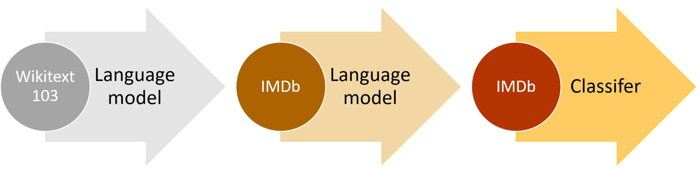

# NLP Deep Dive: RNNs

# 自然语言处理深潜：RNNs

In <chapter_intro> we saw that deep learning can be used to get great results with natural language datasets. Our example relied on using a pretrained language model and fine-tuning it to classify reviews. That example highlighted a difference between transfer learning in NLP and computer vision: in general in NLP the pretrained model is trained on a different task.

在<章节：概述>中，我们学习了使用自然语言数据集深度学习能够用来获取很好的结果。我们例子依赖于使用一个预训练语言模型并微调它来分类评论。那个例子强调了自然语言处理和计算机视觉迁移学习间的不同：通常在自然语言处理中预训练模型是在不同的任务上训练的。

What we call a language model is a model that has been trained to guess what the next word in a text is (having read the ones before). This kind of task is called *self-supervised learning*: we do not need to give labels to our model, just feed it lots and lots of texts. It has a process to automatically get labels from the data, and this task isn't trivial: to properly guess the next word in a sentence, the model will have to develop an understanding of the English (or other) language. Self-supervised learning can also be used in other domains; for instance, see ["Self-Supervised Learning and Computer Vision"](https://www.fast.ai/2020/01/13/self_supervised/) for an introduction to vision applications. Self-supervised learning is not usually used for the model that is trained directly, but instead is used for pretraining a model used for transfer learning.

我们调用的语言模型是一个已经被训练用于预测文本中下个词的内容的模型（之前阅读了很多文本）。这类任务被称为*自监督学习*：我们不需要给我们的模型提供标注，只需要喂给它很多很多的文本。它有一个从数据中自动获取标签的过程，这一任务不重要的是：正确猜测句子中的下个词，模型不得不会开发一个英文（或其它）语言的理解能力。自监督学习也能够被用于其它领域。例如，查看[自监督学习和计算机视觉](https://www.fast.ai/2020/01/13/self_supervised/)介绍了视觉方面的应用。自监督学习不常用于直接训练模型，相反用于预训练用于迁移学习。

> jargon: Self-supervised learning: Training a model using labels that are embedded in the independent variable, rather than requiring external labels. For instance, training a model to predict the next word in a text.

> 术语：自监督学习：使用自变量中嵌入的标签训练一个模型，而不需要额外的标签。例如，训练一个模型来预测文本中的下个词。

The language model we used in <chapter_intro> to classify IMDb reviews was pretrained on Wikipedia. We got great results by directly fine-tuning this language model to a movie review classifier, but with one extra step, we can do even better. The Wikipedia English is slightly different from the IMDb English, so instead of jumping directly to the classifier, we could fine-tune our pretrained language model to the IMDb corpus and then use *that* as the base for our classifier.

我们在<章节：概述>中使用来分类IMDb评论的语言模型是在Wikipedia上预训练的。通过直接微调这个语言模型为一个影视评论分类器我们取得了很好的结果，但是有一个额外的步骤，我们甚至能够做的更好。Wikipedia英文与IMDb英文稍微有点差别，所以直接跳到了分类器，我们能够微调我们的预训练语言模型到IMDb语料库，然后用*这个*作为我们分类器的基础。

Even if our language model knows the basics of the language we are using in the task (e.g., our pretrained model is in English), it helps to get used to the style of the corpus we are targeting. It may be more informal language, or more technical, with new words to learn or different ways of composing sentences. In the case of the IMDb dataset, there will be lots of names of movie directors and actors, and often a less formal style of language than that seen in Wikipedia.

即使我们的语言模型知道我们在任务中使用的基础语言（例如，我们的预训练模型用的英文），它有助于习惯我们目标预料库的风格。这个目标库可能是更非正式的语言，或更多专业，有很多新词需要学习或不同句子的组合方式。在IMDb数据集中，有很多电影导演和演员的句子，且通常比在Wikipedia中看到的语言缺少那么一点正式性。

We already saw that with fastai, we can download a pretrained English language model and use it to get state-of-the-art results for NLP classification. (We expect pretrained models in many more languages to be available soon—they might well be available by the time you are reading this book, in fact.) So, why are we learning how to train a language model in detail?

我们已经用fastai看到了，我们能够下载一个预训练英文语言模型并用它取得自然语言处理分类的最先进的结果。（我们希望立刻获取更多语言的预训练模型。事实上，在你阅读本书期间，它们能够有效的获得。）那么，为什么我们学习如何训练一个语言模型的细节呢？

One reason, of course, is that it is helpful to understand the foundations of the models that you are using. But there is another very practical reason, which is that you get even better results if you fine-tune the (sequence-based) language model prior to fine-tuning the classification model. For instance, for the IMDb sentiment analysis task, the dataset includes 50,000 additional movie reviews that do not have any positive or negative labels attached. Since there are 25,000 labeled reviews in the training set and 25,000 in the validation set, that makes 100,000 movie reviews altogether. We can use all of these reviews to fine-tune the pretrained language model, which was trained only on Wikipedia articles; this will result in a language model that is particularly good at predicting the next word of a movie review.

当然，其中一个原因是它有助于理解我们正在使用的模型的基础。但还有另外一个特别的原因是，如果你在调整分类模型之前来微调（基于序列）语言模型你甚至会获得更好的结果。例如，对于IMDb情绪分析任务，数据集包含了 50,000 条附加的电影评论，其没有附上任何正面名负面的标签。因此有 25,000 条被标注的在训练集，25,000 在验证集，从而制作了总共 100,000 电影评论。我们能够这些所有的评论来微调预训练语言模型，这个预训练模型只在Wikipedia文章上做了训练。结果是语言模型在预测电影评论的下一个词上尤其的好。

This is known as the Universal Language Model Fine-tuning (ULMFit) approach. The [paper](https://arxiv.org/abs/1801.06146) showed that this extra stage of fine-tuning of the language model, prior to transfer learning to a classification task, resulted in significantly better predictions. Using this approach, we have three stages for transfer learning in NLP, as summarized in <ulmfit_process>.

这被称为通用语言模型微调（ULMFit）方法。[论文](https://arxiv.org/abs/1801.06146) 展示了这一额外语言模型微调的步骤，在迁移学习到一个分类任务前，会产生明显更好的预测。使用这一方法，我们对于自然语言处理中的迁移学习有三个步骤阶段，见下图<通用语言模型微调过程>所总结。

  

    
  

  
图：通用语言模型微调过程

We'll now explore how to apply a neural network to this language modeling problem, using the concepts introduced in the last two chapters. But before reading further, pause and think about how *you* would approach this.

使用在前两章节介绍的概念，现在我们将要探索如何应用神经网络到这一语言建模问题上。但是在进一步阅读前，暂停并思考*你*会如何处理这个事情。

## Text Preprocessing

## 文本预处理

It's not at all obvious how we're going to use what we've learned so far to build a language model. Sentences can be different lengths, and documents can be very long. So, how can we predict the next word of a sentence using a neural network? Let's find out!

这不是毫无信息的我们将如何使用到目前为止我们已经学习的来创建一个言语模型。句子有不同的长度，文档可能是非常的长。所以，我们如何使用神经网络预测句子的下个词呢？让我们揭示出来吧！

We've already seen how categorical variables can be used as independent variables for a neural network. The approach we took for a single categorical variable was to:

 我们已经学习了分类变量如何能够以自变量被用于神经网络。我们认为对单一分类变量的这个方法是：

1. Make a list of all possible levels of that categorical variable (we'll call this list the *vocab*).
2. Replace each level with its index in the vocab.
3. Create an embedding matrix for this containing a row for each level (i.e., for each item of the vocab).
4. Use this embedding matrix as the first layer of a neural network. (A dedicated embedding matrix can take as inputs the raw vocab indexes created in step 2; this is equivalent to but faster and more efficient than a matrix that takes as input one-hot-encoded vectors representing the indexes.)

1. 生成一个分类变量所有可能等级的列表（我们称这个列表为*vocab*）。
2. 在vocab中用它的索引替换每个等级。
3. 为其创建一个嵌入矩阵，每个等级包含一行（即，对vocab的每个项目）。
4. 使用这个嵌入矩阵作为神经网络的第一层。（一个专用嵌入矩阵能够把在第二步所创建的原始vocab索引当作输入。这是等价的，但它比把独热编码矢量代表的索引当做输入的矩阵更快且更有效率。）

We can do nearly the same thing with text! What is new is the idea of a sequence. First we concatenate all of the documents in our dataset into one big long string and split it into words, giving us a very long list of words (or "tokens"). Our independent variable will be the sequence of words starting with the first word in our very long list and ending with the second to last, and our dependent variable will be the sequence of words starting with the second word and ending with the last word.

我们能够对文本做几乎相同的事情！新的内容是序列的想法。首先我们串联我们的数据集中所有文档为一个很长的字符串，并分割为词，这提供给我们一个很长的词列表（或“tokens”）。我们的自变量是从我们长列表第一个词开始的序列词，且末尾是长列表倒数第二个词，我们的因变量是从列表第二个词开始，且结尾是列表的最后一个词。

Our vocab will consist of a mix of common words that are already in the vocabulary of our pretrained model and new words specific to our corpus (cinematographic terms or actors names, for instance). Our embedding matrix will be built accordingly: for words that are in the vocabulary of our pretrained model, we will take the corresponding row in the embedding matrix of the pretrained model; but for new words we won't have anything, so we will just initialize the corresponding row with a random vector.

我们的vocab会是普通词的混合的组合，这些普通词已经在我们预训练模型的词汇中，且新词具体对我们的预料库（例如，电影拍摄名词或演员姓名）。我们的嵌入矩阵会相应的创建：对于我们预训练模型的词汇中的词，我们会在预训练模型的嵌入矩阵中包含相应的行，但是对于新词我们不会做任何事情，所以我们只是用随机向量初始化相应的行。

Each of the steps necessary to create a language model has jargon associated with it from the world of natural language processing, and fastai and PyTorch classes available to help. The steps are:

对于自然语言处理世界创建语言模型的每个必须的步骤有与它相关的术语，且fastai和PyTorch类可以提供帮助。这些步骤是：

- Tokenization:: Convert the text into a list of words (or characters, or substrings, depending on the granularity of your model)
- Numericalization:: Make a list of all of the unique words that appear (the vocab), and convert each word into a number, by looking up its index in the vocab
- Language model data loader creation:: fastai provides an `LMDataLoader` class which automatically handles creating a dependent variable that is offset from the independent variable by one token. It also handles some important details, such as how to shuffle the training data in such a way that the dependent and independent variables maintain their structure as required
- Language model creation:: We need a special kind of model that does something we haven't seen before: handles input lists which could be arbitrarily big or small. There are a number of ways to do this; in this chapter we will be using a *recurrent neural network* (RNN). We will get to the details of these RNNs in the <chapter_nlp_dive>, but for now, you can think of it as just another deep neural network.
- 分词：把文本转换为一个词列表（依据你的模型粒度，或字符，或子串）
- 数值化：生成出现（vocab）的所有唯一词的列表，并转换每个词为一个数值，在vocab中通过它的索引进行查找
- 语言模型数据加载器创建：fastai提供了一个`LMDataLoader`类，其自动的处理创建一个因变量，这个变量是自变量一个token的偏置量。这也处理一个重要细节，如以因变量和自变量按需维护它们的结构方式来混洗训练数据
- 语言模型创建：我们需要一个特定的模型，它能够处理我们之前没有见的内容：处理任意大小的输入列表。有很多方法可以做这个操作。在本章节我们会使用*递归神经网络*（RNN）。我们会在<章节：自然语言处理深潜>中接触到这些递归神经网络的细节，但现在，你只需要把它视为另一种深度神经网络。

Let's take a look at how each step works in detail.

现在让我们看一下每个步骤在细节上是怎样处理的。

