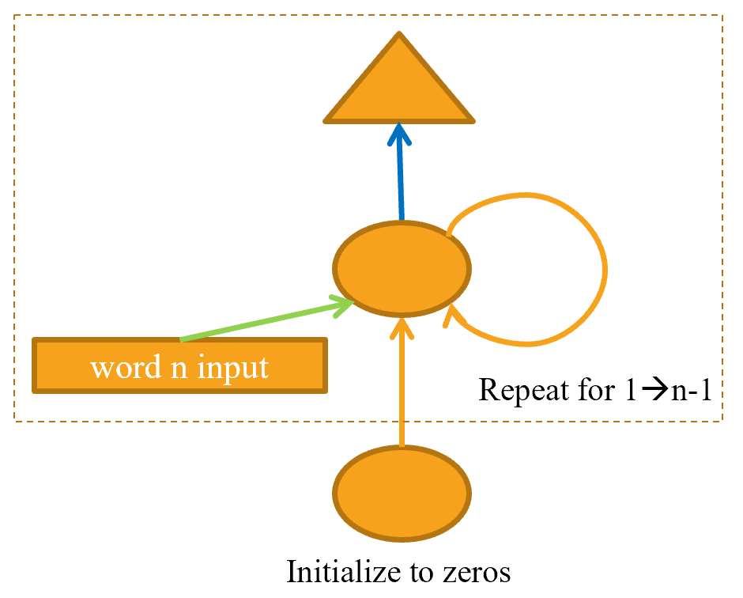

# A Language Model from Scratch

# 从零开始一个语言模型

We're now ready to go deep... deep into deep learning! You already learned how to train a basic neural network, but how do you go from there to creating state-of-the-art models? In this part of the book we're going to uncover all of the mysteries, starting with language models.

现在我们准备深入研究深度学习！你已经学习了如何训练一个基础的神经网络，但是你如何从这里创建一个先进的模型呢？在本部分我们会揭示所有语言模型的秘密。

You saw in <chapter_nlp> how to fine-tune a pretrained language model to build a text classifier. In this chapter, we will explain to you what exactly is inside that model, and what an RNN is. First, let's gather some data that will allow us to quickly prototype our various models.

在<章节：自然语言处理>中我们学习了如何微调一个预训练语言模型以创建一个文本分类器。在这个章节，我们会给你解释这个模型内部究竟什么内容，及递归神经网络是什么。首先让我们收集一些数据，以使我们快速构建各种模型原型。

## The Data

## 数据

Whenever we start working on a new problem, we always first try to think of the simplest dataset we can that will allow us to try out methods quickly and easily, and interpret the results. When we started working on language modeling a few years ago we didn't find any datasets that would allow for quick prototyping, so we made one. We call it *Human Numbers*, and it simply contains the first 10,000 numbers written out in English.

每当我们开始处理一个新的问题，我们总是首先思考能让我们快速且容易的尝试我们方法的最简单的数据集和可解释的结果。当我们几年前开始从事语言建模时，我们没有找到任何允许原型制作的任何数据集，所以我们做了一个。我们称它为*人类数字*，它简单的包含了用英文写的头10,000个数字。

> j: One of the most common practical mistakes I see even amongst highly experienced practitioners is failing to use appropriate datasets at appropriate times during the analysis process. In particular, most people tend to start with datasets that are too big and too complicated.

> 杰：即使在具有丰富经验从业人员中我见过的最常见的实践问题之一是分析处理期间无法在使用的时间使用合适的数据集。在实践中，多数人倾向用太大和太复杂的数据集开始。

We can download, extract, and take a look at our dataset in the usual way:

我们能够用常用的方法下载、抽取，并查看我们的数据集：

```
from fastai.text.all import *
path = untar_data(URLs.HUMAN_NUMBERS)
```

```
#hide
Path.BASE_PATH = path
```

```
path.ls()
```

Out: (#2) [Path('train.txt') , Path('valid.txt')]

Let's open those two files and see what's inside. At first we'll join all of the texts together and ignore the train/valid split given by the dataset (we'll come back to that later):

让我们打开那两个文件和查看内部是什么。首先我们会连接起来所有文本并忽略数据集给出的训练/验证分割（我们稍后会返回到这个话题）：

```
lines = L()
with open(path/'train.txt') as f: lines += L(*f.readlines())
with open(path/'valid.txt') as f: lines += L(*f.readlines())
lines
```

Out: (#9998) ['one \n' , 'two \n' , 'three \n' , 'four \n' , 'five \n' , 'six \n' , 'seven \n' , 'eight \n' , 'nine \n' , 'ten \n'...]

We take all those lines and concatenate them in one big stream. To mark when we go from one number to the next, we use a `.` as a separator:

我们取了所有那些行并串连他们为一个大流。当我们标记从一个数字到下个数字时，我们使用`.`作为分割器：

```
text = ' . '.join([l.strip() for l in lines])
text[:100]
```

Out: 'one . two . three . four . five . six . seven . eight . nine . ten . eleven . twelve . thirteen . fo'

We can tokenize this dataset by splitting on spaces:

我们能够通过在空格上分割来标记这个数据集：

```
tokens = text.split(' ')
tokens[:10]
```

Out: ['one' , '.' , 'two' , '.' , 'three' , '.' , 'four' , '.' , 'five' , '.']

To numericalize, we have to create a list of all the unique tokens (our *vocab*):

我们必须创建一个所有唯一标记（我们的*词汇*）的列表来数值化：

```
vocab = L(*tokens).unique()
vocab
```

Out[ ]: (#30) ['one' , '.' , 'two' , 'three' , 'four' , 'five' , 'six' , 'seven' , 'eight' , 'nine'...]

Then we can convert our tokens into numbers by looking up the index of each in the vocab:

然后我们能够通过查找词汇表中每个索引来转换标记为数字：

```
word2idx = {w:i for i,w in enumerate(vocab)}
nums = L(word2idx[i] for i in tokens)
nums
```

Out: (#63095) [0, 1, 2, 1, 3, 1, 4, 1, 5, 1...]

Now that we have a small dataset on which language modeling should be an easy task, we can build our first model.

现在我们有了一个小数据集，在它上面语言建模应该是一个很容易的任务，我们可以创建我们的第一个模型了。

## Our First Language Model from Scratch

## 从零开始我们的第一个语言模型

One simple way to turn this into a neural network would be to specify that we are going to predict each word based on the previous three words. We could create a list of every sequence of three words as our independent variables, and the next word after each sequence as the dependent variable.

将其转换为神经网络的一个简单方法是指定我们基于前三个单词来预测每个单词。我们能够创建每个都包含三个词的序列列表作为自变量，每个序列后面的其后单词作为因变量。

We can do that with plain Python. Let's do it first with tokens just to confirm what it looks like:

我们能够用纯Python来做这个事情。让我们只是用标记完成这个工作，只是确认一下它看起来像什么：

```
L((tokens[i:i+3], tokens[i+3]) for i in range(0,len(tokens)-4,3))
```

Out: (#21031) [(['one' , '.' , 'two'], '.') , (['.' , 'three' , '.'], 'four') , (['four' , '.' , 'five'], '.') , (['.' , 'six' , '.'], 'seven') , (['seven' , '.' , 'eight'], '.') , (['.' , 'nine' , '.'], 'ten') , (['ten' , '.' , 'eleven'], '.') , (['.' , 'twelve' , '.'], 'thirteen') , (['thirteen' , '.' , 'fourteen'], '.') , (['.' , 'fifteen' , '.'], 'sixteen')...]

Now we will do it with tensors of the numericalized values, which is what the model will actually use:

现在我们用数值化值的张量做处理，它是模型实际使用的内容：

```
seqs = L((tensor(nums[i:i+3]), nums[i+3]) for i in range(0,len(nums)-4,3))
seqs
```

Out: (#21031) [(tensor([0, 1, 2]), 1) , (tensor([1, 3, 1]), 4) , (tensor([4, 1, 5]), 1) , (tensor([1, 6, 1]), 7) , (tensor([7, 1, 8]), 1) , (tensor([1, 9, 1]), 10) , (tensor([10,  1, 11]), 1) , (tensor([ 1, 12,  1]), 13) , (tensor([13,  1, 14]), 1) , (tensor([ 1, 15,  1]), 16)...]

We can batch those easily using the `DataLoader` class. For now we will split the sequences randomly:

我们能够使用`DataLoader`类轻松的批量处理那些内容。现在，我们会随机分割序列：

```
bs = 64
cut = int(len(seqs) * 0.8)
dls = DataLoaders.from_dsets(seqs[:cut], seqs[cut:], bs=64, shuffle=False)
```

We can now create a neural network architecture that takes three words as input, and returns a prediction of the probability of each possible next word in the vocab. We will use three standard linear layers, but with two tweaks.

现在我们能够创建一个取三个词作为输入的神经网络架构，并返回一个词汇表中每个可能下个词的概率预测。我们会使用三个标准的线性层，但是要有两个调整。

The first tweak is that the first linear layer will use only the first word's embedding as activations, the second layer will use the second word's embedding plus the first layer's output activations, and the third layer will use the third word's embedding plus the second layer's output activations. The key effect of this is that every word is interpreted in the information context of any words preceding it.

第一个调整是，第一个线性层会只用第一个词的嵌入作为激活，第二层会使用第二个词的嵌入加上第一层的输出激活，及第三层会用第三个词嵌入加上第二层的输出激活。这样做的关键效果是每个词都在其前面的信息语境中进行解释。

The second tweak is that each of these three layers will use the same weight matrix. The way that one word impacts the activations from previous words should not change depending on the position of a word. In other words, activation values will change as data moves through the layers, but the layer weights themselves will not change from layer to layer. So, a layer does not learn one sequence position; it must learn to handle all positions.

第二个调整是这三层的任何一层会使用相同的权重矩阵。一个词影响之前词激活的方式应该不会根据词的位置而改变。换句话说，激活值在数据通过层时会改变，但是层的权重自身不会逐层改变。因此，一个层不会学习一个序列的位置，它必须学习处理所有的位置。

Since layer weights do not change, you might think of the sequential layers as "the same layer" repeated. In fact, PyTorch makes this concrete; we can just create one layer, and use it multiple times.

因为层权重不会发生改变，你可能会认为这些序列层是作为“相同的层”的重复。实际上，PyTorch做了这个考虑。我们能够只创建一个层，且使用这个层多次。

### Our Language Model in PyTorch

### 我们在PyTorch中的语言模型

We can now create the language model module that we described earlier:

现在我们能够创建我们先前描述的语言模型了：

```
class LMModel1(Module):
    def __init__(self, vocab_sz, n_hidden):
        self.i_h = nn.Embedding(vocab_sz, n_hidden)  
        self.h_h = nn.Linear(n_hidden, n_hidden)     
        self.h_o = nn.Linear(n_hidden,vocab_sz)
        
    def forward(self, x):
        h = F.relu(self.h_h(self.i_h(x[:,0])))
        h = h + self.i_h(x[:,1])
        h = F.relu(self.h_h(h))
        h = h + self.i_h(x[:,2])
        h = F.relu(self.h_h(h))
        return self.h_o(h)
```

As you see, we have created three layers:

- The embedding layer (`i_h`, for *input* to *hidden*)
- The linear layer to create the activations for the next word (`h_h`, for *hidden* to *hidden*)
- A final linear layer to predict the fourth word (`h_o`, for *hidden* to *output*)

正如你看到的，我们已经创建了三个层：

- 嵌入层（`i_h`，*输入到隐藏*）
- 线性层为下个词创建激活（`h_h`，*隐藏到隐藏*）
- 最后的线性层来预测第四个单词（`h_o`，*隐藏到输出*）

This might be easier to represent in pictorial form, so let's define a simple pictorial representation of basic neural networks. <img_simple_nn> shows how we're going to represent a neural net with one hidden layer.

这可能以示意图方式更容易表达，所以让我们定义一个简单的基础神经网络示意图表示。<简单的神经网络示意图表示>显示了我们打算表达的一个带有单隐含层的神经网络。

<div style="text-align:center">
  <p align="center">
    
  </p>
  <p align="center">图：简单的神经网络示意图表示</p>
</div>

Each shape represents activations: rectangle for input, circle for hidden (inner) layer activations, and triangle for output activations. We will use those shapes (summarized in <img_shapes>) in all the diagrams in this chapter.

每个形状所代表的激活：矩形为输入，原型为隐含（内部的）层激活，三角形为输出激活。在本章节的所有示意图中我们会使用这些形状（<示意图中所使用的图形>做了总结）。

<div style="text-align:center">
  <p align="center">
    
  </p>
  <p align="center">图：示意图中所使用的图形</p>
</div>

An arrow represents the actual layer computation—i.e., the linear layer followed by the activation function. Using this notation, <lm_rep> shows what our simple language model looks like.

箭头线表示实际的层计算。即，线性层后面跟随着激活函数。使用这一标记，<基础语言模型表示>图中展示了我们的简单的语言模型看起来是什么样子。

<div style="text-align:center">
  <p align="center">
    
  </p>
  <p align="center">图：基础语言模型表示</p>
</div>

To simplify things, we've removed the details of the layer computation from each arrow. We've also color-coded the arrows, such that all arrows with the same color have the same weight matrix. For instance, all the input layers use the same embedding matrix, so they all have the same color (green).

Let's try training this model and see how it goes:

简化了的事情是我们已经移除了每个箭头的层计算细节。我们也彩色编码了箭头线，这样有相同颜色的箭头线有着相同的权重矩阵。例如，所有的输入层使用了相同的嵌入矩阵，所以它们都有着相同的颜色（绿色）。

让我们尝试训练这个模型并查看效果如何：

```
learn = Learner(dls, LMModel1(len(vocab), 64), loss_func=F.cross_entropy, 
                metrics=accuracy)
learn.fit_one_cycle(4, 1e-3)
```

| epoch | train_loss | valid_loss | accuracy |  time |
| ----: | ---------: | ---------: | -------: | ----: |
|     0 |   1.824297 |   1.970941 | 0.467554 | 00:02 |
|     1 |   1.386973 |   1.823242 | 0.467554 | 00:02 |
|     2 |   1.417556 |   1.654497 | 0.494414 | 00:02 |
|     3 |   1.376440 |   1.650849 | 0.494414 | 00:02 |

To see if this is any good, let's check what a very simple model would give us. In this case we could always predict the most common token, so let's find out which token is most often the target in our validation set:

看看这是否有用，让我们检查一下一个非常简单的模型会提供给我们什么。在本例子中我们总会预测最常见的标记，所以让我们找出在我们的验证集中哪个标记是最常见的目标：

```
n,counts = 0,torch.zeros(len(vocab))
for x,y in dls.valid:
    n += y.shape[0]
    for i in range_of(vocab): counts[i] += (y==i).long().sum()
idx = torch.argmax(counts)
idx, vocab[idx.item()], counts[idx].item()/n
```

Out: (tensor(29), 'thousand', 0.15165200855716662)

The most common token has the index 29, which corresponds to the token `thousand`. Always predicting this token would give us an accuracy of roughly 15%, so we are faring way better!

最常见的标记索引是29，其与标记`thousand`相关联。总是预测这个标高会给我们大约15%的准确度，所以我们将会好的好！

> A: My first guess was that the separator would be the most common token, since there is one for every number. But looking at `tokens` reminded me that large numbers are written with many words, so on the way to 10,000 you write "thousand" a lot: five thousand, five thousand and one, five thousand and two, etc. Oops! Looking at your data is great for noticing subtle features and also embarrassingly obvious ones.

> 亚：我的第一个猜想是分割器也许是最常见的标记，因为每个数字都有一个。但是查看`标记`让我想起大的数字用很多单词写出来的，所以以这样的方式对于10,000这个数值，你要写很多个`thousand`： five thousand, five thousand and one, five thousand and two，等等。哎呦！查看你的数据对于注意细微特征很有益处的，同样尴尬也是显而易见的。

This is a nice first baseline. Let's see how we can refactor it with a loop.

这是非常好的第一个基线。让我们看一下如何用循环重构它。

### Our First Recurrent Neural Network

### 我们首个递归神经网络

Looking at the code for our module, we could simplify it by replacing the duplicated code that calls the layers with a `for` loop. As well as making our code simpler, this will also have the benefit that we will be able to apply our module equally well to token sequences of different lengths—we won't be restricted to token lists of length three:

看我们模型的代码，我们能够使用一个`for`循环替换调用层的重复代码来简化它。同样这使得我们的代码更加简单，这也会有一个收益，就是我们能够应该我们的模型同样很好的标记不同长度的序列。我们不会被限制在标记长度为三的列表：

```
class LMModel2(Module):
    def __init__(self, vocab_sz, n_hidden):
        self.i_h = nn.Embedding(vocab_sz, n_hidden)  
        self.h_h = nn.Linear(n_hidden, n_hidden)     
        self.h_o = nn.Linear(n_hidden,vocab_sz)
        
    def forward(self, x):
        h = 0
        for i in range(3):
            h = h + self.i_h(x[:,i])
            h = F.relu(self.h_h(h))
        return self.h_o(h)
```

Let's check that we get the same results using this refactoring:

让我们检查一下，使用这个重构的代码我们获得相同的结果：

```
learn = Learner(dls, LMModel2(len(vocab), 64), loss_func=F.cross_entropy, 
                metrics=accuracy)
learn.fit_one_cycle(4, 1e-3)
```

| epoch | train_loss | valid_loss | accuracy |  time |
| ----: | ---------: | ---------: | -------: | ----: |
|     0 |   1.816274 |   1.964143 | 0.460185 | 00:02 |
|     1 |   1.423805 |   1.739964 | 0.473259 | 00:02 |
|     2 |   1.430327 |   1.685172 | 0.485382 | 00:02 |
|     3 |   1.388390 |   1.657033 | 0.470406 | 00:02 |

We can also refactor our pictorial representation in exactly the same way, as shown in <basic_rnn> (we're also removing the details of activation sizes here, and using the same arrow colors as in <lm_rep>).

我们也能够以完全相同的方式重构在我们的示意图表示，如图<基础递归神经网络>所示（在这里我们同样移除了激活尺寸的细节，并用不用 了与图<基础语言模型表示>相同的箭头线颜色）。

<div style="text-align:center">
  <p align="center">
    
  </p>
  <p align="center">图：基础递归神经网络</p>
</div>

You will see that there is a set of activations that are being updated each time through the loop, stored in the variable `h`—this is called the *hidden state*.

> Jargon: hidden state: The activations that are updated at each step of a recurrent neural network.

我们会看到，有一系统的激活每次通过循环被更新，存储在变量`h`中，这被称为*隐含状态*。

> 术语：隐含状态：激活在每一步的递归神经网络中被更新。

A neural network that is defined using a loop like this is called a *recurrent neural network* (RNN). It is important to realize that an RNN is not a complicated new architecture, but simply a refactoring of a multilayer neural network using a `for` loop.

> A: My true opinion: if they were called "looping neural networks," or LNNs, they would seem 50% less daunting!

神经网络使用一个循环来定义，就橡这个被称为的*递归神经网络*（RNN）。意识到RNN不是一个复杂的新架构，而是使用 一个`for`循环的多层神经网络的简单重构，这是很重要的。

> 亚：我的真实观点：如果它们被称为“循环神经网络”，或LNN，它们似乎减少了50%的畏惧！

Now that we know what an RNN is, let's try to make it a little bit better.

现在我们知道了RNN是什么，让我们尝试让他更好一些。

## Improving the RNN

## 改善递归神经网络（RNN）

Looking at the code for our RNN, one thing that seems problematic is that we are initializing our hidden state to zero for every new input sequence. Why is that a problem? We made our sample sequences short so they would fit easily into batches. But if we order the samples correctly, those sample sequences will be read in order by the model, exposing the model to long stretches of the original sequence.

查看我们的递归神经网络（RNN）代码，有一个事情好像有问题那就是对每个新输入序列我们初始化隐含状态为零。为什么那是一个问题呢？我们缩短了我们的样本序列，它们会很容易的融合到批次中。但是如果我们正确的排序了样本，那些样本序列会被模型按照顺序读取，从而暴露模型在原始序列长度片段下。

Another thing we can look at is having more signal: why only predict the fourth word when we could use the intermediate predictions to also predict the second and third words?

我们能够看到的另外事情是有更多的信号：当我们使用中间预测结果来同样预测第二和第三个词的时候，为什么只预测第四个词？

Let's see how we can implement those changes, starting with adding some state.

让我们学习，我们能够如何实现这些变化，从添加一些状态开始。

### Maintaining the State of an RNN

### 维护递归神经网络的状态

Because we initialize the model's hidden state to zero for each new sample, we are throwing away all the information we have about the sentences we have seen so far, which means that our model doesn't actually know where we are up to in the overall counting sequence. This is easily fixed; we can simply move the initialization of the hidden state to `__init__`.

因为我们对每个新的样本初始化模型隐含状态为零，我们抛弃所有迄今为止我们已经看到的有关的句子信息，其表示我们模型实际上不知道我们在全部的连续序列中什么位置。这很容易修正，我们只需要简单的移动隐含状态的初始化到`_init_`。

But this fix will create its own subtle, but important, problem. It effectively makes our neural network as deep as the entire number of tokens in our document. For instance, if there were 10,000 tokens in our dataset, we would be creating a 10,000-layer neural network.

但是这个修正产生了它自己很重要的微妙问题。它实际上使得我们的神经网络与我们文档中所有标记数目一样的深度。例如，如果在我们数据集中有10,000个标记，我们就要创建10,000层神经网络。

To see why this is the case, consider the original pictorial representation of our recurrent neural network in <lm_rep>, before refactoring it with a `for` loop. You can see each layer corresponds with one token input. When we talk about the representation of a recurrent neural network before refactoring with the `for` loop, we call this the *unrolled representation*. It is often helpful to consider the unrolled representation when trying to understand an RNN.

来看一下为什么是这样一个情况，在用`for`循环重构它前，思考在图<基础语言模型表示>中我们的递归神经网络的原始事例事描述。你能够看到每一层对应一个标记输入。当我们讨论关于在用`for`循环重构前的递归神经网络的表示时，我们称此为*展开表示*。创始理解一个递归神经网络时，它通常有助于思考展开表示。

The problem with a 10,000-layer neural network is that if and when you get to the 10,000th word of the dataset, you will still need to calculate the derivatives all the way back to the first layer. This is going to be very slow indeed, and very memory-intensive. It is unlikely that you'll be able to store even one mini-batch on your GPU.

有着10,000层神经网络的问题是如果和当你到达到数据集的第10,000个词时，你需要持续计算导数一直到第一层。这真的是太慢了和占用太多内存了。你即使存储一个小批次在你的GPU上这也是不可能的。

The solution to this problem is to tell PyTorch that we do not want to back propagate the derivatives through the entire implicit neural network. Instead, we will just keep the last three layers of gradients. To remove all of the gradient history in PyTorch, we use the `detach` method.

对于这个问题的解决方案是告诉PyTorch我们不希望整个隐含神经网络反向传播导数。相反，我们只是保罗最后三层的梯度。在PyTorch中我们使用`datach`方法来移除所有的梯度历史。

Here is the new version of our RNN. It is now stateful, because it remembers its activations between different calls to `forward`, which represent its use for different samples in the batch:

下面是我们的新版本递归神经网络。现在它是有状态的，因为它记忆对`forward`不同单元间它的激活，这表示在批次中对于不同样本它的用法：

```
class LMModel3(Module):
    def __init__(self, vocab_sz, n_hidden):
        self.i_h = nn.Embedding(vocab_sz, n_hidden)  
        self.h_h = nn.Linear(n_hidden, n_hidden)     
        self.h_o = nn.Linear(n_hidden,vocab_sz)
        self.h = 0
        
    def forward(self, x):
        for i in range(3):
            self.h = self.h + self.i_h(x[:,i])
            self.h = F.relu(self.h_h(self.h))
        out = self.h_o(self.h)
        self.h = self.h.detach()
        return out
    
    def reset(self): self.h = 0
```

This model will have the same activations whatever sequence length we pick, because the hidden state will remember the last activation from the previous batch. The only thing that will be different is the gradients computed at each step: they will only be calculated on sequence length tokens in the past, instead of the whole stream. This approach is called *backpropagation through time* (BPTT).

无论我们选择什么序列长度这个模型会有相同的激活，因为隐含状态会记住上个批次的最后激活。只有一个事情会有不同，那是在每步上的梯度计算：它们只会计算过去的序列长度标记，而不是整个流。这个方法被称为*随时间反向传播*（BPTT）。

> jargon: Back propagation through time (BPTT): Treating a neural net with effectively one layer per time step (usually refactored using a loop) as one big model, and calculating gradients on it in the usual way. To avoid running out of memory and time, we usually use *truncated* BPTT, which "detaches" the history of computation steps in the hidden state every few time steps.

> 术语：随时间反向传播（BPTT）：把每次有效步进一层（通常用一个循环重构）的神经网络视为一个大模型，并以常用方法计算它的梯度。为规避内存移除和时间不够，我们通常使用删减版本的BPTT，其每几次步进在隐含状态中会*分离*历史的计算步骤。

To use `LMModel3`, we need to make sure the samples are going to be seen in a certain order. As we saw in <chapter_nlp>, if the first line of the first batch is our `dset[0]` then the second batch should have `dset[1]` as the first line, so that the model sees the text flowing.

使用`LMModel3`，我们需要确保样本以看到的确定排序。正如我们在<章节：自然语言处理>中所学的，如果第一批次的第一行是我们的`dset[0]`，那么第二个批次应该是`dset[1]`作为第一行，所以模型看到的是文本流。

   `LMDataLoader` was doing this for us in <chapter_nlp>. This time we're going to do it ourselves.

在<章节：自然语言处理> 中`LMDataLoader`为我们做这个工作。这次我们准备自己来做这个处理。

To do this, we are going to rearrange our dataset. First we divide the samples into `m = len(dset) // bs` groups (this is the equivalent of splitting the whole concatenated dataset into, for example, 64 equally sized pieces, since we're using `bs=64` here). `m` is the length of each of these pieces. For instance, if we're using our whole dataset (although we'll actually split it into train versus valid in a moment), that will be:

做这个工作，我们需要重新整理我们的数据集。首先我们把样本划分为`m = len(dset) // bs`组（这相当于划分整个连接的数据集为例如64个相同的部分，因为我们这里的`bs=64`）。`m`是这些部分的每个长度。例如，如果我们使用我们的整体数据集（虽然我们实际上会立刻分割它为训练和验证集），会是下面的情况：

```
m = len(seqs)//bs
m,bs,len(seqs)
```

Out: (328, 64, 21031)

The first batch will be composed of the samples:

第一个批次会是由样子组成的：

```
(0, m, 2*m, ..., (bs-1)*m)
```

the second batch of the samples:

第二个批次的样本：

```
(1, m+1, 2*m+1, ..., (bs-1)*m+1)
```

and so forth. This way, at each epoch, the model will see a chunk of contiguous text of size `3*m` (since each text is of size 3) on each line of the batch.

以此类推。样每个周期模型会看到在批次的每行尺寸为`3*m`的连续本文（因为本个文本是尺寸3）。

The following function does that reindexing:

下述函数做重新索引：

```
def group_chunks(ds, bs):
    m = len(ds) // bs
    new_ds = L()
    for i in range(m): new_ds += L(ds[i + m*j] for j in range(bs))
    return new_ds
```

Then we just pass `drop_last=True` when building our `DataLoaders` to drop the last batch that does not have a shape of `bs`. We also pass `shuffle=False` to make sure the texts are read in order:

当创建我们的`DataLoaders`时我们只会传递`drop_last=True`来删除没有`bs`形状的最后批次。我们也会传递`shuffle=False`来确保文本按照顺序读取：

```
cut = int(len(seqs) * 0.8)
dls = DataLoaders.from_dsets(
    group_chunks(seqs[:cut], bs), 
    group_chunks(seqs[cut:], bs), 
    bs=bs, drop_last=True, shuffle=False)
```

The last thing we add is a little tweak of the training loop via a `Callback`. We will talk more about callbacks in <chapter_accel_sgd>; this one will call the `reset` method of our model at the beginning of each epoch and before each validation phase. Since we implemented that method to zero the hidden state of the model, this will make sure we start with a clean state before reading those continuous chunks of text. We can also start training a bit longer:

最后一个事情，我们通过`回收`添加了训练循环的一个小调整。我们会在<章节：加速随机梯度下降>中讨论更多关于回收的内容。这个会在每个周期的一开始和每个验证阶段之前调用我们模型的`reset`方法。因为我们执行这个方法来对模型的隐藏状态归零，这会确保在读取那些连续文本块之前我们会从一个干净的状态开始。我们也可以训练时间长一点：

```
learn = Learner(dls, LMModel3(len(vocab), 64), loss_func=F.cross_entropy,
                metrics=accuracy, cbs=ModelResetter)
learn.fit_one_cycle(10, 3e-3)
```

| epoch | train_loss | valid_loss | accuracy |  time |
| ----: | ---------: | ---------: | -------: | ----: |
|     0 |   1.677074 |   1.827367 | 0.467548 | 00:02 |
|     1 |   1.282722 |   1.870913 | 0.388942 | 00:02 |
|     2 |   1.090705 |   1.651793 | 0.462500 | 00:02 |
|     3 |   1.005092 |   1.613794 | 0.516587 | 00:02 |
|     4 |   0.965975 |   1.560775 | 0.551202 | 00:02 |
|     5 |   0.916182 |   1.595857 | 0.560577 | 00:02 |
|     6 |   0.897657 |   1.539733 | 0.574279 | 00:02 |
|     7 |   0.836274 |   1.585141 | 0.583173 | 00:02 |
|     8 |   0.805877 |   1.629808 | 0.586779 | 00:02 |
|     9 |   0.795096 |   1.651267 | 0.588942 | 00:02 |

This is already better! The next step is to use more targets and compare them to the intermediate predictions.

这已经更好了！下一步使用更多的目标并用它们与中间预测做对比。

### Creating More Signal

### 创建更多信号

Another problem with our current approach is that we only predict one output word for each three input words. That means that the amount of signal that we are feeding back to update weights with is not as large as it could be. It would be better if we predicted the next word after every single word, rather than every three words, as shown in <stateful_rep>.

我们当前方法的另外一个问题是，对于每三个输入单词我们只预测一个输出单词。这表示没有足够大的我们反馈给更新权重的信号数量。如果预测每个单一单词后的下个单词，而不是每三个单词它也许会更好，如下图<递归神经网络在每个标记后进行预测>。

<div style="text-align:center">
  <p align="center">
    
  </p>
  <p align="center">图：递归神经网络在每个标记后进行预测</p>
</div>

This is easy enough to add. We need to first change our data so that the dependent variable has each of the three next words after each of our three input words. Instead of `3`, we use an attribute, `sl` (for sequence length), and make it a bit bigger:

这个添加非常容易。我们首选需要改变我们的数据，因此我们三个输入单词的每一个后面因变量就有了三个下个单词。我们使用特征`sl`（序列长度）而不是`3`，以使得的其更大一点：

```
sl = 16
seqs = L((tensor(nums[i:i+sl]), tensor(nums[i+1:i+sl+1]))
         for i in range(0,len(nums)-sl-1,sl))
cut = int(len(seqs) * 0.8)
dls = DataLoaders.from_dsets(group_chunks(seqs[:cut], bs),
                             group_chunks(seqs[cut:], bs),
                             bs=bs, drop_last=True, shuffle=False)
```

Looking at the first element of `seqs`, we can see that it contains two lists of the same size. The second list is the same as the first, but offset by one element:

查看`seqs`的第一个元素，我们能够看到它包含了两个相同尺寸的列表。第二个列表是与第一个是相同的，但是偏移了一个元素：

```
[L(vocab[o] for o in s) for s in seqs[0]]
```

Out[ ]: [(#16) ['one' , '.' , 'two' , '.' , 'three' , '.' , 'four' , '.' , 'five' , '.'...], (#16) ['.' , 'two' , '.' , 'three' , '.' , 'four' , '.' , 'five' , '.' , 'six'...]]

Now we need to modify our model so that it outputs a prediction after every word, rather than just at the end of a three-word sequence:

现在我们需要修改我们的模型，它会在每个词后输出预测，而不是只是在三词序列的结尾输出：

```
class LMModel4(Module):
    def __init__(self, vocab_sz, n_hidden):
        self.i_h = nn.Embedding(vocab_sz, n_hidden)  
        self.h_h = nn.Linear(n_hidden, n_hidden)     
        self.h_o = nn.Linear(n_hidden,vocab_sz)
        self.h = 0
        
    def forward(self, x):
        outs = []
        for i in range(sl):
            self.h = self.h + self.i_h(x[:,i])
            self.h = F.relu(self.h_h(self.h))
            outs.append(self.h_o(self.h))
        self.h = self.h.detach()
        return torch.stack(outs, dim=1)
    
    def reset(self): self.h = 0
```

This model will return outputs of shape `bs x sl x vocab_sz` (since we stacked on `dim=1`). Our targets are of shape `bs x sl`, so we need to flatten those before using them in `F.cross_entropy`:

这个模型会返回形状为`bs x sl x vocab_sz`的输出（因为我们在`dim=1`上堆栈）。我们目标具有`bs x sl`的形状，因此我们需要在`F.cross_entropy`中使用它们之前弄平它们：

```
def loss_func(inp, targ):
    return F.cross_entropy(inp.view(-1, len(vocab)), targ.view(-1))
```

We can now use this loss function to train the model:

现在我们可以用这个损失函数训练模型了：

```
learn = Learner(dls, LMModel4(len(vocab), 64), loss_func=loss_func,
                metrics=accuracy, cbs=ModelResetter)
learn.fit_one_cycle(15, 3e-3)
```

| epoch | train_loss | valid_loss | accuracy |  time |
| ----: | ---------: | ---------: | -------: | ----: |
|     0 |   3.103298 |   2.874341 | 0.212565 | 00:01 |
|     1 |   2.231964 |   1.971280 | 0.462158 | 00:01 |
|     2 |   1.711358 |   1.813547 | 0.461182 | 00:01 |
|     3 |   1.448516 |   1.828176 | 0.483236 | 00:01 |
|     4 |   1.288630 |   1.659564 | 0.520671 | 00:01 |
|     5 |   1.161470 |   1.714023 | 0.554932 | 00:01 |
|     6 |   1.055568 |   1.660916 | 0.575033 | 00:01 |
|     7 |   0.960765 |   1.719624 | 0.591064 | 00:01 |
|     8 |   0.870153 |   1.839560 | 0.614665 | 00:01 |
|     9 |   0.808545 |   1.770278 | 0.624349 | 00:01 |
|    10 |   0.758084 |   1.842931 | 0.610758 | 00:01 |
|    11 |   0.719320 |   1.799527 | 0.646566 | 00:01 |
|    12 |   0.683439 |   1.917928 | 0.649821 | 00:01 |
|    13 |   0.660283 |   1.874712 | 0.628581 | 00:01 |
|    14 |   0.646154 |   1.877519 | 0.640055 | 00:01 |

We need to train for longer, since the task has changed a bit and is more complicated now. But we end up with a good result... At least, sometimes. If you run it a few times, you'll see that you can get quite different results on different runs. That's because effectively we have a very deep network here, which can result in very large or very small gradients. We'll see in the next part of this chapter how to deal with this.

我们需要训练的时间更长，因为任务已经有了些改变且现在更加复杂。但是我们会以好的结果结束... 至少，有时候是这样的。如果你运行它多次，你会看到在不同的运行上你能够取得完全不同的结果。这是因为在这里你实际上有了一个非常深的网络，它能够导致更大或更小的梯度。在本章的下个部分我们会学习如何处理这个问题。

Now, the obvious way to get a better model is to go deeper: we only have one linear layer between the hidden state and the output activations in our basic RNN, so maybe we'll get better results with more.

现在，获得更好模型的很显而易见的方法是更深：在我们基础的递归神经网络中在隐含状态和输出激活之间我们只有一个线性层，所以有更多的层我们可能会获得更好的结果。

## Multilayer RNNs

## 多层递归神经网络

In a multilayer RNN, we pass the activations from our recurrent neural network into a second recurrent neural network, like in <stacked_rnn_rep>.

在一个多层递归神经网络中，我们从我们的递归神经网络传递激活到第二个递归神经网络中去，如图<两层递归神经网络>所求。

<div style="text-align:center">
  <p align="center">
    
  </p>
  <p align="center">图：两层递归神经网络</p>
</div>

The unrolled representation is shown in <unrolled_stack_rep> (similar to <lm_rep>).

展开描述在图<两层展开递归的神经网络>所示（与<基础语言模型表示>图类似）。

<div style="text-align:center">
  <p align="center">
    
  </p>
  <p align="center">图：两层展开递的归神经网络</p>
</div>

Let's see how to implement this in practice.

让我们看一下在实践中如何来实现它。

### The Model

### 模型

We can save some time by using PyTorch's `RNN` class, which implements exactly what we created earlier, but also gives us the option to stack multiple RNNs, as we have discussed:

通过使用PyTorch的`RNN`类我们能够节省一些问题，它准确的实现了早先我们创建的内容，但也给了我们已经讨论过的叠加多层递归神经网络的选项：

```
class LMModel5(Module):
    def __init__(self, vocab_sz, n_hidden, n_layers):
        self.i_h = nn.Embedding(vocab_sz, n_hidden)
        self.rnn = nn.RNN(n_hidden, n_hidden, n_layers, batch_first=True)
        self.h_o = nn.Linear(n_hidden, vocab_sz)
        self.h = torch.zeros(n_layers, bs, n_hidden)
        
    def forward(self, x):
        res,h = self.rnn(self.i_h(x), self.h)
        self.h = h.detach()
        return self.h_o(res)
    
    def reset(self): self.h.zero_()
```

```
learn = Learner(dls, LMModel5(len(vocab), 64, 2), 
                loss_func=CrossEntropyLossFlat(), 
                metrics=accuracy, cbs=ModelResetter)
learn.fit_one_cycle(15, 3e-3)
```

| epoch | train_loss | valid_loss | accuracy |  time |
| ----: | ---------: | ---------: | -------: | ----: |
|     0 |   3.055853 |   2.591640 | 0.437907 | 00:01 |
|     1 |   2.162359 |   1.787310 | 0.471598 | 00:01 |
|     2 |   1.710663 |   1.941807 | 0.321777 | 00:01 |
|     3 |   1.520783 |   1.999726 | 0.312012 | 00:01 |
|     4 |   1.330846 |   2.012902 | 0.413249 | 00:01 |
|     5 |   1.163297 |   1.896192 | 0.450684 | 00:01 |
|     6 |   1.033813 |   2.005209 | 0.434814 | 00:01 |
|     7 |   0.919090 |   2.047083 | 0.456706 | 00:01 |
|     8 |   0.822939 |   2.068031 | 0.468831 | 00:01 |
|     9 |   0.750180 |   2.136064 | 0.475098 | 00:01 |
|    10 |   0.695120 |   2.139140 | 0.485433 | 00:01 |
|    11 |   0.655752 |   2.155081 | 0.493652 | 00:01 |
|    12 |   0.629650 |   2.162583 | 0.498535 | 00:01 |
|    13 |   0.613583 |   2.171649 | 0.491048 | 00:01 |
|    14 |   0.604309 |   2.180355 | 0.487874 | 00:01 |

Now that's disappointing... our previous single-layer RNN performed better. Why? The reason is that we have a deeper model, leading to exploding or vanishing activations.

目前让人很失望...我们之前的单层递归神经网络表现的更好。为什么？原因是我们有了一个更深的模型，导致正在爆炸和消失激活。