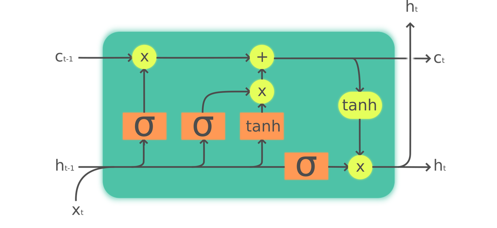

# A Language Model from Scratch

# 从零开始一个语言模型

We're now ready to go deep... deep into deep learning! You already learned how to train a basic neural network, but how do you go from there to creating state-of-the-art models? In this part of the book we're going to uncover all of the mysteries, starting with language models.

现在我们准备深入研究深度学习！你已经学习了如何训练一个基础的神经网络，但是你如何从这里创建一个先进的模型呢？在本部分我们会揭示所有语言模型的秘密。

You saw in <chapter_nlp> how to fine-tune a pretrained language model to build a text classifier. In this chapter, we will explain to you what exactly is inside that model, and what an RNN is. First, let's gather some data that will allow us to quickly prototype our various models.

在<章节：自然语言处理>中我们学习了如何微调一个预训练语言模型以创建一个文本分类器。在这个章节，我们会给你解释这个模型内部究竟什么内容，及递归神经网络是什么。首先让我们收集一些数据，以使我们快速构建各种模型原型。

## The Data

## 数据

Whenever we start working on a new problem, we always first try to think of the simplest dataset we can that will allow us to try out methods quickly and easily, and interpret the results. When we started working on language modeling a few years ago we didn't find any datasets that would allow for quick prototyping, so we made one. We call it *Human Numbers*, and it simply contains the first 10,000 numbers written out in English.

每当我们开始处理一个新的问题，我们总是首先思考能让我们快速且容易的尝试我们方法的最简单的数据集和可解释的结果。当我们几年前开始从事语言建模时，我们没有找到任何允许原型制作的任何数据集，所以我们做了一个。我们称它为*人类数字*，它简单的包含了用英文写的头10,000个数字。

> j: One of the most common practical mistakes I see even amongst highly experienced practitioners is failing to use appropriate datasets at appropriate times during the analysis process. In particular, most people tend to start with datasets that are too big and too complicated.

> 杰：即使在具有丰富经验从业人员中我见过的最常见的实践问题之一是分析处理期间无法在使用的时间使用合适的数据集。在实践中，多数人倾向用太大和太复杂的数据集开始。

We can download, extract, and take a look at our dataset in the usual way:

我们能够用常用的方法下载、抽取，并查看我们的数据集：

```
from fastai.text.all import *
path = untar_data(URLs.HUMAN_NUMBERS)
```

```
#hide
Path.BASE_PATH = path
```

```
path.ls()
```

Out: (#2) [Path('train.txt') , Path('valid.txt')]

Let's open those two files and see what's inside. At first we'll join all of the texts together and ignore the train/valid split given by the dataset (we'll come back to that later):

让我们打开那两个文件和查看内部是什么。首先我们会连接起来所有文本并忽略数据集给出的训练/验证分割（我们稍后会返回到这个话题）：

```
lines = L()
with open(path/'train.txt') as f: lines += L(*f.readlines())
with open(path/'valid.txt') as f: lines += L(*f.readlines())
lines
```

Out: (#9998) ['one \n' , 'two \n' , 'three \n' , 'four \n' , 'five \n' , 'six \n' , 'seven \n' , 'eight \n' , 'nine \n' , 'ten \n'...]

We take all those lines and concatenate them in one big stream. To mark when we go from one number to the next, we use a `.` as a separator:

我们取了所有那些行并串连他们为一个大流。当我们标记从一个数字到下个数字时，我们使用`.`作为分割器：

```
text = ' . '.join([l.strip() for l in lines])
text[:100]
```

Out: 'one . two . three . four . five . six . seven . eight . nine . ten . eleven . twelve . thirteen . fo'

We can tokenize this dataset by splitting on spaces:

我们能够通过在空格上分割来标记这个数据集：

```
tokens = text.split(' ')
tokens[:10]
```

Out: ['one' , '.' , 'two' , '.' , 'three' , '.' , 'four' , '.' , 'five' , '.']

To numericalize, we have to create a list of all the unique tokens (our *vocab*):

我们必须创建一个所有唯一标记（我们的*vocab*）的列表来数值化：

```
vocab = L(*tokens).unique()
vocab
```

Out[ ]: (#30) ['one' , '.' , 'two' , 'three' , 'four' , 'five' , 'six' , 'seven' , 'eight' , 'nine'...]

Then we can convert our tokens into numbers by looking up the index of each in the vocab:

然后我们能够通过查找 vocab 中每个索引来转换标记为数字：

```
word2idx = {w:i for i,w in enumerate(vocab)}
nums = L(word2idx[i] for i in tokens)
nums
```

Out: (#63095) [0, 1, 2, 1, 3, 1, 4, 1, 5, 1...]

Now that we have a small dataset on which language modeling should be an easy task, we can build our first model.

现在我们有了一个小数据集，在它上面语言建模应该是一个很容易的任务，我们可以创建我们的第一个模型了。

## Our First Language Model from Scratch

## 从零开始我们的第一个语言模型

One simple way to turn this into a neural network would be to specify that we are going to predict each word based on the previous three words. We could create a list of every sequence of three words as our independent variables, and the next word after each sequence as the dependent variable.

将其转换为神经网络的一个简单方法是指定我们基于前三个单词来预测每个单词。我们能够创建每个都包含三个词的序列列表作为自变量，每个序列后面的其后单词作为因变量。

We can do that with plain Python. Let's do it first with tokens just to confirm what it looks like:

我们能够用纯Python来做这个事情。让我们只是用标记完成这个工作，只是确认一下它看起来像什么：

```
L((tokens[i:i+3], tokens[i+3]) for i in range(0,len(tokens)-4,3))
```

Out: (#21031) [(['one' , '.' , 'two'], '.') , (['.' , 'three' , '.'], 'four') , (['four' , '.' , 'five'], '.') , (['.' , 'six' , '.'], 'seven') , (['seven' , '.' , 'eight'], '.') , (['.' , 'nine' , '.'], 'ten') , (['ten' , '.' , 'eleven'], '.') , (['.' , 'twelve' , '.'], 'thirteen') , (['thirteen' , '.' , 'fourteen'], '.') , (['.' , 'fifteen' , '.'], 'sixteen')...]

Now we will do it with tensors of the numericalized values, which is what the model will actually use:

现在我们用数值化值的张量做处理，它是模型实际使用的内容：

```
seqs = L((tensor(nums[i:i+3]), nums[i+3]) for i in range(0,len(nums)-4,3))
seqs
```

Out: (#21031) [(tensor([0, 1, 2]), 1) , (tensor([1, 3, 1]), 4) , (tensor([4, 1, 5]), 1) , (tensor([1, 6, 1]), 7) , (tensor([7, 1, 8]), 1) , (tensor([1, 9, 1]), 10) , (tensor([10,  1, 11]), 1) , (tensor([ 1, 12,  1]), 13) , (tensor([13,  1, 14]), 1) , (tensor([ 1, 15,  1]), 16)...]

We can batch those easily using the `DataLoader` class. For now we will split the sequences randomly:

我们能够使用`DataLoader`类轻松的批量处理那些内容。现在，我们会随机分割序列：

```
bs = 64
cut = int(len(seqs) * 0.8)
dls = DataLoaders.from_dsets(seqs[:cut], seqs[cut:], bs=64, shuffle=False)
```

We can now create a neural network architecture that takes three words as input, and returns a prediction of the probability of each possible next word in the vocab. We will use three standard linear layers, but with two tweaks.

现在我们能够创建一个取三个词作为输入的神经网络架构，并返回一个词汇表中每个可能下个词的概率预测。我们会使用三个标准的线性层，但是要有两个调整。

The first tweak is that the first linear layer will use only the first word's embedding as activations, the second layer will use the second word's embedding plus the first layer's output activations, and the third layer will use the third word's embedding plus the second layer's output activations. The key effect of this is that every word is interpreted in the information context of any words preceding it.

第一个调整是，第一个线性层会只用第一个词的嵌入作为激活，第二层会使用第二个词的嵌入加上第一层的输出激活，及第三层会用第三个词嵌入加上第二层的输出激活。这样做的关键效果是每个词都在其前面的信息语境中进行解释。

The second tweak is that each of these three layers will use the same weight matrix. The way that one word impacts the activations from previous words should not change depending on the position of a word. In other words, activation values will change as data moves through the layers, but the layer weights themselves will not change from layer to layer. So, a layer does not learn one sequence position; it must learn to handle all positions.

第二个调整是这三层的任何一层会使用相同的权重矩阵。一个词影响之前词激活的方式应该不会根据词的位置而改变。换句话说，激活值在数据通过层时会改变，但是层的权重自身不会逐层改变。因此，一个层不会学习一个序列的位置，它必须学习处理所有的位置。

Since layer weights do not change, you might think of the sequential layers as "the same layer" repeated. In fact, PyTorch makes this concrete; we can just create one layer, and use it multiple times.

因为层权重不会发生改变，你可能会认为这些序列层是作为“相同的层”的重复。实际上，PyTorch做了这个考虑。我们能够只创建一个层，且使用这个层多次。

### Our Language Model in PyTorch

### 我们在PyTorch中的语言模型

We can now create the language model module that we described earlier:

现在我们能够创建我们先前描述的语言模型了：

```
class LMModel1(Module):
    def __init__(self, vocab_sz, n_hidden):
        self.i_h = nn.Embedding(vocab_sz, n_hidden)  
        self.h_h = nn.Linear(n_hidden, n_hidden)     
        self.h_o = nn.Linear(n_hidden,vocab_sz)
        
    def forward(self, x):
        h = F.relu(self.h_h(self.i_h(x[:,0])))
        h = h + self.i_h(x[:,1])
        h = F.relu(self.h_h(h))
        h = h + self.i_h(x[:,2])
        h = F.relu(self.h_h(h))
        return self.h_o(h)
```

As you see, we have created three layers:

- The embedding layer (`i_h`, for *input* to *hidden*)
- The linear layer to create the activations for the next word (`h_h`, for *hidden* to *hidden*)
- A final linear layer to predict the fourth word (`h_o`, for *hidden* to *output*)

正如你看到的，我们已经创建了三个层：

- 嵌入层（`i_h`，*输入到隐藏*）
- 线性层为下个词创建激活（`h_h`，*隐藏到隐藏*）
- 最后的线性层来预测第四个单词（`h_o`，*隐藏到输出*）

This might be easier to represent in pictorial form, so let's define a simple pictorial representation of basic neural networks. <img_simple_nn> shows how we're going to represent a neural net with one hidden layer.

这可能以示意图方式更容易表达，所以让我们定义一个简单的基础神经网络示意图表示。<简单的神经网络示意图表示>显示了我们打算表达的一个带有单隐含层的神经网络。

<div style="text-align:center">
  <p align="center">
    
  </p>
  <p align="center">图：简单的神经网络示意图表示</p>
</div>

Each shape represents activations: rectangle for input, circle for hidden (inner) layer activations, and triangle for output activations. We will use those shapes (summarized in <img_shapes>) in all the diagrams in this chapter.

每个形状所代表的激活：矩形为输入，原型为隐含（内部的）层激活，三角形为输出激活。在本章节的所有示意图中我们会使用这些形状（<示意图中所使用的图形>做了总结）。

<div style="text-align:center">
  <p align="center">
    
  </p>
  <p align="center">图：示意图中所使用的图形</p>
</div>

An arrow represents the actual layer computation—i.e., the linear layer followed by the activation function. Using this notation, <lm_rep> shows what our simple language model looks like.

箭头线表示实际的层计算。即，线性层后面跟随着激活函数。使用这一标记，<基础语言模型表示>图中展示了我们的简单的语言模型看起来是什么样子。

<div style="text-align:center">
  <p align="center">
    
  </p>
  <p align="center">图：基础语言模型表示</p>
</div>

To simplify things, we've removed the details of the layer computation from each arrow. We've also color-coded the arrows, such that all arrows with the same color have the same weight matrix. For instance, all the input layers use the same embedding matrix, so they all have the same color (green).

Let's try training this model and see how it goes:

简化了的事情是我们已经移除了每个箭头的层计算细节。我们也彩色编码了箭头线，这样有相同颜色的箭头线有着相同的权重矩阵。例如，所有的输入层使用了相同的嵌入矩阵，所以它们都有着相同的颜色（绿色）。

让我们尝试训练这个模型并查看效果如何：

```
learn = Learner(dls, LMModel1(len(vocab), 64), loss_func=F.cross_entropy, 
                metrics=accuracy)
learn.fit_one_cycle(4, 1e-3)
```

| epoch | train_loss | valid_loss | accuracy |  time |
| ----: | ---------: | ---------: | -------: | ----: |
|     0 |   1.824297 |   1.970941 | 0.467554 | 00:02 |
|     1 |   1.386973 |   1.823242 | 0.467554 | 00:02 |
|     2 |   1.417556 |   1.654497 | 0.494414 | 00:02 |
|     3 |   1.376440 |   1.650849 | 0.494414 | 00:02 |

To see if this is any good, let's check what a very simple model would give us. In this case we could always predict the most common token, so let's find out which token is most often the target in our validation set:

看看这是否有用，让我们检查一下一个非常简单的模型会提供给我们什么。在本例子中我们总会预测最常见的标记，所以让我们找出在我们的验证集中哪个标记是最常见的目标：

```
n,counts = 0,torch.zeros(len(vocab))
for x,y in dls.valid:
    n += y.shape[0]
    for i in range_of(vocab): counts[i] += (y==i).long().sum()
idx = torch.argmax(counts)
idx, vocab[idx.item()], counts[idx].item()/n
```

Out: (tensor(29), 'thousand', 0.15165200855716662)

The most common token has the index 29, which corresponds to the token `thousand`. Always predicting this token would give us an accuracy of roughly 15%, so we are faring way better!

最常见的标记索引是29，其与标记`thousand`相关联。总是预测这个标高会给我们大约15%的准确度，所以我们将会好的好！

> A: My first guess was that the separator would be the most common token, since there is one for every number. But looking at `tokens` reminded me that large numbers are written with many words, so on the way to 10,000 you write "thousand" a lot: five thousand, five thousand and one, five thousand and two, etc. Oops! Looking at your data is great for noticing subtle features and also embarrassingly obvious ones.

> 亚：我的第一个猜想是分割器也许是最常见的标记，因为每个数字都有一个。但是查看`标记`让我想起大的数字用很多单词写出来的，所以以这样的方式对于10,000这个数值，你要写很多个`thousand`： five thousand, five thousand and one, five thousand and two，等等。哎呦！查看你的数据对于注意细微特征很有益处的，同样尴尬也是显而易见的。

This is a nice first baseline. Let's see how we can refactor it with a loop.

这是非常好的第一个基线。让我们看一下如何用循环重构它。

### Our First Recurrent Neural Network

### 我们首个递归神经网络

Looking at the code for our module, we could simplify it by replacing the duplicated code that calls the layers with a `for` loop. As well as making our code simpler, this will also have the benefit that we will be able to apply our module equally well to token sequences of different lengths—we won't be restricted to token lists of length three:

看我们模型的代码，我们能够使用一个`for`循环替换调用层的重复代码来简化它。同样这使得我们的代码更加简单，这也会有一个收益，就是我们能够应该我们的模型同样很好的标记不同长度的序列。我们不会被限制在标记长度为三的列表：

```
class LMModel2(Module):
    def __init__(self, vocab_sz, n_hidden):
        self.i_h = nn.Embedding(vocab_sz, n_hidden)  
        self.h_h = nn.Linear(n_hidden, n_hidden)     
        self.h_o = nn.Linear(n_hidden,vocab_sz)
        
    def forward(self, x):
        h = 0
        for i in range(3):
            h = h + self.i_h(x[:,i])
            h = F.relu(self.h_h(h))
        return self.h_o(h)
```

Let's check that we get the same results using this refactoring:

让我们检查一下，使用这个重构的代码我们获得相同的结果：

```
learn = Learner(dls, LMModel2(len(vocab), 64), loss_func=F.cross_entropy, 
                metrics=accuracy)
learn.fit_one_cycle(4, 1e-3)
```

| epoch | train_loss | valid_loss | accuracy |  time |
| ----: | ---------: | ---------: | -------: | ----: |
|     0 |   1.816274 |   1.964143 | 0.460185 | 00:02 |
|     1 |   1.423805 |   1.739964 | 0.473259 | 00:02 |
|     2 |   1.430327 |   1.685172 | 0.485382 | 00:02 |
|     3 |   1.388390 |   1.657033 | 0.470406 | 00:02 |

We can also refactor our pictorial representation in exactly the same way, as shown in <basic_rnn> (we're also removing the details of activation sizes here, and using the same arrow colors as in <lm_rep>).

我们也能够以完全相同的方式重构在我们的示意图表示，如图<基础递归神经网络>所示（在这里我们同样移除了激活尺寸的细节，并用不用 了与图<基础语言模型表示>相同的箭头线颜色）。

<div style="text-align:center">
  <p align="center">
    
  </p>
  <p align="center">图：基础递归神经网络</p>
</div>

You will see that there is a set of activations that are being updated each time through the loop, stored in the variable `h`—this is called the *hidden state*.

> Jargon: hidden state: The activations that are updated at each step of a recurrent neural network.

我们会看到，有一系统的激活每次通过循环被更新，存储在变量`h`中，这被称为*隐含状态*。

> 术语：隐含状态：激活在每一步的递归神经网络中被更新。

A neural network that is defined using a loop like this is called a *recurrent neural network* (RNN). It is important to realize that an RNN is not a complicated new architecture, but simply a refactoring of a multilayer neural network using a `for` loop.

> A: My true opinion: if they were called "looping neural networks," or LNNs, they would seem 50% less daunting!

神经网络使用一个循环来定义，就橡这个被称为的*递归神经网络*（RNN）。意识到RNN不是一个复杂的新架构，而是使用 一个`for`循环的多层神经网络的简单重构，这是很重要的。

> 亚：我的真实观点：如果它们被称为“循环神经网络”，或LNN，它们似乎减少了50%的畏惧！

Now that we know what an RNN is, let's try to make it a little bit better.

现在我们知道了RNN是什么，让我们尝试让他更好一些。

## Improving the RNN

## 改善递归神经网络（RNN）

Looking at the code for our RNN, one thing that seems problematic is that we are initializing our hidden state to zero for every new input sequence. Why is that a problem? We made our sample sequences short so they would fit easily into batches. But if we order the samples correctly, those sample sequences will be read in order by the model, exposing the model to long stretches of the original sequence.

查看我们的递归神经网络（RNN）代码，有一个事情好像有问题那就是对每个新输入序列我们初始化隐含状态为零。为什么那是一个问题呢？我们缩短了我们的样本序列，它们会很容易的融合到批次中。但是如果我们正确的排序了样本，那些样本序列会被模型按照顺序读取，从而暴露模型在原始序列长度片段下。

Another thing we can look at is having more signal: why only predict the fourth word when we could use the intermediate predictions to also predict the second and third words?

我们能够看到的另外事情是有更多的信号：当我们使用中间预测结果来同样预测第二和第三个词的时候，为什么只预测第四个词？

Let's see how we can implement those changes, starting with adding some state.

让我们学习，我们能够如何实现这些变化，从添加一些状态开始。

### Maintaining the State of an RNN

### 维护递归神经网络的状态

Because we initialize the model's hidden state to zero for each new sample, we are throwing away all the information we have about the sentences we have seen so far, which means that our model doesn't actually know where we are up to in the overall counting sequence. This is easily fixed; we can simply move the initialization of the hidden state to `__init__`.

因为我们对每个新的样本初始化模型隐含状态为零，我们抛弃所有迄今为止我们已经看到的有关的句子信息，其表示我们模型实际上不知道我们在全部的连续序列中什么位置。这很容易修正，我们只需要简单的移动隐含状态的初始化到`_init_`。

But this fix will create its own subtle, but important, problem. It effectively makes our neural network as deep as the entire number of tokens in our document. For instance, if there were 10,000 tokens in our dataset, we would be creating a 10,000-layer neural network.

但是这个修正产生了它自己很重要的微妙问题。它实际上使得我们的神经网络与我们文档中所有标记数目一样的深度。例如，如果在我们数据集中有10,000个标记，我们就要创建10,000层神经网络。

To see why this is the case, consider the original pictorial representation of our recurrent neural network in <lm_rep>, before refactoring it with a `for` loop. You can see each layer corresponds with one token input. When we talk about the representation of a recurrent neural network before refactoring with the `for` loop, we call this the *unrolled representation*. It is often helpful to consider the unrolled representation when trying to understand an RNN.

来看一下为什么是这样一个情况，在用`for`循环重构它前，思考在图<基础语言模型表示>中我们的递归神经网络的原始事例事描述。你能够看到每一层对应一个标记输入。当我们讨论关于在用`for`循环重构前的递归神经网络的表示时，我们称此为*展开表示*。创始理解一个递归神经网络时，它通常有助于思考展开表示。

The problem with a 10,000-layer neural network is that if and when you get to the 10,000th word of the dataset, you will still need to calculate the derivatives all the way back to the first layer. This is going to be very slow indeed, and very memory-intensive. It is unlikely that you'll be able to store even one mini-batch on your GPU.

有着10,000层神经网络的问题是如果和当你到达到数据集的第10,000个词时，你需要持续计算导数一直到第一层。这真的是太慢了和占用太多内存了。你即使存储一个小批次在你的GPU上这也是不可能的。

The solution to this problem is to tell PyTorch that we do not want to back propagate the derivatives through the entire implicit neural network. Instead, we will just keep the last three layers of gradients. To remove all of the gradient history in PyTorch, we use the `detach` method.

对于这个问题的解决方案是告诉PyTorch我们不希望整个隐含神经网络反向传播导数。相反，我们只是保罗最后三层的梯度。在PyTorch中我们使用`datach`方法来移除所有的梯度历史。

Here is the new version of our RNN. It is now stateful, because it remembers its activations between different calls to `forward`, which represent its use for different samples in the batch:

下面是我们的新版本递归神经网络。现在它是有状态的，因为它记忆对`forward`不同单元间它的激活，这表示在批次中对于不同样本它的用法：

```
class LMModel3(Module):
    def __init__(self, vocab_sz, n_hidden):
        self.i_h = nn.Embedding(vocab_sz, n_hidden)  
        self.h_h = nn.Linear(n_hidden, n_hidden)     
        self.h_o = nn.Linear(n_hidden,vocab_sz)
        self.h = 0
        
    def forward(self, x):
        for i in range(3):
            self.h = self.h + self.i_h(x[:,i])
            self.h = F.relu(self.h_h(self.h))
        out = self.h_o(self.h)
        self.h = self.h.detach()
        return out
    
    def reset(self): self.h = 0
```

This model will have the same activations whatever sequence length we pick, because the hidden state will remember the last activation from the previous batch. The only thing that will be different is the gradients computed at each step: they will only be calculated on sequence length tokens in the past, instead of the whole stream. This approach is called *backpropagation through time* (BPTT).

无论我们选择什么序列长度这个模型会有相同的激活，因为隐含状态会记住上个批次的最后激活。只有一个事情会有不同，那是在每步上的梯度计算：它们只会计算过去的序列长度标记，而不是整个流。这个方法被称为*随时间反向传播*（BPTT）。

> jargon: Back propagation through time (BPTT): Treating a neural net with effectively one layer per time step (usually refactored using a loop) as one big model, and calculating gradients on it in the usual way. To avoid running out of memory and time, we usually use *truncated* BPTT, which "detaches" the history of computation steps in the hidden state every few time steps.

> 术语：随时间反向传播（BPTT）：把每次有效步进一层（通常用一个循环重构）的神经网络视为一个大模型，并以常用方法计算它的梯度。为规避内存移除和时间不够，我们通常使用删减版本的BPTT，其每几次步进在隐含状态中会*分离*历史的计算步骤。

To use `LMModel3`, we need to make sure the samples are going to be seen in a certain order. As we saw in <chapter_nlp>, if the first line of the first batch is our `dset[0]` then the second batch should have `dset[1]` as the first line, so that the model sees the text flowing.

使用`LMModel3`，我们需要确保样本以看到的确定排序。正如我们在<章节：自然语言处理>中所学的，如果第一批次的第一行是我们的`dset[0]`，那么第二个批次应该是`dset[1]`作为第一行，所以模型看到的是文本流。

   `LMDataLoader` was doing this for us in <chapter_nlp>. This time we're going to do it ourselves.

在<章节：自然语言处理> 中`LMDataLoader`为我们做这个工作。这次我们准备自己来做这个处理。

To do this, we are going to rearrange our dataset. First we divide the samples into `m = len(dset) // bs` groups (this is the equivalent of splitting the whole concatenated dataset into, for example, 64 equally sized pieces, since we're using `bs=64` here). `m` is the length of each of these pieces. For instance, if we're using our whole dataset (although we'll actually split it into train versus valid in a moment), that will be:

做这个工作，我们需要重新整理我们的数据集。首先我们把样本划分为`m = len(dset) // bs`组（这相当于划分整个连接的数据集为例如64个相同的部分，因为我们这里的`bs=64`）。`m`是这些部分的每个长度。例如，如果我们使用我们的整体数据集（虽然我们实际上会立刻分割它为训练和验证集），会是下面的情况：

```
m = len(seqs)//bs
m,bs,len(seqs)
```

Out: (328, 64, 21031)

The first batch will be composed of the samples:

第一个批次会是由样子组成的：

```
(0, m, 2*m, ..., (bs-1)*m)
```

the second batch of the samples:

第二个批次的样本：

```
(1, m+1, 2*m+1, ..., (bs-1)*m+1)
```

and so forth. This way, at each epoch, the model will see a chunk of contiguous text of size `3*m` (since each text is of size 3) on each line of the batch.

以此类推。样每个周期模型会看到在批次的每行尺寸为`3*m`的连续本文（因为本个文本是尺寸3）。

The following function does that reindexing:

下述函数做重新索引：

```
def group_chunks(ds, bs):
    m = len(ds) // bs
    new_ds = L()
    for i in range(m): new_ds += L(ds[i + m*j] for j in range(bs))
    return new_ds
```

Then we just pass `drop_last=True` when building our `DataLoaders` to drop the last batch that does not have a shape of `bs`. We also pass `shuffle=False` to make sure the texts are read in order:

当创建我们的`DataLoaders`时我们只会传递`drop_last=True`来删除没有`bs`形状的最后批次。我们也会传递`shuffle=False`来确保文本按照顺序读取：

```
cut = int(len(seqs) * 0.8)
dls = DataLoaders.from_dsets(
    group_chunks(seqs[:cut], bs), 
    group_chunks(seqs[cut:], bs), 
    bs=bs, drop_last=True, shuffle=False)
```

The last thing we add is a little tweak of the training loop via a `Callback`. We will talk more about callbacks in <chapter_accel_sgd>; this one will call the `reset` method of our model at the beginning of each epoch and before each validation phase. Since we implemented that method to zero the hidden state of the model, this will make sure we start with a clean state before reading those continuous chunks of text. We can also start training a bit longer:

最后一个事情，我们通过`回收`添加了训练循环的一个小调整。我们会在<章节：加速随机梯度下降>中讨论更多关于回收的内容。这个会在每个周期的一开始和每个验证阶段之前调用我们模型的`reset`方法。因为我们执行这个方法来对模型的隐藏状态归零，这会确保在读取那些连续文本块之前我们会从一个干净的状态开始。我们也可以训练时间长一点：

```
learn = Learner(dls, LMModel3(len(vocab), 64), loss_func=F.cross_entropy,
                metrics=accuracy, cbs=ModelResetter)
learn.fit_one_cycle(10, 3e-3)
```

| epoch | train_loss | valid_loss | accuracy |  time |
| ----: | ---------: | ---------: | -------: | ----: |
|     0 |   1.677074 |   1.827367 | 0.467548 | 00:02 |
|     1 |   1.282722 |   1.870913 | 0.388942 | 00:02 |
|     2 |   1.090705 |   1.651793 | 0.462500 | 00:02 |
|     3 |   1.005092 |   1.613794 | 0.516587 | 00:02 |
|     4 |   0.965975 |   1.560775 | 0.551202 | 00:02 |
|     5 |   0.916182 |   1.595857 | 0.560577 | 00:02 |
|     6 |   0.897657 |   1.539733 | 0.574279 | 00:02 |
|     7 |   0.836274 |   1.585141 | 0.583173 | 00:02 |
|     8 |   0.805877 |   1.629808 | 0.586779 | 00:02 |
|     9 |   0.795096 |   1.651267 | 0.588942 | 00:02 |

This is already better! The next step is to use more targets and compare them to the intermediate predictions.

这已经更好了！下一步使用更多的目标并用它们与中间预测做对比。

### Creating More Signal

### 创建更多信号

Another problem with our current approach is that we only predict one output word for each three input words. That means that the amount of signal that we are feeding back to update weights with is not as large as it could be. It would be better if we predicted the next word after every single word, rather than every three words, as shown in <stateful_rep>.

我们当前方法的另外一个问题是，对于每三个输入单词我们只预测一个输出单词。这表示没有足够大的我们反馈给更新权重的信号数量。如果预测每个单一单词后的下个单词，而不是每三个单词它也许会更好，如下图<递归神经网络在每个标记后进行预测>。

<div style="text-align:center">
  <p align="center">
    
  </p>
  <p align="center">图：递归神经网络在每个标记后进行预测</p>
</div>

This is easy enough to add. We need to first change our data so that the dependent variable has each of the three next words after each of our three input words. Instead of `3`, we use an attribute, `sl` (for sequence length), and make it a bit bigger:

这个添加非常容易。我们首选需要改变我们的数据，因此我们三个输入单词的每一个后面因变量就有了三个下个单词。我们使用特征`sl`（序列长度）而不是`3`，以使得的其更大一点：

```
sl = 16
seqs = L((tensor(nums[i:i+sl]), tensor(nums[i+1:i+sl+1]))
         for i in range(0,len(nums)-sl-1,sl))
cut = int(len(seqs) * 0.8)
dls = DataLoaders.from_dsets(group_chunks(seqs[:cut], bs),
                             group_chunks(seqs[cut:], bs),
                             bs=bs, drop_last=True, shuffle=False)
```

Looking at the first element of `seqs`, we can see that it contains two lists of the same size. The second list is the same as the first, but offset by one element:

查看`seqs`的第一个元素，我们能够看到它包含了两个相同尺寸的列表。第二个列表是与第一个是相同的，但是偏移了一个元素：

```
[L(vocab[o] for o in s) for s in seqs[0]]
```

Out[ ]: [(#16) ['one' , '.' , 'two' , '.' , 'three' , '.' , 'four' , '.' , 'five' , '.'...], (#16) ['.' , 'two' , '.' , 'three' , '.' , 'four' , '.' , 'five' , '.' , 'six'...]]

Now we need to modify our model so that it outputs a prediction after every word, rather than just at the end of a three-word sequence:

现在我们需要修改我们的模型，它会在每个词后输出预测，而不是只是在三词序列的结尾输出：

```
class LMModel4(Module):
    def __init__(self, vocab_sz, n_hidden):
        self.i_h = nn.Embedding(vocab_sz, n_hidden)  
        self.h_h = nn.Linear(n_hidden, n_hidden)     
        self.h_o = nn.Linear(n_hidden,vocab_sz)
        self.h = 0
        
    def forward(self, x):
        outs = []
        for i in range(sl):
            self.h = self.h + self.i_h(x[:,i])
            self.h = F.relu(self.h_h(self.h))
            outs.append(self.h_o(self.h))
        self.h = self.h.detach()
        return torch.stack(outs, dim=1)
    
    def reset(self): self.h = 0
```

This model will return outputs of shape `bs x sl x vocab_sz` (since we stacked on `dim=1`). Our targets are of shape `bs x sl`, so we need to flatten those before using them in `F.cross_entropy`:

这个模型会返回形状为`bs x sl x vocab_sz`的输出（因为我们在`dim=1`上堆栈）。我们目标具有`bs x sl`的形状，因此我们需要在`F.cross_entropy`中使用它们之前弄平它们：

```
def loss_func(inp, targ):
    return F.cross_entropy(inp.view(-1, len(vocab)), targ.view(-1))
```

We can now use this loss function to train the model:

现在我们可以用这个损失函数训练模型了：

```
learn = Learner(dls, LMModel4(len(vocab), 64), loss_func=loss_func,
                metrics=accuracy, cbs=ModelResetter)
learn.fit_one_cycle(15, 3e-3)
```

| epoch | train_loss | valid_loss | accuracy |  time |
| ----: | ---------: | ---------: | -------: | ----: |
|     0 |   3.103298 |   2.874341 | 0.212565 | 00:01 |
|     1 |   2.231964 |   1.971280 | 0.462158 | 00:01 |
|     2 |   1.711358 |   1.813547 | 0.461182 | 00:01 |
|     3 |   1.448516 |   1.828176 | 0.483236 | 00:01 |
|     4 |   1.288630 |   1.659564 | 0.520671 | 00:01 |
|     5 |   1.161470 |   1.714023 | 0.554932 | 00:01 |
|     6 |   1.055568 |   1.660916 | 0.575033 | 00:01 |
|     7 |   0.960765 |   1.719624 | 0.591064 | 00:01 |
|     8 |   0.870153 |   1.839560 | 0.614665 | 00:01 |
|     9 |   0.808545 |   1.770278 | 0.624349 | 00:01 |
|    10 |   0.758084 |   1.842931 | 0.610758 | 00:01 |
|    11 |   0.719320 |   1.799527 | 0.646566 | 00:01 |
|    12 |   0.683439 |   1.917928 | 0.649821 | 00:01 |
|    13 |   0.660283 |   1.874712 | 0.628581 | 00:01 |
|    14 |   0.646154 |   1.877519 | 0.640055 | 00:01 |

We need to train for longer, since the task has changed a bit and is more complicated now. But we end up with a good result... At least, sometimes. If you run it a few times, you'll see that you can get quite different results on different runs. That's because effectively we have a very deep network here, which can result in very large or very small gradients. We'll see in the next part of this chapter how to deal with this.

我们需要训练的时间更长，因为任务已经有了些改变且现在更加复杂。但是我们会以好的结果结束... 至少，有时候是这样的。如果你运行它多次，你会看到在不同的运行上你能够取得完全不同的结果。这是因为在这里你实际上有了一个非常深的网络，它能够导致更大或更小的梯度。在本章的下个部分我们会学习如何处理这个问题。

Now, the obvious way to get a better model is to go deeper: we only have one linear layer between the hidden state and the output activations in our basic RNN, so maybe we'll get better results with more.

现在，获得更好模型的很显而易见的方法是更深：在我们基础的递归神经网络中在隐含状态和输出激活之间我们只有一个线性层，所以有更多的层我们可能会获得更好的结果。

## Multilayer RNNs

## 多层递归神经网络

In a multilayer RNN, we pass the activations from our recurrent neural network into a second recurrent neural network, like in <stacked_rnn_rep>.

在一个多层递归神经网络中，我们从我们的递归神经网络传递激活到第二个递归神经网络中去，如图<两层递归神经网络>所求。

<div style="text-align:center">
  <p align="center">
    
  </p>
  <p align="center">图：两层递归神经网络</p>
</div>

The unrolled representation is shown in <unrolled_stack_rep> (similar to <lm_rep>).

展开描述在图<两层展开递归的神经网络>所示（与<基础语言模型表示>图类似）。

<div style="text-align:center">
  <p align="center">
    
  </p>
  <p align="center">图：两层展开递的归神经网络</p>
</div>

Let's see how to implement this in practice.

让我们看一下在实践中如何来实现它。

### The Model

### 模型

We can save some time by using PyTorch's `RNN` class, which implements exactly what we created earlier, but also gives us the option to stack multiple RNNs, as we have discussed:

通过使用PyTorch的`RNN`类我们能够节省一些问题，它准确的实现了早先我们创建的内容，但也给了我们已经讨论过的叠加多层递归神经网络的选项：

```
class LMModel5(Module):
    def __init__(self, vocab_sz, n_hidden, n_layers):
        self.i_h = nn.Embedding(vocab_sz, n_hidden)
        self.rnn = nn.RNN(n_hidden, n_hidden, n_layers, batch_first=True)
        self.h_o = nn.Linear(n_hidden, vocab_sz)
        self.h = torch.zeros(n_layers, bs, n_hidden)
        
    def forward(self, x):
        res,h = self.rnn(self.i_h(x), self.h)
        self.h = h.detach()
        return self.h_o(res)
    
    def reset(self): self.h.zero_()
```

```
learn = Learner(dls, LMModel5(len(vocab), 64, 2), 
                loss_func=CrossEntropyLossFlat(), 
                metrics=accuracy, cbs=ModelResetter)
learn.fit_one_cycle(15, 3e-3)
```

| epoch | train_loss | valid_loss | accuracy |  time |
| ----: | ---------: | ---------: | -------: | ----: |
|     0 |   3.055853 |   2.591640 | 0.437907 | 00:01 |
|     1 |   2.162359 |   1.787310 | 0.471598 | 00:01 |
|     2 |   1.710663 |   1.941807 | 0.321777 | 00:01 |
|     3 |   1.520783 |   1.999726 | 0.312012 | 00:01 |
|     4 |   1.330846 |   2.012902 | 0.413249 | 00:01 |
|     5 |   1.163297 |   1.896192 | 0.450684 | 00:01 |
|     6 |   1.033813 |   2.005209 | 0.434814 | 00:01 |
|     7 |   0.919090 |   2.047083 | 0.456706 | 00:01 |
|     8 |   0.822939 |   2.068031 | 0.468831 | 00:01 |
|     9 |   0.750180 |   2.136064 | 0.475098 | 00:01 |
|    10 |   0.695120 |   2.139140 | 0.485433 | 00:01 |
|    11 |   0.655752 |   2.155081 | 0.493652 | 00:01 |
|    12 |   0.629650 |   2.162583 | 0.498535 | 00:01 |
|    13 |   0.613583 |   2.171649 | 0.491048 | 00:01 |
|    14 |   0.604309 |   2.180355 | 0.487874 | 00:01 |

Now that's disappointing... our previous single-layer RNN performed better. Why? The reason is that we have a deeper model, leading to exploding or vanishing activations.

目前让人很失望...我们之前的单层递归神经网络表现的更好。为什么？原因是我们有了一个更深的模型，导致正在爆炸和消失激活。

### Exploding or Disappearing Activations

### 爆炸和消失精度

In practice, creating accurate models from this kind of RNN is difficult. We will get better results if we call `detach` less often, and have more layers—this gives our RNN a longer time horizon to learn from, and richer features to create. But it also means we have a deeper model to train. The key challenge in the development of deep learning has been figuring out how to train these kinds of models.

实际上，用这种递归神经网络创建精准的模型是困难的。如果我们更少的调用`detach`及有更多的层，我们会获得更好的结果。这给了我们递归神经网络一个更长的时间范围来学习，并更丰富的特征来创建。但它也表示我们有了一个更深的模型来训练。在深度学习发展中的关键挑战是一直弄清楚如何来训练这些类型的模型。

The reason this is challenging is because of what happens when you multiply by a matrix many times. Think about what happens when you multiply by a number many times. For example, if you multiply by 2, starting at 1, you get the sequence 1, 2, 4, 8,... after 32 steps you are already at 4,294,967,296. A similar issue happens if you multiply by 0.5: you get 0.5, 0.25, 0.125… and after 32 steps it's 0.00000000023. As you can see, multiplying by a number even slightly higher or lower than 1 results in an explosion or disappearance of our starting number, after just a few repeated multiplications.

这是挑战的原因是因为当你乘以一个矩阵多次时发生了什么。思考当你乘以一个数值多次时发生了什么。例如，如果你乘以2，从1开始，你获得了1, 2, 4, 8,...序列，32步后你已经在4,294,967,296这个数值上了。如果你乘以0.5类似的问题会发生：你获得 0.5, 0.25, 0.125…且32步后它是0.00000000023。如你所见，乘以一个即使比1稍微更大或稍微更小一点的数，只是重复几次后，会导致我们开始的数字爆炸或消失。

Because matrix multiplication is just multiplying numbers and adding them up, exactly the same thing happens with repeated matrix multiplications. And that's all a deep neural network is —each extra layer is another matrix multiplication. This means that it is very easy for a deep neural network to end up with extremely large or extremely small numbers.

因为矩阵乘法只是乘以数值并回部它们，与重复的矩阵乘法会发生完全相同的事情。而这就是一个深度神经网络，每个扩展层是另外的矩阵乘法。这表示对于深度神经网络它很容易在最终有超大或极小的数值。

This is a problem, because the way computers store numbers (known as "floating point") means that they become less and less accurate the further away the numbers get from zero. The diagram in <float_prec>, from the excellent article ["What You Never Wanted to Know About Floating Point but Will Be Forced to Find Out"](http://www.volkerschatz.com/science/float.html), shows how the precision of floating-point numbers varies over the number line.

这是一个问题，因为计算机存储数值的方法（被称为“浮点”）表示距离零越远的数值它们就会变的越来越不精准。来自优秀的文章[“关于浮点你永远不想知道但又必须寻找的内容”](http://www.volkerschatz.com/science/float.html)中的<浮点数的精度>图展示了数字线上浮点数值的精度如何变化的。

<div style="text-align:center">
  <p align="center">
    
  </p>
  <p align="center">图：浮点数的精度</p>
</div>

This inaccuracy means that often the gradients calculated for updating the weights end up as zero or infinity for deep networks. This is commonly referred to as the *vanishing gradients* or *exploding gradients* problem. It means that in SGD, the weights are either not updated at all or jump to infinity. Either way, they won't improve with training.

这个不精准表示，对于深度网络通常对于更新权重的梯度计算以零或无线结束。这通常指的是*消失梯度或爆炸梯度*问题。在随机梯度下降中它表示权重要么根本不跟新，要么跳到无限。每个方法我们都不能用训练来改善。

Researchers have developed a number of ways to tackle this problem, which we will be discussing later in the book. One option is to change the definition of a layer in a way that makes it less likely to have exploding activations. We'll look at the details of how this is done in <chapter_convolutions>, when we discuss batch normalization, and <chapter_resnet>, when we discuss ResNets, although these details don't generally matter in practice (unless you are a researcher that is creating new approaches to solving this problem). Another strategy for dealing with this is by being careful about initialization, which is a topic we'll investigate in <chapter_foundations>.

研究人员已经开发很多方法来追踪这个问题，在本书晚些时候我们会讨论它。一个选择是来改变层的定义，在某种程度上它不太可能有爆炸激活。当我们在<章节：卷积>中讨论批次归一化和在<章节：残差网络>中讨论残差网络架构的时候，我们会学习这是如何做的细节，然而这些细节在实践中通常并不重要（除非你是一名研究人员，正在创建一个新的方法来解决这个问题）。对于处理这个问题的另外一个策略是通过小心的 初始化，它是我们将要在<章节：神经网络基本原理>中调查的一个主题。

For RNNs, there are two types of layers that are frequently used to avoid exploding activations: *gated recurrent units* (GRUs) and *long short-term memory* (LSTM) layers. Both of these are available in PyTorch, and are drop-in replacements for the RNN layer. We will only cover LSTMs in this book; there are plenty of good tutorials online explaining GRUs, which are a minor variant on the LSTM design.

对于递归神经网络，有两个类型层频繁用于避免爆炸激活：*门控循环单元*（GRUs）和*长短期记忆*（LSTM）层。这两者在PyTorch中都可以获得，且他们是递归神经网络层的直接替代器。在本书我们只会讲解长短期记忆。有大量的优秀在线教程来解释门控循环单元，它是长短期记忆设计的小变种。

## LSTM

## 长短期记忆

LSTM is an architecture that was introduced back in 1997 by Jürgen Schmidhuber and Sepp Hochreiter. In this architecture, there are not one but two hidden states. In our base RNN, the hidden state is the output of the RNN at the previous time step. That hidden state is then responsible for two things:

- Having the right information for the output layer to predict the correct next token
- Retaining memory of everything that happened in the sentence

长短期记忆是在1997年由 Jürgen Schmidhuber 和 Sepp Hochreiter 引入的一种架构。在这个架构中，有不是一个而是两个隐含状态。在我们的基础递归神经网络中，隐含状态是在上一个时间步骤的递归神经网络的输出。那个隐含状态然后负责两个事情：

- 对于输出层有正确信息来预测正确的下个标记
- 保留句子中所发生的所有事情的记忆

Consider, for example, the sentences "Henry has a dog and he likes his dog very much" and "Sophie has a dog and she likes her dog very much." It's very clear that the RNN needs to remember the name at the beginning of the sentence to be able to predict *he/she* or *his/her*.

例如，思考这个两个句子“Henry has a dog and he likes his dog very much”和“Sophie has a dog and she likes her dog very much.” 它是非常明确的，递归神经网络需要记住在句子一开始的名字，以有能力预测*he/she*或*his/her*。

In practice, RNNs are really bad at retaining memory of what happened much earlier in the sentence, which is the motivation to have another hidden state (called *cell state*) in the LSTM. The cell state will be responsible for keeping *long short-term memory*, while the hidden state will focus on the next token to predict. Let's take a closer look at how this is achieved and build an LSTM from scratch.

在实践中，递归神经网络在保留句子中更早期发生了什么的那些记忆是真的很糟糕，其是在长短期记忆中有另外一个隐含（称为*单元状态*）状态的动机。单元状态会负责保留*长短期记忆*，而隐含状态会聚焦于预测下个标记。让我们仔细看一下这是如何实现的，并从零开始创建一个长短期记忆。

### Building an LSTM from Scratch

### 从零开始创建一个长短期记忆

In order to build an LSTM, we first have to understand its architecture. <lstm> shows its inner structure.

为了创建一个长短期记忆，我们首先必须理解它的架构。图<LSTM架构>中展示了它的内部架构。

<div style="text-align:center">
  <p align="center">
    
  </p>
  <p align="center">图：LSTM架构</p>
</div>

In this picture, our input $x_{t}$ enters on the left with the previous hidden state ($h_{t-1}$) and cell state ($c_{t-1}$). The four orange boxes represent four layers (our neural nets) with the activation being either sigmoid ($\sigma$) or tanh. tanh is just a sigmoid function rescaled to the range -1 to 1. Its mathematical expression can be written like this:

在这幅图中，我们的输入$x_{t}$和之前的隐含状态 ($h_{t-1}$) 和单元状态 ($c_{t-1}$)进入左侧。四个橘黄色的方框代表有要么sigmoid ($\sigma$) 要么tanh的四个层（我们的神经网络）。sigmoid函数重新缩放到 -1 到 1 的范围。它的数学表达式可以这样写：
$$
\tanh(x) = \frac{e^{x} - e^{-x}}{e^{x}+e^{-x}} = 2 \sigma(2x) - 1
$$
where $\sigma$ is the sigmoid function. The green circles are elementwise operations. What goes out on the right is the new hidden state ($h_{t}$) and new cell state ($c_{t}$), ready for our next input. The new hidden state is also used as output, which is why the arrow splits to go up.

$\sigma$ 的位置是S形函数。绿色的圆圈是逐元素运算。预测的输出内容是新的隐含状态 ($h_{t}$) 和新的单元状态 ($c_{t}$)，为我们下个输入做准备。新的隐含状态也被用作输出，这就是为什么箭头分开向上的原因了。

Let's go over the four neural nets (called *gates*) one by one and explain the diagram—but before this, notice how very little the cell state (at the top) is changed. It doesn't even go directly through a neural net! This is exactly why it will carry on a longer-term state.

让我们在四个神经网络（被称为*门*）上逐个遍历并解释图解，但在此之前，请注意微乎其微的单元状态（在顶部）被改变。它甚至没有直接穿过一个神经网络！这正事为什么它会保持一个长期状态。

First, the arrows for input and old hidden state are joined together. In the RNN we wrote earlier in this chapter, we were adding them together. In the LSTM, we stack them in one big tensor. This means the dimension of our embeddings (which is the dimension of $x_{t}$) can be different than the dimension of our hidden state. If we call those `n_in` and `n_hid`, the arrow at the bottom is of size `n_in + n_hid`; thus all the neural nets (orange boxes) are linear layers with `n_in + n_hid` inputs and `n_hid` outputs.

首先，输入箭头和老的隐含状态是连接在一起的。在本章早些时候我们编写了递归神经网络，我们加总它们在一起。在LSTM中，我们在一个大的张量中堆砌穴。这表示我们嵌入的维度（它是$x_{t}$的维度）能够与我们隐含状态的维度是不同的。如果我们调用那些`n_in`和`n_hid`，在底部的箭头为`n_in + n_hid`的尺寸。因此所有神经网络（橘黄色方框）是具有`n_in + n_hid`个输入和`n_hid`个输出的线性层。

The first gate (looking from left to right) is called the *forget gate*. Since it’s a linear layer followed by a sigmoid, its output will consist of scalars between 0 and 1. We multiply this result by the cell state to determine which information to keep and which to throw away: values closer to 0 are discarded and values closer to 1 are kept. This gives the LSTM the ability to forget things about its long-term state. For instance, when crossing a period or an `xxbos` token, we would expect to it to (have learned to) reset its cell state.

第一个门（从左向右看）被称为*遗忘门*。因为它是一个带有S型函数的线性层，它的输出会由在 0 到 1 之间的标量组成。我们用这个结果乘以单元状态来决定哪个信息保留和那些抛弃：数值接近 0 的被丢弃和数值接近 1 的被保留。这赋予LSTM忘记它的长期状态内容的能力。例如，当跨越一个句号或一个`xxbos`标记时，我们会期望它（学习）重新设置它的单元状态。

The second gate is called the *input gate*. It works with the third gate (which doesn't really have a name but is sometimes called the *cell gate*) to update the cell state. For instance, we may see a new gender pronoun, in which case we'll need to replace the information about gender that the forget gate removed. Similar to the forget gate, the input gate decides which elements of the cell state to update (values close to 1) or not (values close to 0). The third gate determines what those updated values are, in the range of –1 to 1 (thanks to the tanh function). The result is then added to the cell state.

第二个门被称为*输入门*。它与第三门（它实际上没有名字，但是有时被称为*单元门*）配合来更新单元状态。例如，我们可能看到一个新的性别代词，在这种情况下，我们会需要替换关于遗忘门移除的性别信息。与遗忘门类似，输入门决定哪些单元状态的元素更新（值接近 1）或不更新（值接近 0 ）。第三门决定那些更新的值是什么，在 -1 到 1 这个范围（归功于tanh函数）。然后结果添加到单元状态上。

The last gate is the *output gate*. It determines which information from the cell state to use to generate the output. The cell state goes through a tanh before being combined with the sigmoid output from the output gate, and the result is the new hidden state.

最后的门是*输出门*。它决定来自单元状态的哪些信息用于产生输出。单元状态在与来自输出门的S型输出组合前会通过tanh，并且结果是新的隐藏状态。

In terms of code, we can write the same steps like this:

在代码方面，我们能够编写同样步骤的如下代码：

```
class LSTMCell(Module):
    def __init__(self, ni, nh):
        self.forget_gate = nn.Linear(ni + nh, nh)
        self.input_gate  = nn.Linear(ni + nh, nh)
        self.cell_gate   = nn.Linear(ni + nh, nh)
        self.output_gate = nn.Linear(ni + nh, nh)

    def forward(self, input, state):
        h,c = state
        h = torch.cat([h, input], dim=1)
        forget = torch.sigmoid(self.forget_gate(h))
        c = c * forget
        inp = torch.sigmoid(self.input_gate(h))
        cell = torch.tanh(self.cell_gate(h))
        c = c + inp * cell
        out = torch.sigmoid(self.output_gate(h))
        h = out * torch.tanh(c)
        return h, (h,c)
```

In practice, we can then refactor the code. Also, in terms of performance, it's better to do one big matrix multiplication than four smaller ones (that's because we only launch the special fast kernel on the GPU once, and it gives the GPU more work to do in parallel). The stacking takes a bit of time (since we have to move one of the tensors around on the GPU to have it all in a contiguous array), so we use two separate layers for the input and the hidden state. The optimized and refactored code then looks like this:

在实践中，那时我们能够重构代码。同时，在性能方面，相比四个更小的矩阵，它做一个大矩阵乘法是更好的（即因为我们启动了GPU上的特定快速核心一次，它会提供GPU在平行方面更多的工作来做）。堆积需要花费一些时间（因为我们必须在GPU上使张量之一移动让它都在一个连续的数组中），所以我们对于输入和隐含状态使用两个单独的层。因此优化和重构后的代码如下所求：

```
class LSTMCell(Module):
    def __init__(self, ni, nh):
        self.ih = nn.Linear(ni,4*nh)
        self.hh = nn.Linear(nh,4*nh)

    def forward(self, input, state):
        h,c = state
        # One big multiplication for all the gates is better than 4 smaller ones
        gates = (self.ih(input) + self.hh(h)).chunk(4, 1)
        ingate,forgetgate,outgate = map(torch.sigmoid, gates[:3])
        cellgate = gates[3].tanh()

        c = (forgetgate*c) + (ingate*cellgate)
        h = outgate * c.tanh()
        return h, (h,c)
```

Here we use the PyTorch `chunk` method to split our tensor into four pieces. It works like this:

在这里我们使用PyTorch`chunk`方法来把我们的张量分割为四份。它的运行如下：

```
t = torch.arange(0,10); t
```

Out: tensor([0, 1, 2, 3, 4, 5, 6, 7, 8, 9])

```
t.chunk(2)
```

Out: (tensor([0, 1, 2, 3, 4]), tensor([5, 6, 7, 8, 9]))

Let's now use this architecture to train a language model!

现在让我们使用这个架构来训练一个语言模型吧！

### Training a Language Model Using LSTMs

### 使用LSTM训练一个语言模型

Here is the same network as `LMModel5`, using a two-layer LSTM. We can train it at a higher learning rate, for a shorter time, and get better accuracy:

这是与`LMModel5`相同的网络，使用了一个两层LSTM。为了更短的训练时间和获得更好的精度，我们能够在更高的学习率上训练它：

```
class LMModel6(Module):
    def __init__(self, vocab_sz, n_hidden, n_layers):
        self.i_h = nn.Embedding(vocab_sz, n_hidden)
        self.rnn = nn.LSTM(n_hidden, n_hidden, n_layers, batch_first=True)
        self.h_o = nn.Linear(n_hidden, vocab_sz)
        self.h = [torch.zeros(n_layers, bs, n_hidden) for _ in range(2)]
        
    def forward(self, x):
        res,h = self.rnn(self.i_h(x), self.h)
        self.h = [h_.detach() for h_ in h]
        return self.h_o(res)
    
    def reset(self): 
        for h in self.h: h.zero_()
```

```
learn = Learner(dls, LMModel6(len(vocab), 64, 2), 
                loss_func=CrossEntropyLossFlat(), 
                metrics=accuracy, cbs=ModelResetter)
learn.fit_one_cycle(15, 1e-2)
```

| epoch | train_loss | valid_loss | accuracy |  time |
| ----: | ---------: | ---------: | -------: | ----: |
|     0 |   3.000821 |   2.663942 | 0.438314 | 00:02 |
|     1 |   2.139642 |   2.184780 | 0.240479 | 00:02 |
|     2 |   1.607275 |   1.812682 | 0.439779 | 00:02 |
|     3 |   1.347711 |   1.830982 | 0.497477 | 00:02 |
|     4 |   1.123113 |   1.937766 | 0.594401 | 00:02 |
|     5 |   0.852042 |   2.012127 | 0.631592 | 00:02 |
|     6 |   0.565494 |   1.312742 | 0.725749 | 00:02 |
|     7 |   0.347445 |   1.297934 | 0.711263 | 00:02 |
|     8 |   0.208191 |   1.441269 | 0.731201 | 00:02 |
|     9 |   0.126335 |   1.569952 | 0.737305 | 00:02 |
|    10 |   0.079761 |   1.427187 | 0.754150 | 00:02 |
|    11 |   0.052990 |   1.494990 | 0.745117 | 00:02 |
|    12 |   0.039008 |   1.393731 | 0.757894 | 00:02 |
|    13 |   0.031502 |   1.373210 | 0.758464 | 00:02 |
|    14 |   0.028068 |   1.368083 | 0.758464 | 00:02 |

Now that's better than a multilayer RNN! We can still see there is a bit of overfitting, however, which is a sign that a bit of regularization might help.

现在这比一个多层递归神经网络的结果更好了！我们依然能够看到有一点过拟，因此，这是个一点正则化可能有帮助的信号。

## Regularizing an LSTM

## 正则化一个LSTM

Recurrent neural networks, in general, are hard to train, because of the problem of vanishing activations and gradients we saw before. Using LSTM (or GRU) cells makes training easier than with vanilla RNNs, but they are still very prone to overfitting. Data augmentation, while a possibility, is less often used for text data than for images because in most cases it requires another model to generate random augmentations (e.g., by translating the text into another language and then back into the original language). Overall, data augmentation for text data is currently not a well-explored space.

通常递归神经网络是很难训练的，因为之前我们看过的消失激活问题和梯度问题。使用LSTM（或GRU）单元普通的递归神经网络要更容易训练，但是它们依然很容易过拟。而可能选择的数据增加相比图像对于文本数据不会经常使用，因为在大多数案例中它需要另外一个模型来生成随机增强（即，通过翻译文本为另外一个语言，并随后翻译回到原始语言）。总体来说，对于文本数据的数据增强当前是不是一个充分发掘的领域。

However, there are other regularization techniques we can use instead to reduce overfitting, which were thoroughly studied for use with LSTMs in the paper ["Regularizing and Optimizing LSTM Language Models"](https://arxiv.org/abs/1708.02182) by Stephen Merity, Nitish Shirish Keskar, and Richard Socher. This paper showed how effective use of *dropout*, *activation regularization*, and *temporal activation regularization* could allow an LSTM to beat state-of-the-art results that previously required much more complicated models. The authors called an LSTM using these techniques an *AWD-LSTM*. We'll look at each of these techniques in turn.

然而，有其它正则化技术我们能够使用以减小过拟，在由论文Stephen Merity、Nitish Shirish Keskar 和 Richard Socher在论文中[“正则化和优化LSTM语言模型”](https://arxiv.org/abs/1708.02182)中对于用于LSTM做了彻底的研究。这个论文研究了如何有效使用*dropout*,、*激活单元正则化*, 和*时序激活单元正则化*以能够让LSTM打败以前需要更加复杂模型的最先进结果。作者们称使用了那些技术的LSTM为*AWD-LSTM*。我们会依次学习这些每一个技术。

### Dropout

### Dropout

Dropout is a regularization technique that was introduced by Geoffrey Hinton et al. in [Improving neural networks by preventing co-adaptation of feature detectors](https://arxiv.org/abs/1207.0580). The basic idea is to randomly change some activations to zero at training time. This makes sure all neurons actively work toward the output, as seen in <img_dropout> (from "Dropout: A Simple Way to Prevent Neural Networks from Overfitting" by Nitish Srivastava et al.).

Dropout是一个正则化技术，它是由杰弗里·辛顿等人在[通过防止特征检测器的协同适应来改善神经网络](https://arxiv.org/abs/1207.0580)引入的。基础思想是在训练期间随机改变一些激活为零。以确保所有神经元积极的朝着输出的方向工作，如图<在神经网络中应用Dropout>所示（来自 Nitish Srivastava等人论文“一个简单的方法以防止神经网络过拟”）。

<div style="text-align:center">
  <p align="center">
    
  </p>
  <p align="center">图：在神经网络中应用Dropout</p>
</div>

Hinton used a nice metaphor when he explained, in an interview, the inspiration for dropout:

> : I went to my bank. The tellers kept changing and I asked one of them why. He said he didn’t know but they got moved around a lot. I figured it must be because it would require cooperation between employees to successfully defraud the bank. This made me realize that randomly removing a different subset of neurons on each example would prevent conspiracies and thus reduce overfitting.

辛顿在一个采访中当他解释dropout的灵感时使用了一个很好的比喻：

> ：我去了银行。出纳不停的在换，我问他们中的一个人这是为什么。他说他不知道，但是他们到处走动。我猜它一定是因为需要职员们之间协同才可成功的欺诈银行。这使我意识到在每个事例上随机移除神经元的不同子集会阻止共谋并因此减小过拟。

In the same interview, he also explained that neuroscience provided additional inspiration:

> : We don't really know why neurons spike. One theory is that they want to be noisy so as to regularize, because we have many more parameters than we have data points. The idea of dropout is that if you have noisy activations, you can afford to use a much bigger model.

在同一个采访中，他也解释了神经元科学提供的额外灵感：

> ：我们确实不知道为什么神经元会突跳。一个原理是它们想要变得喧杂以便正则化，因为相比我们有的数据点，我们有更多的参数。dropout的想法是如果你有喧杂的激活，你就能够担负起使用更大的模型。

This explains the idea behind why dropout helps to generalize: first it helps the neurons to cooperate better together, then it makes the activations more noisy, thus making the model more robust.

这个解释了为什么dropout有助于泛华的背后思想：首先它有助神经元更好的共同协作，然后它使得激活更加嘈杂，因为使得模型更加健壮。

We can see, however, that if we were to just zero those activations without doing anything else, our model would have problems training: if we go from the sum of five activations (that are all positive numbers since we apply a ReLU) to just two, this won't have the same scale. Therefore, if we apply dropout with a probability `p`, we rescale all activations by dividing them by `1-p` (on average `p` will be zeroed, so it leaves `1-p`), as shown in <img_dropout1>.

然而，我们能够看到，如果我们不用任何其它的事情只是零化那些激活，我们的模型也许会有问题的训练：如果我们把五个激活的总和（因为我们应用了ReLU所以都是正值）为只有两个，这不会是相同的规模。因此，如果我们用一个概率`p`应用dropout，我们通过把全部激活除以`1-p`来重新调整所有激活（在`p`上的平均会是零，所以它就剩下了`1-p`），如下图<应用Dropout时扩大激活的原因>所示。

<div style="text-align:center">
  <p align="center">
    
  </p>
  <p align="center">图：应用Dropout时扩大激活原因</p>
</div>

This is a full implementation of the dropout layer in PyTorch (although PyTorch's native layer is actually written in C, not Python):

下面是用PyTorch对dropout的所有实现（不过PyTorch的原生层实际上是用C写的，而不是Python）：

```
class Dropout(Module):
    def __init__(self, p): self.p = p
    def forward(self, x):
        if not self.training: return x
        mask = x.new(*x.shape).bernoulli_(1-p)
        return x * mask.div_(1-p)
```

The `bernoulli_` method is creating a tensor of random zeros (with probability `p`) and ones (with probability `1-p`), which is then multiplied with our input before dividing by `1-p`. Note the use of the `training` attribute, which is available in any PyTorch `nn.Module`, and tells us if we are doing training or inference.

`bernoulli_`方法正在创建一个随机零（有概率`p`）和一（概率`1-p`）的张量，它然后在除以`1-p`之前乘以我们的输入。注意`训练`特征的使用，其可在任何PyTorch的`nn.Module`中使用，并告诉我们是做训练或是做推断。

> note: Do Your Own Experiments: In previous chapters of the book we'd be adding a code example for `bernoulli_` here, so you can see exactly how it works. But now that you know enough to do this yourself, we're going to be doing fewer and fewer examples for you, and instead expecting you to do your own experiments to see how things work. In this case, you'll see in the end-of-chapter questionnaire that we're asking you to experiment with `bernoulli_`—but don't wait for us to ask you to experiment to develop your understanding of the code we're studying; go ahead and do it anyway!

> 注释：做你自己的实验：在本书的前几章我们会为这里的`bernoulli_`添加代码例子，因此你能够精确的看到它是如何运行的。但是现在你自己做这个工作已经知道的足够多了，我们正在为你做越来越少的事例，以期望你做自己的实验来看这些方法是如何运行。在这个例子中，你会在章节结尾的练习题中看到我们正在要求你用`bernoulli_`做实验，但不要等待我们来要求你用实验来促进你对我们正在研究的代码的理解。不管怎么说去做吧！

Using dropout before passing the output of our LSTM to the final layer will help reduce overfitting. Dropout is also used in many other models, including the default CNN head used in `fastai.vision`, and is available in `fastai.tabular` by passing the `ps` parameter (where each "p" is passed to each added `Dropout` layer), as we'll see in <chapter_arch_details>.

传递我们的LSTM的输出给最后一层前使用dropout会有助于减小过拟。Dropout也在很多其它方法中所使用，包括在`fastai.vision`中使用默认的CNN和在`fastai.tabular`中通过传递`ps`参数（每个“p”被传递给每个增加的`Dropout`层）可供使用，在<章节：架构细节>中我们会看到。

Dropout has different behavior in training and validation mode, which we specified using the `training` attribute in `Dropout`. Calling the `train` method on a `Module` sets `training` to `True` (both for the module you call the method on and for every module it recursively contains), and `eval` sets it to `False`. This is done automatically when calling the methods of `Learner`, but if you are not using that class, remember to switch from one to the other as needed.

Dropout在训练和验证模型有不同的行为，那是我们在`Dropout`中具体使用了`训练`特征。在`Module`上调用`train`方法设置`training`为`True`（对调用该方法的模块和对递归包含这一方法的每个模块都适用），及`eval`设置为`False`。当调用`Learner`的这些方法时这是自动完成的，但如果你不是使用的这个类，根据需要记住从一个类切换到另一个类。

### Activation Regularization and Temporal Activation Regularization

### 激活单元正则化和时序激活单元正则化

*Activation regularization* (AR) and *temporal activation regularization* (TAR) are two regularization methods very similar to weight decay, discussed in <chapter_collab>. When applying weight decay, we add a small penalty to the loss that aims at making the weights as small as possible. For activation regularization, it's the final activations produced by the LSTM that we will try to make as small as possible, instead of the weights.

*激活单元正则化*（AR）和*时序激活单元正则化*（TAR）是两个正则化方法，其在<章节：协同过滤>中讨论过的权重衰减很相似。当应用权重衰减时，我们添加了小的惩罚给损失，目标是使得权重尽可能的小。对于激活单元正则化，这是通过LSTM产生的最终激活，我们会尝试使其尽可能的小，而不是权重。

To regularize the final activations, we have to store those somewhere, then add the means of the squares of them to the loss (along with a multiplier `alpha`, which is just like `wd` for weight decay):

要正则化最终的激活单元，我们必须将那些单元存放在某个地方，然后加它们的平方的平均值给损失（连同一个乘数`alpha`，它只是与权重衰减的`wd`很类似）：

```python
loss += alpha * activations.pow(2).mean()
```

Temporal activation regularization is linked to the fact we are predicting tokens in a sentence. That means it's likely that the outputs of our LSTMs should somewhat make sense when we read them in order. TAR is there to encourage that behavior by adding a penalty to the loss to make the difference between two consecutive activations as small as possible: our activations tensor has a shape `bs x sl x n_hid`, and we read consecutive activations on the sequence length axis (the dimension in the middle). With this, TAR can be expressed as:

时序激活单元正则化与我们正在预测句子中的标记事实有关。这表示，它可能是我们的LSTM的输出应该在某种程度上当我们按照顺序阅读它们时是有意义的。TAR在这里是是鼓励通过添加一个惩罚行为让损失使得两个连续的激活单元之间有尽可能小的差别：我们激活单元的张量形状`bs x sl x n_hid`，然后我们阅读序列单元长度坐标（中等尺寸）上的连续激活单元。有这个描述，TAR能够被表达为：

```python
loss += beta * (activations[:,1:] - activations[:,:-1]).pow(2).mean()
```

`alpha` and `beta` are then two hyperparameters to tune. To make this work, we need our model with dropout to return three things: the proper output, the activations of the LSTM pre-dropout, and the activations of the LSTM post-dropout. AR is often applied on the dropped-out activations (to not penalize the activations we turned into zeros afterward) while TAR is applied on the non-dropped-out activations (because those zeros create big differences between two consecutive time steps). There is then a callback called `RNNRegularizer` that will apply this regularization for us.

因此`alpha`和`beta`是两个调整的超参。要实现它，我们需要带有dropout的模型返回三个内容：合适的输出，LSTM的前dropout激活单元和LSTM的后dropout激活单元。AR通常应用在dropout后的激活单元上（不会惩罚激活单元，我们之后转换他们为零）同时TAR应用在没有dropout的激活单元上（因为那些零让两个连续的时间步进产生了很大的差异）。然后回调`RNNRegularize`，为我们应用这个正则化。

### Training a Weight-Tied Regularized LSTM

### 训练一个权重约束的正则化LSTM

We can combine dropout (applied before we go into our output layer) with AR and TAR to train our previous LSTM. We just need to return three things instead of one: the normal output of our LSTM, the dropped-out activations, and the activations from our LSTMs. The last two will be picked up by the callback `RNNRegularization` for the contributions it has to make to the loss.

我们能够用AR和TAR组合dropout（我们进入我们的输出层前应用）来训练我们之前的LSTM。我们只是需要返回三个内容而不是一个：我们LSTM的标准输出，dropout了的激活单元和来自我们LSTM的激活单元。后面两个会由回调`RNNRegularization`来收集，它必须为损失作出贡献。

Another useful trick we can add from [the AWD LSTM paper](https://arxiv.org/abs/1708.02182) is *weight tying*. In a language model, the input embeddings represent a mapping from English words to activations, and the output hidden layer represents a mapping from activations to English words. We might expect, intuitively, that these mappings could be the same. We can represent this in PyTorch by assigning the same weight matrix to each of these layers:

另外一个有用的技巧，我们能够添加来自[AWD LSTM论文](https://arxiv.org/abs/1708.02182) 的*权重绑定*。在一个语言模型中，输入嵌入描述了从英文单词到激活的映射，及输出隐含层描述了从激活到英文单词的映射。直觉上，我们可能期望那些映射能够是相同的。我们能够用PyTorch通过分配相同权重矩阵给这些每个层来描述：

```
self.h_o.weight = self.i_h.weight
```

In `LMModel7`, we include these final tweaks:

在`LMModel7`中，我们包含了这些最终调整：

```
class LMModel7(Module):
    def __init__(self, vocab_sz, n_hidden, n_layers, p):
        self.i_h = nn.Embedding(vocab_sz, n_hidden)
        self.rnn = nn.LSTM(n_hidden, n_hidden, n_layers, batch_first=True)
        self.drop = nn.Dropout(p)
        self.h_o = nn.Linear(n_hidden, vocab_sz)
        self.h_o.weight = self.i_h.weight
        self.h = [torch.zeros(n_layers, bs, n_hidden) for _ in range(2)]
        
    def forward(self, x):
        raw,h = self.rnn(self.i_h(x), self.h)
        out = self.drop(raw)
        self.h = [h_.detach() for h_ in h]
        return self.h_o(out),raw,out
    
    def reset(self): 
        for h in self.h: h.zero_()
```

We can create a regularized `Learner` using the `RNNRegularizer` callback:

我们能够使用`RNNRegularize`回调创建一个正则化`Learner`：

```
learn = Learner(dls, LMModel7(len(vocab), 64, 2, 0.5),
                loss_func=CrossEntropyLossFlat(), metrics=accuracy,
                cbs=[ModelResetter, RNNRegularizer(alpha=2, beta=1)])
```

A `TextLearner` automatically adds those two callbacks for us (with those values for `alpha` and `beta` as defaults), so we can simplify the preceding line to:

`TextLearner`自动的为我们添加那两个回调（以`alpha`和`beta`为默认值），所以我们能够简化之前的代码为：

```
learn = TextLearner(dls, LMModel7(len(vocab), 64, 2, 0.4),
                    loss_func=CrossEntropyLossFlat(), metrics=accuracy)
```

We can then train the model, and add additional regularization by increasing the weight decay to `0.1`:

然后我们可以训练这个模型，并通过增加权重衰退到`0.1`来添加额外的正则化：

```
learn.fit_one_cycle(15, 1e-2, wd=0.1)
```

| epoch | train_loss | valid_loss | accuracy |  time |
| ----: | ---------: | ---------: | -------: | ----: |
|     0 |   2.693885 |   2.013484 | 0.466634 | 00:02 |
|     1 |   1.685549 |   1.187310 | 0.629313 | 00:02 |
|     2 |   0.973307 |   0.791398 | 0.745605 | 00:02 |
|     3 |   0.555823 |   0.640412 | 0.794108 | 00:02 |
|     4 |   0.351802 |   0.557247 | 0.836100 | 00:02 |
|     5 |   0.244986 |   0.594977 | 0.807292 | 00:02 |
|     6 |   0.192231 |   0.511690 | 0.846761 | 00:02 |
|     7 |   0.162456 |   0.520370 | 0.858073 | 00:02 |
|     8 |   0.142664 |   0.525918 | 0.842285 | 00:02 |
|     9 |   0.128493 |   0.495029 | 0.858073 | 00:02 |
|    10 |   0.117589 |   0.464236 | 0.867188 | 00:02 |
|    11 |   0.109808 |   0.466550 | 0.869303 | 00:02 |
|    12 |   0.104216 |   0.455151 | 0.871826 | 00:02 |
|    13 |   0.100271 |   0.452659 | 0.873617 | 00:02 |
|    14 |   0.098121 |   0.458372 | 0.869385 | 00:02 |

Now this is far better than our previous model!

现在这比我们之前的模型好得多了！

## Conclusion

## 结尾

You have now seen everything that is inside the AWD-LSTM architecture we used in text classification in <chapter_nlp>. It uses dropout in a lot more places:

我们现在学习了在<章节：自然语言处理>中我们所使用的分本分类AWD-LSTM架构的内部所有内容。在很多位置它使用了dropout：

- Embedding dropout (just after the embedding layer)
- Input dropout (after the embedding layer)
- Weight dropout (applied to the weights of the LSTM at each training step)
- Hidden dropout (applied to the hidden state between two layers)

- 嵌入dropout（仅在嵌入层后）
- 输入dropout（嵌入层之后）
- 权重dropout（应用于每个训练步进上的LSTM的权重）
- 隐藏dropout（应用于两个层之间的隐含状态）

This makes it even more regularized. Since fine-tuning those five dropout values (including the dropout before the output layer) is complicated, we have determined good defaults and allow the magnitude of dropout to be tuned overall with the `drop_mult` parameter you saw in that chapter (which is multiplied by each dropout).

这使得它甚至更加正则化。因此微调那个多dropout值（输出层之前包含dropout）是很复杂的，我们已经确定了非常好的默认设置并允许利用在该章你看到的`drop_mult`参数调整整体dropout的大小（该值乘以每个dropout）。

Another architecture that is very powerful, especially in "sequence-to-sequence" problems (that is, problems where the dependent variable is itself a variable-length sequence, such as language translation), is the Transformers architecture. You can find it in a bonus chapter on the [book's website](https://book.fast.ai/).

另一个非常强大的架构是Transformers架构，特别擅长处理“seq2seq”问题（即，因变量它自身是变长序列的问题，如语言翻译）。你能够在[本书网络](https://book.fast.ai/)的附赠章节上能够找到这个内容。

## Questionnaire

## 练习题

1. If the dataset for your project is so big and complicated that working with it takes a significant amount of time, what should you do?
2. 如果你的项目数据集是很大及很增长，处理它需要花费非常多的时间，你应该怎么做？
3. Why do we concatenate the documents in our dataset before creating a language model?
4. 在创建一个语言模型前我们串联在数据集中的文档？
5. To use a standard fully connected network to predict the fourth word given the previous three words, what two tweaks do we need to make to our model?
6. 使用一个标准的全连接网络 在给定前三个词的情况下来预测第四个词，对于我们的模型我们需要做哪两个调整？
7. How can we share a weight matrix across multiple layers in PyTorch?
8. 在PyTorch中我们如何跨越多个层能够共享一个权重矩阵？
9. Write a module that predicts the third word given the previous two words of a sentence, without peeking.
10. 编写一个模型，给定一个句子的前两个词的情况下预测第三个词，不要偷看。
11. What is a recurrent neural network?
12. 什么是递归神经网络？
13. What is "hidden state"?
14. 什么是“隐含状态”？
15. What is the equivalent of hidden state in `LMModel1`?
16. 在`LMModel1`中隐含状态的等价物是什么？
17. To maintain the state in an RNN, why is it important to pass the text to the model in order?
18. 维护RNN中的状态，为什么按照顺序传递文本给模型是重要的？
19. What is an "unrolled" representation of an RNN?
20. 什么是RNN的“展开”表示？
21. Why can maintaining the hidden state in an RNN lead to memory and performance problems? How do we fix this problem?
22. 为什么在RNN中维护隐含状态会导致内存和性能问题？我们如何修复这个问题？
23. What is "BPTT"?
24. 什么是“BPTT”？
25. Write code to print out the first few batches of the validation set, including converting the token IDs back into English strings, as we showed for batches of IMDb data in <chapter_nlp>.
26. 编写打印验证集的头几个批次的代码，包含转换标记ID到语言字符串，如我们在<章节：自然语言处理>中所展示的IMDb数据的批次。
27. What does the `ModelResetter` callback do? Why do we need it?
28. 为什么要做`ModelResetter`回调？为什么我们需要它？
29. What are the downsides of predicting just one output word for each three input words?
30. 对每三个输入单词只有一个输出单词预测的缺点是什么？
31. Why do we need a custom loss function for `LMModel4`?
32. 为什么我们需要对`LMModel4`定义损失函数？
33. Why is the training of `LMModel4` unstable?
34. `LMModel4`的训练为什么是不稳定的？
35. In the unrolled representation, we can see that a recurrent neural network actually has many layers. So why do we need to stack RNNs to get better results?
36. 在展开表示中，我们能够看到一个递归神经网络实际上有很多层。那么为什么我们需要堆积递归神经网络以获取更好的结果？
37. Draw a representation of a stacked (multilayer) RNN.
38. 描述一个堆积（多层）RNN的表示。
39. Why should we get better results in an RNN if we call `detach` less often? Why might this not happen in practice with a simple RNN?
40. 如果我们不经常调用`detach`我们在RNN中为什么会获得更好的结果？在实践中用一个简单的RNN为什么这不可能发生？
41. Why can a deep network result in very large or very small activations? Why does this matter?
42. 为什么一个深度神经网络能够导致很大或很小的激活？为什么做这个事情？
43. In a computer's floating-point representation of numbers, which numbers are the most precise?
44. 在计算机中的数值的浮点表示，哪种数值最精准？
45. Why do vanishing gradients prevent training?
46. 消失梯度为什么会阻止训练？
47. Why does it help to have two hidden states in the LSTM architecture? What is the purpose of each one?
48. 为什么在LSTM架构中有两个隐含状态是有帮助的？每一个的目标分别是什么？
49. What are these two states called in an LSTM?
50. 在LSTM中这两个状态被称为什么？
51. What is tanh, and how is it related to sigmoid?
52. 什么是tanh，用它与sigmoid有怎样的关系？
53. What is the purpose of this code in `LSTMCell`: `h = torch.cat([h, input], dim=1)`
54. 在 `LSTMCell`: `h = torch.cat([h, input], dim=1)`中这个代码的目的是什么。
55. What does `chunk` do in PyTorch?
56. 在PyTorch中`chunk`做了什么？
57. Study the refactored version of `LSTMCell` carefully to ensure you understand how and why it does the same thing as the non-refactored version.
58. 认真研究`LSTMCell`重构后的版本，确保你理解这是如何和为什么做了与未重构版本相同的事情。
59. Why can we use a higher learning rate for `LMModel6`?
60. 为什么我们对于`LMModel6`能够使用更高的学习率？
61. What are the three regularization techniques used in an AWD-LSTM model?
62. 在AWD-LSTM中三个正则化技术是什么？
63. What is "dropout"?
64. 什么是“dropout”？
65. Why do we scale the weights with dropout? Is this applied during training, inference, or both?
66. 我们什么用dropout来缩放权重？它是应用在训练，还是推理区间，或是两者都用呢？
67. What is the purpose of this line from `Dropout`: `if not self.training: return x`
68.  `Dropout`: `if not self.training: return x`这行代码的目的是什么。
69. Experiment with `bernoulli_` to understand how it works.
70. 用`bernoulli_`做实验来理解它怎样工作的。
71. How do you set your model in training mode in PyTorch? In evaluation mode?
72. 用PyTorch在训练模型中你怎样设置你的模型？在评估模型中呢？
73. Write the equation for activation regularization (in math or code, as you prefer). How is it different from weight decay?
74. 编写激活单元正则化的等式（根据你的偏好用数学公式或代码）。它与权重衰减有怎样的差异？
75. Write the equation for temporal activation regularization (in math or code, as you prefer). Why wouldn't we use this for computer vision problems?
76. 编写时序激活单元的正则化等式（根据你的偏好，用数学公式或代码）。我们为什么不会对计算机视觉问题使用这个方法？
77. What is "weight tying" in a language model?
78. 在语言模型中“权重绑定”是什么？

### Further Research

### 深入研究

1. In `LMModel2`, why can `forward` start with `h=0`? Why don't we need to say `h=torch.zeros(...)`?
2. 在`LMModel2`中为什么`forward`能够从`h=0`开始？为什么我们不需要告诉`h=torch.zeros(...)`？
3. Write the code for an LSTM from scratch (you may refer to <lstm>).
4. 为LSTM从零开始编写代码（你可以参照图<LSTM架构>）。
5. Search the internet for the GRU architecture and implement it from scratch, and try training a model. See if you can get results similar to those we saw in this chapter. Compare your results to the results of PyTorch's built in `GRU` module.
6. 在互联网上搜索GRU架构，从零实现它，并尝试训练一个模型。看你是否能够得到本章节中看到的那些实验所获得的相似结果。把你的结果与绑定了PyTorch的`GRU`模块的结果做对比。
7. Take a look at the source code for AWD-LSTM in fastai, and try to map each of the lines of code to the concepts shown in this chapter.
8. 看一下fastai中AWD-LSTM的源码，并尝试把每行代码与本章中所展示的概念做对应。