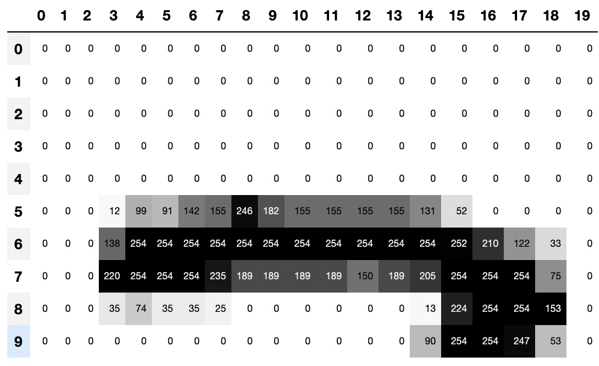
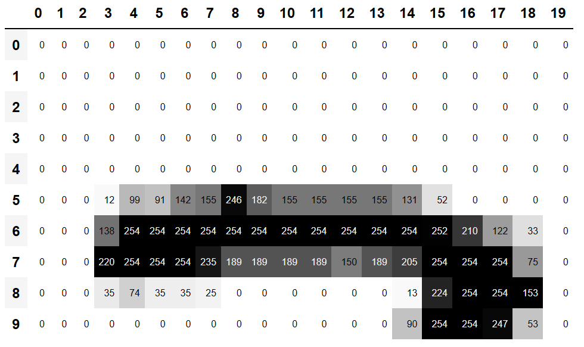

# Convolutional Neural Networks

# 卷积神经网络

In <chapter_mnist_basics> we learned how to create a neural network recognizing images. We were able to achieve a bit over 98% accuracy at distinguishing 3s from 7s—but we also saw that fastai's built-in classes were able to get close to 100%. Let's start trying to close the gap.

在<章节：mnist基础>中我们学习了如何创建一个识别图像的神经网络。我们能够完成超过98%准确度来区别数字3和数字7。但我们也看到了fastai的内置类能够获得进100%的准确度。让我们开始尝试缩小这个差距。

In this chapter, we will begin by digging into what convolutions are and building a CNN from scratch. We will then study a range of techniques to improve training stability and learn all the tweaks the library usually applies for us to get great results.

在本章，我们会通过深入卷积是什么开始并从零开始创建一个卷积神经网络。然后我们会研究一些列技术来改善训练的稳定性并学习所有常用应用库的微调为我们获得更好的结果。

## The Magic of Convolutions

## 卷积的魔力

One of the most powerful tools that machine learning practitioners have at their disposal is *feature engineering*. A *feature* is a transformation of the data which is designed to make it easier to model. For instance, the `add_datepart` function that we used for our tabular dataset preprocessing in <chapter_tabular> added date features to the Bulldozers dataset. What kinds of features might we be able to create from images?

机器学习从业人员有他们最强大的工作之一来处理是*特征工程*。特征是数据的变换，它被设计来使得更容易建模。例如，在<章节：表格模型>中我们用于为我们的表格数据集做预处理的`add_datepart`函数，添加了数据特征给推土机数据集。图像的什么类型的特征我们能够创建呢？

> jargon: Feature engineering: Creating new transformations of the input data in order to make it easier to model.

> 术语：特征工程：创建输入数据新的变换，为了使得它更容易建模。

In the context of an image, a feature is a visually distinctive attribute. For example, the number 7 is characterized by a horizontal edge near the top of the digit, and a top-right to bottom-left diagonal edge underneath that. On the other hand, the number 3 is characterized by a diagonal edge in one direction at the top left and bottom right of the digit, the opposite diagonal at the bottom left and top right, horizontal edges at the middle, top, and bottom, and so forth. So what if we could extract information about where the edges occur in each image, and then use that information as our features, instead of raw pixels?

在图像环境中，特征是可见的特殊特性。例如，数字7的特征是数字顶部附近的水平边缘，和其下方从右上到左下的对角线边缘。另一方面，数字3的特性是一个直接在数字左上到右下的对角线边缘，相对立的对角线在左下和右上，水平边缘在中、上、下，诸如此类。所以如果你能够抽取在每张图像中边缘存在的位置相关信息，然后使用那些信息作为我们的特征，来替代原生像素呢？

It turns out that finding the edges in an image is a very common task in computer vision, and is surprisingly straightforward. To do it, we use something called a *convolution*. A convolution requires nothing more than multiplication, and addition—two operations that are responsible for the vast majority of work that we will see in every single deep learning model in this book!

在计算机视觉中查找图像中的边缘结果是一个非常普通的任务，且惊人的简单。做这个任务，我们使用称为*卷积* 的技术。卷积卷积只需要乘法和加法，在本书中我们将看到的每个单深度学习模型，这两个运算负责绝大多数的工作！

A convolution applies a *kernel* across an image. A kernel is a little matrix, such as the 3×3 matrix in the top right of <basic_conv>.

卷积应用一个*内核* 横穿一个图像。一个内核是一个小型矩阵，例如在<基础卷积>图的右上中是 3×3 矩阵。

<div style="text-align:center">
  <p align="center">
    
  </p>
  <p align="center">图：基础卷积</p>
</div>

The 7×7 grid to the left is the *image* we're going to apply the kernel to. The convolution operation multiplies each element of the kernel by each element of a 3×3 block of the image. The results of these multiplications are then added together. The diagram in <basic_conv> shows an example of applying a kernel to a single location in the image, the 3×3 block around cell 18.

左侧的 7×7 是我们将要应用内核的*图像*。卷积运算内核的每个元素乘以图像的 3×3 块的每个元素。然后这些乘积结果进行加总。在<基础卷积>图中显示了一个应用内核在图像中单个位置上的事例，这个  3×3 的块大约有18个单元。

Let's do this with code. First, we create a little 3×3 matrix like so:

让我们编写这个操作的代码，首先，我们创建如下的 3×3 小型矩阵：

```
top_edge = tensor([[-1,-1,-1],
                   [ 0, 0, 0],
                   [ 1, 1, 1]]).float()
```

We're going to call this our kernel (because that's what fancy computer vision researchers call these). And we'll need an image, of course:

我们称这用为内核（因为这是那些花哨的计算机视觉研究人员所称的）。当然我们需要一张图像：

```
path = untar_data(URLs.MNIST_SAMPLE)
```

```
#hide
Path.BASE_PATH = path
```

```
im3 = Image.open(path/'train'/'3'/'12.png')
show_image(im3);
```

Out: ![img](data:image/png;base64,iVBORw0KGgoAAAANSUhEUgAAAEQAAABECAYAAAA4E5OyAAAABHNCSVQICAgIfAhkiAAAAAlwSFlzAAALEgAACxIB0t1+/AAAADh0RVh0U29mdHdhcmUAbWF0cGxvdGxpYiB2ZXJzaW9uMy4xLjEsIGh0dHA6Ly9tYXRwbG90bGliLm9yZy8QZhcZAAADyElEQVR4nO2aTSg1URjHf1eIS9gQETYWPhOiFLGwkiTJzs7OXpFsWMlKsqEoRT4WFmKhlI+wsWWluCtECIVh3oX3mNd5hzvGneum51d3MzPOee7//p3zPM8Zn2maCBZRPx1ApCGCaIggGiKIhgiiER3k/m/egnx2F8UhGiKIhgiiIYJoiCAaIoiGCKIhgmiIIBrBMlVbHh8fAVhfXwcgPj4egO3tbQCur68BGBkZAaClpQWArKysD8fMzMwEoLm5GYDs7Gw3oX0bcYiGL0jHzPbm0NAQAN3d3SEPKCrq9TeqqKgAoLOzE4DW1lYAUlJSQjWV1DJOcOWQgoICAA4PD23/KC0tDYCamppPJ8/Pzwfg4OCAs7MzADY3N22f3d/fB6C0tPTTMb+AOMQJrnaZra0tAE5OToD/d4TY2FgAEhMTHY/58PAAQGFhIQBHR0fv7s/PzwMhdYgt4hANV2uIF2xsbABQV1f37npcXBzwus4A5OTkhGpKWUMcYZrmZx9PMQzDNAzD7O3tNf1+v+n3+02fz/fuEwgEzEAg4MX0tt9ZHKLhapf5Lip/mZiYAGB4ePjtXkxMDACLi4sApKenhzU2cYhGWB1yfHwMQHFxMQDPz8//PaNqGVUZ+3y2m4FniEM0wuqQ2dlZwN4ZCpWxlpWVAVBfXw9Ae3s7AE1NTQBkZGR4EmNYEzOVjvf39wOwtrYGwOnpqeMx1L/U4OAgAF1dXQAkJCR8NRxJzJzwo6m7ajXe3NxweXkJwMzMDGA1oYLE99aeXFhYAL60CItDnBAxxZ2OKvYGBgYAa735iMnJSQA6OjqcTiEOccKPpO5OqK2tBWB1dRWwmsxLS0u2z6v2wHcRh2hErEMUKu+oqqoCPnZIUVFRaOYLySi/CE8dcnt7C8D09DQAJSUlAFRXVzse4+XlBbCOIXSio1+/QmVlpes4/0UcouGJQ5QzGhoaANjb2wPg/v7e8Rh3d3cAjI2NAVYmqlNeXg5AXl6eu2A1xCEanjhEHYIrZyguLi4A66hTtQsBnp6eABgfHwegp6cHsOodhcqsk5OTAZiamgpp7OIQDU9qmZWVFQAaGxtt76tD8NTU1Ldr5+fnwMeH3YqkpCQAdnZ2AOvA3AVSyzjBE4dcXV0B0NfXB8Do6KibYQArz1Adsra2NgByc3Ndj/kXcYgTPO2HGIYBwO7uLgDLy8uAVXfMzc29PatewlGo9Uc54bMX9lwiDnFCxHbMwoA4xAkiiIYIoiGCaIggGsGq3fC+ixABiEM0RBANEURDBNEQQTREEI0/H3jyQ4wdtXsAAAAASUVORK5CYII=)

Now we're going to take the top 3×3-pixel square of our image, and multiply each of those values by each item in our kernel. Then we'll add them up, like so:

现在我们会取图像顶部 3×3 像素的正方形，并那些每个值乘以内核中的每个数据项。然后我们会加总他们，如下：

```
im3_t = tensor(im3)
im3_t[0:3,0:3] * top_edge
```

Out:$\begin{array}{c,l,l}
		tensor([&[-0., -0., -0.],\\
        &[0., 0., 0.],\\
        &[0., 0., 0.]]) \end{array}$

```
(im3_t[0:3,0:3] * top_edge).sum()
```

Out: tensor(0.)

Not very interesting so far—all the pixels in the top-left corner are white. But let's pick a couple of more interesting spots:

截止目前不是很有趣，左上角的所有像素是白色的。所以让我们选取一些更有意思的点：

```
#hide_output
df = pd.DataFrame(im3_t[:10,:20])
df.style.set_properties(**{'font-size':'6pt'}).background_gradient('Greys')
```

Out: 

<div style="text-align:center">
  <p align="center">
    
  </p>
  <p align="center">图：数字顶部部分</p>
</div>

There's a top edge at cell 5,8. Let's repeat our calculation there:

在单元坐标（5，8）上是顶部边缘。让我们重复我们的计算：

```
(im3_t[4:7,6:9] * top_edge).sum()
```

Out: tensor(762.)

There's a right edge at cell 8,18. What does that give us?:

单元坐标（8，18）是右边缘。这给了我们什么呢？：

```
(im3_t[7:10,17:20] * top_edge).sum()
```

Out: tensor(-29.)

