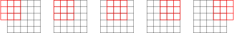
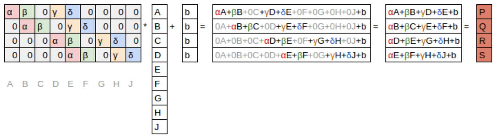

# Convolutional Neural Networks

# 卷积神经网络

In <chapter_mnist_basics> we learned how to create a neural network recognizing images. We were able to achieve a bit over 98% accuracy at distinguishing 3s from 7s—but we also saw that fastai's built-in classes were able to get close to 100%. Let's start trying to close the gap.

在<章节：mnist基础>中我们学习了如何创建一个识别图像的神经网络。我们能够完成超过98%准确度来区别数字3和数字7。但我们也看到了fastai的内置类能够获得进100%的准确度。让我们开始尝试缩小这个差距。

In this chapter, we will begin by digging into what convolutions are and building a CNN from scratch. We will then study a range of techniques to improve training stability and learn all the tweaks the library usually applies for us to get great results.

在本章，我们会通过深入卷积是什么开始并从零开始创建一个卷积神经网络。然后我们会研究一些列技术来改善训练的稳定性并学习所有常用应用库的微调为我们获得更好的结果。

## The Magic of Convolutions

## 卷积的魔力

One of the most powerful tools that machine learning practitioners have at their disposal is *feature engineering*. A *feature* is a transformation of the data which is designed to make it easier to model. For instance, the `add_datepart` function that we used for our tabular dataset preprocessing in <chapter_tabular> added date features to the Bulldozers dataset. What kinds of features might we be able to create from images?

机器学习从业人员有他们最强大的工作之一来处理是*特征工程*。特征是数据的变换，它被设计来使得更容易建模。例如，在<章节：表格模型>中我们用于为我们的表格数据集做预处理的`add_datepart`函数，添加了数据特征给推土机数据集。图像的什么类型的特征我们能够创建呢？

> jargon: Feature engineering: Creating new transformations of the input data in order to make it easier to model.

> 术语：特征工程：创建输入数据新的变换，为了使得它更容易建模。

In the context of an image, a feature is a visually distinctive attribute. For example, the number 7 is characterized by a horizontal edge near the top of the digit, and a top-right to bottom-left diagonal edge underneath that. On the other hand, the number 3 is characterized by a diagonal edge in one direction at the top left and bottom right of the digit, the opposite diagonal at the bottom left and top right, horizontal edges at the middle, top, and bottom, and so forth. So what if we could extract information about where the edges occur in each image, and then use that information as our features, instead of raw pixels?

在图像环境中，特征是可见的特殊特性。例如，数字7的特征是数字顶部附近的水平边缘，和其下方从右上到左下的对角线边缘。另一方面，数字3的特性是一个直接在数字左上到右下的对角线边缘，相对立的对角线在左下和右上，水平边缘在中、上、下，诸如此类。所以如果你能够抽取在每张图像中边缘存在的位置相关信息，然后使用那些信息作为我们的特征，来替代原生像素呢？

It turns out that finding the edges in an image is a very common task in computer vision, and is surprisingly straightforward. To do it, we use something called a *convolution*. A convolution requires nothing more than multiplication, and addition—two operations that are responsible for the vast majority of work that we will see in every single deep learning model in this book!

在计算机视觉中查找图像中的边缘结果是一个非常普通的任务，且惊人的简单。做这个任务，我们使用称为*卷积* 的技术。卷积卷积只需要乘法和加法，在本书中我们将看到的每个单深度学习模型，这两个运算负责绝大多数的工作！

A convolution applies a *kernel* across an image. A kernel is a little matrix, such as the 3×3 matrix in the top right of <basic_conv>.

卷积应用一个*卷积核* 横穿一个图像。一个卷积核是一个小型矩阵，例如在<基础卷积>图的右上中是 3×3 矩阵。

<div style="text-align:center">
  <p align="center">
    
  </p>
  <p align="center">图：基础卷积</p>
</div>

The 7×7 grid to the left is the *image* we're going to apply the kernel to. The convolution operation multiplies each element of the kernel by each element of a 3×3 block of the image. The results of these multiplications are then added together. The diagram in <basic_conv> shows an example of applying a kernel to a single location in the image, the 3×3 block around cell 18.

左侧的 7×7 是我们将要应用卷积核的*图像*。卷积运算卷积核的每个元素乘以图像的 3×3 块的每个元素。然后这些乘积结果进行加总。在<基础卷积>图中显示了一个应用卷积核在图像中单个位置上的事例，这个  3×3 的块大约有18个单元。

Let's do this with code. First, we create a little 3×3 matrix like so:

让我们编写这个操作的代码，首先，我们创建如下的 3×3 小型矩阵：

```
top_edge = tensor([[-1,-1,-1],
                   [ 0, 0, 0],
                   [ 1, 1, 1]]).float()
```

We're going to call this our kernel (because that's what fancy computer vision researchers call these). And we'll need an image, of course:

我们称这用为卷积核（因为这是那些花哨的计算机视觉研究人员所称的）。当然我们需要一张图像：

```
path = untar_data(URLs.MNIST_SAMPLE)
```

```
#hide
Path.BASE_PATH = path
```

```
im3 = Image.open(path/'train'/'3'/'12.png')
show_image(im3);
```

Out: ![img](data:image/png;base64,iVBORw0KGgoAAAANSUhEUgAAAEQAAABECAYAAAA4E5OyAAAABHNCSVQICAgIfAhkiAAAAAlwSFlzAAALEgAACxIB0t1+/AAAADh0RVh0U29mdHdhcmUAbWF0cGxvdGxpYiB2ZXJzaW9uMy4xLjEsIGh0dHA6Ly9tYXRwbG90bGliLm9yZy8QZhcZAAADyElEQVR4nO2aTSg1URjHf1eIS9gQETYWPhOiFLGwkiTJzs7OXpFsWMlKsqEoRT4WFmKhlI+wsWWluCtECIVh3oX3mNd5hzvGneum51d3MzPOee7//p3zPM8Zn2maCBZRPx1ApCGCaIggGiKIhgiiER3k/m/egnx2F8UhGiKIhgiiIYJoiCAaIoiGCKIhgmiIIBrBMlVbHh8fAVhfXwcgPj4egO3tbQCur68BGBkZAaClpQWArKysD8fMzMwEoLm5GYDs7Gw3oX0bcYiGL0jHzPbm0NAQAN3d3SEPKCrq9TeqqKgAoLOzE4DW1lYAUlJSQjWV1DJOcOWQgoICAA4PD23/KC0tDYCamppPJ8/Pzwfg4OCAs7MzADY3N22f3d/fB6C0tPTTMb+AOMQJrnaZra0tAE5OToD/d4TY2FgAEhMTHY/58PAAQGFhIQBHR0fv7s/PzwMhdYgt4hANV2uIF2xsbABQV1f37npcXBzwus4A5OTkhGpKWUMcYZrmZx9PMQzDNAzD7O3tNf1+v+n3+02fz/fuEwgEzEAg4MX0tt9ZHKLhapf5Lip/mZiYAGB4ePjtXkxMDACLi4sApKenhzU2cYhGWB1yfHwMQHFxMQDPz8//PaNqGVUZ+3y2m4FniEM0wuqQ2dlZwN4ZCpWxlpWVAVBfXw9Ae3s7AE1NTQBkZGR4EmNYEzOVjvf39wOwtrYGwOnpqeMx1L/U4OAgAF1dXQAkJCR8NRxJzJzwo6m7ajXe3NxweXkJwMzMDGA1oYLE99aeXFhYAL60CItDnBAxxZ2OKvYGBgYAa735iMnJSQA6OjqcTiEOccKPpO5OqK2tBWB1dRWwmsxLS0u2z6v2wHcRh2hErEMUKu+oqqoCPnZIUVFRaOYLySi/CE8dcnt7C8D09DQAJSUlAFRXVzse4+XlBbCOIXSio1+/QmVlpes4/0UcouGJQ5QzGhoaANjb2wPg/v7e8Rh3d3cAjI2NAVYmqlNeXg5AXl6eu2A1xCEanjhEHYIrZyguLi4A66hTtQsBnp6eABgfHwegp6cHsOodhcqsk5OTAZiamgpp7OIQDU9qmZWVFQAaGxtt76tD8NTU1Ldr5+fnwMeH3YqkpCQAdnZ2AOvA3AVSyzjBE4dcXV0B0NfXB8Do6KibYQArz1Adsra2NgByc3Ndj/kXcYgTPO2HGIYBwO7uLgDLy8uAVXfMzc29PatewlGo9Uc54bMX9lwiDnFCxHbMwoA4xAkiiIYIoiGCaIggGsGq3fC+ixABiEM0RBANEURDBNEQQTREEI0/H3jyQ4wdtXsAAAAASUVORK5CYII=)

Now we're going to take the top 3×3-pixel square of our image, and multiply each of those values by each item in our kernel. Then we'll add them up, like so:

现在我们会取图像顶部 3×3 像素的正方形，并那些每个值乘以卷积核中的每个数据项。然后我们会加总他们，如下：

```
im3_t = tensor(im3)
im3_t[0:3,0:3] * top_edge
```

Out:$\begin{array}{c,l,l}
		tensor([&[-0., -0., -0.],\\
        &[0., 0., 0.],\\
        &[0., 0., 0.]]) \end{array}$

```
(im3_t[0:3,0:3] * top_edge).sum()
```

Out: tensor(0.)

Not very interesting so far—all the pixels in the top-left corner are white. But let's pick a couple of more interesting spots:

截止目前不是很有趣，左上角的所有像素是白色的。所以让我们选取一些更有意思的点：

```
#hide_output
df = pd.DataFrame(im3_t[:10,:20])
df.style.set_properties(**{'font-size':'6pt'}).background_gradient('Greys')
```

Out: 

<div style="text-align:center">
  <p align="center">
    
  </p>
  <p align="center">图：数字顶部部分</p>
</div>

There's a top edge at cell 5,8. Let's repeat our calculation there:

在单元坐标（5，8）上是顶部边缘。让我们重复我们的计算：

```
(im3_t[4:7,6:9] * top_edge).sum()
```

Out: tensor(762.)

There's a right edge at cell 8,18. What does that give us?:

单元坐标（8，18）是右边缘。这给了我们什么呢？：

```
(im3_t[7:10,17:20] * top_edge).sum()
```

Out: tensor(-29.)

As you can see, this little calculation is returning a high number where the 3×3-pixel square represents a top edge (i.e., where there are low values at the top of the square, and high values immediately underneath). That's because the `-1` values in our kernel have little impact in that case, but the `1` values have a lot.

如你所见，在顶部边缘 3×3 像素方格位置这个小计算返回了一个很大的值（即，在方格顶部有很小的值，在下面立刻有了很大的值）。这是因为我们卷积核中`-1`值在这种情况下有很小的影响，但是值`1`有比较大的影响。

Let's look a tiny bit at the math. The filter will take any window of size 3×3 in our images, and if we name the pixel values like this:

让我们看一点数学内容。在我们图像中过滤器会取任意尺寸 3×3 的窗口，如果我们命名像素值像下面的样子：
$$
\begin{matrix} a1 & a2 & a3 \\ a4 & a5 & a6 \\ a7 & a8 & a9 \end{matrix}
$$
it will return $a1+a2+a3-a7-a8-a9$. If we are in a part of the image where $a1$, $a2$, and $a3$ add up to the same as $a7$, $a8$, and $a9$, then the terms will cancel each other out and we will get 0. However, if $a1$ is greater than $a7$, $a2$ is greater than $a7$, $a2$ is greater than $a8$, and $a3$ is greater than $a9$,  we will get a bigger number as a result. So this filter detects horizontal edges—more precisely, edges where we go from bright parts of the image at the top to darker parts at the bottom.

它会返回 $a1+a2+a3-a7-a8-a9$。如果图像 $a1$, $a2$, 和 $a3$的部分合计与 $a7$, $a8$, and $a9$部分相等，那么数据项会相互抵消且我们会得到 0。然而，如果$a1$ 比 $a7$ 更大， $a2$ 比 $a7$ 更大， $a2$ 比 $a8$ 更大， 及 $a3$ 比 $a9$ 更大，我们会得到一个更大的结果值。所以这个过滤器检测了水平边缘，更加精确的话，从图像顶部的高亮部分到底部的暗黑部分的边缘。

Changing our filter to have the row of `1`s at the top and the `-1`s at the bottom would detect horizontal edges that go from dark to light. Putting the `1`s and `-1`s in columns versus rows would give us filters that detect vertical edges. Each set of weights will produce a different kind of outcome.

改变我们的过滤器为顶部是为`1`的行，底部是为`-1`的行，会检测从暗到亮的水平边缘。相对说行，在列中放置`1`和`-1`给我们的过滤器来检测垂直边缘。每个权重设置会产出不同种类的结果。

Let's create a function to do this for one location, and check it matches our result from before:

让我们创建一个函数来为一个位置做这个操作，并检查它是否与我们之前的结果相匹配：

```
def apply_kernel(row, col, kernel):
    return (im3_t[row-1:row+2,col-1:col+2] * kernel).sum()
```

```
apply_kernel(5,7,top_edge)
```

Out: tensor(762.)

But note that we can't apply it to the corner (e.g., location 0,0), since there isn't a complete 3×3 square there.

但要注意，我们不能在角上应用它（如，位置0,0），因为这里没有一个完整的 3×3 方格。

### Mapping a Convolution Kernel

### 映射卷积核

We can map `apply_kernel()` across the coordinate grid. That is, we'll be taking our 3×3 kernel, and applying it to each 3×3 section of our image. For instance, <nopad_conv> shows the positions a 3×3 kernel can be applied to in the first row of a 5×5 image.

我们能够在坐标格上映射`apply_kernel()`。即，我们会取 3×3 卷积核，并应用它在每个我们图像上 3×3 的区域上。例如，图<未填充的卷积>中展示了放置了 3×3 卷积核能够应用在 5×5 尺寸图像的第一行上。

<div style="text-align:center">
  <p align="center">
    
  </p>
  <p align="center">图：未填充的卷积</p>
</div>

To get a grid of coordinates we can use a *nested list comprehension*, like so:

取表格的坐标，我们能够使用*嵌套列表解释器*，如下：

```
[[(i,j) for j in range(1,5)] for i in range(1,5)]
```

Out: $\begin{array}{r}[[(1, 1), (1, 2), (1, 3), (1, 4)],\\
 [(2, 1), (2, 2), (2, 3), (2, 4)],\\
 [(3, 1), (3, 2), (3, 3), (3, 4)],\\
 [(4, 1), (4, 2), (4, 3), (4, 4)]] \end{array}$

> note: Nested List Comprehensions: Nested list comprehensions are used a lot in Python, so if you haven't seen them before, take a few minutes to make sure you understand what's happening here, and experiment with writing your own nested list comprehensions.
>
> 注释：嵌套列表解释：在Python中嵌套列表解释经常被使用，如果之前你没有看过它们，花几分钟确保你能够理解这会发生什么，并编写你自己的嵌套列表解释来做实验。

Here's the result of applying our kernel over a coordinate grid:

这是在坐标表格上应用我们卷积核的结果：

```
rng = range(1,27)
top_edge3 = tensor([[apply_kernel(i,j,top_edge) for j in rng] for i in rng])

show_image(top_edge3);
```

Out:![img](data:image/png;base64,iVBORw0KGgoAAAANSUhEUgAAAEQAAABECAYAAAA4E5OyAAAABHNCSVQICAgIfAhkiAAAAAlwSFlzAAALEgAACxIB0t1+/AAAADh0RVh0U29mdHdhcmUAbWF0cGxvdGxpYiB2ZXJzaW9uMy4xLjEsIGh0dHA6Ly9tYXRwbG90bGliLm9yZy8QZhcZAAAE1UlEQVR4nO2c104cSxRFF9iYYHIGk0EkiSQsXuA3+Ak+iI/hAT8ihEBgRI4i2ORsgkn3wdpT0weu1YN75KurWi893dNd01TvPnXOrhIpz8/PeBypf/sG/mv4DjH4DjH4DjH4DjG8/92Xw8PD/9shaGhoKOW1414hBt8hBt8hBt8hBt8hht+OMuLp6QmAk5MTAM7OzgDY39+PnfPjxw8AVlZWALi9vQ20UVJSAsCHDx8Cx9PS0gAoKyuLHfv06RMA5eXlAGRmZoa5zUjwCjGEUoiUMDs7C8DY2BgABwcHoX9ofX099LkZGRkAVFRUANDb2wtAU1MT4NRk1RYFXiEG3yGGUK/M1dUV4CQqKXd1dcXOKSgoAKClpQWAwsJCALKysgA4PT0FIDU1+AwUfBWMAaanpwFYXV0FYGpqKvD7+fn5gf0o8QoxhFJIf38/ALW1tQBUV1cDkJ2d7Rp6/6upd+/eBbZWERZZmEdHR7FjCwsLAIyMjACwu7sLuGB7c3MDQE5OTpjbTwivEEMohZSWlgJQWVkJuCRLKgCXvN3f3wNwd3cHwMPDQ6AtfS8UQ+IVos9VVVUA1NXVBa6RqmxbUeAVYgilEI0Ah4eHAKSnp784R6n7z58/AacQ7Qs93Z2dHcDFi/jzpIzBwcHAvtjY2ABgc3MzzO0nhFeIIZRC9LTji7lEUS4jZUxOTgbabG5ujp2r/EaxQ/mGYouUmgy8QgyhFPInXF9fAzA3NwfAxMRE4HhfXx8AHR0dsWuklr29PcDFHRWIujYZeIUYkq6Q8/NzwOUjNTU1gDOB6uvrAVf7AIyOjgJuNPn27Rvgyv6GhobAvjLYKPAKMSRdIaqMW1tbAZfdpqT8mie6uLgAgnmIMtDj42MAvn79GjhXmbKMo87OTsCpLv53EsUrxJB0hagylkKkGJnLUoOePrjqViNPd3c34DLmmZkZwI1Yqod6enpibTQ2Nr7pfr1CDL5DDEl/ZWQdyqGXpVhUVBTYjzebNATLbtDQrGFYr4YKw+/fvwPuVQPIzc0FXAAOi1eIIekKUVGnQLi4uAg4ZeTl5QFQXFwcu0blvlT08eNHwD112ZJqQwVjPNZ2CItXiCHpCrHIStBWMSbe7FGs0NCpaQchZUg5GtJfI9F1uF4hhsgVoiJOxo+KO01TqCBT7HgNpexabfBvKP2Pjz9CprfaCotXiCEyhUgZy8vLgLMINSK0t7cD4SaXHh8fAVf2yzpUuq91I7ISXmvzrSaSV4ghMoUoS9ze3gbcdKMKNE2DyszRKCPiDWzZjePj44BTwOfPnwFnEKlNrTBS3IC3G9FeIYbIFKL6Q3WGtlLMly9fAJifnwderhu7vLyMfZZ6tMRC0xIyn2UMKYZIGYo5tr1E8AoxRKaQtrY24GVWKWUo+5QRZCe9NHIADAwMAC7+yCLUGjPFDilJ1e7W1tYf/x1eIQbfIYbIXhnJVyW7jBkVXprJl7xlGOm618p/tWHXlGmlgdpSoH5rII3HK8QQmUIULPXkZeZo9ZG2SuETQWm4htW1tTXAGUMyoaLAK8QQeQxZWloCnFI0L6MkS2ayCjXFhXjLT7FA1oFihewAxZBk4BViiNwgssZMogbN38YrxJDi/xlCEK8Qg+8Qg+8Qg+8Qg+8Qg+8Qwz/aP/Y2oVu6fAAAAABJRU5ErkJggg==)

Looking good! Our top edges are black, and bottom edges are white (since they are the *opposite* of top edges). Now that our image contains negative numbers too, `matplotlib` has automatically changed our colors so that white is the smallest number in the image, black the highest, and zeros appear as gray.

We can try the same thing for left edges:

看起来很好！边缘顶部是黑色，边缘底部是白色（因为它们是边缘的*对立*面）。现在我们图像也包含负值，`matplotlib`已经制动的改变了颜色，所以这个在图像中白色是最小的值，黑色是最大的值，及另显示为灰色。

```
left_edge = tensor([[-1,1,0],
                    [-1,1,0],
                    [-1,1,0]]).float()

left_edge3 = tensor([[apply_kernel(i,j,left_edge) for j in rng] for i in rng])

show_image(left_edge3);
```

Out:![img](data:image/png;base64,iVBORw0KGgoAAAANSUhEUgAAAEQAAABECAYAAAA4E5OyAAAABHNCSVQICAgIfAhkiAAAAAlwSFlzAAALEgAACxIB0t1+/AAAADh0RVh0U29mdHdhcmUAbWF0cGxvdGxpYiB2ZXJzaW9uMy4xLjEsIGh0dHA6Ly9tYXRwbG90bGliLm9yZy8QZhcZAAAEa0lEQVR4nO2cyUosSxCGv9brPM8TDqgLZ1EXIgouRHwZH8dXEcGFS9GFKCoqqOCEA87zrGdx+Dur8nhaqy37Xi75baqpLLOTyD8jIiOrjby/v+MwJP3bA/iv4Qxi4Qxi4Qxi4Qxi8U+sxrGxsf9tCBodHY18dN8pxMIZxMIZxMIZxMIZxCJmlLF5eXkB4PT0FICKiopo2/n5OQBZWVkAnJycANDS0gLA7e0tAI+Pjx/2nZaWFv2cn58PwP39PQBXV1dBhvktnEIsAilkY2MDMDPmVUiYRCK/U4Tc3FzAqE73pUYpKEycQiycQSwCLZmpqSkA2tra/vpMSkoKANnZ2TH7yszMBOD4+BiApCQzN5eXlwAUFRX5/kYOen19HYDt7e0vj/2rOIVYBFLIw8MDYGY/PT092paXlweY8KnZVfj9jLu7u+jnyclJAEZGRgAoLS319amyp1NIAgikkM7OTgBqampCH8jh4WH08+zsLAADAwMAHB0dAZCTkwPAxcVF6N8vnEIsAimkr68PMGv4I56engC4vr6O2dfNzQ0Ae3t7fzyvREz09vYCcHZ2BjiFJJRAClHuILyRQby9vQF/38RplpV2y3coTQcYGhoCoLu7GzDRRSn72tpakGEHwinEIpBCvoOyz7m5OQCam5t97eXl5dHPlZWVADQ2NgKQkZEBwPT0tK+vn8ApxCJhClHpQOtf+yGpwFtK0DZf7OzsACYzLisrA4wP+yyiBcEpxCJhClHuoKv8gh25wOQ5UoYUoAgmBdXV1QFGKbu7u9E+lA8FxSnEImEK0W54cHAQMDOo+ok3+1UUGR8fB0xEkqpsH6O+S0pKovdmZmbiGqdTiIUziEXClozCq9Lvr6Bt/+vrK2CWhq4Kw4WFhYBJ6AAaGhoA2NzcDDROpxCLhClEp3G6qhyp4nKskoLaFhYWAOjo6PC165yovb09es8pJCQSphAbb4HaRkVlu5QwPz8PGJUVFBQApqQg1QEUFxfHNS6nEIsfU4hmVQdRTU1NgCkUHxwcfNqHSgJSivxBV1eX7zklal7VxVsicAqxCF0hUoYigtZ7f38/ACsrK4H7kppUSlQeIqQ6XQEWFxcDjx2cQv4gdIUsLy8DsL+/DxiF1NbWAmZLr/xD/kFX7zPPz8++Z5VnVFdXA5CcnAyYvMT7vki8x5xOIRahK0SzK18xPDwMmNnWu2ba9stPqB1MQUhRQ1Gkp6cHMNt8RRv5Dn03mNwkKE4hFqErRL5AvkNHllKMVwmfkZqaChifUV9fD5i3IXXkKd8Rb2Tx4hRi4QxiEfqS0TskCpVK3ScmJgBobW0FTLKl4o73bFfVdF3lePWMHKYKR6urq77738EpxCJ0hVRVVQGmqOPdkoPZdGl2hcIw+FPwj5BTXVpa8vUZBk4hFqErRGcnKuF99S3EWCiUb21tAT/7YwCnEIsfKxApyqgcKHQO6z1lA5PAedHPUBKJU4hFxP0zBD9OIRbOIBbOIBbOIBbOIBbOIBa/AEQyr63rTKk/AAAAAElFTkSuQmCC)

As we mentioned before, a convolution is the operation of applying such a kernel over a grid in this way. In the paper ["A Guide to Convolution Arithmetic for Deep Learning"](https://arxiv.org/abs/1603.07285) there are many great diagrams showing how image kernels can be applied. Here's an example from the paper showing (at the bottom) a light blue 4×4 image, with a dark blue 3×3 kernel being applied, creating a 2×2 green output activation map at the top.

如我们之前提过，卷积是以这种方式在表格上的卷积核应用运算。在论文中[深度学习卷积运算指引](https://arxiv.org/abs/1603.07285)有很多图解，展示了图卷积核如何被应用。下面是论文中的一个例子。展示了一个浅蓝色 4×4 图像（在底部）带有被应用了深蓝色 3×3 卷积核，在顶部创建了一个 2×2 的绿色输出激活映射。

<div style="text-align:center">
  <p align="center">
    
  </p>
  <p align="center">图：在 4×4 图像应用 3×3 卷积核</p>
</div>

Look at the shape of the result. If the original image has a height of `h` and a width of `w`, how many 3×3 windows can we find? As you can see from the example, there are `h-2` by `w-2` windows, so the image we get has a result as a height of `h-2` and a width of `w-2`.

看一下结果形状。如果原始图像有高为`h`及宽为`w`，我们能够找到多少个 3×3 窗口？如你例子中所看到的，有`h-2`乘以`w-2`个窗口，所以对于这个图像，我们有一个高为`h-2`和宽为`w-2`的结果。

We won't implement this convolution function from scratch, but use PyTorch's implementation instead (it is way faster than anything we could do in Python).

我们不会从零开始实现这个卷积函数，而是使用PyTorch的实现来替代（它比我们能够在Python中所使用的任何方式都要快）。

### Convolutions in PyTorch

### PyTorch中的卷积

Convolution is such an important and widely used operation that PyTorch has it built in. It's called `F.conv2d` (recall that `F` is a fastai import from `torch.nn.functional`, as recommended by PyTorch). The PyTorch docs tell us that it includes these parameters:

- input:: input tensor of shape `(minibatch, in_channels, iH, iW)`
- weight:: filters of shape `(out_channels, in_channels, kH, kW)`

卷积是如此的重要及被广泛使用的运算，以至PyTorch已经内置它了。它被称为`F.conv2d`（回忆想一下，`F`是`torch.nn.functional`的fastai导入，这是PyTorch所推荐的）。PyTorch文档告诉我们它包含这些参数：

- 输入：输入形状张量 `(minibatch, in_channels, iH, iW)`
- 权重：形状过滤器`(out_channels, in_channels, kH, kW)`

Here `iH,iW` is the height and width of the image (i.e., `28,28`), and `kH,kW` is the height and width of our kernel (`3,3`). But apparently PyTorch is expecting rank-4 tensors for both these arguments, whereas currently we only have rank-2 tensors (i.e., matrices, or arrays with two axes).

这里的`iH,iW`是图像的高和宽（例如：`28,28`），及 `kH,kW`是我们卷积核的高和宽（`3,3`）。但很显然PyTorch希望对这两个的那些参数是4阶张量，不管怎么说当前我们只有2阶张量（例如，矩阵或两个轴的数组）。

The reason for these extra axes is that PyTorch has a few tricks up its sleeve. The first trick is that PyTorch can apply a convolution to multiple images at the same time. That means we can call it on every item in a batch at once!

由于这些扩展轴的因素，PyTorch有一些处理它的技巧。第一个小技巧是PyTorch能够同时在多张图像上应用一个卷积。这表示我们能够一次性的在一个批次中每个数据项上调用它！

The second trick is that PyTorch can apply multiple kernels at the same time. So let's create the diagonal-edge kernels too, and then stack all four of our edge kernels into a single tensor:

第二个小技巧是PyTorch能够同时应用多个内样。所以我们也能够创建对角边缘内样，然后堆积我们所有边缘的四个卷积核在一个张量中：

```
diag1_edge = tensor([[ 0,-1, 1],
                     [-1, 1, 0],
                     [ 1, 0, 0]]).float()
diag2_edge = tensor([[ 1,-1, 0],
                     [ 0, 1,-1],
                     [ 0, 0, 1]]).float()

edge_kernels = torch.stack([left_edge, top_edge, diag1_edge, diag2_edge])
edge_kernels.shape
```

Out: torch.Size([4, 3, 3])

To test this, we'll need a `DataLoader` and a sample mini-batch. Let's use the data block API:

来测试一下，我们会需要一个`DataLoader`和一个简单的小批次。让我们使用数据块API：

```
mnist = DataBlock((ImageBlock(cls=PILImageBW), CategoryBlock), 
                  get_items=get_image_files, 
                  splitter=GrandparentSplitter(),
                  get_y=parent_label)

dls = mnist.dataloaders(path)
xb,yb = first(dls.valid)
xb.shape
```

Out: torch.Size([64, 1, 28, 28])

By default, fastai puts data on the GPU when using data blocks. Let's move it to the CPU for our examples:

当使用数据块时，fastai默认放置数据在GPU上。让我们把我们的例子移到CPU上：

```
xb,yb = to_cpu(xb),to_cpu(yb)
```

One batch contains 64 images, each of 1 channel, with 28×28 pixels. `F.conv2d` can handle multichannel (i.e., color) images too. A *channel* is a single basic color in an image—for regular full-color images there are three channels, red, green, and blue. PyTorch represents an image as a rank-3 tensor, with dimensions `[channels, rows, columns]`.

一个批次包含64张图像，每个都是1个通道及 28×28 个像素。`F.conv2d`也能够处理多通道（即，彩色）图像。一个*通道*是一张图像中的一个单基础色，对于通常的全色图像有三个通道：红、绿和蓝。PyTorch用一个3阶张量维度为`[通道，行，列]`描述一张图像。

We'll see how to handle more than one channel later in this chapter. Kernels passed to `F.conv2d` need to be rank-4 tensors: `[channels_in, features_out, rows, columns]`. `edge_kernels` is currently missing one of these. We need to tell PyTorch that the number of input channels in the kernel is one, which we can do by inserting an axis of size one (this is known as a *unit axis*) in the first location, where the PyTorch docs show `in_channels` is expected. To insert a unit axis into a tensor, we use the `unsqueeze` method:

稍后在本章节我们会看到如何处理超过一个通道。卷积核传递给`F.conv2d`需要是4阶张量：`[channels_in, features_out, rows, columns]`. `edge_kernels`，目前缺少其中一个。我们需要告诉PyTorch在卷积核中输入通道的数量是一个，在第一个位置我们能够通过插入一个尺寸为一的轴来实现（这被称为*单元轴*），这个位置PyTorch文档显示要求是`in_channels`。插入一个单元轴进入一个张量，我们使用`unsqueeze`方法：

```
edge_kernels.shape,edge_kernels.unsqueeze(1).shape
```

Out: (torch.Size([4, 3, 3]), torch.Size([4, 1, 3, 3]))

This is now the correct shape for `edge_kernels`. Let's pass this all to `conv2d`:

现在这就是`edge_kernels`的正确形状。让我们传递所有这些内容给`conv2d`：

```
edge_kernels = edge_kernels.unsqueeze(1)
```

```
batch_features = F.conv2d(xb, edge_kernels)
batch_features.shape
```

Out: torch.Size([64, 4, 26, 26])

The output shape shows we gave 64 images in the mini-batch, 4 kernels, and 26×26 edge maps (we started with 28×28 images, but lost one pixel from each side as discussed earlier). We can see we get the same results as when we did this manually:

输出形状显示，我们在这个小批次中有64张图像，4个卷积核，及 26×26 个边缘映射（我们从 28×28 的图像开始的，但是如之前讨论过的，每个边丢失了一个像素）。我们能够看到我们获得了与手动做这个操作相同的结果：

```
show_image(batch_features[0,0]);
```

Out:![img](data:image/png;base64,iVBORw0KGgoAAAANSUhEUgAAAEQAAABECAYAAAA4E5OyAAAABHNCSVQICAgIfAhkiAAAAAlwSFlzAAALEgAACxIB0t1+/AAAADh0RVh0U29mdHdhcmUAbWF0cGxvdGxpYiB2ZXJzaW9uMy4xLjEsIGh0dHA6Ly9tYXRwbG90bGliLm9yZy8QZhcZAAADdUlEQVR4nO2cyUorQRRAT5wVFJxHVARxgDgguHbjzh9wq1s/x1/RrStXggqCExFRcZFExQEnHBeP25W+rw0x6XQ/Hvesmkp1p7x9UnXrdmPi6+sLw1ER9wD+NSwgCguIwgKisIAoqvJ9uLq6+t8uQSsrK4mgdjNEYQFRWEAUFhCFBURhAVFYQBQWEIUFRGEBUeRN3eNCilaXl5cAvL+/A9Df3w9AQ0MDACMjIwAcHx8D8Pz8XPJ3myGK2A15e3sD4Obmxmt7eXkB4PPzE4BEInAfxuDgoO/ci4uLksdjhihCM+Tu7g5wv+/q6urAfufn5wD09PQAzgKxohDk2l1dXQA0NTUVMeJgzBBFSYaIFQD7+/sATE9PAz8bUggyZ/T19QVeq66uztcvjNVFMEMUJRlye3vrHW9tbQEwOTmZ9xy5u4Lc/YmJCa9NVp7t7W0ARkdHfee0t7cDLl+5urr69dh/wgxRhLbKPDw8AC67HB4eBqC1tRVwq4nkDpIzfHx8AFBfX+9dS1acjY0NwBkic8bQ0BDgDL2/vw/rzzBDNCUZkrv+z87OAlBZWVnUtWTeANjb2wP8qxjA2NgYADU1NQCcnp4W9V35MEMUJRnS3NzsHY+PjwP+Ox2EzA/6NQzJYAHW19cBmJmZ8fWRuUSucXBwUMyw82KGKEJbZXp7ewPbr6+vCzo/lUp5x5lMBoDl5WUAOjs7AWhpaQFgc3MTcCtbmJghCguIIvYC0dPTEwA7Ozte29TUFOBS9GQyCbhCkCR/5cAMUcRuiEymMpECLC4uAi5FF1N2d3eB3xWTfosZoojNENnsyRZfSooA3d3dvraqqj/DPDo68p1bDswQRWyGnJycAC5xW1hY8D6TzdvAwAAAh4eHQHnNEMwQReSGPD4+Am7FkEJSbuovZUhZTcJ4AFUoZogickMk35Ai0NLSEgAdHR1eH9nmS9/c0kC5MUMUkRuSzWYB94qD5BptbW1eHylMr62tRTw6M+QvIjdEHipJgVpyDnk8AW4HHObjhUIxQxQWEEXkPxl5S0Cq9ILUTaHwOmw5MEMUkRtydnYGwPz8vK+9sbHRO5aNXxyYIYrIDZH3Q15fXwGora0FoKLC3RtZduPADFFEbsjc3BzgEjIhnU57x7nvrEaNGaJI2D9D8GOGKCwgCguIwgKisIAoLCCKb79WEcYbcUyrAAAAAElFTkSuQmCC)

The most important trick that PyTorch has up its sleeve is that it can use the GPU to do all this work in parallel—that is, applying multiple kernels, to multiple images, across multiple channels. Doing lots of work in parallel is critical to getting GPUs to work efficiently; if we did each of these operations one at a time, we'd often run hundreds of times slower (and if we used our manual convolution loop from the previous section, we'd be millions of times slower!). Therefore, to become a strong deep learning practitioner, one skill to practice is giving your GPU plenty of work to do at a time.

PyTorch有一个最重要的技巧，就是它能够使用GPU并行做这些所有处理。即，应用多个卷积核，给多个图像，遍历多个通道。并行做这么多的处理对于让GPU有效的工作是至关重要的。如果我们每次做每次运算中的一个，通常我们的运行速度会慢上数百倍（如果我们使用上部分的手动卷积循环，我们会慢上数百万倍）。因此一个优秀的深度学习从业人员，一个常规的技巧是每次给你的GPU大量的工作去做。

It would be nice to not lose those two pixels on each axis. The way we do that is to add *padding*, which is simply additional pixels added around the outside of our image. Most commonly, pixels of zeros are added.

在每个轴上不丢失那两个像素会更好些。因此我们通过添加*填充*来完成这个工作，它是简单的在我们图像的外围添加像素。最常用的是添加像素零。

### Strides and Padding

### 步长和填充

With appropriate padding, we can ensure that the output activation map is the same size as the original image, which can make things a lot simpler when we construct our architectures. <pad_conv> shows how adding padding allows us to apply the kernels in the image corners.

有合理的填充，我们能够确保输出激活映射与原始图像是相同的尺寸，当我们构建我们的架构时它能够使的事情简单的多。图<带有填充的卷积>显示了如何添加填充以允许我们在图像的角上应用卷积核。

<div style="text-align:center">
  <p align="center">
    
  </p>
  <p align="center">图：带有填充的卷积</p>
</div>

With a 5×5 input, 4×4 kernel, and 2 pixels of padding, we end up with a 6×6 activation map, as we can see in <four_by_five_conv>.

有一个 5×5 的卷积核，4×4 的卷积核及填充了两个像素，最终有一个 6×6 的激活映射，如下图<5×5 输入的 4×4 卷积核及填充了 2 个像素>所示。

<div style="text-align:center">
  <p align="center">
    
  </p>
  <p align="center">图：5×5 输入的 4×4 卷积核及填充了 2 个像素</p>
</div>

If we add a kernel of size `ks` by `ks` (with `ks` an odd number), the necessary padding on each side to keep the same shape is `ks//2`. An even number for `ks` would require a different amount of padding on the top/bottom and left/right, but in practice we almost never use an even filter size.

如果我们添加了尺寸`ks`乘以`ks`的卷积核（`ks`是一个奇数），必须每个边填充`ks//2`来保持相同的形状。如果`ks`为偶数也许需要在顶部/底部和左侧/右侧填充不同的数量，但实践中我们几乎从来都不用偶数过滤器尺寸。

So far, when we have applied the kernel to the grid, we have moved it one pixel over at a time. But we can jump further; for instance, we could move over two pixels after each kernel application, as in <three_by_five_conv>. This is known as a *stride-2* convolution. The most common kernel size in practice is 3×3, and the most common padding is 1. As you'll see, stride-2 convolutions are useful for decreasing the size of our outputs, and stride-1 convolutions are useful for adding layers without changing the output size.

截止目前，当我们已经应用卷积核到表格时，我们每次结束都移动卷积核一个像素。但我们能够跳的更远。例如，我们能够在每个卷积核应用后移两个像素，如图<有 5×5 输入的 3×3 卷积核和步长2卷积及填充1个像素>所示。这被称为*步长2*卷积。在实践中最常用的卷积核尺寸是 3×3，及最常用的填充是1.你将会看到，步长2卷积对于减小我们输出的尺寸是有帮助的，步长1卷积对于不用改变输出尺寸的添加层是有用处的。

<div style="text-align:center">
  <p align="center">
    
  </p>
  <p align="center">图：有 5×5 输入的 3×3 卷积核和步长2卷积及填充1个像素</p>
</div>

In an image of size `h` by `w`, using a padding of 1 and a stride of 2 will give us a result of size `(h+1)//2` by `(w+1)//2`. The general formula for each dimension is `(n + 2*pad - ks)//stride + 1`, where `pad` is the padding, `ks`, the size of our kernel, and `stride` is the stride.

在一张尺寸`h`乘以`w`的图像中，使用为1的填充和步长2会提供给我们尺寸`(h+1)//2` 乘以 `(w+1)//2`的结果。对于每个维度的常用公式是 `(n + 2*pad - ks)//stride + 1`，这里的`pad`是填充数，`ks`为我们卷积核的尺寸，及`stride`是步长数。

Let's now take a look at how the pixel values of the result of our convolutions are computed.

现在让我们看一下我们卷积结果的像素值是如何计算的。

### Understanding the Convolution Equations

### 理解卷积方程

To explain the math behind convolutions, fast.ai student Matt Kleinsmith came up with the very clever idea of showing [CNNs from different viewpoints](https://medium.com/impactai/cnns-from-different-viewpoints-fab7f52d159c). In fact, it's so clever, and so helpful, we're going to show it here too!

来解释一下卷积背后的数字，fast.ai的学生马特·克莱因史密斯提出了展示[CNN不同观察视角](https://medium.com/impactai/cnns-from-different-viewpoints-fab7f52d159c)的非常聪明的想法。实践上，这人想法是那么的聪明，那么的有帮助，我们也会在这里展示它！

Here's our 3×3 pixel image, with each pixel labeled with a letter:

这是我们的 3×3 像素图像，每个像素用一个字母做了标记：

<div style="text-align:center">
  <p align="center">
    
  </p>
  <p align="center">图：图像</p>
</div>

And here's our kernel, with each weight labeled with a Greek letter:

这是我们的卷积核，每个权重用一个希腊字母做了标记：

<div style="text-align:center">
  <p align="center">
    
  </p>
  <p align="center">图：卷积核</p>
</div>

Since the filter fits in the image four times, we have four results:

因此在图像中过滤器拟合了四次，我们有四个结果：

<div style="text-align:center">
  <p align="center">
    
  </p>
  <p align="center">图：激活单元</p>
</div>

<apply_kernel> shows how we applied the kernel to each section of the image to yield each result.

下图<应用卷积核>展示了我们如果应用卷积核到图像的每个部分从而产生每个结果：

<div style="text-align:center">
  <p align="center">
    
  </p>
  <p align="center">图：应用卷积核</p>
</div>

The equation view is in <eq_view>.

在图<方程>中显示了方式计算。

<div style="text-align:center">
  <p align="center">
    
  </p>
  <p align="center">图：方程</p>
</div>

Notice that the bias term, *b*, is the same for each section of the image. You can consider the bias as part of the filter, just like the weights (α, β, γ, δ) are part of the filter.

请注意偏置项*b*，在图像的每个部分都是相同的。你可以认为偏置作为过滤器的部分，就像权重（α, β, γ, δ)）是过滤器的一部分一样。

Here's an interesting insight—a convolution can be represented as a special kind of matrix multiplication, as illustrated in <conv_matmul>. The weight matrix is just like the ones from traditional neural networks. However, this weight matrix has two special properties:

这是一个有趣的见解，卷积能够被描述为一个特殊类型的矩阵乘法，如插图<卷积既矩阵乘法>所示。权重矩阵只是类似传统的神经网络。然而，权重矩阵有两个特别的属性：

1. The zeros shown in gray are untrainable. This means that they’ll stay zero throughout the optimization process.
2. Some of the weights are equal, and while they are trainable (i.e., changeable), they must remain equal. These are called *shared weights*.

1. 零所显示的灰色是不可训练的。这表示整个优化过程它们会保持为零。
2. 一些权重是相等的，且在它们可训练期间（即，可改变），它们必须保持相等。这被称为*共享权重*。

The zeros correspond to the pixels that the filter can't touch. Each row of the weight matrix corresponds to one application of the filter.

零相当于过滤器不能触碰的像素。权重矩阵的每行相当于一个过滤器的应用。

<div style="text-align:center">
  <p align="center">
    
  </p>
  <p align="center">图：卷积既矩阵乘法</p>
</div>

Now that we understand what a convolution is, let's use them to build a neural net.

现在我们理解什么是卷积，让我们使用它们来建立一个神经网络。

## Our First Convolutional Neural Network

## 我们的首个卷积神经网络

There is no reason to believe that some particular edge filters are the most useful kernels for image recognition. Furthermore, we've seen that in later layers convolutional kernels become complex transformations of features from lower levels, but we don't have a good idea of how to manually construct these.

没有理由相信一些特定边缘过滤器对于图像识别是最有用的卷积核。此外，我们已经看到了最后的层卷积核为了更低等级要求的复杂特征变换。

Instead, it would be best to learn the values of the kernels. We already know how to do this—SGD! In effect, the model will learn the features that are useful for classification.

相反，它也许最好来学习卷积核的值。我们已经知道如何为随机梯度下降做这个事情了！事实上，模型将要学习的特征对于特征分类是有用处的。

When we use convolutions instead of (or in addition to) regular linear layers we create a *convolutional neural network* (CNN).

当我们使用卷积而不是（或还有）常规的线性层，我们就创建了一个*卷积神经网络*（CNN）。

### Creating the CNN

### 创建卷积神经网络

Let's go back to the basic neural network we had in <chapter_mnist_basics>. It was defined like this:

我们先返回到<章节：mnist基础>中的基础神经网络。它的定义是这样的：

```
simple_net = nn.Sequential(
   nn.Linear(28*28,30),
   nn.ReLU(),
   nn.Linear(30,1)
)
```

We can view a model's definition:

我们能够查看一个模型的定义：

```
simple_net
```

```
Sequential(
    (0): Linear(in_features=784, out_features=30, bias=True)
    (1): ReLU()
    (2): Linear(in_features=30, out_features=1, bias=True)
)
```

We now want to create a similar architecture to this linear model, but using convolutional layers instead of linear. `nn.Conv2d` is the module equivalent of `F.conv2d`. It's more convenient than `F.conv2d` when creating an architecture, because it creates the weight matrix for us automatically when we instantiate it.

现在希望创建一个与这个线性模型类似的结构，只是使用卷积层替代线性层。`nn.Conv2d`是与`F.conv2d`等价的模块。当创建一个架构时，它比`F.conv2d`更方便，因为当我们实例化它时，它会为我们自动创建权重矩阵。

Here's a possible architecture:

这是一个合适的架构：

```
broken_cnn = sequential(
    nn.Conv2d(1,30, kernel_size=3, padding=1),
    nn.ReLU(),
    nn.Conv2d(30,1, kernel_size=3, padding=1)
)
```

One thing to note here is that we didn't need to specify 28×28 as the input size. That's because a linear layer needs a weight in the weight matrix for every pixel, so it needs to know how many pixels there are, but a convolution is applied over each pixel automatically. The weights only depend on the number of input and output channels and the kernel size, as we saw in the previous section.

有一个事情要注意，那就是我们不需要具体说明 28×28 作为输入尺寸。这是因为线性层对于每个像素在权重矩阵是需要一个权重，因此它需要知道有多少个像素，但是一个卷积在每个像素上自动的应用。权重仅仅依赖于输入的数值和输出通道及卷积核尺寸，就像我们在之前部分看到的那样。

Think about what the output shape is going to be, then let's try it and see:

想一下输出形状会是什么，然后我们实验一下并查看：

```
broken_cnn(xb).shape
```

Out: torch.Size([64, 1, 28, 28])

This is not something we can use to do classification, since we need a single output activation per image, not a 28×28 map of activations. One way to deal with this is to use enough stride-2 convolutions such that the final layer is size 1. That is, after one stride-2 convolution the size will be 14×14, after two it will be 7×7, then 4×4, 2×2, and finally size 1.

这不是我们能够用于分类的内容，因为我们需要每张图像一个单输出激活，而不是一个 28×28 的映射映射。有一个方法来处理这个内容是使用足够的步长2卷积，这样最后的层是尺寸 1 了。即，一个步长2卷积后尺寸会是 14×14，两个后它会是 7×7，其后是 4×4,，2×2，最终尺寸是 1。

Let's try that now. First, we'll define a function with the basic parameters we'll use in each convolution:

让我们现在实验一下。首先，我们会定义一个函数，并带有我们在每个卷积上使用的基础参数：

```
def conv(ni, nf, ks=3, act=True):
    res = nn.Conv2d(ni, nf, stride=2, kernel_size=ks, padding=ks//2)
    if act: res = nn.Sequential(res, nn.ReLU())
    return res
```

> important: Refactoring: Refactoring parts of your neural networks like this makes it much less likely you'll get errors due to inconsistencies in your architectures, and makes it more obvious to the reader which parts of your layers are actually changing.

> 重要提示：重构：像这样重构我们神经网络部分，使得它不太可能由于在你的架构中前后矛盾而导致出错，并使得它对于阅读者更明了你的层实际正在改变的部分。

When we use a stride-2 convolution, we often increase the number of features at the same time. This is because we're decreasing the number of activations in the activation map by a factor of 4; we don't want to decrease the capacity of a layer by too much at a time.

当你使用步长2卷积，我们通常会同时增加特征数值。这是因为在激活映射中我们激活数量减少了 4 倍。我们不希望每次减小太多层的容量。

> jargon: channels and features: These two terms are largely used interchangeably, and refer to the size of the second axis of a weight matrix, which is, the number of activations per grid cell after a convolution. *Features* is never used to refer to the input data, but *channels* can refer to either the input data (generally channels are colors) or activations inside the network.

> 术语：通道和特征：这两个概念很大程度上交替使用，参照权重矩阵第二个轴线的尺寸，那是一个卷积后每个表格单元激活的数量。特征永远不会用于涉及输入数据，但是通道能够要么涉及输入数据（通常通道是彩色的）要么涉及网络内部的激活。

Here is how we can build a simple CNN:

下面是我们如何创建一个简单的卷积神经网络：

```
simple_cnn = sequential(
    conv(1 ,4),            #14x14
    conv(4 ,8),            #7x7
    conv(8 ,16),           #4x4
    conv(16,32),           #2x2
    conv(32,2, act=False), #1x1
    Flatten(),
)
```

> j: I like to add comments like the ones here after each convolution to show how large the activation map will be after each layer. These comments assume that the input size is 28*28

> 杰：我喜欢在每个卷积后添加像这样的注释，来说明激活映射每层后会是多大。这些注释假定输入尺寸为 28*28

Now the network outputs two activations, which map to the two possible levels in our labels:

现在网络输出两个激活，在我们的标签上有两个可能级别的激活映射：

```
simple_cnn(xb).shape
```

Out: torch.Size([64, 2])

We can now create our `Learner`:

现在我们可以常见我们的`Learner`了：

```
learn = Learner(dls, simple_cnn, loss_func=F.cross_entropy, metrics=accuracy)
```

To see exactly what's going on in the model, we can use `summary`:

来看一下在模型中到底是怎么回事，我们可以使用`summary`：

```
learn.summary()
```

```
Sequential (Input shape: ['64 x 1 x 28 x 28'])
================================================================
Layer (type)         Output Shape         Param #    Trainable 
================================================================
Conv2d               64 x 4 x 14 x 14     40         True      
________________________________________________________________
ReLU                 64 x 4 x 14 x 14     0          False     
________________________________________________________________
Conv2d               64 x 8 x 7 x 7       296        True      
________________________________________________________________
ReLU                 64 x 8 x 7 x 7       0          False     
________________________________________________________________
Conv2d               64 x 16 x 4 x 4      1,168      True      
________________________________________________________________
ReLU                 64 x 16 x 4 x 4      0          False     
________________________________________________________________
Conv2d               64 x 32 x 2 x 2      4,640      True      
________________________________________________________________
ReLU                 64 x 32 x 2 x 2      0          False     
________________________________________________________________
Conv2d               64 x 2 x 1 x 1       578        True      
________________________________________________________________
Flatten              64 x 2               0          False     
________________________________________________________________

Total params: 6,722
Total trainable params: 6,722
Total non-trainable params: 0

Optimizer used: <function Adam at 0x7fbc9c258cb0>
Loss function: <function cross_entropy at 0x7fbca9ba0170>

Callbacks:
  - TrainEvalCallback
  - Recorder
  - ProgressCallback
```

Note that the output of the final `Conv2d` layer is `64x2x1x1`. We need to remove those extra `1x1` axes; that's what `Flatten` does. It's basically the same as PyTorch's `squeeze` method, but as a module.

注意最后`Conv2d`层的输出是`64x2x1x1`。我们需要移除这些额外的`1x1` 轴线。这就是`Flatten`做的事情。这与PyTorch的`squeeze`方法基本相同，但是它是一个模型。

Let's see if this trains! Since this is a deeper network than we've built from scratch before, we'll use a lower learning rate and more epochs:

让我们看一下是否可以训练！因为这是一个比我们之前从零开始所创建的网络更深的网络，我们会使用一个更低的学习率和更多的周期：

```
learn.fit_one_cycle(2, 0.01)
```

| epoch | train_loss | valid_loss | accuracy |  time |
| ----: | ---------: | ---------: | -------: | ----: |
|     0 |   0.072684 |   0.045110 | 0.990186 | 00:05 |
|     1 |   0.022580 |   0.030775 | 0.990186 | 00:05 |

Success! It's getting closer to the `resnet18` result we had, although it's not quite there yet, and it's taking more epochs, and we're needing to use a lower learning rate. We still have a few more tricks to learn, but we're getting closer and closer to being able to create a modern CNN from scratch.

成功了！它更接近我们取得的`resnet18`结果，然而它还没有完全达到这个结果，它需要更多的周期及我们需要使用更低的学习率。我们依然有很多技巧来学习，但是我们已经越来越接近从零开始创建一个现代卷积神经网络的能力了。

### Understanding Convolution Arithmetic

### 理解卷积算法

We can see from the summary that we have an input of size `64x1x28x28`. The axes are `batch,channel,height,width`. This is often represented as `NCHW` (where `N` refers to batch size). Tensorflow, on the other hand, uses `NHWC` axis order. The first layer is:

我们能够从模型总结命令输出结果中看到，我们有一个 `64x1x28x28`尺寸的输入。轴维度是`批次`，`通道`，`高`，`宽`。这经常表示为`NCHW`（这里的`N`指的是批次尺寸）。另一方面，Tensorflow使用`NHWC`轴顺序。第一层是：

```
m = learn.model[0]
m
```

```
Sequential(
  (0): Conv2d(1, 4, kernel_size=(3, 3), stride=(2, 2), padding=(1, 1))
  (1): ReLU()
)
```

So we have 1 input channel, 4 output channels, and a 3×3 kernel. Let's check the weights of the first convolution:

所以我们有1个输入通道，及4个输出通道，和一个 3×3 卷积核。让我们检查一下第一个卷积的权重：

```
m[0].weight.shape
```

Out: torch.Size([4, 1, 3, 3])

The summary shows we have 40 parameters, and `4*1*3*3` is 36. What are the other four parameters? Let's see what the bias contains:

模型总结命令输出结果展示我们有40个参数，及 `4*1*3*3`是36。其它四个参数是什么呢？让我们看一下偏置包含什么内容：

```
m[0].bias.shape
```

Out: torch.Size([4])

We can now use this information to clarify our statement in the previous section: "When we use a stride-2 convolution, we often increase the number of features because we're decreasing the number of activations in the activation map by a factor of 4; we don't want to decrease the capacity of a layer by too much at a time."

现在我们能够使用这个信息来澄清之前部分我们的陈述：“当我们使用步长2卷积时，我们通常增加特征数，因为我们在激活映射中缩小了激活数4倍。我们不希望每次减小一个层的容量太多。

There is one bias for each channel. (Sometimes channels are called *features* or *filters* when they are not input channels.) The output shape is `64x4x14x14`, and this will therefore become the input shape to the next layer. The next layer, according to `summary`, has 296 parameters. Let's ignore the batch axis to keep things simple. So for each of `14*14=196` locations we are multiplying `296-8=288` weights (ignoring the bias for simplicity), so that's `196*288=56_448` multiplications at this layer. The next layer will have `7*7*(1168-16)=56_448` multiplications.

每个通道有一个偏置。（有时候当通道不是输入通道时，他们被称为*特征*或*过滤器*。）输出形状是`64x4x14x14`，因此这会变成下个层的输入形状。根据`summary`输出下个层有 296 个参数。让我们忽略批次轴维度来让事情简单化。所以对于 `14*14=196` 的每个定位，我们是乘以`296-8=288`个权重（为了简化忽略了偏置）所以这就是 在这层是`196*288=56_448`的乘法。下一层会有 `7*7*(1168-16)=56_448`的乘法。

What happened here is that our stride-2 convolution halved the *grid size* from `14x14` to `7x7`, and we doubled the *number of filters* from 8 to 16, resulting in no overall change in the amount of computation. If we left the number of channels the same in each stride-2 layer, the amount of computation being done in the net would get less and less as it gets deeper. But we know that the deeper layers have to compute semantically rich features (such as eyes or fur), so we wouldn't expect that doing *less* computation would make sense.

在这里发生了什么，我们步长2卷积从 `14x14` 到 `7x7`减半了*表格尺寸*，且我们从 8 到 16加倍了*过滤器的数量*，这就导致计算数量总体上没有变化。如果我们在每个步长2层让通道数保持相同，在网络中随着网络加深计算数量会变的越来越少。但我们知道更深的层必须计算语意丰富的特征（如眼睛或皮毛），所以我们不希望做 *少* 的计算会有很意义。

Another way to think of this is based on receptive fields.

另外一个思考方式是基于感受野。