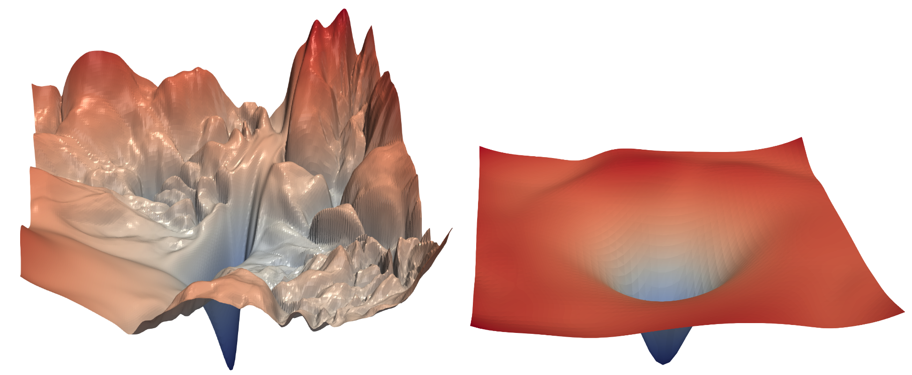
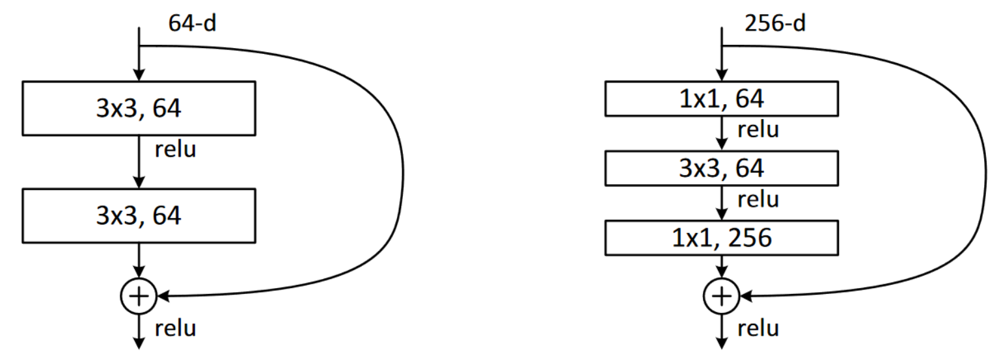

# ResNets

# 残差网络

In this chapter, we will build on top of the CNNs introduced in the previous chapter and explain to you the ResNet (residual network) architecture. It was introduced in 2015 by Kaiming He et al. in the article ["Deep Residual Learning for Image Recognition"](https://arxiv.org/abs/1512.03385) and is by far the most used model architecture nowadays. More recent developments in image models almost always use the same trick of residual connections, and most of the time, they are just a tweak of the original ResNet.

这一章节，我们是在上一章节介绍的CNN之上建设的，并向你解释残差网络（ResNet）架构。这个架构在2015年由何凯明等人编写的文章[“面向图像识别的深度残差学习”](https://arxiv.org/abs/1512.03385)中引入的，现如今这是目前为止最常用的模型架构。图像模型最新发展总会使用相同的残差连接技巧，大多数时间他们只会对原始ResNet做微调。

We will first show you the basic ResNet as it was first designed, then explain to you what modern tweaks make it more performant. But first, we will need a problem a little bit more difficult than the MNIST dataset, since we are already close to 100% accuracy with a regular CNN on it.

我会首先给你展示最初设计的基础ResNet，然后向你解释哪些最新调整使得这个架构更加高效。但首先，我们需要一个比MNIST数据集更有难度的问题，因为我们用一个常规CNN在这些基础问题上已经接近了100%的精度。

## Going Back to Imagenette

## 回到Imagenette

It's going to be tough to judge any improvements we make to our models when we are already at an accuracy that is as high as we saw on MNIST in the previous chapter, so we will tackle a tougher image classification problem by going back to Imagenette. We'll stick with small images to keep things reasonably fast.

当我们已经达到上一章节MNIST上所见到的精度高度时，我们都很难判断对模型做出的任何改进，所以我们回到Imagenette处理更难的图像分类问题。我们会放置少量的图像以保证处理相当的快。

Let's grab the data—we'll use the already-resized 160 px version to make things faster still, and will random crop to 128 px:

我们会使用已经调整尺寸为160像素版本的数据，以确保处理更快。我们来抓取数据，并随机剪切为128像素：

```
def get_data(url, presize, resize):
    path = untar_data(url)
    return DataBlock(
        blocks=(ImageBlock, CategoryBlock), get_items=get_image_files, 
        splitter=GrandparentSplitter(valid_name='val'),
        get_y=parent_label, item_tfms=Resize(presize),
        batch_tfms=[*aug_transforms(min_scale=0.5, size=resize),
                    Normalize.from_stats(*imagenet_stats)],
    ).dataloaders(path, bs=128)
```

```
dls = get_data(URLs.IMAGENETTE_160, 160, 128)
```

```
dls.show_batch(max_n=4)
```

Out: 

When we looked at MNIST we were dealing with 28×28-pixel images. For Imagenette we are going to be training with 128×128-pixel images. Later, we would like to be able to use larger images as well—at least as big as 224×224 pixels, the ImageNet standard. Do you recall how we managed to get a single vector of activations for each image out of the MNIST convolutional neural network?

当我们使用MNIST时，我们处理的是 28×28 像素图像。对于Imagenette我们会用 128×128 像素图像做训练。稍后，我们也想要能够使用更大的图像，至少大小 224×224 像素，这是ImageNet的标准。你还记得我们设法获得MNIST卷积神经网络的每张图像激活的单一向量吗？

The approach we used was to ensure that there were enough stride-2 convolutions such that the final layer would have a grid size of 1. Then we just flattened out the unit axes that we ended up with, to get a vector for each image (so, a matrix of activations for a mini-batch). We could do the same thing for Imagenette, but that would cause two problems:

- We'd need lots of stride-2 layers to make our grid 1×1 at the end—perhaps more than we would otherwise choose.
- The model would not work on images of any size other than the size we originally trained on.

我们所使用的方法确保有足够多的步长2卷积，这样最后层就会有一个格子大小。最终我们只是摊平单元轴，来获得每张图像的向量（这样，对于最小批次的激活矩阵）。我们能够对Imagenette做同样的事情，但是这会产生两个问题：

- 我们需要很多步长2层来使得最后是 1×1 表格。也许比我们原本选择的更多。
- 除了我们最初训练的尺寸，模型也许不会在其它任何大小的图像上运行。

One approach to dealing with the first of these issues would be to flatten the final convolutional layer in a way that handles a grid size other than 1×1. That is, we could simply flatten a matrix into a vector as we have done before, by laying out each row after the previous row. In fact, this is the approach that convolutional neural networks up until 2013 nearly always took. The most famous example is the 2013 ImageNet winner VGG, still sometimes used today. But there was another problem with this architecture: not only did it not work with images other than those of the same size used in the training set, but it required a lot of memory, because flattening out the convolutional layer resulted in many activations being fed into the final layers. Therefore, the weight matrices of the final layers were enormous.

处理第一个问题的方法是摊平最后的卷积层，这样来处理一个大于 1×1 的表格大小。即，我们能够像之前做的那样简单的摊平一个矩阵为一个向量，通过摆放每一行在之前列之后。真实上，这是一个直到2013年几乎总被采用的卷积神经网络。最著名的例子是2013年的ImageNet获胜者VGG，今年有时仍被使用。但是这个架构有另外一个问题：不但它除了训练集中使用相同之外的尺寸图像不能处理，而且它需要大量内存，因此摊平卷积层导致很多激活喂给最后一层。因此最后层的权重矩阵是巨大的。

This problem was solved through the creation of *fully convolutional networks*. The trick in fully convolutional networks is to take the average of activations across a convolutional grid. In other words, we can simply use this function:

这个问题通过创建*全卷积网络*解决了。全卷积网络技巧是通过一个卷积表格秋激活的平均值，我们能够使用下面这个简单函数来实现：

```
def avg_pool(x): return x.mean((2,3))
```

As you see, it is taking the mean over the x- and y-axes. This function will always convert a grid of activations into a single activation per image. PyTorch provides a slightly more versatile module called `nn.AdaptiveAvgPool2d`, which averages a grid of activations into whatever sized destination you require (although we nearly always use a size of 1).

如你所见，它在x和y轴上求平均值。这个函数会把每张图像的激活表格转换为一个单激活。PyTorch提供了多用途模块`nn.AdaptiveAvgPool2d`，它把激活的表格平均为任何我们最终需要的尺寸（虽然我们几乎总是使用尺寸1）。

A fully convolutional network, therefore, has a number of convolutional layers, some of which will be stride 2, at the end of which is an adaptive average pooling layer, a flatten layer to remove the unit axes, and finally a linear layer. Here is our first fully convolutional network:

因此一个全卷积网络有许多卷积层，他们中的一些会是步长2，最后是自适应平均池化层，用以移除单元轴的扁平层，及最终的线性层。下面是我们的第一个全卷积网络：

```
def block(ni, nf): return ConvLayer(ni, nf, stride=2)
def get_model():
    return nn.Sequential(
        block(3, 16),
        block(16, 32),
        block(32, 64),
        block(64, 128),
        block(128, 256),
        nn.AdaptiveAvgPool2d(1),
        Flatten(),
        nn.Linear(256, dls.c))
```

We're going to be replacing the implementation of `block` in the network with other variants in a moment, which is why we're not calling it `conv` any more. We're also saving some time by taking advantage of fastai's `ConvLayer`, which that already provides the functionality of `conv` from the last chapter (plus a lot more!).

稍后我们会用其它变体来替换网络中的`block`实现，这是为什么我们没有再称它`conv`的原因。通过求fastai的`ConvLayer`平均值我们也节省了一些时间，在上一章它已经提供了实用的`conv`功能（还有更多！）

> stop: Consider this question: would this approach makes sense for an optical character recognition (OCR) problem such as MNIST? The vast majority of practitioners tackling OCR and similar problems tend to use fully convolutional networks, because that's what nearly everybody learns nowadays. But it really doesn't make any sense! You can't decide, for instance, whether a number is a 3 or an 8 by slicing it into small pieces, jumbling them up, and deciding whether on average each piece looks like a 3 or an 8. But that's what adaptive average pooling effectively does! Fully convolutional networks are only really a good choice for objects that don't have a single correct orientation or size (e.g., like most natural photos).

> 暂停：思考这个问题：这个方法对于如MNIST这种光学字符识别（OCR）问题有意义吗？广泛的行业人员与OCR和类似问题打交道倾向使用全神经网络，因为现如今这是几乎每个人都学过的。但是它真的没有任何意义！例如，你不能通过把他们切成很小的小块来决定一个数字是3还是8，弄碎它们并判断每块上的平均看起来像3或是8。但这是自适应平均池化实际做的事情！对于没有单一正确方向或尺寸（例如，像大多数自然照片）目标，全卷积网络确实是一个好的选择。

Once we are done with our convolutional layers, we will get activations of size `bs x ch x h x w` (batch size, a certain number of channels, height, and width). We want to convert this to a tensor of size `bs x ch`, so we take the average over the last two dimensions and flatten the trailing 1×1 dimension like we did in our previous model.

一旦我们用卷积层做完，我们会得到尺寸为 `bs x ch x h x w`的激活（批次尺寸，确定的通道数，高和宽）。我们希望把这个激活形状转换为尺寸为`bs x ch`的张量，所以我们在最后两个轴上求平均值，并像我们之前章节做的那样扁平化尾部的 1×1 维。

This is different from regular pooling in the sense that those layers will generally take the average (for average pooling) or the maximum (for max pooling) of a window of a given size. For instance, max pooling layers of size 2, which were very popular in older CNNs, reduce the size of our image by half on each dimension by taking the maximum of each 2×2 window (with a stride of 2).

某种意义上这与常规池化是不同的，这些层通常会求一个给定尺寸窗口的平均（平均池化）或最大值（最大池化）。例如，尺寸2的最大池化在老的CNN中非常流行，通过求每个 2×2 窗口（步长2）的最大值，通过在每个维度上减半压缩了我们图像的尺寸。

As before, we can define a `Learner` with our custom model and then train it on the data we grabbed earlier:

以前，我们能够用自定义模型定义`Learner`，多面手在我们之前抓取的数据上训练它：

```
def get_learner(m):
    return Learner(dls, m, loss_func=nn.CrossEntropyLoss(), metrics=accuracy
                  ).to_fp16()

learn = get_learner(get_model())
```

```
learn.lr_find()
```

Out: (0.47863011360168456, 3.981071710586548)

 ![img](data:image/png;base64,iVBORw0KGgoAAAANSUhEUgAAAYgAAAEKCAYAAAAIO8L1AAAABHNCSVQICAgIfAhkiAAAAAlwSFlzAAALEgAACxIB0t1+/AAAADh0RVh0U29mdHdhcmUAbWF0cGxvdGxpYiB2ZXJzaW9uMy4xLjEsIGh0dHA6Ly9tYXRwbG90bGliLm9yZy8QZhcZAAAgAElEQVR4nO3deXyU5bn/8c+VnSyEJUEwEMImiAgCEUXUYutWa4u22qrVaquH1rZWWtvT1p7TnqPn2Hq6t9YqVWtrtYt1+VnrRq07ggYEWaLIKmFNwpKErJNcvz9mgBiHACVP5pnk+3695pWZZ5tvhpAr930/z3ObuyMiItJRSqIDiIhIOKlAiIhIXCoQIiISlwqEiIjEpQIhIiJxqUCIiEhcaYkO0JUKCgq8pKQk0TFERJLGokWLqty9MN66HlUgSkpKKCsrS3QMEZGkYWYbDrROXUwiIhKXCoSIiMSlAiEiInGpQIiISFwqECIiEpcKhIiIxKUCISKSxJZv2s38NVUEMXWDCoSISBK7d/56vvLHNwI5tgqEiEgSW75pNxOK8jGzLj+2CoSISJJqaG7lne11TCzKD+T4KhAiIklq5ZYaWtucCSoQIiLS3vJNuwE4fmiSFQgzG2Zmz5lZuZmtMLPr42wz08x2m9mS2OO77datN7NlseW6A5+ISAfLNu2mIDeDwX2zAjl+kHdzjQA3uPtiM8sDFpnZPHdf2WG7l9z9/AMc4wx3rwowo4hI0lpWEdwANQTYgnD3Le6+OPa8FigHioJ6PxGR3iQ6QF0b2AA1dNMYhJmVAJOBhXFWTzezpWb2pJkd1265A8+Y2SIzm93JsWebWZmZlVVWVnZpbhGRsFq5pYY2J7ABauiGCYPMLBd4CJjj7jUdVi8Ghrt7nZmdBzwKjImtm+Hum81sEDDPzN5y9xc7Ht/d5wJzAUpLS7v+UkIRkRAKeoAaAm5BmFk60eJwv7s/3HG9u9e4e13s+RNAupkVxF5vjn3dDjwCTAsyq4hIMnmzItgBagj2LCYD7gbK3f0nB9hmcGw7zGxaLE+1meXEBrYxsxzgbGB5UFlFRJLN8k27OT7AAWoItotpBnAFsMzMlsSW3QgUA7j7HcBFwLVmFgEagEvc3c3sKOCR2DeeBjzg7k8FmFVEJGnsHaA+57ijAn2fwAqEu78MdFra3P024LY4y9cCkwKKJiKS1LpjgBp0JbWISNJZVrELCHaAGlQgRESSzrJNNYEPUIMKhIhI0lmycWfgA9SgAiEiklQ2VO9hTeUeThtTGPh7qUCIiCSRf5RvB+DMY4M9gwlUIEREksqz5dsYMyiX4oHZgb+XCoSISJKoaWzhtXU7+FA3tB5ABUJEJGm88HYlkTbnrPGDuuX9VCBERJLEP8q3MSAngxOG9e+W91OBEBFJApHWNp5/u5Izxg4iNSXY01v3UoEQEUkCZRt2sruhhTOP7Z7uJVCBEBFJCs+WbyMjNYXTjgn++oe9VCBERELO3flH+XZOHjWQ3MzA53nbRwVCRCTEGltamfPnJayr2sP5xw/p1vfuvlIkIiKHZXttI7N/v4glG3fxjXPGcnHp0G59fxUIEZEQqqxt4oLbXmFnfQt3XD6Fcyd0b+sBgp1ydJiZPWdm5Wa2wsyuj7PNTDPbbWZLYo/vtlt3rpm9bWarzexbQeUUEQmjRRt2sHl3I79OUHGAYFsQEeAGd18cm196kZnNc/eVHbZ7yd3Pb7/AzFKBXwFnARXA62b2WJx9RUR6pMaWNgCKBwR/z6UDCawF4e5b3H1x7HktUA4UHeLu04DV7r7W3ZuBPwGzgkkqIhI+TZFWADLTUxOWoVvOYjKzEmAysDDO6ulmttTMnjSz42LLioCN7bap4NCLi4hI0muKRFsQWWmJO9k08EFqM8sFHgLmuHtNh9WLgeHuXmdm5wGPAmOAeNeR+wGOPxuYDVBcXNxluUVEEqkp1sXUY1sQZpZOtDjc7+4Pd1zv7jXuXhd7/gSQbmYFRFsMw9ptOhTYHO893H2uu5e6e2lhYfddYSgiEqR9XUwJbEEEeRaTAXcD5e7+kwNsMzi2HWY2LZanGngdGGNmI8wsA7gEeCyorCIiYdMUaSPFIK2bbswXT5BdTDOAK4BlZrYktuxGoBjA3e8ALgKuNbMI0ABc4u4ORMzsy8DTQCpwj7uvCDCriEioNLa0kpmWSuxv6IQIrEC4+8vEH0tov81twG0HWPcE8EQA0UREQq8p0kZmemLvhqR7MYmIhFBTSxtZaYkboAYVCBGRUGqKtKoFISIi79cUaUvoGUygAiEiEkrRAqEuJhER6aAp0qoWhIiIvF9ji85iEhGROKItCHUxiYhIB00tbWSpBSEiIh1pkFpEROLSILWIiMSl6yBERCSuxpbWhM4FASoQIiKh4+5qQYiIyPu1tDrukKUWhIiItBeG2eRABUJEJHSaIrH5qHtqgTCzYWb2nJmVm9kKM7u+k21PNLNWM7uo3bJWM1sSe2i6URHpNfYXiMR2MQU55WgEuMHdF5tZHrDIzOa5+8r2G5lZKnAr0elF22tw9xMCzCciEkpNLbEupp56JbW7b3H3xbHntUA5UBRn0+uAh4DtQWUREUkmjS09vIupPTMrASYDCzssLwIuBO6Is1uWmZWZ2QIzuyDwkCIiIbF/kLrndjEBYGa5RFsIc9y9psPqnwHfdPdWM+u4a7G7bzazkcA/zWyZu6+Jc/zZwGyA4uLirv8GRES62b4xiJ7axQRgZulEi8P97v5wnE1KgT+Z2XrgIuD2va0Fd98c+7oWeJ5oC+R93H2uu5e6e2lhYWHXfxMiIt0sLIPUQZ7FZMDdQLm7/yTeNu4+wt1L3L0E+CvwRXd/1Mz6m1lm7DgFwAxgZbxjiIj0NPsGqRM8BhFkF9MM4ApgmZktiS27ESgGcPd44w57HQvcaWZtRIvYDzqe/SQi0lPtbUEkej6IwAqEu78MvG9goZPtr2r3fD5wfACxRERCr7ElHIPUupJaRCRkevyV1CIi8q/ZfxaTWhAiItKObtYnIiJxNfWmK6lFROTQNUXayEhLIc4FxN1KBUJEJGQaW1oT3noAFQgRkdCJTjea2AFqUIEQEQmdpkhrwi+SAxUIEZHQibYgEv/rOfEJRETkPZpa1MUkIiJxNEVaE36rb1CBEBEJHXUxiYhIXE0trepiEhGR91MLQkRE4mqKtJGV4Bv1gQqEiEjoNOlKahERiacp0tazz2Iys2Fm9pyZlZvZCjO7vpNtTzSzVjO7qN2yK83sndjjyqByioiETVhutRHknNQR4AZ3X2xmecAiM5vXcW5pM0sFbgWebrdsAPA9oBTw2L6PufvOAPOKiIRCj79Zn7tvcffFsee1QDlQFGfT64CHgO3tlp0DzHP3HbGiMA84N6isIiJhEWltI9LmoWhBdEuJMrMSYDKwsMPyIuBC4I4OuxQBG9u9riB+ccHMZptZmZmVVVZWdlVkEZGEaG6NThbUK27WZ2a5RFsIc9y9psPqnwHfdPfWjrvFOZTHO767z3X3UncvLSwsPPLAIiIJFJbZ5CDYMQjMLJ1ocbjf3R+Os0kp8KfYrEkFwHlmFiHaYpjZbruhwPNBZhURCYOmSKxAhOA6iMAKhEV/698NlLv7T+Jt4+4j2m1/L/C4uz8aG6S+xcz6x1afDXw7qKwiImHRFIl2qPT0FsQM4ApgmZktiS27ESgGcPeO4w77uPsOM7sZeD226CZ33xFgVhGRUGjc18XUg1sQ7v4y8ccSDrT9VR1e3wPc08WxRERCLUwtiMQnEBGRffaPQST+1/MhJTCzUWaWGXs+08y+Ymb9go0mItL77D2LKZlu1vcQ0Gpmo4kOPI8AHggslYhIL5WMXUxt7h4helHbz9z9q8CQ4GKJiPRO+7qYQjBIfagFosXMLgWuBB6PLUsPJpKISO+VjC2IzwLTgf9193VmNgL4Q3CxRER6p32nuYZgkPqQTnON3YH1KwCxi9fy3P0HQQYTEemNmlr2tiCSpIvJzJ43s76xK5yXAr81s7hXR4uIyL9u7xhEMt2sLz92o72PA79196nAmcHFEhHpnfYWiIzU5CkQaWY2BPgk+wepRUSkizVFWklLMdKSqEDcRHTGtzXu/rqZjQTeCS6WiEjv1NTSFoozmODQB6kfBB5s93ot8ImgQomI9FaNkdZQ3OobDn2QeqiZPWJm281sm5k9ZGZDgw4nItLbhKkFcagpfgs8BhxNdOrPv8WW9Sj1zRG+8eBSbnmiPNFRRKSXaoq0heI+THDoBaLQ3X/r7pHY416gR83vuWlXAxf9+lUeXFTBb19Zx6765kRHEpFeqCnSmnQtiCozu9zMUmOPy4HqIIN1p0UbdjLrtlfYuKOeb5wzlpZW5+kVWxMdS0R6oaZI8nUxfY7oKa5bgS3ARURvv3FAZjbMzJ4zs3IzW2Fm18fZZpaZvWlmS8yszMxObbeuNbZ8iZk9dujf0uHZVd/MZ+5eSG5mKo986RS+OHMUwwdm87elW4J6SxGRA4qOQYSji+lQz2J6F/hY+2VmNgf4WSe7RYAb3H2xmeUBi8xsXuy2HXs9Czzm7m5mE4G/AONi6xrc/YRD/Ub+Vf2yM/jlZZOZUtyfftkZAHx04tHc/vxqquqaKMjNDDqCiMg+jZFWcjODnA360B1JO+Zrna109y3uvjj2vBYoJzrA3X6bOnf32MscwEmAD447al9xADh/0hDaHJ5cplaEiHSvZDyLKZ5Dnm/azEqAycDCOOsuNLO3gL8T7craKyvW7bTAzC7o5NizY9uVVVZWHnL4zow9Ko8xg3Lf0820pynCHxZsYMceDV6LSHCig9Th6GI6kgJxSH/tm1ku0Rnp5sTu5/Teg7g/4u7jgAuAm9utKnb3UuAy4GdmNipuCPe57l7q7qWFhV1zYpWZ8dFJR/Pa+h1s2d3ArvpmPn3XQv7j0eWc9ZMX+NvSzexv+IiIdJ2mSFsobvUNBykQZlZrZjVxHrVEr4nolJmlEy0O97v7w51t6+4vAqPMrCD2enPs61rgeaItkG5z/sTohHn3zl/PJXMXsHJzDf/10fEM7d+H6/74BrPvW0TFzvrujCQivUD0LKYkaEG4e567943zyHP3TkdRzMyIzl9d7u5xbw1uZqNj22FmU4AMoNrM+ptZZmx5ATADWBnvGEEZWZjLcUf35c4X1vLujnp++9kTuWrGCB669hRuPG8cL66qZOYPn+frDy5lTWVdl753W5taJyK9VVNLeK6DCHKofAZwBbDMzJbElt0IFAO4+x1E7+f0GTNrARqAT8XOaDoWuNPM2ogWsR90OPupW3xm+nB+9Mwq7rh8KlOH9wcgLTWF2aeP4qOTjmbui2v542vv8tDiCqaPHMjk4n5MHtafqcP70z8n4yBH3++ldyr5/asb2LyrgU27GqhtjDCyIIfjju7LcUfnM3FoPhOK8snpcGaDu7NqWx0vvVNJxc4GLp1WzNjBeQd8n6dXbOWdbbVMGzGQE4b1IyMkP4Qisl+YupisJ/Wll5aWellZWZce092JNXLiqqpr4t5X1vP8qu2Ub6mltc3Jzkjlvz92HBdNHdrpvhAtDlffW8bA3AyOHdKXo/tlkZuZzurttazYXMOW3Y0ApBgcc1QeBbmZRNraaG1zNlTXs722CYD0VCPS5nzk+CHMOXMMowftLxS76pv5j0eX8/ib+wfd+6SncsKwfpQUZDO0fzZF/fowICeDftnp5PdJJzMtlRSLjsc0trRSvaeZnXuaaWhpJS8rjb5Z6eRkptEUaaWhuZXGljYK8zIpKcj+l5rHrW2+7/1Eeit3Z8S3n+ArHxrD1846plve08wWxcZ73yccJ9uG2MF+YRXkZvL1c8by9XPG0tDcyrJNu/nxM2/zjb++yUvvVPE/F06gb1Y67k5dU4TczLR9x3x9/Q7+7fdljCzM4c+zp5Ofnf6+41fXNbG0YhdLNu5m6cZd1Da2kJaaQnpqCiePHMipows4dUwB2Rmp/Oaltdz7ynoef3MLowpzmDS0H6MG5fL7V9dTXdfM188+hkunFVO2YSevrqnmjY27eGbFNqq78MysFINhA7Lpn51BpK2NSKuTm5nGSSMHcMqoAsYNzmNpxS5eWV3NwnXVVNY2UdsYob65leEDs7nkxGIumjqUwrzo9SfuTlOkLTT3xxcJ0t7JgsLSxaQWRABa25zbn1vNz559h/7Z0b/GK+uaaI60cVTfTE4ZVcCEonx+Nm8VhX0z+fPs6ft+IR6pHXua+fPrG1m0YSdvVuxie20TYwbl8tNPncCEovy4+9Q3R9i8q4Gd9S3srm9hV0MLLa1ttLnT5tEf1oE5GfTPySA7I5Xaxgg1DS3UNUXITEslOyOVzLQUttY0sqZyD2u211HbFCEtxUhNMarqmnizYjet7cZWMtJSKB3en6H9+5AXa40sXFvNwnU7SEsxxg3JY+eeFqrqmvb9p0mx6Dy9g/OzGNq/D0P79+GovlkU5GZGWy8DczjmqFy1QiRp7W5oYdJ/P8N/nj+eq08d0S3vqRZEN0tNMa770BimjxrIXS+tIzszlcK8TPL7pFO+pZaX3qnkkTc2MbR/H+6/5qQuKw4AA3IyuHbm/jOCq+qa6NcnvdO/vrMz0t7TJRWEuqYIr6/fwdtba5lYlM+U4f3j3rFy9fY6/vz6u7y1tZYxg/L2fW6tbU5zpI2Glla21jRSsbOBeSu3UVX33tbPoLxMThtTyPRRAykZmE1R/z4MyssiNUVFQ8KvKdIKhKcFoQIRoNKSAZSWDHjfcndnTeUeBudnBX5JfVhuFZKbmcYZYwdxxthBnW43elAu3/nI+EM+bktrG9V1zVTWNlG+pYYX36nk2be28dDiin3bZKSmcMKwfswYXcCpYwYybnDf9w34i4RBU0u4upj0vyQBzIzRg3ITHaNHSE9NYXB+FoPzszh+aD6fPHEYrW3Ouqo6Nu5sYNPOBjZU72HB2h387NlV/PQf0f3ystIY3DeLYwbncfb4ozhj3CD6Zr1/DEikO+0bgwjJfBAqENLjpKYYowflva/bbFd9MwvWVrO+up6tuxvZsruB19bt4O9vbiE91fjAMYV8/ZyxjBvcN0HJpbdrbFEXk0hC9MvO4NwJQ96zrK3NeWPjTp5esY2/lG3kvJ+/xOUnD+drZx3znhs4inSHsJ3FpAIhvVpKijF1+ACmDh/AF2eO4qfzVnHfgg08tnQz15w6giuml5DfR11P0j32D1KHo4spHGVKJAT6ZWfw37Mm8MT1pzF5WD9+9MwqZvzgn3z/iXK21zYmOp70AntbEFkhuZJaLQiRDsYN7stvPzuNlZtr+PULa6IXIM5fz6XTipl9+kiO7tcn0RGlh9p/FpNaECKhNv7ovvzy0sn884aZXHBCEX9YsIEP/PA5/uuxFdQ3RxIdT3qgfV1MIWlBhCOFSIiVFORw60UTef4bM7m4dBi/e3U95/38JRZt2JHoaNLDhO06iHCkEEkCQ/tnc8uFx/PANSfT0upcfMer3PrUW/v+6hM5UhqkFkly00cN5Kk5p3Hx1GH8+vk1zLrtFVZuft9kiSKHbf+FcuH41RyOFCJJJi8rnVsvmsjdV5ZSvaeZWb96mV8++w4NzWpNyL9u31lMakGIJL8PHXsUz8w5nbOPG8yP563ipFv+wU1/W9nlswxK79DU0opZdH6XMAisQJjZMDN7zszKzWyFmV0fZ5tZZvammS0xszIzO7XduivN7J3Y48qgcoocqf45Gfzqsin85fPT+cDYQdy3YD0f+vELfP6+MlZvr010PEkidU3R6UbDcsv6IK+DiAA3uPtiM8sDFpnZvA5Thz4LPBabZnQi8BdgnJkNAL4HlAIe2/cxd98ZYF6RIzJtxACmjRhAZe14/rBgA3e/vI55K1/koqlD+dpZYxmcn5XoiBJy89dUcfwB5m1JhMBaEO6+xd0Xx57XAuVAUYdt6nz/jEU5RIsBwDnAPHffESsK84Bzg8oq0pUK8zL56lnH8MI3ZnLVKSN49I3NfPjnLzJ/dVWio0mIrams462ttZx3/JCDb9xNumUMwsxKgMnAwjjrLjSzt4C/A5+LLS4CNrbbrIIOxaXd/rNj3VNllZWVXRlb5IgMzM3kux8dz1NzTqMgN5Mr7nmNe15eR0+axVG6zlPLtwJw7oTBCU6yX+AFwsxygYeAOe7+vnMB3f0Rdx8HXADcvHe3OIeK+7/K3ee6e6m7lxYWFnZVbJEuM7Iwl0e+NIMPjhvETY+v5N//+iYtrW2JjiUh88SyLUwp7seQ/PDcyiXQAmFm6USLw/3u/nBn27r7i8AoMysg2mIY1m71UGBzYEFFApabmcadl0/lKx8aw4OLKvjCfYv23ftfZEP1HlZsrglV9xIEexaTAXcD5e7+kwNsMzq2HWY2BcgAqoGngbPNrL+Z9QfOji0TSVopKcbXzjqG/7lgAv98eztX3vMatY0tiY4lIfBkCLuXINizmGYAVwDLzGxJbNmNQDGAu98BfAL4jJm1AA3Ap2KD1jvM7Gbg9dh+N7m7bnwjPcLlJw+nb590vvbnJVz6mwX87rPTGBiSucMlMZ5ctoVJQ/MZ2j870VHeI7AC4e4vE38sof02twK3HmDdPcA9AUQTSbiPTTqavMw0rr1/ERff+Sp/uPok3Ua8l6rYWc/Sit1868PjEh3lfXQltUiCnDFuEL//3ElU1jRx0a/ns1ZXX/dKe89eOm9CuMYfQAVCJKGmjRjAH2efTFOkjYvveFU3/euFnl6xleOO7kvxwHB1L4EKhEjCTSjK58EvTCcjLYUr7l7I6u1qSfQWDc2tvPHuLk4/Jpyn6KtAiITAyMJc7r/mJMyMy+9ayMYd9YmOJN1g8bs7ibQ500YMSHSUuFQgREJiZGEuf7hmGg0trVx21wK27m5MdCQJ2MK11aQYlA7vn+gocalAiITIuMF9+f3nprFzTwuz7yvTFdc93IJ1O5hQlE9eVnqio8SlAiESMpOG9eOHF03kzYrd3PbP1YmOIwFpbGllycZdnBTS7iVQgRAJpQ8fP4SPTy7itudWs3TjrkTHkQAs3biL5kgb00YMTHSUA1KBEAmp733sOAblZfLVvyzRVKY90MJ1OzCDaSVqQYjIYcrvk86PLp7E2so9/ODJ8kTHkS62cF014wb3JT87nOMPoAIhEmozRhdw9akj+N2rG3hsqW5o3FM0R9pYtGFnqMcfQAVCJPS+ee44ppUM4N//upQVm3cnOo50gWWbdtHY0sbJI1UgROQIZKSl8KtPT6F/dgazf7+IHXuaEx1JjtDCddGbU58Y4vEHUIEQSQqFeZnccflUKuua+NL9i6lriiQ6khyBhWt3MGZQbuhv864CIZIkJg3rx/cvPJ4F66o556cv8sIqzcGejFrbPDr+EPLuJVCBEEkqn5g6lAc/P52s9BSuvOc1bvjLUs1Kl2Q272qgrinChKPzEx3loIKccnSYmT1nZuVmtsLMro+zzafN7M3YY76ZTWq3br2ZLTOzJWZWFlROkWRTWjKAv3/lNL58xmgeXbKJ6/74Bq1tnuhYcojWVe0BYERBToKTHFyQLYgIcIO7HwucDHzJzMZ32GYd8AF3nwjcDMztsP4Mdz/B3UsDzCmSdLLSU/n6OWO5adZxPP92Jf/39FuJjiSHaF+BKAx/gQhyytEtwJbY81ozKweKgJXttpnfbpcFwNCg8oj0RJ8+aTgrN9dw5wtrGT+kL7NOKEp0JDmIdVV7yMlIpTDkA9TQTWMQZlYCTAYWdrLZ1cCT7V478IyZLTKz2Z0ce7aZlZlZWWWlBu2k9/neR4+LXSfxJssqdJ1E2K2r2sOIwhzMLNFRDirwAmFmucBDwBx3jzufopmdQbRAfLPd4hnuPgX4MNHuqdPj7evuc9291N1LCwvDOSuTSJAy0lK4/fIpFORmMvu+MrbXah6JMFtXtYcRBbmJjnFIAi0QZpZOtDjc7+4PH2CbicBdwCx3r9673N03x75uBx4BpgWZVSSZFeRmMvczU9lV38Ln71tEU0Q39wuj5kgbFTvrGRHC+afjCfIsJgPuBsrd/ScH2KYYeBi4wt1XtVueY2Z5e58DZwPLg8oq0hMcd3Q+P7p4Em+8u4vvPLIcd53ZFDbv7qinzZNjgBoCHKQGZgBXAMvMbEls2Y1AMYC73wF8FxgI3B7rj4vEzlg6CngktiwNeMDdnwowq0iP8JGJQ3h72xh+8ew7jCrM5dqZoxIdSdrZf4prcnQxBXkW08tAp6Mw7n4NcE2c5WuBSe/fQ0QOZs6HxrB6ey23PvUWq7bVcvMFE8jNDPJvQTlU66rqABgxMDlaELqSWqSHSUkxfnnpFL565jH8vyWb+MgvXuLNCs1KFwbrquoZkJMR6jkg2lOBEOmBUlOM688cw59mT6cl0sZFv36V12J3EJXEWVdVlxRXUO+lAiHSg00bMYDHv3IaQ/v34fP3lfFudX2iI/Vq66r2UJIk3UugAiHS4w3IyeDuq06kzeHq371OjW7ulxB7miJsq2liZJKcwQQqECK9woiCHH796Smsq9rDdQ+8QaS1LdGRep311clzk769VCBEeolTRhdw06wJvLCqkuv++AaNLbqYrjvtPcU1mbqYdO6bSC9y2UnF1DdH+J+/l7Oz/jXmfqaUvlnJcUZNsltXGSsQBclxFTWoBSHS61xz2kh+9qkTKFu/k0vuXKB7N3WTddV7GJKfRXZG8vxdrgIh0gtdMLmIu64sZV3VHq6653X2aI7rwEVv0pc83UugAiHSa80cO4jbL5/CW1tr+Oqfl9CmWekCta5qDyUqECKSLM4YO4j/+Mh4nlm5jR8983ai4/RYO/c0s6u+hZFJViCSpzNMRALx2RklvLO9jtufX8PoQbl8fIomduxKtY0t3P78aiC5zmACFQiRXs/MuGnWcayrquM/H13OqaMLGNQ3K9Gxklp9c4TNuxr5R/k27nhhDbvqWzjv+MGcdkxBoqMdFhUIESE9NYUffHwiZ//0RW596m1+/EndTLkjd2dd1R7mr6lm8YadVO9pZndDCzWNLURaHcdxh9rGCLsb9l+tPnNsITecNZbjh+YnMP2/RgVCRAAoKcjhc6eO4I4X1nD5ycVMLhoPmBMAAA1ySURBVO6f6EgJ9Wz5Nv5Rvp2de5rZUd/Mu9X1bK2JnhJcmJfJkPws8vukU9SvDxlp0eFcA3Iy0xjSL4uj8/twzFF5jD+6bwK/iyOjAiEi+3z5g6N5eHEF//XYCh754gxSUjqd0qVHirS28X9Pv83cF9fSLzudQXmZ9MvOYNqIAZw0cgCnjCqgZGA2sQnNerTACoSZDQN+DwwG2oC57v7zDtt8Gvhm7GUdcK27L42tOxf4OZAK3OXuPwgqq4hE5Wam8a0Pj+Nrf1nKQ4sruLh0WKIjdauquiaue+ANXl1bzRUnD+c/zx+/r3XQGwX5nUeAG9z9WOBk4EtmNr7DNuuAD7j7ROBmYC6AmaUCvwI+DIwHLo2zr4gE4IITiphc3I9bn3qb3fW9586vFTvrmXXbKyx+dyc/vngSN18woVcXBwiwQLj7FndfHHteC5QDRR22me/uO2MvFwB7z6+bBqx297Xu3gz8CZgVVFYR2S8lxbh51gR21jdz0+MrEx2nW2zZ3cClv1lAbWMLD35hOp+YqlN9oZsulDOzEmAysLCTza4Gnow9LwI2tltXQYfiIiLBmVCUzxdnjuKhxRX8861tiY4TqO01jVz2m4Xs2tPCfVefxMSh/RIdKTQCLxBmlgs8BMxx95oDbHMG0QKxdzwi3uhP3PsAmNlsMyszs7LKysquiCwiRAesxx6Vx7cfXvae0zZ7gvrmCK+uqeZXz63mk3e+yraaRu793IlMGqbi0F6gZzGZWTrR4nC/uz98gG0mAncBH3b36tjiCqD96NhQYHO8/d19LrGxi9LSUt1MRqSLZKal8sOLJ3Lh7fO5+fGV/Oji5Lw2oq3NWbmlhrL1O1i+uYblm3bzzvY6WmP3nhozKJffXnUiU4cPSHDS8AnyLCYD7gbK3f0nB9imGHgYuMLdV7Vb9TowxsxGAJuAS4DLgsoqIvFNHNqPL3xgJL96bg01DS18ZnoJM0YPDP0pnu7Os+XbeWL5Fl5cVUVVXRMABbkZTCjK58xjj2Lq8P5MLu5Hv+yMBKcNryBbEDOAK4BlZrYktuxGoBjA3e8AvgsMBG6P/cBF3L3U3SNm9mXgaaKnud7j7isCzCoiB3D9h44B4I+vbeSZldsYWZjDf35kPGeMG5TgZPG9/E4V//f0W7xZsZt+2emcPqaQDxxTyCmjBzK4b1boi1uYmHvP6ZUpLS31srKyRMcQ6ZEaW1p5cvkWfv38GlZvr+N/Ljiey04qTnSsfZZv2s0tT5Qzf001Rf36MOfMMVw4uYi01N59qurBmNkidy+Nt05XUovIIclKT+XCyUM5e/xgvvTAYm58ZBlbdzfw1bOOSehf5Zt3NfCjp9/m4Tc2MSAng+99dDyXnVRMZlpqwjL1FCoQInJYcjLT+M1nSvnOI8v4xT9XU7GzgVs+fjxZ6d3zC3n+6iqeWbmNip0NbN7VwOrKOgCunTmKa2eO0hzbXUgFQkQOW3pqCrd+YiJF/bL56T9WUb61ljsun8LwAOc7eGdbLbc8Uc5zb1eSk5HKsAHZFPXrwymjBnLVjBKG9s8O7L17K41BiMgR+edb2/jqn5fS5s6PL57E2ccN7pLjtrY5q7bVUrZhJwvWVvPU8q1kZ6Ry3QdHc+UpJepC6iKdjUGoQIjIEdu4o55r71/E8k01nH5MId88dyzHHZ1PS2sbr6yuYt7KbQzMyeDEEQOYUtyfnMz3d16s2lbLj55+m601jVTXNVNV10RTpA2I3l77/IlDuO6DYxiQo9NSu5IKhIgErinSyn2vbuC251azq76F08YUsGJzDTv2NJOdkUpjSyttDqkpxjnHHcVNsyZQkJsJwJsVu/jMPa9hRK+9GJiTwcDcDI4d0pfS4QMYNqCPTk8NiAqEiHSb3Q0t3PnCGh59YxNThvfnY5OO5gNjC2mOtLH43V28srqKe+evp29WGrd+YiJ5Wel87t7X6Zedzv3XnBToOIa8nwqEiITK21trmfPnJZRvqSE91SgekM0frjmJIfl9Eh2t19F1ECISKmMH5/Hol07h5/94hxWba/jxJyft626S8FCBEJGEyExL5d/PHZfoGNIJXYMuIiJxqUCIiEhcKhAiIhKXCoSIiMSlAiEiInGpQIiISFwqECIiEpcKhIiIxNWjbrVhZpXAhtjLfGB3J887fi0Aqg7j7dof81DWdVyWyHxHkrGzZfoM9Rkeab7OMsXLFW9Zb/8MO8sXL9dwdy+Me3R375EPYG5nz+N8LftXj38o6zouS2S+I8l4kKz6DPUZHlG+zjLpMzzyfAf6DA/06MldTH87yPOOX4/k+IeyruOyROY70PpDyXiwZYdDn2Hv/gwPtO5AmQ6UR59h58sO5TOMq0d1MR0JMyvzA9zRMAzCng/CnzHs+SD8GcOeD8KfMez52uvJLYjDNTfRAQ4i7Pkg/BnDng/CnzHs+SD8GcOebx+1IEREJC61IEREJC4VCBERiUsFQkRE4lKBOARmdpqZ3WFmd5nZ/ETn6cjMUszsf83sl2Z2ZaLzdGRmM83spdhnODPReQ7EzHLMbJGZnZ/oLB2Z2bGxz++vZnZtovPEY2YXmNlvzOz/mdnZic7TkZmNNLO7zeyvic7SXuzn7nexz+7Tic7TXo8vEGZ2j5ltN7PlHZafa2Zvm9lqM/tWZ8dw95fc/QvA48DvwpYPmAUUAS1ARQjzOVAHZHV1vi7MCPBN4C9hzOfu5bGfwU8CXX6KZBdlfNTd/w24CvhUCPOtdferuzLXgRxm3o8Df419dh/rjnyH7HCu6EvGB3A6MAVY3m5ZKrAGGAlkAEuB8cDxRItA+8egdvv9BegbtnzAt4DPx/b9awjzpcT2Owq4P4z/xsCZwCVEf7mdH7Z8sX0+BswHLgvjZ9huvx8DU0Kcr0v/j3RB3m8DJ8S2eSDobIfzSKOHc/cXzaykw+JpwGp3XwtgZn8CZrn794G43QtmVgzsdveasOUzswqgOfayNWz52tkJZHZlvq7KaGZnADlE/8M2mNkT7t4Wlnyx4zwGPGZmfwce6IpsXZnRzAz4AfCkuy8OW77udDh5ibaqhwJLCFmvTo8vEAdQBGxs97oCOOkg+1wN/DawRO91uPkeBn5pZqcBLwYZLOaw8pnZx4FzgH7AbcFG2+ewMrr7dwDM7CqgqquKQycO9zOcSbQrIhN4ItBk+x3uz+F1RFti+WY22t3vCDIch/8ZDgT+F5hsZt+OFZLudKC8vwBuM7OP8K/fjiMQvbVAWJxlnV4x6O7fCyhLPIeVz93riRaw7nK4+R4mWsS602H/GwO4+71dHyWuw/0MnweeDyrMARxuxl8Q/WXXXQ43XzXwheDiHFTcvO6+B/hsd4c5FKFqznSjCmBYu9dDgc0JyhKP8h25sGcMez4If8aw5+so2fL22gLxOjDGzEaYWQbRwcnHEpypPeU7cmHPGPZ8EP6MYc/XUbLl7RVnMf0R2ML+U0Cvji0/D1hF9KyC7yhfcuZLhoxhz5cMGcOeL9nzHuihm/WJiEhcvbWLSUREDkIFQkRE4lKBEBGRuFQgREQkLhUIERGJSwVCRETiUoGQHs3M6rr5/e4ys/FddKxWM1tiZsvN7G9m1u8g2/czsy92xXuLALoOQno2M6tz99wuPF6au0e66ngHea992c3sd8Aqd//fTrYvAR539wndkU96PrUgpNcxs0Ize8jMXo89ZsSWTzOz+Wb2Ruzr2Njyq8zsQTP7G/CMRWfIe96is7u9ZWb3x251TWx5aex5nUVn+ltqZgvM7KjY8lGx16+b2U2H2Mp5lejdQDGzXDN71swWm9kyM5sV2+YHwKhYq+OHsW2/EXufN83sv7vwY5ReQAVCeqOfAz919xOBTwB3xZa/BZzu7pOB7wK3tNtnOnClu38w9noyMIfo/BEjgRlx3icHWODuk4jehv3f2r3/z2Pvf9CbtZlZKvAh9t+3pxG40N2nAGcAP44VqG8Ba9z9BHf/hkWn/RxDdB6CE4CpZnb6wd5PZK/eertv6d3OBMbH/ugH6GtmeUA+8DszG0P0ttHp7faZ5+472r1+zd0rAMxsCVACvNzhfZqJzmYGsAg4K/Z8OnBB7PkDwI8OkLNPu2MvAubFlhtwS+yXfRvRlsVRcfY/O/Z4I/Y6l2jB6I45Q6QHUIGQ3igFmO7uDe0Xmtkvgefc/cJYf/7z7Vbv6XCMpnbPW4n/f6nF9w/yHWibzjS4+wlmlk+00HyJ6HwLnwYKganu3mJm64nO992RAd939zsP831FAHUxSe/0DPDlvS/M7ITY03xgU+z5VQG+/wKiXVsQveVzp9x9N/AV4Otmlk405/ZYcTgDGB7btBbIa7fr08DnzGzvQHeRmQ3qou9BegEVCOnpss2sot3ja0R/2ZbGBm5Xsn+Wsf8Dvm9mrxCdYD4oc4CvmdlrwBBg98F2cPc3iE5yfwlwP9H8ZURbE2/FtqkGXomdFvtDd3+GaBfWq2a2DPgr7y0gIp3Saa4i3czMsol2H7mZXQJc6u6zDrafSHfTGIRI95tKdJJ6A3YBn0twHpG41IIQEZG4NAYhIiJxqUCIiEhcKhAiIhKXCoSIiMSlAiEiInGpQIiISFz/H4FwmdEFnnoaAAAAAElFTkSuQmCC)

3e-3 is often a good learning rate for CNNs, and that appears to be the case here too, so let's try that:

对于CNN 3e-3通常是一个合适的学习率，在这里的例子中好像也是这样，让我们尝试一下：

```
learn.fit_one_cycle(5, 3e-3)
```

| epoch | train_loss | valid_loss | accuracy |  time |
| ----: | ---------: | ---------: | -------: | ----: |
|     0 |   1.901582 |   2.155090 | 0.325350 | 00:07 |
|     1 |   1.559855 |   1.586795 | 0.507771 | 00:07 |
|     2 |   1.296350 |   1.295499 | 0.571720 | 00:07 |
|     3 |   1.144139 |   1.139257 | 0.639236 | 00:07 |
|     4 |   1.049770 |   1.092619 | 0.659108 | 00:07 |

That's a pretty good start, considering we have to pick the correct one of 10 categories, and we're training from scratch for just 5 epochs! We can do way better than this using a deeper mode, but just stacking new layers won't really improve our results (you can try and see for yourself!). To work around this problem, ResNets introduce the idea of *skip connections*. We'll explore those and other aspects of ResNets in the next section.

考虑到我们必须从10个分类中选择一个正确的，我们从零开始训练只有5个周期，这是一个非常好的开始！使用一个更深的模型我们能够做的比这个结果更好，但只是堆砌新的层不会真正改善我们的结果（你可以尝试一下并自己看一下！）。围绕这个问题的处理，残差网络 引入了*跳跃连接*思想。下一部分我们会探索这个方法和残差网络的其它部分。

## Building a Modern CNN: ResNet

## 创建一个现代CNN：残差网络

We now have all the pieces we need to build the models we have been using in our computer vision tasks since the beginning of this book: ResNets. We'll introduce the main idea behind them and show how it improves accuracy on Imagenette compared to our previous model, before building a version with all the recent tweaks.

现在我们已经学习了创建模型的所有内容，因为在本书的一开始我们就在计算机视觉任务中使用了残差网络 。我们会介绍这个模型背后的主要思想，在用所有最新的微调创建一个版本之前，展示相比我们之前的模型，在Imagenette上如何改善模型精度的。

### Skip Connections

### 跳跃连接

In 2015, the authors of the ResNet paper noticed something that they found curious. Even after using batchnorm, they saw that a network using more layers was doing less well than a network using fewer layers—and there were no other differences between the models. Most interestingly, the difference was observed not only in the validation set, but also in the training set; so, it wasn't just a generalization issue, but a training issue. As the paper explains:

在2015年，残差网络论文的作者们注意到他们发现的一些奇怪的现象。即使使用批次标准化后，他们发现网络使用更多的层做的不如使用更少的层做的好，模型间没有其它的差异。更有趣的是，这个差异不仅仅在验证集上可观察到，而且在训练集上也能发现。所以它不仅仅是一个泛化问题，而是一个训练问题。论文解释到：

> : Unexpectedly, such degradation is not caused by overfitting, and adding more layers to a suitably deep model leads to higher training error, as [previously reported] and thoroughly verified by our experiments.

> ：让人很意外，这种降级不是过拟导致的，增加更多的层来适配深度模型导致更高的训练错误，如[之前的报道]并通过我们的实验完全证实了。

This phenomenon was illustrated by the graph in <resnet_depth>, with training error on the left and test error on the right.

这一现象在下图<不同深度网络训练>中做了插图说话 ，左侧是训练错误，右侧是测试错误。

<div style="text-align:center">
  <p align="center">
    
  </p>
  <p align="center">图：不同深度网络训练</p>
</div>

As the authors mention here, they are not the first people to have noticed this curious fact. But they were the first to make a very important leap:

正如下面作者提到的，他们不是注意到这个奇怪现象的第一人，但是他们是第一个作出重要跳跃的人：

> : Let us consider a shallower architecture and its deeper counterpart that adds more layers onto it. There exists a solution by construction to the deeper model: the added layers are identity mapping, and the other layers are copied from the learned shallower model.

> ：让我们考虑一个浅层架构，及给它添加了更多层的更深的的副本。通过构建更深的模型找解决方案：添加的层是恒等映射，其它层是从已经学习的浅层模型拷贝来的。

As this is an academic paper this process is described in a rather inaccessible way, but the concept is actually very simple: start with a 20-layer neural network that is trained well, and add another 36 layers that do nothing at all (for instance, they could be linear layers with a single weight equal to 1, and bias equal to 0). The result will be a 56-layer network that does exactly the same thing as the 20-layer network, proving that there are always deep networks that should be *at least as good* as any shallow network. But for some reason, SGD does not seem able to find them.

作为一篇学术论文，这个处理以难以理解的方式做了描述，但是这个概念实际非常简单：用一个20层已经被训练好的神经网络开始，添加完全没有做任何操作的36层（例如，它们可以是单权重等于1，偏置等于0的线性层）。结果是56层网络做与20层网络完全相同的事情，证明了总会有深度网络做的至少应该与任何浅层网络一样好。但是由于某种原因，SGD好像无法找到它们。

> jargon: Identity mapping: Returning the input without changing it at all. This process is performed by an *identity function*.

> 术语：恒等映射：返回输入而没有任何变化。这个处理是通过恒等函数做的。

Actually, there is another way to create those extra 36 layers, which is much more interesting. What if we replaced every occurrence of `conv(x)` with `x + conv(x)`, where `conv` is the function from the previous chapter that adds a second convolution, then a batchnorm layer, then a ReLU. Furthermore, recall that batchnorm does `gamma*y + beta`. What if we initialized `gamma` to zero for every one of those final batchnorm layers? Then our `conv(x)` for those extra 36 layers will always be equal to zero, which means `x+conv(x)` will always be equal to `x`.

实际上，有其它方法来创建那些额外的36层，这个方法更加有趣。如果我们用`x + conv(x)`替换每个存在的`conv(x)`，这里的`conv`是上一章节添加的第二个卷积函数，然后是一个批次标准化层，然后一个ReLU。而且回忆一下批次标准化的操作 `gamma*y + beta`。如果我们对那些批次标准化的每一个层初始化`gamma`为零呢？那么对于我们扩展的36层`conv(x)`会总是等于零，这表示 `x+conv(x)`会总是等于`x`。

What has that gained us? The key thing is that those 36 extra layers, as they stand, are an *identity mapping*, but they have *parameters*, which means they are *trainable*. So, we can start with our best 20-layer model, add these 36 extra layers which initially do nothing at all, and then *fine-tune the whole 56-layer model*. Those extra 36 layers can then learn the parameters that make them most useful.

这给我们什么样的收益呢？关键点是那36个额外层，依照他们的定位，是一个*恒等映射*，但是它们有参数，这表示它们是可训练的。所以我们能够用我们最好的20层模型开始，添加的那36个额外层初始根本没有任何内容，然后*微调整个56层模型*。那些额外36层然后能够学习参数，使它们最有用处。

The ResNet paper actually proposed a variant of this, which is to instead "skip over" every second convolution, so effectively we get `x+conv2(conv1(x))`. This is shown by the diagram in <resnet_block> (from the paper).

残差网络的确提出这样的变种，而不是每遇到第二个卷积就“跳过”，所以我们有效的获得了`x+conv2(conv1(x))`。这个原理在下图<一个简单的残差网络块>中使了插图说明（来自这篇论文）。

<div style="text-align:center">
  <p align="center">
    
  </p>
  <p align="center">图：一个简单的残差网络块</p>
</div>
That arrow on the right is just the `x` part of `x+conv2(conv1(x))`, and is known as the *identity branch* or *skip connection*. The path on the left is the `conv2(conv1(x))` part. You can think of the identity path as providing a direct route from the input to the output.

右侧的箭头正好是 `x+conv2(conv1(x))`中的`x`部分，且被称为*恒等分支或跳跃连接*。你可以认为恒等路径为从输入到输出提供直接的路由。

In a ResNet, we don't actually proceed by first training a smaller number of layers, and then adding new layers on the end and fine-tuning. Instead, we use ResNet blocks like the one in <resnet_block> throughout the CNN, initialized from scratch in the usual way, and trained with SGD in the usual way. We rely on the skip connections to make the network easier to train with SGD.

在残差网络中，实际上我们没有延续首先通过训练一个更小的层数，然后在尾部添加新的层并微调，相反，就像图<一个简单的残差网络块>中那样，在整个卷积神经网络中我们会用残差网络块，以常用的方式初始化并用随机梯度下降来训练。我们依赖跳跃连接使网络更容易用随机梯度下降训练。

There's another (largely equivalent) way to think of these ResNet blocks. This is how the paper describes it:

还有另外一个方法来思考这些残差网络块（思路大体相同）。下面是论文对这个方法的描述：

> : Instead of hoping each few stacked layers directly fit a desired underlying mapping, we explicitly let these layers fit a residual mapping. Formally, denoting the desired underlying mapping as H(x), we let the stacked nonlinear layers fit another mapping of F(x) := H(x)−x. The original mapping is recast into F(x)+x. We hypothesize that it is easier to optimize the residual mapping than to optimize the original, unreferenced mapping. To the extreme, if an identity mapping were optimal, it would be easier to push the residual to zero than to fit an identity mapping by a stack of nonlinear layers.

> ：不是希望少数堆砌的每个层直接拟合一个希望的底层映射，我们准确的让这些层拟合剩余的映射。形式上，表示所需的底层映射为H(x)，我们让堆砌的非线性层拟合 F(x) := H(x)−x的另一个映射。原始的映射改写为 F(x)+x。我们假设相比优化原始未引用映射，优化残差映射更容易。极端的来说，如果一个恒等映射被优化了，它也许比通过一堆非线性层拟合恒等映射更容易把残差推到零。

Again, this is rather inaccessible prose—so let's try to restate it in plain English! If the outcome of a given layer is `x`, when using a ResNet block that returns `y = x+block(x)` we're not asking the block to predict `y`, we are asking it to predict the difference between `y` and `x`. So the job of those blocks isn't to predict certain features, but to minimize the error between `x` and the desired `y`. A ResNet is, therefore, good at learning about slight differences between doing nothing and passing though a block of two convolutional layers (with trainable weights). This is how these models got their name: they're predicting residuals (reminder: "residual" is prediction minus target).

同样，这是有点难以理解的散文。所以让我们用浅显的英文来尝试重数这段内容！如果一个给定的层结果是`x`，当使用一个残差网络块返回 `y = x+block(x)` 时，我们不要求这个块来预测`y`，我们需要它来预设`y`和`x`间的差异。所以那些块的工作不是预测确定的特征，而是来最小化`x`和期望`y`间的错误。因此，残差网络很擅长学习什么都不做和通过两个卷积层块（带有可训练权重）之间的细小差别。这就是这些模型名字的由来：它们预测残差（记住：“残差”是预测减去目标）。

One key concept that both of these two ways of thinking about ResNets share is the idea of ease of learning. This is an important theme. Recall the universal approximation theorem, which states that a sufficiently large network can learn anything. This is still true, but there turns out to be a very important difference between what a network *can learn* in principle, and what it is *easy for it to learn* with realistic data and training regimes. Many of the advances in neural networks over the last decade have been like the ResNet block: the result of realizing how to make something that was always possible actually feasible.

关于残差网络共享的这两个思考方法的关键概念是易于训练的思想。这是一个重要的主题。回想通用近似定理，它描述的是一个足够大的网络能够学习任何事情。这总是对的，但是这与一个网络在实践中*能够学到* 的内容与利用真实数据和训练方法它*多么容易的学到*之间会产生很大的差异。在过去的十年中神经网络已经取得了很多的进展，如ResNet块：认识到如何总会能够做到实际可行的结果。

> note: True Identity Path: The original paper didn't actually do the trick of using zero for the initial value of `gamma` in the last batchnorm layer of each block; that came a couple of years later. So, the original version of ResNet didn't quite begin training with a truly identity path through the ResNet blocks, but nonetheless having the ability to "navigate through" the skip connections did indeed make it train better. Adding the batchnorm `gamma` init trick made the models train at even higher learning rates.

> 注释：现实特性路径：在原始论文中对于每个块的最后批次标准化层中'gamma'的初始值实际上不会使用零化的技巧，那是几年后产生的。所以，原始的ResNet版本对于ResNet块完全不是使用一个现实特性路径开始训练的，然而虽然如此它有能力来'浏览'跳跃连接确实使得它训练更好。增加标准批次*gamma*初始化技巧，使得模型在甚至更高的学习率上训练。

Here's the definition of a simple ResNet block (where `norm_type=NormType.BatchZero` causes fastai to init the `gamma` weights of the last batchnorm layer to zero):

下面是一个简单的ResNet块的定义（`norm_type=NormType.BatchZero`会让fastai初始化最后批次标准化层的`gamma`权重为零）：

```
class ResBlock(Module):
    def __init__(self, ni, nf):
        self.convs = nn.Sequential(
            ConvLayer(ni,nf),
            ConvLayer(nf,nf, norm_type=NormType.BatchZero))
        
    def forward(self, x): return x + self.convs(x)
```

There are two problems with this, however: it can't handle a stride other than 1, and it requires that `ni==nf`. Stop for a moment to think carefully about why this is.

上面的定义有两个问题，无论如何它不能处理大小1的步长，且它需要`ni==nf` 。停一会，来仔细的思考一下为什么会这样。

The issue is that with a stride of, say, 2 on one of the convolutions, the grid size of the output activations will be half the size on each axis of the input. So then we can't add that back to `x` in `forward` because `x` and the output activations have different dimensions. The same basic issue occurs if `ni!=nf`: the shapes of the input and output connections won't allow us to add them together.

说到的步长的问题，其中一个卷积的步长为2，输出激活的风格大小会是每个输入坐标轴大小的一半。所以在`forward`中我们不能够把它加回到 `x`，因为 `x` 和输出激活有不同的尺寸。如果 `ni != nf` 会发生同样的问题：输入和输出连接的形态，不允许我们把他们加总在一起。

To fix this, we need a way to change the shape of `x` to match the result of `self.convs`. Halving the grid size can be done using an average pooling layer with a stride of 2: that is, a layer that takes 2×2 patches from the input and replaces them with their average.

修复这个问题，我们需要一个方法来改变 `x` 的形态以匹配 `self.convs` 的结果。对半分的网格尺寸能够使用一个步长为2的平均池化层来完成：即，一个层从输入中取2×2大小的部分，并用他们的平均值进行替换。

Changing the number of channels can be done by using a convolution. We want this skip connection to be as close to an identity map as possible, however, which means making this convolution as simple as possible. The simplest possible convolution is one where the kernel size is 1. That means that the kernel is size `ni*nf*1*1`, so it's only doing a dot product over the channels of each input pixel—it's not combining across pixels at all. This kind of *1x1 convolution* is very widely used in modern CNNs, so take a moment to think about how it works.

改变通道的数量通过使用卷积能够完成。然而，我们希望这个跳跃连接尽可能的靠近一个恒等映射，这意味着使得这个卷积尽可能的简单。可能最简单的卷积是一，它的卷积核大小是1 。这表示核的大小是`ni*nf*1*1` ，所以在每个输入像素的通道上它仅仅做了一个点积，它根本不能跨像素组合。这类 *1x1* 卷积被非常广泛的用于CNN模型，所以花一点时间来思考它是如何运作的。

> jargon: 1x1 convolution: A convolution with a kernel size of 1.

> 术语：1x1 卷积：一个核大小为 1 的一个卷积。

Here's a ResBlock using these tricks to handle changing shape in the skip connection:

下面ResBlock使用这些技巧在跳跃连接中处理形态改变：

```
def _conv_block(ni,nf,stride):
    return nn.Sequential(
        ConvLayer(ni, nf, stride=stride),
        ConvLayer(nf, nf, act_cls=None, norm_type=NormType.BatchZero))
```

```
class ResBlock(Module):
    def __init__(self, ni, nf, stride=1):
        self.convs = _conv_block(ni,nf,stride)
        self.idconv = noop if ni==nf else ConvLayer(ni, nf, 1, act_cls=None)
        self.pool = noop if stride==1 else nn.AvgPool2d(2, ceil_mode=True)

    def forward(self, x):
        return F.relu(self.convs(x) + self.idconv(self.pool(x)))
```

Note that we're using the `noop` function here, which simply returns its input unchanged (*noop* is a computer science term that stands for "no operation"). In this case, `idconv` does nothing at all if `ni==nf`, and `pool` does nothing if `stride==1`, which is what we wanted in our skip connection.

注意，在这里我们使用了 `noop` 函数，它简单的返回了它们没有发生改变的输入（*noop* 是一个计算机科学术语，代表“无操作”）。在这种情况下，如果 `ni == nf` `idconv`就根本不做任何事情，如果 `stride==1` `pool`不做任何事情，在我们跳跃连接中这是我们期望的。

Also, you'll see that we've removed the ReLU (`act_cls=None`) from the final convolution in `convs` and from `idconv`, and moved it to *after* we add the skip connection. The thinking behind this is that the whole ResNet block is like a layer, and you want your activation to be after your layer.

同时，你会看到我们从 `convs` 中的最后卷积和 `idconv` 中移除了ReLU（ `act_cls=None` ）, 并移动它到我们添加的跳跃连接之后。这个想法的背后是整个ResNet块像一个层，且你希望你的激活在你的层之后。

Let's replace our `block` with `ResBlock`, and try it out:

让我们用 'ResBlock' 替换 'block' ，试试看：

```
def block(ni,nf): return ResBlock(ni, nf, stride=2)
learn = get_learner(get_model())
```

```
learn.fit_one_cycle(5, 3e-3)
```

| epoch | train_loss | valid_loss | accuracy |  time |
| ----: | ---------: | ---------: | -------: | ----: |
|     0 |   1.973174 |   1.845491 | 0.373248 | 00:08 |
|     1 |   1.678627 |   1.778713 | 0.439236 | 00:08 |
|     2 |   1.386163 |   1.596503 | 0.507261 | 00:08 |
|     3 |   1.177839 |   1.102993 | 0.644841 | 00:09 |
|     4 |   1.052435 |   1.038013 | 0.667771 | 00:09 |

It's not much better. But the whole point of this was to allow us to train *deeper* models, and we're not really taking advantage of that yet. To create a model that's, say, twice as deep, all we need to do is replace our `block` with two `ResBlock`s in a row:

它没好多少。但是它的全部点允许我们训练*更深* 的模型，我们还没有实际利用它的好处。来创建一个两倍深度的模型，我们需要做的是用在一行代码中用两个 'ResBlock' 替换我们的 'block'：

```
def block(ni, nf):
    return nn.Sequential(ResBlock(ni, nf, stride=2), ResBlock(nf, nf))
```

```
learn = get_learner(get_model())
learn.fit_one_cycle(5, 3e-3)
```

| epoch | train_loss | valid_loss | accuracy |  time |
| ----: | ---------: | ---------: | -------: | ----: |
|     0 |   1.964076 |   1.864578 | 0.355159 | 00:12 |
|     1 |   1.636880 |   1.596789 | 0.502675 | 00:12 |
|     2 |   1.335378 |   1.304472 | 0.588535 | 00:12 |
|     3 |   1.089160 |   1.065063 | 0.663185 | 00:12 |
|     4 |   0.942904 |   0.963589 | 0.692739 | 00:12 |

Now we're making good progress!

现在我们获得了好的进展！

The authors of the ResNet paper went on to win the 2015 ImageNet challenge. At the time, this was by far the most important annual event in computer vision. We have already seen another ImageNet winner: the 2013 winners, Zeiler and Fergus. It is interesting to note that in both cases the starting points for the breakthroughs were experimental observations: observations about what layers actually learn, in the case of Zeiler and Fergus, and observations about which kinds of networks can be trained, in the case of the ResNet authors. This ability to design and analyze thoughtful experiments, or even just to see an unexpected result, say "Hmmm, that's interesting," and then, most importantly, set about figuring out what on earth is going on, with great tenacity, is at the heart of many scientific discoveries. Deep learning is not like pure mathematics. It is a heavily experimental field, so it's important to be a strong practitioner, not just a theoretician.

ResNet论文的作者们继续赢取了2015年ImageNet挑战的胜利。那时候它成为迄今为止在计算机视觉中更重要的年度事件。我们已经看过别一个ImageNet获胜者：2013年的获胜者齐勒和弗格斯。有趣的关注点是，这两个案例为突破实验观测的起点：在齐勒和弗格斯的案例中，观测了层实际学习了什么，在ResNet作者的案例中，观测了哪种网络能够被训练。这是设计和分析深思熟虑实验的能力，即使看到了超出预期的结果，说到“嗯... ，真有趣”，最重要的是其后带着伟大的坚韧开始找出到底发生了什么事是许多科学家发现的核心。深度学习不像纯数学。它是大量实验的领域，所以一个强大的实践者是很重要的，而不仅仅是一个理论家。

Since the ResNet was introduced, it's been widely studied and applied to many domains. One of the most interesting papers, published in 2018, is Hao Li et al.'s ["Visualizing the Loss Landscape of Neural Nets"](https://arxiv.org/abs/1712.09913). It shows that using skip connections helps smooth the loss function, which makes training easier as it avoids falling into a very sharp area. <resnet_surface> shows a stunning picture from the paper, illustrating the difference between the bumpy terrain that SGD has to navigate to optimize a regular CNN (left) versus the smooth surface of a ResNet (right).

自从ResNet被引入，它已经被广泛的研究和应用于很多领域。最有趣的论文之一是李浩等人发布于2018年的[“可视化神经网络的损失景象”](https://arxiv.org/abs/1712.09913)。它展示了使用跳跃连接有帮于损失函数平滑，它使得训练更容易避免掉入一个非常陡峭的区域。<损失地貌上残差网络的影响>展示了来自论文令人正经的图片，插图说明了SGD必须指引优化一个常规CNN（图左侧）对于一个平滑表面的ResNet（图右侧）凹凸不平地貌间的差异。

<div style="text-align:center">
  <p align="center">
    
  </p>
  <p align="center">图：损失镜像上残差网络的影响</p>
</div>


Our first model is already good, but further research has discovered more tricks we can apply to make it better. We'll look at those next.

我们第一个模型已经很好了，但进一步的研究已经发现了更多我们能够应用的技巧来使它更好。让我们继续学习那些技巧。

### A State-of-the-Art ResNet

### 先进的残差网络（ResNet）

In ["Bag of Tricks for Image Classification with Convolutional Neural Networks"](https://arxiv.org/abs/1812.01187), Tong He et al. study different variations of the ResNet architecture that come at almost no additional cost in terms of number of parameters or computation. By using a tweaked ResNet-50 architecture and Mixup they achieved 94.6% top-5 accuracy on ImageNet, in comparison to 92.2% with a regular ResNet-50 without Mixup. This result is better than that achieved by regular ResNet models that are twice as deep (and twice as slow, and much more likely to overfit).

在何彤等人发表的论文[“利用卷积神经网络图像分类的技巧包”](https://arxiv.org/abs/1812.01187)中研究了ResNet架构的不同变种，得出了在计算和参数的数量方面几乎没有额外的成本。通过使用一个微调过的ResNet-50架构和Mixup，他们取得了在ImageNet上94.6%排名前5的精度，相对没有使用Mixup常规的ResNet-50获得了92.2%的精度。这个结果比两倍深度常规ResNet模型的成果更好（两倍深度慢，且更像过拟）。

> jargon: top-5 accuracy: A metric testing how often the label we want is in the top 5 predictions of our model. It was used in the ImageNet competition because many of the images contained multiple objects, or contained objects that could be easily confused or may even have been mislabeled with a similar label. In these situations, looking at top-1 accuracy may be inappropriate. However, recently CNNs have been getting so good that top-5 accuracy is nearly 100%, so some researchers are using top-1 accuracy for ImageNet too now.

> 术语：前5准确率：一种指标衡量我们希望我们的模型对的标注数据有前 5 的预测度。它被用于ImageNet竞赛，因为很多图片包含多个目标，或所包含的目标会被很轻易的混淆或者甚至被错误的用类似的标签误标注，在这些情况下，着眼于第一的精确度可能是不合适的。然而，最近的一些卷积神经网络已经取得的前五的精确度超不多是100%，所以现在一些研究人员对于ImageNet挑战开始使用第一的精确度。

We'll use this tweaked version as we scale up to the full ResNet, because it's substantially better. It differs a little bit from our previous implementation, in that instead of just starting with ResNet blocks, it begins with a few convolutional layers followed by a max pooling layer. This is what the first layers, called the *stem* of the network, look like:

我们会使用这个微调过的版本，逐步扩展到整个ResNet，因为本质上它更好。有我们之前的实践它有一点不同，在模型的开始，它用一些带有最大池化层的卷积层，来替代ResNet块。下面是第一层的内容，称为网络的*stem*，如下所示：

```
def _resnet_stem(*sizes):
    return [
        ConvLayer(sizes[i], sizes[i+1], 3, stride = 2 if i==0 else 1)
            for i in range(len(sizes)-1)
    ] + [nn.MaxPool2d(kernel_size=3, stride=2, padding=1)]
```

```
#hide_output
_resnet_stem(3,32,32,64)
```

```
[ConvLayer(
   (0): Conv2d(3, 32, kernel_size=(3, 3), stride=(2, 2), padding=(1, 1), bias=False)
   (1): BatchNorm2d(32, eps=1e-05, momentum=0.1, affine=True, track_running_stats=True)
   (2): ReLU()
 ), ConvLayer(
   (0): Conv2d(32, 32, kernel_size=(3, 3), stride=(1, 1), padding=(1, 1), bias=False)
   (1): BatchNorm2d(32, eps=1e-05, momentum=0.1, affine=True, track_running_stats=True)
   (2): ReLU()
 ), ConvLayer(
   (0): Conv2d(32, 64, kernel_size=(3, 3), stride=(1, 1), padding=(1, 1), bias=False)
   (1): BatchNorm2d(64, eps=1e-05, momentum=0.1, affine=True, track_running_stats=True)
   (2): ReLU()
 ), MaxPool2d(kernel_size=3, stride=2, padding=1, dilation=1, ceil_mode=False)]
[ConvLayer(
   (0): Conv2d(3, 32, kernel_size=(3, 3), stride=(2, 2), padding=(1, 1))
   (1): BatchNorm2d(32, eps=1e-05, momentum=0.1)
   (2): ReLU()
 ), ConvLayer(
   (0): Conv2d(32, 32, kernel_size=(3, 3), stride=(1, 1), padding=(1, 1))
   (1): BatchNorm2d(32, eps=1e-05, momentum=0.1)
   (2): ReLU()
 ), ConvLayer(
   (0): Conv2d(32, 64, kernel_size=(3, 3), stride=(1, 1), padding=(1, 1))
   (1): BatchNorm2d(64, eps=1e-05, momentum=0.1)
   (2): ReLU()
 ), MaxPool2d(kernel_size=3, stride=2, padding=1, ceil_mode=False)]
```

> jargon: Stem: The first few layers of a CNN. Generally, the stem has a different structure than the main body of the CNN.
>
> 术语：Stem：卷积神经网络的开始一些层。通常，stem与卷积神经网络的主体部分有不同的架构。

The reason that we have a stem of plain convolutional layers, instead of ResNet blocks, is based on a very important insight about all deep convolutional neural networks: the vast majority of the computation occurs in the early layers. Therefore, we should keep the early layers as fast and simple as possible.

我用简单的卷积层替代ResNet块作为stem，是基于所有深度卷积神经网络一个非常重要的洞察：绝大多数的计算发生在早先的层。因此，我们应该确保开始的这些层尽可能的快和简单。

To see why so much computation occurs in the early layers, consider the very first convolution on a 128-pixel input image. If it is a stride-1 convolution, then it will apply the kernel to every one of the 128×128 pixels. That's a lot of work! In the later layers, however, the grid size could be as small as 4×4 or even 2×2, so there are far fewer kernel applications to do.

来看一下，为什么有如此多的计算发生在早期的层中，思考一下一张输入是128像素图像的最开始的卷积。如果它是一个步进为1的卷积，然后它会应用卷积核到128×128上的每个像素。这个工作量很大！然而，在后期的层中，格的尺寸大小会有 4×4 甚至会有 2×2 一样的大小，所以这会有少的多的核应用计算。

On the other hand, the first-layer convolution only has 3 input features and 32 output features. Since it is a 3×3 kernel, this is 3×32×3×3 = 864 parameters in the weights. But the last convolution will have 256 input features and 512 output features, resulting in 1,179,648 weights! So the first layers contain the vast majority of the computation, but the last layers contain the vast majority of the parameters.

从另一方面来看，第一层卷积只有3个输入特征和32个输出特征。因为它是一个 3×3 的核，在权重里这是 3×32×3×3 = 864 个参数。但是最后的卷积会有 256 个输入特征和 512 个输出特征，因此有 1,179,648 个权重！所以第一层包含绝大多数的计算量，而最后的卷积层包含了绝大多数的参数 。

A ResNet block takes more computation than a plain convolutional block, since (in the stride-2 case) a ResNet block has three convolutions and a pooling layer. That's why we want to have plain convolutions to start off our ResNet.

一个ResNet块相比一个普通的卷积块要采取更多的计算，因为（以步进2为例）RetNet块有三个卷积和一个池化层。这就是为什么我们希望用普通的卷积来开始我们的ResNet。

We're now ready to show the implementation of a modern ResNet, with the "bag of tricks." It uses four groups of ResNet blocks, with 64, 128, 256, then 512 filters. Each group starts with a stride-2 block, except for the first one, since it's just after a `MaxPooling` layer: 

现在我们准备来展示一个带有“技巧包”的现代ResNet的实现。它使用了带有 64, 128, 256 和 512个过滤器的四组ResNet块。每一组以一个步进2块开始，但第一个除外，因为它正好在`最大池化`层之后：

```
class ResNet(nn.Sequential):
    def __init__(self, n_out, layers, expansion=1):
        stem = _resnet_stem(3,32,32,64)
        self.block_szs = [64, 64, 128, 256, 512]
        for i in range(1,5): self.block_szs[i] *= expansion
        blocks = [self._make_layer(*o) for o in enumerate(layers)]
        super().__init__(*stem, *blocks,
                         nn.AdaptiveAvgPool2d(1), Flatten(),
                         nn.Linear(self.block_szs[-1], n_out))
    
    def _make_layer(self, idx, n_layers):
        stride = 1 if idx==0 else 2
        ch_in,ch_out = self.block_szs[idx:idx+2]
        return nn.Sequential(*[
            ResBlock(ch_in if i==0 else ch_out, ch_out, stride if i==0 else 1)
            for i in range(n_layers)
        ])
```

The `_make_layer` function is just there to create a series of `n_layers` blocks. The first one is going from `ch_in` to `ch_out` with the indicated `stride` and all the others are blocks of stride 1 with `ch_out` to `ch_out` tensors. Once the blocks are defined, our model is purely sequential, which is why we define it as a subclass of `nn.Sequential`. (Ignore the `expansion` parameter for now; we'll discuss it in the next section. For now, it'll be `1`, so it doesn't do anything.)

在这里的`_make_layer`函数只是用来创建一系列`n_layers`层数的块。第一个层是从`ch_in`到`ch_out`且指定了`stride`的值，其余的是从`ch_out`到`ch_out`张量大小且步长为1的块。一旦块被定义了，我们的模型就是序列化的，这就是为什么我们定义它作为`nn.Sequential`的子类。（目前为止忽略`expansion`参数，我们会在下一部分讨论它。现在我们会设置它为1，所以它不会做任何事情。）

The various versions of the models (ResNet-18, -34, -50, etc.) just change the number of blocks in each of those groups. This is the definition of a ResNet-18:

ResNet的许多版本（ResNet-18, -34, -50, 等等）只是改变了在那些每个组中的块的数量。下面是一个 ResNet-18 的定义：

```
rn = ResNet(dls.c, [2,2,2,2])
```

Let's train it for a little bit and see how it fares compared to the previous model:

让我们训练它一下，并看查看它与之前的模型对比是怎么样的：

```
learn = get_learner(rn)
learn.fit_one_cycle(5, 3e-3)
```

| epoch | train_loss | valid_loss | accuracy |  time |
| ----: | ---------: | ---------: | -------: | ----: |
|     0 |   1.673882 |   1.828394 | 0.413758 | 00:13 |
|     1 |   1.331675 |   1.572685 | 0.518217 | 00:13 |
|     2 |   1.087224 |   1.086102 | 0.650701 | 00:13 |
|     3 |   0.900428 |   0.968219 | 0.684331 | 00:12 |
|     4 |   0.760280 |   0.782558 | 0.757197 | 00:12 |

Even though we have more channels (and our model is therefore even more accurate), our training is just as fast as before, thanks to our optimized stem.

即使我们有了更多的通道（因此我们模型甚至更加精确），我们的训练与之前一样的快，这样感谢我们优化了的stem。

To make our model deeper without taking too much compute or memory, we can use another kind of layer introduced by the ResNet paper for ResNets with a depth of 50 or more: the bottleneck layer.

使得我们的模型更深而不会花费更多的计算或内存，我们能够使用另一个类型的层，ResNet论文介绍了有50或更高的深度的ResNet：瓶颈层。

### Bottleneck Layers

### 瓶颈层

Instead of stacking two convolutions with a kernel size of 3, bottleneck layers use three different convolutions: two 1×1 (at the beginning and the end) and one 3×3, as shown on the right in <resnet_compare>.

不是堆砌了核大小为 3 的两个卷积，瓶颈层使用了三个不同的卷积：两个  1×1 大小的核（在开始和末尾）和一个 3×3 大小的核，如图<常规层和瓶颈层ResNet块对比>所示。

<div style="text-align:center">
  <p align="center">
    
  </p>
  <p align="center">图：常规层和瓶颈层ResNet块对比</p>
</div>

Why is that useful? 1×1 convolutions are much faster, so even if this seems to be a more complex design, this block executes faster than the first ResNet block we saw. This then lets us use more filters: as we see in the illustration, the number of filters in and out is 4 times higher (256 instead of 64) diminish then restore the number of channels (hence the name bottleneck). The overall impact is that we can use more filters in the same amount of time.

这什么会有用？1×1 卷积更快，所以即使这是好像更复杂的设计，我们发现这个块执行的比第一个（图左侧）ResNet块更快。然后我们使用更多的过滤器：正如我们在图例中所看到的，进出过滤器的数量是四倍减少（256而不是64），然后恢复了通道的数量（因此称为瓶颈）。整体的影响是我们在相同的时间量内能够使用更多的过滤器。

Let's try replacing our `ResBlock` with this bottleneck design:

我们尝试用这个瓶颈设计来替换我们的`ResBlock`：

```
def _conv_block(ni,nf,stride):
    return nn.Sequential(
        ConvLayer(ni, nf//4, 1),
        ConvLayer(nf//4, nf//4, stride=stride), 
        ConvLayer(nf//4, nf, 1, act_cls=None, norm_type=NormType.BatchZero))
```

We'll use this to create a ResNet-50 with group sizes of `(3,4,6,3)`. We now need to pass `4` in to the `expansion` parameter of `ResNet`, since we need to start with four times less channels and we'll end with four times more channels.

我们会用这个函数来创建组大小为 `(3,4,6,3)`的ResNet-50。现在我们需要传递数字 `4` 给`ResNet`的`expansion`参数，因为我们需要用少于四倍的通道开始，并以多于四倍的通道来结束。

Deeper networks like this don't generally show improvements when training for only 5 epochs, so we'll bump it up to 20 epochs this time to make the most of our bigger model. And to really get great results, let's use bigger images too:

像这种更深的网络，当只训练5个周期的时候，通常不会有所改善，所以这次我们会把它的训练周期提升到20周期以充分里利用这个更大的模型。为了获取到了更好的结果，我们也会使用更大的图片：

```
dls = get_data(URLs.IMAGENETTE_320, presize=320, resize=224)
```

We don't have to do anything to account for the larger 224-pixel images; thanks to our fully convolutional network, it just works. This is also why we were able to do *progressive resizing* earlier in the book—the models we used were fully convolutional, so we were even able to fine-tune models trained with different sizes. We can now train our model and see the effects:

我们不必为较大的 224 像素图像做任何解释说明；感谢我们的全卷积网络，它是可以有效工作的。这就是为什么我们在本书早先时候能够做*渐进式调整大小*的原因了。我们的模型使用了全卷积，所以我们甚至能够用不同的尺寸来微调模型。现在我们能够训练我们的模型了，并来看一下效果：

```
rn = ResNet(dls.c, [3,4,6,3], 4)
```

```
learn = get_learner(rn)
learn.fit_one_cycle(20, 3e-3)
```

| epoch | train_loss | valid_loss | accuracy |  time |
| ----: | ---------: | ---------: | -------: | ----: |
|     0 |   1.613448 |   1.473355 | 0.514140 | 00:31 |
|     1 |   1.359604 |   2.050794 | 0.397452 | 00:31 |
|     2 |   1.253112 |   4.511735 | 0.387006 | 00:31 |
|     3 |   1.133450 |   2.575221 | 0.396178 | 00:31 |
|     4 |   1.054752 |   1.264525 | 0.613758 | 00:32 |
|     5 |   0.927930 |   2.670484 | 0.422675 | 00:32 |
|     6 |   0.838268 |   1.724588 | 0.528662 | 00:32 |
|     7 |   0.748289 |   1.180668 | 0.666497 | 00:31 |
|     8 |   0.688637 |   1.245039 | 0.650446 | 00:32 |
|     9 |   0.645530 |   1.053691 | 0.674904 | 00:31 |
|    10 |   0.593401 |   1.180786 | 0.676433 | 00:32 |
|    11 |   0.536634 |   0.879937 | 0.713885 | 00:32 |
|    12 |   0.479208 |   0.798356 | 0.741656 | 00:32 |
|    13 |   0.440071 |   0.600644 | 0.806879 | 00:32 |
|    14 |   0.402952 |   0.450296 | 0.858599 | 00:32 |
|    15 |   0.359117 |   0.486126 | 0.846369 | 00:32 |
|    16 |   0.313642 |   0.442215 | 0.861911 | 00:32 |
|    17 |   0.294050 |   0.485967 | 0.853503 | 00:32 |
|    18 |   0.270583 |   0.408566 | 0.875924 | 00:32 |
|    19 |   0.266003 |   0.411752 | 0.872611 | 00:33 |

We're getting a great result now! Try adding Mixup, and then training this for a hundred epochs while you go get lunch. You'll have yourself a very accurate image classifier, trained from scratch.

现在我们取得了非常好的结果！尝试增加Mixup，然后在你去吃午餐的同时对它训练个一百个周期。从零开始训练，你将会拥有一个你自己的非常精准的图像分类器，

The bottleneck design we've shown here is typically only used in ResNet-50, -101, and -152 models. ResNet-18 and -34 models usually use the non-bottleneck design seen in the previous section. However, we've noticed that the bottleneck layer generally works better even for the shallower networks. This just goes to show that the little details in papers tend to stick around for years, even if they're actually not quite the best design! Questioning assumptions and "stuff everyone knows" is always a good idea, because this is still a new field, and there are lots of details that aren't always done well.

我们在这里所展示的瓶颈设计通常仅适用于ResNet-50， -101， 和 -152 模型。ResNet-18 和-34 模型通常使用非瓶颈设计，在之前的部分我们已经看过了。然而，我们已经注意到瓶颈层通常只是对浅层网络有效。这明天这个论文中的小细节会存在很多年，即使它们实际上不是最好的设计！问题质疑和“所有人都知道的东西”一直都是好的想法，因为这一直是个新领域，会有很多不会总是做的很好的小细节。

## Conclusion

## 结尾

You have now seen how the models we have been using for computer vision since the first chapter are built, using skip connections to allow deeper models to be trained. Even if there has been a lot of research into better architectures, they all use one version or another of this trick, to make a direct path from the input to the end of the network. When using transfer learning, the ResNet is the pretrained model. In the next chapter, we will look at the final details of how the models we actually used were built from it.

我们现在已经学习了，使用在第一章创建的计算机视觉模型如何使用跳跃连接允许更深的模型被训练。及时有很多对更好架构的研究，所有的这些研究只是使用了一个技巧的一个或另一个版本，来建立从网络输入到网络结尾的直接路径。当使用迁移训练时，ResNet是预训练模型。在下个章节，我们会学习到我们实际使用的模型是如何从中被创建的最终细节。

## Questionnaire

## 联系题

1. How did we get to a single vector of activations in the CNNs used for MNIST in previous chapters? Why isn't that suitable for Imagenette?
2. What do we do for Imagenette instead?
3. What is "adaptive pooling"?
4. What is "average pooling"?
5. Why do we need `Flatten` after an adaptive average pooling layer?
6. What is a "skip connection"?
7. Why do skip connections allow us to train deeper models?
8. What does <resnet_depth> show? How did that lead to the idea of skip connections?
9. What is "identity mapping"?
10. What is the basic equation for a ResNet block (ignoring batchnorm and ReLU layers)?
11. What do ResNets have to do with residuals?
12. How do we deal with the skip connection when there is a stride-2 convolution? How about when the number of filters changes?
13. How can we express a 1×1 convolution in terms of a vector dot product?
14. Create a `1x1 convolution` with `F.conv2d` or `nn.Conv2d` and apply it to an image. What happens to the `shape` of the image?
15. What does the `noop` function return?
16. Explain what is shown in <resnet_surface>.
17. When is top-5 accuracy a better metric than top-1 accuracy?
18. What is the "stem" of a CNN?
19. Why do we use plain convolutions in the CNN stem, instead of ResNet blocks?
20. How does a bottleneck block differ from a plain ResNet block?
21. Why is a bottleneck block faster?
22. How do fully convolutional nets (and nets with adaptive pooling in general) allow for progressive resizing?

1. 在之前的章节用于MNIST的CNN中我们如何获得一个单向量激活？为什么这不适用于Imagenette？
2. 相替代的对于Imagenette我们怎么做？
3. 什么是“自适应池化”？
4. 什么是“平均池化”？
5. 为什么在一个自适应平均池化层后需要`Flatten`？
6. 什么是“跳跃连接”？
7. 为什么跳跃连接允许我们训练更深的模型？
8. 图<不同深度网络训练>显示做了什么？这是如何引出跳跃连接这个想法的？
9. 什么是“恒等映射”？
10. ResNet块的基础等式是什么（忽略批次标准化和ReLU层）？
11. ResNet与残渣之间是什么关系？
12. 当有一个步进2卷积时，我们如何处理跳跃连接？哪过滤器的数量改变时又如何呢？
13. 我们如何依据一个向量点积来描述一个 1×1 卷积？
14. 用`F.conv2d`或`nn.Conv2d`创建一个 `1x1` 卷积，并把它应用到一张图像上。这张图像的`形状`会发生什么样的改变？
15. `noop`函数返回了什么内容？
16. 解释一下图<损失地貌上残差网络的影响>中显示的是什么？
17. 什么时候前5的精确度比前1的精确度指标更好？
18. CNN的“stem”是什么？
19. 为什么我们在CNN stem中使用用纯卷积，来替代ResNet块？
20. 瓶颈块与纯ResNet块的差异是怎样的？
21. 为什么瓶颈块更快？
22. 全卷积网络 （和一般带有自适应池的网络）如何做渐进式调整大小的操作？
