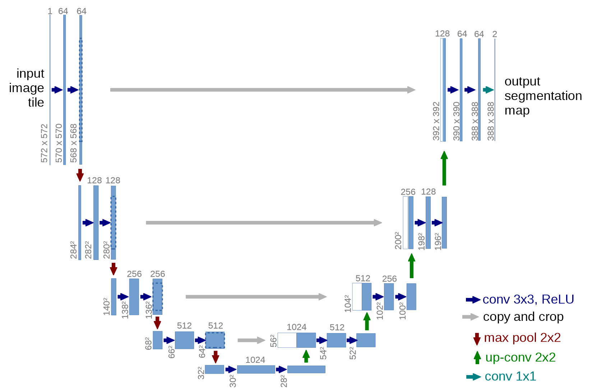

# Application Architectures Deep Dive

# 应用架构深入研究

We are now in the exciting position that we can fully understand the architectures that we have been using for our state-of-the-art models for computer vision, natural language processing, and tabular analysis. In this chapter, we're going to fill in all the missing details on how fastai's application models work and show you how to build the models they use.

现在我们兴奋于对于机器视觉、自然语言处理和表格分析等，我们能够全部理解所使用的先进的模型架构。在本章，我们会补齐fastai应用模型如何工作的所有细节及展示他们所使用的模型是如何创建的。

We will also go back to the custom data preprocessing pipeline we saw in <chapter_midlevel_data> for Siamese networks and show you how you can use the components in the fastai library to build custom pretrained models for new tasks.

We'll start with computer vision.

我们也会返回到在<章节：用中级API做数据整理>中我们看到的自定义数据预处理流水线与展示我们如何使用fastai库中的组件为新任务创建自定义预训练模型。

我们会从计算机视觉开始。

## Computer Vision

## 计算机视觉

For computer vision application we use the functions `cnn_learner` and `unet_learner` to build our models, depending on the task. In this section we'll explore how to build the `Learner` objects we used in Parts 1 and 2 of this book.

根据任务，对于计算机视觉应用，我们使用`cnn_learner`和`unet_learner`来创建我们的模型。在本部门我们会探索使用本书的第一部分和第二部分来如何创建`Learner`对象。

### cnn_learner

### cnn_learner

Let's take a look at what happens when we use the `cnn_learner` function. We begin by passing this function an architecture to use for the *body* of the network. Most of the time we use a ResNet, which you already know how to create, so we don't need to delve into that any further. Pretrained weights are downloaded as required and loaded into the ResNet.

让我们看一下，当使用`cnn_learner`函数时会发生什么。我们首先传递这个函数，用于网络*主体*的一个架构。大多时间我们使用ResNet，这个模型我们已经知道如何创建，所以我们不需要做任何进一步研究。预训练权重需要下载并加载到ResNet中。

Then, for transfer learning, the network needs to be *cut*. This refers to slicing off the final layer, which is only responsible for ImageNet-specific categorization. In fact, we do not slice off only this layer, but everything from the adaptive average pooling layer onwards. The reason for this will become clear in just a moment. Since different architectures might use different types of pooling layers, or even completely different kinds of *heads*, we don't just search for the adaptive pooling layer to decide where to cut the pretrained model. Instead, we have a dictionary of information that is used for each model to determine where its body ends, and its head starts. We call this `model_meta`—here it is for resnet-50:

然后，为了迁移学习，网络需要被*裁剪*。这指的是切掉最后的层，它只是负责ImageNet特定的分类。实际上，我们不仅仅剪切掉这一层，而是从自适应平均池化层开始的一切内容。这样处理的原因稍等一会就会清楚了。因为不同的架构可能使用不同类型的池化层，或甚至使用完全不同类型的*模型头*，我们不仅仅搜索自适应池化层来决定从哪里裁剪预训练模型。相反，我们有一个信息字典，用于搜索模型来决定其模型体的结束位置，和它的模型头的开始位置。我们称此为`model_meta`，下面是对resnet-50操作：

实验代码：

```
model_meta[resnet50]
```

实验输出:

```
{'cut': -2,
 'split': <function fastai.vision.learner._resnet_split(m)>,
 'stats': ([0.485, 0.456, 0.406], [0.229, 0.224, 0.225])}
```

> jargon: Body and Head: The "head" of a neural net is the part that is specialized for a particular task. For a CNN, it's generally the part after the adaptive average pooling layer. The "body" is everything else, and includes the "stem" (which we learned about in <chapter_resnet>).

> 术语：模型体和模型头：神经网络的“头”是专门针对一个特定任务的部分。对于卷积神经网络，它通常是自适应平均池化层后的部分。“体”是其它的所有内容，也包含“stem”（这是我们在<第十四章：残差网络>中学到的）。

If we take all of the layers prior to the cut point of `-2`, we get the part of the model that fastai will keep for transfer learning. Now, we put on our new head. This is created using the function `create_head`:

如果我们剪切 `-2` 这个点之前的所有层，我们获取的模型部分，fastai会保留下来做迁移学习。现在我们创建了新的模型头。这是使用`create_head`函数来创建的：

实验代码:

```
#hide_output
create_head(20,2)
```

实验输出:

```
Sequential(
  (0): AdaptiveConcatPool2d(
    (ap): AdaptiveAvgPool2d(output_size=1)
    (mp): AdaptiveMaxPool2d(output_size=1)
     )
  (1): full: False
  (2): BatchNorm1d(20, eps=1e-05, momentum=0.1, affine=True, track_running_stats=True)
  (3): Dropout(p=0.25, inplace=False)
  (4): Linear(in_features=20, out_features=512, bias=False)
  (5): ReLU(inplace=True)
  (6): BatchNorm1d(512, eps=1e-05, momentum=0.1, affine=True, track_running_stats=True)
  (7): Dropout(p=0.5, inplace=False)
  (8): Linear(in_features=512, out_features=2, bias=False)
  )
Sequential(
  (0): AdaptiveConcatPool2d(
    (ap): AdaptiveAvgPool2d(output_size=1)
    (mp): AdaptiveMaxPool2d(output_size=1)
     )
  (1): Flatten()
  (2): BatchNorm1d(20, eps=1e-05, momentum=0.1, affine=True)
  (3): Dropout(p=0.25, inplace=False)
  (4): Linear(in_features=20, out_features=512, bias=False)
  (5): ReLU(inplace=True)
  (6): BatchNorm1d(512, eps=1e-05, momentum=0.1, affine=True)
  (7): Dropout(p=0.5, inplace=False)
  (8): Linear(in_features=512, out_features=2, bias=False)
  )
```

With this function you can choose how many additional linear layers are added to the end, how much dropout to use after each one, and what kind of pooling to use. By default, fastai will apply both average pooling, and max pooling, and will concatenate the two together (this is the `AdaptiveConcatPool2d` layer). This is not a particularly common approach, but it was developed independently at fastai and other research labs in recent years, and tends to provide some small improvement over using just average pooling.

使用这个函数，我们能够选择在最后添加多少个额外的线性层，每个层后面使用多少个dropout，及使用什么类型的池化。默认的情况下，fastai会应用平均池化和最大池化，并会把两者联系起来（这就是`AdaptiveConcatPool2d`层）。这不是一个特别普通的方法，它是在fastai和其它实验室在近些年独立开发的，且往往比只使用平均池化提供一些小的改进。

fastai is a bit different from most libraries in that by default it adds two linear layers, rather than one, in the CNN head. The reason for this is that transfer learning can still be useful even, as we have seen, when transferring the pretrained model to very different domains. However, just using a single linear layer is unlikely to be enough in these cases; we have found that using two linear layers can allow transfer learning to be used more quickly and easily, in more situations.

fastai有绝大多数库有点不多，默认情况下它在CNN头中添加了两个线性层而不是一个。原因是，正如我们学过的，当迁移预训练模型到一个差异很大的领域时，这样做对迁移学习竟然总是有用的。不论以何种形式，在这些情况下只使用一个线性层是不可能足够的。我们已经发现，在更多情况下，使用两个线性层总是能够允许更快速和更容易的使用迁移学习。

> note: One Last Batchnorm?: One parameter to `create_head` that is worth looking at is `bn_final`. Setting this to `true` will cause a batchnorm layer to be added as your final layer. This can be useful in helping your model scale appropriately for your output activations. We haven't seen this approach published anywhere as yet, but we have found that it works well in practice wherever we have used it.

> 注释：一个最后批次标准化？：`create_head`的一个参数，值得关注的是`bn_final`。设置它为`true`会产生一个批次标准化层，添加到模型并作为你的最后层。这能够有帮于你的模型对于输出激活做到合适的缩放。我们还没有看到这个方法在任何地方发表，但我们已经发现在实践中无论我们在哪里使用它，它都会处理的很好，

Let's now take a look at what `unet_learner` did in the segmentation problem we showed in <chapter_intro>.

现在让我们看看`unet_learner`在<第一章：概述>中谈的分割问题中做了什么。

### unet_learner

### unet_learner

One of the most interesting architectures in deep learning is the one that we used for segmentation in <chapter_intro>. Segmentation is a challenging task, because the output required is really an image, or a pixel grid, containing the predicted label for every pixel. There are other tasks that share a similar basic design, such as increasing the resolution of an image (*super-resolution*), adding color to a black-and-white image (*colorization*), or converting a photo into a synthetic painting (*style transfer*)—these tasks are covered by an [online](https://book.fast.ai/) chapter of this book, so be sure to check it out after you've read this chapter. In each case, we are starting with an image and converting it to some other image of the same dimensions or aspect ratio, but with the pixels altered in some way. We refer to these as *generative vision models*.

深度学习中最有意思的架构之一是我们在<第一章：概述>中对于分割所使用那一种。分割是一个挑战任务，因为输出需要的是一个实际图像，或一个像素格，包含对每个像素的预测标记。还有其它任务共享了相似的基础设计，如增强图像的分辨率（*超分辨率*），对黑白图像添加颜色（*着色*），或一张照片转换为一个合成绘图（*风格迁移*），这些任务在本书的[在线](https://book.fast.ai/)章节都有所介绍，所以你阅读完本章节后要确保了解清楚。每个案例中，我们从一张图像开始，并把它转化化为一些相同尺寸或纵横比的其它图像，但以某种方法改变了像素。我们把这些称为*生成视觉模型*。

The way we do this is to start with the exact same approach to developing a CNN head as we saw in the previous problem. We start with a ResNet, for instance, and cut off the adaptive pooling layer and everything after that. Then we replace those layers with our custom head, which does the generative task.

如我们之前看到的问题，我们做这个的方式是以完全相关的方法来开发一个CNN头。例如，我们从ResNet入手，并裁剪自适应池化层和其后的所有内容。然后我们用可做生成任务的自定义头来替换那些层，

There was a lot of handwaving in that last sentence! How on earth do we create a CNN head that generates an image? If we start with, say, a 224-pixel input image, then at the end of the ResNet body we will have a 7×7 grid of convolutional activations. How can we convert that into a 224-pixel segmentation mask?

最后一名太含糊其辞了！我们到底如何创建一个生成图片的CNN头呢？如果我们从224像素输入图像开始，然后在ResNet体的末尾我们会得到一个 7×7 卷积激活格。我们如何将其转换为一个224像素的分割掩码呢？

Naturally, we do this with a neural network! So we need some kind of layer that can increase the grid size in a CNN. One very simple approach to this is to replace every pixel in the 7×7 grid with four pixels in a 2×2 square. Each of those four pixels will have the same value—this is known as *nearest neighbor interpolation*. PyTorch provides a layer that does this for us, so one option is to create a head that contains stride-1 convolutional layers (along with batchnorm and ReLU layers as usual) interspersed with 2×2 nearest neighbor interpolation layers. In fact, you can try this now! See if you can create a custom head designed like this, and try it on the CamVid segmentation task. You should find that you get some reasonable results, although they won't be as good as our <chapter_intro> results.

我们自然用神经网络做这个工作！所以我们需要某种在CNN中能够增加表格尺寸的层类型。一个非常简单的方法是在 2×2 方框内用四个像素来替换 7×7 表格中的每个像素。那个四像素每个的值都会相同，这被称为*最近邻插值*。PyTorch提供了一个为了我们做这个操作的层，所以一个操作是来创建包含步进 1 卷积层（像往常一样带有批次标准化和ReLU层）穿插有 2×2 最近邻插值层的头。实际上，你现在可以尝试一下！看是否能够创建一个如此设计的自定义头，并在CamVid分割任务上运行一下。你应该可以发现我获得了一些合理的结果，虽然它们没有我们在<第一章：概述>中的结果好。

Another approach is to replace the nearest neighbor and convolution combination with a *transposed convolution*, otherwise known as a *stride half convolution*. This is identical to a regular convolution, but first zero padding is inserted between all the pixels in the input. This is easiest to see with a picture—<transp_conv> shows a diagram from the excellent [convolutional arithmetic paper](https://arxiv.org/abs/1603.07285) we discussed in <chapter_convolutions>, showing a 3×3 transposed convolution applied to a 3×3 image.

别外一个方法是用*转置卷积*替换最近邻和卷积组合，或被称为*步幅半卷积*。这与常规卷积相同，但首个零填充是在输入的所有像素间插入的。用图例<转置卷积>很容易看来，这个图例来自我们在<第十三章：卷积>中所讨论的[卷积算法论文](https://arxiv.org/abs/1603.07285)，展示了应用在 3×3 图像上的 3×3 转置卷积。

<div style="text-align:center">
  <p align="center">
    
  </p>
  <p align="center">图：转置卷积</p>
</div>

As you see, the result of this is to increase the size of the input. You can try this out now by using fastai's `ConvLayer` class; pass the parameter `transpose=True` to create a transposed convolution, instead of a regular one, in your custom head.

如你所见，这个结果是用来增加输入的尺寸。你现在可以用fastai的`ConvLayer`类来尝试一下它的输出；在你的自定义头中，传入参数 `transpose=True` 来创建转置卷积，以替代常规卷积层。

Neither of these approaches, however, works really well. The problem is that our 7×7 grid simply doesn't have enough information to create a 224×224-pixel output. It's asking an awful lot of the activations of each of those grid cells to have enough information to fully regenerate every pixel in the output. The solution to this problem is to use *skip connections*, like in a ResNet, but skipping from the activations in the body of the ResNet all the way over to the activations of the transposed convolution on the opposite side of the architecture. This approach, illustrated in < unet >, was developed by Olaf Ronneberger, Philipp Fischer, and Thomas Brox in the 2015 paper ["U-Net: Convolutional Networks for Biomedical Image Segmentation"](https://arxiv.org/abs/1505.04597). Although the paper focused on medical applications, the U-Net has revolutionized all kinds of generative vision models.

然而，这些方法实际上工作的都不好。问题在于我们的 7×7 简单表格没有足够的信息来创建一个 224×224 像素的输出。这要求那些表格单元的大量激活要有足够的信息来完全生成输出中的每个像素。对于这人问题的解决方案是使用像ResNet中那样的*跳跃连接*，但是从ResNet体中的激活径直跳跃到架构对立面上的转置卷积的激活。这一方法是由奥拉夫·罗尼伯格，菲利普·菲舍尔和托马斯·布鲁克斯在其论文["U-Net：生物医疗图像分割神经网络"](https://arxiv.org/abs/1505.04597)中开发的，如下图<U-Net架构>所求。虽然论文聚焦于医学应用，U-Net已经彻底改革了所有类型的生成视觉模型。

<div style="text-align:center">
  <p align="center">
    
  </p>
  <p align="center">图：U-Net架构</p>
</div>

This picture shows the CNN body on the left (in this case, it's a regular CNN, not a ResNet, and they're using 2×2 max pooling instead of stride-2 convolutions, since this paper was written before ResNets came along) and the transposed convolutional ("up-conv") layers on the right. Then extra skip connections are shown as gray arrows crossing from left to right (these are sometimes called *cross connections*). You can see why it's called a "U-Net!"

这个图例在左侧展示了CNN体（在本例中，它是一个常规CNN，不是ResNet，且他们使用 2×2 最大池化而不是步进2卷积，因为这个论文撰写时间在ResNet面世之前）和在右侧的转置卷积层（“up-conv”）。扩展的跳远连接以从左侧横跨到右侧的灰色箭头形式展示的（所以有时间它被称为*交叉连接*）。我们可以看出为什么它被称为“U-Net”！

With this architecture, the input to the transposed convolutions is not just the lower-resolution grid in the preceding layer, but also the higher-resolution grid in the ResNet head. This allows the U-Net to use all of the information of the original image, as it is needed. One challenge with U-Nets is that the exact architecture depends on the image size. fastai has a unique `DynamicUnet` class that autogenerates an architecture of the right size based on the data provided.

使用这个架构，对转置卷积的输入不仅仅是之前层中的低分辨率表格，也是ResNet头中的高分辨率表格。这使得U-Net根据其需要使用原始图像的所有信息。使用U-Net的一个挑战是确切的架构依赖于图像尺寸大小。fastai有一个独一无二的`DynamicUnet`类，基于先前数据它自动生成一个合适大小的架构。

Let's focus now on an example where we leverage the fastai library to write a custom model.

让我们现在聚焦在一个例子上，利用fastai库来写一个自定义模型。

### A Siamese Network

### 孪生网络

实验代码:

```
#hide
from fastai.vision.all import *
path = untar_data(URLs.PETS)
files = get_image_files(path/"images")

class SiameseImage(fastuple):
    def show(self, ctx=None, **kwargs): 
        img1,img2,same_breed = self
        if not isinstance(img1, Tensor):
            if img2.size != img1.size: img2 = img2.resize(img1.size)
            t1,t2 = tensor(img1),tensor(img2)
            t1,t2 = t1.permute(2,0,1),t2.permute(2,0,1)
        else: t1,t2 = img1,img2
        line = t1.new_zeros(t1.shape[0], t1.shape[1], 10)
        return show_image(torch.cat([t1,line,t2], dim=2), 
                          title=same_breed, ctx=ctx)
    
def label_func(fname):
    return re.match(r'^(.*)_\d+.jpg$', fname.name).groups()[0]

class SiameseTransform(Transform):
    def __init__(self, files, label_func, splits):
        self.labels = files.map(label_func).unique()
        self.lbl2files = {l: L(f for f in files if label_func(f) == l) for l in self.labels}
        self.label_func = label_func
        self.valid = {f: self._draw(f) for f in files[splits[1]]}
        
    def encodes(self, f):
        f2,t = self.valid.get(f, self._draw(f))
        img1,img2 = PILImage.create(f),PILImage.create(f2)
        return SiameseImage(img1, img2, t)
    
    def _draw(self, f):
        same = random.random() < 0.5
        cls = self.label_func(f)
        if not same: cls = random.choice(L(l for l in self.labels if l != cls)) 
        return random.choice(self.lbl2files[cls]),same
    
splits = RandomSplitter()(files)
tfm = SiameseTransform(files, label_func, splits)
tls = TfmdLists(files, tfm, splits=splits)
dls = tls.dataloaders(after_item=[Resize(224), ToTensor], 
    after_batch=[IntToFloatTensor, Normalize.from_stats(*imagenet_stats)])
```

Let's go back to the input pipeline we set up in <chapter_midlevel_data> for a Siamese network. If you remember, it consisted of pair of images with the label being `True` or `False`, depending on if they were in the same class or not.

对于孪生网络，我们返回到<第：数据处理中级API>中设置的输入流水线。如果你还记的，它是由带有被标记`True`和`Flase`的一对图像组成，这个标记取决于他们是否是同一类。

Using what we just saw, let's build a custom model for this task and train it. How? We will use a pretrained architecture and pass our two images through it. Then we can concatenate the results and send them to a custom head that will return two predictions. In terms of modules, this looks like this:

使用我们刚刚看的内容，为这个任务创建一个自定义模型并训练它。怎么做呢？我们会使用一个预训练架构并通过给它传递我们的两张图像。然后我们可以把结果联系起来，发送给他们一个会返回两个预测的自定义头。这样的模型，如下所示：

实验代码:

```
class SiameseModel(Module):
    def __init__(self, encoder, head):
        self.encoder,self.head = encoder,head
    
    def forward(self, x1, x2):
        ftrs = torch.cat([self.encoder(x1), self.encoder(x2)], dim=1)
        return self.head(ftrs)
```

To create our encoder, we just need to take a pretrained model and cut it, as we explained before. The function `create_body` does that for us; we just have to pass it the place where we want to cut. As we saw earlier, per the dictionary of metadata for pretrained models, the cut value for a resnet is `-2`:

创建编码器，我们只需要按照之前解释的那样，取一个预训练模型并裁剪它。`create_body`函数为我们做了这个工作，我们只需要传递给这个函数我们希望裁剪的位置。如我们之前学习到的，对于预训练模型的每个元数据字典，resnet的裁剪值是 `-2`：

实验代码:

```
encoder = create_body(resnet34, cut=-2)
```

Then we can create our head. A look at the encoder tells us the last layer has 512 features, so this head will need to receive `512*2`. Why 2? We have to multiply by 2 because we have two images. So we create the head as follows:

然后我们就能够创建模型头了。查看编码器我们会知道最后的层有 512 个特征，所以这个头会需要接收 `512*2`。为什么是 2？我们必须乘以 2 ，因为我们有两张图像。下面是我们创建模型头的代码：

实验代码:

```
head = create_head(512*2, 2, ps=0.5)
```

With our encoder and head, we can now build our model:

有了编码器和模型头，我们现在能够创建模型了：

实验代码:

```
model = SiameseModel(encoder, head)
```

Before using `Learner`, we have two more things to define. First, we must define the loss function we want to use. It's regular cross-entropy, but since our targets are Booleans, we need to convert them to integers or PyTorch will throw an error:

使用`Learner`之前，我们需要确定两个以上的事项。首先，我们必须确定希望使用的损失函数（loss）。它是常规的交叉熵，但因为我们的目标是布尔型，我们需要把他们转换为整型，否则PyTorch会抛出错误提示：

实验代码:

```
def loss_func(out, targ):
    return nn.CrossEntropyLoss()(out, targ.long())
```

More importantly, to take full advantage of transfer learning, we have to define a custom *splitter*. A splitter is a function that tells the fastai library how to split the model into parameter groups. These are used behind the scenes to train only the head of a model when we do transfer learning.

更重要的是，要取得迁移学习的所有优点，我们必须定义一个自定义*分割器*（splitter），一个分割器就是一个函数，它告诉fastai库如何分割模型为参数组。当我们做迁移学习时，这些用于后台只训练模型的头。

Here we want two parameter groups: one for the encoder and one for the head. We can thus define the following splitter (`params` is just a function that returns all parameters of a given module):

在这里我们希望两个参数组：一个为编码器和一个为模型头。因为我们可以定义如下的分割器（`params`只是一个返回给定模型所有参数的函数）：

实验代码:

```
def siamese_splitter(model):
    return [params(model.encoder), params(model.head)]
```

Then we can define our `Learner` by passing the data, model, loss function, splitter, and any metric we want. Since we are not using a convenience function from fastai for transfer learning (like `cnn_learner`), we have to call `learn.freeze` manually. This will make sure only the last parameter group (in this case, the head) is trained:

然后我们通过传递数据、模型、损失函数，及任何我们需要的指标来定义我们的`Learner`。因为我们为迁移学习没有使用fastai的的便捷函数（如`cnn_learner`），我们必须手动调用`learn.freeze`。这会确保只有最后的参数组（在这个事例中，是模型头）被训练：

实验代码:

```
learn = Learner(dls, model, loss_func=loss_func, 
                splitter=siamese_splitter, metrics=accuracy)
learn.freeze()
```

Then we can directly train our model with the usual methods:

然后我们直接用常用的方法来训练我们的模型：

实验代码:

```
learn.fit_one_cycle(4, 3e-3)
```

实验输出:

| epoch | train_loss | valid_loss | accuracy |  time |
| ----: | ---------: | ---------: | -------: | ----: |
|     0 |   0.367015 |   0.281242 | 0.885656 | 00:26 |
|     1 |   0.307688 |   0.214721 | 0.915426 | 00:26 |
|     2 |   0.275221 |   0.170615 | 0.936401 | 00:26 |
|     3 |   0.223771 |   0.159633 | 0.943843 | 00:26 |

Before unfreezing and fine-tuning the whole model a bit more with discriminative learning rates (that is: a lower learning rate for the body and a higher one for the head):

在解冻与微调整个模型之前，要多用一点有区分的学习率（即：模型体是更低的学习率，模型头是更高的学习率）：

实验代码:

```
learn.unfreeze()
learn.fit_one_cycle(4, slice(1e-6,1e-4))
```

实验输出:

| epoch | train_loss | valid_loss | accuracy |  time |
| ----: | ---------: | ---------: | -------: | ----: |
|     0 |   0.212744 |   0.159033 | 0.944520 | 00:35 |
|     1 |   0.201893 |   0.159615 | 0.942490 | 00:35 |
|     2 |   0.204606 |   0.152338 | 0.945196 | 00:36 |
|     3 |   0.213203 |   0.148346 | 0.947903 | 00:36 |

94.8% is very good when we remember a classifier trained the same way (with no data augmentation) had an error rate of 7%.

Now that we've seen how to create complete state-of-the-art computer vision models, let's move on to NLP.

94.8%是非常好的结果，我们记得以同样的方式（没有做数据增强）训练一个分类器时有7%的错误率。

现在我们已经学习了如何创建完整的先进的计算机视觉模型。现在让我们来学习一下自然语言处理（NLP）。

## Natural Language Processing

## 自然语言处理

Converting an AWD-LSTM language model into a transfer learning classifier, as we did in <chapter_nlp>, follows a very similar process to what we did with `cnn_learner` in the first section of this chapter. We do not need a "meta" dictionary in this case, because we do not have such a variety of architectures to support in the body. All we need to do is select the stacked RNN for the encoder in the language model, which is a single PyTorch module. This encoder will provide an activation for every word of the input, because a language model needs to output a prediction for every next word.

正如我们在<第十章：自然语言处理>中做的，把AWD-LSTM语言模型转换为迁移学习分类器，遵循了我们在本章第一部分中用`cnn_learner`做的非常相似的内容过程。在本案例中，我们不需要“元数据”字典，因为在模型体中我们没有此种类的架构。我们所需要做的是在语言模型中为编码器选择叠加的RNN，它是一个单PyTorch模型。这个编码会为每个输入的词提供一个激活，因为语言模型需要为每下个词输出预测。

To create a classifier from this we use an approach described in the [ULMFiT paper](https://arxiv.org/abs/1801.06146) as "BPTT for Text Classification (BPT3C)":

我们使用[ULMFiT 论文](https://arxiv.org/abs/1801.06146)中描述的方法用于“用于文本分类的BPTT（BPT3C）”来为其创建一个分类器：

> : We divide the document into fixed-length batches of size *b*. At the beginning of each batch, the model is initialized with the final state of the previous batch; we keep track of the hidden states for mean and max-pooling; gradients are back-propagated to the batches whose hidden states contributed to the final prediction. In practice, we use variable length backpropagation sequences.

> ：我们将文档划分为大小为*b*的固定长度批次。每个批次的一开始，模型用之前批次的最终状态做初始化；我们记录平均与最大池化的隐藏状态；梯度被反向传播到隐含状态对最终预测具有贡献的批次。实际上，我们使用变长反向传播序列。

In other words, the classifier contains a `for` loop, which loops over each batch of a sequence. The state is maintained across batches, and the activations of each batch are stored. At the end, we use the same average and max concatenated pooling trick that we use for computer vision models—but this time, we do not pool over CNN grid cells, but over RNN sequences.

换句话话，分类器包含一个`for`循环，其循环遍历一个序列的每个批次。状态是跨批次维持的，且每个批次的激活被保存下来。在最终，我们使用同样用于计算机视觉模型的平均和最大连接池化技巧。但这次，我们在CNN表格单元上不做池化，而是在RNN序列上做。

For this `for` loop we need to gather our data in batches, but each text needs to be treated separately, as they each have their own labels. However, it's very likely that those texts won't all be of the same length, which means we won't be able to put them all in the same array, like we did with the language model.

对于这个`for`循环，我们需要在批次中收集我们的数据，但每个文本需要被分割处理，因为他们每个都有自己的标签。然而那些文本非常可以具有相同的长度，就像我们用语言模型做的那样，这意味我们不能够把他们放在相同的数组中。

That's where padding is going to help: when grabbing a bunch of texts, we determine the one with the greatest length, then we fill the ones that are shorter with a special token called `xxpad`. To avoid extreme cases where we have a text with 2,000 tokens in the same batch as a text with 10 tokens (so a lot of padding, and a lot of wasted computation), we alter the randomness by making sure texts of comparable size are put together. The texts will still be in a somewhat random order for the training set (for the validation set we can simply sort them by order of length), but not completely so.

这就是填充的作用所在：当抓取一个批次文本，我们要确定最长的那一个文本，然后我们用一个称为`xxpad`的特定令牌来填充那些短的文本。为避免在相同的批次中我们有的文本有2000个令牌，有的文本有10个令牌的极端事例发生（因为有大约的填充，和有大量多余计算），我们通过确保相似大小文本放在一起改变随机性。对于训练集文本会始终处于一个随机排序的状态（对于验证集我们通过他们的长度做简单的配需），然而并不是完全如此。

This is done automatically behind the scenes by the fastai library when creating our `DataLoaders`.

当我们创建我们的`DataLoaders`时，这是通过fastai库在后台自动完成的。

## Tabular

## 表格

Finally, let's take a look at `fastai.tabular` models. (We don't need to look at collaborative filtering separately, since we've already seen that these models are just tabular models, or use the dot product approach, which we've implemented earlier from scratch.)

最后，我们学习一下`fastai.tabular`模型。（我们不需要单独看协同过滤，因为我们已经发现这些模型只是表格模型，或使用了点积方法，之前我们已经从零开始实现过的。）

Here is the `forward` method for `TabularModel`:

下面是`TabularModel`模型的`forward`方法的代码：

```python
if self.n_emb != 0:
    x = [e(x_cat[:,i]) for i,e in enumerate(self.embeds)]
    x = torch.cat(x, 1)
    x = self.emb_drop(x)
if self.n_cont != 0:
    x_cont = self.bn_cont(x_cont)
    x = torch.cat([x, x_cont], 1) if self.n_emb != 0 else x_cont
return self.layers(x)
```

We won't show `__init__` here, since it's not that interesting, but we will look at each line of code in `forward` in turn. The first line:

在这里我们不会展示`__init__`函数，因为它不是那么有趣，但我们会依次查看`forward`中的每一行代码。

第一行代码：

```python
if self.n_emb != 0:
```

is just testing whether there are any embeddings to deal with—we can skip this section if we only have continuous variables. `self.embeds` contains the embedding matrices, so this gets the activations of each:

这只是判断，是否有嵌入需要处理，如果我们只有连续变量可以略过这一部分。`self.embeds`包含了嵌入矩阵，所以这获得了每个矩阵的激活：

```python
    x = [e(x_cat[:,i]) for i,e in enumerate(self.embeds)]
```

and concatenates them into a single tensor:

并把他们串联为一个单一张量：

```python
    x = torch.cat(x, 1)
```

Then dropout is applied. You can pass `embd_p` to `__init__` to change this value:

然后应用dropout。你可以传递`embd_p`给`__init___`来改变这个变量：

```python
    x = self.emb_drop(x)
```

Now we test whether there are any continuous variables to deal with:

现在判断是否存在任何连续变量需要处理：

```python
if self.n_cont != 0:
```

They are passed through a batchnorm layer:

他们传递了一个批次标准化层：

```python
    x_cont = self.bn_cont(x_cont)
```

and concatenated with the embedding activations, if there were any:

如果有嵌入需要处理，同时会与嵌入激活连接：

```python
    x = torch.cat([x, x_cont], 1) if self.n_emb != 0 else x_cont
```

Finally, this is passed through the linear layers (each of which includes batchnorm, if `use_bn` is `True`, and dropout, if `ps` is set to some value or list of values):

最后，传递了线性层（如果`use_bn`是`True`，每个都会包含批次标准化层，如果`ps`设置了某个值或值列表，会包含dropout层）：

```python
return self.layers(x)
```

Congratulations! Now you know every single piece of the architectures used in the fastai library!

恭喜！现在你知道了fastai库中所使用架构的每一部分！

## Wrapping Up Architectures

## 架构总结

As you can see, the details of deep learning architectures need not scare you now. You can look inside the code of fastai and PyTorch and see just what is going on. More importantly, try to understand *why* it's going on. Take a look at the papers that are being referenced in the code, and try to see how the code matches up to the algorithms that are described.

如你所见，现在深度学习架构细节不会让你感到害怕。你能够看到fastai和PyTorch的内部代码，并看到发生了什么。更重要的是，尝试理解*为什么*它会这样。花点时间看一下代码中所参考的论文，并尝试看一下代码匹配的算法是如何描述的。

Now that we have investigated all of the pieces of a model and the data that is passed into it, we can consider what this means for practical deep learning. If you have unlimited data, unlimited memory, and unlimited time, then the advice is easy: train a huge model on all of your data for a really long time. But the reason that deep learning is not straightforward is because your data, memory, and time are typically limited. If you are running out of memory or time, then the solution is to train a smaller model. If you are not able to train for long enough to overfit, then you are not taking advantage of the capacity of your model.

现在我们已经了解了模型的所有部分和传递给他的数据，我们可以思考对于实践深度学习这意味着什么。如果我们有无穷的数据，不限的内存和无穷的时间，那么建议是简单了：在一个相当长的时间在你的所有数据上训练一个巨大的模型。但由于深度学习不会这么简单，是因为你的数据、内存和时间通过是有限的。如果你在运行时内存不足或时间不足，那么解决方案是训练一个更小的模型。如果你不能训练模型相当长的时间知道过拟，那么你就不会获得模型能力的优势。

So, step one is to get to the point where you can overfit. Then the question is how to reduce that overfitting. <reduce_overfit> shows how we recommend prioritizing the steps from there.

所以，第一步是获得你能够过拟的点。然后的问题是如果减小过拟。图<减小过拟>展示了在这里我们如何建议的优先步骤顺序。

<div style="text-align:center">
  <p align="center">
    
  </p>
  <p align="center">图：减小过拟</p>
</div>

Many practitioners, when faced with an overfitting model, start at exactly the wrong end of this diagram. Their starting point is to use a smaller model, or more regularization. Using a smaller model should be absolutely the last step you take, unless training your model is taking up too much time or memory. Reducing the size of your model reduces the ability of your model to learn subtle relationships in your data.

很多从业人员，当面对过拟模型时，完全错误的从这个图例的末端开始。他们开始的点是使用一个更小的模型，和更多的正则化。使用一个更小的模型应该绝对是你采取的最后步骤，除非你的模型化费了太多的时间和占用了太多内存。压缩你的模型大小减小你的模型能力来学习你的数据中微妙的联系。

Instead, your first step should be to seek to *create more data*. That could involve adding more labels to data that you already have, finding additional tasks that your model could be asked to solve (or, to think of it another way, identifying different kinds of labels that you could model), or creating additional synthetic data by using more or different data augmentation techniques. Thanks to the development of Mixup and similar approaches, effective data augmentation is now available for nearly all kinds of data.

相反，你的第一步应该是寻求*创建更多数据*。这牵扯到在你已有的数据上添加更多的标记，寻找你的模型能够被要求解决的附加任务（或，思考其它方法，识别你能够建模的不同类型的标签），或通过使用更多或不同的数据增强技术创建附加的合成数据。感谢Mixup和类似方法的发展，有效的数据增加现在可用于几乎所有类型的数据。

Once you've got as much data as you think you can reasonably get hold of, and are using it as effectively as possible by taking advantage of all the labels that you can find and doing all the augmentation that makes sense, if you are still overfitting you should think about using more generalizable architectures. For instance, adding batch normalization may improve generalization.

一旦你获取到了你能够合理掌握的一样多的数据，和通过利用你所能发现的所有标签尽可能有效的使用它，及做有意义的所有增强，如果你还是过拟，你应该思考使用更加可泛华的架构。例如，增加批次标准化可以改善泛化。

If you are still overfitting after doing the best you can at using your data and tuning your architecture, then you can take a look at regularization. Generally speaking, adding dropout to the last layer or two will do a good job of regularizing your model. However, as we learned from the story of the development of AWD-LSTM, it is often the case that adding dropout of different types throughout your model can help even more. Generally speaking, a larger model with more regularization is more flexible, and can therefore be more accurate than a smaller model with less regularization.

尽你最大的努力使用了你的数据和调整了你的架构后，还是过拟，那么你可以思考一下正则化。通过来说，在最后一层或两层添加dropout正则化你的模型会做的很好。因此，正如我们从AWD-LSTM发展的故事中学习的，往往是在你的整个模型中添加不同类型的dropout竟然可获得更多的帮助。通常来说，一个带有更多正则化的更大模型是更加复杂的，因此相比带有较少正则化的更小模型能够更加的精准。

Only after considering all of these options would we recommend that you try using a smaller version of your architecture.

只有思考过所有的这些操作，也许我们会建议你尝试使用你的架构的更小版本。

## Questionnaire

## 练习题

1. What is the "head" of a neural net?
2. What is the "body" of a neural net?
3. What is "cutting" a neural net? Why do we need to do this for transfer learning?
4. What is `model_meta`? Try printing it to see what's inside.
5. Read the source code for `create_head` and make sure you understand what each line does.
6. Look at the output of `create_head` and make sure you understand why each layer is there, and how the `create_head` source created it.
7. Figure out how to change the dropout, layer size, and number of layers created by `cnn_learner`, and see if you can find values that result in better accuracy from the pet recognizer.
8. What does `AdaptiveConcatPool2d` do?
9. What is "nearest neighbor interpolation"? How can it be used to up sample convolutional activations?
10. What is a "transposed convolution"? What is another name for it?
11. Create a conv layer with `transpose=True` and apply it to an image. Check the output shape.
12. Draw the U-Net architecture.
13. What is "BPTT for Text Classification" (BPT3C)?
14. How do we handle different length sequences in BPT3C?
15. Try to run each line of `TabularModel.forward` separately, one line per cell, in a notebook, and look at the input and output shapes at each step.
16. How is `self.layers` defined in `TabularModel`?
17. What are the five steps for preventing over-fitting?
18. Why don't we reduce architecture complexity before trying other approaches to preventing overfitting?

1. 什么是神经网络的“头”？
2. 什么是神经网络的“体”
3. 什么是“裁剪”一个神经网络？对于迁移学习我们为什么需要做这个工作？
4. 什么是`model_meta`？尝试打印输出它的内容看它里面是什么。
5. 读一下`create_head`的源代码并确保你理解了每一行所做的操作。
6. 看一下`create_head`的输出并确保你理解每层为什么是在这里，且`create_head`源如何创建的它。
7. 思考如何改变dropout、层的大小和通过`cnn_learner`所创建的层的数量，看是否你能够找到来自宠物分类器的更好的精度结果值。
8. `AdaptiveConcatPool2d`做了什么操作？
9. 什么是“最近邻插值”？它如何使用提升简单卷积的激活？
10. 什么是“转置卷积”？它的另一个名字是什么？
11. 创建一个`transpose=True`的卷积层并把它应用到一张图像上。检查输出的形状。
12. 画出U-Net架构。
13. 什么是“用于文本分类的BPTT（BPT3C）”？
14. 在BPT3C中我们如何处理不同的长度序列？
15. 尝试分别运行``TabularModel.forward`的每一行代码，在notebook中每个单元一行代码。并查看第一步输入和输出的形态。
16. 在`TabularModel`中`self.layers`是如何定义的？
17. 为了预防过拟的五个步骤是什么？
18. 在尝试其它方法来预防过拟之前为什么我们不能减小架构的复杂度？

### Further Research

### 深入研究

1. Write your own custom head and try training the pet recognizer with it. See if you can get a better result than fastai's default.
2. Try switching between `AdaptiveConcatPool2d` and `AdaptiveAvgPool2d` in a CNN head and see what difference it makes.
3. Write your own custom splitter to create a separate parameter group for every ResNet block, and a separate group for the stem. Try training with it, and see if it improves the pet recognizer.
4. Read the online chapter about generative image models, and create your own colorizer, super-resolution model, or style transfer model.
5. Create a custom head using nearest neighbor interpolation and use it to do segmentation on CamVid.

1. 编写你自己定义的头并用它尝试训练宠物分类器。看你是否能够获得比fastai默认情况下更好的结果。
2. 在CNN头中尝试在`AdaptiveConcatPool2d`和`AdaptiveAvgPool2d`间转换，并看它会产生什么不同。
3. 编写你自己定义的分割器为每个ResNet块创建一个单独的参数组，或为stem创建一个独立的组。尝试训练它，并看它是否改善了宠物分类器。
4. 阅读生成图像模型的在线文章，创建你自己的颜色生成器，超分辨模型，或风格迁移模型。
5. 使用最近邻插值创建一个自定义头，并用它在CamVid上做分割。
